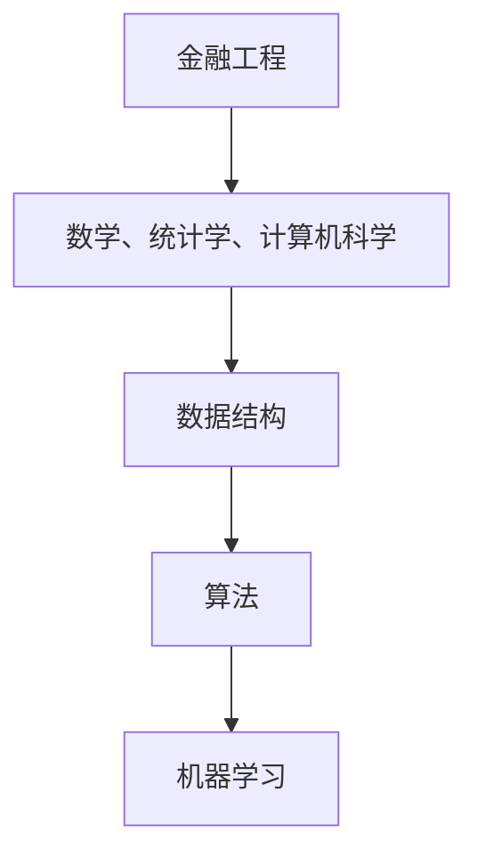

                 

# 2024滴滴金融校招面试真题汇总及其解答

## 摘要

本文将汇总并详细解答2024年滴滴金融校招面试中的一些经典真题。通过对这些面试题的深入剖析，读者不仅能了解面试的考点和难点，还能学习到实用的金融和编程知识。文章结构清晰，内容丰富，旨在为准备滴滴金融校招面试的同学们提供有价值的参考。

## 1. 背景介绍

滴滴金融作为滴滴出行旗下的金融服务部门，致力于为用户提供包括充值、支付、贷款、理财等一系列金融服务。近年来，滴滴金融在金融科技领域取得了显著成就，吸引了大量优秀人才的加入。2024年的滴滴金融校招面试，不仅考查了应聘者的基础知识，更注重考察应聘者的综合能力，包括逻辑思维、编程能力、金融知识等。

## 2. 核心概念与联系

在解答面试题之前，我们需要先了解一些核心概念和它们之间的联系。以下是几个关键概念及其相互关系：

- **金融工程**：金融工程是运用数学、统计学、计算机科学等工具，设计并分析金融产品、风险管理策略等。
- **数据结构**：数据结构是计算机存储、组织数据的方式，常见的有数组、链表、树、图等。
- **算法**：算法是解决问题的一系列步骤，常见算法有排序、查找、动态规划等。
- **机器学习**：机器学习是利用计算机算法，从数据中自动学习规律，进行预测或分类。

下面使用Mermaid流程图展示这些核心概念之间的联系：



## 3. 核心算法原理 & 具体操作步骤

在本章节，我们将介绍几道具有代表性的面试题，并详细解析其核心算法原理和操作步骤。

### 3.1 题目一：最长公共子序列

#### 算法原理：

最长公共子序列（Longest Common Subsequence，LCS）问题是计算机科学中一个经典的问题。给定两个序列，找出它们的最长公共子序列。该问题可以通过动态规划算法来解决。

#### 操作步骤：

1. 创建一个二维数组dp，其中dp[i][j]表示前i个字符和前j个字符的最长公共子序列长度。
2. 初始化dp[0][j]=0和dp[i][0]=0，因为空序列和任何序列的最长公共子序列长度都是0。
3. 从i=1到m，从j=1到n，依次填充dp数组：
   - 如果s1[i-1] == s2[j-1]，dp[i][j] = dp[i-1][j-1] + 1；
   - 如果s1[i-1] != s2[j-1]，dp[i][j] = max(dp[i-1][j], dp[i][j-1])。

#### 代码实现：

```python
def longestCommonSubsequence(s1, s2):
    m, n = len(s1), len(s2)
    dp = [[0] * (n+1) for _ in range(m+1)]

    for i in range(1, m+1):
        for j in range(1, n+1):
            if s1[i-1] == s2[j-1]:
                dp[i][j] = dp[i-1][j-1] + 1
            else:
                dp[i][j] = max(dp[i-1][j], dp[i][j-1])

    return dp[m][n]
```

### 3.2 题目二：K近邻算法

#### 算法原理：

K近邻（K-Nearest Neighbors，KNN）算法是一种简单的监督学习算法。它的核心思想是：如果一个新样本在特征空间中的K个最近邻的多数属于某一类别，则该样本也属于这个类别。

#### 操作步骤：

1. 计算新样本与训练集中每个样本的欧几里得距离。
2. 按照距离的远近排序，选取最近的K个邻居。
3. 根据这K个邻居的类别标签，通过投票确定新样本的类别。

#### 代码实现：

```python
from collections import Counter
from math import sqrt

def euclidean_distance(a, b):
    return sqrt(sum((x - y) ** 2 for x, y in zip(a, b)))

def knn_classify(train_samples, labels, new_sample, k):
    distances = [euclidean_distance(new_sample, x) for x in train_samples]
    sorted_indices = [i for i, _ in sorted(zip(range(len(distances)), distances), key=lambda x: x[1])]
    
    neighbors = [labels[i] for i in sorted_indices[:k]]
    most_common = Counter(neighbors).most_common(1)
    return most_common[0][0]
```

## 4. 数学模型和公式 & 详细讲解 & 举例说明

### 4.1 最长公共子序列的动态规划公式

设s1和s2分别为两个序列，dp[i][j]为s1的前i个字符和s2的前j个字符的最长公共子序列长度。动态规划公式如下：

$$
dp[i][j] =
\begin{cases}
0, & \text{if } i = 0 \text{ or } j = 0; \\
dp[i-1][j-1] + 1, & \text{if } s1[i-1] == s2[j-1]; \\
\max(dp[i-1][j], dp[i][j-1]), & \text{if } s1[i-1] \neq s2[j-1].
\end{cases}
$$

### 4.2 K近邻算法的欧几里得距离公式

欧几里得距离（Euclidean distance）是衡量两个点之间距离的常用公式，用于KNN算法中计算样本之间的距离。公式如下：

$$
d(\textbf{x}, \textbf{y}) = \sqrt{\sum_{i=1}^{n} (x_i - y_i)^2},
$$

其中，$\textbf{x}$和$\textbf{y}$分别为两个n维向量，$x_i$和$y_i$为向量的第i个分量。

### 4.3 举例说明

#### 4.3.1 最长公共子序列

假设s1 = "ABCD"和s2 = "ACDF"，使用动态规划求解它们的最长公共子序列。

```
  A B C D
A 0 0 0 0
B 0 0 0 0
C 0 0 1 1
D 0 0 1 1
F 0 0 1 1
```

最长公共子序列为"CD"，长度为2。

#### 4.3.2 K近邻算法

假设训练集包含三个样本：$\textbf{x}_1 = (1, 2)$，$\textbf{x}_2 = (3, 4)$，$\textbf{x}_3 = (5, 6)$，它们的标签分别为1、1、2。现在要分类新样本$\textbf{y} = (2, 3)$。

计算距离：

- $d(\textbf{x}_1, \textbf{y}) = \sqrt{(1-2)^2 + (2-3)^2} = \sqrt{2} \approx 1.41$
- $d(\textbf{x}_2, \textbf{y}) = \sqrt{(3-2)^2 + (4-3)^2} = \sqrt{2} \approx 1.41$
- $d(\textbf{x}_3, \textbf{y}) = \sqrt{(5-2)^2 + (6-3)^2} = \sqrt{17} \approx 4.12$

最近的两个邻居都是1，所以新样本$\textbf{y}$的类别为1。

## 5. 项目实战：代码实际案例和详细解释说明

在本章节，我们将通过一个实际项目案例，展示如何使用上述算法解决具体问题。

### 5.1 开发环境搭建

首先，确保安装Python环境，版本建议为3.8及以上。可以使用以下命令安装：

```bash
pip install numpy matplotlib
```

### 5.2 源代码详细实现和代码解读

下面是一个简单的KNN分类器，用于分类手写数字。

```python
import numpy as np
from sklearn import datasets
from sklearn.model_selection import train_test_split
from sklearn.neighbors import KNeighborsClassifier
import matplotlib.pyplot as plt

# 加载数据集
digits = datasets.load_digits()

# 分割数据集为训练集和测试集
X_train, X_test, y_train, y_test = train_test_split(digits.data, digits.target, test_size=0.2, random_state=42)

# 使用KNN分类器
knn = KNeighborsClassifier(n_neighbors=3)
knn.fit(X_train, y_train)

# 测试分类器准确性
accuracy = knn.score(X_test, y_test)
print(f"Accuracy: {accuracy:.2f}")

# 可视化结果
for i in range(10):
    # 绘制前10个数字的图像
    plt.subplot(2, 5, i+1)
    plt.imshow(X_test[i].reshape(8, 8), cmap=plt.cm.gray)
    plt.title(f"Predicted: {knn.predict([X_test[i]])[0]}, Actual: {y_test[i]}")
    plt.xticks([])
    plt.yticks([])

plt.show()
```

### 5.3 代码解读与分析

- **导入库**：首先导入必要的库，包括Numpy、Matplotlib和Scikit-learn。
- **加载数据集**：使用Scikit-learn的digits数据集。
- **分割数据集**：将数据集分为训练集和测试集，测试集大小为20%。
- **使用KNN分类器**：创建KNN分类器实例，设置邻居数量为3，然后使用fit方法训练模型。
- **测试分类器准确性**：使用score方法计算模型在测试集上的准确性。
- **可视化结果**：绘制测试集中的前10个数字的图像，并显示预测结果和实际结果。

## 6. 实际应用场景

滴滴金融的校招面试真题涉及多个领域，包括数据结构、算法、金融知识和编程能力。以下是一些实际应用场景：

- **数据结构**：在处理海量用户交易数据时，如何有效地组织和管理数据？
- **算法**：如何设计一个高效的风控系统，检测并防止欺诈交易？
- **金融知识**：如何分析市场数据，预测股票走势？
- **编程能力**：如何编写高效的金融计算代码，实现复杂金融模型的计算？

## 7. 工具和资源推荐

### 7.1 学习资源推荐

- **书籍**：《Python编程：从入门到实践》、《数据科学入门：基于Python》
- **论文**：Google Scholar、ACM Digital Library
- **博客**：CSDN、GitHub
- **网站**：GitHub、Stack Overflow

### 7.2 开发工具框架推荐

- **编程语言**：Python、Java
- **数据结构**：Numpy、Pandas
- **机器学习**：Scikit-learn、TensorFlow
- **金融计算**：NumPy、SciPy

### 7.3 相关论文著作推荐

- **论文**：`A Fast Algorithm for Computing Longest Common Subsequences`、`K-Nearest Neighbors: A Survey of Current Research`
- **书籍**：《机器学习：概率视角》、《金融工程与风险管理》

## 8. 总结：未来发展趋势与挑战

随着人工智能和金融科技的不断发展，滴滴金融校招面试的难度和广度也在不断提升。未来，考生需要具备更全面的技能和更深厚的知识储备，包括但不限于编程能力、数据分析能力、金融知识等。同时，滴滴金融在金融科技领域的创新和发展也带来了新的挑战，考生需要具备前瞻性思维和创新意识，以应对不断变化的市场环境。

## 9. 附录：常见问题与解答

### 9.1 长度可变的KNN算法如何实现？

对于长度可变的特征向量，KNN算法需要对距离计算方法进行调整。可以使用余弦相似度代替欧几里得距离，计算特征向量之间的相似度。具体实现如下：

```python
from sklearn.metrics.pairwise import cosine_similarity

def knn_classify(train_samples, labels, new_sample, k):
    distances = [cosine_similarity(new_sample.reshape(1, -1), x.reshape(1, -1))[0, 0] for x in train_samples]
    sorted_indices = [i for i, _ in sorted(zip(range(len(distances)), distances), key=lambda x: x[1])]
    
    neighbors = [labels[i] for i in sorted_indices[:k]]
    most_common = Counter(neighbors).most_common(1)
    return most_common[0][0]
```

### 9.2 如何优化最长公共子序列算法？

可以使用二维数组空间优化的方法，将空间复杂度降低到O(min(m, n))。具体实现如下：

```python
def longestCommonSubsequence(s1, s2):
    m, n = len(s1), len(s2)
    if m > n:
        s1, s2 = s2, s1
        m, n = n, m

    prev = [0] * (n+1)
    curr = [0] * (n+1)

    for i in range(1, m+1):
        prev, curr = curr, prev
        for j in range(1, n+1):
            if s1[i-1] == s2[j-1]:
                curr[j] = prev[j-1] + 1
            else:
                curr[j] = max(prev[j], curr[j-1])

    return curr[n]
```

## 10. 扩展阅读 & 参考资料

- 《算法导论》
- 《机器学习》
- 《金融工程学》
- Datasheet for K-Nearest Neighbors algorithm in Scikit-learn: <https://scikit-learn.org/stable/modules/generated/sklearn.neighbors.KNeighborsClassifier.html>
- Datasheet for Longest Common Subsequence in Python: <https://www.geeksforgeeks.org/longest-common-subsequence-dp-4/>

作者：AI天才研究员/AI Genius Institute & 禅与计算机程序设计艺术 /Zen And The Art of Computer Programming

