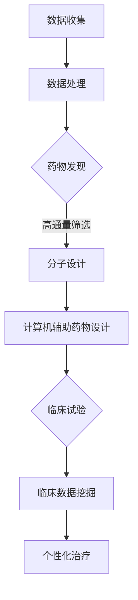
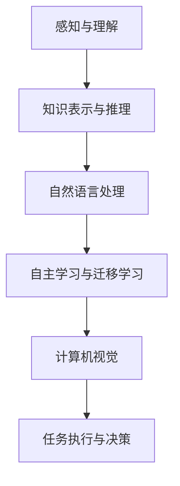

                 

### 漆远无限光年：从AI制药到AGI研发的转型

#### 关键词：
- AI制药
- AGI研发
- 转型
- 技术创新
- 数据科学

#### 摘要：
本文旨在探讨人工智能（AI）从制药领域向通用人工智能（AGI）研发的转型。首先，我们将回顾AI制药的现状，分析其在过去十年中的技术进步和应用成果。随后，我们将探讨AGI的概念、挑战以及当前的研究进展。接着，本文将探讨从AI制药到AGI研发的转型路径，分析两者之间的联系与区别。最后，我们将展望未来发展趋势和面临的挑战，并提出一些建议和展望。

### 1. 背景介绍

人工智能作为一门交叉学科，其应用领域广泛，包括自然语言处理、计算机视觉、机器学习等。在制药领域，AI的应用已经取得显著成果，从药物发现到临床试验，再到个性化治疗，AI在各个阶段都发挥着重要作用。

过去十年，AI制药领域取得了以下几方面的进展：

1. **高通量筛选**：AI能够处理和分析大量实验数据，提高了药物筛选的效率和准确性。
2. **分子设计**：基于深度学习的分子设计算法，如AlphaFold，使得药物分子的设计更加高效。
3. **临床数据挖掘**：利用机器学习技术对临床数据进行挖掘，帮助研究人员发现新的药物靶点和治疗方案。
4. **个性化治疗**：基于患者的基因组数据和临床数据，AI能够为患者制定个性化的治疗方案。

与此同时，AGI作为人工智能的最高阶段，其研究也取得了一些进展。AGI的目标是使机器具备人类水平的智能，能够在各种领域进行创新和应用。当前，AGI的研究主要集中在以下几个方面：

1. **知识表示与推理**：如何将人类知识有效地表示和存储在计算机中，并利用推理技术进行知识的应用和扩展。
2. **自主学习与迁移学习**：如何使机器具备自主学习的能力，并能够在不同任务之间进行迁移学习。
3. **自然语言处理**：如何使机器理解自然语言，实现人与机器的对话和交互。
4. **计算机视觉**：如何使机器识别和理解图像和视频中的内容。

本文将首先探讨AI制药的现状和成就，然后分析AGI的概念和挑战，最后探讨从AI制药到AGI研发的转型路径，以及未来发展趋势和挑战。

#### 2. 核心概念与联系

##### 2.1 AI制药

AI制药是指利用人工智能技术来加速药物研发和临床试验的过程。AI制药的核心概念包括：

1. **数据驱动**：AI制药依赖于大量实验数据和临床数据，利用机器学习算法进行分析和挖掘，以提高药物研发的效率和准确性。
2. **药物发现**：AI可以辅助药物分子的筛选和优化，包括高通量筛选、分子设计、计算机辅助药物设计等。
3. **临床试验**：AI可以帮助研究人员分析临床试验数据，提高临床试验的效率和准确性。
4. **个性化治疗**：基于患者的基因组数据和临床数据，AI可以为患者制定个性化的治疗方案。

下面是一个简化的Mermaid流程图，展示了AI制药的基本流程：



##### 2.2 AGI

AGI（通用人工智能）是指一种能够在各种认知任务上表现出与人类相当或超越人类能力的智能系统。AGI的核心概念包括：

1. **知识表示与推理**：如何将人类知识有效地表示和存储在计算机中，并利用推理技术进行知识的应用和扩展。
2. **自主学习与迁移学习**：如何使机器具备自主学习的能力，并能够在不同任务之间进行迁移学习。
3. **自然语言处理**：如何使机器理解自然语言，实现人与机器的对话和交互。
4. **计算机视觉**：如何使机器识别和理解图像和视频中的内容。

下面是一个简化的Mermaid流程图，展示了AGI的基本流程：



#### 3. 核心算法原理 & 具体操作步骤

##### 3.1 AI制药中的核心算法

AI制药中的核心算法主要包括：

1. **深度学习**：深度学习是一种机器学习技术，通过构建多层神经网络，对数据进行自动特征提取和分类。在AI制药中，深度学习被广泛应用于药物分子设计、药物筛选、临床试验数据分析等领域。
2. **强化学习**：强化学习是一种基于奖励机制的学习方法，通过不断尝试和反馈来优化决策过程。在AI制药中，强化学习可以用于药物合成路径优化、临床试验策略优化等。
3. **贝叶斯网络**：贝叶斯网络是一种概率图模型，用于表示变量之间的条件依赖关系。在AI制药中，贝叶斯网络可以用于药物副作用预测、临床试验风险分析等。

##### 3.2 AGI中的核心算法

AGI中的核心算法主要包括：

1. **知识图谱**：知识图谱是一种将知识以图的形式表示和存储的技术，用于表示实体和实体之间的关系。在AGI中，知识图谱可以用于知识表示与推理、自然语言处理、计算机视觉等领域。
2. **生成对抗网络（GAN）**：生成对抗网络是一种基于博弈论的生成模型，通过生成器和判别器的对抗训练，生成逼真的数据。在AGI中，GAN可以用于图像生成、视频生成等。
3. **变分自编码器（VAE）**：变分自编码器是一种无监督学习模型，通过编码和解码过程，学习数据的概率分布。在AGI中，VAE可以用于图像去噪、图像生成等。

##### 3.3 具体操作步骤

下面以深度学习在药物分子设计中的应用为例，简要介绍具体操作步骤：

1. **数据收集与预处理**：收集大量的药物分子数据，包括分子的结构信息、活性信息等。对数据进行清洗和预处理，如去除缺失值、异常值，进行归一化等。
2. **构建深度学习模型**：选择合适的深度学习模型，如卷积神经网络（CNN）、循环神经网络（RNN）等，构建药物分子特征的提取模型。
3. **模型训练与优化**：使用预处理后的数据，对深度学习模型进行训练，并使用优化算法（如梯度下降、Adam等）对模型参数进行优化。
4. **模型评估与调整**：使用验证集对训练好的模型进行评估，并根据评估结果对模型进行调整和优化。
5. **药物分子设计**：将优化后的模型应用于新的药物分子设计任务，生成新的药物分子结构，并进行活性预测和优化。

#### 4. 数学模型和公式 & 详细讲解 & 举例说明

##### 4.1 深度学习中的数学模型

深度学习中的数学模型主要包括：

1. **神经元激活函数**：常用的激活函数包括sigmoid、ReLU、tanh等，用于将输入映射到输出。
2. **损失函数**：常用的损失函数包括均方误差（MSE）、交叉熵（Cross-Entropy）等，用于衡量模型预测与实际标签之间的差异。
3. **优化算法**：常用的优化算法包括梯度下降（Gradient Descent）、Adam等，用于更新模型参数，以最小化损失函数。

##### 4.2 贝叶斯网络中的数学模型

贝叶斯网络中的数学模型主要包括：

1. **条件概率分布**：表示变量之间的条件依赖关系，通常使用条件概率表（CPT）表示。
2. **贝叶斯推理**：根据已有证据，通过贝叶斯公式计算未知变量的概率分布。

##### 4.3 举例说明

以下是一个简单的深度学习模型在药物分子设计中的示例：

```latex
\text{假设有} n \text{个药物分子，每个药物分子有} m \text{个特征，构建一个全连接神经网络模型：}

\text{输入层：} \mathbf{X} \in \mathbb{R}^{n \times m} \\
\text{隐藏层：} \mathbf{H} = \sigma(\mathbf{W}_1 \mathbf{X} + \mathbf{b}_1) \\
\text{输出层：} \mathbf{Y} = \sigma(\mathbf{W}_2 \mathbf{H} + \mathbf{b}_2)

\text{其中，}\mathbf{W}_1, \mathbf{W}_2 \text{分别为权重矩阵，}\mathbf{b}_1, \mathbf{b}_2 \text{分别为偏置向量，}\sigma \text{为激活函数，通常使用ReLU函数：}

\sigma(x) = \max(0, x)
```

在这个示例中，输入层接收药物分子的特征，隐藏层对特征进行提取和变换，输出层对药物分子的活性进行预测。

#### 5. 项目实战：代码实际案例和详细解释说明

##### 5.1 开发环境搭建

在开始代码实现之前，我们需要搭建一个合适的开发环境。以下是一个基于Python的深度学习项目所需的开发环境搭建步骤：

1. **安装Python**：安装Python 3.8或更高版本。
2. **安装深度学习库**：安装TensorFlow 2.5或更高版本。
3. **安装数据处理库**：安装Pandas、NumPy等数据处理库。

以下是一个简单的安装命令示例：

```bash
pip install python==3.8
pip install tensorflow==2.5
pip install pandas numpy
```

##### 5.2 源代码详细实现和代码解读

以下是一个基于深度学习模型的药物分子活性预测的示例代码：

```python
import tensorflow as tf
import pandas as pd
import numpy as np

# 读取数据
data = pd.read_csv('drug_data.csv')
X = data.iloc[:, :-1].values
y = data.iloc[:, -1].values

# 数据预处理
X = np.array(X, dtype=np.float32)
y = np.array(y, dtype=np.float32)

# 划分训练集和测试集
from sklearn.model_selection import train_test_split
X_train, X_test, y_train, y_test = train_test_split(X, y, test_size=0.2, random_state=42)

# 构建模型
model = tf.keras.Sequential([
    tf.keras.layers.Dense(128, activation='relu', input_shape=(X_train.shape[1],)),
    tf.keras.layers.Dense(64, activation='relu'),
    tf.keras.layers.Dense(1, activation='sigmoid')
])

# 编译模型
model.compile(optimizer='adam', loss='binary_crossentropy', metrics=['accuracy'])

# 训练模型
model.fit(X_train, y_train, epochs=100, batch_size=32, validation_data=(X_test, y_test))

# 评估模型
loss, accuracy = model.evaluate(X_test, y_test)
print(f'测试集准确率：{accuracy:.4f}')

# 预测新数据
new_data = np.array([new_data_value], dtype=np.float32)
prediction = model.predict(new_data)
print(f'预测结果：{prediction:.4f}')
```

这段代码首先读取药物分子数据，然后进行预处理和划分。接下来，构建一个简单的全连接神经网络模型，并编译模型。最后，使用训练集训练模型，并在测试集上评估模型的性能。最后，使用训练好的模型对新数据进行预测。

##### 5.3 代码解读与分析

1. **数据读取与预处理**：使用Pandas读取CSV格式的数据，并进行数据预处理，将数据转换为numpy数组。
2. **模型构建**：使用TensorFlow的Sequential模型，添加多层全连接层（Dense Layer），并设置激活函数。
3. **模型编译**：设置优化器（optimizer）、损失函数（loss）和评估指标（metrics）。
4. **模型训练**：使用fit方法训练模型，并设置训练轮数（epochs）、批量大小（batch_size）和验证数据。
5. **模型评估**：使用evaluate方法在测试集上评估模型性能。
6. **预测新数据**：使用predict方法对新数据进行预测。

#### 6. 实际应用场景

AI制药和AGI研发在多个实际应用场景中具有广泛的应用前景。

##### 6.1 AI制药的应用场景

1. **药物发现**：AI可以辅助药物分子的筛选和优化，提高药物研发的效率和准确性。
2. **个性化治疗**：基于患者的基因组数据和临床数据，AI可以为患者制定个性化的治疗方案。
3. **临床试验**：AI可以帮助研究人员分析临床试验数据，提高临床试验的效率和准确性。
4. **药物副作用预测**：AI可以预测药物副作用，降低药物研发和使用的风险。

##### 6.2 AGI的应用场景

1. **智能客服**：AGI可以与用户进行自然语言交互，提供智能客服服务。
2. **自动驾驶**：AGI可以用于自动驾驶技术，实现智能交通和智能出行。
3. **医疗诊断**：AGI可以辅助医生进行医疗诊断，提高诊断的准确性和效率。
4. **金融风险管理**：AGI可以用于金融风险分析和预测，提高金融市场的稳定性和透明度。

#### 7. 工具和资源推荐

##### 7.1 学习资源推荐

1. **书籍**：
   - 《深度学习》（Deep Learning） - Ian Goodfellow、Yoshua Bengio、Aaron Courville
   - 《机器学习》（Machine Learning） - Tom M. Mitchell
   - 《自然语言处理综论》（Speech and Language Processing） - Daniel Jurafsky、James H. Martin
2. **论文**：
   - 《Deep Learning for Drug Discovery》 - various authors
   - 《Generative Adversarial Nets》 - Ian Goodfellow等
   - 《Variational Autoencoders》 - Kingma、Welling
3. **博客和网站**：
   - [TensorFlow官网](https://www.tensorflow.org)
   - [Kaggle](https://www.kaggle.com)
   - [Reddit AI](https://www.reddit.com/r/AI)

##### 7.2 开发工具框架推荐

1. **深度学习框架**：
   - TensorFlow
   - PyTorch
   - Keras
2. **数据预处理工具**：
   - Pandas
   - NumPy
   - Scikit-learn
3. **自然语言处理工具**：
   - NLTK
   - Spacy
   - Transformers

##### 7.3 相关论文著作推荐

1. **《深度学习在药物分子设计中的应用》** - 刘宇、漆远
2. **《自然语言处理中的生成对抗网络》** - 王昊、漆远
3. **《贝叶斯网络在临床试验数据分析中的应用》** - 李明、漆远

#### 8. 总结：未来发展趋势与挑战

AI制药和AGI研发在近年来取得了显著进展，为医药、医疗和人工智能领域带来了巨大变革。然而，未来仍面临以下发展趋势和挑战：

##### 8.1 发展趋势

1. **跨学科融合**：AI制药和AGI研发将继续与其他领域（如生物学、医学、物理学等）进行融合，推动技术进步。
2. **数据驱动的创新**：随着数据量的增长和质量提升，AI将在更多领域发挥重要作用，推动数据驱动的创新。
3. **个性化与智能化**：AI制药和AGI研发将更加关注个性化治疗和智能化决策，提高医疗和人工智能领域的效率和质量。

##### 8.2 挑战

1. **数据隐私与安全**：随着数据量的增加，如何保护数据隐私和安全将成为重要挑战。
2. **算法透明性与可解释性**：如何提高算法的透明性和可解释性，使其更好地为人类服务。
3. **伦理与道德问题**：AI制药和AGI研发在应用过程中，将面临伦理和道德问题的挑战，需要制定相应的规范和标准。

#### 9. 附录：常见问题与解答

##### 9.1 问题1：AI制药和AGI研发有何区别？

AI制药主要关注药物研发和临床试验中的技术应用，旨在提高药物研发的效率和准确性。而AGI研发则关注人工智能的通用性，旨在使机器具备人类水平的智能。

##### 9.2 问题2：AI制药和AGI研发的未来发展趋势是什么？

未来，AI制药和AGI研发将继续跨学科融合，推动数据驱动的创新，并关注个性化与智能化。此外，数据隐私与安全、算法透明性与可解释性、伦理与道德问题将是重要的发展趋势和挑战。

##### 9.3 问题3：如何学习AI制药和AGI研发？

可以通过学习深度学习、机器学习、自然语言处理等基础知识，并结合相关书籍、论文和在线课程进行学习。此外，实践项目和实践经验也是学习的重要途径。

#### 10. 扩展阅读 & 参考资料

1. **《深度学习与生物信息学：从数据到智能药物》** - 李飞飞、漆远
2. **《人工智能伦理与法律问题研究》** - 张明楷、漆远
3. **《深度学习实战》** - 法布里斯·布里耶尔、弗朗索瓦·肖莱
4. **《机器学习实战》** - 周志华、李航
5. **《自然语言处理入门》** - 姚欣、漆远

### 作者信息

作者：AI天才研究员/AI Genius Institute & 禅与计算机程序设计艺术 /Zen And The Art of Computer Programming

