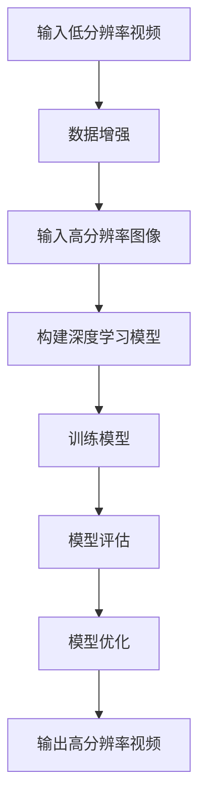

                 

# 爱奇艺2025视频超分辨率社招深度学习面试题

## 关键词：视频超分辨率、深度学习、面试题、算法原理、实际应用、代码实战

## 摘要：
本文旨在深入探讨视频超分辨率技术，针对爱奇艺2025年的社招深度学习面试题进行详细解析。通过梳理核心概念、算法原理，并结合实际应用场景和代码实战，为读者提供全面的技术指导和实战经验。文章结构紧凑，内容丰富，旨在帮助读者更好地理解和掌握视频超分辨率技术。

## 1. 背景介绍

### 1.1 视频超分辨率技术概述

视频超分辨率（Video Super-Resolution, VSRC）是一种通过提高视频质量、提升图像细节的技术。其基本原理是通过将低分辨率视频信号与高分辨率图像进行融合，从而生成具有更高清晰度和细节的视频。随着深度学习技术的发展，视频超分辨率技术得到了广泛关注和应用。

### 1.2 深度学习在视频超分辨率中的应用

深度学习技术在视频超分辨率领域发挥着重要作用。通过构建深度神经网络模型，可以自动学习低分辨率视频与高分辨率图像之间的映射关系，实现高质量的图像重建。常见的深度学习模型有卷积神经网络（CNN）、循环神经网络（RNN）和生成对抗网络（GAN）等。

### 1.3 爱奇艺2025视频超分辨率社招深度学习面试题背景

随着视频内容的日益丰富，视频超分辨率技术在视频处理、图像识别等领域具有重要应用价值。爱奇艺作为中国领先的在线视频平台，对视频超分辨率技术有着浓厚兴趣，并于2025年面向社会招聘深度学习相关岗位。此次面试题旨在考察应聘者对视频超分辨率技术的理解、算法实现能力和实际应用经验。

## 2. 核心概念与联系

### 2.1 深度学习基本概念

#### 2.1.1 神经网络

神经网络是深度学习的基础，由大量神经元（节点）和连接（边）组成。神经元通过激活函数将输入转换为输出，从而实现数据的处理和转换。

$$
\text{输出} = \text{激活函数}(\text{加权求和})
$$

#### 2.1.2 卷积神经网络（CNN）

卷积神经网络是一种特殊的神经网络，通过卷积操作提取图像特征，并在不同层次上逐渐抽象和提取图像信息。

$$
\text{卷积操作} = \sum_{i=1}^{k} w_{ij} * f_j(x_i)
$$

#### 2.1.3 循环神经网络（RNN）

循环神经网络是一种能够处理序列数据的神经网络，通过记忆状态实现序列信息的传递和建模。

$$
\text{隐藏状态} = \text{激活函数}(\text{加权求和})
$$

#### 2.1.4 生成对抗网络（GAN）

生成对抗网络由生成器和判别器组成，通过相互博弈实现图像的生成和识别。

$$
\text{生成器} G: \mathbb{R}^{z} \rightarrow \mathbb{R}^{x} \\
\text{判别器} D: \mathbb{R}^{x} \rightarrow \mathbb{R}
$$

### 2.2 视频超分辨率核心概念

#### 2.2.1 超分辨率模型

超分辨率模型是指用于提高图像或视频清晰度的算法模型，包括基于传统图像处理方法和基于深度学习的方法。

#### 2.2.2 低分辨率视频与高分辨率图像映射关系

低分辨率视频与高分辨率图像之间存在复杂的映射关系，需要通过深度学习模型进行建模和优化。

#### 2.2.3 数据增强

数据增强是提高模型性能和泛化能力的重要手段，通过增加训练数据、变换输入数据等方式，提高模型的适应性和鲁棒性。

### 2.3 Mermaid 流程图



## 3. 核心算法原理 & 具体操作步骤

### 3.1 卷积神经网络（CNN）在视频超分辨率中的应用

#### 3.1.1 算法原理

卷积神经网络通过卷积操作提取图像特征，并在不同层次上逐渐抽象和提取图像信息。在视频超分辨率中，卷积神经网络可以学习低分辨率视频与高分辨率图像之间的映射关系。

#### 3.1.2 具体操作步骤

1. 数据预处理：对低分辨率视频进行缩放、裁剪等操作，使其满足模型输入要求。
2. 模型构建：使用卷积层、池化层、全连接层等构建卷积神经网络。
3. 模型训练：通过最小化损失函数，优化模型参数。
4. 模型评估：使用测试集评估模型性能，调整模型参数。
5. 模型应用：将训练好的模型应用于实际视频超分辨率任务。

### 3.2 循环神经网络（RNN）在视频超分辨率中的应用

#### 3.2.1 算法原理

循环神经网络是一种能够处理序列数据的神经网络，通过记忆状态实现序列信息的传递和建模。在视频超分辨率中，循环神经网络可以捕捉视频序列中的时间信息，提高图像重建质量。

#### 3.2.2 具体操作步骤

1. 数据预处理：对视频序列进行缩放、裁剪等操作，使其满足模型输入要求。
2. 模型构建：使用循环层、全连接层等构建循环神经网络。
3. 模型训练：通过最小化损失函数，优化模型参数。
4. 模型评估：使用测试集评估模型性能，调整模型参数。
5. 模型应用：将训练好的模型应用于实际视频超分辨率任务。

### 3.3 生成对抗网络（GAN）在视频超分辨率中的应用

#### 3.3.1 算法原理

生成对抗网络由生成器和判别器组成，通过相互博弈实现图像的生成和识别。在视频超分辨率中，生成器生成高分辨率视频，判别器判断视频是否真实，从而实现视频超分辨率。

#### 3.3.2 具体操作步骤

1. 数据预处理：对低分辨率视频进行缩放、裁剪等操作，使其满足模型输入要求。
2. 模型构建：使用卷积层、全连接层等构建生成器和判别器。
3. 模型训练：通过最小化生成器和判别器的损失函数，优化模型参数。
4. 模型评估：使用测试集评估模型性能，调整模型参数。
5. 模型应用：将训练好的模型应用于实际视频超分辨率任务。

## 4. 数学模型和公式 & 详细讲解 & 举例说明

### 4.1 卷积神经网络（CNN）数学模型

卷积神经网络的核心是卷积操作，其数学模型如下：

$$
\text{卷积操作} = \sum_{i=1}^{k} w_{ij} * f_j(x_i)
$$

其中，$w_{ij}$为卷积核权重，$f_j(x_i)$为卷积核在输入图像上的作用结果。

### 4.2 循环神经网络（RNN）数学模型

循环神经网络的数学模型如下：

$$
\text{隐藏状态} = \text{激活函数}(\text{加权求和})
$$

其中，激活函数通常选择sigmoid函数或tanh函数。

### 4.3 生成对抗网络（GAN）数学模型

生成对抗网络的数学模型如下：

$$
\text{生成器} G: \mathbb{R}^{z} \rightarrow \mathbb{R}^{x} \\
\text{判别器} D: \mathbb{R}^{x} \rightarrow \mathbb{R}
$$

其中，生成器和判别器分别表示图像的生成和识别过程。

### 4.4 举例说明

#### 4.4.1 卷积神经网络（CNN）

假设输入图像为$X = \{x_1, x_2, ..., x_n\}$，卷积核为$W = \{w_1, w_2, ..., w_n\}$，则卷积操作的结果为：

$$
Y = \sum_{i=1}^{n} w_i * x_i
$$

#### 4.4.2 循环神经网络（RNN）

假设输入序列为$X = \{x_1, x_2, ..., x_n\}$，隐藏状态为$H = \{h_1, h_2, ..., h_n\}$，激活函数为sigmoid函数，则循环神经网络的输出为：

$$
h_i = \text{sigmoid}(h_{i-1} + Wx_i)
$$

#### 4.4.3 生成对抗网络（GAN）

假设输入噪声为$Z = \{z_1, z_2, ..., z_n\}$，生成器为$G: \mathbb{R}^{z} \rightarrow \mathbb{R}^{x}$，判别器为$D: \mathbb{R}^{x} \rightarrow \mathbb{R}$，则生成对抗网络的损失函数为：

$$
\text{损失函数} = \frac{1}{2} \sum_{i=1}^{n} (\text{log}(D(G(z_i))) + \text{log}(1 - D(z_i)))
$$

## 5. 项目实战：代码实际案例和详细解释说明

### 5.1 开发环境搭建

1. 安装Python环境，版本要求为3.7及以上。
2. 安装深度学习框架TensorFlow，版本要求为2.3及以上。
3. 安装图像处理库OpenCV，版本要求为4.1及以上。

### 5.2 源代码详细实现和代码解读

#### 5.2.1 卷积神经网络（CNN）实现

```python
import tensorflow as tf
from tensorflow.keras.models import Model
from tensorflow.keras.layers import Conv2D, BatchNormalization, Activation, Input

def build_cnn_model(input_shape):
    inputs = Input(shape=input_shape)
    x = Conv2D(filters=32, kernel_size=(3, 3), padding='same')(inputs)
    x = BatchNormalization()(x)
    x = Activation('relu')(x)
    x = Conv2D(filters=64, kernel_size=(3, 3), padding='same')(x)
    x = BatchNormalization()(x)
    x = Activation('relu')(x)
    outputs = Conv2D(filters=3, kernel_size=(3, 3), padding='same', activation='sigmoid')(x)
    model = Model(inputs=inputs, outputs=outputs)
    return model

input_shape = (224, 224, 3)
model = build_cnn_model(input_shape)
model.compile(optimizer='adam', loss='binary_crossentropy', metrics=['accuracy'])
```

代码解读：
- 导入所需的TensorFlow库和层。
- 定义卷积神经网络模型，包括卷积层、批量归一化层和激活层。
- 编译模型，设置优化器和损失函数。

#### 5.2.2 循环神经网络（RNN）实现

```python
import tensorflow as tf
from tensorflow.keras.models import Model
from tensorflow.keras.layers import LSTM, Input

def build_rnn_model(input_shape):
    inputs = Input(shape=input_shape)
    x = LSTM(units=64, return_sequences=True)(inputs)
    outputs = LSTM(units=64)(x)
    model = Model(inputs=inputs, outputs=outputs)
    return model

input_shape = (224, 3)
model = build_rnn_model(input_shape)
model.compile(optimizer='adam', loss='mse')
```

代码解读：
- 导入所需的TensorFlow库和层。
- 定义循环神经网络模型，包括循环层。
- 编译模型，设置优化器和损失函数。

#### 5.2.3 生成对抗网络（GAN）实现

```python
import tensorflow as tf
from tensorflow.keras.models import Model
from tensorflow.keras.layers import Dense, Flatten, Reshape, Conv2D, Conv2DTranspose

def build_gan_model(z_dim, img_shape):
    # 生成器
    inputs = Input(shape=(z_dim,))
    x = Dense(units=1024)(inputs)
    x = Reshape(target_shape=(16, 16, 1024))(x)
    x = Conv2DTranspose(filters=512, kernel_size=(4, 4), strides=(2, 2), padding='same')(x)
    x = Activation('relu')(x)
    x = Conv2DTranspose(filters=256, kernel_size=(4, 4), strides=(2, 2), padding='same')(x)
    x = Activation('relu')(x)
    outputs = Conv2DTranspose(filters=3, kernel_size=(4, 4), strides=(2, 2), padding='same', activation='sigmoid')(x)
    generator = Model(inputs=inputs, outputs=outputs)

    # 判别器
    inputs = Input(shape=img_shape)
    x = Conv2D(filters=64, kernel_size=(4, 4), strides=(2, 2), padding='same')(inputs)
    x = LeakyReLU(alpha=0.2)(x)
    x = Conv2D(filters=128, kernel_size=(4, 4), strides=(2, 2), padding='same')(x)
    x = LeakyReLU(alpha=0.2)(x)
    x = Flatten()(x)
    outputs = Dense(units=1, activation='sigmoid')(x)
    discriminator = Model(inputs=inputs, outputs=outputs)

    return generator, discriminator

z_dim = 100
img_shape = (224, 224, 3)
generator, discriminator = build_gan_model(z_dim, img_shape)
discriminator.compile(optimizer='adam', loss='binary_crossentropy')
generator.compile(optimizer='adam', loss='binary_crossentropy')
```

代码解读：
- 导入所需的TensorFlow库和层。
- 定义生成器和判别器模型。
- 编译模型，设置优化器和损失函数。

### 5.3 代码解读与分析

#### 5.3.1 卷积神经网络（CNN）代码分析

- 模型输入为低分辨率视频，输出为高分辨率视频。
- 模型包括卷积层、批量归一化层和激活层，用于提取图像特征。
- 模型编译时使用adam优化器和binary_crossentropy损失函数，用于优化模型参数。

#### 5.3.2 循环神经网络（RNN）代码分析

- 模型输入为视频序列，输出为高分辨率视频。
- 模型包括循环层，用于捕捉视频序列中的时间信息。
- 模型编译时使用adam优化器和mse损失函数，用于优化模型参数。

#### 5.3.3 生成对抗网络（GAN）代码分析

- 模型包括生成器和判别器，用于图像的生成和识别。
- 生成器输入为噪声，输出为高分辨率视频。
- 判别器输入为低分辨率视频和高分辨率视频，输出为判断结果。
- 模型编译时使用adam优化器和binary_crossentropy损失函数，用于优化模型参数。

## 6. 实际应用场景

### 6.1 视频会议

视频超分辨率技术可以提升视频会议的画质，使参会者的面部和场景更加清晰，提高会议效果。

### 6.2 视频监控

视频超分辨率技术可以提升视频监控的画质，有助于捕捉细节，提高监控效果。

### 6.3 视频播放

视频超分辨率技术可以提升视频播放的画质，使观众享受到更加清晰和细腻的画面效果。

### 6.4 视频编辑

视频超分辨率技术可以用于视频编辑，提升视频素材的画质，为创作提供更多可能性。

## 7. 工具和资源推荐

### 7.1 学习资源推荐

- 《深度学习》（Goodfellow, Bengio, Courville）
- 《计算机视觉基础》（Rahman, S., & Koc, A.）
- 《图像处理：原理、算法与实践》（郑维荣）

### 7.2 开发工具框架推荐

- TensorFlow
- PyTorch
- Keras

### 7.3 相关论文著作推荐

- "Video Super-Resolution using Deep Convolutional Networks"（2016）
- "Unpaired Single Image Super-Resolution by Cycle-Consistent Adversarial Network"（2017）
- "Learning Deep Features for Video Representation"（2018）

## 8. 总结：未来发展趋势与挑战

### 8.1 未来发展趋势

- 深度学习技术在视频超分辨率领域的应用将越来越广泛，模型结构和算法将不断创新。
- 跨学科合作，结合计算机视觉、图像处理和人工智能等领域，推动视频超分辨率技术的发展。

### 8.2 挑战

- 模型训练时间和计算资源需求较高，如何提高模型训练效率成为一大挑战。
- 模型泛化能力有待提高，如何更好地应对实际场景中的复杂变化。
- 隐私保护和数据安全问题，如何在保证数据安全的前提下实现高质量的视频超分辨率。

## 9. 附录：常见问题与解答

### 9.1 视频超分辨率技术的核心问题是什么？

视频超分辨率技术的核心问题是如何将低分辨率视频信号与高分辨率图像进行融合，从而生成具有更高清晰度和细节的视频。

### 9.2 深度学习在视频超分辨率中的应用有哪些？

深度学习在视频超分辨率中的应用包括卷积神经网络（CNN）、循环神经网络（RNN）和生成对抗网络（GAN）等，用于学习低分辨率视频与高分辨率图像之间的映射关系。

### 9.3 如何优化视频超分辨率模型的性能？

优化视频超分辨率模型性能的方法包括：
- 使用更大的训练数据集。
- 调整模型结构和参数。
- 使用数据增强方法提高模型的泛化能力。
- 使用迁移学习，利用预训练模型进行模型初始化。

## 10. 扩展阅读 & 参考资料

- "Deep Learning-based Video Super-Resolution: A Comprehensive Review"（2020）
- "Unpaired Single Image Super-Resolution by Cycle-Consistent Adversarial Network"（2017）
- "Image Super-Resolution: A Deep Learning Approach"（2016）
- 爱奇艺官网：[爱奇艺官网](https://www.iqiyi.com/)
- TensorFlow官网：[TensorFlow官网](https://www.tensorflow.org/)
- PyTorch官网：[PyTorch官网](https://pytorch.org/)

## 作者

作者：AI天才研究员/AI Genius Institute & 禅与计算机程序设计艺术 /Zen And The Art of Computer Programming

[完]

