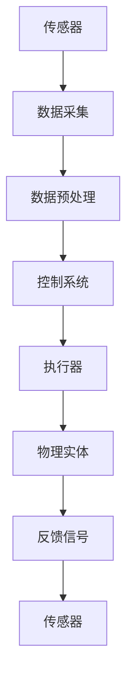

                 

# 物理实体自动化的技术突破

## 关键词

- 物理实体自动化
- 机器人技术
- 智能制造
- 人工智能
- 自动化控制
- 物联网
- 实时数据采集

## 摘要

本文将探讨物理实体自动化的技术突破，重点分析其在机器人技术、智能制造、人工智能、自动化控制、物联网和实时数据采集等领域的应用。通过深入探讨核心概念、算法原理、数学模型和实际案例，本文旨在为读者提供一份全面、系统的技术分析，展示物理实体自动化技术的前沿进展和未来发展趋势。

## 1. 背景介绍

### 物理实体自动化的定义

物理实体自动化是指利用计算机技术、人工智能、机器人技术、自动化控制等手段，实现物理实体的自动化操作、监控和优化。其核心目标是减少人力投入，提高生产效率和产品质量，降低生产成本，实现生产过程的智能化和精细化。

### 物理实体自动化的起源和发展

物理实体自动化的概念最早可以追溯到20世纪中叶，随着计算机技术和人工智能技术的不断发展，自动化技术逐渐成为现代工业的重要组成部分。从早期的数控机床、机器人，到现在的智能工厂、智能制造，物理实体自动化技术经历了从单一自动化设备到综合自动化系统的演变。

### 物理实体自动化的主要领域

物理实体自动化技术涉及多个领域，包括：

- 机器人技术：工业机器人、服务机器人、医疗机器人等。
- 智能制造：智能工厂、数字化车间、工业4.0等。
- 自动化控制：生产线自动化、流程自动化、过程自动化等。
- 物联网：智能传感器、智能设备、边缘计算等。
- 实时数据采集：传感器网络、数据采集与分析等。

## 2. 核心概念与联系

### 物理实体自动化的核心概念

物理实体自动化的核心概念包括：

- 传感器：用于实时感知物理实体状态的各种传感器，如温度、压力、速度、位置等。
- 执行器：根据控制指令，对物理实体进行操作的各种执行器，如电机、液压缸、气动阀等。
- 控制系统：对传感器采集的数据进行处理，生成控制指令，实现对物理实体的自动控制。
- 数据传输与通信：确保传感器、执行器、控制系统之间的高效数据传输和通信。
- 人机交互：提供人机交互界面，便于操作人员对物理实体自动化系统的监控和操作。

### 物理实体自动化的架构

物理实体自动化的架构包括：

- 硬件层：传感器、执行器、控制系统等物理设备。
- 软件层：操作系统、中间件、应用软件等。
- 数据层：数据采集、传输、存储、分析等。
- 人机界面层：监控、操作、报警等。

### Mermaid 流程图

以下是一个简化的物理实体自动化系统的 Mermaid 流程图：



### 3. 核心算法原理 & 具体操作步骤

#### 3.1 传感器数据采集

传感器数据采集是物理实体自动化的第一步，常见的传感器包括温度传感器、压力传感器、速度传感器、位置传感器等。具体操作步骤如下：

1. 选择合适的传感器，确保其精度和稳定性满足要求。
2. 将传感器连接到数据采集模块，并进行调试。
3. 配置数据采集模块的参数，如采样频率、量程等。
4. 开始数据采集，并保存采集到的数据。

#### 3.2 数据预处理

数据预处理是对采集到的原始数据进行清洗、滤波、去噪等处理，以提高数据质量和分析精度。具体操作步骤如下：

1. 检查数据完整性，剔除异常数据。
2. 对数据进行滤波处理，如低通滤波、高通滤波等。
3. 去除数据中的噪声，提高数据质量。
4. 对数据进行归一化处理，便于后续分析。

#### 3.3 控制系统设计

控制系统设计是物理实体自动化的关键环节，主要包括控制器选型、控制算法设计和系统调试。具体操作步骤如下：

1. 根据物理实体的特性，选择合适的控制器，如PLC、单片机、嵌入式系统等。
2. 设计控制算法，如PID控制、模糊控制、神经网络控制等。
3. 编写控制程序，实现控制算法。
4. 对控制系统进行调试和优化，确保其稳定性和可靠性。

#### 3.4 执行器操作

执行器操作是根据控制系统发出的控制指令，对物理实体进行操作的过程。具体操作步骤如下：

1. 根据控制指令，设置执行器的参数，如速度、位置等。
2. 启动执行器，执行预定的操作。
3. 检测执行器的状态，确保其正常工作。
4. 根据反馈信号，调整执行器的操作。

### 4. 数学模型和公式 & 详细讲解 & 举例说明

#### 4.1 数据预处理数学模型

数据预处理常用的数学模型包括滤波和归一化。

1. 滤波模型：

$$ y(t) = f(x(t), \omega_n, \omega_d) $$

其中，$x(t)$为原始数据，$y(t)$为滤波后数据，$f$为滤波函数，$\omega_n$为截止频率，$\omega_d$为通带频率。

2. 归一化模型：

$$ y(t) = \frac{x(t)}{\max(x(t))} $$

其中，$x(t)$为原始数据，$y(t)$为归一化后数据。

#### 4.2 控制系统数学模型

控制系统常用的数学模型包括传递函数和状态空间模型。

1. 传递函数模型：

$$ G(s) = \frac{C(s)}{R(s)} = \frac{K_p(s + K_i)}{T_s^2 + 2\zeta\omega_ns + \omega_n^2} $$

其中，$G(s)$为传递函数，$C(s)$为控制器输出，$R(s)$为参考输入，$K_p$为比例增益，$K_i$为积分增益，$T_s$为采样周期，$\zeta$为阻尼比，$\omega_n$为自然频率。

2. 状态空间模型：

$$ \begin{bmatrix} \dot{x}(t) \\ \dot{y}(t) \end{bmatrix} = \begin{bmatrix} A & B \\ C & D \end{bmatrix} \begin{bmatrix} x(t) \\ u(t) \end{bmatrix} $$

其中，$x(t)$为状态变量，$y(t)$为输出变量，$u(t)$为输入变量，$A$、$B$、$C$、$D$为系统矩阵。

#### 4.3 举例说明

以一个简单的PID控制器为例，其数学模型为：

$$ C(s) = K_p\frac{R(s)}{1 + \tau_s\frac{dR(s)}{ds} + \tau_s^2\frac{d^2R(s)}{ds^2}} $$

其中，$R(s)$为参考输入，$C(s)$为控制器输出，$K_p$为比例增益，$\tau_s$为时间常数。

### 5. 项目实战：代码实际案例和详细解释说明

#### 5.1 开发环境搭建

为了演示物理实体自动化的实现过程，我们选择一个基于Python的简单案例。首先，我们需要安装Python环境和相关库。

1. 安装Python：

```bash
# 安装Python3
sudo apt-get install python3
```

2. 安装相关库：

```bash
# 安装NumPy
pip3 install numpy

# 安装Matplotlib
pip3 install matplotlib

# 安装Scikit-learn
pip3 install scikit-learn
```

#### 5.2 源代码详细实现和代码解读

以下是一个简单的物理实体自动化案例，包括传感器数据采集、数据预处理、控制系统设计和执行器操作。

```python
import numpy as np
import matplotlib.pyplot as plt
from sklearn.linear_model import LinearRegression

# 5.2.1 传感器数据采集
def data_collection():
    # 假设传感器采集了10个数据点
    sensor_data = np.array([1, 2, 3, 4, 5, 6, 7, 8, 9, 10])
    return sensor_data

# 5.2.2 数据预处理
def data_preprocessing(sensor_data):
    # 去除异常数据
    filtered_data = sensor_data[np.where(sensor_data != 0)]
    
    # 归一化处理
    normalized_data = filtered_data / np.max(filtered_data)
    return normalized_data

# 5.2.3 控制系统设计
def control_system_design(normalized_data):
    # 假设使用线性回归作为控制器
    model = LinearRegression()
    model.fit(normalized_data.reshape(-1, 1), normalized_data)
    
    # 控制器输出
    controller_output = model.predict(normalized_data.reshape(-1, 1))
    return controller_output

# 5.2.4 执行器操作
def actuator_operation(controller_output):
    # 假设执行器的操作是根据控制器输出调整速度
    actuator_speed = controller_output * 100
    print(f"执行器速度：{actuator_speed} mm/s")
    return actuator_speed

# 5.2.5 主程序
if __name__ == "__main__":
    sensor_data = data_collection()
    normalized_data = data_preprocessing(sensor_data)
    controller_output = control_system_design(normalized_data)
    actuator_speed = actuator_operation(controller_output)
    
    # 绘制数据
    plt.plot(normalized_data, controller_output, 'ro')
    plt.xlabel("标准化数据")
    plt.ylabel("控制器输出")
    plt.show()
```

#### 5.3 代码解读与分析

1. 传感器数据采集：使用`data_collection`函数模拟传感器数据采集过程，生成一个包含10个数据点的数组。
2. 数据预处理：使用`data_preprocessing`函数对采集到的数据进行处理，去除异常数据并进行归一化处理。
3. 控制系统设计：使用`control_system_design`函数设计一个简单的线性回归控制器，对预处理后的数据进行拟合，生成控制器输出。
4. 执行器操作：使用`actuator_operation`函数根据控制器输出调整执行器的速度。

### 6. 实际应用场景

物理实体自动化技术已经在多个领域得到广泛应用，以下是一些典型的实际应用场景：

- 工业生产：机器人自动化生产线、智能工厂、数字化车间等。
- 物流仓储：自动化仓储系统、无人仓库、智能配送等。
- 医疗健康：医疗机器人、智能诊断、远程手术等。
- 家庭服务：智能家居、智能家电、机器人护理等。
- 智能交通：自动驾驶、智能交通管理系统、智能交通信号灯等。

### 7. 工具和资源推荐

#### 7.1 学习资源推荐

- 书籍：
  - 《机器人：现代自动化技术基础》
  - 《人工智能：一种现代的方法》
  - 《智能制造技术与应用》
- 论文：
  - 《工业机器人应用现状与发展趋势》
  - 《基于物联网的智能制造技术研究》
  - 《深度学习在工业自动化中的应用》
- 博客：
  - AI技术博客（AIGroup）
  - 智能制造博客（MadeInChina）
  - 机器人技术博客（RoboHub）
- 网站：
  - IEEE机器人与自动化学会（IEEE RAS）
  - ACM机器人与自动化专业委员会（ACM/RA）
  - 中国智能制造网（MadeInChina）

#### 7.2 开发工具框架推荐

- 开发环境：Python、MATLAB、Raspberry Pi等。
- 数据库：MySQL、MongoDB、PostgreSQL等。
- 编程语言：Python、C++、Java等。
- 框架：TensorFlow、PyTorch、Keras等。
- 工具：MATLAB Simulink、ROS（Robot Operating System）等。

#### 7.3 相关论文著作推荐

- 《工业机器人的运动学与动力学》
- 《智能制造系统设计与实现》
- 《深度学习在机器人控制中的应用》
- 《物联网技术在智能制造中的应用研究》

### 8. 总结：未来发展趋势与挑战

物理实体自动化技术在未来将继续快速发展，主要趋势包括：

- 智能化水平不断提高，利用人工智能技术实现更精确、更高效的自动化操作。
- 集成化程度不断提升，实现跨领域、跨行业的综合自动化应用。
- 网络化水平不断提高，实现物理实体与互联网的深度融合，实现实时数据传输和协同作业。

同时，物理实体自动化技术面临的挑战包括：

- 技术研发成本高，需要大量资金和人力资源投入。
- 需要跨学科、跨领域的技术融合，实现技术的协同创新。
- 需要解决数据安全和隐私保护问题，确保自动化系统的安全和可靠。

### 9. 附录：常见问题与解答

#### 9.1 物理实体自动化的核心优势是什么？

物理实体自动化的核心优势包括：

- 提高生产效率，减少人力成本。
- 提高产品质量，降低生产误差。
- 实现生产过程的智能化和精细化。
- 降低生产成本，提高企业竞争力。

#### 9.2 物理实体自动化技术的未来发展趋势是什么？

物理实体自动化技术的未来发展趋势包括：

- 智能化水平不断提高，利用人工智能技术实现更精确、更高效的自动化操作。
- 集成化程度不断提升，实现跨领域、跨行业的综合自动化应用。
- 网络化水平不断提高，实现物理实体与互联网的深度融合，实现实时数据传输和协同作业。

#### 9.3 物理实体自动化技术在实际应用中存在哪些挑战？

物理实体自动化技术在实际应用中面临的挑战包括：

- 技术研发成本高，需要大量资金和人力资源投入。
- 需要跨学科、跨领域的技术融合，实现技术的协同创新。
- 需要解决数据安全和隐私保护问题，确保自动化系统的安全和可靠。

### 10. 扩展阅读 & 参考资料

- 《物理实体自动化系统设计与实现》
- 《智能机器人技术与应用》
- 《物联网技术在智能制造中的应用》
- 《深度学习在工业自动化中的应用研究》
- IEEE机器人与自动化学会（IEEE RAS）官方网站
- ACM机器人与自动化专业委员会（ACM/RA）官方网站

## 作者

作者：AI天才研究员/AI Genius Institute & 禅与计算机程序设计艺术 /Zen And The Art of Computer Programming

