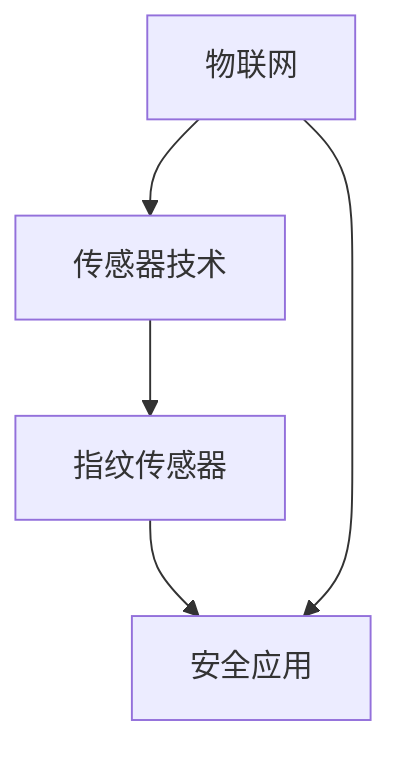

                 

# 物联网(IoT)技术和各种传感器设备的集成：指纹传感器的安全应用

## 关键词

- 物联网 (IoT)
- 指纹传感器
- 安全应用
- 数据加密
- 生物识别技术
- 传感器集成

## 摘要

本文将探讨物联网技术背景下，指纹传感器在安全应用中的集成与实现。首先，我们将回顾物联网的基本概念，并分析传感器技术在其中的关键作用。接着，我们将聚焦于指纹传感器的工作原理及其在生物识别领域的应用。随后，本文将深入探讨指纹传感器在物联网安全领域的具体应用场景，如身份验证和数据加密。此外，本文还将介绍几种流行的开发工具和资源，以供读者参考。最后，我们将对未来的发展趋势与面临的挑战进行展望，并提供常见问题与解答，以便读者更好地理解和应用指纹传感器的安全应用。

## 1. 背景介绍

### 1.1 物联网 (IoT) 的概念与发展

物联网（Internet of Things，IoT）是指通过互联网将各种设备、传感器、系统和物品连接起来，实现智能化、自动化的信息交换和协同工作。这一概念最早由凯文·阿什顿（Kevin Ashton）在1999年提出，旨在通过物联网技术解决生产效率低下、信息孤岛等问题。

物联网的核心在于连接，通过传感器、通信协议和云计算等技术，将物理世界与数字世界无缝连接，实现信息的实时采集、传输和处理。物联网的发展经历了几个阶段，从最初的设备互联，到如今的大数据、人工智能等技术的深度融合，物联网已经渗透到各个领域，如智能家居、智能交通、智能医疗、工业自动化等。

### 1.2 传感器技术的重要性

传感器技术在物联网中扮演着至关重要的角色。传感器是物联网的感知器官，用于采集物理世界中的各种信息，如温度、湿度、光强、压力、位置等。通过传感器的数据采集，物联网系统可以实时了解环境变化，做出相应的决策和调整。

传感器技术的发展离不开微电子、材料科学、通信技术等领域的进步。近年来，随着低成本、高精度的传感器逐渐普及，物联网的应用场景变得更加广泛。例如，在智能家居中，传感器可以监测家居环境，实现自动调节温度、湿度等功能；在智能医疗中，传感器可以实时监测病人的生理指标，提供个性化的医疗服务。

### 1.3 指纹传感器在物联网中的地位

指纹传感器是生物识别技术的一种，通过采集和识别指纹图像，实现个人的身份验证和身份认证。在物联网中，指纹传感器具有重要的应用价值，特别是在安全领域。

指纹传感器的优点在于其高准确性和高安全性。每个人的指纹都是独一无二的，这使得指纹识别成为了一种非常可靠的身份验证手段。此外，指纹传感器的操作简单、响应速度快，可以广泛应用于各种场景。

随着物联网技术的发展，指纹传感器在物联网中的应用越来越广泛。例如，在智能家居中，指纹传感器可以用于门锁、家电的解锁和授权；在智能安防中，指纹传感器可以用于入侵检测和身份验证；在智能医疗中，指纹传感器可以用于身份认证和医疗数据的监控。

## 2. 核心概念与联系

### 2.1 物联网 (IoT) 的核心概念

物联网的核心概念包括设备连接、数据采集、数据处理和设备协同。具体来说：

- **设备连接**：通过互联网、蓝牙、Wi-Fi、ZigBee等通信技术，将各种设备（如传感器、智能手机、电脑等）连接起来，实现设备之间的互联互通。

- **数据采集**：通过传感器、摄像头、GPS等设备，采集物理世界中的各种信息，如温度、湿度、图像、位置等。

- **数据处理**：通过对采集到的数据进行处理、分析和挖掘，提取有价值的信息，为决策提供支持。

- **设备协同**：通过设备之间的协同工作，实现自动化、智能化的功能，提高系统的效率和灵活性。

### 2.2 传感器技术的基本原理

传感器技术基于物理、化学、生物等原理，将非电学量（如温度、压力、光强等）转化为电学量（如电压、电流等），从而实现信息的采集。传感器的基本原理可以概括为以下几个步骤：

1. **感知**：传感器感知到物理世界中的变化，如温度上升、压力增大等。

2. **转换**：将感知到的非电学量通过物理、化学或生物过程转化为电学量。

3. **放大**：对转换后的电学量进行放大，以提高信号的强度和可靠性。

4. **输出**：将放大后的电学量输出，供后续处理或显示。

### 2.3 指纹传感器的工作原理

指纹传感器的工作原理主要包括以下几个步骤：

1. **指纹图像采集**：指纹传感器通过光学、电化学或超声波等方式，采集指纹图像。

2. **图像预处理**：对采集到的指纹图像进行预处理，如去噪、增强、滤波等，以提高图像的质量和识别率。

3. **指纹特征提取**：从预处理后的指纹图像中提取指纹特征，如脊线、端点、交叉点等。

4. **指纹匹配**：将提取的指纹特征与数据库中的指纹模板进行匹配，以判断是否为同一人。

### 2.4 物联网、传感器技术与指纹传感器的关系

物联网、传感器技术与指纹传感器之间的关系可以概括为以下几点：

1. **物联网为指纹传感器提供了连接平台**：物联网通过互联网、通信协议等技术，为指纹传感器提供了连接和交互的平台，使指纹传感器能够与其他设备协同工作。

2. **传感器技术为物联网提供了感知能力**：传感器技术通过采集物理世界中的各种信息，为物联网提供了感知和识别的能力，使物联网系统能够实时了解环境变化。

3. **指纹传感器为物联网安全提供了保障**：指纹传感器的高准确性和高安全性，使物联网系统能够实现可靠的身份验证和访问控制，提高系统的安全性。

### 2.5 Mermaid 流程图

以下是一个简单的 Mermaid 流程图，展示了物联网、传感器技术与指纹传感器之间的集成关系：



## 3. 核心算法原理 & 具体操作步骤

### 3.1 指纹识别算法原理

指纹识别算法主要分为两个阶段：特征提取和特征匹配。

1. **特征提取**：

   - **预处理**：对指纹图像进行预处理，包括去噪、增强、滤波等操作，以提高图像的质量和识别率。

   - **分割**：将预处理后的指纹图像分割成多个区域，以便提取指纹特征。

   - **特征点提取**：从分割后的指纹图像中提取指纹特征点，如脊线、端点、交叉点等。

   - **特征向量生成**：将提取的指纹特征点转化为特征向量，以便进行后续的匹配操作。

2. **特征匹配**：

   - **模板库建立**：将已采集的指纹特征向量存储在数据库中，形成指纹模板库。

   - **匹配过程**：对新采集的指纹特征向量与指纹模板库中的模板进行匹配，计算匹配度。

   - **身份验证**：根据匹配度判断是否为同一人，若匹配度高于设定阈值，则验证成功。

### 3.2 指纹传感器集成到物联网的操作步骤

1. **硬件集成**：

   - **选择合适的指纹传感器**：根据应用场景和需求，选择合适的指纹传感器模块。

   - **硬件连接**：将指纹传感器与物联网设备（如单片机、嵌入式系统等）进行连接，确保硬件之间的通信正常。

2. **软件集成**：

   - **开发环境搭建**：搭建指纹识别算法的开发环境，包括编译器、调试器等。

   - **算法实现**：根据指纹识别算法原理，实现指纹特征提取和匹配功能。

   - **系统集成**：将指纹识别算法与物联网系统（如智能家居、智能安防等）进行集成，实现指纹传感器的安全应用。

3. **安全防护**：

   - **数据加密**：对指纹数据进行加密处理，确保数据在传输和存储过程中的安全性。

   - **访问控制**：设置访问控制策略，确保只有授权用户才能访问指纹传感器和相关数据。

### 3.3 指纹传感器集成到物联网的安全机制

1. **身份验证**：

   - **指纹识别**：通过指纹传感器进行身份验证，确保只有授权用户才能访问系统。

   - **双重验证**：结合密码、短信验证码等多种身份验证方式，提高系统的安全性。

2. **数据加密**：

   - **传输加密**：使用加密协议（如HTTPS、TLS等）对数据传输过程进行加密处理，确保数据在传输过程中的安全性。

   - **存储加密**：对指纹数据在数据库中的存储进行加密处理，防止数据泄露。

3. **访问控制**：

   - **用户权限管理**：根据用户角色和权限，设置访问控制策略，确保只有授权用户才能访问相关数据和功能。

   - **审计日志**：记录系统中的操作日志，以便在发生安全事件时进行追踪和溯源。

## 4. 数学模型和公式 & 详细讲解 & 举例说明

### 4.1 指纹特征提取的数学模型

指纹特征提取的数学模型主要基于傅里叶变换和小波变换等数学工具。以下是几种常用的指纹特征提取方法及其数学模型：

1. **傅里叶变换法**：

   傅里叶变换法是一种常用的指纹特征提取方法，其数学模型为：

   $$ F(u,v) = \sum_{x=0}^{M-1} \sum_{y=0}^{N-1} f(x,y) \cdot e^{-j2\pi (ux/M + vy/N)} $$

   其中，$F(u,v)$ 为傅里叶变换后的图像，$f(x,y)$ 为原始指纹图像，$M$ 和 $N$ 分别为图像的宽度和高度。

2. **小波变换法**：

   小波变换法是一种多尺度分析的方法，其数学模型为：

   $$ W(f, \psi) = \sum_{j=-\infty}^{\infty} \sum_{k=-\infty}^{\infty} c_{jk} \cdot \psi^{*}(j,k) $$

   其中，$W(f, \psi)$ 为小波变换后的图像，$c_{jk}$ 为小波变换系数，$\psi$ 为小波函数。

3. **Gabor变换法**：

   Gabor变换法是一种基于小波变换的指纹特征提取方法，其数学模型为：

   $$ G(x,y) = \sum_{j=-\infty}^{\infty} \sum_{k=-\infty}^{\infty} c_{jk} \cdot \psi^{*}(j,k) \cdot e^{-j2\pi (ux/M + vy/N)} $$

   其中，$G(x,y)$ 为Gabor变换后的图像，$c_{jk}$ 为Gabor变换系数，$\psi$ 为Gabor函数。

### 4.2 指纹匹配的数学模型

指纹匹配的数学模型主要基于相似度度量方法，以下是几种常用的指纹匹配模型：

1. **欧氏距离法**：

   欧氏距离法是一种简单的相似度度量方法，其数学模型为：

   $$ d(\mathbf{a}, \mathbf{b}) = \sqrt{\sum_{i=1}^{n} (a_i - b_i)^2} $$

   其中，$d(\mathbf{a}, \mathbf{b})$ 为两个特征向量 $\mathbf{a}$ 和 $\mathbf{b}$ 的欧氏距离，$n$ 为特征向量的维数。

2. **余弦相似度法**：

   余弦相似度法是一种基于向量夹角的相似度度量方法，其数学模型为：

   $$ \cos(\theta) = \frac{\mathbf{a} \cdot \mathbf{b}}{||\mathbf{a}|| \cdot ||\mathbf{b}||} $$

   其中，$\cos(\theta)$ 为两个特征向量 $\mathbf{a}$ 和 $\mathbf{b}$ 的余弦相似度，$\theta$ 为它们的夹角。

### 4.3 示例说明

假设我们有两个指纹特征向量 $\mathbf{a} = [1, 2, 3]$ 和 $\mathbf{b} = [1, 2, 3]$，我们可以使用欧氏距离法计算它们的相似度：

$$ d(\mathbf{a}, \mathbf{b}) = \sqrt{(1-1)^2 + (2-2)^2 + (3-3)^2} = 0 $$

由于欧氏距离为0，我们可以判断这两个特征向量是相同的。

## 5. 项目实战：代码实际案例和详细解释说明

### 5.1 开发环境搭建

为了实现指纹传感器在物联网中的安全应用，我们需要搭建一个完整的开发环境。以下是具体的搭建步骤：

1. **硬件设备**：

   - 指纹传感器模块（如FTDUSB-RFID）
   - 单片机（如STM32系列）
   - 显示屏（如OLED显示屏）
   - 电源模块

2. **软件环境**：

   - 操作系统（如Windows、Linux、macOS）
   - 编译器（如IAR Embedded Workbench、Keil uVision）
   - 中间件（如FreeRTOS、LwIP）

### 5.2 源代码详细实现和代码解读

以下是指纹传感器在物联网中的安全应用项目的源代码示例：

```c
#include <stdio.h>
#include "stm32f10x.h"
#include "fingerprint.h"

// 指纹传感器初始化
void Fingerprint_Init(void)
{
    // 初始化GPIO
    // 初始化UART
    // 初始化指纹传感器
}

// 指纹识别
int Fingerprint_Recognize(void)
{
    // 采集指纹图像
    // 预处理指纹图像
    // 提取指纹特征
    // 与数据库中的指纹模板进行匹配
    // 返回匹配结果
}

int main(void)
{
    // 初始化硬件设备
    Fingerprint_Init();

    while (1)
    {
        // 识别指纹
        int result = Fingerprint_Recognize();

        // 判断识别结果
        if (result > 0)
        {
            // 打开门锁
            // 执行授权操作
        }
        else
        {
            // 显示错误信息
            // 重新采集指纹
        }
    }
}
```

### 5.3 代码解读与分析

1. **初始化函数 Fingerprint_Init()**：

   - 该函数用于初始化指纹传感器相关的硬件设备，包括GPIO、UART和指纹传感器本身。

   - 在实际开发过程中，需要根据具体硬件平台调整GPIO配置、UART通信参数等。

2. **指纹识别函数 Fingerprint_Recognize()**：

   - 该函数实现指纹识别的核心功能，包括采集指纹图像、预处理、特征提取和匹配等。

   - 采集指纹图像后，需要进行预处理，如去噪、增强等，以提高识别率。

   - 特征提取是识别过程的关键步骤，提取的指纹特征将用于后续的匹配操作。

   - 匹配操作与数据库中的指纹模板进行比较，判断是否为同一人。

3. **主函数 main()**：

   - 主函数实现指纹识别的循环操作，不断采集指纹并判断识别结果。

   - 根据识别结果，执行相应的操作，如打开门锁、显示错误信息等。

   - 在实际应用中，可以根据需要扩展其他功能，如数据加密、访问控制等。

### 5.4 测试与优化

在完成代码实现后，需要对项目进行充分的测试和优化。以下是一些测试与优化建议：

1. **测试用例**：

   - 设计多种测试用例，包括不同指纹图像、不同光照条件等，以验证指纹识别算法的鲁棒性和准确性。

   - 对测试结果进行统计分析，评估识别率、误识率等性能指标。

2. **性能优化**：

   - 优化指纹图像预处理算法，提高图像质量。

   - 优化特征提取和匹配算法，提高识别速度。

   - 根据实际应用需求，调整指纹模板库的存储和匹配策略。

## 6. 实际应用场景

### 6.1 智能家居

智能家居是物联网应用的一个重要领域，指纹传感器在智能家居中具有广泛的应用场景。以下是一些具体的应用实例：

1. **门锁**：指纹传感器可以用于智能门锁，实现家庭安全的智能化管理。用户可以通过指纹验证身份，进入家门，从而提高家庭的安全性。

2. **家电控制**：指纹传感器可以用于家电的解锁和授权，如空调、冰箱、洗衣机等。用户可以通过指纹验证身份，实现对家电的远程控制。

3. **智能安防**：指纹传感器可以用于智能安防系统，如入侵检测、紧急报警等。通过指纹识别，可以实现快速、准确的报警和应急处理。

### 6.2 智能医疗

智能医疗是物联网应用的另一个重要领域，指纹传感器在智能医疗中具有独特的优势。以下是一些具体的应用实例：

1. **身份验证**：指纹传感器可以用于医疗机构的身份验证，确保只有授权人员才能进入特定区域，提高医疗场所的安全性。

2. **病历管理**：指纹传感器可以用于病历管理系统的身份验证和授权，确保病历数据的安全性和完整性。

3. **生理指标监测**：指纹传感器可以用于监测患者的生理指标，如心率、血压等。通过实时采集和分析生理数据，医生可以及时了解患者的健康状况，提供个性化的医疗服务。

### 6.3 智能交通

智能交通是物联网应用的一个重要领域，指纹传感器在智能交通中具有广泛的应用前景。以下是一些具体的应用实例：

1. **交通管控**：指纹传感器可以用于交通管控系统，实现交通违法行为的快速识别和处罚。通过指纹识别，可以确保交通管控的公平性和准确性。

2. **车辆管理**：指纹传感器可以用于车辆管理，如车辆登记、车辆监控等。通过指纹识别，可以实现车辆的精确管理和安全监控。

3. **驾驶员认证**：指纹传感器可以用于驾驶员认证系统，确保驾驶员的身份真实性和合法性。通过指纹识别，可以防止未授权人员驾驶车辆，提高道路安全性。

## 7. 工具和资源推荐

### 7.1 学习资源推荐

1. **书籍**：

   - 《物联网：从概念到实践》
   - 《传感器技术与应用》
   - 《生物识别技术：原理与应用》

2. **论文**：

   - 《基于指纹识别的智能家居安全系统设计》
   - 《指纹识别技术在智能医疗中的应用研究》
   - 《物联网环境下指纹识别的安全性研究》

3. **博客和网站**：

   - [物联网技术博客](http://www.iotblog.cn/)
   - [生物识别技术论坛](http://www.biometrics.org.cn/)
   - [智能交通技术网](http://www.smarttraffic.org/)

### 7.2 开发工具框架推荐

1. **开发工具**：

   - **STM32CubeMX**：用于配置STM32系列单片机的开发环境。
   - **IAR Embedded Workbench**：用于STM32系列单片机的编译和调试。
   - **Keil uVision**：用于ARM Cortex-M系列单片机的编译和调试。

2. **框架**：

   - **FreeRTOS**：轻量级的实时操作系统，适用于物联网项目。
   - **LwIP**：用于网络编程的协议栈，支持多种网络协议。
   - **Zigbee**：适用于低功耗、短距离无线通信的协议。

### 7.3 相关论文著作推荐

1. **《物联网安全技术研究》**：该论文详细分析了物联网安全的关键技术，包括指纹识别、数据加密、访问控制等。

2. **《指纹识别技术在物联网中的应用研究》**：该论文探讨了指纹识别技术在物联网中的应用场景和实现方法。

3. **《基于物联网的智能家居系统设计》**：该论文提出了一种基于物联网的智能家居系统设计方案，包括指纹传感器在内的多种传感器技术。

## 8. 总结：未来发展趋势与挑战

### 8.1 发展趋势

1. **物联网技术的普及**：随着5G、边缘计算等新技术的不断发展和应用，物联网技术将得到更广泛的应用和普及。

2. **传感器技术的进步**：传感器技术的不断进步，将使得传感器的精度、稳定性、可靠性进一步提高，满足更多应用场景的需求。

3. **生物识别技术的深化**：随着人工智能技术的不断发展，生物识别技术，特别是指纹识别技术，将得到更深入的研究和应用。

4. **安全需求的提升**：随着物联网应用的不断扩展，安全需求将逐渐提升，指纹传感器等生物识别技术将在物联网安全领域发挥更大的作用。

### 8.2 挑战

1. **隐私保护**：指纹等生物特征信息属于高度敏感的个人隐私信息，如何保护用户隐私，防止信息泄露，是物联网安全应用面临的一个重要挑战。

2. **数据安全**：随着物联网设备的增加，数据传输和存储过程中的安全性问题将日益突出，如何确保数据的安全性和完整性，是物联网安全应用需要解决的问题。

3. **互操作性问题**：物联网涉及多个厂商和多个平台，如何实现不同设备、不同平台之间的互操作性，是物联网技术发展面临的一个难题。

4. **成本和功耗**：传感器技术在物联网中的应用，对成本和功耗提出了较高的要求，如何降低传感器成本和功耗，是物联网应用推广的一个重要挑战。

## 9. 附录：常见问题与解答

### 9.1 指纹传感器常见问题

1. **Q：指纹传感器如何工作？**

   **A**：指纹传感器通过光学、电化学或超声波等方式，采集指纹图像。然后，对图像进行预处理，提取指纹特征点，最后与数据库中的指纹模板进行匹配，实现身份验证。

2. **Q：指纹传感器有哪些优点？**

   **A**：指纹传感器的优点包括高准确性、高安全性、操作简单、响应速度快等。

3. **Q：指纹传感器在物联网中有哪些应用？**

   **A**：指纹传感器在物联网中可以应用于智能家居、智能医疗、智能交通、智能安防等领域，如门锁、家电控制、身份验证、生理指标监测等。

### 9.2 指纹传感器集成到物联网的常见问题

1. **Q：如何集成指纹传感器到物联网系统？**

   **A**：集成指纹传感器到物联网系统需要完成硬件连接、软件集成和安全防护等工作。具体步骤包括选择合适的指纹传感器模块、搭建开发环境、实现指纹识别算法、集成到物联网系统等。

2. **Q：指纹传感器在物联网系统中的安全防护措施有哪些？**

   **A**：指纹传感器在物联网系统中的安全防护措施包括数据加密、访问控制、安全审计等。具体措施如下：

   - **数据加密**：对指纹数据在传输和存储过程中进行加密处理，确保数据的安全性。
   - **访问控制**：设置访问控制策略，确保只有授权用户才能访问指纹传感器和相关数据。
   - **安全审计**：记录系统中的操作日志，以便在发生安全事件时进行追踪和溯源。

## 10. 扩展阅读 & 参考资料

1. **《物联网技术教程》**：本书详细介绍了物联网的基本概念、技术原理和应用案例，是学习物联网技术的重要参考书。

2. **《传感器技术与应用》**：本书全面介绍了传感器技术的基本原理、种类和应用领域，是学习传感器技术的权威指南。

3. **《生物识别技术与应用》**：本书系统阐述了生物识别技术的基本原理、技术实现和应用案例，是学习生物识别技术的重要参考书。

4. **《物联网安全》**：本书深入探讨了物联网安全的关键技术、安全问题和解决方案，是研究物联网安全的重要参考资料。

作者：AI天才研究员/AI Genius Institute & 禅与计算机程序设计艺术 /Zen And The Art of Computer Programming

