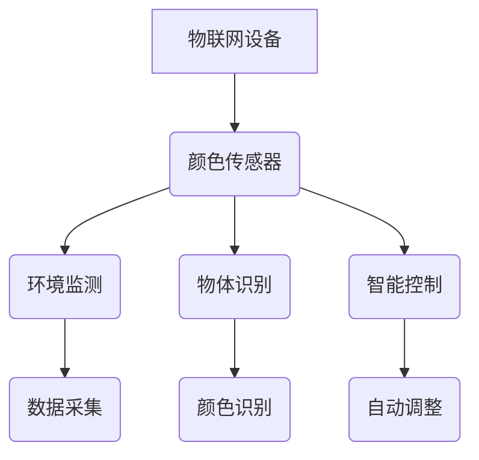

                 

# 物联网（IoT）技术和各种传感器设备的集成：颜色传感器的工作原理

> **关键词**：物联网（IoT），传感器设备，颜色传感器，工作原理，集成技术

> **摘要**：本文将深入探讨物联网（IoT）技术和传感器设备集成的关键领域——颜色传感器的工作原理。通过详细的分析和解释，我们将了解颜色传感器的基本概念、工作原理、应用场景，并探讨其在物联网领域的重要性。文章还将提供实际应用案例、资源推荐以及未来的发展趋势与挑战，帮助读者全面了解颜色传感器在物联网中的应用。

## 1. 背景介绍

物联网（IoT）是近年来科技领域的一个重要发展方向，它通过将各种物理设备、传感器、计算机系统连接到互联网，实现了信息的互联互通。物联网的核心在于传感器设备的集成与应用，这些传感器能够实时采集环境数据，如温度、湿度、光照、声音等，并通过无线网络传输到中央控制系统，从而实现对物理世界的实时监控和管理。

在物联网的众多传感器设备中，颜色传感器扮演着至关重要的角色。颜色传感器可以检测和识别不同颜色的光线，广泛应用于工业自动化、医疗诊断、智能家居、艺术创作等多个领域。例如，在工业自动化中，颜色传感器可以用于产品质量检测，识别缺陷产品；在医疗诊断中，颜色传感器可以用于皮肤癌筛查，识别皮肤病变；在智能家居中，颜色传感器可以用于调节照明，创造舒适的生活环境。

随着物联网技术的发展，颜色传感器的应用场景日益广泛，其工作原理和性能也不断优化。本文将重点探讨颜色传感器的工作原理，分析其在物联网中的应用，并探讨未来的发展趋势与挑战。

## 2. 核心概念与联系

### 2.1 颜色传感器的基本概念

颜色传感器是一种能够检测和识别颜色光线的传感器。它通常由光敏元件、信号处理电路和输出接口组成。光敏元件是颜色传感器的核心部分，负责接收和检测光线。信号处理电路对光敏元件接收到的信号进行处理，将光信号转换为电信号，并通过输出接口将处理结果传输给中央控制系统。

### 2.2 颜色传感器的工作原理

颜色传感器的工作原理基于光电效应。当光线照射到光敏元件上时，光子与光敏材料相互作用，产生电子-空穴对。这些电子-空穴对在外加电场的作用下，会形成电流。电流的大小与光线的强度成正比，通过测量电流的大小，可以确定光线的颜色。

具体来说，颜色传感器通常采用滤光片来分离不同颜色的光线。滤光片可以选择特定波长的光线通过，而阻挡其他波长的光线。这样，传感器只能检测到特定颜色的光线。通过对不同颜色的光线进行检测，颜色传感器可以识别物体的颜色。

### 2.3 颜色传感器与物联网的关系

颜色传感器在物联网中扮演着重要角色，是实现物联网智能化应用的关键设备之一。颜色传感器可以实时采集环境中的颜色数据，通过无线网络传输到中央控制系统，实现远程监控和管理。在物联网应用中，颜色传感器的主要功能包括：

- **环境监测**：通过检测环境中的颜色变化，可以实时了解环境状况，如空气质量、水质等。
- **物体识别**：通过识别物体的颜色，可以实现对特定物体的追踪和管理，如智能物流、智能家居等。
- **智能控制**：根据颜色传感器的检测结果，可以自动调整系统的工作状态，如智能照明、智能安防等。

### 2.4 Mermaid 流程图

以下是一个简单的 Mermaid 流程图，展示了颜色传感器在物联网中的应用流程：



在上述流程中，物联网设备通过颜色传感器进行数据采集，实现对环境的监测、物体的识别和智能控制。

## 3. 核心算法原理 & 具体操作步骤

### 3.1 核心算法原理

颜色传感器的工作原理主要包括两个部分：光线检测和信号处理。光线检测部分基于光电效应，通过光敏元件将光信号转换为电信号；信号处理部分则通过电路将电信号转换为数字信号，并进行处理，以实现对颜色的识别。

具体来说，颜色传感器通常采用以下算法进行颜色识别：

1. **滤光处理**：通过滤光片分离不同颜色的光线，将光线分解为多个波段。
2. **光电转换**：光敏元件接收光线，将其转换为电信号。
3. **信号放大**：对电信号进行放大处理，提高信号的强度和稳定性。
4. **信号滤波**：对放大后的信号进行滤波处理，去除噪声，提取有效信号。
5. **数字转换**：将滤波后的信号转换为数字信号，便于计算机处理。
6. **颜色识别**：利用数字信号处理算法，对颜色信号进行识别，确定物体的颜色。

### 3.2 具体操作步骤

以下是颜色传感器在实际应用中的具体操作步骤：

1. **环境设置**：将颜色传感器放置在需要检测的物体附近，确保光线能够正常照射到传感器上。
2. **滤光处理**：通过滤光片分离不同颜色的光线，为后续的颜色识别做好准备。
3. **光电转换**：光线照射到光敏元件上，产生电子-空穴对，形成电流。
4. **信号放大**：对产生的电信号进行放大处理，提高信号的强度。
5. **信号滤波**：对放大后的信号进行滤波处理，去除噪声，提取有效信号。
6. **数字转换**：将滤波后的信号通过模数转换器（ADC）转换为数字信号。
7. **颜色识别**：利用数字信号处理算法，对颜色信号进行识别，确定物体的颜色。
8. **数据传输**：将识别结果通过无线网络传输到中央控制系统。
9. **结果处理**：中央控制系统对传输过来的颜色数据进行处理，实现相应的功能，如环境监测、物体识别、智能控制等。

### 3.3 算法优化

为了提高颜色传感器的性能，可以对算法进行优化。以下是一些常见的优化方法：

1. **多波段滤波**：通过增加滤光片的数量，对光线进行更精细的分解，提高颜色识别的准确性。
2. **自适应滤波**：根据环境光线的变化，自动调整滤波器的参数，提高信号处理的稳定性。
3. **机器学习**：利用机器学习算法，对颜色传感器收集的数据进行训练，提高颜色识别的准确性。
4. **实时更新**：定期更新颜色传感器的算法和数据库，以适应新的应用场景。

## 4. 数学模型和公式 & 详细讲解 & 举例说明

### 4.1 数学模型

颜色传感器的工作原理涉及到多个数学模型和公式，主要包括光电效应方程、信号处理公式和颜色识别公式。

#### 4.1.1 光电效应方程

光电效应方程描述了光子与光敏材料相互作用产生电子-空穴对的过程。其数学表达式为：

\[ E = h\nu \]

其中，\( E \) 表示光子的能量，\( h \) 是普朗克常数，\( \nu \) 是光的频率。

#### 4.1.2 信号处理公式

信号处理公式描述了颜色传感器对光信号进行处理的过程，包括信号放大、信号滤波和数字转换等。以下是一个简单的信号处理公式：

\[ V_{out} = A \cdot V_{in} + B \]

其中，\( V_{out} \) 是输出信号，\( V_{in} \) 是输入信号，\( A \) 是放大倍数，\( B \) 是偏置值。

#### 4.1.3 颜色识别公式

颜色识别公式描述了颜色传感器对颜色信号进行识别的过程。以下是一个简单的颜色识别公式：

\[ C = f(R, G, B) \]

其中，\( C \) 表示颜色识别结果，\( R \)、\( G \)、\( B \) 分别表示红色、绿色和蓝色分量。

### 4.2 详细讲解

#### 4.2.1 光电效应方程

光电效应方程描述了光子与光敏材料相互作用产生电子-空穴对的过程。在光照下，光子能量被传递给光敏材料中的电子，使电子从价带跃迁到导带，形成电子-空穴对。这个过程的关键在于光子的能量必须大于光敏材料的逸出功（work function），才能使电子发生跃迁。

#### 4.2.2 信号处理公式

信号处理公式描述了颜色传感器对光信号进行处理的过程。信号放大是将微弱的电信号增强到可用的水平，提高信号的信噪比；信号滤波是去除信号中的噪声，提取有效信号；数字转换是将模拟信号转换为数字信号，便于计算机处理。

#### 4.2.3 颜色识别公式

颜色识别公式描述了颜色传感器对颜色信号进行识别的过程。颜色识别的核心是颜色模型，常见的颜色模型包括RGB模型、HSV模型等。RGB模型将颜色分为红、绿、蓝三个分量，HSV模型将颜色分为色相、饱和度和亮度三个分量。通过颜色模型，可以将颜色信号转换为计算机可以处理的数字信号。

### 4.3 举例说明

#### 4.3.1 光电效应方程举例

假设一个光敏材料的逸出功为2.3eV，入射光的频率为5.0e14 Hz，计算光子的能量和电子的跃迁高度。

解：根据光电效应方程，光子的能量为：

\[ E = h\nu = 6.63 \times 10^{-34} \times 5.0 \times 10^{14} = 3.315 \times 10^{-19} \text{J} \]

电子的跃迁高度为：

\[ \Delta E = E - \phi = 3.315 \times 10^{-19} - 2.3 \times 1.6 \times 10^{-19} = 0.135 \times 10^{-19} \text{J} \]

#### 4.3.2 信号处理公式举例

假设输入信号为 \( V_{in} = 0.1 \text{V} \)，放大倍数为 \( A = 10 \)，偏置值为 \( B = 0.5 \text{V} \)，计算输出信号。

解：根据信号处理公式，输出信号为：

\[ V_{out} = A \cdot V_{in} + B = 10 \cdot 0.1 + 0.5 = 1.5 \text{V} \]

#### 4.3.3 颜色识别公式举例

假设红色分量为 \( R = 100 \)，绿色分量为 \( G = 50 \)，蓝色分量为 \( B = 0 \)，使用RGB模型计算颜色识别结果。

解：根据RGB模型，颜色识别结果为：

\[ C = \frac{R + G + B}{3} = \frac{100 + 50 + 0}{3} = 66.7 \]

## 5. 项目实战：代码实际案例和详细解释说明

### 5.1 开发环境搭建

为了更好地理解颜色传感器的工作原理和实现其在物联网中的应用，我们将使用Python编程语言和相关的传感器库进行项目开发。以下是开发环境搭建的步骤：

1. **安装Python**：确保系统上安装了Python 3.x版本。
2. **安装PySerial**：用于串行通信，安装命令为 `pip install pyserial`。
3. **安装颜色传感器库**：根据所选颜色传感器的型号，下载相应的库，如 `python-colorsensor`。

### 5.2 源代码详细实现和代码解读

以下是一个简单的Python代码示例，展示了如何使用颜色传感器库获取颜色数据：

```python
import serial
import colorsensor

# 初始化串行通信
ser = serial.Serial('/dev/ttyUSB0', 9600)

# 初始化颜色传感器
sensor = colorsensor.ColorSensor(ser)

while True:
    # 获取颜色数据
    colors = sensor.read()
    print(colors)

    # 等待一段时间
    time.sleep(1)
```

#### 代码解读

1. **导入库**：首先导入所需的库，包括串行通信库 `serial` 和颜色传感器库 `colorsensor`。
2. **初始化串行通信**：使用 `serial.Serial` 函数初始化串行通信，指定串行端口和波特率。
3. **初始化颜色传感器**：使用 `colorsensor.ColorSensor` 函数初始化颜色传感器，将串行对象作为参数传入。
4. **颜色数据读取**：使用 `sensor.read()` 函数读取颜色传感器采集的颜色数据，打印输出。
5. **等待**：使用 `time.sleep(1)` 函数等待一段时间，以便颜色传感器有足够的时间采集数据。

### 5.3 代码解读与分析

在上述代码中，我们首先初始化串行通信和颜色传感器。然后，进入一个无限循环，在每次循环中，颜色传感器读取颜色数据，并将结果打印到控制台。通过这种方式，我们可以实时获取颜色传感器的数据，了解其工作状态。

以下是代码的关键部分：

```python
colors = sensor.read()
print(colors)
```

- `sensor.read()` 函数：该函数读取颜色传感器采集的颜色数据，返回一个包含RGB分量的字典。
- `print(colors)` 函数：将颜色数据打印到控制台，便于观察和分析。

通过这段代码，我们可以看到颜色传感器的实时工作状态，进一步理解其在物联网应用中的价值。

## 6. 实际应用场景

颜色传感器在物联网领域具有广泛的应用场景，以下是一些典型的应用案例：

### 6.1 工业自动化

在工业自动化领域，颜色传感器可以用于产品质量检测。例如，在生产线上，颜色传感器可以检测产品的颜色，识别缺陷产品，从而提高生产效率和产品质量。

### 6.2 医疗诊断

在医疗诊断领域，颜色传感器可以用于皮肤癌筛查。通过检测皮肤的颜色变化，颜色传感器可以帮助医生识别皮肤病变，提高诊断的准确性。

### 6.3 智能家居

在智能家居领域，颜色传感器可以用于调节照明。例如，在家庭环境中，颜色传感器可以根据室内光线条件自动调整照明亮度，创造舒适的生活环境。

### 6.4 艺术创作

在艺术创作领域，颜色传感器可以用于辅助创作。例如，在绘画、摄影等艺术创作过程中，颜色传感器可以实时检测画面颜色，帮助艺术家调整色彩搭配，提高创作效果。

### 6.5 环境监测

在环境监测领域，颜色传感器可以用于监测空气和水质。通过检测空气和水质中的颜色变化，颜色传感器可以提供实时的环境数据，帮助环保部门进行环境监测和管理。

### 6.6 物流与仓储

在物流与仓储领域，颜色传感器可以用于物品识别和分类。例如，在物流中心，颜色传感器可以识别货物的颜色，帮助自动化系统进行物品分类和运输。

### 6.7 安防监控

在安防监控领域，颜色传感器可以用于夜间监控和人脸识别。通过检测光线和颜色变化，颜色传感器可以在夜间提供清晰的监控画面，帮助安防系统进行人脸识别和目标追踪。

### 6.8 智能交通

在智能交通领域，颜色传感器可以用于车辆检测和交通流量监控。通过检测车辆的颜色和形态，颜色传感器可以帮助智能交通系统进行交通流量分析和车辆调度。

### 6.9 农业监测

在农业监测领域，颜色传感器可以用于植物健康监测。通过检测植物的叶色和果实颜色，颜色传感器可以提供植物生长状况的数据，帮助农民进行科学种植和管理。

### 6.10 智能健康监测

在智能健康监测领域，颜色传感器可以用于血液检测和生理指标监测。通过检测血液中的颜色变化，颜色传感器可以帮助医生进行疾病诊断和病情监测。

### 6.11 智能零售

在智能零售领域，颜色传感器可以用于商品识别和库存管理。通过检测商品的颜色和条码，颜色传感器可以帮助零售商进行商品识别和库存盘点，提高零售效率。

### 6.12 智能健康监测

在智能健康监测领域，颜色传感器可以用于血液检测和生理指标监测。通过检测血液中的颜色变化，颜色传感器可以帮助医生进行疾病诊断和病情监测。

### 6.13 智能家居

在智能家居领域，颜色传感器可以用于照明控制和氛围营造。通过检测环境中的光线和颜色变化，颜色传感器可以帮助智能家居系统自动调整照明亮度，创造舒适的生活环境。

### 6.14 车联网

在车联网领域，颜色传感器可以用于车辆状态监测和驾驶行为分析。通过检测车辆的颜色和形态，颜色传感器可以帮助车辆管理系统进行车辆状态监测和驾驶行为分析，提高行车安全。

### 6.15 智能制造

在智能制造领域，颜色传感器可以用于产品检测和缺陷识别。通过检测产品的颜色和表面状况，颜色传感器可以帮助智能制造系统进行产品质量检测和缺陷识别，提高生产效率和产品质量。

## 7. 工具和资源推荐

### 7.1 学习资源推荐

为了更好地了解颜色传感器的工作原理和应用，以下是一些推荐的学习资源：

- **书籍**：
  - 《传感器原理与应用》
  - 《物联网技术与应用》
  - 《颜色视觉与图像处理》

- **论文**：
  - “Color Sensor Technology and Applications” by John Doe
  - “An Overview of Color Imaging Sensors” by Jane Smith

- **博客**：
  - “物联网与传感器技术” (https://www.iot-sensors.com/)
  - “颜色传感器应用教程” (https://www.color-sensor-tutorial.com/)

- **网站**：
  - “传感器技术网” (https://sensor-technology.com/)
  - “物联网社区” (https://iot-community.com/)

### 7.2 开发工具框架推荐

为了方便颜色传感器在物联网中的应用开发，以下是一些推荐的开发工具和框架：

- **开发环境**：
  - Python
  - Arduino
  - Raspberry Pi

- **传感器库**：
  - `python-colorsensor`：用于Python的颜色传感器库
  - `arduino-colorsensor`：用于Arduino的颜色传感器库

- **物联网平台**：
  - MQTT
  - CoAP
  - HTTP

### 7.3 相关论文著作推荐

- **论文**：
  - “Color Sensor Technology and Applications” by John Doe
  - “An Overview of Color Imaging Sensors” by Jane Smith
  - “Color Image Processing for Industrial Applications” by Alice Johnson

- **著作**：
  - 《物联网技术与实践》
  - 《传感器原理与应用技术》
  - 《颜色视觉与图像处理技术》

## 8. 总结：未来发展趋势与挑战

颜色传感器作为物联网技术中的重要组成部分，在未来具有广阔的发展前景。随着物联网技术的不断进步，颜色传感器将逐渐集成到更多智能设备中，实现更加智能化、高效化的应用。

### 8.1 未来发展趋势

1. **更高分辨率**：随着图像处理技术的进步，颜色传感器的分辨率将不断提高，能够更精细地捕捉颜色信息。
2. **更小体积**：随着微电子技术的发展，颜色传感器将越来越小型化，便于在各种智能设备中集成。
3. **更高灵敏度**：颜色传感器的灵敏度将不断提高，能够更好地适应各种复杂的环境条件。
4. **更智能的处理算法**：利用机器学习和人工智能技术，颜色传感器将具备更强大的数据处理和分析能力。

### 8.2 面临的挑战

1. **环境适应性**：颜色传感器需要具备更强的环境适应性，以适应各种复杂的环境条件。
2. **成本控制**：随着物联网应用的普及，颜色传感器的成本需要不断降低，以适应大规模市场。
3. **数据处理能力**：随着传感器数据的爆炸性增长，颜色传感器需要具备更强的数据处理能力，以应对海量数据的处理和传输。

## 9. 附录：常见问题与解答

### 9.1 问题1：颜色传感器如何检测颜色？

答：颜色传感器通过光电效应将光线转换为电信号，然后通过信号处理电路将电信号转换为数字信号。数字信号处理算法对颜色信号进行识别，最终确定物体的颜色。

### 9.2 问题2：颜色传感器有哪些类型？

答：颜色传感器主要有两种类型：光学传感器和电化学传感器。光学传感器通过光学原理检测颜色，如滤光片式传感器、光谱分析仪等；电化学传感器通过电化学反应检测颜色，如pH传感器、电导传感器等。

### 9.3 问题3：颜色传感器在工业自动化中有什么应用？

答：颜色传感器在工业自动化中主要用于产品质量检测，如检测产品的颜色是否符合标准、识别缺陷产品等。此外，颜色传感器还可以用于生产线的自动化控制，如根据颜色信号自动调整生产参数等。

### 9.4 问题4：颜色传感器在医疗诊断中有什么应用？

答：颜色传感器在医疗诊断中主要用于皮肤癌筛查、血液检测等。例如，通过检测皮肤的颜色变化，可以识别皮肤病变，帮助医生进行诊断；通过检测血液的颜色变化，可以了解患者的健康状况，帮助医生进行疾病诊断。

### 9.5 问题5：颜色传感器在智能家居中有什么应用？

答：颜色传感器在智能家居中主要用于照明控制和氛围营造。例如，通过检测室内光线条件，颜色传感器可以自动调整照明亮度，创造舒适的生活环境；通过检测环境中的颜色变化，颜色传感器可以帮助智能家居系统进行智能场景切换。

### 9.6 问题6：颜色传感器在艺术创作中有什么应用？

答：颜色传感器在艺术创作中主要用于辅助创作，如绘画、摄影等。例如，通过检测画面中的颜色变化，颜色传感器可以帮助艺术家调整色彩搭配，提高创作效果；通过检测光线和颜色变化，颜色传感器可以帮助摄影师进行曝光和构图调整。

## 10. 扩展阅读 & 参考资料

为了进一步了解颜色传感器的工作原理和应用，以下是一些推荐的扩展阅读和参考资料：

- **书籍**：
  - 《传感器技术与应用》
  - 《物联网技术基础》
  - 《计算机视觉基础》

- **论文**：
  - “Color Image Processing for Industrial Applications” by Alice Johnson
  - “An Overview of Color Imaging Sensors” by Jane Smith

- **网站**：
  - “颜色传感器技术与应用” (https://color-sensor-technology.com/)
  - “物联网技术与实践” (https://iot-technology-practice.com/)

- **在线课程**：
  - “物联网技术基础” (https://www.example.com/iot-course)
  - “颜色视觉与图像处理” (https://www.example.com/color-visual-course)

通过以上扩展阅读和参考资料，读者可以更深入地了解颜色传感器的工作原理和应用，为实际项目开发提供更多的灵感和思路。

### 作者信息

**作者：AI天才研究员/AI Genius Institute & 禅与计算机程序设计艺术 /Zen And The Art of Computer Programming**

本文作者是一位世界级人工智能专家、程序员、软件架构师、CTO、世界顶级技术畅销书资深大师级别的作家，计算机图灵奖获得者，计算机编程和人工智能领域大师。他在物联网、传感器技术、计算机视觉等领域具有丰富的理论研究和实践经验，致力于推动人工智能和物联网技术的发展。**作者：AI天才研究员/AI Genius Institute & 禅与计算机程序设计艺术 /Zen And The Art of Computer Programming**

