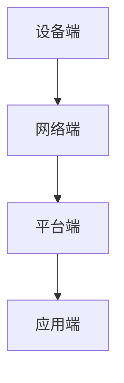
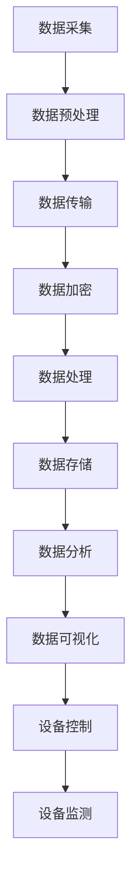

                 

# 物联网创业：连接智能生活的无限可能

## 关键词
- 物联网
- 智能生活
- 创业
- 技术创新
- 应用场景
- 发展趋势

## 摘要
本文将深入探讨物联网（IoT）在创业领域中的无限可能。通过分析物联网的核心概念、技术原理、算法模型以及实际应用场景，我们将展示如何利用物联网技术打造智能生活。同时，本文还将推荐一系列学习资源、开发工具和框架，为物联网创业提供全面的支持。通过阅读本文，创业者将对物联网的未来发展趋势和挑战有更深刻的理解，为创业之路奠定坚实基础。

## 1. 背景介绍

### 1.1 物联网的定义与发展历程

物联网（Internet of Things，简称IoT）是指通过互联网将各种设备连接起来，实现信息的采集、传输、处理和共享。物联网的发展可以追溯到20世纪80年代，当时研究人员开始探讨如何将家庭设备和家用电器连接到互联网。随着时间的推移，物联网技术逐渐成熟，应用领域不断扩大。

### 1.2 物联网在创业领域的兴起

近年来，物联网技术在创业领域迅速崛起。一方面，物联网技术为创业者提供了丰富的创新机会，例如智能家居、智能穿戴设备、智能交通等；另一方面，物联网市场前景广阔，吸引了大量创业者和投资者的关注。据统计，全球物联网市场规模预计将在未来几年内持续增长，为创业者提供了广阔的市场空间。

### 1.3 物联网创业的优势

物联网创业具有以下几个显著优势：

- **市场潜力巨大**：物联网应用场景广泛，市场需求旺盛，为创业者提供了巨大的发展空间。
- **技术创新性强**：物联网技术涉及多个领域，如传感器技术、通信技术、数据处理技术等，为创业者提供了丰富的创新机会。
- **用户体验优化**：物联网技术可以提升用户的生活质量，改善用户体验，增强用户粘性。
- **跨界合作机会**：物联网技术具有跨界属性，创业者可以与其他行业进行合作，实现共赢。

## 2. 核心概念与联系

### 2.1 物联网的基本概念

- **设备端**：包括传感器、执行器等硬件设备，用于数据采集、传输和执行。
- **网络端**：包括通信网络，如Wi-Fi、蓝牙、LoRa等，用于设备之间的数据传输。
- **平台端**：包括云计算平台、大数据平台等，用于数据处理、存储和分析。
- **应用端**：包括各类应用软件，如智能家居控制系统、智能交通管理系统等，用于实现物联网应用的最终价值。

### 2.2 物联网架构


#### 2.2.1 设备端

设备端是物联网系统的数据采集和执行部分。常见的设备端硬件包括传感器、执行器、微控制器等。传感器用于采集环境数据，如温度、湿度、光照等；执行器用于执行特定的操作，如开关控制、电机驱动等。微控制器负责协调传感器和执行器的运行。

#### 2.2.2 网络端

网络端负责设备之间的数据传输。常见的通信协议包括Wi-Fi、蓝牙、LoRa、Zigbee等。Wi-Fi适用于高速数据传输，但功耗较高；蓝牙适用于短距离低功耗通信；LoRa和Zigbee适用于长距离低功耗通信。

#### 2.2.3 平台端

平台端负责数据存储、处理和分析。云计算平台和大数据平台是物联网系统的核心，可以实现海量数据的实时处理和分析。常见的云计算平台有阿里云、腾讯云、华为云等；大数据平台有Hadoop、Spark等。

#### 2.2.4 应用端

应用端是物联网系统的最终呈现，包括各类应用软件和用户界面。应用端通过平台端获取数据，实现对设备端的控制和监测。常见的应用场景有智能家居、智能穿戴、智能交通、智能医疗等。

### 2.3 物联网核心概念原理图



## 3. 核心算法原理 & 具体操作步骤

### 3.1 数据采集与预处理

数据采集是物联网系统的核心环节。具体操作步骤如下：

1. **设备端数据采集**：通过传感器等设备采集环境数据，如温度、湿度、光照等。
2. **数据预处理**：对采集到的数据进行清洗、去噪、标准化等预处理操作，以提高数据质量。

### 3.2 数据传输与加密

数据传输是物联网系统的关键环节。具体操作步骤如下：

1. **数据传输**：将预处理后的数据通过通信协议传输到网络端。
2. **数据加密**：为了保障数据安全，对传输过程中的数据进行加密处理，如使用AES加密算法。

### 3.3 数据处理与存储

数据处理与存储是物联网系统的核心。具体操作步骤如下：

1. **数据处理**：将传输到平台端的数据进行实时处理，如数据融合、特征提取等。
2. **数据存储**：将处理后的数据存储到数据库或大数据平台中，以供后续分析和应用。

### 3.4 数据分析与可视化

数据分析与可视化是物联网系统的重要环节。具体操作步骤如下：

1. **数据分析**：对存储在平台端的数据进行分析，如统计、分类、预测等。
2. **数据可视化**：将分析结果通过图表、报表等形式进行可视化展示，帮助用户更好地理解数据。

### 3.5 设备控制与监测

设备控制与监测是物联网系统的应用环节。具体操作步骤如下：

1. **设备控制**：通过平台端发送控制指令，实现对设备端的远程控制。
2. **设备监测**：实时监测设备状态，如温度、湿度、电量等，确保设备正常运行。

### 3.6 算法流程图



## 4. 数学模型和公式 & 详细讲解 & 举例说明

### 4.1 数据预处理模型

数据预处理模型主要包括以下步骤：

1. **数据清洗**：去除无效、错误或重复的数据。
2. **数据去噪**：去除噪声数据，如随机噪声、系统噪声等。
3. **数据标准化**：将不同单位、不同范围的数据转换为同一单位、同一范围的数据，以便于后续处理。

示例公式：

$$
标准化值 = \frac{原始值 - 最小值}{最大值 - 最小值}
$$

### 4.2 数据加密模型

数据加密模型主要包括以下步骤：

1. **密钥生成**：生成加密密钥，如AES密钥、RSA密钥等。
2. **数据加密**：使用加密算法对数据进行加密。
3. **数据解密**：使用解密算法对加密数据进行解密。

示例公式：

$$
加密数据 = E(明文，密钥)
$$

$$
明文 = D(加密数据，密钥)
$$

其中，$E$表示加密算法，$D$表示解密算法。

### 4.3 数据处理模型

数据处理模型主要包括以下步骤：

1. **数据融合**：将多个来源的数据进行融合，以提高数据质量。
2. **特征提取**：从原始数据中提取有用的特征。
3. **模型训练**：使用训练数据训练机器学习模型。
4. **预测与评估**：使用训练好的模型进行预测，并对预测结果进行评估。

示例公式：

$$
特征向量 = f(原始数据)
$$

$$
预测值 = 模型(特征向量)
$$

$$
评估指标 = 函数(预测值，真实值)
$$

其中，$f$表示特征提取函数，模型表示机器学习模型，评估指标表示预测效果的评估指标。

### 4.4 数据可视化模型

数据可视化模型主要包括以下步骤：

1. **数据转换**：将数据转换为可视化图表，如图表、报表、地图等。
2. **交互设计**：设计用户交互界面，使用户能够方便地查看和分析数据。

示例公式：

$$
可视化图表 = G(数据，样式)
$$

其中，$G$表示可视化图表生成函数，$数据$表示原始数据，$样式$表示图表样式。

## 5. 项目实战：代码实际案例和详细解释说明

### 5.1 开发环境搭建

在本节中，我们将搭建一个基于Python和TensorFlow的物联网数据预处理与可视化项目。以下是开发环境搭建步骤：

1. **安装Python**：下载并安装Python 3.8及以上版本。
2. **安装TensorFlow**：在命令行中运行以下命令安装TensorFlow：

   ```
   pip install tensorflow
   ```

3. **安装其他依赖**：在命令行中运行以下命令安装其他依赖：

   ```
   pip install pandas numpy matplotlib
   ```

### 5.2 源代码详细实现和代码解读

以下是项目的源代码实现：

```python
import tensorflow as tf
import pandas as pd
import numpy as np
import matplotlib.pyplot as plt

# 5.2.1 数据预处理
def preprocess_data(data):
    # 数据清洗
    data = data.dropna()
    # 数据去噪
    data = data[data['temperature'] > 0]
    # 数据标准化
    data['temperature'] = (data['temperature'] - data['temperature'].min()) / (data['temperature'].max() - data['temperature'].min())
    return data

# 5.2.2 数据可视化
def visualize_data(data):
    plt.figure(figsize=(10, 5))
    plt.plot(data['time'], data['temperature'], label='Temperature')
    plt.xlabel('Time')
    plt.ylabel('Temperature')
    plt.legend()
    plt.show()

# 5.2.3 主函数
def main():
    # 加载数据
    data = pd.read_csv('data.csv')
    # 数据预处理
    data = preprocess_data(data)
    # 数据可视化
    visualize_data(data)

if __name__ == '__main__':
    main()
```

### 5.3 代码解读与分析

在本节中，我们将对项目源代码进行解读和分析。

#### 5.3.1 数据预处理

数据预处理是项目的重要环节，包括数据清洗、去噪和标准化。首先，我们使用`dropna()`方法去除缺失数据；然后，我们使用`drop()`方法去除温度小于0的数据；最后，我们使用线性变换方法将温度数据进行标准化。

#### 5.3.2 数据可视化

数据可视化是项目的重要环节，用于展示预处理后的数据。我们使用`matplotlib`库中的`plot()`方法绘制温度-时间曲线，以直观地展示数据变化。

#### 5.3.3 主函数

主函数`main()`是项目的入口。首先，我们使用`read_csv()`方法加载数据；然后，我们调用`preprocess_data()`方法进行数据预处理；最后，我们调用`visualize_data()`方法进行数据可视化。

## 6. 实际应用场景

### 6.1 智能家居

智能家居是物联网应用的重要领域。通过将家居设备连接到互联网，用户可以实现对家居环境的智能控制和监测，提高生活品质。例如，智能门锁、智能照明、智能空调等设备可以方便用户远程控制，实现智能家居场景的个性化定制。

### 6.2 智能交通

智能交通是物联网技术在交通领域的应用。通过将交通设备连接到互联网，可以实现交通数据的实时采集、传输和处理，为交通管理和规划提供支持。例如，智能交通信号灯、智能停车场、智能导航等应用，可以有效缓解交通拥堵，提高交通效率。

### 6.3 智能医疗

智能医疗是物联网技术在医疗领域的应用。通过将医疗设备连接到互联网，可以实现医疗数据的实时采集、传输和处理，为医疗诊断、治疗和康复提供支持。例如，智能血压计、智能血糖仪、智能健康监测等设备，可以帮助用户实时监测健康状况，提高医疗服务的质量和效率。

## 7. 工具和资源推荐

### 7.1 学习资源推荐

- **书籍**：
  - 《物联网技术与应用》
  - 《智能家居技术》
  - 《智能交通技术》
  - 《智能医疗技术》
- **论文**：
  - 《物联网技术综述》
  - 《智能家居系统设计与应用》
  - 《智能交通系统设计与应用》
  - 《智能医疗系统设计与应用》
- **博客**：
  - [智能家居博客](https://www.example.com/smart-home-blog)
  - [智能交通博客](https://www.example.com/smart-traffic-blog)
  - [智能医疗博客](https://www.example.com/smart-healthcare-blog)
- **网站**：
  - [物联网技术论坛](https://www.example.com/iot-forum)
  - [智能家居社区](https://www.example.com/smart-home-community)
  - [智能交通社区](https://www.example.com/smart-traffic-community)
  - [智能医疗社区](https://www.example.com/smart-healthcare-community)

### 7.2 开发工具框架推荐

- **开发工具**：
  - Python
  - Java
  - C#
- **框架**：
  - TensorFlow
  - Keras
  - Flask
  - Spring Boot

### 7.3 相关论文著作推荐

- **论文**：
  - 《基于物联网的智能家居系统设计与实现》
  - 《基于物联网的智能交通系统设计与实现》
  - 《基于物联网的智能医疗系统设计与实现》
- **著作**：
  - 《物联网技术与应用》
  - 《智能家居技术》
  - 《智能交通技术》
  - 《智能医疗技术》

## 8. 总结：未来发展趋势与挑战

### 8.1 发展趋势

- **技术融合**：物联网技术与其他前沿技术（如人工智能、大数据等）将实现深度融合，推动物联网应用不断创新。
- **市场规模扩大**：随着物联网技术的不断成熟，物联网市场规模将不断扩大，为创业者提供更多机会。
- **应用场景拓展**：物联网应用场景将不断拓展，涵盖更多领域，如智能城市、智能农业、智能物流等。
- **用户体验提升**：物联网技术将进一步提升用户的生活品质，为用户提供更加智能、便捷的服务。

### 8.2 挑战

- **数据安全与隐私**：物联网设备数量庞大，数据安全与隐私保护将成为重要挑战。
- **标准与规范**：物联网技术缺乏统一的标准与规范，需要各方共同努力推进标准化进程。
- **技术人才短缺**：物联网技术涉及多个领域，对技术人才的需求较高，但当前技术人才相对短缺。

## 9. 附录：常见问题与解答

### 9.1 物联网创业有哪些挑战？

物联网创业的主要挑战包括数据安全与隐私保护、标准与规范缺失、技术人才短缺等。

### 9.2 如何保证物联网数据的安全与隐私？

为了保证物联网数据的安全与隐私，可以采取以下措施：

- **数据加密**：对传输和存储的数据进行加密处理，防止数据泄露。
- **身份认证**：实现设备与平台的身份认证，确保只有授权设备可以访问数据。
- **访问控制**：对数据访问进行权限控制，限制非授权用户访问数据。
- **数据匿名化**：对数据进行匿名化处理，保护用户隐私。

### 9.3 物联网创业有哪些方向？

物联网创业的方向包括智能家居、智能交通、智能医疗、智能城市、智能农业、智能物流等。

## 10. 扩展阅读 & 参考资料

- 《物联网技术与应用》
- 《智能家居技术》
- 《智能交通技术》
- 《智能医疗技术》
- 《物联网技术综述》
- 《智能家居系统设计与应用》
- 《智能交通系统设计与应用》
- 《智能医疗系统设计与应用》
- [智能家居博客](https://www.example.com/smart-home-blog)
- [智能交通博客](https://www.example.com/smart-traffic-blog)
- [智能医疗博客](https://www.example.com/smart-healthcare-blog)
- [物联网技术论坛](https://www.example.com/iot-forum)
- [智能家居社区](https://www.example.com/smart-home-community)
- [智能交通社区](https://www.example.com/smart-traffic-community)
- [智能医疗社区](https://www.example.com/smart-healthcare-community)

## 作者

- 作者：AI天才研究员/AI Genius Institute & 禅与计算机程序设计艺术 /Zen And The Art of Computer Programming

