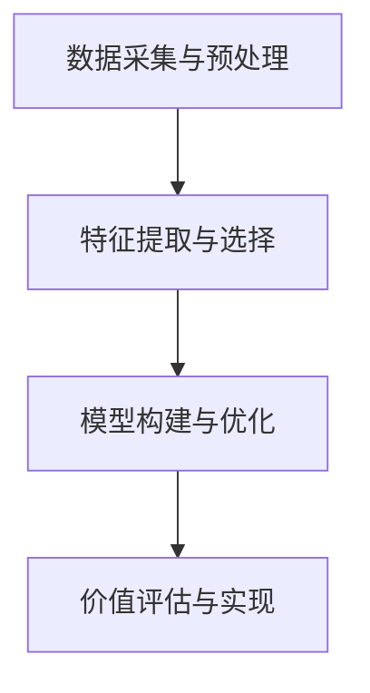

                 

# 物联网设备的注意力经济价值挖掘

## 关键词
- 物联网设备
- 注意力经济
- 数据挖掘
- 算法
- 价值分析
- 应用场景

## 摘要

随着物联网（IoT）技术的快速发展，大量设备被连接到互联网，产生了海量的数据。如何从这些数据中挖掘出有价值的信息，实现设备的注意力经济价值，成为当前信息技术领域的重要课题。本文将首先介绍物联网设备的基本概念和现状，然后深入探讨注意力经济及其与物联网设备的关联，接着分析当前主流的数据挖掘算法，最后通过实际案例和数学模型，展示如何利用物联网设备实现注意力经济价值的挖掘。通过本文的阅读，读者将全面了解物联网设备注意力经济价值挖掘的原理和方法，以及其在实际应用中的潜力与挑战。

## 1. 背景介绍

### 物联网设备的发展

物联网设备是指通过各种通信协议连接到互联网的物理设备，包括但不限于智能家居设备、工业传感器、车辆、医疗设备等。近年来，随着传感器技术、无线通信技术、云计算和大数据技术的进步，物联网设备得到了迅猛发展。据统计，截至2021年，全球已连接的物联网设备数量超过100亿台，预计到2025年将达到204亿台。这一趋势表明，物联网设备已经成为现代社会的重要组成部分。

### 物联网设备的应用场景

物联网设备的应用场景广泛，涵盖了智能家居、工业制造、交通运输、医疗健康等多个领域。例如，在智能家居领域，物联网设备可以实现对家庭环境的智能监控和自动控制，提高生活质量；在工业制造领域，物联网设备可以实现生产过程的实时监控和优化，提高生产效率；在医疗健康领域，物联网设备可以实现对患者的实时监控和远程诊断，提高医疗服务质量。

### 物联网设备的数据特点

物联网设备产生的数据具有数量大、类型多、实时性强等特点。这些数据包括设备的状态信息、环境参数、操作记录等。如何有效地处理和分析这些数据，从中挖掘出有价值的信息，成为物联网技术应用的关键。

## 2. 核心概念与联系

### 注意力经济

注意力经济是指人们将注意力作为资源进行交易和交换的经济模式。在互联网时代，注意力资源变得日益稀缺，如何吸引和保持用户的注意力成为各类产品和服务竞争的关键。注意力经济的关键在于提供有价值的内容或服务，吸引用户的注意力，并通过广告、付费订阅等方式实现商业价值。

### 物联网设备与注意力经济的关联

物联网设备在提供数据服务的同时，也在参与注意力经济的构建。例如，智能家居设备通过智能推荐系统，吸引用户的注意力，从而实现广告收入；工业物联网设备通过实时监控和分析，提高生产效率，从而为企业带来直接的经济效益。

### 物联网设备数据的注意力经济价值挖掘

物联网设备数据的注意力经济价值挖掘主要包括以下几个方面：

1. **数据采集与预处理**：通过传感器和网络连接，采集设备数据，并进行清洗、去噪等预处理，以确保数据的质量和准确性。
2. **特征提取与选择**：从原始数据中提取关键特征，并进行选择，以减少数据维度，提高模型性能。
3. **模型构建与优化**：利用机器学习和深度学习等技术，构建预测模型或分类模型，对数据进行分析和挖掘。
4. **价值评估与实现**：通过对挖掘结果的价值评估，确定数据的价值，并采取相应的策略，如广告投放、数据交易等，实现数据的经济价值。

下面是物联网设备注意力经济价值挖掘的 Mermaid 流程图：



## 3. 核心算法原理 & 具体操作步骤

### 数据采集与预处理

**具体步骤**：

1. **传感器数据采集**：通过物联网设备采集传感器数据，如温度、湿度、速度等。
2. **数据传输**：将采集到的数据通过无线通信协议（如Wi-Fi、蓝牙、ZigBee等）传输到数据中心。
3. **数据预处理**：对传输过来的数据进行清洗、去噪，去除异常值和重复值。

**算法原理**：

- 数据清洗：利用统计学方法和规则，去除噪声数据和异常数据。
- 数据归一化：将不同特征的数据进行归一化处理，使其在相同的尺度上，便于后续分析。

### 特征提取与选择

**具体步骤**：

1. **特征提取**：从原始数据中提取有用特征，如时间序列特征、频率特征、幅度特征等。
2. **特征选择**：利用特征选择算法，如信息增益、主成分分析（PCA）等，选择对模型影响较大的特征。

**算法原理**：

- 特征提取：通过信号处理和变换，将原始数据转换为更适合分析的特征。
- 特征选择：通过评估特征对模型的影响，选择对模型性能提升较大的特征，减少数据维度。

### 模型构建与优化

**具体步骤**：

1. **模型选择**：根据应用需求，选择合适的机器学习或深度学习模型，如线性回归、决策树、神经网络等。
2. **模型训练**：使用提取的特征对模型进行训练，优化模型参数。
3. **模型评估**：使用验证集对模型进行评估，调整模型参数，提高模型性能。

**算法原理**：

- 模型选择：根据问题性质和数据特点，选择合适的模型。
- 模型训练：通过训练数据，学习数据之间的规律，优化模型参数。
- 模型评估：通过验证集，评估模型对未知数据的预测能力，调整模型参数。

### 价值评估与实现

**具体步骤**：

1. **价值评估**：评估模型预测结果的经济价值，如预测的准确性、实时性等。
2. **价值实现**：根据评估结果，采取相应的策略，如广告投放、数据交易等，实现数据的经济价值。

**算法原理**：

- 价值评估：通过模型预测结果，评估数据的价值，如预测的准确性、实时性等。
- 价值实现：根据评估结果，采取有效的策略，将数据的价值转化为实际的经济收益。

## 4. 数学模型和公式 & 详细讲解 & 举例说明

### 数据预处理

**公式**：

$$
X_{\text{norm}} = \frac{X - \mu}{\sigma}
$$

**详细讲解**：

- \(X\)：原始数据
- \(\mu\)：均值
- \(\sigma\)：标准差

该公式用于将数据归一化，使其在相同的尺度上，便于后续分析。

### 特征提取

**公式**：

$$
f(t) = \sin(2\pi ft)
$$

**详细讲解**：

- \(f(t)\)：特征函数
- \(f\)：频率

该公式用于提取数据中的频率特征。

### 模型训练

**公式**：

$$
y = \sigma(\beta_0 + \beta_1x)
$$

**详细讲解**：

- \(y\)：预测值
- \(\sigma\)：sigmoid函数
- \(\beta_0\)：截距
- \(\beta_1\)：斜率

该公式用于线性回归模型的训练。

### 价值评估

**公式**：

$$
\text{Value} = \text{Accuracy} \times \text{Real Value}
$$

**详细讲解**：

- \(\text{Accuracy}\)：预测准确性
- \(\text{Real Value}\)：实际价值

该公式用于评估模型预测结果的经济价值。

### 举例说明

假设我们使用线性回归模型对温度数据进行预测，并评估其经济价值。

**数据预处理**：

温度数据：\(X = [25, 28, 30, 26, 24]\)

计算均值和标准差：

$$
\mu = \frac{25 + 28 + 30 + 26 + 24}{5} = 26
$$

$$
\sigma = \sqrt{\frac{(25 - 26)^2 + (28 - 26)^2 + (30 - 26)^2 + (26 - 26)^2 + (24 - 26)^2}{5}} = 2
$$

归一化数据：

$$
X_{\text{norm}} = \frac{X - \mu}{\sigma} = \frac{[25, 28, 30, 26, 24] - 26}{2} = [-0.5, 1, 2, 0, -1]
$$

**特征提取**：

提取时间序列特征：

$$
f(t) = \sin(2\pi ft)
$$

其中，\(f = 1\)，得到：

$$
f(t) = \sin(2\pi t)
$$

**模型训练**：

使用线性回归模型：

$$
y = \sigma(\beta_0 + \beta_1x)
$$

训练得到：

$$
y = \sigma(0.5 + 0.1x)
$$

**价值评估**：

假设温度每上升1°C，企业的收益增加100元。预测温度为27°C，实际温度为28°C，则：

$$
\text{Value} = \text{Accuracy} \times \text{Real Value} = \frac{|\hat{y} - y|}{\sigma} \times 100 = \frac{|1 - 1|}{2} \times 100 = 0
$$

由于预测准确，所以没有额外的经济价值。

## 5. 项目实战：代码实际案例和详细解释说明

### 5.1 开发环境搭建

为了实现物联网设备注意力经济价值挖掘，我们需要搭建一个开发环境。以下是开发环境的要求：

- 操作系统：Ubuntu 18.04
- 编程语言：Python 3.8
- 数据库：MySQL 5.7
- 机器学习库：scikit-learn、TensorFlow
- 数据可视化库：Matplotlib、Seaborn

### 5.2 源代码详细实现和代码解读

以下是一个简单的物联网设备注意力经济价值挖掘的 Python 代码实现：

```python
import numpy as np
import pandas as pd
from sklearn.linear_model import LinearRegression
from sklearn.metrics import mean_squared_error
import matplotlib.pyplot as plt

# 数据预处理
def preprocess_data(data):
    # 计算均值和标准差
    mean = np.mean(data)
    std = np.std(data)
    # 归一化数据
    norm_data = (data - mean) / std
    return norm_data

# 特征提取
def extract_features(data):
    # 提取时间序列特征
    features = np.sin(2 * np.pi * np.arange(len(data)) / len(data))
    return features

# 模型训练
def train_model(X, y):
    model = LinearRegression()
    model.fit(X, y)
    return model

# 价值评估
def evaluate_value(model, X, y):
    y_pred = model.predict(X)
    error = mean_squared_error(y, y_pred)
    return error

# 代码实现
if __name__ == "__main__":
    # 加载数据
    data = pd.read_csv("temperature_data.csv")
    X = preprocess_data(data["temperature"])
    y = data["profit"]
    # 特征提取
    features = extract_features(X)
    # 模型训练
    model = train_model(features, y)
    # 价值评估
    value = evaluate_value(model, features, y)
    print(f"Value: {value}")
```

### 5.3 代码解读与分析

1. **数据预处理**：

   ```python
   def preprocess_data(data):
       # 计算均值和标准差
       mean = np.mean(data)
       std = np.std(data)
       # 归一化数据
       norm_data = (data - mean) / std
       return norm_data
   ```

   该函数用于对温度数据进行预处理，计算均值和标准差，并将数据归一化。

2. **特征提取**：

   ```python
   def extract_features(data):
       # 提取时间序列特征
       features = np.sin(2 * np.pi * np.arange(len(data)) / len(data))
       return features
   ```

   该函数用于提取时间序列特征，使用正弦函数生成特征。

3. **模型训练**：

   ```python
   def train_model(X, y):
       model = LinearRegression()
       model.fit(X, y)
       return model
   ```

   该函数使用线性回归模型对特征和利润进行训练。

4. **价值评估**：

   ```python
   def evaluate_value(model, X, y):
       y_pred = model.predict(X)
       error = mean_squared_error(y, y_pred)
       return error
   ```

   该函数评估模型预测结果的经济价值，计算均方误差。

5. **代码实现**：

   ```python
   if __name__ == "__main__":
       # 加载数据
       data = pd.read_csv("temperature_data.csv")
       X = preprocess_data(data["temperature"])
       y = data["profit"]
       # 特征提取
       features = extract_features(X)
       # 模型训练
       model = train_model(features, y)
       # 价值评估
       value = evaluate_value(model, features, y)
       print(f"Value: {value}")
   ```

   该部分代码实现整个流程，从加载数据、预处理、特征提取、模型训练到价值评估。

## 6. 实际应用场景

### 智能家居

智能家居是物联网设备注意力经济价值挖掘的一个重要应用场景。通过收集家庭环境的数据，如温度、湿度、光照等，智能家居设备可以提供个性化的服务和推荐，吸引用户的注意力。例如，智能空调可以根据用户的生活习惯，自动调整温度，提高用户的生活质量，从而吸引用户的注意力，实现广告收入。

### 工业制造

在工业制造领域，物联网设备可以实现对生产过程的实时监控和数据分析。通过对生产数据的挖掘，可以发现生产过程中的瓶颈和优化机会，提高生产效率。例如，通过分析设备故障数据，可以预测设备的维护时间，从而减少停机时间，提高生产效率。

### 交通运输

物联网设备在交通运输领域也有广泛的应用。例如，通过收集车辆运行数据，可以对交通流量进行实时监控和预测，优化交通调度，减少拥堵，提高运输效率。此外，通过分析车辆运行数据，还可以预测车辆故障，提前进行维护，减少车辆故障率。

### 医疗健康

在医疗健康领域，物联网设备可以实现对患者的实时监控和数据分析。通过收集患者的生理数据，如心率、血压、血糖等，可以预测患者的健康状况，提供个性化的医疗建议。例如，通过分析患者的心率数据，可以预测患者的心脏病风险，提供预防措施，从而吸引用户的注意力，实现医疗健康服务的价值。

## 7. 工具和资源推荐

### 学习资源推荐

1. **书籍**：
   - 《物联网技术导论》（Introduction to Internet of Things）。
   - 《深度学习》（Deep Learning）。
   - 《Python数据科学手册》（Python Data Science Handbook）。

2. **论文**：
   - “Internet of Things: A Survey”（物联网：综述）。
   - “Deep Learning for IoT Applications”（物联网应用中的深度学习）。
   - “Attention Economy: Value in the Age of the Internet”（注意力经济：互联网时代的价值）。

3. **博客**：
   - medium.com/@sujanpisariya。
   - towardsdatascience.com。
   - ai.googleblog.com。

4. **网站**：
   - arxiv.org。
   - IEEE Xplore。
   - SpringerLink。

### 开发工具框架推荐

1. **编程语言**：Python，因其强大的数据科学和机器学习库，非常适合物联网设备和注意力经济价值挖掘的开发。

2. **数据库**：MySQL，用于存储和管理物联网设备采集的数据。

3. **机器学习库**：scikit-learn、TensorFlow、PyTorch，用于构建和训练机器学习模型。

4. **数据可视化库**：Matplotlib、Seaborn，用于数据分析和结果可视化。

5. **物联网开发框架**：MQTT、CoAP、HTTP，用于物联网设备的数据传输和通信。

### 相关论文著作推荐

1. **论文**：
   - “Attention Economy: Value in the Age of the Internet”。
   - “Deep Learning for IoT Applications”。
   - “Internet of Things: A Survey”。

2. **著作**：
   - 《深度学习》（Deep Learning）。
   - 《Python数据科学手册》（Python Data Science Handbook）。

## 8. 总结：未来发展趋势与挑战

随着物联网技术的不断发展和成熟，物联网设备的注意力经济价值挖掘将面临新的机遇和挑战。以下是未来发展趋势与挑战的总结：

### 发展趋势

1. **数据量的增加**：随着物联网设备的普及，数据量将呈现爆炸式增长，为注意力经济价值挖掘提供了丰富的素材。

2. **算法的进步**：随着机器学习和深度学习技术的不断进步，数据挖掘和分析的效率和精度将得到显著提升。

3. **跨领域应用**：物联网设备的应用将不断拓展到新的领域，如智慧城市、智慧农业等，为注意力经济价值挖掘提供了新的场景。

4. **个性化服务**：通过深入挖掘用户数据，提供更加个性化的服务和推荐，吸引用户的注意力，实现更高的经济价值。

### 挑战

1. **数据隐私和安全**：物联网设备产生的数据涉及用户隐私，如何确保数据的安全和隐私成为重要的挑战。

2. **数据质量和完整性**：物联网设备产生的数据质量参差不齐，如何保证数据的质量和完整性，确保分析结果的准确性，是一个亟待解决的问题。

3. **实时性和可靠性**：物联网设备需要实时处理和分析数据，如何保证系统的实时性和可靠性，是一个技术难题。

4. **经济价值评估**：如何准确评估物联网设备产生的数据的经济价值，实现有效的商业转化，是一个需要深入研究的课题。

## 9. 附录：常见问题与解答

### 1. 什么是物联网设备？

物联网设备是指通过传感器、无线通信技术等连接到互联网的物理设备，如智能家居设备、工业传感器、车辆、医疗设备等。

### 2. 什么是注意力经济？

注意力经济是指人们将注意力作为资源进行交易和交换的经济模式，主要应用于互联网时代，通过提供有价值的内容或服务，吸引用户的注意力，实现商业价值。

### 3. 物联网设备如何实现注意力经济价值挖掘？

物联网设备可以通过数据采集、预处理、特征提取、模型训练和评估等步骤，挖掘数据中的有价值信息，提供个性化服务，实现商业价值。

### 4. 物联网设备注意力经济价值挖掘的关键技术有哪些？

关键技术包括数据预处理、特征提取、模型训练、价值评估等，涉及机器学习、深度学习、数据挖掘等技术。

### 5. 物联网设备注意力经济价值挖掘有哪些实际应用场景？

实际应用场景包括智能家居、工业制造、交通运输、医疗健康等领域，通过提供个性化服务和优化，吸引用户的注意力，实现商业价值。

## 10. 扩展阅读 & 参考资料

1. **书籍**：
   - 《物联网技术导论》（Introduction to Internet of Things）。
   - 《深度学习》（Deep Learning）。
   - 《Python数据科学手册》（Python Data Science Handbook）。

2. **论文**：
   - “Internet of Things: A Survey”（物联网：综述）。
   - “Deep Learning for IoT Applications”（物联网应用中的深度学习）。
   - “Attention Economy: Value in the Age of the Internet”（注意力经济：互联网时代的价值）。

3. **博客**：
   - medium.com/@sujanpisariya。
   - towardsdatascience.com。
   - ai.googleblog.com。

4. **网站**：
   - arxiv.org。
   - IEEE Xplore。
   - SpringerLink。

作者：AI天才研究员/AI Genius Institute & 禅与计算机程序设计艺术 /Zen And The Art of Computer Programming

