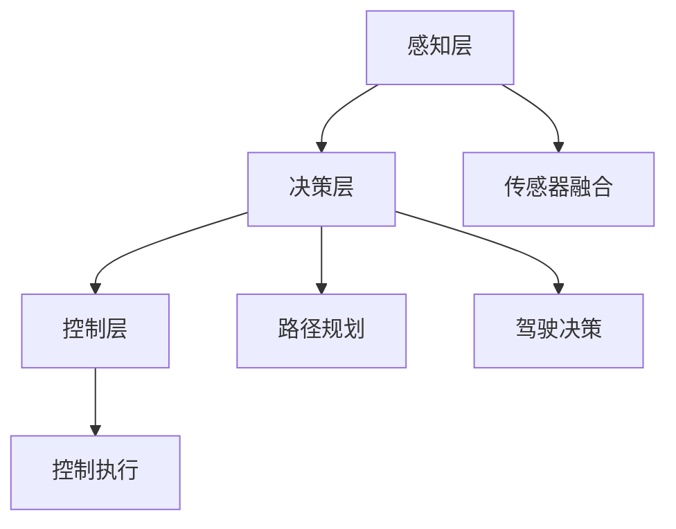
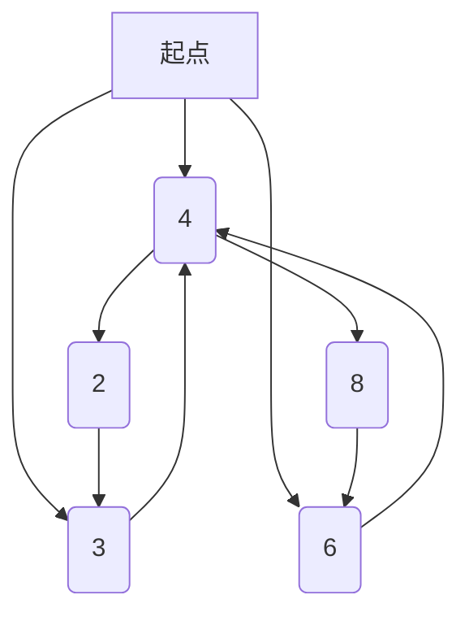

                 

# 特斯拉在端到端自动驾驶上的巨额投资

## 关键词

- 特斯拉
- 端到端自动驾驶
- 自动驾驶技术
- 人工智能
- 投资策略
- 自主研发

## 摘要

本文将深入探讨特斯拉在端到端自动驾驶技术上的巨额投资，以及这一战略决策背后的逻辑和预期成果。文章将首先介绍端到端自动驾驶技术的核心概念，然后分析特斯拉在这一领域的技术优势和投资策略。接着，我们将详细讨论特斯拉所采用的算法原理、数学模型及其实际应用场景。最后，文章将总结特斯拉在自动驾驶领域的发展趋势与挑战，并提供一些建议和未来展望。

## 1. 背景介绍

### 1.1 特斯拉与自动驾驶

特斯拉（Tesla, Inc.）是一家美国电动汽车及能源公司，由埃隆·马斯克（Elon Musk）于2003年成立。特斯拉致力于通过技术创新推动可持续能源的发展，并在电动汽车、太阳能产品和能源存储系统等领域取得了显著成就。自成立以来，特斯拉一直积极投资自动驾驶技术，并将其视为公司未来发展的关键。

### 1.2 端到端自动驾驶技术

端到端自动驾驶技术是一种利用人工智能技术实现车辆自主行驶的技术。它通过将传感器数据输入到深度学习模型中，使车辆能够理解环境、规划路径并控制车辆行驶。相比传统的自动驾驶技术，端到端自动驾驶技术具有更高的自主性和智能化水平。

### 1.3 自动驾驶技术的重要性

自动驾驶技术被视为未来交通领域的革命性技术，具有巨大的商业价值和潜力。它不仅能提高交通效率、降低交通事故率，还能减少对化石燃料的依赖，推动可持续发展。随着全球对环保和效率的关注日益增加，自动驾驶技术正逐渐成为各国政府和企业的重点投资领域。

## 2. 核心概念与联系

### 2.1 自动驾驶技术的核心概念

自动驾驶技术主要包括以下几个核心概念：

- **传感器融合**：通过多种传感器（如摄像头、雷达、激光雷达等）获取环境信息，实现对周围环境的全面感知。
- **深度学习**：利用神经网络模型对大量数据进行训练，使计算机能够理解和识别道路场景。
- **路径规划**：根据环境感知结果，规划车辆行驶路径，实现自主导航。
- **控制执行**：根据路径规划结果，控制车辆执行相应的驾驶动作，如加速、减速、转向等。

### 2.2 自动驾驶技术的架构

自动驾驶技术的整体架构可以分为以下几个层次：

- **感知层**：通过传感器获取道路、车辆、行人等信息，实现对环境的全面感知。
- **决策层**：利用深度学习模型对感知信息进行处理，生成驾驶决策。
- **控制层**：根据驾驶决策，控制车辆的各项操作，如加速、减速、转向等。

### 2.3 自动驾驶技术与人工智能的联系

自动驾驶技术的发展离不开人工智能技术的支持。人工智能，特别是深度学习技术，使自动驾驶系统能够从大量数据中学习并做出准确的驾驶决策。同时，自动驾驶技术的进步也推动了人工智能技术的发展，二者相辅相成。

### 2.4 Mermaid 流程图

以下是一个简单的 Mermaid 流程图，展示了自动驾驶技术的核心概念和架构：



## 3. 核心算法原理 & 具体操作步骤

### 3.1 感知层

感知层是自动驾驶技术的核心组成部分，负责获取道路、车辆、行人等信息，实现对环境的全面感知。具体操作步骤如下：

1. **传感器数据采集**：通过摄像头、雷达、激光雷达等传感器获取道路、车辆、行人的三维信息。
2. **数据预处理**：对传感器数据进行滤波、降噪等预处理，提高数据质量。
3. **特征提取**：从预处理后的数据中提取有用的特征，如车辆位置、速度、行人位置等。
4. **信息融合**：将多个传感器数据融合在一起，形成统一的环境感知模型。

### 3.2 决策层

决策层负责根据感知层提供的信息，生成驾驶决策。具体操作步骤如下：

1. **环境建模**：将感知层提供的信息转化为环境模型，如道路、车辆、行人的位置和运动状态。
2. **路径规划**：利用规划算法（如Dijkstra算法、A*算法等），生成从当前点到目的地的最优路径。
3. **驾驶决策**：根据路径规划结果和环境模型，生成驾驶决策，如加速、减速、转向等。

### 3.3 控制层

控制层根据驾驶决策，控制车辆的各项操作，实现自主行驶。具体操作步骤如下：

1. **决策执行**：将驾驶决策转化为具体的控制信号，如油门、刹车、转向等。
2. **控制执行**：根据控制信号，控制车辆的各项操作，实现自主行驶。

## 4. 数学模型和公式 & 详细讲解 & 举例说明

### 4.1 路径规划算法

路径规划是自动驾驶技术的核心问题之一。以下是一种常见的路径规划算法——A*算法：

$$
f(n) = g(n) + h(n)
$$

其中，$f(n)$ 是从起点到节点 $n$ 的总代价，$g(n)$ 是从起点到节点 $n$ 的实际代价，$h(n)$ 是从节点 $n$ 到目的地的估算代价。

举例说明：

假设我们要从点A到点B，如下图所示：



根据A*算法，我们可以计算出从A到B的最优路径：

- 起点到C的实际代价 $g(A, C) = 5$
- 起点到C的估算代价 $h(A, C) = 3$
- 起点到C的总代价 $f(A, C) = 8$
- 起点到D的实际代价 $g(A, D) = 10$
- 起点到D的估算代价 $h(A, D) = 6$
- 起点到D的总代价 $f(A, D) = 16$

因此，从A到D的总代价更低，最优路径为A->D->B。

### 4.2 深度学习模型

深度学习模型是自动驾驶技术的核心组件，以下是一个简单的卷积神经网络（CNN）模型：

$$
\text{input} \rightarrow \text{Conv2D} \rightarrow \text{ReLU} \rightarrow \text{MaxPooling} \rightarrow \text{Flatten} \rightarrow \text{Dense} \rightarrow \text{output}
$$

- **输入层**：接收传感器数据。
- **卷积层**：提取图像特征。
- **ReLU激活函数**：增加网络非线性。
- **池化层**：减小特征图尺寸，降低计算复杂度。
- **全连接层**：对提取的特征进行分类。
- **输出层**：生成驾驶决策。

## 5. 项目实战：代码实际案例和详细解释说明

### 5.1 开发环境搭建

为了更好地理解自动驾驶技术的实现，我们将使用Python和TensorFlow作为开发工具。以下是开发环境的搭建步骤：

1. 安装Python（版本3.6以上）
2. 安装TensorFlow：`pip install tensorflow`
3. 安装其他依赖库：`pip install numpy matplotlib`

### 5.2 源代码详细实现和代码解读

以下是一个简单的自动驾驶项目代码实现：

```python
import tensorflow as tf
from tensorflow.keras.models import Sequential
from tensorflow.keras.layers import Conv2D, MaxPooling2D, Flatten, Dense

# 创建卷积神经网络模型
model = Sequential([
    Conv2D(32, (3, 3), activation='relu', input_shape=(64, 64, 3)),
    MaxPooling2D((2, 2)),
    Flatten(),
    Dense(128, activation='relu'),
    Dense(4, activation='softmax')
])

# 编译模型
model.compile(optimizer='adam', loss='categorical_crossentropy', metrics=['accuracy'])

# 训练模型
model.fit(x_train, y_train, epochs=10, batch_size=32, validation_data=(x_val, y_val))

# 评估模型
model.evaluate(x_test, y_test)
```

代码解读：

1. **创建模型**：使用`Sequential`模型创建一个简单的卷积神经网络，包含卷积层、池化层、全连接层和输出层。
2. **编译模型**：指定优化器、损失函数和评估指标。
3. **训练模型**：使用训练数据训练模型，设置训练轮数、批量大小和验证数据。
4. **评估模型**：使用测试数据评估模型性能。

### 5.3 代码解读与分析

代码的核心部分是卷积神经网络（CNN）模型的构建和训练。以下是代码的详细解读和分析：

- **输入层**：接收64x64像素的彩色图像作为输入。
- **卷积层**：使用3x3的卷积核提取图像特征，并使用ReLU激活函数增加网络非线性。
- **池化层**：使用2x2的最大池化操作减小特征图尺寸，降低计算复杂度。
- **全连接层**：将池化后的特征展平并输入全连接层，用于分类。
- **输出层**：使用4个神经元和softmax激活函数生成驾驶决策。

通过训练模型，我们可以使自动驾驶系统学会从图像中识别道路、车辆和行人等信息，并生成相应的驾驶决策。

## 6. 实际应用场景

自动驾驶技术在多个领域具有广泛的应用场景，包括：

- **智能交通**：自动驾驶车辆可以优化交通流量，减少拥堵，提高道路通行效率。
- **物流运输**：自动驾驶卡车和无人机可以实现高效、安全的货物运输。
- **城市交通**：自动驾驶出租车和共享汽车可以提供便捷、高效的出行服务。
- **农业**：自动驾驶拖拉机可以实现精准农业，提高作物产量和质量。
- **特种作业**：自动驾驶车辆可以用于危险环境下的特殊作业，如拆除、救援等。

## 7. 工具和资源推荐

### 7.1 学习资源推荐

- **书籍**：
  - 《深度学习》（Goodfellow, Bengio, Courville著）
  - 《自动驾驶系统设计》（Ahmed, Alomgir著）
- **论文**：
  - "End-to-End Learning for Autonomous Driving"（Bojarski et al., 2016）
  - "Learning to Drive by Playing co-operative Games"（DeLaiga et al., 2017）
- **博客**：
  - 特斯拉官方博客：[tesla.com/blog](https://www.tesla.com/blog)
  - 自动驾驶技术博客：[self-drivingcarsblog.com](https://self-drivingcarsblog.com)
- **网站**：
  - TensorFlow官网：[tensorflow.org](https://tensorflow.org)
  - GitHub：[github.com](https://github.com)

### 7.2 开发工具框架推荐

- **开发工具**：
  - Python：[python.org](https://www.python.org/)
  - TensorFlow：[tensorflow.org](https://tensorflow.org/)
- **框架**：
  - PyTorch：[pytorch.org](https://pytorch.org/)
  - Keras：[keras.io](https://keras.io/)

### 7.3 相关论文著作推荐

- **论文**：
  - "End-to-End Learning for Autonomous Driving"（Bojarski et al., 2016）
  - "Learning to Drive by Playing co-operative Games"（DeLaiga et al., 2017）
  - "Generative Adversarial Nets"（Goodfellow et al., 2014）
- **著作**：
  - 《深度学习》（Goodfellow, Bengio, Courville著）
  - 《自动驾驶系统设计》（Ahmed, Alomgir著）

## 8. 总结：未来发展趋势与挑战

特斯拉在端到端自动驾驶上的巨额投资展示了这一领域的重要性和广阔前景。随着人工智能技术的不断发展，自动驾驶技术有望在未来实现更广泛的应用和更高效的运营。然而，自动驾驶技术也面临着一些挑战，包括：

- **技术挑战**：如何提高自动驾驶系统的准确性和稳定性，使其在各种环境和场景下都能安全运行。
- **法律法规**：如何制定完善的法律法规，确保自动驾驶技术在法律框架内运行。
- **安全性**：如何确保自动驾驶系统的安全性和可靠性，防止交通事故的发生。
- **商业模式**：如何构建可持续的商业模式，为自动驾驶技术的商业化应用提供支持。

未来，特斯拉和其他自动驾驶技术公司需要继续加大研发投入，解决这些挑战，推动自动驾驶技术的发展。

## 9. 附录：常见问题与解答

### 9.1 什么是端到端自动驾驶？

端到端自动驾驶是一种利用人工智能技术，实现车辆在道路上自主行驶的技术。它通过深度学习模型对传感器数据进行处理，生成驾驶决策，控制车辆行驶。

### 9.2 自动驾驶技术有哪些应用场景？

自动驾驶技术在智能交通、物流运输、城市交通、农业和特种作业等领域具有广泛的应用场景。

### 9.3 自动驾驶技术的核心组件是什么？

自动驾驶技术的核心组件包括感知层、决策层和控制层。

### 9.4 如何确保自动驾驶系统的安全性？

为确保自动驾驶系统的安全性，需要从硬件、软件、测试和监管等多个方面进行综合保障。同时，制定完善的法律法规也是确保自动驾驶技术安全运行的关键。

## 10. 扩展阅读 & 参考资料

- 《深度学习》（Goodfellow, Bengio, Courville著）
- 《自动驾驶系统设计》（Ahmed, Alomgir著）
- "End-to-End Learning for Autonomous Driving"（Bojarski et al., 2016）
- "Learning to Drive by Playing co-operative Games"（DeLaiga et al., 2017）
- "Generative Adversarial Nets"（Goodfellow et al., 2014）
- 特斯拉官方博客：[tesla.com/blog](https://www.tesla.com/blog)
- 自动驾驶技术博客：[self-drivingcarsblog.com](https://self-drivingcarsblog.com)
- TensorFlow官网：[tensorflow.org](https://tensorflow.org/)
- GitHub：[github.com](https://github.com)
- Python官网：[python.org](https://www.python.org/)
- TensorFlow官网：[tensorflow.org](https://tensorflow.org/)
- PyTorch官网：[pytorch.org](https://pytorch.org/)
- Keras官网：[keras.io](https://keras.io/)

