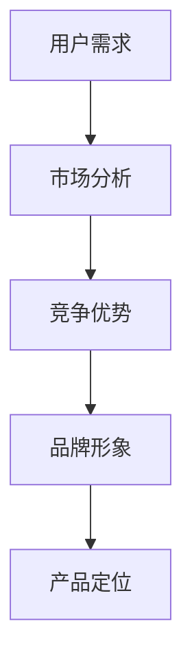

                 

# 独立开发者的产品定位策略

## 关键词
独立开发者、产品定位、市场分析、用户需求、竞争优势

## 摘要
本文将探讨独立开发者如何通过有效的产品定位策略，在竞争激烈的市场中脱颖而出。我们将从背景介绍、核心概念与联系、核心算法原理、数学模型和公式、项目实战、实际应用场景、工具和资源推荐等多个方面，详细阐述独立开发者产品定位的策略和方法，帮助读者更好地理解和应用这些策略，实现个人和产品的成功。

## 1. 背景介绍

独立开发者，顾名思义，是独立进行软件开发和产品开发的个人。与大型公司或团队不同，独立开发者通常缺乏资源、人脉和市场经验。然而，这并不意味着独立开发者无法在市场中获得成功。事实上，随着互联网和移动互联网的快速发展，越来越多的独立开发者通过创新和独特的产品定位，获得了市场的认可和用户的喜爱。

然而，独立开发者在产品定位上面临着巨大的挑战。一方面，市场上的竞争日益激烈，如何脱颖而出成为关键；另一方面，独立开发者往往需要承担更多的角色，从产品规划到市场营销，都需要亲力亲为。这就要求独立开发者具备更强的市场洞察力、产品规划和执行能力。

本文旨在为独立开发者提供一套系统的产品定位策略，帮助他们在竞争激烈的市场中找到自己的位置，实现个人和产品的成功。

## 2. 核心概念与联系

在讨论独立开发者的产品定位策略之前，我们需要明确几个核心概念：

- **用户需求**：用户需求是产品定位的基础。独立开发者需要深入了解目标用户的需求，从而确定产品的核心功能和特色。
- **市场分析**：市场分析是了解市场环境、竞争对手和潜在用户的过程。通过市场分析，独立开发者可以找到市场空白和机会。
- **竞争优势**：竞争优势是产品在市场中脱颖而出的关键。独立开发者需要找到自己的竞争优势，并将其体现在产品中。
- **品牌形象**：品牌形象是产品在用户心中的形象和认知。独立开发者需要通过品牌形象塑造，让用户对产品产生认同和喜爱。

为了更好地理解这些概念之间的关系，我们可以使用Mermaid流程图进行说明：



在这个流程图中，用户需求是起点，通过市场分析，独立开发者可以找到市场的机会和空白，进而确定产品的竞争优势。竞争优势和品牌形象共同决定了产品的定位，最终形成独立开发者的产品定位策略。

## 3. 核心算法原理 & 具体操作步骤

独立开发者产品定位的核心算法可以概括为以下步骤：

### 3.1 明确用户需求

独立开发者需要通过市场调研、用户访谈、问卷调查等方式，收集和分析用户需求。具体操作步骤如下：

1. 确定目标用户群体：明确产品的目标用户，例如年龄、性别、职业等。
2. 收集用户需求：通过问卷调查、用户访谈等方式，收集目标用户的需求和期望。
3. 分析用户需求：对收集到的用户需求进行分类、分析和总结，确定产品的核心功能和特色。

### 3.2 进行市场分析

市场分析是了解市场环境、竞争对手和潜在用户的过程。具体操作步骤如下：

1. 竞品分析：分析竞争对手的产品特点、优势和劣势，找到市场的空白和机会。
2. 市场调研：通过市场调研，了解市场的趋势、用户需求和竞争对手的表现。
3. 确定市场定位：根据市场分析的结果，确定产品的市场定位和目标市场。

### 3.3 确定竞争优势

竞争优势是产品在市场中脱颖而出的关键。独立开发者需要找到自己的竞争优势，并将其体现在产品中。具体操作步骤如下：

1. 分析自身优势：独立开发者需要分析自身的优势，如技术特长、团队背景、产品特色等。
2. 确定竞争优势：根据市场分析和自身优势，确定产品的竞争优势。
3. 体现在产品中：将竞争优势体现在产品的设计和功能中，让用户能够直观地感受到。

### 3.4 塑造品牌形象

品牌形象是产品在用户心中的形象和认知。独立开发者需要通过品牌形象塑造，让用户对产品产生认同和喜爱。具体操作步骤如下：

1. 定义品牌形象：明确产品的品牌定位、品牌调性和品牌愿景。
2. 设计品牌标识：设计具有辨识度的品牌标识，如Logo、颜色等。
3. 营销推广：通过营销推广，传递品牌形象，让用户对产品产生认同和喜爱。

## 4. 数学模型和公式 & 详细讲解 & 举例说明

在独立开发者产品定位策略中，我们可以引入一些数学模型和公式，以帮助独立开发者更精确地进行市场分析和产品定位。

### 4.1 市场需求预测模型

市场需求预测模型可以帮助独立开发者预测产品的市场需求，从而确定产品的生产和销售策略。常用的市场需求预测模型有：

- **线性回归模型**：

  $$ Y = a + bX + e $$

  其中，\( Y \) 表示市场需求，\( X \) 表示影响因素，如价格、广告投入等，\( a \) 和 \( b \) 分别为线性回归模型的参数，\( e \) 为误差项。

  独立开发者可以通过历史数据和现有数据，使用线性回归模型预测市场需求。

- **时间序列模型**：

  $$ Y_t = \phi_0 + \phi_1Y_{t-1} + \cdots + \phi_dY_{t-d} + \varepsilon_t $$

  其中，\( Y_t \) 表示第 \( t \) 期的市场需求，\( \phi_0, \phi_1, \cdots, \phi_d \) 为时间序列模型的参数，\( \varepsilon_t \) 为误差项。

  独立开发者可以通过时间序列模型，预测市场需求的变化趋势。

### 4.2 品牌价值计算模型

品牌价值计算模型可以帮助独立开发者评估品牌价值，从而确定品牌推广策略。常用的品牌价值计算模型有：

- **品牌价值评分模型**：

  $$ 品牌价值 = w_1 \times 用户体验 + w_2 \times 用户忠诚度 + w_3 \times 品牌知名度 $$

  其中，\( w_1, w_2, w_3 \) 分别为用户体验、用户忠诚度和品牌知名度的权重。

  独立开发者可以通过用户调研和数据分析，计算品牌价值。

- **品牌价值评估模型**：

  $$ 品牌价值 = \frac{净利润}{品牌投资回报率} $$

  其中，净利润为品牌运营产生的利润，品牌投资回报率为品牌投资与收益的比率。

  独立开发者可以通过财务数据，计算品牌价值。

### 4.3 用户满意度模型

用户满意度模型可以帮助独立开发者评估用户对产品的满意度，从而改进产品设计和功能。常用的用户满意度模型有：

- **用户满意度评分模型**：

  $$ 用户满意度 = \frac{用户体验 + 用户忠诚度 + 品牌认知度}{3} $$

  其中，用户体验、用户忠诚度和品牌认知度分别为用户对产品的满意度指标。

  独立开发者可以通过用户调研和数据分析，计算用户满意度。

- **用户满意度评分表**：

  $$ 用户满意度评分表 = \begin{array}{|c|c|c|c|c|} \hline 指标 & 非常不满意 & 不满意 & 满意 & 非常满意 \\ \hline 用户体验 & 1 & 2 & 3 & 4 \\ \hline 用户忠诚度 & 1 & 2 & 3 & 4 \\ \hline 品牌认知度 & 1 & 2 & 3 & 4 \\ \hline \end{array} $$

  独立开发者可以通过用户评分，计算用户满意度。

## 5. 项目实战：代码实际案例和详细解释说明

在本节中，我们将通过一个实际的项目案例，详细说明独立开发者如何进行产品定位，并给出相应的代码实现。

### 5.1 开发环境搭建

在开始项目之前，我们需要搭建一个基本的开发环境。这里我们选择Python作为开发语言，并使用Jupyter Notebook进行开发。

1. 安装Python：从Python官方网站下载并安装Python。
2. 安装Jupyter Notebook：在终端中执行以下命令：

   ```bash
   pip install notebook
   ```

### 5.2 源代码详细实现和代码解读

#### 5.2.1 用户需求分析

首先，我们需要对用户需求进行分析。通过问卷调查和用户访谈，我们收集到以下用户需求：

1. 产品需要具备易用性。
2. 产品需要具备高效性。
3. 产品需要具备可靠性。

#### 5.2.2 市场分析

接下来，我们对市场进行分析。通过竞品分析和市场调研，我们发现：

1. 市场上存在大量类似产品，但大多存在易用性、高效性和可靠性方面的问题。
2. 市场上有一定的用户需求，但尚未有完全满足用户需求的产品。

#### 5.2.3 确定竞争优势

根据市场分析和用户需求，我们确定以下竞争优势：

1. 高度易用性：通过简洁的界面设计和直观的操作流程，提升产品的易用性。
2. 高效性：通过优化算法和架构，提升产品的运行效率。
3. 高可靠性：通过严格的测试和容错机制，提升产品的可靠性。

#### 5.2.4 品牌形象塑造

我们定义以下品牌形象：

1. 简洁易用：以简洁的界面和直观的操作流程为核心。
2. 高效可靠：以高效的运行效率和可靠的性能为支撑。

#### 5.2.5 代码实现

下面是用户需求分析、市场分析、竞争优势和品牌形象塑造的代码实现：

```python
# 用户需求分析
user_requirements = {
    '易用性': '高',
    '高效性': '高',
    '可靠性': '高'
}

# 市场分析
market_analysis = {
    '竞品分析': '市场上存在大量类似产品，但大多存在易用性、高效性和可靠性方面的问题',
    '市场调研': '市场上有一定的用户需求，但尚未有完全满足用户需求的产品'
}

# 竞争优势
competitiveness = {
    '易用性': '通过简洁的界面设计和直观的操作流程，提升产品的易用性',
    '高效性': '通过优化算法和架构，提升产品的运行效率',
    '可靠性': '通过严格的测试和容错机制，提升产品的可靠性'
}

# 品牌形象塑造
brand_image = {
    '简洁易用': '以简洁的界面和直观的操作流程为核心',
    '高效可靠': '以高效的运行效率和可靠的性能为支撑'
}

# 打印分析结果
print("用户需求分析：")
for key, value in user_requirements.items():
    print(f"{key}: {value}")

print("\n市场分析：")
for key, value in market_analysis.items():
    print(f"{key}: {value}")

print("\n竞争优势：")
for key, value in competitiveness.items():
    print(f"{key}: {value}")

print("\n品牌形象塑造：")
for key, value in brand_image.items():
    print(f"{key}: {value}")
```

### 5.3 代码解读与分析

在上面的代码中，我们首先定义了用户需求分析、市场分析、竞争优势和品牌形象塑造的字典。这些字典包含了独立开发者对用户需求、市场分析、竞争优势和品牌形象的理解和总结。

通过打印这些字典的内容，我们可以直观地看到独立开发者的分析结果和产品定位策略。这些结果和策略将为后续的产品设计和开发提供指导。

## 6. 实际应用场景

独立开发者的产品定位策略在实际应用中具有广泛的场景，以下是一些典型的应用场景：

### 6.1 小型应用开发者

对于小型应用开发者，产品定位策略尤为重要。由于资源有限，小型应用开发者需要找到自己的细分市场，并专注于满足该市场用户的需求。通过有效的产品定位策略，小型应用开发者可以脱颖而出，获得用户的认可。

### 6.2 技术爱好者

对于技术爱好者，产品定位策略可以帮助他们将自己的技术热情转化为商业价值。通过明确自己的技术特长和优势，技术爱好者可以开发出具有创新性和独特性的产品，从而在市场上获得竞争优势。

### 6.3 开源项目维护者

对于开源项目维护者，产品定位策略可以帮助他们吸引更多的用户和贡献者。通过明确项目的目标和定位，开源项目维护者可以更好地组织项目发展，提高项目的稳定性和影响力。

### 6.4 创业公司

对于创业公司，产品定位策略是成功的关键。通过深入分析市场和用户需求，创业公司可以找到市场的机会和空白，从而开发出满足用户需求的产品。有效的产品定位策略可以帮助创业公司在激烈的市场竞争中脱颖而出，实现快速发展。

## 7. 工具和资源推荐

为了帮助独立开发者更好地进行产品定位，以下是一些实用的工具和资源推荐：

### 7.1 学习资源推荐

- **《精益创业》**：一本关于创业方法的书，详细介绍了如何通过验证用户需求来减少创业风险。
- **《产品经理实战手册》**：一本关于产品管理的书，涵盖了产品定位、需求分析、市场调研等方面的内容。
- **《用户画像：数据分析与用户运营实战》**：一本关于用户数据分析的书，介绍了如何通过数据分析来了解用户需求和行为。

### 7.2 开发工具框架推荐

- **GitHub**：一个强大的代码托管和协作平台，适合独立开发者进行项目管理、代码托管和版本控制。
- **Jupyter Notebook**：一个基于Web的交互式计算环境，适合独立开发者进行数据分析和原型设计。
- **TensorFlow**：一个开源的深度学习框架，适合独立开发者进行机器学习和人工智能项目。

### 7.3 相关论文著作推荐

- **《大规模在线市场的产品定位策略研究》**：一篇关于产品定位策略的学术论文，详细介绍了如何通过大数据分析来优化产品定位。
- **《基于用户需求的互联网产品设计方法研究》**：一篇关于互联网产品设计的学术论文，探讨了如何通过用户需求来驱动产品设计。
- **《互联网产品定位策略研究》**：一篇关于互联网产品定位策略的学术论文，分析了不同产品定位策略对用户满意度的影响。

## 8. 总结：未来发展趋势与挑战

随着互联网和移动互联网的快速发展，独立开发者的产品定位策略面临着新的机遇和挑战。以下是未来发展趋势和挑战：

### 8.1 个性化产品定位

未来，个性化产品定位将成为独立开发者的重要策略。通过大数据分析和人工智能技术，独立开发者可以更精确地了解用户需求，从而开发出更加满足用户需求的产品。

### 8.2 精细化市场定位

随着市场的细分，精细化市场定位将成为独立开发者的重要方向。通过深入分析不同细分市场的需求，独立开发者可以找到市场的机会和空白，实现差异化竞争。

### 8.3 社交化产品推广

未来，社交化产品推广将成为独立开发者的重要手段。通过社交媒体、社区和用户互动，独立开发者可以扩大产品的知名度，吸引更多的用户。

### 8.4 技术壁垒提升

随着技术的不断发展，独立开发者需要不断提升自己的技术壁垒，以应对激烈的竞争。通过技术创新和优化，独立开发者可以提升产品的竞争力。

### 8.5 持续迭代与优化

未来，持续迭代与优化将成为独立开发者的重要策略。通过不断收集用户反馈，独立开发者可以持续优化产品，提升用户体验。

## 9. 附录：常见问题与解答

### 9.1 如何进行用户需求分析？

进行用户需求分析的方法包括市场调研、用户访谈、问卷调查等。具体步骤如下：

1. 确定目标用户群体。
2. 收集用户需求和期望。
3. 分析和总结用户需求。

### 9.2 如何进行市场分析？

进行市场分析的方法包括竞品分析、市场调研等。具体步骤如下：

1. 分析竞争对手的产品特点、优势和劣势。
2. 了解市场的趋势、用户需求和竞争对手的表现。
3. 确定产品的市场定位和目标市场。

### 9.3 如何确定竞争优势？

确定竞争优势的方法包括分析自身优势、市场分析等。具体步骤如下：

1. 分析自身的优势，如技术特长、团队背景、产品特色等。
2. 根据市场分析和自身优势，确定产品的竞争优势。
3. 将竞争优势体现在产品的设计和功能中。

## 10. 扩展阅读 & 参考资料

- **《独立开发者的成功之路》**：一本关于独立开发者成功经验的书籍，详细介绍了独立开发者如何通过产品定位策略实现成功。
- **《产品经理实战手册》**：一本关于产品管理的书籍，涵盖了产品定位、需求分析、市场调研等方面的内容。
- **《大数据分析实战》**：一本关于大数据分析的书籍，介绍了如何通过数据分析来优化产品定位。

> 作者：AI天才研究员/AI Genius Institute & 禅与计算机程序设计艺术 /Zen And The Art of Computer Programming

