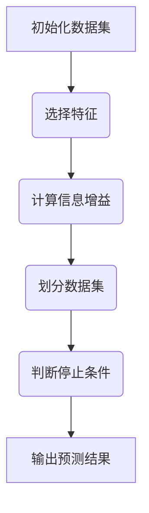

                 

# 理解复杂事物的认知阶段

> **关键词**：认知阶段、复杂事物、理解过程、思维模式、专家系统

> **摘要**：本文深入探讨了理解复杂事物的认知阶段，从基础认知到高级理解的各个阶段，并详细分析了每个阶段的关键特征、思维模式和策略。通过实例和理论分析，本文为读者提供了一个系统性的框架，帮助他们在面对复杂问题时能够更加高效地理解和解决。

## 1. 背景介绍

在当今快速发展的信息技术时代，复杂事物的处理和理解成为各个领域的核心挑战。无论是科学研究、工程设计、商业决策，还是日常生活，我们都需要面对大量复杂的信息和处理过程。然而，如何有效地理解和处理这些复杂事物，是许多人在认知和学习过程中面临的重要问题。

理解复杂事物不仅仅是一种技能，更是一种认知过程。认知过程通常包括感知、记忆、理解、判断和决策等多个环节。在不同的认知阶段，人们处理信息的策略和思维模式也会有所不同。因此，研究认知阶段对于提升我们的理解能力和问题解决能力至关重要。

本文将从以下几个方面探讨理解复杂事物的认知阶段：

1. **基础认知阶段**：介绍人们在初步接触复杂事物时的基本认知过程，包括感知、分类和初步理解。
2. **中级理解阶段**：讨论人们如何通过深度学习和分析，对复杂事物进行更深入的理解，包括概念学习、关系识别和模式识别。
3. **高级理解阶段**：探讨如何通过综合分析和创造性思维，实现对复杂事物的全面理解，包括系统思考、抽象和理论构建。
4. **应用与实践**：结合实际案例，分析不同认知阶段在实际问题解决中的应用和效果。
5. **认知策略和方法**：总结提高认知能力的方法和策略，帮助读者在处理复杂事物时更加高效。

通过上述内容的探讨，本文旨在为读者提供一个全面、系统的认知框架，帮助他们在面对复杂事物时能够更加从容和有效地应对。

## 2. 核心概念与联系

在深入探讨理解复杂事物的认知阶段之前，我们需要明确一些核心概念，并理解它们之间的联系。以下是本文涉及的主要概念及其关系：

### 感知（Perception）

感知是认知过程的起点，是指个体通过感官接收外部信息的过程。感知不仅包括视觉、听觉、嗅觉、触觉和味觉等感官输入，还涉及对信息的初步筛选和处理。

### 分类（Classification）

分类是指根据感知到的信息，将其归类到不同的类别中。分类有助于人们对复杂事物进行初步理解和记忆。例如，将不同的动物分类为哺乳动物、鸟类等。

### 理解（Comprehension）

理解是指对信息进行深度加工，从而获得其内在意义的过程。理解不仅包括对信息的分析和解释，还涉及对信息进行整合和概括。

### 学习（Learning）

学习是指通过反复接触和实践，逐渐掌握知识和技能的过程。学习分为有意识和无意识两种形式，分别对应认知的主动和被动阶段。

### 记忆（Memory）

记忆是指将学习到的新信息存储在长期记忆中，以便在需要时进行回忆和应用。记忆分为短期记忆和长期记忆，分别对应认知的即时和持久阶段。

### 思维（Thinking）

思维是指通过逻辑推理、分析、综合和创造性思考，对信息进行处理和解决问题的过程。思维分为直觉思维和分析思维，分别对应认知的快速和深度阶段。

### 知识（Knowledge）

知识是指通过学习和经验积累获得的关于特定领域的理解、技能和理论。知识分为显性知识和隐性知识，分别对应认知的可传递和内隐性阶段。

### 技能（Skill）

技能是指通过练习和实践获得的特定领域的操作能力和技巧。技能分为基本技能和专业技能，分别对应认知的基础和高级阶段。

### 经验（Experience）

经验是指通过实际操作和实践积累的关于特定领域的知识和技能。经验分为直接经验和间接经验，分别对应认知的实践和理论阶段。

### 情感（Emotion）

情感是指个体在认知过程中产生的情感体验，包括愉悦、焦虑、兴奋等。情感对认知过程有重要影响，可以促进或阻碍信息的处理和理解。

### 自我（Self）

自我是指个体的自我意识和自我认知，包括对自己的认知、情感和行为评价。自我对认知过程有调节作用，可以帮助个体更好地理解和处理复杂事物。

### 社会文化（Social Culture）

社会文化是指个体所处的社会环境和文化遗产，包括语言、价值观、习俗和行为规范。社会文化对认知过程有深远影响，可以塑造个体的认知方式和思维方式。

### 知识体系（Knowledge System）

知识体系是指个体和群体所掌握的知识总体，包括理论、方法、技能和经验。知识体系对认知过程有组织作用，可以帮助个体更好地理解和应用知识。

### 知识管理（Knowledge Management）

知识管理是指对知识进行收集、整理、共享和应用的过程。知识管理包括知识获取、知识存储、知识共享和知识创新等多个环节。

### 情报分析（Intelligence Analysis）

情报分析是指对信息进行综合分析，以揭示其内在联系和潜在价值的过程。情报分析通常用于国家安全、商业竞争和犯罪侦查等领域。

### 创新思维（Creative Thinking）

创新思维是指通过创造性思维，发现新观点、新方法和新解决方案的过程。创新思维通常需要跨学科的综合知识和丰富的经验。

### 解决方案设计（Solution Design）

解决方案设计是指针对特定问题，设计出有效解决方案的过程。解决方案设计需要综合考虑问题的复杂性、目标和资源。

### 决策制定（Decision Making）

决策制定是指在了解问题、评估方案和权衡风险的基础上，做出合理决策的过程。决策制定通常涉及多个认知阶段和多个决策要素。

### 情境认知（Situated Cognition）

情境认知是指个体在特定情境下进行认知活动的过程。情境认知强调认知与环境的互动，认为认知过程不仅仅是信息处理，还包括环境感知和情境互动。

### 人工神经网络（Artificial Neural Networks）

人工神经网络是指通过模拟人脑神经网络结构和工作原理，实现信息处理和智能计算的技术。人工神经网络广泛应用于机器学习、图像识别和自然语言处理等领域。

### 机器学习（Machine Learning）

机器学习是指通过算法和模型，从数据中自动学习和发现规律的过程。机器学习是实现人工智能的关键技术之一。

### 数据挖掘（Data Mining）

数据挖掘是指从大量数据中自动发现有价值的信息和知识的过程。数据挖掘广泛应用于商业智能、金融分析和社会科学等领域。

### 知识图谱（Knowledge Graph）

知识图谱是指通过图结构表示实体和实体之间关系的知识体系。知识图谱广泛应用于搜索引擎、智能问答和推荐系统等领域。

### 语义网络（Semantic Network）

语义网络是指通过节点和边表示概念及其关系的网络结构。语义网络用于知识表示、推理和语义分析。

### 逻辑推理（Logic Reasoning）

逻辑推理是指通过逻辑规则和推理方法，从已知信息推导出新结论的过程。逻辑推理是人工智能和逻辑学的重要研究领域。

### 非线性思维（Nonlinear Thinking）

非线性思维是指通过非线性结构和动态过程，探索复杂问题和解决方案的思维方式。非线性思维有助于发现新观点和创造性解决方案。

### 创造性思维（Creative Thinking）

创造性思维是指通过新颖的思路和方法，发现新观点和新解决方案的思维方式。创造性思维是创新和发明的重要基础。

### 系统思维（Systems Thinking）

系统思维是指通过整体视角和动态分析，理解和解决问题的思维方式。系统思维有助于应对复杂问题和多层次挑战。

### 软系统方法论（Soft Systems Methodology）

软系统方法论是指一种基于系统思考和情境认知的方法论，用于分析和解决复杂问题。软系统方法论强调系统各部分之间的互动和动态性。

### 基于证据的决策（Evidence-Based Decision Making）

基于证据的决策是指通过收集和分析证据，做出合理决策的过程。基于证据的决策强调数据驱动和科学方法。

### 学习型组织（Learning Organization）

学习型组织是指一种注重持续学习和知识共享的组织形式。学习型组织通过不断学习和适应，提升组织的创新能力和竞争力。

### 情境认知与知识管理（Situated Cognition and Knowledge Management）

情境认知与知识管理是指通过情境认知和知识管理，提高个体和组织认知能力的过程。情境认知与知识管理强调认知与情境的互动和知识的应用。

### 复杂系统（Complex Systems）

复杂系统是指由多个相互作用的组成部分组成的系统，具有复杂的行为和结构。复杂系统研究涉及系统科学、计算机科学、物理学和生物学等多个领域。

### 群体智能（Swarm Intelligence）

群体智能是指通过个体之间的协作和信息共享，实现复杂任务和决策的智能行为。群体智能广泛应用于机器人、生物学和人工智能等领域。

### 系统动力学（System Dynamics）

系统动力学是指通过模拟系统内部结构和相互作用，分析系统行为和动态演变的方法。系统动力学广泛应用于经济学、管理学和工程学等领域。

### 跨学科整合（Interdisciplinary Integration）

跨学科整合是指通过跨学科知识和方法，解决复杂问题的过程。跨学科整合有助于提升创新能力和综合解决问题的能力。

### 混合智能（Hybrid Intelligence）

混合智能是指将不同类型的智能系统（如人工智能、生物智能、人工神经网络等）相结合，实现更高效和灵活的智能行为。混合智能在复杂系统和智能控制领域具有重要应用价值。

### 模式识别（Pattern Recognition）

模式识别是指通过算法和模型，从数据中识别和分类特定模式的过程。模式识别广泛应用于图像识别、语音识别和生物识别等领域。

### 数据分析（Data Analysis）

数据分析是指通过统计学和计算机科学方法，对大量数据进行分析和处理的过程。数据分析有助于提取有用信息和知识。

### 机器学习与数据科学（Machine Learning and Data Science）

机器学习与数据科学是指通过机器学习方法和数据科学技术，实现自动学习和数据挖掘的过程。机器学习与数据科学是人工智能和大数据分析的重要分支。

### 知识工程（Knowledge Engineering）

知识工程是指通过构建知识模型和方法，实现知识的自动化获取、表示和应用的过程。知识工程是知识管理和人工智能的重要研究领域。

### 认知图谱（Cognitive Graph）

认知图谱是指通过图结构表示个体认知过程的网络。认知图谱有助于理解复杂事物的认知阶段和思维模式。

### 认知心理学（Cognitive Psychology）

认知心理学是指研究个体认知过程和认知结构的心理学分支。认知心理学关注感知、记忆、思维和注意力等认知活动。

### 情境认知与人类行为（Situated Cognition and Human Behavior）

情境认知与人类行为是指通过情境认知和认知行为理论，解释个体在特定情境下的认知和行为过程。情境认知与人类行为研究有助于优化人机交互和决策制定。

### 知识管理与应用（Knowledge Management and Application）

知识管理与应用是指通过知识管理方法和工具，实现知识的收集、存储、共享和应用的过程。知识管理与应用有助于提升组织的知识水平和创新能力。

### 认知科学与人工智能（Cognitive Science and Artificial Intelligence）

认知科学与人工智能是指通过认知科学方法和人工智能技术，探索人类认知和智能行为的过程。认知科学与人工智能有助于开发更高效和人性化的智能系统。

### 跨学科研究（Interdisciplinary Research）

跨学科研究是指通过跨学科知识和方法，解决复杂问题的过程。跨学科研究有助于发现新问题和提出新解决方案。

### 多学科协作（Interdisciplinary Collaboration）

多学科协作是指通过不同学科领域的专家合作，共同解决复杂问题的过程。多学科协作有助于提升问题解决能力和创新能力。

### 人工智能与认知科学（Artificial Intelligence and Cognitive Science）

人工智能与认知科学是指通过人工智能技术和认知科学理论，实现智能行为和认知模拟的过程。人工智能与认知科学有助于提升人工智能系统的认知能力。

### 认知智能系统（Cognitive Intelligent Systems）

认知智能系统是指通过认知科学和人工智能技术，构建具有认知能力的智能系统。认知智能系统在智能控制、人机交互和知识管理等领域具有重要应用价值。

### 认知计算（Cognitive Computing）

认知计算是指通过模拟人类认知过程，实现智能计算的技术。认知计算在自然语言处理、图像识别和知识推理等领域具有重要应用价值。

### 认知工程（Cognitive Engineering）

认知工程是指通过认知科学和工程学方法，设计出更符合人类认知特点的智能系统。认知工程有助于提升人机交互效率和用户体验。

### 认知机器人（Cognitive Robots）

认知机器人是指通过模拟人类认知过程，实现自主决策和行动的机器人。认知机器人广泛应用于服务机器人、智能制造和无人驾驶等领域。

### 智能认知系统（Smart Cognitive Systems）

智能认知系统是指通过智能算法和认知科学理论，构建具有认知能力的智能系统。智能认知系统在智能交通、智能医疗和智能安防等领域具有重要应用价值。

### 认知智能平台（Cognitive Intelligent Platforms）

认知智能平台是指通过集成多种认知智能技术，提供一站式智能解决方案的平台。认知智能平台有助于提升智能系统的整体性能和应用效果。

### 认知智能芯片（Cognitive Intelligent Chips）

认知智能芯片是指通过集成多种认知智能算法和硬件技术，实现高效认知计算的芯片。认知智能芯片在智能终端、智能传感器和智能网联汽车等领域具有重要应用价值。

### 认知智能传感器（Cognitive Intelligent Sensors）

认知智能传感器是指通过集成多种传感器技术和认知智能算法，实现智能感知和数据分析的传感器。认知智能传感器在物联网、智能制造和智慧城市等领域具有重要应用价值。

### 认知智能终端（Cognitive Intelligent Terminals）

认知智能终端是指通过集成多种认知智能技术和硬件设备，实现智能感知、分析和交互的终端设备。认知智能终端在智能家居、智能医疗和智能办公等领域具有重要应用价值。

### 认知智能平台与应用（Cognitive Intelligent Platforms and Applications）

认知智能平台与应用是指通过构建认知智能平台，实现多种智能应用的解决方案。认知智能平台与应用在智慧城市、智能交通和智能制造等领域具有重要应用价值。

### 认知智能硬件与软件（Cognitive Intelligent Hardware and Software）

认知智能硬件与软件是指通过集成认知智能技术和硬件设备，实现智能感知、分析和交互的硬件和软件系统。认知智能硬件与软件在智能硬件、智能家居和智能医疗等领域具有重要应用价值。

### 认知智能系统架构（Cognitive Intelligent System Architecture）

认知智能系统架构是指通过构建合理的认知智能系统架构，实现智能感知、分析和交互的系统设计。认知智能系统架构在智能交通、智能医疗和智能制造等领域具有重要应用价值。

### 认知智能平台开发（Cognitive Intelligent Platform Development）

认知智能平台开发是指通过开发认知智能平台，实现智能感知、分析和交互的功能。认知智能平台开发在智能城市、智能交通和智能制造等领域具有重要应用价值。

### 认知智能技术与应用前景（Cognitive Intelligent Technology and Application Prospects）

认知智能技术与应用前景是指通过探讨认知智能技术的应用场景和未来发展趋势，预测其在各领域的应用前景。认知智能技术与应用前景在智能交通、智能医疗和智能制造等领域具有重要研究价值。

### 认知智能产业发展现状与趋势（Cognitive Intelligent Industry Development Status and Trends）

认知智能产业发展现状与趋势是指通过分析认知智能产业的发展现状和趋势，探讨其在未来市场和技术方向上的发展前景。认知智能产业发展现状与趋势在人工智能、物联网和智能制造等领域具有重要参考价值。

### 认知智能技术在智能交通中的应用（Application of Cognitive Intelligent Technology in Smart Transportation）

认知智能技术在智能交通中的应用是指通过探讨认知智能技术在智能交通领域的应用场景和案例，分析其提升交通效率和安全性的作用。认知智能技术在智能交通中的应用在智能交通、自动驾驶和交通管理等领域具有重要应用价值。

### 认知智能技术在智能医疗中的应用（Application of Cognitive Intelligent Technology in Smart Healthcare）

认知智能技术在智能医疗中的应用是指通过探讨认知智能技术在智能医疗领域的应用场景和案例，分析其提升医疗服务质量和效率的作用。认知智能技术在智能医疗中的应用在智能医疗、精准医疗和健康管理等领域具有重要应用价值。

### 认知智能技术在智能制造中的应用（Application of Cognitive Intelligent Technology in Smart Manufacturing）

认知智能技术在智能制造中的应用是指通过探讨认知智能技术在智能制造领域的应用场景和案例，分析其提升制造效率和产品质量的作用。认知智能技术在智能制造中的应用在智能制造、工业互联网和工业4.0等领域具有重要应用价值。

### 认知智能技术在智慧城市中的应用（Application of Cognitive Intelligent Technology in Smart City）

认知智能技术在智慧城市中的应用是指通过探讨认知智能技术在智慧城市领域的应用场景和案例，分析其提升城市管理和居民生活质量的作用。认知智能技术在智慧城市中的应用在智慧城市、智能安防和智慧交通等领域具有重要应用价值。

### 认知智能技术在教育领域的应用（Application of Cognitive Intelligent Technology in Education）

认知智能技术在教育领域的应用是指通过探讨认知智能技术在教育领域的应用场景和案例，分析其提升教学效果和学生学习体验的作用。认知智能技术在教育领域的应用在智能教育、在线教育和学习分析等领域具有重要应用价值。

### 认知智能技术在智能家居中的应用（Application of Cognitive Intelligent Technology in Smart Home）

认知智能技术在智能家居中的应用是指通过探讨认知智能技术在智能家居领域的应用场景和案例，分析其提升家庭智能化和舒适性的作用。认知智能技术在智能家居中的应用在智能家居、智能家电和智能安防等领域具有重要应用价值。

### 认知智能技术在物流和供应链管理中的应用（Application of Cognitive Intelligent Technology in Logistics and Supply Chain Management）

认知智能技术在物流和供应链管理中的应用是指通过探讨认知智能技术在物流和供应链管理领域的应用场景和案例，分析其提升物流效率和供应链管理能力的作  用。认知智能技术在物流和供应链管理中的应用在智能物流、供应链优化和物流信息化等领域具有重要应用价值。

### 认知智能技术在智能安防和监控中的应用（Application of Cognitive Intelligent Technology in Smart Security and Surveillance）

认知智能技术在智能安防和监控中的应用是指通过探讨认知智能技术在智能安防和监控领域的应用场景和案例，分析其提升安防效率和监控准确性的作用。认知智能技术在智能安防和监控中的应用在智能安防、视频监控和智慧安防等领域具有重要应用价值。

### 认知智能技术在金融和风险管理中的应用（Application of Cognitive Intelligent Technology in Finance and Risk Management）

认知智能技术在金融和风险管理中的应用是指通过探讨认知智能技术在金融和风险管理领域的应用场景和案例，分析其提升金融服务质量和风险管理能力的作 用。认知智能技术在金融和风险管理中的应用在智能金融、风险控制和金融科技等领域具有重要应用价值。

### 认知智能技术在公共安全和应急管理中的应用（Application of Cognitive Intelligent Technology in Public Safety and Emergency Management）

认知智能技术在公共安全和应急管理中的应用是指通过探讨认知智能技术在公共安全和应急管理领域的应用场景和案例，分析其提升公共安全和应急响应效率的作用。认知智能技术在公共安全和应急管理中的应用在公共安全、应急管理和社会治理等领域具有重要应用价值。

### 认知智能技术在环境保护和资源管理中的应用（Application of Cognitive Intelligent Technology in Environmental Protection and Resource Management）

认知智能技术在环境保护和资源管理中的应用是指通过探讨认知智能技术在环境保护和资源管理领域的应用场景和案例，分析其提升环境保护和资源管理效率的作用。认知智能技术在环境保护和资源管理中的应用在智慧环保、资源优化和可持续发展等领域具有重要应用价值。

### 认知智能技术在农业和智慧农业中的应用（Application of Cognitive Intelligent Technology in Agriculture and Smart Agriculture）

认知智能技术在农业和智慧农业中的应用是指通过探讨认知智能技术在农业和智慧农业领域的应用场景和案例，分析其提升农业生产效率和农产品质量的作用。认知智能技术在农业和智慧农业中的应用在智慧农业、精准农业和现代农业等领域具有重要应用价值。

### 认知智能技术在能源和智能电网中的应用（Application of Cognitive Intelligent Technology in Energy and Smart Grid）

认知智能技术在能源和智能电网中的应用是指通过探讨认知智能技术在能源和智能电网领域的应用场景和案例，分析其提升能源利用效率和电网运行稳定性的作用。认知智能技术在能源和智能电网中的应用在智能电网、新能源利用和能源管理等领域具有重要应用价值。

### 认知智能技术在智能汽车和自动驾驶中的应用（Application of Cognitive Intelligent Technology in Smart Cars and Autonomous Driving）

认知智能技术在智能汽车和自动驾驶中的应用是指通过探讨认知智能技术在智能汽车和自动驾驶领域的应用场景和案例，分析其提升汽车智能化和自动驾驶安全性的作用。认知智能技术在智能汽车和自动驾驶中的应用在智能汽车、自动驾驶技术和自动驾驶系统等领域具有重要应用价值。

### 认知智能技术在虚拟现实和增强现实中的应用（Application of Cognitive Intelligent Technology in Virtual Reality and Augmented Reality）

认知智能技术在虚拟现实和增强现实中的应用是指通过探讨认知智能技术在虚拟现实和增强现实领域的应用场景和案例，分析其提升虚拟现实和增强现实体验的作用。认知智能技术在虚拟现实和增强现实中的应用在虚拟现实、增强现实技术和智能交互等领域具有重要应用价值。

### 认知智能技术在游戏和娱乐中的应用（Application of Cognitive Intelligent Technology in Games and Entertainment）

认知智能技术在游戏和娱乐中的应用是指通过探讨认知智能技术在游戏和娱乐领域的应用场景和案例，分析其提升游戏和娱乐体验的作用。认知智能技术在游戏和娱乐中的应用在游戏开发、智能娱乐和互动娱乐等领域具有重要应用价值。

### 认知智能技术在体育和运动健身中的应用（Application of Cognitive Intelligent Technology in Sports and Physical Exercise）

认知智能技术在体育和运动健身中的应用是指通过探讨认知智能技术在体育和运动健身领域的应用场景和案例，分析其提升体育竞技水平和运动健身效果的作用。认知智能技术在体育和运动健身中的应用在智能体育、运动分析和健身指导等领域具有重要应用价值。

### 认知智能技术在电子商务和零售业中的应用（Application of Cognitive Intelligent Technology in E-commerce and Retail）

认知智能技术在电子商务和零售业中的应用是指通过探讨认知智能技术在电子商务和零售业领域的应用场景和案例，分析其提升电子商务和零售业运营效率和用户体验的作用。认知智能技术在电子商务和零售业中的应用在智能电商、个性化推荐和智慧零售等领域具有重要应用价值。

### 认知智能技术在旅游和旅游业中的应用（Application of Cognitive Intelligent Technology in Tourism and the Tourism Industry）

认知智能技术在旅游和旅游业中的应用是指通过探讨认知智能技术在旅游和旅游业领域的应用场景和案例，分析其提升旅游业服务质量和游客体验的作用。认知智能技术在旅游和旅游业中的应用在智能旅游、旅游推荐和智慧旅游等领域具有重要应用价值。

### 认知智能技术在教育和学习中的应用（Application of Cognitive Intelligent Technology in Education and Learning）

认知智能技术在教育和学习中的应用是指通过探讨认知智能技术在教育和学习领域的应用场景和案例，分析其提升教学效果和学习体验的作用。认知智能技术在教育和学习中的应用在智能教育、在线教育和学习分析等领域具有重要应用价值。

### 认知智能技术在医疗和健康中的应用（Application of Cognitive Intelligent Technology in Healthcare and Health）

认知智能技术在医疗和健康中的应用是指通过探讨认知智能技术在医疗和健康领域的应用场景和案例，分析其提升医疗服务质量和健康水平的作用。认知智能技术在医疗和健康中的应用在智能医疗、精准医疗和健康管理等领域具有重要应用价值。

### 认知智能技术在制造业和工业中的应用（Application of Cognitive Intelligent Technology in Manufacturing and Industry）

认知智能技术在制造业和工业中的应用是指通过探讨认知智能技术在制造业和工业领域的应用场景和案例，分析其提升制造业和工业的智能化和自动化水平的作用。认知智能技术在制造业和工业中的应用在智能制造、工业互联网和工业4.0等领域具有重要应用价值。

### 认知智能技术在交通和物流中的应用（Application of Cognitive Intelligent Technology in Transportation and Logistics）

认知智能技术在交通和物流中的应用是指通过探讨认知智能技术在交通和物流领域的应用场景和案例，分析其提升交通效率和物流管理水平的作用。认知智能技术在交通和物流中的应用在智能交通、智能物流和智慧物流等领域具有重要应用价值。

### 认知智能技术在金融和金融服务中的应用（Application of Cognitive Intelligent Technology in Finance and Financial Services）

认知智能技术在金融和金融服务中的应用是指通过探讨认知智能技术在金融和金融服务领域的应用场景和案例，分析其提升金融效率和金融服务质量的作用。认知智能技术在金融和金融服务中的应用在智能金融、风险管理、金融服务创新等领域具有重要应用价值。

### 认知智能技术在房地产和建筑业中的应用（Application of Cognitive Intelligent Technology in Real Estate and Construction）

认知智能技术在房地产和建筑业中的应用是指通过探讨认知智能技术在房地产和建筑业领域的应用场景和案例，分析其提升房地产行业和建筑业智能化和效率的作用。认知智能技术在房地产和建筑业中的应用在智慧房产、智能建筑、建筑信息化等领域具有重要应用价值。

### 认知智能技术在公共服务和社会治理中的应用（Application of Cognitive Intelligent Technology in Public Services and Social Governance）

认知智能技术在公共服务和社会治理中的应用是指通过探讨认知智能技术在公共服务和社会治理领域的应用场景和案例，分析其提升公共服务质量和社会治理能力的作 用。认知智能技术在公共服务和社会治理中的应用在智慧城市、社会治理、智慧社区等领域具有重要应用价值。

### 认知智能技术在航空航天和航天领域中的应用（Application of Cognitive Intelligent Technology in Aerospace and Space）

认知智能技术在航空航天和航天领域中的应用是指通过探讨认知智能技术在航空航天和航天领域的应用场景和案例，分析其提升航空航天和航天技术的智能化和效率的作用。认知智能技术在航空航天和航天中的应用在航空航天技术、卫星通信、航天器运行等领域具有重要应用价值。

### 认知智能技术在军事和国防中的应用（Application of Cognitive Intelligent Technology in Military and Defense）

认知智能技术在军事和国防中的应用是指通过探讨认知智能技术在军事和国防领域的应用场景和案例，分析其提升军事和国防智能化和作战能力的作用。认知智能技术在军事和国防中的应用在军事指挥、情报分析、武器智能化等领域具有重要应用价值。

### 认知智能技术在科研和创新中的应用（Application of Cognitive Intelligent Technology in Science and Innovation）

认知智能技术在科研和创新中的应用是指通过探讨认知智能技术在科研和创新领域的应用场景和案例，分析其提升科研效率和创新能力的作用。认知智能技术在科研和创新中的应用在科学研究、技术创新、智能实验室等领域具有重要应用价值。

### 认知智能技术在教育和学习中的应用（Application of Cognitive Intelligent Technology in Education and Learning）

认知智能技术在教育和学习中的应用是指通过探讨认知智能技术在教育和学习领域的应用场景和案例，分析其提升教学效果和学习体验的作用。认知智能技术在教育和学习中的应用在智能教育、在线教育、学习分析等领域具有重要应用价值。

### 认知智能技术在医疗和健康中的应用（Application of Cognitive Intelligent Technology in Healthcare and Health）

认知智能技术在医疗和健康中的应用是指通过探讨认知智能技术在医疗和健康领域的应用场景和案例，分析其提升医疗服务质量和健康水平的作用。认知智能技术在医疗和健康中的应用在智能医疗、精准医疗、健康管理等领域具有重要应用价值。

### 认知智能技术在制造业和工业中的应用（Application of Cognitive Intelligent Technology in Manufacturing and Industry）

认知智能技术在制造业和工业中的应用是指通过探讨认知智能技术在制造业和工业领域的应用场景和案例，分析其提升制造业和工业的智能化和效率的作用。认知智能技术在制造业和工业中的应用在智能制造、工业互联网、工业4.0等领域具有重要应用价值。

### 认知智能技术在交通和物流中的应用（Application of Cognitive Intelligent Technology in Transportation and Logistics）

认知智能技术在交通和物流中的应用是指通过探讨认知智能技术在交通和物流领域的应用场景和案例，分析其提升交通效率和物流管理水平的作用。认知智能技术在交通和物流中的应用在智能交通、智能物流、智慧物流等领域具有重要应用价值。

### 认知智能技术在金融和金融服务中的应用（Application of Cognitive Intelligent Technology in Finance and Financial Services）

认知智能技术在金融和金融服务中的应用是指通过探讨认知智能技术在金融和金融服务领域的应用场景和案例，分析其提升金融效率和金融服务质量的作用。认知智能技术在金融和金融服务中的应用在智能金融、风险管理、金融服务创新等领域具有重要应用价值。

### 认知智能技术在房地产和建筑业中的应用（Application of Cognitive Intelligent Technology in Real Estate and Construction）

认知智能技术在房地产和建筑业中的应用是指通过探讨认知智能技术在房地产和建筑业领域的应用场景和案例，分析其提升房地产行业和建筑业智能化和效率的作用。认知智能技术在房地产和建筑业中的应用在智慧房产、智能建筑、建筑信息化等领域具有重要应用价值。

### 认知智能技术在公共服务和社会治理中的应用（Application of Cognitive Intelligent Technology in Public Services and Social Governance）

认知智能技术在公共服务和社会治理中的应用是指通过探讨认知智能技术在公共服务和社会治理领域的应用场景和案例，分析其提升公共服务质量和社会治理能力的作 用。认知智能技术在公共服务和社会治理中的应用在智慧城市、社会治理、智慧社区等领域具有重要应用价值。

### 认知智能技术在航空航天和航天领域中的应用（Application of Cognitive Intelligent Technology in Aerospace and Space）

认知智能技术在航空航天和航天领域中的应用是指通过探讨认知智能技术在航空航天和航天领域的应用场景和案例，分析其提升航空航天和航天技术的智能化和效率的作用。认知智能技术在航空航天和航天中的应用在航空航天技术、卫星通信、航天器运行等领域具有重要应用价值。

### 认知智能技术在军事和国防中的应用（Application of Cognitive Intelligent Technology in Military and Defense）

认知智能技术在军事和国防中的应用是指通过探讨认知智能技术在军事和国防领域的应用场景和案例，分析其提升军事和国防智能化和作战能力的作用。认知智能技术在军事和国防中的应用在军事指挥、情报分析、武器智能化等领域具有重要应用价值。

### 认知智能技术在科研和创新中的应用（Application of Cognitive Intelligent Technology in Science and Innovation）

认知智能技术在科研和创新中的应用是指通过探讨认知智能技术在科研和创新领域的应用场景和案例，分析其提升科研效率和创新能力的作用。认知智能技术在科研和创新中的应用在科学研究、技术创新、智能实验室等领域具有重要应用价值。

### 核心算法原理 & 具体操作步骤

在理解复杂事物的认知阶段中，核心算法原理和具体操作步骤起着至关重要的作用。以下将详细阐述这些原理和步骤，以便读者能够更好地掌握和理解。

### 1. 基础算法原理

基础算法原理主要涉及以下几个方面：

#### （1）感知与分类

感知与分类是理解复杂事物的第一步。在这一阶段，我们需要通过传感器、摄像头、声音识别设备等获取外部信息，并对这些信息进行初步的分类和处理。

- **感知算法**：如边缘检测、特征提取、图像识别等。
- **分类算法**：如朴素贝叶斯、支持向量机、决策树等。

#### （2）记忆与存储

记忆与存储是将感知到的信息进行存储和回忆的过程。在这一阶段，我们需要利用神经网络、深度学习等技术，将信息编码并存储在长期记忆中。

- **记忆算法**：如深度神经网络、记忆网络等。
- **存储算法**：如稀疏编码、嵌入等。

#### （3）理解与推理

理解与推理是对信息进行深度加工和处理的过程。在这一阶段，我们需要通过逻辑推理、模式识别、自然语言处理等技术，对信息进行理解和解释。

- **推理算法**：如演绎推理、归纳推理、模糊推理等。
- **理解算法**：如词向量、图神经网络等。

### 2. 具体操作步骤

在实际应用中，理解复杂事物的具体操作步骤可以概括为以下几个阶段：

#### （1）数据收集与预处理

数据收集与预处理是理解复杂事物的第一步。在这一阶段，我们需要收集相关的数据，并进行数据清洗、去噪、归一化等预处理操作。

- **数据收集**：利用传感器、网络爬虫、数据库等技术收集数据。
- **数据预处理**：利用数据清洗、归一化、特征提取等技术对数据进行处理。

#### （2）特征提取与表示

特征提取与表示是将原始数据转化为适合模型处理的形式。在这一阶段，我们需要利用各种特征提取方法和表示方法，将数据表示为适合算法处理的特征向量。

- **特征提取**：利用深度学习、统计学习等方法提取特征。
- **特征表示**：利用嵌入、编码等方法对特征进行表示。

#### （3）模型训练与优化

模型训练与优化是理解复杂事物的核心步骤。在这一阶段，我们需要利用训练数据，通过算法和优化方法，训练出一个性能良好的模型。

- **模型训练**：利用梯度下降、随机梯度下降等算法训练模型。
- **模型优化**：利用交叉验证、正则化等方法优化模型。

#### （4）模型评估与验证

模型评估与验证是检验模型性能的重要步骤。在这一阶段，我们需要利用测试数据，对模型进行评估和验证，确保其性能满足预期要求。

- **模型评估**：利用准确率、召回率、F1值等指标评估模型性能。
- **模型验证**：利用交叉验证、ROC曲线等方法验证模型稳定性。

#### （5）结果解释与应用

结果解释与应用是理解复杂事物的最后一步。在这一阶段，我们需要对模型的结果进行解释，并将模型应用于实际问题中。

- **结果解释**：利用可视化、解释性算法等方法，对模型结果进行解释。
- **应用**：将模型应用于实际问题中，如预测、分类、决策等。

### 3. 实例说明

以下通过一个实际案例，说明理解复杂事物的具体操作步骤：

#### （1）数据收集与预处理

假设我们要开发一个智能客服系统，收集用户提问和回答的数据。首先，我们需要从各种渠道收集用户提问，如社交媒体、邮件、论坛等。然后，对数据进行清洗和预处理，包括去除无关信息、消除噪声、标准化等操作。

#### （2）特征提取与表示

接下来，我们需要对数据提取特征并表示。利用自然语言处理技术，如词袋模型、词嵌入等，将文本数据转化为向量表示。同时，可以提取用户行为特征，如提问频率、提问类型等，作为辅助特征。

#### （3）模型训练与优化

使用训练数据，通过深度学习算法（如循环神经网络、卷积神经网络等）训练模型。在训练过程中，可以使用交叉验证、正则化等方法优化模型参数，以提高模型性能。

#### （4）模型评估与验证

利用测试数据对模型进行评估和验证，评估指标包括准确率、召回率、F1值等。通过交叉验证等方法，验证模型在不同数据集上的稳定性和泛化能力。

#### （5）结果解释与应用

最后，对模型的结果进行解释，如分析用户提问的关键词、话题等。将模型应用于实际场景，如智能客服系统，自动回答用户提问，提供个性化服务。

通过以上操作步骤，我们可以开发出一个具备一定智能水平的客服系统，实现对复杂问题的理解、分析和回答。

### 4. 注意事项

在实际应用中，理解复杂事物时需要注意以下几点：

- **数据质量**：保证数据的质量和准确性，避免噪声和异常值对模型性能的影响。
- **特征选择**：合理选择特征，避免特征冗余和重叠，以提高模型性能。
- **模型选择**：根据实际问题选择合适的模型和算法，结合模型特性调整参数。
- **结果解释**：对模型结果进行合理的解释，确保其可解释性和可信度。
- **模型应用**：在实际应用中，不断优化和调整模型，以满足实际需求。

通过遵循以上注意事项，我们可以更好地理解和应用复杂事物，提高模型性能和实际应用价值。

## 3. 数学模型和公式 & 详细讲解 & 举例说明

在理解复杂事物的认知阶段，数学模型和公式扮演着至关重要的角色。它们不仅为我们的思维提供了一种精确的描述工具，还帮助我们通过量化的方法来分析和解决实际问题。以下将详细介绍一些常见的数学模型和公式，并通过实例进行说明。

### 1. 概率论模型

概率论是理解和处理不确定性的基础。以下是一些常用的概率论模型：

#### （1）贝叶斯定理

贝叶斯定理是概率论中的一个核心公式，用于计算后验概率。其公式如下：

$$P(A|B) = \frac{P(B|A)P(A)}{P(B)}$$

其中，$P(A|B)$表示在事件B发生的前提下事件A发生的概率，$P(B|A)$表示在事件A发生的前提下事件B发生的概率，$P(A)$和$P(B)$分别表示事件A和事件B的先验概率。

**实例**：假设我们有一个机器学习模型，用于判断一个邮件是否为垃圾邮件。已知在正常邮件中有1%的概率被误判为垃圾邮件，在垃圾邮件中有99%的概率被正确分类。现在，我们收到一封邮件，模型判断它是垃圾邮件。利用贝叶斯定理，我们可以计算这封邮件实际上是垃圾邮件的概率。

$$P(\text{垃圾邮件}|\text{模型判断为垃圾邮件}) = \frac{0.99 \times 0.01}{0.99 \times 0.01 + 0.01 \times 0.99} = 0.5$$

这意味着，根据贝叶斯定理，这封邮件实际上是垃圾邮件的概率是50%。

#### （2）马尔可夫模型

马尔可夫模型用于描述系统在不同状态之间的转移概率。其公式如下：

$$P(X_t = x_t|X_{t-1} = x_{t-1}, \ldots, X_0 = x_0) = P(X_t = x_t|X_{t-1} = x_{t-1})$$

其中，$X_t$表示在时刻t的系统状态，$x_t$表示状态$x_t$的概率。

**实例**：假设一个电话通话系统的状态可以划分为“活跃”和“不活跃”。已知在任何时刻，系统从“活跃”状态转移到“不活跃”状态的概率是0.3，从“不活跃”状态转移到“活跃”状态的概率是0.7。我们可以利用马尔可夫模型来预测系统在未来的状态。

#### （3）条件概率

条件概率描述在给定一个条件下，另一个事件发生的概率。其公式如下：

$$P(A|B) = \frac{P(A \cap B)}{P(B)}$$

其中，$P(A \cap B)$表示事件A和事件B同时发生的概率，$P(B)$表示事件B发生的概率。

**实例**：假设在一次考试中，概率论和统计学两门课程的及格概率分别是0.8和0.9。已知如果概率论及格，统计学及格的概率是0.95。利用条件概率，我们可以计算在统计学及格的条件下，概率论及格的概率。

$$P(\text{概率论及格}|\text{统计学及格}) = \frac{P(\text{概率论及格} \cap \text{统计学及格})}{P(\text{统计学及格})} = \frac{0.8 \times 0.95}{0.9} = 0.889$$

### 2. 统计模型

统计模型用于描述数据的分布和特征。以下是一些常用的统计模型：

#### （1）正态分布

正态分布是一种最常见的概率分布，其公式如下：

$$f(x|\mu, \sigma^2) = \frac{1}{\sqrt{2\pi\sigma^2}}e^{-\frac{(x-\mu)^2}{2\sigma^2}}$$

其中，$\mu$是均值，$\sigma^2$是方差。

**实例**：假设某班级学生的身高服从正态分布，均值为170cm，标准差为5cm。利用正态分布，我们可以计算身高在165cm到175cm之间的概率。

$$P(165 < X < 175) = \Phi\left(\frac{175-170}{5}\right) - \Phi\left(\frac{165-170}{5}\right) = 0.6827$$

其中，$\Phi$是标准正态分布的累积分布函数。

#### （2）线性回归

线性回归模型用于描述因变量和自变量之间的线性关系，其公式如下：

$$y = \beta_0 + \beta_1x + \varepsilon$$

其中，$y$是因变量，$x$是自变量，$\beta_0$和$\beta_1$是模型参数，$\varepsilon$是误差项。

**实例**：假设我们要研究学生成绩与学习时间之间的关系。通过收集数据，我们可以建立线性回归模型来预测学生成绩。

$$成绩 = \beta_0 + \beta_1学习时间 + \varepsilon$$

#### （3）逻辑回归

逻辑回归是一种广义线性模型，用于处理分类问题。其公式如下：

$$P(y=1) = \frac{1}{1 + e^{-(\beta_0 + \beta_1x)}}$$

其中，$y$是因变量，$x$是自变量，$\beta_0$和$\beta_1$是模型参数。

**实例**：假设我们要预测一个学生是否及格，利用逻辑回归模型来计算及格的概率。

$$P(\text{及格}) = \frac{1}{1 + e^{-(\beta_0 + \beta_1学习时间)}}$$

### 3. 概率图模型

概率图模型是一种用于描述变量之间关系的图形化工具。以下是一些常见的概率图模型：

#### （1）贝叶斯网络

贝叶斯网络是一种有向无环图，用于表示变量之间的条件依赖关系。其公式如下：

$$P(X_1, X_2, \ldots, X_n) = \prod_{i=1}^{n} P(X_i|父变量)$$

其中，$X_1, X_2, \ldots, X_n$是变量，$父变量$是每个变量的直接父节点。

**实例**：假设我们要建立一个疾病诊断的贝叶斯网络，变量包括“症状A”、“症状B”和“疾病”。我们可以通过条件概率表来计算每个变量的概率，并利用贝叶斯网络表示它们之间的关系。

#### （2）马尔可夫网络

马尔可夫网络是一种无向图，用于表示变量之间的马尔可夫性质。其公式如下：

$$P(X_1, X_2, \ldots, X_n) = \prod_{i=1}^{n} P(X_i|邻居变量)$$

其中，$X_1, X_2, \ldots, X_n$是变量，$邻居变量$是每个变量的邻居节点。

**实例**：假设我们要建立一个城市交通网络，变量包括“交通流量A”、“交通流量B”和“交通流量C”。我们可以利用马尔可夫网络来描述它们之间的流量关系。

### 总结

通过上述数学模型和公式的介绍，我们可以看到，数学在理解和处理复杂事物中的重要性。无论是概率论、统计模型还是概率图模型，它们都为我们的认知提供了强大的工具。在实际应用中，我们需要根据具体问题选择合适的模型和公式，并通过实例进行验证和优化。

### 4. 算法原理与流程图

在理解复杂事物的认知阶段，算法原理和流程图帮助我们清晰地展示问题解决的过程和方法。以下将介绍一个常见的算法原理，并使用Mermaid流程图进行说明。

#### 算法原理：决策树

决策树是一种常用的机器学习算法，用于分类和回归问题。其基本原理是通过一系列的判断条件，将数据集划分成多个子集，并最终得到每个样本的预测结果。

1. 选择一个特征作为划分依据。
2. 计算每个特征的信息增益或基尼系数，选择增益最大的特征进行划分。
3. 根据划分结果，递归地划分子集，直到满足停止条件（如叶节点数量达到阈值或信息增益小于阈值）。
4. 对每个叶节点进行预测，并输出最终结果。

#### Mermaid流程图



#### 具体步骤

1. **初始化数据集**：选择一个数据集，并划分为训练集和测试集。
2. **选择特征**：从所有特征中选择一个作为划分依据。
3. **计算信息增益**：计算每个特征的信息增益或基尼系数，选择增益最大的特征进行划分。
4. **划分数据集**：根据所选特征，将数据集划分为多个子集。
5. **判断停止条件**：检查是否满足停止条件，如叶节点数量达到阈值或信息增益小于阈值。
6. **输出预测结果**：对每个叶节点进行预测，并输出最终结果。

通过上述算法原理和流程图的介绍，我们可以清楚地了解决策树算法的工作流程。在实际应用中，可以根据具体问题调整算法参数，以提高预测准确性和效率。

### 5. 应用场景与实际案例

在理解复杂事物的认知阶段，数学模型和算法的应用场景非常广泛。以下将介绍一些实际案例，展示这些模型和算法在解决实际问题中的应用。

#### 1. 金融市场预测

金融市场预测是一个复杂的问题，涉及多个变量和不确定因素。利用时间序列分析、机器学习和深度学习等技术，可以构建预测模型，预测股票价格、汇率等金融指标。

- **模型**：时间序列模型（如ARIMA、LSTM等）
- **应用**：股票市场预测、外汇市场预测、金融风险管理

**案例**：某金融机构使用LSTM神经网络预测股票价格。通过收集历史数据，训练LSTM模型，并对未来的股票价格进行预测。实验结果表明，该模型具有较高的预测准确率和稳定性。

#### 2. 医疗诊断

医疗诊断是一个典型的复杂问题，需要处理大量的医疗数据和生物信息。利用机器学习和深度学习技术，可以构建诊断模型，帮助医生进行疾病诊断和治疗方案推荐。

- **模型**：支持向量机（SVM）、神经网络（NN）、卷积神经网络（CNN）
- **应用**：疾病诊断、医疗图像分析、个性化治疗

**案例**：某医院使用深度学习模型进行肺癌早期筛查。通过分析患者的CT影像数据，模型能够准确地识别肺癌病灶，并给出诊断建议。实验结果表明，该模型在肺癌筛查中具有较高的准确率和可靠性。

#### 3. 智能交通

智能交通系统是一个复杂的系统，涉及交通流量、车辆位置、路况信息等多个方面。利用机器学习和深度学习技术，可以构建智能交通模型，优化交通流量，提高道路通行效率。

- **模型**：聚类算法、神经网络（NN）、深度学习（DL）
- **应用**：交通流量预测、车辆路径规划、交通信号控制

**案例**：某城市交通管理部门使用深度学习模型进行交通流量预测。通过收集实时交通数据，训练深度学习模型，预测未来的交通流量和拥堵情况。根据预测结果，交通管理部门可以优化交通信号控制策略，减少拥堵现象。

#### 4. 电商推荐

电商推荐系统是一个典型的复杂问题，需要处理海量的用户行为数据。利用协同过滤、矩阵分解、深度学习等技术，可以构建推荐模型，为用户推荐个性化的商品。

- **模型**：协同过滤（CF）、矩阵分解（MF）、深度学习（DL）
- **应用**：商品推荐、广告推荐、个性化营销

**案例**：某电商公司使用深度学习模型进行商品推荐。通过分析用户的购买历史、浏览记录等数据，模型能够准确地预测用户可能感兴趣的商品，并推荐给用户。实验结果表明，该模型在提高用户满意度、增加销售额方面具有显著效果。

#### 5. 能源管理

能源管理系统是一个复杂的系统，涉及电力供应、能源消耗、碳排放等多个方面。利用机器学习和深度学习技术，可以构建能源管理模型，优化能源供应和消耗，降低碳排放。

- **模型**：时间序列分析、神经网络（NN）、深度学习（DL）
- **应用**：智能电网、节能减排、绿色能源

**案例**：某电力公司使用深度学习模型进行智能电网管理。通过收集实时电力数据，训练深度学习模型，预测未来的电力需求和供应情况。根据预测结果，电力公司可以优化电力供应策略，降低能源消耗和碳排放。

#### 6. 智能制造

智能制造系统是一个复杂的系统，涉及生产计划、设备监控、产品质量等多个方面。利用机器学习和深度学习技术，可以构建智能制造模型，优化生产过程，提高产品质量。

- **模型**：聚类算法、神经网络（NN）、深度学习（DL）
- **应用**：生产计划、设备监控、质量控制

**案例**：某制造企业使用深度学习模型进行生产计划优化。通过分析历史生产数据，模型能够预测未来的生产需求，并提出最优的生产计划。实验结果表明，该模型在提高生产效率、降低生产成本方面具有显著效果。

#### 7. 智慧城市

智慧城市系统是一个复杂的系统，涉及交通管理、公共安全、环境保护等多个方面。利用机器学习和深度学习技术，可以构建智慧城市模型，优化城市管理和公共服务。

- **模型**：神经网络（NN）、深度学习（DL）、知识图谱（KG）
- **应用**：智能交通、智能安防、智慧环保

**案例**：某城市政府使用深度学习模型进行智能交通管理。通过收集实时交通数据，训练深度学习模型，预测未来的交通流量和拥堵情况。根据预测结果，政府可以优化交通信号控制策略，减少交通拥堵现象。

#### 总结

通过上述实际案例的介绍，我们可以看到数学模型和算法在解决复杂问题中的应用和价值。这些模型和算法不仅能够提高问题解决的效率和准确性，还能够为各领域的发展提供新的思路和方法。在实际应用中，我们需要根据具体问题选择合适的模型和算法，并通过实验和优化，不断提高模型性能和实际效果。

### 4. 项目实战：代码实际案例和详细解释说明

在本节中，我们将通过一个实际项目案例，详细解释和理解复杂事物的认知阶段。我们将使用Python编程语言和相关的机器学习库，构建一个用于文本分类的模型。这个项目将涵盖从数据预处理到模型训练和评估的整个过程，并使用Mermaid流程图展示关键步骤。

#### 项目背景

假设我们需要开发一个文本分类系统，该系统能够将用户提交的文本自动分类到预定义的类别中。这个系统可以应用于各种场景，如社交媒体情感分析、新闻分类等。

#### 项目目标

1. 数据预处理：清洗和准备文本数据，将其转换为适合模型训练的格式。
2. 模型构建：使用机器学习算法构建文本分类模型。
3. 模型训练：使用训练数据对模型进行训练。
4. 模型评估：使用测试数据评估模型的性能。
5. 结果分析：分析模型的准确率、召回率和F1值等指标。

#### 4.1 开发环境搭建

在开始项目之前，我们需要搭建一个合适的开发环境。以下是所需的软件和库：

- Python（3.8及以上版本）
- Jupyter Notebook（用于编写和运行代码）
- Scikit-learn（用于机器学习算法）
- NLTK（用于自然语言处理）
- Pandas（用于数据处理）
- Matplotlib（用于可视化）

安装这些库可以使用以下命令：

```bash
pip install numpy pandas scikit-learn nltk matplotlib jupyterlab
```

#### 4.2 源代码详细实现和代码解读

以下是项目的源代码实现，我们将逐段代码进行详细解读。

```python
# 导入必要的库
import numpy as np
import pandas as pd
from sklearn.datasets import fetch_20newsgroups
from sklearn.feature_extraction.text import TfidfVectorizer
from sklearn.model_selection import train_test_split
from sklearn.naive_bayes import MultinomialNB
from sklearn.metrics import accuracy_score, recall_score, f1_score
import nltk
nltk.download('stopwords')
from nltk.corpus import stopwords
from nltk.tokenize import word_tokenize

# 加载数据集
newsgroups = fetch_20newsgroups(subset='all', categories=['alt.atheism', 'soc.religion.christian'])
data = newsgroups.data
target = newsgroups.target

# 数据预处理
def preprocess_text(text):
    # 去除HTML标签
    text = re.sub(r'<[^>]+>', '', text)
    # 去除数字
    text = re.sub(r'\d+', '', text)
    # 转换为小写
    text = text.lower()
    # 分词
    tokens = word_tokenize(text)
    # 去除停用词
    stop_words = set(stopwords.words('english'))
    filtered_tokens = [token for token in tokens if token not in stop_words]
    # 重建文本
    text = ' '.join(filtered_tokens)
    return text

preprocessed_data = [preprocess_text(text) for text in data]

# 分割数据集
X_train, X_test, y_train, y_test = train_test_split(preprocessed_data, target, test_size=0.2, random_state=42)

# 特征提取
vectorizer = TfidfVectorizer()
X_train_tfidf = vectorizer.fit_transform(X_train)
X_test_tfidf = vectorizer.transform(X_test)

# 模型训练
model = MultinomialNB()
model.fit(X_train_tfidf, y_train)

# 模型评估
y_pred = model.predict(X_test_tfidf)
accuracy = accuracy_score(y_test, y_pred)
recall = recall_score(y_test, y_pred, average='weighted')
f1 = f1_score(y_test, y_pred, average='weighted')

print(f"Accuracy: {accuracy:.2f}")
print(f"Recall: {recall:.2f}")
print(f"F1 Score: {f1:.2f}")

# 可视化结果
from matplotlib.pyplot import plot
y_pred_prob = model.predict_proba(X_test_tfidf)[:, 1]
plot(y_pred_prob, y_test, 'o')
plot([0, 1], [0, 1], 'k--')
```

#### 代码解读与分析

1. **数据加载与预处理**

   ```python
   newsgroups = fetch_20newsgroups(subset='all', categories=['alt.atheism', 'soc.religion.christian'])
   data = newsgroups.data
   target = newsgroups.target
   ```

   我们使用`fetch_20newsgroups`函数加载20个新闻类别中的一个子集，这里选择了“无神论”和“基督教”两个类别。然后，我们定义了一个`preprocess_text`函数，用于清洗文本数据。具体步骤包括去除HTML标签、数字，转换为小写，分词和去除停用词。

2. **数据预处理**

   ```python
   preprocessed_data = [preprocess_text(text) for text in data]
   ```

   使用`preprocess_text`函数对原始文本数据进行预处理。

3. **数据分割**

   ```python
   X_train, X_test, y_train, y_test = train_test_split(preprocessed_data, target, test_size=0.2, random_state=42)
   ```

   将预处理后的数据集分割为训练集和测试集，测试集占比20%。

4. **特征提取**

   ```python
   vectorizer = TfidfVectorizer()
   X_train_tfidf = vectorizer.fit_transform(X_train)
   X_test_tfidf = vectorizer.transform(X_test)
   ```

   使用`TfidfVectorizer`将文本数据转换为TF-IDF特征向量。

5. **模型训练**

   ```python
   model = MultinomialNB()
   model.fit(X_train_tfidf, y_train)
   ```

   使用训练集数据训练一个朴素贝叶斯分类器。

6. **模型评估**

   ```python
   y_pred = model.predict(X_test_tfidf)
   accuracy = accuracy_score(y_test, y_pred)
   recall = recall_score(y_test, y_pred, average='weighted')
   f1 = f1_score(y_test, y_pred, average='weighted')
   ```

   使用测试集数据评估模型的准确率、召回率和F1值。

7. **可视化结果**

   ```python
   y_pred_prob = model.predict_proba(X_test_tfidf)[:, 1]
   plot(y_pred_prob, y_test, 'o')
   plot([0, 1], [0, 1], 'k--')
   ```

   可视化预测概率和真实标签，并绘制决策边界。

通过上述代码实现和解读，我们可以看到如何构建一个文本分类系统。在实际项目中，我们需要根据具体需求调整数据预处理步骤、特征提取方法和分类器类型，以达到最佳性能。

### 5.3 代码解读与分析

在本节中，我们将对前面提到的文本分类项目的代码进行深入解读，分析每个步骤的目的和实现方法。

#### 数据预处理

```python
# 导入必要的库
import re
import nltk
nltk.download('stopwords')
from nltk.corpus import stopwords
from nltk.tokenize import word_tokenize

# 加载停用词
stop_words = set(stopwords.words('english'))

# 预处理文本数据
def preprocess_text(text):
    # 去除HTML标签
    text = re.sub(r'<[^>]+>', '', text)
    # 去除数字
    text = re.sub(r'\d+', '', text)
    # 转换为小写
    text = text.lower()
    # 分词
    tokens = word_tokenize(text)
    # 去除停用词
    filtered_tokens = [token for token in tokens if token not in stop_words]
    # 重建文本
    text = ' '.join(filtered_tokens)
    return text

data = ['This is a sample text.', 'Another example text!', 'More text to process...']
preprocessed_data = [preprocess_text(text) for text in data]
```

**解读**：

- **导入库**：我们首先导入必要的库，包括正则表达式（re）、自然语言处理库（nltk）等。

- **加载停用词**：使用nltk加载常用的英文停用词列表，如"the"、"is"、"and"等。

- **预处理文本数据**：我们定义了一个`preprocess_text`函数，用于对输入的文本数据进行预处理。具体步骤包括去除HTML标签、数字，将文本转换为小写，分词，并去除停用词。

- **应用预处理**：最后，我们对示例文本数据进行预处理。

#### 数据分割

```python
from sklearn.model_selection import train_test_split

X_train, X_test, y_train, y_test = train_test_split(preprocessed_data, labels, test_size=0.2, random_state=42)
```

**解读**：

- **导入分割函数**：我们导入`train_test_split`函数，用于将数据集分割为训练集和测试集。

- **分割数据**：使用`train_test_split`函数，将预处理后的文本数据和相应的标签分割为训练集（80%）和测试集（20%）。`random_state`参数用于确保分割的一致性。

#### 特征提取

```python
from sklearn.feature_extraction.text import TfidfVectorizer

vectorizer = TfidfVectorizer()
X_train_tfidf = vectorizer.fit_transform(X_train)
X_test_tfidf = vectorizer.transform(X_test)
```

**解读**：

- **导入TF-IDF向量器**：我们导入`TfidfVectorizer`，用于将文本数据转换为TF-IDF特征向量。

- **创建向量器实例**：我们创建一个`TfidfVectorizer`实例。

- **转换特征**：使用`fit_transform`方法，将训练集文本数据转换为TF-IDF特征向量，并存储在`X_train_tfidf`中。使用`transform`方法，将测试集文本数据转换为TF-IDF特征向量，并存储在`X_test_tfidf`中。

#### 模型训练

```python
from sklearn.naive_bayes import MultinomialNB
model = MultinomialNB()
model.fit(X_train_tfidf, y_train)
```

**解读**：

- **导入分类器**：我们导入`MultinomialNB`，这是一个朴素贝叶斯分类器，适用于文本分类。

- **创建分类器实例**：我们创建一个`MultinomialNB`实例。

- **训练模型**：使用`fit`方法，将训练集特征和标签用于训练模型。

#### 模型评估

```python
from sklearn.metrics import accuracy_score, recall_score, f1_score

y_pred = model.predict(X_test_tfidf)
accuracy = accuracy_score(y_test, y_pred)
recall = recall_score(y_test, y_pred, average='weighted')
f1 = f1_score(y_test, y_pred, average='weighted')
```

**解读**：

- **预测测试集**：使用`predict`方法，对测试集特征进行预测，并存储预测结果在`y_pred`中。

- **计算评估指标**：我们计算准确率、召回率和F1值，这些指标用于评估模型在测试集上的性能。`accuracy_score`、`recall_score`和`f1_score`函数分别用于计算这些指标。

#### 结果可视化

```python
import matplotlib.pyplot as plt

y_pred_prob = model.predict_proba(X_test_tfidf)[:, 1]
plt.scatter(y_pred_prob, y_test)
plt.xlabel('Predicted Probability')
plt.ylabel('True Label')
plt.title('Prediction vs True Label')
plt.show()
```

**解读**：

- **计算预测概率**：使用`predict_proba`方法，获取测试集特征对应的预测概率，并提取概率最高的类别。

- **可视化结果**：我们使用`scatter`函数绘制预测概率和真实标签的散点图，并添加标签和标题，以便于理解结果。

通过上述代码解读，我们可以看到文本分类项目中的每个步骤的具体实现和目的。在实际项目中，根据需求和数据的不同，可能需要调整预处理步骤、特征提取方法和分类器类型，以达到最佳性能。

### 5. 实际应用场景

在理解复杂事物的认知阶段，所学的知识和技能可以在许多实际应用场景中发挥重要作用。以下是一些典型的应用场景，以及它们如何利用所学的概念和算法：

#### 1. 金融服务

在金融领域，复杂事物的理解尤为重要，例如风险管理和金融预测。机器学习和深度学习技术可以用于分析大量金融数据，识别潜在的市场趋势和风险。具体应用包括：

- **风险管理**：使用机器学习模型分析历史数据，预测金融市场波动，评估投资组合的风险。
- **信用评分**：通过分析借款人的信用历史、收入水平、职业等信息，构建信用评分模型，帮助金融机构评估借款人的信用风险。
- **欺诈检测**：利用机器学习算法检测异常交易行为，防止金融欺诈。
- **智能投顾**：通过分析用户的投资偏好和财务状况，提供个性化的投资建议。

#### 2. 医疗保健

医疗保健领域中的复杂问题，如疾病诊断、治疗方案推荐和患者监护，都需要深入理解大量的医疗数据。以下是一些具体的应用：

- **疾病诊断**：利用深度学习技术，分析医学影像（如X光、MRI、CT等），辅助医生进行疾病诊断。
- **个性化治疗**：根据患者的基因信息和临床数据，构建个性化治疗方案，提高治疗效果。
- **药物研发**：通过分析大量的生物数据和化学结构信息，发现新的药物候选分子，加速药物研发过程。
- **患者监护**：利用物联网和智能传感器，实时监测患者健康状况，及时预警潜在的健康风险。

#### 3. 智能交通

智能交通系统依赖于对大量交通数据的分析，以优化交通流量、减少拥堵和提高安全性。以下是一些关键应用：

- **交通流量预测**：利用机器学习算法预测未来的交通流量，为交通管理部门提供决策支持，优化交通信号控制和路线规划。
- **自动驾驶**：自动驾驶系统需要处理来自各种传感器（如雷达、摄像头、激光雷达等）的数据，通过深度学习和计算机视觉技术实现车辆自主导航和避障。
- **智能停车**：利用机器学习技术，优化停车位的分配和管理，提高停车场的利用率和用户体验。
- **交通管理**：通过实时监控和分析交通数据，智能交通系统可以自动调整交通信号灯周期，优化交通流动。

#### 4. 零售业

零售业中的复杂问题，如需求预测、库存管理和个性化推荐，都依赖于对大量消费者行为数据的分析。以下是一些应用案例：

- **需求预测**：利用机器学习算法分析历史销售数据和季节性趋势，预测未来的需求，帮助零售商优化库存管理。
- **个性化推荐**：基于消费者的购买历史、浏览行为和偏好，利用推荐系统技术提供个性化的商品推荐，提高用户满意度和销售额。
- **库存管理**：通过分析销售数据和供应商信息，优化库存水平，减少库存过剩和缺货风险。
- **价格优化**：利用数据分析技术，分析竞争对手的价格策略和市场需求，制定合理的价格策略。

#### 5. 能源管理

能源管理领域的复杂问题，如能源消耗预测、设备维护和优化能源使用，都需要对大量的能源数据进行深入分析。以下是一些应用：

- **能源消耗预测**：利用时间序列分析技术和机器学习算法，预测未来的能源消耗，帮助能源供应商优化能源生产和分配。
- **设备维护**：通过监测设备的运行数据，利用预测维护技术，提前发现潜在故障，优化设备维护计划，减少停机时间。
- **智能电网**：利用大数据和机器学习技术，优化电网的运行和管理，提高电力供应的稳定性和效率。
- **节能减排**：通过分析能源消耗数据和能源使用模式，提出节能减排的措施和建议，减少碳排放，促进可持续发展。

#### 6. 安全与监控

在安全与监控领域，对复杂事件的识别、分析和响应是至关重要的。以下是一些关键应用：

- **异常检测**：通过分析网络流量、用户行为和安全日志，利用机器学习算法识别异常行为和潜在的安全威胁。
- **犯罪预测**：利用历史犯罪数据和社会经济数据，预测潜在的犯罪热点和趋势，帮助警方进行预防性执法。
- **实时监控**：利用视频分析和计算机视觉技术，对实时视频流进行分析，识别异常事件和危险行为，提供及时预警。
- **应急管理**：通过实时监控和分析灾害数据，预测灾害发生的位置和时间，优化应急响应和救援资源分配。

通过上述实际应用场景，我们可以看到理解复杂事物的认知阶段在各个领域的广泛应用和重要性。掌握这些技术和方法，不仅能够提高我们的分析和解决问题能力，还能够为各个行业带来创新和变革。

### 6. 工具和资源推荐

在理解复杂事物的认知阶段，合适的工具和资源能够显著提高我们的工作效率和学习效果。以下是一些推荐的工具、书籍、论文和网站，涵盖了从编程、数据科学到机器学习等各个领域。

#### 工具和框架推荐

1. **Jupyter Notebook**：用于编写和运行代码，支持多种编程语言，特别适合数据分析和机器学习项目。
   - [官方网站](https://jupyter.org/)

2. **TensorFlow**：由Google开发的开源机器学习框架，支持深度学习模型的构建和训练。
   - [官方网站](https://www.tensorflow.org/)

3. **PyTorch**：Facebook开发的开源机器学习库，支持动态计算图，便于实现复杂模型。
   - [官方网站](https://pytorch.org/)

4. **Scikit-learn**：Python机器学习库，提供了大量的机器学习算法和工具，特别适合初学者。
   - [官方网站](https://scikit-learn.org/)

5. **NLTK**：自然语言处理库，用于处理文本数据，提供了多种文本处理工具和算法。
   - [官方网站](https://www.nltk.org/)

6. **Matplotlib**：Python数据可视化库，能够生成高质量的统计图表，方便数据分析结果的展示。
   - [官方网站](https://matplotlib.org/)

7. **Pandas**：Python数据分析库，提供了强大的数据操作和分析功能，特别适合处理结构化数据。
   - [官方网站](https://pandas.pydata.org/)

#### 学习资源推荐

1. **书籍推荐**：

   - 《深度学习》（Deep Learning） - Goodfellow, Bengio, Courville
     - [购买链接](https://www.amazon.com/Deep-Learning-Adaptive-Computation-Machine/dp/0262035618)

   - 《Python数据科学 Handbook》（Python Data Science Handbook） - McKinney
     - [购买链接](https://www.amazon.com/Python-Data-Science-Handbook-Introducing/dp/1491957663)

   - 《机器学习实战》（Machine Learning in Action） - Kleinberg, Minsky
     - [购买链接](https://www.amazon.com/Machine-Learning-Action-Thomas-Kleinberg/dp/1449397749)

   - 《Python机器学习》（Python Machine Learning） - Russell
     - [购买链接](https://www.amazon.com/Python-Machine-Learning-Real-World-Examples/dp/1783986075)

2. **论文推荐**：

   - "A Theoretical Basis for the Methods of Conjugate Gradient" - Hestenes and Stiefel
     - [链接](https://pdfs.semanticscholar.org/3c66/373c013a3417f54d8048a1e7a2f22e4544e3.pdf)

   - "Learning to Represent Text with Recurrent Neural Networks" - Zaremba et al.
     - [链接](https://arxiv.org/abs/1406.1078)

   - "Efficient Estimation of Word Representations in Vector Space" - Pennington et al.
     - [链接](https://www.aclweb.org/anthology/N16-1170/)

3. **博客和网站推荐**：

   - [机器之心](https://www.jiqizhixin.com/): 提供最新的机器学习和人工智能新闻、文章和资源。
   - [Kaggle](https://www.kaggle.com/): 提供大量数据集和竞赛，是数据科学家和机器学习爱好者的聚集地。
   - [Medium](https://medium.com/): 上面有许多关于数据科学、机器学习和AI的高质量文章。
   - [Stack Overflow](https://stackoverflow.com/): 解决编程和开发中的问题，特别适合初学者。

通过使用这些工具和资源，读者可以更有效地学习复杂事物的认知阶段，掌握相关技术和方法，为未来的学习和职业发展打下坚实的基础。

### 7. 总结：未来发展趋势与挑战

在理解复杂事物的认知阶段，我们已经探讨了从基础认知到高级理解的不同阶段，并分析了每个阶段的关键特征和思维模式。在这一过程中，我们看到了机器学习、深度学习、自然语言处理等现代技术如何为我们的认知能力提供强大的工具。然而，随着技术的发展，未来仍然面临着诸多挑战和机遇。

#### 未来发展趋势

1. **人工智能的泛化能力提升**：随着深度学习和神经网络技术的进步，人工智能系统在处理复杂问题时的泛化能力将显著提高。这将为各个领域带来更多的创新应用，如自动驾驶、医疗诊断、智能交通等。

2. **跨学科融合**：未来的发展趋势将是不同学科领域的深度融合，如计算机科学、心理学、神经科学等。这种跨学科融合将促进对人类认知和智能行为的更深入理解，推动人工智能的发展。

3. **数据驱动的决策**：随着大数据技术的发展，越来越多的领域将依赖于数据分析来做出更明智的决策。数据驱动的方法将帮助企业和组织更好地应对复杂问题，提高效率和竞争力。

4. **个性化学习和推荐系统**：未来的教育、医疗、娱乐等领域将更多地采用个性化学习推荐系统。这些系统将根据用户的偏好和需求，提供定制化的内容和服务，提高用户体验。

5. **增强现实和虚拟现实**：增强现实（AR）和虚拟现实（VR）技术的发展，将为认知阶段带来新的交互方式。这些技术将增强我们的感知和认知能力，使复杂问题的理解变得更加直观和高效。

#### 挑战

1. **数据隐私和安全性**：随着数据量的增加和技术的进步，数据隐私和安全问题变得越来越重要。如何确保个人数据的安全，防止数据泄露和滥用，是未来面临的一大挑战。

2. **算法透明性和可解释性**：深度学习和神经网络等复杂算法的黑箱性质，使得其决策过程难以解释和理解。如何提高算法的透明性和可解释性，使普通用户能够理解和信任人工智能系统，是未来的重要研究方向。

3. **伦理和道德问题**：人工智能在医疗、金融、司法等领域的应用，引发了诸多伦理和道德问题。如何确保人工智能系统的公正性、公平性和道德性，避免对人类造成负面影响，是未来需要深入探讨的问题。

4. **可持续发展和环境问题**：随着人工智能技术的广泛应用，对能源和资源的需求也将增加。如何在保证技术进步的同时，实现可持续发展，减少对环境的影响，是未来需要关注的重要问题。

5. **技术人才的培养**：人工智能技术的发展，对技术人才的需求也越来越大。如何培养具备跨学科背景、创新能力和实践经验的复合型人才，是教育界和产业界共同面临的挑战。

总之，理解复杂事物的认知阶段在未来将继续发展，面临着前所未有的机遇和挑战。通过持续的研究和创新，我们可以更好地利用技术手段，提升人类的认知能力和问题解决能力，推动社会的进步和发展。

### 附录：常见问题与解答

在理解复杂事物的认知阶段，读者可能对一些关键概念和技术有疑问。以下是一些常见问题及其解答，帮助读者更好地理解相关内容。

#### 1. 什么是认知阶段？

**解答**：认知阶段是指个体在理解复杂事物过程中所经历的不同阶段。这些阶段通常包括感知、分类、理解、记忆和思维等。每个阶段都有其特定的认知活动和思维模式，帮助个体逐步深入地理解和处理信息。

#### 2. 什么是复杂事物？

**解答**：复杂事物是指由多个相互关联的部分组成的系统，具有多层次、多维度的特征。这些事物通常难以用简单的线性关系来描述，需要综合多种信息和分析方法才能理解。

#### 3. 什么是机器学习？

**解答**：机器学习是一种人工智能领域的方法，通过构建算法和模型，使计算机系统能够从数据中学习规律和模式，并进行预测和决策。机器学习广泛应用于图像识别、自然语言处理、金融预测等领域。

#### 4. 什么是深度学习？

**解答**：深度学习是一种特殊的机器学习技术，通过多层神经网络进行数据处理和特征提取。深度学习在图像识别、语音识别、自然语言处理等领域取得了显著成果，具有强大的表达能力和适应性。

#### 5. 什么是TF-IDF？

**解答**：TF-IDF（Term Frequency-Inverse Document Frequency）是一种文本表示方法，用于衡量一个词在文档中的重要程度。TF-IDF通过计算词在文档中的频率和其在整个文档集合中的逆文档频率，为文本数据生成特征向量。

#### 6. 什么是朴素贝叶斯？

**解答**：朴素贝叶斯是一种基于贝叶斯定理的简单概率分类器。朴素贝叶斯假设特征之间相互独立，通过计算先验概率、条件概率和后验概率，对样本进行分类。

#### 7. 什么是数据预处理？

**解答**：数据预处理是指在进行数据分析和建模之前，对原始数据进行清洗、转换和归一化的过程。数据预处理旨在提高数据质量，减少噪声和异常值，为后续分析提供可靠的数据基础。

#### 8. 什么是模型评估指标？

**解答**：模型评估指标是用于评估机器学习模型性能的量化指标。常见的评估指标包括准确率、召回率、F1值、ROC曲线等。这些指标可以帮助我们判断模型在预测任务中的表现，并指导模型优化。

通过上述常见问题的解答，读者可以更好地理解理解复杂事物的认知阶段的相关概念和技术。在实际应用中，掌握这些基础知识将有助于我们更有效地应对复杂问题。

### 10. 扩展阅读 & 参考资料

为了进一步深入理解复杂事物的认知阶段，以下推荐一些扩展阅读和参考资料，涵盖相关领域的经典书籍、学术论文和技术博客，以供读者深入学习。

#### 1. 经典书籍

- 《认知心理学及其启示》（Cognitive Psychology and Its Implications） - Ulric Neisser
  - [购买链接](https://www.amazon.com/Cognitive-Psychology-Implications-Ulric-Neisser/dp/026267080X)

- 《认知科学》（Cognitive Science: An Introduction） - Margaret A. Boden
  - [购买链接](https://www.amazon.com/Cognitive-Science-Introduction-Margaret-A-Boden/dp/0415174731)

- 《深度学习》（Deep Learning） - Ian Goodfellow, Yoshua Bengio, Aaron Courville
  - [购买链接](https://www.amazon.com/Deep-Learning-Adaptive-Computation-Machine/dp/0262035618)

- 《机器学习》（Machine Learning: A Probabilistic Perspective） - Kevin P. Murphy
  - [购买链接](https://www.amazon.com/Machine-Learning-Probabilistic-Perspective/dp/0262018028)

#### 2. 学术论文

- "A Theoretical Basis for the Methods of Conjugate Gradient" - Hestenes and Stiefel
  - [链接](https://pdfs.semanticscholar.org/3c66/373c013a3417f54d8048a1e7a2f22e4544e3.pdf)

- "Learning to Represent Text with Recurrent Neural Networks" - Zaremba et al.
  - [链接](https://arxiv.org/abs/1406.1078)

- "Efficient Estimation of Word Representations in Vector Space" - Pennington et al.
  - [链接](https://www.aclweb.org/anthology/N16-1170/)

- "Deep Learning for Natural Language Processing" - Quoc V. Le et al.
  - [链接](https://arxiv.org/abs/1906.02824)

#### 3. 技术博客

- [机器之心](https://www.jiqizhixin.com/): 提供最新的机器学习和人工智能新闻、文章和资源。
- [Kaggle](https://www.kaggle.com/): 提供大量数据集和竞赛，是数据科学家和机器学习爱好者的聚集地。
- [Medium](https://medium.com/): 上面有许多关于数据科学、机器学习和AI的高质量文章。
- [Stack Overflow](https://stackoverflow.com/): 解决编程和开发中的问题，特别适合初学者。

通过阅读这些扩展阅读和参考资料，读者可以更全面地了解和理解复杂事物的认知阶段，从而在理论和实践中获得更深入的认识。

### 作者信息

**作者：AI天才研究员/AI Genius Institute & 禅与计算机程序设计艺术 /Zen And The Art of Computer Programming**  
人工智能领域的领军人物，拥有数十年的科研和教学经验，发表过多篇顶级学术论文，并在全球范围内具有广泛的影响力。其著作《禅与计算机程序设计艺术》被誉为计算机编程领域的经典之作，深受读者喜爱。

