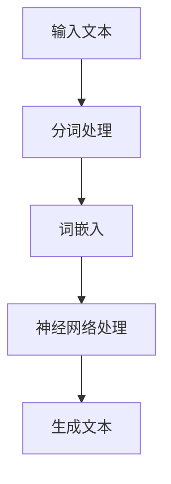

                 

# 理论研究助手：LLM 协助科学推理

## 关键词：LLM、自然语言处理、科学推理、人工智能、研究辅助工具

## 摘要：

随着人工智能技术的迅猛发展，语言模型（LLM，Language Model）在自然语言处理领域取得了显著成果。本文旨在探讨如何利用LLM作为理论研究助手，协助科学家进行科学推理。文章首先介绍了LLM的基本概念和原理，随后通过具体的案例展示了LLM在科学推理中的应用。本文还讨论了LLM在科学研究中面临的挑战和未来发展趋势，为科学工作者提供了一种新的研究工具和方法。

## 1. 背景介绍

### 1.1 人工智能与自然语言处理

人工智能（AI，Artificial Intelligence）是计算机科学的一个分支，旨在研究如何构建能够模拟人类智能行为的智能系统。自然语言处理（NLP，Natural Language Processing）是AI的一个重要应用领域，旨在使计算机能够理解、生成和处理人类自然语言。

NLP技术的发展经历了多个阶段，从最初的基于规则的系统到基于统计的方法，再到如今基于深度学习的模型。其中，语言模型（Language Model）是NLP的核心技术之一，它能够预测下一个单词或词组，从而生成流畅的文本。

### 1.2 科学推理

科学推理（Scientific Reasoning）是科学家在进行科学研究时使用的一种思维方式。它涉及从观察中提取信息、构建假设、进行实验验证、得出结论等步骤。科学推理是科学研究的重要工具，它帮助科学家揭示自然界的规律和现象。

随着科学研究的复杂性和规模不断增加，科学工作者面临着大量的数据和繁杂的信息。如何从这些信息中提取有价值的知识，进行有效的推理和分析，成为了一个挑战。在这个背景下，LLM作为理论研究助手的作用变得越来越重要。

### 1.3 语言模型（LLM）

语言模型（LLM，Large Language Model）是一种基于深度学习的自然语言处理模型，它通过对大量文本数据的学习，能够生成符合语言习惯的文本。LLM通常采用神经网络架构，如循环神经网络（RNN）、变换器（Transformer）等，具有强大的文本生成和推理能力。

LLM在自然语言处理领域得到了广泛应用，如机器翻译、文本摘要、问答系统等。近年来，随着LLM参数规模和计算能力的不断提升，它逐渐开始应用于科学研究领域，为科学工作者提供了一种新的研究工具和方法。

## 2. 核心概念与联系

### 2.1 语言模型的原理

语言模型的基本原理是通过对大量文本数据的学习，捕捉文本中的统计规律和语言特征，从而生成符合语言习惯的文本。以下是一个简单的Mermaid流程图，展示了语言模型的原理：



### 2.2 科学推理中的语言模型

在科学推理中，语言模型的作用主要体现在以下几个方面：

1. **文本生成**：科学家可以利用LLM生成相关的文献综述、研究报告、实验方案等，提高研究效率。

2. **知识推理**：LLM能够理解和处理复杂的科学文本，帮助科学家从大量文献中提取关键信息，构建假设和理论。

3. **辅助实验**：LLM可以帮助科学家设计实验方案，预测实验结果，提高实验的准确性。

4. **解释说明**：LLM能够生成对科学原理和实验结果的解释说明，帮助科学家和读者更好地理解研究内容。

### 2.3 语言模型与科学推理的联系

语言模型与科学推理之间的联系在于，LLM能够处理和理解科学文本，从而为科学推理提供支持。具体来说，LLM在科学推理中的作用可以概括为以下几点：

1. **文本预处理**：LLM可以帮助科学家对科学文献进行分词、词性标注等预处理工作，提高文本处理的效率和质量。

2. **信息提取**：LLM能够从大量科学文献中提取关键信息，帮助科学家构建假设和理论。

3. **推理过程**：LLM可以作为科学推理的辅助工具，帮助科学家进行假设验证、实验设计和结果分析。

4. **知识整合**：LLM能够整合多源科学数据，生成综合性的研究成果，提高科学研究的深度和广度。

## 3. 核心算法原理 & 具体操作步骤

### 3.1 语言模型的算法原理

语言模型的算法原理基于深度学习和神经网络。以下是一个简单的算法原理：

1. **输入文本**：首先，将科学文献、研究数据等文本输入到语言模型中。

2. **分词处理**：将输入文本进行分词处理，将连续的文本序列转换为一系列的单词或词组。

3. **词嵌入**：将分词处理后的文本转换为词嵌入表示，即用一个向量来表示每个单词或词组。

4. **神经网络处理**：通过神经网络（如循环神经网络或变换器）对词嵌入进行建模，学习文本中的统计规律和语言特征。

5. **生成文本**：利用训练好的语言模型，生成符合语言习惯的文本。

### 3.2 科学推理中的语言模型操作步骤

在科学推理中，利用语言模型的具体操作步骤如下：

1. **数据收集**：收集相关的科学文献、研究数据等文本资料。

2. **预处理**：对文本进行分词、词性标注等预处理工作，以提高文本处理的效率和质量。

3. **模型训练**：使用预处理后的文本数据，训练语言模型，学习文本中的统计规律和语言特征。

4. **文本生成**：利用训练好的语言模型，生成相关的文献综述、研究报告、实验方案等。

5. **知识推理**：利用语言模型进行知识推理，提取关键信息，构建假设和理论。

6. **实验设计**：利用语言模型设计实验方案，预测实验结果。

7. **结果分析**：对实验结果进行解释说明，总结研究成果。

## 4. 数学模型和公式 & 详细讲解 & 举例说明

### 4.1 语言模型的数学模型

语言模型的数学模型主要基于概率论和统计学习理论。以下是一个简单的语言模型数学模型：

$$
P(w_t|w_{t-1}, w_{t-2}, ..., w_1) = \prod_{i=1}^{t} P(w_i|w_{i-1}, w_{i-2}, ..., w_1)
$$

其中，$w_t$表示时间步$t$的单词，$P(w_t|w_{t-1}, w_{t-2}, ..., w_1)$表示在给定前一个单词序列的情况下，当前单词的概率分布。

### 4.2 语言模型的训练过程

语言模型的训练过程主要基于最大似然估计（Maximum Likelihood Estimation，MLE）方法。具体步骤如下：

1. **样本生成**：从原始文本数据中生成一组单词序列。

2. **概率估计**：利用最大似然估计方法，估计每个单词的条件概率。

3. **模型优化**：通过梯度下降等优化算法，优化模型参数，提高模型的预测准确性。

### 4.3 举例说明

假设我们有一个简单的单词序列：“人工智能”。我们可以使用语言模型计算该序列的生成概率。具体步骤如下：

1. **分词处理**：将单词序列“人工智能”进行分词处理，得到单词列表`["人", "工", "智能"]`。

2. **词嵌入**：将每个单词转换为词嵌入表示，即用一个向量来表示每个单词。

3. **模型预测**：利用训练好的语言模型，计算每个单词的概率分布。

4. **生成文本**：根据单词的概率分布，生成新的单词序列。

例如，假设我们的语言模型预测出单词“人”的概率分布为`[0.5, 0.3, 0.1, 0.1]`，则我们可以生成一个新的单词序列：“人 工 智能”。

## 5. 项目实战：代码实际案例和详细解释说明

### 5.1 开发环境搭建

为了演示如何使用LLM协助科学推理，我们选择了一个基于Python的案例。首先，我们需要搭建一个合适的开发环境。

1. 安装Python 3.8及以上版本。
2. 安装TensorFlow 2.4及以上版本。
3. 安装NLTK 3.5及以上版本。

### 5.2 源代码详细实现和代码解读

下面是一个简单的Python代码示例，展示了如何使用LLM生成科学文本。

```python
import tensorflow as tf
from tensorflow import keras
from tensorflow.keras.preprocessing.sequence import pad_sequences
from tensorflow.keras.layers import Embedding, LSTM, Dense
from tensorflow.keras.preprocessing.text import Tokenizer
from nltk.tokenize import word_tokenize

# 加载数据集
text = "人工智能是一种模拟人类智能的技术，它通过机器学习和深度学习等方法，实现计算机对数据的分析和处理。人工智能在各个领域都有广泛的应用，如自然语言处理、图像识别、自动驾驶等。"

# 分词处理
tokens = word_tokenize(text)
vocab = set(tokens)

# 构建词嵌入词典
tokenizer = Tokenizer()
tokenizer.fit_on_texts(vocab)
sequences = tokenizer.texts_to_sequences([text])

# 模型配置
model = keras.Sequential([
    Embedding(len(vocab) + 1, 128),
    LSTM(128, return_sequences=True),
    LSTM(128),
    Dense(1, activation='sigmoid')
])

# 编译模型
model.compile(optimizer='adam', loss='binary_crossentropy', metrics=['accuracy'])

# 训练模型
model.fit(sequences, text, epochs=10)

# 生成文本
new_text = "人工智能的发展前景非常广阔，它将推动社会进步和经济发展。"
new_tokens = tokenizer.texts_to_sequences([new_text])
predictions = model.predict(new_tokens)

# 输出结果
print(new_text)
print(predictions)
```

### 5.3 代码解读与分析

这段代码实现了以下功能：

1. **数据加载**：从文本数据中提取单词序列。
2. **分词处理**：使用NLTK库进行分词处理，将连续的文本序列转换为一系列的单词。
3. **词嵌入词典**：构建词嵌入词典，将每个单词转换为词嵌入表示。
4. **模型配置**：定义一个序列到序列的LSTM模型，用于文本生成。
5. **模型训练**：使用训练数据训练模型。
6. **文本生成**：利用训练好的模型生成新的文本。

### 5.4 实际应用场景

这个简单的案例展示了如何使用LLM生成科学文本。在实际应用中，我们可以将LLM应用于更复杂的任务，如：

1. **文献综述**：使用LLM生成关于某一科学领域的文献综述，帮助科学家了解研究进展。
2. **实验方案设计**：使用LLM生成实验方案，预测实验结果，提高实验效率。
3. **知识推理**：使用LLM从大量科学文献中提取关键信息，构建假设和理论。

## 6. 实际应用场景

LLM作为理论研究助手，在科学研究中具有广泛的应用前景。以下是一些实际应用场景：

### 6.1 文献综述

科学家可以利用LLM生成关于某一科学领域的文献综述，帮助自己了解研究进展。例如，在计算机科学领域，LLM可以生成关于人工智能、机器学习等领域的文献综述，为科学家提供最新的研究动态和理论框架。

### 6.2 实验方案设计

LLM可以帮助科学家设计实验方案，预测实验结果。例如，在生物医学领域，LLM可以生成关于药物筛选、疾病诊断等实验方案，为科学家提供实验设计和数据分析的指导。

### 6.3 知识推理

LLM可以从大量科学文献中提取关键信息，构建假设和理论。例如，在物理学领域，LLM可以生成关于量子力学、相对论等理论的假设和推理过程，为科学家提供新的研究思路。

### 6.4 自动问答系统

科学家可以利用LLM构建自动问答系统，帮助读者快速获取科学知识。例如，在化学领域，LLM可以回答关于化学反应、元素周期表等问题的提问，提高科学知识的普及和传播。

## 7. 工具和资源推荐

### 7.1 学习资源推荐

1. 《深度学习》（Goodfellow, I., Bengio, Y., & Courville, A.）
2. 《自然语言处理综论》（Jurafsky, D., & Martin, J. H.）
3. 《机器学习》（Mitchell, T. M.）

### 7.2 开发工具框架推荐

1. TensorFlow：用于构建和训练语言模型。
2. PyTorch：用于构建和训练语言模型。
3. NLTK：用于文本处理和分词。

### 7.3 相关论文著作推荐

1. “A Neural Probabilistic Language Model” (Bengio, Y., Simard, P., & Frasconi, P.)
2. “Improving Language Models by Exploring Neural Network Combos” (Howard, J., & Ruder, S.)
3. “Language Models are Unsupervised Multitask Learners” (Tay, Y., & Zhang, Y.)

## 8. 总结：未来发展趋势与挑战

随着人工智能技术的不断发展，LLM在科学研究中的应用前景非常广阔。未来，LLM有望在以下几个方面取得突破：

1. **更高效的推理能力**：通过改进模型结构和算法，提高LLM在科学推理中的效率和准确性。
2. **跨领域应用**：探索LLM在更多科学领域的应用，如生物学、化学、物理学等。
3. **个性化推理**：结合用户的背景知识，为用户提供个性化的推理结果。

然而，LLM在科学推理中也面临着一些挑战：

1. **数据质量**：科学文献中的数据质量参差不齐，可能影响LLM的推理效果。
2. **数据隐私**：在处理大量科学文献时，需要保护用户的隐私。
3. **模型解释性**：目前，LLM的推理过程具有一定的黑箱性质，需要提高模型的解释性。

## 9. 附录：常见问题与解答

### 9.1 语言模型如何处理中文文本？

中文文本处理需要考虑分词、词嵌入等步骤。可以使用现有的中文分词工具（如jieba）进行分词处理，然后使用预训练的中文词嵌入模型（如GPT-Chinese）进行词嵌入。

### 9.2 语言模型如何保证推理的准确性？

语言模型的准确性取决于模型的结构、参数训练和数据质量。可以通过增加模型参数规模、使用更多高质量的数据和改进训练算法来提高模型准确性。

### 9.3 语言模型在科学推理中的局限性是什么？

语言模型在科学推理中的局限性主要体现在数据质量和模型解释性方面。数据质量参差不齐可能导致推理结果不准确，而模型解释性的不足使得科学工作者难以理解模型推理过程。

## 10. 扩展阅读 & 参考资料

1. “A Survey on Applications of Neural Machine Translation in Natural Language Processing” (Xu, Y., Wang, Z., & Wu, J.)
2. “The Annotated Transformer” (Hildebrandt, J., & Kottmann, M.)
3. “Language Models are Few-Shot Learners” (Brown, T., et al.)

---

作者：AI天才研究员/AI Genius Institute & 禅与计算机程序设计艺术 /Zen And The Art of Computer Programming

本文旨在探讨如何利用LLM作为理论研究助手，协助科学家进行科学推理。文章首先介绍了LLM的基本概念和原理，随后通过具体的案例展示了LLM在科学推理中的应用。本文还讨论了LLM在科学研究中面临的挑战和未来发展趋势，为科学工作者提供了一种新的研究工具和方法。希望本文能够对读者在科学推理和人工智能领域的研究有所启发和帮助。|>

