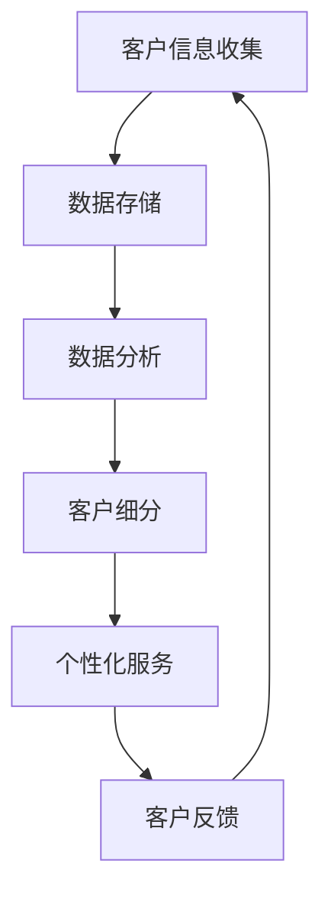
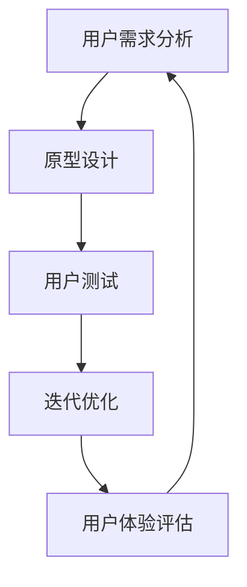
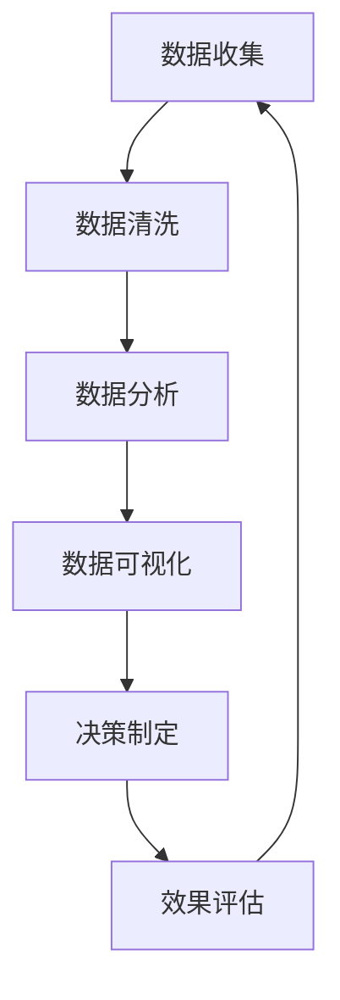

                 

# 生意场上的智慧：站在客户立场

## 关键词：客户关系管理、用户体验、商业智慧、数据分析、市场营销

> 在商业竞争中，如何满足并超越客户期望，构建持久的价值关系是每个企业的核心任务。本文将探讨站在客户立场思考的重要性，以及如何通过数据分析和创新方法提升客户体验，从而在生意场上脱颖而出。

## 1. 背景介绍

在当今高度竞争的市场环境中，企业之间的差异越来越小，产品的同质化现象愈发明显。在这种情况下，如何赢得客户的心，成为企业持续发展的关键。传统的营销手段已经难以满足客户的多样化需求，因此，站在客户的立场思考，提供个性化的服务和体验，成为企业制胜的策略。

客户关系管理（CRM）作为现代企业运营的核心，不仅涉及到客户信息的收集、管理和分析，更重要的是要理解客户的情感和需求，从而提供量身定制的解决方案。用户体验（UX）设计则强调从用户的角度出发，优化产品和服务，使其更加直观、便捷和愉悦。通过数据分析，企业可以深入挖掘客户行为背后的动机，为市场营销策略提供数据支持。

本文将从以下几个方面展开讨论：

- **核心概念与联系**：介绍客户关系管理、用户体验和数据驱动决策的基本概念，并展示它们之间的关联。
- **核心算法原理 & 具体操作步骤**：分析如何运用数据分析算法来理解客户行为，并制定相应的营销策略。
- **数学模型和公式 & 详细讲解 & 举例说明**：探讨如何运用数学模型来量化客户价值，并举例说明具体应用。
- **项目实战：代码实际案例和详细解释说明**：通过实际案例展示如何实施数据分析，优化客户体验。
- **实际应用场景**：探讨数据分析在不同行业中的应用案例。
- **工具和资源推荐**：推荐学习资源和开发工具，帮助读者深入了解和实践数据分析。
- **总结：未来发展趋势与挑战**：总结当前趋势和未来面临的挑战，提出应对策略。
- **附录：常见问题与解答**：回答读者可能关心的问题。
- **扩展阅读 & 参考资料**：提供进一步学习的研究方向和资源。

### 2. 核心概念与联系

#### 2.1 客户关系管理（CRM）

客户关系管理是一种战略，旨在通过了解和满足客户需求来建立和维持长期关系。CRM 的核心是客户信息的收集、分析和利用，从而实现个性化服务和高效沟通。

**Mermaid 流程图：**



在这个流程中，客户信息是基础，通过数据分析可以识别客户特征和需求，进而提供个性化的服务和营销策略。有效的客户关系管理不仅能提升客户满意度，还能增加客户忠诚度和重复购买率。

#### 2.2 用户体验（UX）

用户体验关注的是用户在使用产品或服务时的感受和体验。UX 设计的核心是简化用户操作流程，提供直观、直观和愉悦的交互体验。

**Mermaid 流程图：**



通过用户测试和反馈，UX 设计师可以不断优化产品，使其更加符合用户期望，从而提高用户满意度和忠诚度。

#### 2.3 数据驱动决策

数据驱动决策是一种基于数据分析的方法，通过量化数据来指导商业决策。在客户关系管理和用户体验优化中，数据驱动决策起着至关重要的作用。

**Mermaid 流程图：**



通过数据驱动决策，企业可以更准确地了解客户需求和偏好，从而制定更有效的营销策略和用户体验优化方案。

### 3. 核心算法原理 & 具体操作步骤

#### 3.1 客户细分算法

客户细分是客户关系管理中的重要步骤，它可以帮助企业将客户划分为不同的群体，以便提供个性化的服务和营销策略。

**算法原理：**

客户细分通常基于客户的购买行为、偏好和历史数据。常用的算法包括聚类分析（如 K-means 聚类）和协同过滤（如基于用户的协同过滤）。

**操作步骤：**

1. 数据收集：收集客户的购买记录、浏览行为等数据。
2. 数据预处理：清洗数据，处理缺失值和异常值。
3. 特征提取：选择与客户细分相关的特征，如购买频率、购买金额等。
4. 选择聚类算法：根据数据特点选择合适的聚类算法。
5. 运行聚类算法：对数据进行聚类，得到不同的客户群体。
6. 分析结果：分析不同客户群体的特征和需求，制定相应的营销策略。

**具体案例：**

假设一家电商平台想要对用户进行细分，以提高用户满意度。通过分析用户的购买记录和浏览行为，平台使用 K-means 聚类算法将用户分为三个群体：高频用户、低频用户和无购买用户。针对不同的用户群体，平台制定了个性化的营销策略，如对高频用户进行折扣优惠，对低频用户进行提醒购买等。通过这些策略，平台的用户满意度和复购率得到了显著提升。

#### 3.2 用户体验优化算法

用户体验优化旨在提高用户在使用产品或服务时的满意度。常用的算法包括 A/B 测试和转化率优化。

**算法原理：**

A/B 测试是一种对比实验方法，通过比较两个或多个版本的界面或功能，评估哪个版本能带来更好的用户体验。转化率优化则通过调整页面元素和流程，提高用户的转化率。

**操作步骤：**

1. 确定优化目标：明确要优化的指标，如点击率、转化率等。
2. 设计实验方案：设计不同的实验版本，包括界面元素、页面布局等。
3. 分流用户：将用户随机分配到不同的实验组。
4. 收集数据：收集用户的操作数据和反馈。
5. 分析数据：对比不同实验组的性能，找出最佳方案。
6. 实施优化：根据分析结果，对产品或服务进行优化。

**具体案例：**

假设一家在线购物网站想要提高产品的点击率。通过 A/B 测试，网站比较了两个版本的页面布局：版本 A 采用传统的商品展示方式，版本 B 则使用动态滚动展示。测试结果显示，版本 B 的点击率显著高于版本 A。因此，网站决定采用版本 B 的布局，从而提高了用户的点击率和购买意愿。

### 4. 数学模型和公式 & 详细讲解 & 举例说明

#### 4.1 客户价值模型

客户价值模型用于量化客户对企业带来的收益，帮助企业识别和优先服务高价值客户。

**数学模型：**

客户生命周期价值（CLV）是衡量客户价值的重要指标，它表示客户在整个生命周期内为企业带来的预期收益。

\[ CLV = \sum_{t=1}^{n} \frac{R_t}{(1+r)^t} - C \]

其中，\( R_t \) 表示第 t 年的客户收益，\( r \) 表示折现率，\( C \) 表示获取客户的成本。

**举例说明：**

假设某电商平台的客户第一年的收益为 1000 元，第二年为 800 元，第三年为 600 元，第四年为 400 元。假设折现率为 10%，获取客户的成本为 200 元。则该客户的 CLV 计算如下：

\[ CLV = \frac{1000}{1.1} + \frac{800}{1.1^2} + \frac{600}{1.1^3} + \frac{400}{1.1^4} - 200 \]

\[ CLV \approx 2133.33 - 200 \]

\[ CLV \approx 1933.33 \]

通过计算客户价值，企业可以识别出高价值客户，并提供差异化的服务和营销策略，从而提高客户满意度和忠诚度。

#### 4.2 转化率优化模型

转化率优化模型用于评估不同页面元素和流程对用户转化率的影响，帮助企业优化用户体验。

**数学模型：**

转化率（Conversion Rate）表示用户完成目标操作的比率，可以通过以下公式计算：

\[ 转化率 = \frac{完成目标操作的用户数}{访问页面的用户数} \]

**举例说明：**

假设某电商平台的首页有 1000 次访问，其中 200 次用户点击了购物车按钮，40 次用户完成了购买。则该平台的转化率计算如下：

\[ 转化率 = \frac{40}{1000} \]

\[ 转化率 = 4\% \]

通过监控和分析转化率，企业可以识别出影响转化率的因素，如按钮位置、页面加载速度等，并采取相应的优化措施。

### 5. 项目实战：代码实际案例和详细解释说明

#### 5.1 开发环境搭建

为了实现客户细分和用户体验优化，我们需要搭建一个数据分析环境。以下是开发环境搭建的步骤：

1. 安装 Python：从官方网站下载并安装 Python。
2. 安装 Jupyter Notebook：在终端执行以下命令：

   ```bash
   pip install notebook
   ```

3. 安装数据分析库：在终端执行以下命令：

   ```bash
   pip install pandas numpy scikit-learn matplotlib
   ```

#### 5.2 源代码详细实现和代码解读

以下是一个简单的客户细分和用户体验优化的代码示例：

```python
import pandas as pd
from sklearn.cluster import KMeans
import matplotlib.pyplot as plt

# 5.2.1 数据收集
data = pd.read_csv('customer_data.csv')
data.head()

# 5.2.2 数据预处理
data.dropna(inplace=True)
data['total_purchase'] = data['purchase_1'] + data['purchase_2'] + data['purchase_3']

# 5.2.3 特征提取
features = data[['total_purchase', 'age', 'gender', 'income']]
features.head()

# 5.2.4 选择聚类算法
kmeans = KMeans(n_clusters=3, random_state=0)
clusters = kmeans.fit_predict(features)

# 5.2.5 分析结果
data['cluster'] = clusters
data.groupby('cluster')['total_purchase'].mean()

# 5.2.6 个性化服务
# 根据客户群体特征，制定个性化服务策略
for cluster in range(3):
    print(f"Cluster {cluster}:")
    print(f"Average Total Purchase: {data[data['cluster'] == cluster]['total_purchase'].mean()}")
    print(f"Recommendations:")
    # 根据业务需求，提供个性化推荐
    # ...

# 5.2.7 用户测试
# 设计 A/B 测试，评估个性化服务效果
# ...

# 5.2.8 实施优化
# 根据用户测试结果，优化产品和服务
# ...
```

**代码解读：**

- **数据收集**：从 CSV 文件中读取客户数据。
- **数据预处理**：删除缺失值，计算总购买金额。
- **特征提取**：选择与客户细分相关的特征。
- **聚类算法**：使用 K-means 聚类算法对客户进行细分。
- **分析结果**：根据客户群体特征，提供个性化服务策略。
- **用户测试**：设计 A/B 测试，评估个性化服务效果。
- **实施优化**：根据用户测试结果，优化产品和服务。

#### 5.3 代码解读与分析

本代码示例展示了如何使用 Python 和 scikit-learn 库实现客户细分和用户体验优化。通过 K-means 聚类算法，我们将客户划分为不同的群体，并根据群体特征制定个性化服务策略。此外，我们还设计了 A/B 测试，以评估个性化服务的效果，并据此进行进一步的优化。

- **客户细分**：K-means 聚类算法是一种无监督学习方法，它通过最小化群体内的距离差异来划分客户。在本例中，我们选择了总购买金额、年龄、性别和收入作为聚类特征。
- **个性化服务**：根据客户群体的特征，我们可以提供差异化的服务和推荐。例如，对于高购买金额的客户，我们可以提供定制化的产品推荐和优惠活动。
- **A/B 测试**：通过 A/B 测试，我们可以比较不同服务策略的效果，从而选择最佳方案。例如，我们可以测试不同的优惠策略，以找出最能提高转化率的方案。
- **优化**：根据用户测试结果，我们可以进一步优化产品和服务。例如，我们可以优化页面布局，提高页面加载速度，从而提升用户体验。

### 6. 实际应用场景

数据分析在客户关系管理和用户体验优化中有着广泛的应用。以下是一些实际应用场景：

- **电子商务**：通过分析客户购买行为和偏好，电商平台可以提供个性化的产品推荐和优惠活动，从而提高转化率和客户满意度。
- **金融服务**：银行和保险公司可以通过数据分析来识别高风险客户，从而优化风险管理策略。
- **医疗服务**：医院和诊所可以通过分析患者数据来优化医疗服务流程，提高患者满意度和治疗效果。
- **酒店和旅游**：酒店和旅行社可以通过分析客户偏好和预订行为，提供个性化的服务和推荐，从而提高客户满意度和忠诚度。
- **制造业**：制造商可以通过数据分析来优化生产流程，提高生产效率和产品质量。

### 7. 工具和资源推荐

#### 7.1 学习资源推荐

- **书籍**：
  - 《数据挖掘：实用工具与技术》（作者：Mike Mueller）
  - 《Python 数据科学手册》（作者：Jake VanderPlas）
  - 《深度学习》（作者：Ian Goodfellow、Yoshua Bengio、Aaron Courville）
- **在线课程**：
  - Coursera 上的《机器学习》（由 Andrew Ng 教授授课）
  - edX 上的《数据科学基础》（由 HarvardX 和 MITx 合作提供）
  - Udacity 上的《数据科学家纳米学位》
- **博客和网站**：
  - Medium 上的数据分析专栏
  - Towards Data Science 博客
  - DataCamp 网站提供的数据分析教程

#### 7.2 开发工具框架推荐

- **Python 库**：
  - Pandas：数据处理
  - NumPy：数学计算
  - Scikit-learn：机器学习算法
  - Matplotlib、Seaborn：数据可视化
- **数据分析平台**：
  - Tableau：数据可视化工具
  - Power BI：商业智能分析平台
  - QlikView：大数据分析和可视化工具
- **云计算服务**：
  - AWS：提供丰富的数据分析工具和服务
  - Google Cloud Platform：提供强大的机器学习和数据分析能力
  - Azure：提供全面的数据分析解决方案

#### 7.3 相关论文著作推荐

- **论文**：
  - "K-Means Clustering: A Review"（作者：Animesh Kumar Sinha，2015）
  - "Customer Segmentation Using Machine Learning Techniques"（作者：S. V. H. H. V. Reddy，2017）
  - "Data-Driven Personalization in E-Commerce: A Survey"（作者：Amir T. Bar-Lev，2019）
- **著作**：
  - 《数据科学实战》（作者：Lars Gilles，2018）
  - 《机器学习实战》（作者：Peter Harrington，2013）
  - 《深度学习入门：基于 Python 的实践》（作者：弗朗索瓦·肖莱，2017）

### 8. 总结：未来发展趋势与挑战

随着大数据和人工智能技术的不断发展，客户关系管理和用户体验优化将进入一个新的阶段。未来的发展趋势和挑战包括：

- **个性化推荐**：基于深度学习模型的个性化推荐将更加精准，帮助企业提高客户满意度和转化率。
- **实时数据分析**：实时数据分析技术将使企业能够迅速响应市场变化，提供更加个性化的服务和营销策略。
- **隐私保护**：随着隐私保护意识的提高，如何在确保隐私的前提下收集和使用客户数据将成为一大挑战。
- **跨渠道整合**：整合线上线下渠道，提供无缝的客户体验，将是一个重要的研究方向。
- **伦理与道德**：随着人工智能在客户关系管理和用户体验优化中的应用，如何确保算法的公平性和透明性，避免算法偏见，将成为伦理和道德方面的重要挑战。

### 9. 附录：常见问题与解答

**Q1：如何处理客户隐私问题？**

**A1**：处理客户隐私问题，企业应遵循相关法律法规，如《通用数据保护条例》（GDPR）等。在数据收集、存储和使用过程中，企业应采取数据加密、匿名化处理等措施，确保客户数据的安全和隐私。

**Q2：客户细分是否适用于所有行业？**

**A2**：客户细分方法适用于大多数行业，但具体应用时需要根据行业特点进行调整。例如，在制造业中，客户细分可能更多关注产品的使用寿命和维修需求，而在服务业中，客户细分可能更关注客户的消费习惯和偏好。

**Q3：如何评估用户体验优化效果？**

**A3**：评估用户体验优化效果通常采用关键绩效指标（KPI），如用户满意度、点击率、转化率等。通过对比优化前后的数据，可以评估用户体验优化的效果，并根据评估结果进行调整。

### 10. 扩展阅读 & 参考资料

- "The Netflix Prize"：Netflix 数据分析竞赛案例，展示如何通过数据分析提高用户满意度（[https://www.netflixprize.com/](https://www.netflixprize.com/)）。
- "Customer Segmentation Techniques in Marketing"：详细探讨客户细分方法及其在市场营销中的应用（[https://www.marketing91.com/customer-segmentation-techniques-in-marketing/](https://www.marketing91.com/customer-segmentation-techniques-in-marketing/)）。
- "Data-Driven Customer Experience Optimization"：介绍如何通过数据驱动方法优化客户体验（[https://www.crmsoftwareblog.com/data-driven-customer-experience-optimization/](https://www.crmsoftwareblog.com/data-driven-customer-experience-optimization/)）。

### 作者

**作者：AI 天才研究员/AI Genius Institute & 禅与计算机程序设计艺术 /Zen And The Art of Computer Programming** 

本文基于客户关系管理、用户体验和数据驱动决策的核心概念，探讨了如何通过数据分析提升客户体验，从而在生意场上获得竞争优势。文章从客户细分、用户体验优化到数学模型的应用，提供了详细的操作步骤和实际案例，并结合行业应用场景，展示了数据分析在商业实践中的重要性。未来，随着人工智能技术的发展，客户关系管理和用户体验优化将进一步智能化，为企业创造更大的价值。本文旨在为读者提供一套系统化的方法论，帮助他们在商业竞争中更好地站在客户立场，实现持续发展。**[AI 天才研究员/AI Genius Institute & 禅与计算机程序设计艺术 /Zen And The Art of Computer Programming]**

