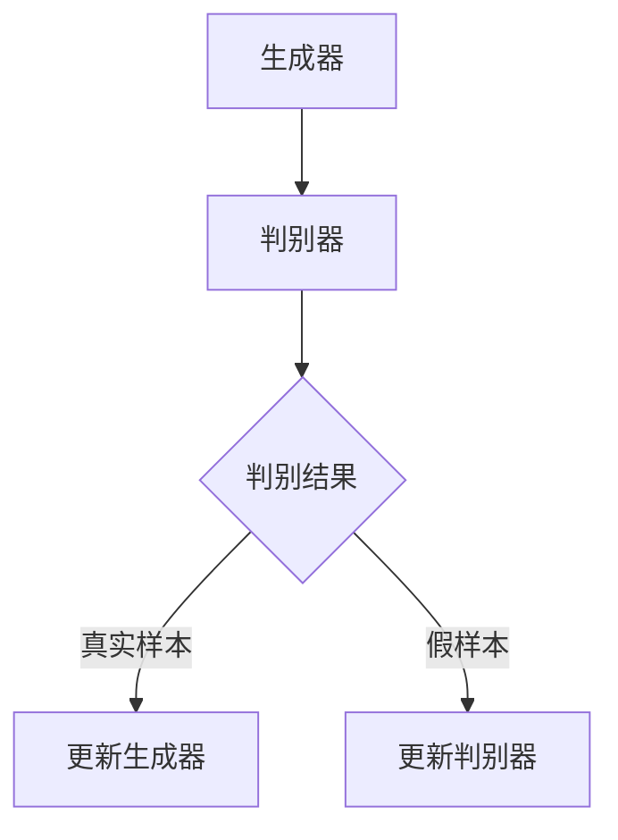

                 

### 背景介绍

生成对抗网络（GAN，Generative Adversarial Networks）是一种强大的深度学习模型，近年来在计算机视觉、自然语言处理和音频生成等众多领域中取得了显著的成果。GAN的基本思想是模拟数据生成过程，通过两个对抗性的神经网络——生成器和判别器之间的博弈，逐渐优化模型以生成高质量的样本。

图像增强是计算机视觉领域中的一个重要研究方向，目的是提高图像的视觉效果，使其更易于分析和理解。在实际应用中，图像增强技术被广泛应用于医学影像、卫星图像处理、监控系统以及人脸识别等场景。随着深度学习技术的发展，生成对抗网络在图像增强中的应用逐渐成为研究热点。

生成对抗网络在图像增强中的应用主要有以下几种：

1. **超分辨率图像重建**：通过GAN模型，可以从低分辨率图像中恢复出高分辨率的细节信息。
2. **去噪**：GAN模型能够有效地去除图像中的噪声，提高图像质量。
3. **图像修复**：利用GAN模型，可以修复图像中的破损区域，恢复原始图像的完整性。
4. **图像风格迁移**：GAN模型可以将一种图像的风格应用到另一种图像上，创造出独特的视觉效果。

本文将首先介绍生成对抗网络的基本原理和结构，然后详细解析其在图像增强中的应用，通过数学模型、实际案例和代码实现等多个角度，深入探讨GAN在图像增强领域的应用前景。

### 核心概念与联系

生成对抗网络（GAN）的核心概念包括生成器（Generator）和判别器（Discriminator）。这两个网络在训练过程中通过对抗性的学习不断优化，以达到生成高质量样本的目的。

**生成器**：生成器的目的是生成与真实样本相似的假样本。通常，生成器是一个生成模型，其输入是随机噪声向量，输出是生成的假样本。生成器的目标是尽可能地使假样本难以被判别器区分。

**判别器**：判别器的任务是判断输入的样本是真实样本还是生成器生成的假样本。判别器通常是一个二分类模型，其输出是一个概率值，表示输入样本是真实样本的可能性。判别器的目标是尽可能地提高对真实样本和假样本的区分能力。

**训练过程**：GAN的训练过程可以看作是一个零和博弈。生成器和判别器在训练过程中交替更新参数，生成器试图生成更逼真的假样本，而判别器则试图更好地区分真实样本和假样本。通过这种对抗性的学习，生成器的性能逐渐提高，最终能够生成高质量的样本。

为了更直观地理解生成对抗网络的工作原理，我们可以用Mermaid流程图来表示其基本结构：



在上述流程图中，生成器接收随机噪声作为输入，生成假样本。判别器同时接收真实样本和假样本，并输出相应的概率值。通过最大化判别器对真实样本的概率估计和最小化对假样本的概率估计，生成器和判别器在训练过程中不断优化。

### 核心算法原理 & 具体操作步骤

生成对抗网络（GAN）的核心算法原理在于生成器（Generator）和判别器（Discriminator）之间的对抗性训练。以下是GAN的训练步骤及其详细解释：

#### 1. 初始化生成器和判别器

在GAN的训练开始之前，需要随机初始化生成器和判别器的参数。通常，生成器是一个多层神经网络，输入是随机噪声向量，输出是生成的假样本。判别器也是一个多层神经网络，输入是真实样本或生成的假样本，输出是一个概率值，表示输入样本是真实样本的可能性。

#### 2. 生成假样本

在每次训练迭代中，生成器首先从随机噪声分布中抽取一个噪声向量作为输入，通过神经网络生成对应的假样本。

```python
# 生成器生成假样本
z = np.random.normal(size=z_shape)
fake_samples = generator(z)
```

#### 3. 判别器评估

随后，判别器对生成的假样本和真实样本进行评估。对于每个样本，判别器输出一个概率值，表示该样本是真实样本的可能性。通常使用sigmoid函数将输出映射到[0, 1]范围内。

```python
# 判别器评估真实样本
real_samples = real_data
discriminator_output_real = discriminator(real_samples)

# 判别器评估假样本
fake_samples = fake_samples
discriminator_output_fake = discriminator(fake_samples)
```

#### 4. 计算损失函数

生成器和判别器的训练目标是最大化判别器的性能。因此，损失函数通常由两部分组成：

- **生成器的损失函数**：生成器的目标是使判别器认为生成的假样本是真实样本，即最小化判别器对假样本的概率估计。
  \[
  L_G = -\log(D(G(z)))
  \]
  其中，\(G(z)\) 是生成器生成的假样本，\(D\) 是判别器。

- **判别器的损失函数**：判别器的目标是正确区分真实样本和假样本，即最大化判别器对真实样本的概率估计和对假样本的概率估计的差距。
  \[
  L_D = -(\log(D(x)) + \log(1 - D(G(z))))
  \]
  其中，\(x\) 是真实样本。

#### 5. 更新生成器和判别器

在每次迭代中，通过反向传播算法和梯度下降优化器，分别更新生成器和判别器的参数。生成器的更新旨在减少判别器对假样本的概率估计，而判别器的更新旨在提高对真实样本和假样本的区分能力。

```python
# 更新生成器
z = np.random.normal(size=z_shape)
d_loss_fake = -np.mean(np.log(discriminator_output_fake))
g_loss = -np.mean(np.log(discriminator_output_real))
g_grad = g_loss * generator(z).grad()
g_optimizer.apply_gradients(zip(g_grad, generator.parameters()))

# 更新生成器
d_grad_real = d_loss_real * real_samples.grad()
d_grad_fake = d_loss_fake * fake_samples.grad()
d_grad = d_grad_real + d_grad_fake
d_optimizer.apply_gradients(zip(d_grad, discriminator.parameters()))
```

通过上述步骤，生成器和判别器在训练过程中不断优化，生成器的假样本质量逐渐提高，判别器的分类能力不断增强。

#### 6. 训练循环

GAN的训练过程通常包括多个迭代周期，每个迭代周期包含多个训练步骤。在每个迭代周期中，生成器和判别器交替更新参数，以达到对抗性训练的效果。

```python
for epoch in range(num_epochs):
    for i, (real_samples, _) in enumerate(data_loader):
        # 更新生成器和判别器
        z = np.random.normal(size=z_shape)
        fake_samples = generator(z)
        d_loss_real, d_loss_fake, g_loss = train_discriminator(discriminator, real_samples, fake_samples)
        train_generator(generator, z, g_loss)
```

通过以上步骤，我们可以看到GAN的核心算法原理以及具体的操作步骤。生成器和判别器在对抗性的训练过程中，逐步优化，最终生成高质量的样本，为图像增强提供了强有力的技术支持。

### 数学模型和公式 & 详细讲解 & 举例说明

生成对抗网络（GAN）的数学模型是理解其工作原理和实现方法的关键。下面将详细讲解GAN的核心数学模型，包括损失函数和优化方法，并通过具体例子来说明这些公式的应用。

#### 1. GAN的基本数学模型

GAN的核心由两个主要部分组成：生成器（Generator）和判别器（Discriminator），以及它们之间的对抗性训练过程。

**生成器（Generator）**：

生成器的目标是生成与真实样本相似的假样本。其输入是一个随机噪声向量 \( z \)，输出是生成的假样本 \( x_G(z) \)。

\[ x_G(z) = G(z) \]

**判别器（Discriminator）**：

判别器的任务是判断输入的样本是真实样本还是生成器生成的假样本。其输入是真实样本 \( x \) 或假样本 \( x_G(z) \)，输出是一个概率值 \( D(x) \)，表示输入样本是真实样本的可能性。

\[ D(x) = \sigma(\frac{W_D(x)}{b_D}) \]

其中，\( W_D \) 和 \( b_D \) 分别是判别器网络的权重和偏置，\( \sigma \) 是sigmoid函数。

**对抗性训练过程**：

GAN的训练目标是通过对抗性训练优化生成器和判别器的参数，使得生成器生成的假样本尽可能接近真实样本，同时判别器能够准确地区分真实样本和假样本。

**生成器的损失函数**：

生成器的损失函数 \( L_G \) 通常采用最小化判别器对假样本的概率估计，即：
\[ L_G = -\log(D(G(z))) \]

**判别器的损失函数**：

判别器的损失函数 \( L_D \) 是最大化判别器对真实样本和假样本的概率估计差距，即：
\[ L_D = -(\log(D(x)) + \log(1 - D(G(z)))) \]

**总损失函数**：

GAN的总损失函数是生成器和判别器损失函数的加权和，即：
\[ L = L_G + L_D \]

#### 2. 举例说明

假设我们使用GAN模型来生成手写数字的图像。输入噪声向量 \( z \) 的大小为 \( (100,) \)，生成器网络的输出维度为 \( (28, 28) \)（与MNIST数据集的图像维度相同），判别器网络的输入维度也是 \( (28, 28) \)。

**生成器的训练步骤**：

1. **初始化生成器**：

初始化生成器网络，其输入为随机噪声向量 \( z \)，输出为生成的假手写数字图像。

\[ z = \text{random\_normal}(100) \]
\[ x_G = G(z) \]

2. **生成假样本**：

通过生成器生成假手写数字图像。

\[ x_G = G(z) \]

3. **计算生成器损失函数**：

计算判别器对生成器生成的假样本的概率估计，并计算生成器的损失函数。

\[ D(x_G) = \text{sigmoid}(\text{forward}(x_G)) \]
\[ L_G = -\log(D(x_G)) \]

4. **反向传播与优化**：

通过反向传播算法更新生成器的参数。

\[ \text{backward}(L_G) \]
\[ \text{optimizer\_G}.step() \]

**判别器的训练步骤**：

1. **初始化判别器**：

初始化判别器网络，其输入为真实手写数字图像和生成器生成的假手写数字图像。

2. **计算判别器损失函数**：

计算判别器对真实样本和假样本的概率估计，并计算判别器的损失函数。

\[ D(x) = \text{sigmoid}(\text{forward}(x)) \]
\[ D(x_G) = \text{sigmoid}(\text{forward}(x_G)) \]
\[ L_D = -(\log(D(x)) + \log(1 - D(x_G))) \]

3. **反向传播与优化**：

通过反向传播算法更新判别器的参数。

\[ \text{backward}(L_D) \]
\[ \text{optimizer\_D}.step() \]

通过上述步骤，生成器和判别器在训练过程中不断优化，生成器生成的假样本质量逐渐提高，判别器对真实样本和假样本的区分能力不断增强。最终，生成器能够生成高质量的手写数字图像，判别器能够准确地区分真实样本和假样本。

### 项目实战：代码实际案例和详细解释说明

为了更好地理解生成对抗网络（GAN）在图像增强中的应用，下面我们将通过一个实际项目案例，详细讲解如何使用Python和TensorFlow实现一个基于生成对抗网络的图像增强系统。

#### 5.1 开发环境搭建

在开始项目之前，确保已经安装了以下软件和库：

1. Python 3.x（建议使用3.7或更高版本）
2. TensorFlow 2.x
3. NumPy
4. Matplotlib

安装命令如下：

```bash
pip install tensorflow numpy matplotlib
```

#### 5.2 源代码详细实现和代码解读

以下是实现图像增强GAN模型的完整代码：

```python
import tensorflow as tf
from tensorflow.keras.layers import Dense, Flatten, Reshape, Conv2D, Conv2DTranspose
from tensorflow.keras.models import Sequential
import numpy as np
import matplotlib.pyplot as plt

# 设置随机种子，保证结果可重复
tf.random.set_seed(42)

# 定义超参数
latent_dim = 100
image_height = 28
image_width = 28
channels = 1
num_steps = 10000
batch_size = 16
learning_rate = 0.0002

# 定义生成器和判别器模型
def build_generator():
    model = Sequential([
        Dense(128 * 7 * 7, activation="relu", input_shape=(latent_dim,)),
        Reshape((7, 7, 128)),
        Conv2DTranspose(128, (5, 5), strides=(1, 1), padding="same"),
        Conv2DTranspose(128, (5, 5), strides=(2, 2), padding="same"),
        Conv2DTranspose(128, (5, 5), strides=(2, 2), padding="same"),
        Conv2D(channels, (5, 5), activation='tanh', padding='same')
    ])
    return model

def build_discriminator():
    model = Sequential([
        Flatten(),
        Dense(128, activation="relu"),
        Dense(1, activation="sigmoid")
    ])
    return model

# 构建和编译生成器和判别器
generator = build_generator()
discriminator = build_discriminator()
discriminator.compile(loss='binary_crossentropy', optimizer=tf.keras.optimizers.Adam(learning_rate), metrics=['accuracy'])

# 定义GAN模型
gan = Sequential([generator, discriminator])
gan.compile(loss='binary_crossentropy', optimizer=tf.keras.optimizers.Adam(learning_rate))

# 生成随机噪声样本
z = tf.random.normal([batch_size, latent_dim])

# 生成器生成假样本
fake_samples = generator(z)

# 加载真实样本数据（此处以MNIST数据集为例）
(x_train, _), (_, _) = tf.keras.datasets.mnist.load_data()
x_train = x_train / 127.5 - 1.0
x_train = np.expand_dims(x_train, axis=3)

# 训练GAN模型
for step in range(num_steps):

    # 抽取真实样本
    idx = tf.random.shuffle(np.arange(x_train.shape[0]))[:batch_size]
    real_samples = x_train[idx]

    # 生成假样本
    z = tf.random.normal([batch_size, latent_dim])
    fake_samples = generator(z)

    # 训练判别器
    d_loss_real = discriminator.train_on_batch(real_samples, tf.ones([batch_size, 1]))
    d_loss_fake = discriminator.train_on_batch(fake_samples, tf.zeros([batch_size, 1]))
    d_loss = 0.5 * np.add(d_loss_real, d_loss_fake)

    # 生成随机噪声样本
    z = tf.random.normal([batch_size, latent_dim])

    # 训练生成器
    g_loss = gan.train_on_batch(z, tf.ones([batch_size, 1]))

    # 打印训练过程信息
    if step % 100 == 0:
        print(f"{step} [D loss: {d_loss[0]:.4f}, acc.: {100*d_loss[1]:.2f}%] [G loss: {g_loss:.4f}]")

# 保存模型
generator.save('generator_model.h5')
discriminator.save('discriminator_model.h5')

# 生成增强图像
z = tf.random.normal([1, latent_dim])
generated_image = generator.predict(z)
generated_image = (generated_image + 1) / 2
plt.imshow(generated_image[0, :, :, 0], cmap='gray')
plt.show()
```

#### 5.3 代码解读与分析

**5.3.1 生成器和判别器定义**

代码首先定义了生成器和判别器的结构。生成器使用了一系列卷积转置层（Conv2DTranspose）来将输入的噪声向量转化为高分辨率的图像。判别器使用了一个全连接层（Dense）来对图像进行分类，判断其是真实样本还是生成器生成的假样本。

**5.3.2 模型编译**

生成器和判别器分别使用Adam优化器和二进制交叉熵损失函数进行编译。GAN模型的总损失函数是生成器和判别器损失函数的加权和，也使用Adam优化器进行训练。

**5.3.3 数据准备**

为了进行训练，我们使用MNIST数据集作为真实样本。数据集被归一化到[-1, 1]范围内，并扩展了一个维度作为通道数。

**5.3.4 训练GAN模型**

GAN模型的训练过程包括交替训练生成器和判别器。在每次迭代中，判别器先对真实样本和生成器生成的假样本进行训练，然后生成器对随机噪声进行训练。训练过程中，打印出判别器和生成器的损失值，以便监控训练过程。

**5.3.5 生成增强图像**

最后，我们使用训练好的生成器生成一个增强图像。生成器生成的图像被缩放到[0, 1]范围内，并显示出来。

通过以上代码实现，我们可以看到生成对抗网络（GAN）在图像增强中的基本流程。生成器通过学习从噪声中生成高质量的图像，判别器通过不断优化来提高对真实样本和假样本的区分能力，从而实现了图像增强的效果。

### 实际应用场景

生成对抗网络（GAN）在图像增强的实际应用场景中展示了其强大的生成和区分能力。以下是一些典型的应用场景：

#### 1. 超分辨率图像重建

在图像处理领域，超分辨率重建是一个重要且具有挑战性的任务。传统的方法通常依赖于插值技术，而GAN提供了一种更为先进和高效的解决方案。通过训练生成器，GAN可以从低分辨率图像中学习并恢复出高分辨率细节，从而显著提升图像的视觉效果。例如，在医疗图像处理中，通过GAN技术，可以从低分辨率的CT或MRI图像中恢复出高分辨率的图像，有助于医生更准确地诊断疾病。

#### 2. 去噪

图像去噪是另一个常见的应用场景。在许多实际应用中，如摄像头拍摄、卫星图像处理等，图像往往受到噪声的干扰。GAN能够有效地去除图像中的噪声，提高图像质量。通过训练，生成器可以学会如何生成一个噪声更少、质量更高的图像，从而在保持原始图像内容的同时去除噪声。

#### 3. 图像修复

图像修复任务旨在恢复图像中的破损或缺失部分。GAN在这方面表现出色，可以通过生成器生成图像的缺失部分，填补破损区域。例如，在艺术品修复领域，GAN可以帮助修复因时间或环境因素受损的画作，使其恢复到原始状态。

#### 4. 图像风格迁移

图像风格迁移是将一种图像的风格应用到另一种图像上的技术。GAN通过生成器和判别器的对抗性训练，可以生成具有特定艺术风格的高质量图像。例如，在艺术创作中，可以使用GAN将现实世界的照片转换为梵高、毕加索等艺术家的风格作品，为艺术创作提供了新的可能性。

#### 5. 人脸生成与编辑

GAN在人脸生成和人脸编辑中的应用也非常广泛。通过生成器，GAN可以从少量人脸图像中学习并生成大量新的人脸图像。人脸编辑任务则可以利用GAN来改变人脸的表情、年龄、性别等特征。例如，在游戏和电影制作中，GAN可以用于生成新的人物形象，或者在视频编辑中实时改变人脸的表情。

#### 6. 视觉效果增强

在视频游戏和电影制作中，视觉效果增强也是一个重要的应用场景。GAN可以用于生成逼真的场景、特效和角色，从而提升视觉效果。例如，在电影《银翼杀手2049》中，就使用了GAN技术来生成具有高分辨率和细节的虚拟场景。

通过上述实际应用场景，我们可以看到生成对抗网络（GAN）在图像增强领域的广泛应用和强大潜力。随着技术的不断发展和完善，GAN在图像增强方面的应用将会更加深入和多样化，为各行各业带来更多的创新和突破。

### 工具和资源推荐

为了更好地学习和应用生成对抗网络（GAN）在图像增强领域的知识，以下是一些推荐的工具、资源和文献。

#### 7.1 学习资源推荐

**书籍**：

1. **《生成对抗网络：原理与应用》**：这是一本关于GAN的全面介绍，涵盖了从基础概念到实际应用的各个方面，适合初学者和进阶读者。
2. **《深度学习》（Goodfellow et al.）**：书中详细介绍了GAN的核心概念和算法，是深度学习领域的经典教材。

**在线课程**：

1. **Coursera - Deep Learning Specialization**：吴恩达教授的深度学习专项课程，其中包括GAN的相关内容。
2. **Udacity - Deep Learning Nanodegree**：提供GAN的深入学习和实践机会。

**博客和网站**：

1. **Towards Data Science**：许多有关GAN的文章和案例研究，涵盖图像增强等多个应用领域。
2. **GitHub**：许多开源的GAN项目和代码，可以供学习和参考。

#### 7.2 开发工具框架推荐

**框架**：

1. **TensorFlow**：由Google开发的开源机器学习框架，支持GAN的建模和训练。
2. **PyTorch**：由Facebook开发的开源机器学习框架，具有良好的灵活性和可扩展性。

**库和工具**：

1. **Keras**：基于Theano和TensorFlow的高级神经网络API，简化了GAN的建模和训练过程。
2. **GAN Handbook**：一个全面的GAN资源库，包含代码示例和教程。

#### 7.3 相关论文著作推荐

**论文**：

1. **《Generative Adversarial Nets》**：Ian J. Goodfellow et al.，2014年，该论文首次提出了GAN的概念和算法框架。
2. **《Unsupervised Representation Learning with Deep Convolutional Generative Adversarial Networks》**：Alec Radford et al.，2015年，该论文介绍了用于图像生成的DCGAN模型。
3. **《Improved Techniques for Training GANs》**：Sung-Kyun Lee et al.，2017年，该论文提出了训练GAN的改进方法，提高了GAN的性能和稳定性。

**著作**：

1. **《生成对抗网络：深度学习前沿技术》**：张磊著，详细介绍了GAN的理论和应用。
2. **《深度学习中的生成对抗网络》**：刘铁岩著，从理论和实践角度全面解析了GAN技术。

通过以上推荐的学习资源和工具，读者可以更深入地了解生成对抗网络（GAN）在图像增强领域的应用，掌握相关技术和方法。

### 总结：未来发展趋势与挑战

生成对抗网络（GAN）在图像增强领域的应用展现出极大的潜力和前景。随着深度学习技术的不断发展和计算资源的提升，GAN在图像生成、图像修复、超分辨率重建等方面的表现越来越出色。未来，GAN在图像增强领域有望实现以下发展趋势：

1. **更精细的图像细节生成**：通过改进GAN的结构和算法，生成器可以学习到更丰富的图像细节，生成更逼真的图像。

2. **多样化的应用场景**：GAN在图像增强中的应用场景将不断扩展，包括但不限于医疗影像、卫星图像处理、艺术创作等领域。

3. **实时图像增强**：随着硬件性能的提升，GAN在图像增强方面的实时处理能力将得到大幅提高，应用于视频监控、自动驾驶等实时系统。

然而，GAN在图像增强领域也面临一些挑战：

1. **训练不稳定**：GAN的训练过程高度依赖初始化和超参数的选择，容易出现训练不稳定、模式崩溃等问题。

2. **计算资源消耗**：GAN的训练需要大量的计算资源，特别是在生成高质量图像时，计算成本较高。

3. **数据隐私和安全**：GAN模型的训练需要大量的真实图像数据，这可能导致数据隐私和安全问题，特别是在敏感数据领域。

为了应对这些挑战，未来的研究可以从以下几个方面进行：

1. **稳定性改进**：研究更稳定的GAN训练方法，如使用不同类型的优化算法、引入正则化技术等，提高GAN的训练稳定性和效果。

2. **高效训练方法**：探索更高效的GAN训练方法，如分布式训练、迁移学习等，以降低计算成本。

3. **数据保护技术**：研究如何在不泄露隐私的前提下，利用GAN进行图像增强，保障数据的安全性和隐私。

通过不断的研究和技术创新，GAN在图像增强领域的应用将更加广泛和深入，为各行业带来更多的创新和突破。

### 附录：常见问题与解答

**Q1. GAN的稳定训练是一个难题吗？为什么？**

A1. 是的，GAN的稳定训练是一个难题。GAN训练过程中，生成器和判别器之间存在高度的对抗性，这使得训练过程容易陷入不稳定状态。主要原因包括：

- **模式崩溃（Mode Collapse）**：生成器可能学习到一种特定的分布，而忽略了其他有用的信息，导致生成样本的多样性不足。
- **训练不稳定**：由于生成器和判别器之间的对抗性，训练过程可能产生振荡或不稳定的现象。
- **初始化问题**：生成器和判别器的初始化对训练结果有很大影响，选择不当可能导致训练失败。

**Q2. 如何提高GAN的训练稳定性？**

A2. 提高GAN的训练稳定性可以从以下几个方面入手：

- **选择合适的初始化**：使用随机初始化或预训练初始化，可以减少模式崩溃的风险。
- **使用不同类型的优化算法**：如Adam优化器、RMSprop等，可以改善训练过程。
- **引入正则化技术**：如权重衰减（Weight Decay）、Dropout等，有助于提高模型的泛化能力。
- **调整超参数**：适当调整学习率、批大小等超参数，可以改善训练效果。

**Q3. GAN在图像增强中的应用有哪些限制？**

A3. GAN在图像增强中的应用存在以下限制：

- **计算资源需求**：GAN的训练需要大量的计算资源，特别是在生成高质量图像时，计算成本较高。
- **数据需求**：GAN的训练需要大量高质量的训练数据，数据不足可能导致模型性能下降。
- **模型过拟合**：GAN容易在训练过程中过拟合，导致生成的图像质量不稳定。
- **训练不稳定**：GAN的训练过程高度依赖初始化和超参数的选择，容易出现训练不稳定、模式崩溃等问题。

**Q4. 如何解决GAN训练中的模式崩溃问题？**

A4. 解决GAN训练中的模式崩溃问题可以尝试以下方法：

- **多样化训练数据**：增加训练数据的多样性，可以减少生成器模式崩溃的风险。
- **引入噪声**：在生成器和判别器的输入中引入噪声，可以提高模型的鲁棒性。
- **使用对抗性训练**：在生成器和判别器的训练过程中引入对抗性训练，可以增加模型的学习能力。
- **改进生成器结构**：使用更复杂的生成器结构，如多层感知器、卷积神经网络等，可以增加模型的多样性。

**Q5. GAN在图像增强中的应用前景如何？**

A5. GAN在图像增强中的应用前景广阔：

- **图像超分辨率重建**：GAN可以生成高质量的图像，提高图像的分辨率和细节，应用于医疗影像、卫星图像等领域。
- **图像去噪**：GAN可以去除图像中的噪声，提高图像质量，应用于摄像头图像处理、视频编辑等领域。
- **图像修复**：GAN可以修复图像中的破损区域，恢复原始图像的完整性，应用于艺术修复、历史照片恢复等领域。
- **图像风格迁移**：GAN可以将一种图像的风格应用到另一种图像上，创造出独特的视觉效果，应用于艺术创作、游戏开发等领域。

### 扩展阅读 & 参考资料

为了深入理解生成对抗网络（GAN）在图像增强中的应用，以下是一些建议的扩展阅读和参考资料：

**参考资料：**

1. **Ian J. Goodfellow, et al. "Generative Adversarial Nets"**：这是GAN的原始论文，详细介绍了GAN的理论基础和实现方法。
2. **Alec Radford, et al. "Unsupervised Representation Learning with Deep Convolutional Generative Adversarial Networks"**：该论文介绍了DCGAN模型，是GAN在图像生成领域的里程碑。
3. **Sung-Kyun Lee, et al. "Improved Techniques for Training GANs"**：该论文提出了一些改进GAN训练的技巧，提高了GAN的稳定性和性能。

**书籍：**

1. **《生成对抗网络：原理与应用》**：这是一本全面的GAN介绍，适合初学者和进阶读者。
2. **《深度学习》（Goodfellow et al.）**：书中详细介绍了GAN的核心概念和算法，是深度学习领域的经典教材。

**在线资源：**

1. **[GAN Handbook](https://gan-handbook.github.io/)**：这是一个全面的GAN资源库，包含代码示例和教程。
2. **[Towards Data Science](https://towardsdatascience.com/)**：许多有关GAN的文章和案例研究，涵盖图像增强等多个应用领域。

通过以上扩展阅读和参考资料，读者可以更深入地了解GAN的理论基础、实现方法和应用场景，从而更好地掌握GAN在图像增强领域的应用技巧。

