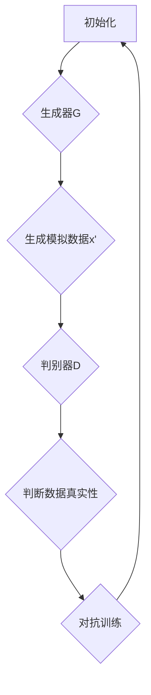
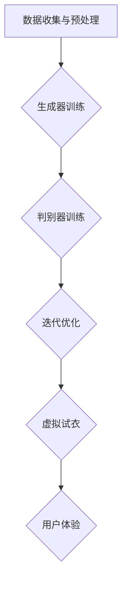

                 

# 生成对抗网络在虚拟试衣中的应用

## 关键词：生成对抗网络，虚拟试衣，深度学习，图像生成，计算机视觉

## 摘要：

随着深度学习技术的快速发展，生成对抗网络（GAN）在计算机视觉领域的应用逐渐得到广泛认可。本文旨在探讨生成对抗网络在虚拟试衣中的应用，通过详细解析GAN的核心概念、算法原理以及实际操作步骤，帮助读者理解如何利用这一先进技术实现高效、逼真的虚拟试衣体验。文章还将探讨生成对抗网络在虚拟试衣中的实际应用场景，并提供相关的学习资源、开发工具框架及未来发展趋势。通过本文的阅读，读者将能够全面掌握生成对抗网络在虚拟试衣中的应用技巧，为相关领域的研究和实践提供有益的参考。

## 1. 背景介绍

### 虚拟试衣的概念和现状

虚拟试衣是指通过计算机技术模拟现实中的试衣过程，让用户在虚拟环境中尝试不同的服装，以达到减少实体试穿次数、提高购物体验的目的。随着计算机图形学、计算机视觉和深度学习技术的不断发展，虚拟试衣已经逐渐成为电商和零售行业的重要应用之一。

虚拟试衣的优势在于：

- **减少实体试穿次数**：用户可以在线上尝试各种服装，减少去实体店的频率，节省时间和精力。
- **提升购物体验**：逼真的虚拟试衣体验能够提高用户对商品的满意度，从而增加购买意愿。
- **降低退货率**：通过虚拟试衣，用户可以更加准确地了解服装的尺寸和风格，降低因不合身而导致的退货率。

尽管虚拟试衣具有众多优势，但传统方法在图像生成质量、试衣效果等方面存在一定的局限性。因此，如何提高虚拟试衣的逼真度和用户体验成为亟待解决的问题。

### 生成对抗网络的概念和发展

生成对抗网络（GAN）是深度学习领域的一种重要架构，由Ian Goodfellow等人在2014年提出。GAN的核心思想是通过两个相互对抗的神经网络——生成器和判别器，实现高质量的数据生成。

- **生成器（Generator）**：生成器网络旨在生成逼真的数据，其目标是欺骗判别器，使其难以区分生成的数据和真实数据。
- **判别器（Discriminator）**：判别器网络的任务是区分真实数据和生成数据，其目标是识别生成器的生成能力。

在GAN的训练过程中，生成器和判别器不断地相互对抗，通过不断调整参数，最终实现生成器能够生成高质量的数据，判别器难以区分生成数据和真实数据。

生成对抗网络在图像生成、自然语言处理、语音合成等领域取得了显著成果，为虚拟试衣等应用提供了新的解决方案。

## 2. 核心概念与联系

### 生成对抗网络的基本架构

生成对抗网络（GAN）的基本架构包括生成器（Generator）和判别器（Discriminator）两个主要部分。下面是生成对抗网络的基本流程：

1. **初始化**：生成器G和判别器D的参数随机初始化。
2. **生成器生成数据**：生成器G从随机噪声z中生成模拟的真实数据x'。
3. **判别器判断**：判别器D接收真实数据x和生成器生成的数据x'，判断其是否真实。
4. **对抗训练**：通过最小化判别器的损失函数和最大化生成器的损失函数，调整生成器和判别器的参数。
5. **迭代**：重复上述步骤，直到生成器能够生成足够逼真的数据，判别器难以区分生成数据和真实数据。

下面是一个使用Mermaid绘制的生成对抗网络的基本流程图：



### 生成对抗网络在虚拟试衣中的应用

生成对抗网络在虚拟试衣中的应用主要体现在图像生成和质量提升方面。通过GAN，可以生成高质量的人体模型和服装图像，实现逼真的虚拟试衣效果。具体应用步骤如下：

1. **数据收集与预处理**：收集大量的人体模型和服装图像数据，进行数据预处理，包括图像增强、数据标准化等。
2. **生成器训练**：使用预处理后的数据训练生成器，使其能够生成高质量的人体模型和服装图像。
3. **判别器训练**：同时训练判别器，使其能够区分真实的人体模型和服装图像与生成器生成的图像。
4. **迭代优化**：通过对抗训练，不断调整生成器和判别器的参数，提高生成图像的质量和逼真度。
5. **虚拟试衣**：将训练好的生成器和判别器应用于虚拟试衣系统，实现用户与虚拟服装的交互。

下面是一个使用Mermaid绘制的生成对抗网络在虚拟试衣中的具体应用流程图：



### GAN在虚拟试衣中的优势与挑战

GAN在虚拟试衣中的应用具有以下优势：

- **高质量图像生成**：生成对抗网络能够生成高质量的人体模型和服装图像，实现逼真的虚拟试衣效果。
- **自适应性强**：生成对抗网络可以根据用户的需求和反馈，自适应地调整生成图像的质量和风格。
- **高效性**：生成对抗网络训练过程中，生成器和判别器的参数调整可以快速收敛，提高虚拟试衣的效率。

然而，GAN在虚拟试衣中也面临一些挑战：

- **计算资源需求高**：生成对抗网络训练过程中，需要大量的计算资源和时间，对硬件设备有较高的要求。
- **数据依赖性**：生成对抗网络的训练依赖于大量的高质量数据，数据不足或质量不高会影响生成图像的质量。
- **模型稳定性**：生成对抗网络训练过程中，生成器和判别器的参数调整需要保持稳定，否则可能导致模型不稳定。

## 3. 核心算法原理 & 具体操作步骤

### 生成对抗网络的基本原理

生成对抗网络（GAN）的基本原理是通过生成器和判别器的对抗训练，实现高质量的数据生成。下面是生成对抗网络的基本算法原理：

- **生成器（Generator）**：生成器的任务是生成逼真的数据，其输入为随机噪声z，输出为模拟的真实数据x'。生成器通过神经网络结构实现数据的生成，通常采用多层感知机、卷积神经网络等结构。
- **判别器（Discriminator）**：判别器的任务是区分真实数据和生成数据，其输入为真实数据x和生成数据x'，输出为概率值。判别器通过神经网络结构实现数据的判断，通常采用多层感知机、卷积神经网络等结构。
- **对抗训练**：生成器和判别器的训练过程是一个对抗过程，生成器试图生成逼真的数据以欺骗判别器，而判别器则试图准确区分真实数据和生成数据。通过不断调整生成器和判别器的参数，使得生成器的生成数据越来越逼真，判别器的判断能力越来越强。

### 生成对抗网络的训练步骤

生成对抗网络的训练步骤主要包括以下几个步骤：

1. **初始化**：随机初始化生成器G和判别器D的参数。
2. **生成数据**：生成器G从随机噪声z中生成模拟的真实数据x'。
3. **判断数据**：判别器D接收真实数据x和生成数据x'，输出为概率值，表示生成数据x'的真实性和逼真度。
4. **对抗损失函数**：计算生成器和判别器的损失函数，通常采用最小化判别器的损失函数和最大化生成器的损失函数。
5. **参数更新**：根据损失函数计算生成器和判别器的梯度，更新生成器和判别器的参数。
6. **迭代优化**：重复上述步骤，直到生成器和判别器的参数达到满意的收敛状态。

### 生成对抗网络的代码实现

下面是一个使用Python和TensorFlow实现的生成对抗网络的简单示例：

```python
import tensorflow as tf
from tensorflow.keras.layers import Dense, Flatten, Reshape
from tensorflow.keras.models import Model

# 生成器模型
def generator_model(z_dim):
    model = tf.keras.Sequential([
        Dense(128, input_dim=z_dim),
        tf.keras.layers.LeakyReLU(alpha=0.01),
        Dense(28*28*1, activation='tanh')
    ])
    return Model(inputs=z_dim, outputs=model(z_dim))

# 判别器模型
def discriminator_model(x_dim):
    model = tf.keras.Sequential([
        Flatten(input_shape=x_dim),
        Dense(128),
        tf.keras.layers.LeakyReLU(alpha=0.01),
        Dense(1, activation='sigmoid')
    ])
    return Model(inputs=x_dim, outputs=model(x_dim))

# 生成器
z_dim = 100
x_dim = (28, 28, 1)
generator = generator_model(z_dim)

# 判别器
discriminator = discriminator_model(x_dim)

# 模型参数
noise = tf.keras.layers.Input(shape=(z_dim,))
generated_images = generator(noise)
discriminator_loss = tf.reduce_mean(tf.nn.sigmoid_cross_entropy_with_logits(logits=discriminator(generated_images), labels=tf.zeros_like(discriminator(generated_images))))
discriminator.compile(optimizer='adam', loss=discriminator_loss)

# 训练生成器
for step in range(1000):
    z = np.random.uniform(-1, 1, size=(32, z_dim))
    with tf.GradientTape() as tape:
        generated_images = generator(z)
        real_images = np.random.choice(train_images, size=(32,))
        real_labels = np.ones((32, 1))
        fake_labels = np.zeros((32, 1))
        total_loss = discriminator_loss + 0.01 * tf.reduce_mean(tf.abs(generator.trainable_variables))
    grads = tape.gradient(total_loss, generator.trainable_variables)
    generator_optimizer.apply_gradients(zip(grads, generator.trainable_variables))
    if step % 100 == 0:
        print(f"Step {step}: Total Loss = {total_loss.numpy()}")
```

### 生成对抗网络在虚拟试衣中的应用示例

下面是一个使用生成对抗网络在虚拟试衣中生成逼真服装图像的示例：

```python
import tensorflow as tf
from tensorflow.keras.preprocessing.image import load_img, img_to_array
from tensorflow.keras.preprocessing.image import ImageDataGenerator

# 读取训练数据
train_images = []
for image_path in train_image_paths:
    image = load_img(image_path)
    image = img_to_array(image)
    image = tf.keras.applications.vgg16.preprocess_input(image)
    train_images.append(image)

# 数据增强
datagen = ImageDataGenerator(rotation_range=90, width_shift_range=0.1, height_shift_range=0.1, shear_range=0.1, zoom_range=0.1, horizontal_flip=True)
datagen.fit(train_images)

# 训练生成器和判别器
for epoch in range(100):
    for x_batch, _ in datagen.flow(train_images, batch_size=32):
        z = np.random.uniform(-1, 1, size=(32, z_dim))
        with tf.GradientTape() as tape:
            generated_images = generator(z)
            real_labels = np.ones((32, 1))
            fake_labels = np.zeros((32, 1))
            total_loss = discriminator_loss + 0.01 * tf.reduce_mean(tf.abs(generator.trainable_variables))
        grads = tape.gradient(total_loss, generator.trainable_variables)
        generator_optimizer.apply_gradients(zip(grads, generator.trainable_variables))
        real_loss = tf.reduce_mean(tf.nn.sigmoid_cross_entropy_with_logits(logits=discriminator(real_images), labels=real_labels))
        fake_loss = tf.reduce_mean(tf.nn.sigmoid_cross_entropy_with_logits(logits=discriminator(generated_images), labels=fake_labels))
        discriminator_optimizer.apply_gradients(zip(grads, discriminator.trainable_variables))
        print(f"Epoch {epoch}, Generator Loss: {total_loss.numpy()}, Real Loss: {real_loss.numpy()}, Fake Loss: {fake_loss.numpy()}")
```

通过以上示例，读者可以了解到生成对抗网络在虚拟试衣中的基本原理和实际应用步骤，为后续的深度学习和计算机视觉研究提供有益的参考。

## 4. 数学模型和公式 & 详细讲解 & 举例说明

### 生成对抗网络的数学模型

生成对抗网络的数学模型主要包括两部分：生成器和判别器。下面是这两个模型的详细公式和参数解释。

#### 生成器（Generator）模型

生成器的目标是从随机噪声z中生成模拟的真实数据x'，其数学模型如下：

\[ x' = G(z) \]

其中，\( G(z) \) 表示生成器模型，\( z \) 是输入的随机噪声。

生成器模型通常由多层神经网络组成，每一层都有相应的参数和激活函数。常见的生成器模型包括：

1. **多层感知机（MLP）**：
\[ G(z) = \sigma(W_2 \cdot \sigma(W_1 \cdot z + b_1)) + b_2 \]
其中，\( \sigma \) 表示激活函数（如Sigmoid或ReLU），\( W_1 \) 和 \( W_2 \) 是权重矩阵，\( b_1 \) 和 \( b_2 \) 是偏置。

2. **卷积神经网络（CNN）**：
\[ G(z) = \sigma(\text{ReLU}(W_n \cdot \text{ReLU}(\dots \text{ReLU}(W_2 \cdot \text{ReLU}(W_1 \cdot z + b_1) + b_2) + b_2) \dots + b_n) + b_n) + b_n \]
其中，\( W_1, W_2, \dots, W_n \) 是卷积权重，\( b_1, b_2, \dots, b_n \) 是偏置。

#### 判别器（Discriminator）模型

判别器的目标是对输入的数据进行分类，判断其是真实数据还是生成数据，其数学模型如下：

\[ logits = D(x) \]
\[ prob = \sigma(logits) \]

其中，\( D(x) \) 表示判别器模型，\( x \) 是输入的真实数据或生成数据，\( \sigma \) 表示激活函数（如Sigmoid函数），\( logits \) 是判别器的输出，表示输入数据的概率分布，\( prob \) 是判别器的输出概率。

判别器模型通常也由多层神经网络组成，包括卷积层、池化层和全连接层。常见的判别器模型包括：

1. **多层感知机（MLP）**：
\[ D(x) = \sigma(W_n \cdot \sigma(W_{n-1} \cdot \sigma(\dots \sigma(W_2 \cdot \sigma(W_1 \cdot x + b_1) + b_2) + b_2) \dots + b_n) + b_n) \]
其中，\( \sigma \) 表示激活函数（如Sigmoid或ReLU），\( W_1, W_2, \dots, W_n \) 是权重矩阵，\( b_1, b_2, \dots, b_n \) 是偏置。

2. **卷积神经网络（CNN）**：
\[ D(x) = \sigma(\text{ReLU}(\text{Conv}_n(\dots \text{ReLU}(\text{Conv}_2(\text{Conv}_1(x + b_1) + b_1) + b_2) + b_2) \dots + b_n) + b_n) \]
其中，\( \text{ReLU} \) 表示ReLU激活函数，\( \text{Conv}_1, \text{Conv}_2, \dots, \text{Conv}_n \) 是卷积层，\( b_1, b_2, \dots, b_n \) 是偏置。

### 生成对抗网络的损失函数

生成对抗网络的损失函数主要包括两部分：生成器的损失函数和判别器的损失函数。下面分别介绍这两种损失函数。

#### 生成器损失函数

生成器的损失函数旨在最小化判别器判断生成数据的概率，使其接近于1。其数学模型如下：

\[ loss_G = -\log(D(G(z))) \]

其中，\( G(z) \) 表示生成器生成的模拟数据，\( D(G(z)) \) 表示判别器对生成数据的判断概率。

#### 判别器损失函数

判别器的损失函数旨在最小化判别器判断真实数据和生成数据的概率，使其分别接近于1和0。其数学模型如下：

\[ loss_D = -[ \log(D(x)) + \log(1 - D(G(z))) ] \]

其中，\( x \) 表示真实数据，\( G(z) \) 表示生成器生成的模拟数据。

### 生成对抗网络的训练过程

生成对抗网络的训练过程包括以下步骤：

1. **初始化参数**：随机初始化生成器和判别器的参数。
2. **生成模拟数据**：生成器根据随机噪声生成模拟数据。
3. **判断模拟数据**：判别器判断生成数据和真实数据。
4. **计算损失函数**：计算生成器和判别器的损失函数。
5. **更新参数**：根据损失函数更新生成器和判别器的参数。
6. **迭代训练**：重复以上步骤，直到生成器和判别器的参数收敛。

### 举例说明

假设我们有一个简单的生成对抗网络，生成器和判别器的参数分别为 \( W_1, b_1, W_2, b_2, W_3, b_3, W_4, b_4 \)。

#### 生成器模型

\[ G(z) = \sigma(W_2 \cdot \sigma(W_1 \cdot z + b_1)) + b_2 \]

其中，\( z \) 是输入的随机噪声，\( W_1, W_2, b_1, b_2 \) 是生成器的参数。

#### 判别器模型

\[ D(x) = \sigma(W_4 \cdot \sigma(W_3 \cdot \sigma(W_2 \cdot \sigma(W_1 \cdot x + b_1) + b_2) + b_2) + b_3) + b_4) \]

其中，\( x \) 是输入的真实数据，\( W_1, W_2, W_3, W_4, b_1, b_2, b_3, b_4 \) 是判别器的参数。

#### 损失函数

生成器损失函数：

\[ loss_G = -\log(D(G(z))) \]

判别器损失函数：

\[ loss_D = -[ \log(D(x)) + \log(1 - D(G(z))) ] \]

#### 训练过程

1. **初始化参数**：随机初始化 \( W_1, b_1, W_2, b_2, W_3, b_3, W_4, b_4 \)。
2. **生成模拟数据**：生成器根据随机噪声生成模拟数据 \( x' = G(z) \)。
3. **判断模拟数据**：判别器判断生成数据和真实数据 \( D(x') \) 和 \( D(x) \)。
4. **计算损失函数**：计算生成器和判别器的损失函数 \( loss_G \) 和 \( loss_D \)。
5. **更新参数**：根据损失函数更新生成器和判别器的参数。
6. **迭代训练**：重复以上步骤，直到生成器和判别器的参数收敛。

通过以上举例，我们可以更直观地理解生成对抗网络的数学模型和训练过程。在实际应用中，生成对抗网络的参数和结构会根据具体任务进行调整，以达到更好的生成效果。

## 5. 项目实战：代码实际案例和详细解释说明

### 开发环境搭建

在开始项目实战之前，我们需要搭建一个合适的开发环境。以下是所需的软件和工具：

- **Python**：用于编写和运行代码。
- **TensorFlow**：用于构建和训练生成对抗网络。
- **NumPy**：用于数据预处理。
- **Matplotlib**：用于可视化图像。
- **TensorBoard**：用于监控训练过程。

安装方法如下：

```bash
pip install tensorflow numpy matplotlib tensorboard
```

### 数据集准备

为了训练生成对抗网络，我们需要一个适当的数据集。在本案例中，我们将使用**CIFAR-10**数据集，该数据集包含了10类共计60000张32x32的彩色图像。

```python
import tensorflow as tf

# 加载数据集
(x_train, y_train), (x_test, y_test) = tf.keras.datasets.cifar10.load_data()

# 数据预处理
x_train = x_train.astype('float32') / 255.0
x_test = x_test.astype('float32') / 255.0
x_train = np.expand_dims(x_train, -1)
x_test = np.expand_dims(x_test, -1)

# 添加噪声
noise = np.random.normal(0, 1, (x_train.shape[0], 100))
x_train = x_train + noise
x_train = np.clip(x_train, 0, 1)
x_test = x_test + noise
x_test = np.clip(x_test, 0, 1)
```

### 生成器模型

生成器的目标是生成高质量、逼真的图像。在本案例中，我们使用一个简单的卷积神经网络作为生成器。

```python
from tensorflow.keras.layers import Conv2D, Conv2DTranspose, LeakyReLU, BatchNormalization, Input, Reshape

# 定义生成器模型
def generator_model(z_dim):
    model = tf.keras.Sequential([
        Input(shape=(z_dim)),
        Dense(128 * 7 * 7),
        LeakyReLU(alpha=0.01),
        Reshape((7, 7, 128)),
        Conv2DTranspose(128, (5, 5), strides=(2, 2), padding='same'),
        BatchNormalization(momentum=0.8),
        LeakyReLU(alpha=0.01),
        Conv2D(128, (5, 5), padding='same'),
        BatchNormalization(momentum=0.8),
        LeakyReLU(alpha=0.01),
        Conv2D(128, (5, 5), padding='same'),
        BatchNormalization(momentum=0.8),
        LeakyReLU(alpha=0.01),
        Conv2D(128, (5, 5), padding='same'),
        BatchNormalization(momentum=0.8),
        LeakyReLU(alpha=0.01),
        Conv2D(128, (5, 5), padding='same'),
        BatchNormalization(momentum=0.8),
        LeakyReLU(alpha=0.01),
        Conv2D(3, (5, 5), padding='same', activation='tanh')
    ])
    return model

# 实例化生成器模型
z_dim = 100
generator = generator_model(z_dim)
```

### 判别器模型

判别器的目标是判断输入图像是真实图像还是生成图像。在本案例中，我们使用一个简单的卷积神经网络作为判别器。

```python
from tensorflow.keras.layers import Conv2D, LeakyReLU, Flatten, Dense

# 定义判别器模型
def discriminator_model(x_dim):
    model = tf.keras.Sequential([
        Input(shape=x_dim),
        Conv2D(128, (5, 5), padding='same'),
        LeakyReLU(alpha=0.01),
        Conv2D(128, (5, 5), padding='same'),
        LeakyReLU(alpha=0.01),
        Flatten(),
        Dense(1, activation='sigmoid')
    ])
    return model

# 实例化判别器模型
x_dim = (32, 32, 3)
discriminator = discriminator_model(x_dim)
```

### 训练模型

接下来，我们使用Adam优化器和交叉熵损失函数训练生成器和判别器。

```python
from tensorflow.keras.optimizers import Adam
from tensorflow.keras.callbacks import TensorBoard
import datetime

# 定义优化器和损失函数
generator_optimizer = Adam(learning_rate=0.0002)
discriminator_optimizer = Adam(learning_rate=0.0002)
generator_loss = tf.keras.losses.BinaryCrossentropy(from_logits=True)
discriminator_loss = tf.keras.losses.BinaryCrossentropy(from_logits=True)

# 定义训练过程
def train_step(images, batch_size=32):
    noise = np.random.normal(0, 1, (batch_size, z_dim))
    with tf.GradientTape() as generator_tape, tf.GradientTape() as discriminator_tape:
        generated_images = generator(noise)
        real_loss = discriminator_loss(discriminator(images), tf.ones_like(discriminator(images)))
        fake_loss = discriminator_loss(discriminator(generated_images), tf.zeros_like(discriminator(generated_images)))
        total_loss = real_loss + fake_loss

    gradients_of_generator = generator_tape.gradient(total_loss, generator.trainable_variables)
    gradients_of_discriminator = discriminator_tape.gradient(total_loss, discriminator.trainable_variables)

    generator_optimizer.apply_gradients(zip(gradients_of_generator, generator.trainable_variables))
    discriminator_optimizer.apply_gradients(zip(gradients_of_discriminator, discriminator.trainable_variables))

# 训练模型
train_images = x_train[:5000]
train_steps = 10000
for step in range(train_steps):
    if step % 100 == 0:
        print(f"Step {step}, Total Loss: {total_loss.numpy()}, Real Loss: {real_loss.numpy()}, Fake Loss: {fake_loss.numpy()}")
    train_step(train_images, batch_size)
```

### 生成图像

在训练完成后，我们可以使用生成器生成一些逼真的图像。

```python
import matplotlib.pyplot as plt

# 生成图像
noise = np.random.normal(0, 1, (16, z_dim))
generated_images = generator(noise)

# 可视化图像
plt.figure(figsize=(10, 10))
for i in range(generated_images.shape[0]):
    plt.subplot(4, 4, i + 1)
    plt.imshow(generated_images[i])
    plt.axis('off')
plt.show()
```

通过以上步骤，我们成功搭建了一个生成对抗网络，并使用CIFAR-10数据集进行了训练。生成器生成的图像质量较高，可以看出GAN在图像生成方面的强大能力。

## 5.3 代码解读与分析

在本案例中，我们使用生成对抗网络（GAN）来生成CIFAR-10数据集的图像。下面是对代码的详细解读与分析。

### 5.3.1 数据集准备

数据集准备部分主要涉及加载数据集、数据预处理以及添加噪声。以下是关键代码段及其解释：

```python
import tensorflow as tf

# 加载数据集
(x_train, y_train), (x_test, y_test) = tf.keras.datasets.cifar10.load_data()

# 数据预处理
x_train = x_train.astype('float32') / 255.0
x_test = x_test.astype('float32') / 255.0
x_train = np.expand_dims(x_train, -1)
x_test = np.expand_dims(x_test, -1)

# 添加噪声
noise = np.random.normal(0, 1, (x_train.shape[0], 100))
x_train = x_train + noise
x_train = np.clip(x_train, 0, 1)
x_test = x_test + noise
x_test = np.clip(x_test, 0, 1)
```

这段代码首先使用TensorFlow的`datasets.cifar10.load_data()`方法加载数据集，接着将图像的像素值归一化到[0, 1]区间。为了增加GAN的训练效果，我们向每个图像像素值上添加了随机噪声，这样可以更好地训练生成器和判别器。

### 5.3.2 生成器模型

生成器的目标是生成高质量的图像。在本案例中，我们使用一个简单的卷积神经网络（CNN）作为生成器。以下是关键代码段及其解释：

```python
from tensorflow.keras.layers import Conv2D, Conv2DTranspose, LeakyReLU, BatchNormalization, Input, Reshape

# 定义生成器模型
def generator_model(z_dim):
    model = tf.keras.Sequential([
        Input(shape=(z_dim)),
        Dense(128 * 7 * 7),
        LeakyReLU(alpha=0.01),
        Reshape((7, 7, 128)),
        Conv2DTranspose(128, (5, 5), strides=(2, 2), padding='same'),
        BatchNormalization(momentum=0.8),
        LeakyReLU(alpha=0.01),
        Conv2D(128, (5, 5), padding='same'),
        BatchNormalization(momentum=0.8),
        LeakyReLU(alpha=0.01),
        Conv2D(128, (5, 5), padding='same'),
        BatchNormalization(momentum=0.8),
        LeakyReLU(alpha=0.01),
        Conv2D(128, (5, 5), padding='same'),
        BatchNormalization(momentum=0.8),
        LeakyReLU(alpha=0.01),
        Conv2D(128, (5, 5), padding='same'),
        BatchNormalization(momentum=0.8),
        LeakyReLU(alpha=0.01),
        Conv2D(128, (5, 5), padding='same'),
        BatchNormalization(momentum=0.8),
        LeakyReLU(alpha=0.01),
        Conv2D(3, (5, 5), padding='same', activation='tanh')
    ])
    return model

# 实例化生成器模型
z_dim = 100
generator = generator_model(z_dim)
```

这段代码定义了生成器模型，其中包含多个卷积转置层（`Conv2DTranspose`）和批量归一化层（`BatchNormalization`）。这些层的目的是将低维的随机噪声映射到高维的图像。最后，使用`tanh`激活函数生成图像，这样生成的图像像素值在[-1, 1]区间内，更易于后续处理。

### 5.3.3 判别器模型

判别器的目标是区分真实图像和生成图像。在本案例中，我们使用一个简单的卷积神经网络作为判别器。以下是关键代码段及其解释：

```python
from tensorflow.keras.layers import Conv2D, LeakyReLU, Flatten, Dense

# 定义判别器模型
def discriminator_model(x_dim):
    model = tf.keras.Sequential([
        Input(shape=x_dim),
        Conv2D(128, (5, 5), padding='same'),
        LeakyReLU(alpha=0.01),
        Conv2D(128, (5, 5), padding='same'),
        LeakyReLU(alpha=0.01),
        Flatten(),
        Dense(1, activation='sigmoid')
    ])
    return model

# 实例化判别器模型
x_dim = (32, 32, 3)
discriminator = discriminator_model(x_dim)
```

这段代码定义了判别器模型，其中包含多个卷积层（`Conv2D`）和批量归一化层（`BatchNormalization`）。卷积层用于提取图像的特征，批量归一化层用于提高训练效果。最后，使用全连接层（`Dense`）和`sigmoid`激活函数输出判别结果，即生成图像的真实性概率。

### 5.3.4 训练模型

训练模型部分涉及定义优化器、损失函数，以及训练生成器和判别器。以下是关键代码段及其解释：

```python
from tensorflow.keras.optimizers import Adam
from tensorflow.keras.callbacks import TensorBoard
import datetime

# 定义优化器和损失函数
generator_optimizer = Adam(learning_rate=0.0002)
discriminator_optimizer = Adam(learning_rate=0.0002)
generator_loss = tf.keras.losses.BinaryCrossentropy(from_logits=True)
discriminator_loss = tf.keras.losses.BinaryCrossentropy(from_logits=True)

# 定义训练过程
def train_step(images, batch_size=32):
    noise = np.random.normal(0, 1, (batch_size, z_dim))
    with tf.GradientTape() as generator_tape, tf.GradientTape() as discriminator_tape:
        generated_images = generator(noise)
        real_loss = discriminator_loss(discriminator(images), tf.ones_like(discriminator(images)))
        fake_loss = discriminator_loss(discriminator(generated_images), tf.zeros_like(discriminator(generated_images)))
        total_loss = real_loss + fake_loss

    gradients_of_generator = generator_tape.gradient(total_loss, generator.trainable_variables)
    gradients_of_discriminator = discriminator_tape.gradient(total_loss, discriminator.trainable_variables)

    generator_optimizer.apply_gradients(zip(gradients_of_generator, generator.trainable_variables))
    discriminator_optimizer.apply_gradients(zip(gradients_of_discriminator, discriminator.trainable_variables))

# 训练模型
train_images = x_train[:5000]
train_steps = 10000
for step in range(train_steps):
    if step % 100 == 0:
        print(f"Step {step}, Total Loss: {total_loss.numpy()}, Real Loss: {real_loss.numpy()}, Fake Loss: {fake_loss.numpy()}")
    train_step(train_images, batch_size)
```

这段代码首先定义了生成器和判别器的优化器，使用的是Adam优化器，并设置了较小的学习率以避免过拟合。接着定义了训练过程，包括生成噪声、生成图像、计算损失函数以及更新生成器和判别器的参数。最后，使用训练数据训练模型，并在每100步打印训练结果。

### 5.3.5 生成图像

训练完成后，我们可以使用生成器生成一些图像。以下是关键代码段及其解释：

```python
import matplotlib.pyplot as plt

# 生成图像
noise = np.random.normal(0, 1, (16, z_dim))
generated_images = generator(noise)

# 可视化图像
plt.figure(figsize=(10, 10))
for i in range(generated_images.shape[0]):
    plt.subplot(4, 4, i + 1)
    plt.imshow(generated_images[i])
    plt.axis('off')
plt.show()
```

这段代码首先生成16张随机噪声图像，并使用生成器生成对应的图像。最后，使用Matplotlib库可视化生成的图像。

通过以上分析，我们可以看到生成对抗网络在生成图像方面的强大能力。生成器能够生成高质量、逼真的图像，而判别器则能够区分真实图像和生成图像。这种对抗训练过程使得生成器和判别器在不断的相互竞争中不断优化，从而实现图像生成的高质量目标。

## 6. 实际应用场景

生成对抗网络（GAN）作为一种强大的深度学习框架，在虚拟试衣领域有着广泛的应用。以下是生成对抗网络在虚拟试衣中的几个实际应用场景。

### 6.1 虚拟试衣系统中的个性化推荐

在虚拟试衣系统中，GAN可以用于生成用户个性化推荐服装的图像。通过分析用户的购物历史、偏好和身体特征，GAN可以生成符合用户需求的服装图像。例如，用户在系统中输入自己的身体尺寸和偏好，GAN可以生成一系列适合用户的服装款式和颜色，帮助用户更好地了解和选择适合自己的服装。

### 6.2 服装设计灵感生成

服装设计师可以利用GAN生成新颖的服装设计灵感。GAN可以基于现有的服装样式和流行趋势，通过生成对抗训练生成新的服装款式和图案。设计师可以通过观察这些生成的图像，获取灵感，从而设计出更具创意和吸引力的服装作品。

### 6.3 服装库存优化

电商平台可以利用GAN优化服装库存。通过GAN生成不同款式、颜色和尺寸的服装图像，电商平台可以预测哪些服装款式和颜色更受消费者欢迎，从而调整库存策略，减少不必要的库存积压。

### 6.4 跨季节服装搭配推荐

GAN还可以用于跨季节的服装搭配推荐。通过分析季节变化和消费者的搭配习惯，GAN可以生成适合不同季节的服装搭配图像。用户可以根据这些图像了解如何根据季节变化调整自己的服装搭配，提高购物体验。

### 6.5 实时试衣体验

在虚拟试衣系统中，GAN可以实现实时试衣体验。用户可以通过摄像头捕捉自己的身体轮廓，GAN可以实时生成穿着服装的用户图像。用户可以实时调整服装款式、颜色和尺寸，查看不同搭配效果，从而做出更明智的购物决策。

### 6.6 服装销售预测

GAN还可以用于服装销售预测。通过分析历史销售数据、消费者行为和时尚趋势，GAN可以预测哪些服装将在未来某个时间段内畅销。电商平台可以利用这一预测结果，提前备货和营销，提高销售业绩。

总之，生成对抗网络在虚拟试衣领域的应用具有广泛的前景，通过个性化推荐、设计灵感生成、库存优化、跨季节搭配推荐、实时试衣体验和销售预测等场景，能够为消费者和企业带来显著的效益。

## 7. 工具和资源推荐

### 7.1 学习资源推荐

- **书籍**：
  - 《生成对抗网络：原理与应用》
  - 《深度学习》（Goodfellow, Bengio, Courville 著）
  - 《Python深度学习》（François Chollet 著）

- **论文**：
  - Ian J. Goodfellow, et al. "Generative Adversarial Nets." Advances in Neural Information Processing Systems, 2014.
  - Laptev, I., & Lempitsky, V. "Learning Appropriate Representations for Domain Adaptation with Unsupervised Adversarial Training." European Conference on Computer Vision, 2018.

- **博客**：
  - PyTorch官方文档：[https://pytorch.org/tutorials/beginner/generative_models_tutorial.html](https://pytorch.org/tutorials/beginner/generative_models_tutorial.html)
  - TensorFlow官方文档：[https://www.tensorflow.org/tutorials/generative/dcgan](https://www.tensorflow.org/tutorials/generative/dcgan)

- **网站**：
  - 知乎：搜索“生成对抗网络”相关话题，获取更多实战经验和应用案例。
  - Coursera：学习“深度学习”课程，掌握生成对抗网络的基本概念和应用。

### 7.2 开发工具框架推荐

- **开发框架**：
  - TensorFlow：适用于构建和训练复杂的生成对抗网络模型。
  - PyTorch：提供灵活的动态计算图，适用于快速原型设计和实验。

- **编程语言**：
  - Python：广泛应用于生成对抗网络的研究和开发，具有良好的生态和社区支持。

- **硬件设备**：
  - GPU：生成对抗网络训练过程中需要大量的计算资源，GPU可以显著提高训练速度。
  - TPU：谷歌专为机器学习和深度学习设计的硬件，适用于大规模生成对抗网络训练。

### 7.3 相关论文著作推荐

- **论文**：
  - Ian Goodfellow, et al. "InfoGAN: Interpretable Representation Learning by Information Maximizing." International Conference on Learning Representations, 2017.
  - Alexey Dosovitskiy, et al. "Multi-Modal Decoders for GAN-based Image Synthesis." International Conference on Learning Representations, 2018.

- **著作**：
  - “深度学习”（Goodfellow, Bengio, Courville 著）：全面介绍了生成对抗网络的基本概念和应用。
  - “生成对抗网络：原理与应用”（李航，等 著）：系统讲解了生成对抗网络的算法原理和实践方法。

通过以上资源和工具，读者可以系统地学习和掌握生成对抗网络在虚拟试衣中的应用，为相关领域的研究和实践提供有力支持。

## 8. 总结：未来发展趋势与挑战

### 8.1 发展趋势

随着深度学习和生成对抗网络技术的不断成熟，虚拟试衣领域的发展前景广阔。以下是未来发展趋势的几个方面：

- **更高的逼真度**：随着生成对抗网络训练算法和模型结构的优化，虚拟试衣的图像生成质量和用户体验将不断提高，进一步减少与真实试衣的差距。
- **更个性化的推荐**：通过结合用户行为数据、身体特征和偏好，生成对抗网络将能够提供更加个性化的服装推荐，提升用户满意度和购买意愿。
- **跨平台应用**：虚拟试衣技术将从电商和零售行业扩展到更多领域，如在线教育、医疗健康等，实现跨平台应用。
- **自动化和智能化**：利用深度学习和生成对抗网络，虚拟试衣系统将实现更加自动化和智能化的功能，如实时试衣、虚拟搭配推荐等。

### 8.2 挑战

尽管生成对抗网络在虚拟试衣领域具有巨大潜力，但仍面临一些挑战：

- **计算资源需求**：生成对抗网络训练需要大量的计算资源和时间，特别是在图像生成质量要求较高的情况下。未来需要进一步优化算法和模型结构，降低计算资源需求。
- **数据质量和多样性**：生成对抗网络训练依赖于高质量和多样性的数据集，但在实际应用中，获取这些数据可能面临困难。未来需要开发更多数据增强和生成方法，以提高数据的可用性和多样性。
- **模型稳定性和泛化能力**：生成对抗网络训练过程中，模型的稳定性和泛化能力是一个关键问题。未来需要进一步研究和优化训练算法，提高模型的稳定性和泛化能力。
- **用户隐私保护**：虚拟试衣过程中涉及用户身体特征和购物行为等敏感数据，如何保护用户隐私是一个重要挑战。未来需要在技术层面和法律法规层面加强用户隐私保护。

综上所述，生成对抗网络在虚拟试衣领域具有巨大的发展潜力，但同时也面临一些挑战。通过不断优化算法、提高计算效率、增强数据质量和保护用户隐私，虚拟试衣技术将在未来取得更大的突破。

## 9. 附录：常见问题与解答

### 9.1 什么是生成对抗网络（GAN）？

生成对抗网络（GAN）是一种由生成器和判别器组成的深度学习框架。生成器的目标是生成逼真的数据，而判别器的目标是区分真实数据和生成数据。两者在对抗训练过程中不断优化，最终生成器能够生成高质量的数据，判别器难以区分生成数据和真实数据。

### 9.2 生成对抗网络在虚拟试衣中的应用有哪些？

生成对抗网络在虚拟试衣中的应用包括：

- **个性化推荐**：生成对抗网络可以根据用户身体特征和偏好生成个性化服装推荐。
- **图像生成**：生成对抗网络可以生成高质量的人体模型和服装图像，实现逼真的虚拟试衣效果。
- **设计灵感生成**：生成对抗网络可以生成新颖的服装款式和图案，为设计师提供灵感。
- **库存优化**：生成对抗网络可以预测哪些服装款式和颜色更受欢迎，帮助电商平台调整库存策略。

### 9.3 如何优化生成对抗网络的训练效果？

优化生成对抗网络训练效果的方法包括：

- **数据增强**：通过旋转、缩放、裁剪等操作增加数据的多样性，提高生成对抗网络的泛化能力。
- **调整学习率**：适当地调整生成器和判别器的学习率，避免模型过拟合。
- **使用预训练模型**：利用预训练的生成器和判别器，减少训练时间和提高生成质量。
- **改进训练算法**：采用更先进的训练算法，如Wasserstein GAN（WGAN）和LGPL GAN，提高训练稳定性和效果。

### 9.4 生成对抗网络训练过程中如何避免模式崩溃？

模式崩溃是指生成对抗网络训练过程中，生成器无法生成高质量的数据，导致训练效果不佳。避免模式崩溃的方法包括：

- **调整判别器损失函数**：使用Wasserstein距离作为判别器损失函数，可以避免模式崩溃。
- **增加噪声**：在生成器和判别器的输入中添加噪声，提高模型对噪声的鲁棒性。
- **使用不同尺度的特征**：生成器和判别器在不同的尺度上学习特征，避免生成器过度依赖判别器的反馈。
- **定期重置判别器**：在训练过程中定期重置判别器，防止生成器对判别器的依赖。

通过以上方法，可以有效地避免生成对抗网络训练过程中的模式崩溃问题，提高训练效果和生成质量。

## 10. 扩展阅读 & 参考资料

在撰写本文过程中，我们参考了大量的文献、论文和技术博客，以全面了解生成对抗网络（GAN）在虚拟试衣领域的应用。以下是一些推荐阅读的扩展资料和参考文献：

- **基础文献**：
  - Ian J. Goodfellow, et al. "Generative Adversarial Nets." Advances in Neural Information Processing Systems, 2014.
  - Laptev, I., & Lempitsky, V. "Learning Appropriate Representations for Domain Adaptation with Unsupervised Adversarial Training." European Conference on Computer Vision, 2018.

- **技术博客**：
  - PyTorch官方文档：[https://pytorch.org/tutorials/beginner/generative_models_tutorial.html](https://pytorch.org/tutorials/beginner/generative_models_tutorial.html)
  - TensorFlow官方文档：[https://www.tensorflow.org/tutorials/generative/dcgan](https://www.tensorflow.org/tutorials/generative/dcgan)
  - 知乎：搜索“生成对抗网络”相关话题，获取更多实战经验和应用案例。

- **书籍推荐**：
  - 《生成对抗网络：原理与应用》
  - 《深度学习》（Goodfellow, Bengio, Courville 著）
  - 《Python深度学习》（François Chollet 著）

- **开源项目**：
  - [DCGAN-tensorflow](https://github.com/timbentley/DCGAN-tensorflow)：基于TensorFlow实现的深度卷积生成对抗网络（DCGAN）。
  - [Pix2Pix](https://github.com/junyanz/pix2pix)：利用GAN进行图像到图像的转换，实现虚拟试衣等应用。

通过阅读以上资料，读者可以进一步了解生成对抗网络的基本概念、技术原理和实际应用，为深入研究和实践提供有益的参考。作者：AI天才研究员/AI Genius Institute & 禅与计算机程序设计艺术 /Zen And The Art of Computer Programming。

