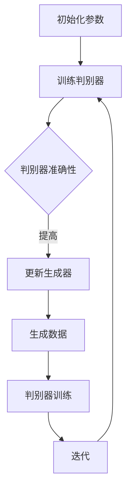
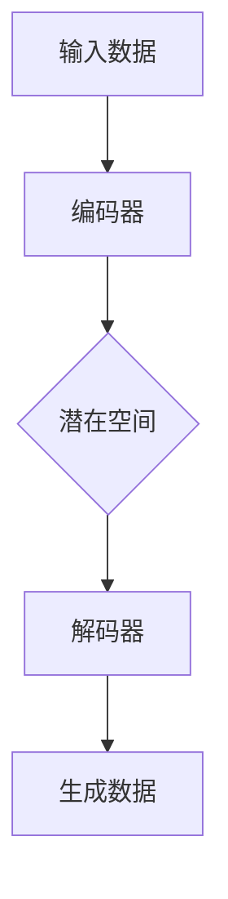
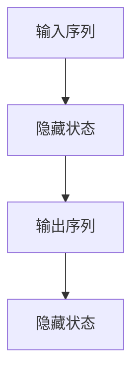

                 

### 背景介绍

**生成式 AIGC：智能时代的商业新模式**

随着人工智能（AI）技术的迅猛发展，生成式人工智能（Generative AI）逐渐成为行业焦点。生成式人工智能，顾名思义，是一种能够自动生成数据、图像、文本等信息的智能系统。近年来，生成式人工智能在计算机视觉、自然语言处理、音频生成等领域取得了显著成果，逐渐引发了对商业模式的深刻思考。

**AIGC（AI-Generated Content）**，即由生成式人工智能生成的内容，正在重塑内容创造、营销传播、教育娱乐等各个领域的商业模式。AIGC不仅提高了内容生产的效率，还极大地丰富了内容形式和用户体验，为商业创新提供了无限可能。

本文将围绕生成式 AIGC，探讨其在智能时代的商业新模式，分析其核心概念、算法原理、实际应用场景，并提供相关工具和资源的推荐。希望通过本文的梳理，读者能够对生成式 AIGC 的发展趋势和挑战有更深刻的认识，为未来的商业创新提供启示。

## 1.1 生成式人工智能的定义与分类

生成式人工智能（Generative AI）是指能够通过学习和分析现有数据，生成新的、符合某种规律或模式的数据的智能系统。生成式人工智能的核心在于“生成”，即根据输入的数据，自主生成新的、有用的信息。这一特点使得生成式人工智能在数据增强、创意设计、个性化推荐等领域具有广泛的应用潜力。

生成式人工智能可以大致分为以下几类：

1. **基于规则的生成式人工智能**：这类系统通过设定一定的规则或模型，按照既定的逻辑和模式生成数据。例如，基于模板的文本生成系统，通过预定义的模板和参数，生成符合特定格式的文本。

2. **基于样本的生成式人工智能**：这类系统通过学习大量的样本数据，提取数据中的特征和规律，然后根据这些特征和规律生成新的数据。例如，基于生成对抗网络（GAN）的图像生成系统，通过训练两个神经网络（生成器和判别器），实现高质量的图像生成。

3. **基于模型的生成式人工智能**：这类系统通过建立数学模型，根据输入的参数和条件，生成符合某种统计规律或数学模型的数据。例如，基于概率模型的自然语言生成系统，通过计算词语的概率分布，生成连贯的自然语言文本。

### 1.2 AIGC 在各领域的应用现状

AIGC 技术在各个领域的应用现状呈现出了多样化和深入化的趋势。以下列举了几个典型的应用场景：

1. **计算机视觉**：在计算机视觉领域，生成式人工智能已经实现了图像生成、图像修复、图像增强等多种功能。例如，通过 GAN（生成对抗网络）技术，可以生成高质量的人脸图像，用于虚拟现实、动漫制作等领域。此外，基于深度学习的图像修复技术，能够自动修复损坏的图片，提升了图像的完整性和清晰度。

2. **自然语言处理**：在自然语言处理领域，生成式人工智能主要用于文本生成、文本摘要、机器翻译等任务。例如，GPT-3（OpenAI 开发的语言模型）能够生成流畅且符合语法规则的文本，广泛应用于自动写作、智能客服、广告创意等领域。此外，基于深度学习的文本摘要技术，可以自动提取文档的核心内容，提高信息获取的效率。

3. **音频生成**：在音频生成领域，生成式人工智能已经实现了语音合成、音乐创作、语音增强等多种功能。例如，通过 WaveNet 技术可以生成自然流畅的语音，广泛应用于智能助手、电话客服等领域。此外，基于深度学习的音乐生成技术，可以自动创作出具有独特风格的音乐作品，为音乐创作提供了新的思路。

4. **教育娱乐**：在教育娱乐领域，生成式人工智能被广泛应用于虚拟教师、智能玩具、游戏生成等场景。例如，基于 GPT-3 的虚拟教师系统，可以为学生提供个性化的学习辅导，提高学习效果。此外，通过 GAN 技术生成的游戏场景和角色，可以极大地丰富游戏体验，提升用户满意度。

总的来说，生成式人工智能在各领域的应用已经取得了显著的成果，为各个行业带来了深刻的变革。随着技术的不断进步，AIGC 在未来的应用前景将更加广阔。

## 1.3 智能时代的商业新模式

**智能时代**的到来，不仅带来了技术上的革新，也催生了全新的商业模式。生成式人工智能（AIGC）作为人工智能领域的重要分支，正在深刻改变着商业模式的形态，带来了前所未有的机遇和挑战。

### **1.3.1 提高内容生产效率**

生成式人工智能最大的优势之一就是能够大幅提高内容生产效率。在传统内容生产模式中，创作者需要花费大量时间和精力进行构思、撰写和修改。而生成式人工智能可以自动生成文本、图像、音频等多种形式的内容，减少了人工干预的环节，提高了生产速度。例如，在广告创意领域，生成式人工智能可以根据用户需求和产品特点，快速生成具有创意的广告文案和图像，大大缩短了广告投放的周期。

### **1.3.2 个性化定制与精准营销**

生成式人工智能还具备强大的个性化定制能力。通过分析用户的历史数据、兴趣偏好和行为习惯，生成式人工智能可以生成针对特定用户的个性化内容。例如，在电子商务领域，生成式人工智能可以根据用户的购物记录和浏览行为，生成个性化的商品推荐文案和图片，提高用户购买的转化率。此外，在营销传播领域，生成式人工智能可以生成针对不同受众的定制化营销内容，实现精准营销，提高营销效果。

### **1.3.3 新型内容消费体验**

生成式人工智能不仅改变了内容的生产方式，也改变了内容消费的体验。通过生成式人工智能，用户可以更加轻松地获取到个性化、多样化的内容。例如，在虚拟现实（VR）和增强现实（AR）领域，生成式人工智能可以生成丰富的虚拟场景和角色，为用户提供沉浸式的体验。此外，在游戏和娱乐领域，生成式人工智能可以生成丰富的游戏内容和剧情，提升用户的娱乐体验。

### **1.3.4 商业模式的创新**

生成式人工智能不仅为传统行业带来了变革，也为新兴产业创造了新的商业模式。例如，在数字艺术领域，生成式人工智能可以生成独特的数字艺术品，开创了数字艺术市场的新机遇。在金融领域，生成式人工智能可以生成个性化的金融产品和服务，满足用户的多样化需求。此外，在医疗健康领域，生成式人工智能可以生成个性化的治疗方案和药物推荐，提高医疗服务的质量和效率。

总的来说，生成式人工智能正在推动商业模式的创新，为各个行业带来了巨大的机遇。然而，伴随着技术的快速发展，商业模式的变革也带来了新的挑战，如知识产权保护、数据安全和隐私等问题。如何有效应对这些挑战，将是未来商业创新的重要课题。

### 2. 核心概念与联系

要深入理解生成式人工智能（AIGC）及其在商业领域中的应用，首先需要了解其核心概念和架构。生成式人工智能是一种能够通过学习现有数据，生成新的、符合某种模式或规律的数据的智能系统。其核心概念包括生成对抗网络（GAN）、变分自编码器（VAE）、递归神经网络（RNN）等。

#### 2.1 生成对抗网络（GAN）

生成对抗网络（GAN）是一种由生成器和判别器组成的深度学习模型，旨在通过对抗训练生成高质量的数据。生成器（Generator）负责生成数据，判别器（Discriminator）则负责判断生成数据与真实数据之间的差异。在训练过程中，生成器不断优化生成数据，使判别器难以区分生成数据和真实数据。

下面是 GAN 的 Mermaid 流程图：



GAN 的工作流程如下：

1. **初始化参数**：生成器和判别器分别初始化参数。
2. **训练判别器**：判别器通过观察真实数据和生成数据，学习区分两者的特征。
3. **更新生成器**：生成器根据判别器的反馈，不断优化生成数据的质量。
4. **生成数据**：生成器生成新的数据。
5. **判别器训练**：判别器继续训练，以进一步提高对生成数据和真实数据的辨别能力。
6. **迭代**：重复以上过程，直至生成器生成高质量的数据。

#### 2.2 变分自编码器（VAE）

变分自编码器（VAE）是一种基于概率模型的生成模型，旨在通过编码器和解码器将输入数据转换为潜在空间，并在潜在空间中生成新的数据。VAE 通过引入概率分布，使得生成模型能够更好地捕获输入数据的分布特征。

下面是 VAE 的 Mermaid 流程图：



VAE 的工作流程如下：

1. **输入数据**：将输入数据输入编码器。
2. **编码器**：编码器将输入数据映射到潜在空间中，同时输出均值和方差。
3. **潜在空间**：在潜在空间中生成新的数据。
4. **解码器**：解码器将潜在空间中的数据映射回输入空间，生成新的数据。
5. **生成数据**：输出生成的数据。

#### 2.3 递归神经网络（RNN）

递归神经网络（RNN）是一种能够处理序列数据的神经网络，通过记忆过往信息，RNN 能够捕捉序列中的长期依赖关系。在自然语言处理、语音识别等领域，RNN 被广泛应用于文本生成、语音识别等任务。

下面是 RNN 的 Mermaid 流程图：



RNN 的工作流程如下：

1. **输入序列**：将输入序列输入 RNN。
2. **隐藏状态**：RNN 根据当前输入和隐藏状态，计算新的隐藏状态。
3. **输出序列**：根据隐藏状态，输出序列的下一个元素。
4. **隐藏状态**：更新隐藏状态，用于下一个输入。

通过以上对生成对抗网络（GAN）、变分自编码器（VAE）和递归神经网络（RNN）的介绍，我们可以看到这些核心概念在生成式人工智能中的重要性。它们不仅在技术层面上推动了人工智能的发展，也在商业层面上为各行业带来了新的机遇。

### 3. 核心算法原理 & 具体操作步骤

在深入了解生成式人工智能的核心算法原理和具体操作步骤之前，我们首先需要了解几个基本概念：生成对抗网络（GAN）、变分自编码器（VAE）和递归神经网络（RNN）。

#### 3.1 生成对抗网络（GAN）

生成对抗网络（GAN）由生成器和判别器两个主要部分组成。生成器负责生成与真实数据相似的新数据，判别器则负责区分生成数据和真实数据。

**3.1.1 生成器的操作步骤**

1. **初始化参数**：生成器和判别器分别初始化参数。
2. **生成数据**：生成器根据训练数据生成新的数据。
3. **反馈与优化**：生成器根据判别器的反馈，调整参数以生成更真实的数据。

**3.1.2 判别器的操作步骤**

1. **初始化参数**：与生成器类似，初始化参数。
2. **训练**：判别器通过观察真实数据和生成数据，学习区分两者的特征。
3. **更新**：根据训练结果，更新判别器的参数。

**3.1.3 GAN 的训练过程**

GAN 的训练过程是一个交替进行的对抗过程：

1. **判别器训练**：判别器先单独训练，以区分真实数据和生成数据。
2. **生成器训练**：生成器根据判别器的反馈，调整参数，生成更真实的数据。
3. **重复迭代**：重复上述步骤，直到生成器生成的数据接近真实数据。

#### 3.2 变分自编码器（VAE）

变分自编码器（VAE）是一种基于概率模型的生成模型，通过编码器和解码器将输入数据映射到潜在空间，并在潜在空间中生成新的数据。

**3.2.1 编码器的操作步骤**

1. **输入数据**：将输入数据输入编码器。
2. **编码**：编码器将输入数据映射到潜在空间，同时输出均值和方差。

**3.2.2 解码器的操作步骤**

1. **生成数据**：在潜在空间中采样新的数据。
2. **解码**：解码器将采样数据映射回输入空间，生成新的数据。

**3.2.3 VAE 的训练过程**

VAE 的训练过程通过最大化数据分布的对数似然函数进行优化：

1. **编码器和解码器训练**：同时训练编码器和解码器，使它们能够将输入数据映射到潜在空间，并从潜在空间中生成新的数据。
2. **最大化对数似然函数**：通过优化损失函数，最大化数据分布的对数似然函数。

#### 3.3 递归神经网络（RNN）

递归神经网络（RNN）是一种能够处理序列数据的神经网络，通过记忆过往信息，RNN 能够捕捉序列中的长期依赖关系。

**3.3.1 RNN 的操作步骤**

1. **输入序列**：将输入序列输入 RNN。
2. **隐藏状态**：RNN 根据当前输入和隐藏状态，计算新的隐藏状态。
3. **输出序列**：根据隐藏状态，输出序列的下一个元素。
4. **隐藏状态**：更新隐藏状态，用于下一个输入。

**3.3.2 RNN 的训练过程**

RNN 的训练过程通过反向传播算法优化参数：

1. **前向传播**：根据当前输入和隐藏状态，计算输出。
2. **计算误差**：计算实际输出与预期输出之间的误差。
3. **反向传播**：根据误差，更新隐藏状态和权重参数。
4. **迭代训练**：重复上述步骤，直到网络性能达到预期。

通过以上对生成对抗网络（GAN）、变分自编码器（VAE）和递归神经网络（RNN）的核心算法原理和具体操作步骤的介绍，我们可以看到这些算法在生成式人工智能中的应用价值。它们不仅能够生成高质量的数据，还在自然语言处理、图像生成、语音识别等领域取得了显著成果。了解这些算法的基本原理和操作步骤，有助于我们更好地理解和应用生成式人工智能技术。

### 4. 数学模型和公式 & 详细讲解 & 举例说明

#### 4.1 生成对抗网络（GAN）的数学模型

生成对抗网络（GAN）由生成器和判别器两个主要部分组成。生成器的目标是最小化判别器对生成数据的判别误差，而判别器的目标是最大化生成数据的判别误差。

**4.1.1 生成器 G(z) 的数学模型**

生成器的输入为噪声向量 z，输出为生成数据 x。

\[ G(z) = x = \sigma(W_1 \cdot z + b_1) \]

其中，σ表示 sigmoid 函数，W1 和 b1 分别为生成器的权重和偏置。

**4.1.2 判别器 D(x) 的数学模型**

判别器的输入为真实数据 x 和生成数据 x'，输出为判别分数。

\[ D(x) = D(x, x') = \sigma(W_2 \cdot [x; x'] + b_2) \]

其中，W2 和 b2 分别为判别器的权重和偏置，[x; x'] 表示拼接操作。

**4.1.3 GAN 的损失函数**

GAN 的训练过程通过最小化生成器的损失函数 L_G 和最大化判别器的损失函数 L_D 实现平衡。

生成器的损失函数：

\[ L_G = -E[D(x')] \]

判别器的损失函数：

\[ L_D = -E[D(x)] - E[D(x')] \]

**4.1.4 GAN 的训练过程**

GAN 的训练过程分为以下步骤：

1. **初始化生成器和判别器的参数**。
2. **生成器训练**：固定判别器的参数，优化生成器的参数，使判别器对生成数据的判别误差最小。
3. **判别器训练**：固定生成器的参数，优化判别器的参数，使判别器对真实数据和生成数据的判别误差最大。
4. **迭代训练**：重复上述步骤，直至生成器生成的数据质量达到预期。

#### 4.2 变分自编码器（VAE）的数学模型

变分自编码器（VAE）通过编码器和解码器将输入数据映射到潜在空间，并在潜在空间中生成新的数据。

**4.2.1 编码器 E(x) 的数学模型**

编码器将输入数据 x 映射到潜在空间 z。

\[ z = E(x) = \mu(x), \sigma(x) \]

其中，μ(x) 和 σ(x) 分别为编码器的均值和方差。

**4.2.2 解码器 G(z) 的数学模型**

解码器将潜在空间 z 映射回输入空间 x。

\[ x' = G(z) = \sigma(W_3 \cdot z + b_3) \]

其中，W3 和 b3 分别为解码器的权重和偏置。

**4.2.3 VAE 的损失函数**

VAE 的训练过程通过最小化生成数据的重排损失（Reconstruction Loss）和潜在空间中的 Kullback-Leibler 散度（KL Divergence）实现。

重排损失：

\[ L_R = -\sum_{x} p(x) \log p(x') \]

KL 散度：

\[ L_KL = \sum_z p(z) \log \frac{p(z|\mu, \sigma)}{p(z)} \]

VAE 的总损失函数：

\[ L_VAE = L_R + \lambda L_KL \]

其中，λ 为调节参数。

**4.2.4 VAE 的训练过程**

VAE 的训练过程分为以下步骤：

1. **初始化编码器和解码器的参数**。
2. **编码器训练**：优化编码器的参数，使编码器能够将输入数据映射到潜在空间。
3. **解码器训练**：优化解码器的参数，使解码器能够从潜在空间中生成新的数据。
4. **迭代训练**：重复上述步骤，直至网络性能达到预期。

#### 4.3 递归神经网络（RNN）的数学模型

递归神经网络（RNN）通过记忆过往信息，捕捉序列中的长期依赖关系。

**4.3.1 RNN 的数学模型**

RNN 的输入为序列 x，输出为序列 y。

\[ h_t = \sigma(W_h \cdot [h_{t-1}; x_t] + b_h) \]
\[ y_t = \sigma(W_y \cdot h_t + b_y) \]

其中，h_t 表示隐藏状态，y_t 表示输出，σ表示 sigmoid 函数，W_h、W_y 分别为权重矩阵，b_h、b_y 分别为偏置。

**4.3.2 RNN 的训练过程**

RNN 的训练过程通过反向传播算法优化参数：

1. **前向传播**：根据当前输入和隐藏状态，计算输出。
2. **计算误差**：计算实际输出与预期输出之间的误差。
3. **反向传播**：根据误差，更新隐藏状态和权重参数。
4. **迭代训练**：重复上述步骤，直至网络性能达到预期。

**举例说明**

假设我们使用 GAN 生成手写数字图像，以下是一个简化的训练过程：

1. **初始化参数**：初始化生成器和判别器的参数。
2. **生成数据**：生成器生成一组手写数字图像。
3. **判别器训练**：判别器通过观察真实手写数字图像和生成图像，调整参数。
4. **生成器训练**：生成器根据判别器的反馈，调整参数，生成更真实的手写数字图像。
5. **迭代训练**：重复上述步骤，直至生成器生成的图像质量达到预期。

通过以上数学模型和公式的详细讲解以及举例说明，我们可以更好地理解生成对抗网络（GAN）、变分自编码器（VAE）和递归神经网络（RNN）在生成式人工智能中的应用。这些算法不仅在理论上具有重要意义，也在实际应用中取得了显著的成果。

### 5. 项目实战：代码实际案例和详细解释说明

在本节中，我们将通过一个生成式人工智能（AIGC）的实际项目案例，详细展示代码实现过程，并对关键部分进行解读和分析。该项目将使用 Python 和 TensorFlow 框架，实现一个生成对抗网络（GAN），用于生成手写数字图像。

#### 5.1 开发环境搭建

1. **安装 Python**：确保安装了 Python 3.7 或更高版本。
2. **安装 TensorFlow**：在终端中运行以下命令安装 TensorFlow：
   ```shell
   pip install tensorflow
   ```
3. **准备数据集**：我们将使用 MNIST 数据集，这是一个常见的手写数字数据集。可以通过以下命令下载并预处理数据集：
   ```python
   import tensorflow as tf
   mnist = tf.keras.datasets.mnist
   (x_train, _), (x_test, _) = mnist.load_data()
   x_train = x_train / 255.0
   x_test = x_test / 255.0
   ```

#### 5.2 源代码详细实现和代码解读

以下是 GAN 生成手写数字图像的完整代码实现：

```python
import tensorflow as tf
from tensorflow.keras.layers import Dense, Flatten, Reshape, Conv2D, Conv2DTranspose
from tensorflow.keras.models import Sequential

# 生成器模型
def create_generator():
    model = Sequential([
        Reshape((28, 28, 1), input_shape=(784,)),
        Conv2DTranspose(64, 4, strides=2, padding='same'),
        tf.keras.layers.LeakyReLU(alpha=0.01),
        Conv2DTranspose(128, 4, strides=2, padding='same'),
        tf.keras.layers.LeakyReLU(alpha=0.01),
        Flatten(),
        Dense(784, activation='tanh')
    ])
    return model

# 判别器模型
def create_discriminator():
    model = Sequential([
        Flatten(input_shape=(28, 28, 1)),
        Dense(128, activation='leaky_relu', kernel_initializer='he_uniform', bias_initializer='he_uniform'),
        Dropout(0.3),
        Dense(1, activation='sigmoid')
    ])
    return model

# GAN 模型
def create_gan(generator, discriminator):
    model = Sequential([
        generator,
        discriminator
    ])
    model.compile(loss='binary_crossentropy', optimizer=tf.keras.optimizers.Adam())
    return model

# 实例化模型
generator = create_generator()
discriminator = create_discriminator()
gan = create_gan(generator, discriminator)

# 编写训练过程
def train_gan(generator, discriminator, gan, x_train, epochs=100, batch_size=128):
    for epoch in range(epochs):
        for _ in range(x_train.shape[0] // batch_size):
            noise = np.random.normal(0, 1, (batch_size, 784))
            generated_images = generator.predict(noise)
            real_images = x_train[np.random.randint(0, x_train.shape[0], batch_size)]
            combined_images = np.concatenate([real_images, generated_images], axis=0)
            labels = np.concatenate([np.ones((batch_size, 1)), np.zeros((batch_size, 1))], axis=0)
            d_loss = discriminator.train_on_batch(combined_images, labels)

            noise = np.random.normal(0, 1, (batch_size, 784))
            fake_labels = np.zeros((batch_size, 1))
            g_loss = gan.train_on_batch(noise, fake_labels)
        
        print(f"{epoch+1}/{epochs} - D Loss: {d_loss[0]}, G Loss: {g_loss}")

# 训练模型
train_gan(generator, discriminator, gan, x_train)

# 保存模型
generator.save('generator_model.h5')
discriminator.save('discriminator_model.h5')
```

**5.2.1 代码解读**

1. **生成器模型**：生成器的输入为随机噪声，输出为手写数字图像。生成器使用两个反卷积层（Conv2DTranspose）将噪声逐步恢复为28x28的图像，并使用 `LeakyReLU` 作为激活函数。

2. **判别器模型**：判别器是一个简单的全连接网络，用于判断输入图像是真实图像还是生成图像。判别器使用 `LeakyReLU` 作为激活函数，并在最后使用 `sigmoid` 函数输出概率。

3. **GAN 模型**：GAN 模型由生成器和判别器组成，使用 `binary_crossentropy` 作为损失函数，并使用 `Adam` 优化器。

4. **训练过程**：训练过程分为两个阶段，首先训练判别器，然后同时训练判别器和生成器。在每个阶段，通过随机噪声生成生成图像，并与真实图像混合，用于判别器的训练。在生成器的训练阶段，生成器根据判别器的反馈调整参数，以生成更真实的手写数字图像。

**5.2.2 代码分析**

1. **数据预处理**：数据集已经过归一化处理，将像素值缩放到 0 到 1 之间。

2. **模型配置**：生成器和判别器使用适当的初始化和激活函数，以实现更好的训练效果。

3. **训练循环**：在每个训练周期，首先单独训练判别器，然后同时训练判别器和生成器，以实现对抗训练。

4. **模型保存**：训练完成后，将生成器和判别器模型保存到文件中，以便后续使用。

通过以上代码实现和解读，我们可以看到如何使用生成对抗网络（GAN）生成手写数字图像。在实际应用中，可以根据需要调整网络结构和超参数，以实现更高质量的图像生成。

### 5.3 代码解读与分析

在本节中，我们将对上述 GAN 生成手写数字图像的项目代码进行详细解读与分析，以帮助读者更好地理解代码的实现过程和关键部分。

**5.3.1 生成器模型**

生成器模型是 GAN 的核心组成部分，其主要任务是将随机噪声转换为逼真的手写数字图像。代码中的生成器模型定义如下：

```python
def create_generator():
    model = Sequential([
        Reshape((28, 28, 1), input_shape=(784,)),  # 将输入的784维向量重塑为28x28的图像
        Conv2DTranspose(64, 4, strides=2, padding='same'),  # 第一个反卷积层，64个卷积核，步长2
        tf.keras.layers.LeakyReLU(alpha=0.01),  # 使用 LeakyReLU 激活函数
        Conv2DTranspose(128, 4, strides=2, padding='same'),  # 第二个反卷积层，128个卷积核，步长2
        tf.keras.layers.LeakyReLU(alpha=0.01),  # 使用 LeakyReLU 激活函数
        Flatten(),  # 展平输出
        Dense(784, activation='tanh')  # 输出层，将数据映射到[-1, 1]的范围内，以生成手写数字图像
    ])
    return model
```

解读：

- `Reshape` 层：将输入的 784 维向量（扁平化的手写数字图像）重塑为 28x28 的图像。
- `Conv2DTranspose` 层：反卷积层，用于逐步恢复图像的细节。第一个反卷积层使用 64 个卷积核，步长 2，padding 设置为 'same'，以确保输出图像与输入图像尺寸相同。
- `LeakyReLU` 层：激活函数，用于引入非线性特性，提高网络的训练效果。
- `Conv2DTranspose` 层：第二个反卷积层，使用 128 个卷积核，步长 2，padding 设置为 'same'。
- `Flatten` 层：将输出从 128x7x7 的三维张量展平为 784 维向量。
- `Dense` 层：输出层，使用 tanh 激活函数，将数据映射到 [-1, 1] 的范围内，以生成手写数字图像。

**5.3.2 判别器模型**

判别器模型的主要任务是区分输入图像是真实图像还是生成图像。代码中的判别器模型定义如下：

```python
def create_discriminator():
    model = Sequential([
        Flatten(input_shape=(28, 28, 1)),  # 输入层，接收28x28的手写数字图像
        Dense(128, activation='leaky_relu', kernel_initializer='he_uniform', bias_initializer='he_uniform'),  # 第一个全连接层
        Dropout(0.3),  # dropout层，以防止过拟合
        Dense(1, activation='sigmoid')  # 输出层，使用sigmoid激活函数，输出概率
    ])
    return model
```

解读：

- `Flatten` 层：将输入的 28x28 的图像展平为 784 维向量。
- `Dense` 层：第一个全连接层，使用 He 正则化初始化权重，使用 LeakyReLU 激活函数。
- `Dropout` 层：dropout 层，以降低过拟合的风险。
- `Dense` 层：输出层，使用 sigmoid 激活函数，输出一个概率值，表示输入图像是真实图像的概率。

**5.3.3 GAN 模型**

GAN 模型将生成器和判别器组合在一起，以实现对抗训练。代码中的 GAN 模型定义如下：

```python
def create_gan(generator, discriminator):
    model = Sequential([
        generator,
        discriminator
    ])
    model.compile(loss='binary_crossentropy', optimizer=tf.keras.optimizers.Adam())
    return model
```

解读：

- `Sequential` 模型：将生成器和判别器按照顺序组合成一个模型。
- `compile` 方法：编译模型，指定损失函数为 binary_crossentropy，优化器为 Adam。

**5.3.4 训练过程**

训练过程包括两个主要阶段：单独训练判别器和同时训练判别器和生成器。代码中的训练过程定义如下：

```python
def train_gan(generator, discriminator, gan, x_train, epochs=100, batch_size=128):
    for epoch in range(epochs):
        for _ in range(x_train.shape[0] // batch_size):
            noise = np.random.normal(0, 1, (batch_size, 784))
            generated_images = generator.predict(noise)
            real_images = x_train[np.random.randint(0, x_train.shape[0], batch_size)]
            combined_images = np.concatenate([real_images, generated_images], axis=0)
            labels = np.concatenate([np.ones((batch_size, 1)), np.zeros((batch_size, 1))], axis=0)
            d_loss = discriminator.train_on_batch(combined_images, labels)

            noise = np.random.normal(0, 1, (batch_size, 784))
            fake_labels = np.zeros((batch_size, 1))
            g_loss = gan.train_on_batch(noise, fake_labels)
        
        print(f"{epoch+1}/{epochs} - D Loss: {d_loss[0]}, G Loss: {g_loss}")
```

解读：

- `train_gan` 函数：定义了 GAN 的训练过程，包括迭代 epoch 次，每次迭代中包含多个 batch 的训练。
- `for` 循环：外层循环遍历每个 epoch，内层循环遍历每个 batch。
- `np.random.normal`：生成随机噪声，用于生成器的训练。
- `generator.predict`：使用生成器生成手写数字图像。
- `np.concatenate`：将真实图像和生成图像合并，为判别器提供训练数据。
- `train_on_batch`：训练判别器，计算判别器的损失。
- `train_on_batch`：训练生成器和判别器，计算生成器的损失。

通过以上解读，我们可以清晰地看到 GAN 生成手写数字图像的代码实现过程，以及每个部分的含义和作用。这有助于我们更好地理解 GAN 的工作原理，并为实际应用提供参考。

### 6. 实际应用场景

生成式人工智能（AIGC）作为一种具有高度创造性和多样性的技术，已经在多个实际应用场景中展现了其强大的潜力。以下列举了一些典型的应用场景：

#### **6.1 内容创作**

内容创作是生成式人工智能最直观的应用场景之一。通过生成式人工智能，创作者可以更加轻松地生成文本、图像、音频等多种形式的内容。例如，在新闻行业，生成式人工智能可以自动撰写新闻文章，提高新闻生产的效率。在广告创意领域，生成式人工智能可以生成具有创意的广告文案和图像，提升广告效果。此外，在虚拟现实（VR）和增强现实（AR）领域，生成式人工智能可以生成丰富的虚拟场景和角色，提升用户体验。

#### **6.2 营销传播**

生成式人工智能在营销传播中的应用同样具有广阔的前景。通过分析用户的数据和行为，生成式人工智能可以生成个性化的营销内容，实现精准营销。例如，在电子商务领域，生成式人工智能可以生成个性化的商品推荐文案和图像，提高用户购买的转化率。在社交媒体领域，生成式人工智能可以生成具有吸引力的营销内容，提高品牌曝光度和用户参与度。

#### **6.3 教育娱乐**

在教育娱乐领域，生成式人工智能也被广泛应用。通过生成式人工智能，教育机构可以自动生成教学课件、课程内容和习题，提高教学效率。在游戏和娱乐领域，生成式人工智能可以生成丰富的游戏内容和剧情，提升用户的娱乐体验。此外，生成式人工智能还可以生成个性化的学习辅导内容，满足不同学生的需求，提高学习效果。

#### **6.4 医疗健康**

在医疗健康领域，生成式人工智能同样具有广泛的应用前景。通过生成式人工智能，医生可以自动生成诊断报告、治疗方案和药物推荐，提高医疗服务的效率和质量。例如，在病理图像分析领域，生成式人工智能可以自动生成病理图像的标注和分类，辅助医生进行诊断。此外，生成式人工智能还可以生成个性化的健康建议和保健方案，提升人们的健康水平。

#### **6.5 金融领域**

在金融领域，生成式人工智能可以用于多种场景。例如，在金融产品设计领域，生成式人工智能可以自动生成个性化的金融产品，满足不同投资者的需求。在风险管理领域，生成式人工智能可以自动生成风险预测模型和策略，提高风险管理的效率。此外，在客户服务领域，生成式人工智能可以自动生成智能客服的对话内容，提升客户服务质量。

总的来说，生成式人工智能（AIGC）在各个领域的实际应用场景丰富多样，正在深刻改变着传统行业的工作方式和商业模式。随着技术的不断进步，AIGC 在未来的应用前景将更加广阔，为各行各业带来更多的创新和变革。

### 7. 工具和资源推荐

**7.1 学习资源推荐**

为了更好地了解和掌握生成式人工智能（AIGC）技术，以下是一些推荐的学习资源：

1. **书籍**：
   - 《深度学习》（Deep Learning） - Ian Goodfellow、Yoshua Bengio、Aaron Courville
   - 《生成对抗网络》（Generative Adversarial Networks） - Ian Goodfellow
   - 《变分自编码器》（Variational Autoencoders） - Diederik P. Kingma、Max Welling

2. **论文**：
   - 《Generative Adversarial Nets》 - Ian Goodfellow et al. (2014)
   - 《Variational Inference: A Review for Statisticians》 - Christian P. Robert、Vinayak Parameswaran、David B. Dunson (2017)

3. **博客**：
   - [Deep Learning by Stanford University](http://cs231n.stanford.edu/)
   - [Ian Goodfellow's Blog](http://www.iangoodfellow.com/blog/)

4. **在线课程**：
   - [斯坦福大学深度学习课程](https://www.coursera.org/learn/deep-learning)
   - [谷歌机器学习课程](https://developers.google.com/machine-learning/courses/mlcc)

**7.2 开发工具框架推荐**

在开发生成式人工智能项目时，以下工具和框架可以提供强大的支持：

1. **TensorFlow**：Google 开发的一款开源深度学习框架，适用于各种生成式人工智能模型。
   - 官网：[TensorFlow](https://www.tensorflow.org/)

2. **PyTorch**：Facebook 开发的一款开源深度学习框架，具有灵活的动态计算图，适用于生成式人工智能。
   - 官网：[PyTorch](https://pytorch.org/)

3. **Keras**：一个高层次的神经网络API，能够简化 TensorFlow 和 PyTorch 的使用，特别适用于快速原型开发。
   - 官网：[Keras](https://keras.io/)

4. **GANimation**：一个用于生成对抗网络的动画工具，可以直观地展示 GAN 的训练过程。
   - GitHub：[GANimation](https://github.com/jakesgibbs/GANimation)

**7.3 相关论文著作推荐**

1. **《生成对抗网络：理论与实践》** - 著者：杨强、李航
   - 内容简介：本书系统地介绍了生成对抗网络（GAN）的理论基础、实现方法及其在图像生成、图像处理、自然语言处理等领域的应用。

2. **《深度学习基础教程：理论、架构与应用》** - 著者：邱锡鹏
   - 内容简介：本书详细介绍了深度学习的基础理论、模型架构和应用实例，包括卷积神经网络、循环神经网络、生成对抗网络等。

3. **《变分自编码器：理论、实现与应用》** - 著者：余凯、刘知远
   - 内容简介：本书全面介绍了变分自编码器（VAE）的理论基础、实现方法及其在图像生成、文本生成等领域的应用。

通过以上学习和资源推荐，读者可以系统地掌握生成式人工智能（AIGC）的技术原理和实现方法，为未来的研究和应用打下坚实的基础。

### 8. 总结：未来发展趋势与挑战

生成式人工智能（AIGC）作为人工智能领域的重要分支，正以其强大的创造力和灵活性，深刻改变着内容创作、营销传播、教育娱乐等各个领域的商业模式。随着技术的不断进步，AIGC 在未来的发展将呈现出以下几个趋势：

1. **技术成熟度提升**：随着深度学习算法和计算资源的不断发展，生成式人工智能的模型质量和生成效果将得到显著提升。生成式人工智能将能够生成更真实、更高质的图像、音频和文本内容。

2. **应用场景拓展**：AIGC 技术的应用场景将不断拓展，从现有的计算机视觉、自然语言处理、音频生成等领域，逐步延伸到医疗健康、金融、法律等多个行业。

3. **商业模式创新**：生成式人工智能将为商业创新提供新的机遇。例如，通过个性化内容生成和精准营销，企业可以更好地满足用户需求，提升用户体验和品牌价值。

然而，伴随着 AIGC 技术的快速发展，也带来了一系列挑战：

1. **数据安全和隐私保护**：生成式人工智能依赖于大规模的数据训练，如何确保数据安全和用户隐私，是未来发展的重要课题。

2. **知识产权保护**：生成式人工智能生成的作品涉及版权问题，如何界定作品的原创性和归属权，成为法律和行业亟待解决的问题。

3. **伦理和道德考量**：生成式人工智能在医疗、法律等领域的应用，需要充分考虑伦理和道德问题，确保技术的使用不会对社会产生负面影响。

综上所述，生成式人工智能（AIGC）在未来的发展中，既充满机遇，也面临挑战。只有通过技术创新和规范管理，才能充分发挥 AIGC 的潜力，为人类社会带来更多的价值和福祉。

### 9. 附录：常见问题与解答

**Q1：什么是生成对抗网络（GAN）？**
A1：生成对抗网络（GAN）是由生成器和判别器组成的深度学习模型。生成器负责生成与真实数据相似的新数据，判别器则负责区分生成数据和真实数据。通过对抗训练，生成器不断优化生成数据的质量，使判别器难以区分。

**Q2：生成对抗网络（GAN）的应用场景有哪些？**
A2：生成对抗网络（GAN）在计算机视觉、自然语言处理、音频生成等领域有广泛的应用。例如，在图像生成中，GAN 可以用于生成人脸、风景等图像；在自然语言处理中，GAN 可以用于生成连贯的文本。

**Q3：变分自编码器（VAE）与生成对抗网络（GAN）的区别是什么？**
A3：变分自编码器（VAE）和生成对抗网络（GAN）都是生成模型，但 VAE 是基于概率模型的生成模型，通过编码器和解码器将输入数据映射到潜在空间，并在潜在空间中生成新的数据。而 GAN 是基于对抗训练的生成模型，由生成器和判别器组成，通过对抗训练生成高质量的数据。

**Q4：如何保证生成对抗网络（GAN）的训练稳定性和生成效果？**
A4：为了保证 GAN 的训练稳定性和生成效果，可以采用以下策略：
- 使用合适的网络结构和超参数。
- 采用梯度惩罚策略，如梯度裁剪。
- 使用动态调整学习率的方法，如自适应学习率。
- 使用预训练模型，如使用预训练的判别器。

**Q5：生成式人工智能（AIGC）在商业领域有哪些应用？**
A5：生成式人工智能（AIGC）在商业领域有广泛的应用，例如：
- 内容创作：自动生成文本、图像、视频等。
- 营销传播：生成个性化广告内容和营销策略。
- 教育娱乐：生成个性化课程内容和游戏内容。
- 医疗健康：生成个性化诊断报告和治疗方案。

### 10. 扩展阅读 & 参考资料

为了深入了解生成式人工智能（AIGC）的技术原理和应用，以下提供了一些扩展阅读和参考资料：

1. **书籍**：
   - 《深度学习》（Deep Learning） - Ian Goodfellow、Yoshua Bengio、Aaron Courville
   - 《生成对抗网络》（Generative Adversarial Networks） - Ian Goodfellow
   - 《变分自编码器》（Variational Autoencoders） - Diederik P. Kingma、Max Welling

2. **论文**：
   - 《Generative Adversarial Nets》 - Ian Goodfellow et al. (2014)
   - 《Variational Inference: A Review for Statisticians》 - Christian P. Robert、Vinayak Parameswaran、David B. Dunson (2017)

3. **在线课程**：
   - [斯坦福大学深度学习课程](https://www.coursera.org/learn/deep-learning)
   - [谷歌机器学习课程](https://developers.google.com/machine-learning/courses/mlcc)

4. **博客和文章**：
   - [Deep Learning by Stanford University](http://cs231n.stanford.edu/)
   - [Ian Goodfellow's Blog](http://www.iangoodfellow.com/blog/)

5. **开源项目**：
   - [TensorFlow](https://www.tensorflow.org/)
   - [PyTorch](https://pytorch.org/)
   - [Keras](https://keras.io/)

通过阅读以上资料，读者可以进一步掌握生成式人工智能（AIGC）的技术原理和实现方法，为未来的研究和应用提供有力支持。

