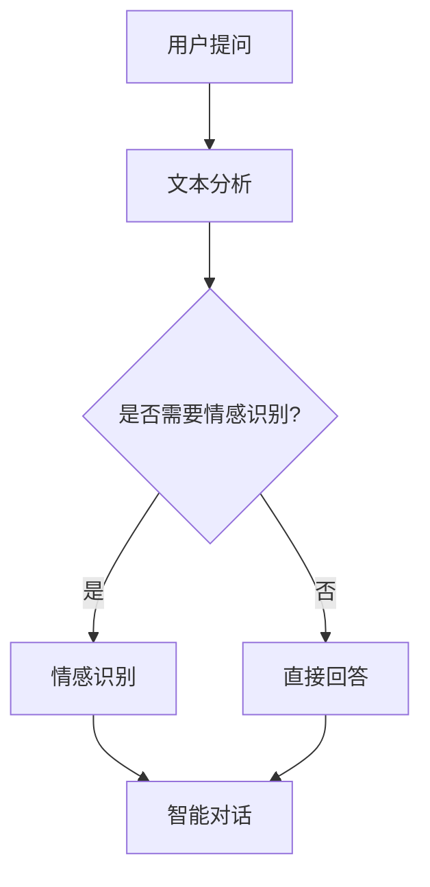

                 

# 用户体验提升：AI如何优化电商平台客服

## 摘要

随着互联网的飞速发展和电商平台的日益普及，用户对在线购物的体验要求越来越高。其中，客服作为电商平台与用户沟通的桥梁，其服务质量直接影响到用户的购物体验和平台的口碑。本文将探讨如何利用人工智能（AI）技术来优化电商平台客服，提升用户体验。我们将从背景介绍、核心概念与联系、核心算法原理、数学模型和公式、项目实战、实际应用场景、工具和资源推荐等多个方面进行详细分析，帮助读者理解AI在客服优化中的重要作用，并展望未来的发展趋势与挑战。

## 1. 背景介绍

### 电商平台客服的重要性

在电商平台的运营中，客服扮演着至关重要的角色。客服不仅负责解答用户的疑问，处理用户的投诉和问题，还能够在关键时刻为用户提供帮助，从而提升用户的购物体验。一个高效、专业的客服团队能够有效提高用户满意度，降低用户流失率，甚至能够推动平台销售业绩的提升。

### 客服面临的挑战

然而，随着电商平台用户数量的激增和业务规模的扩大，传统的客服模式面临着诸多挑战。首先，客服人员的数量和素质难以满足日益增长的客服需求。其次，客服过程中涉及到的数据量和复杂度也大大增加，导致客服效率低下。此外，客服过程中的情感交互和个性化需求也增加了客服的难度。

### AI技术的崛起

正是在这样的背景下，人工智能技术逐渐成为优化电商平台客服的重要工具。AI技术可以通过自动化、智能化的方式来处理大量的客服请求，提高客服效率，同时降低成本。此外，AI技术还可以通过深度学习和自然语言处理（NLP）技术，实现情感识别、个性化推荐和智能对话等功能，进一步提升客服质量和用户体验。

## 2. 核心概念与联系

### 自然语言处理（NLP）

自然语言处理（NLP）是人工智能（AI）的一个重要分支，旨在使计算机能够理解和处理人类语言。在电商平台客服中，NLP技术被广泛应用于文本分析和情感识别。通过NLP技术，客服系统能够理解用户的提问，并给出准确的回答，从而提升客服的效率和准确性。

### 情感识别

情感识别是NLP技术中的一个重要应用，它旨在识别用户的情感状态。在电商平台客服中，情感识别可以帮助客服系统更好地理解用户的需求，从而提供更个性化的服务。例如，当用户表达出愤怒或不满的情绪时，客服系统可以及时采取措施，避免冲突升级。

### 智能对话

智能对话是AI技术的一个重要应用领域，它旨在实现人与计算机之间的自然语言交互。在电商平台客服中，智能对话系统可以模拟客服人员与用户的对话，提供实时、个性化的服务。通过智能对话，用户可以方便地获取所需信息，客服人员也可以更高效地处理大量请求。

### Mermaid 流程图

以下是一个简单的Mermaid流程图，展示了NLP、情感识别和智能对话在电商平台客服中的应用流程：



## 3. 核心算法原理 & 具体操作步骤

### 文本分析

文本分析是NLP的基础，它主要包括词法分析、句法分析和语义分析。在电商平台客服中，文本分析的主要任务是提取用户提问的关键信息，为后续的情感识别和回答提供基础。

- **词法分析**：将文本分解为单词或短语，以便进行进一步处理。
- **句法分析**：分析文本中的语法结构，确定句子中的主语、谓语、宾语等。
- **语义分析**：理解文本的含义，提取关键信息。

具体操作步骤如下：

1. 将用户提问的文本输入到文本分析模块。
2. 使用分词算法将文本分解为单词或短语。
3. 使用句法分析算法分析文本的语法结构。
4. 使用语义分析算法提取关键信息。

### 情感识别

情感识别是基于NLP技术的一个应用，它通过分析文本中的情感词汇和语境，识别用户的情感状态。在电商平台客服中，情感识别可以帮助客服系统更好地理解用户的需求，从而提供更个性化的服务。

具体操作步骤如下：

1. 将文本分析模块提取的关键信息输入到情感识别模块。
2. 使用情感词典和机器学习算法识别文本中的情感词汇。
3. 根据情感词汇和语境分析用户的情感状态。

### 智能对话

智能对话是AI技术的一个重要应用，它通过模拟客服人员与用户的对话，提供实时、个性化的服务。在电商平台客服中，智能对话系统可以处理大量用户的请求，减轻客服人员的工作负担。

具体操作步骤如下：

1. 将情感识别模块的结果输入到智能对话模块。
2. 使用对话管理算法生成合适的回答。
3. 将回答发送给用户。

### 数学模型和公式

在文本分析、情感识别和智能对话中，有许多数学模型和公式被应用。以下是一些常用的数学模型和公式：

- **分词算法**：使用马尔可夫模型或隐马尔可夫模型（HMM）进行分词。
- **句法分析**：使用条件随机场（CRF）或图算法进行分析。
- **情感识别**：使用朴素贝叶斯（NB）或支持向量机（SVM）进行分类。
- **对话管理**：使用强化学习或生成对抗网络（GAN）进行决策。

以下是一个简单的数学公式示例：

$$
P(\text{回答}|s) = \frac{P(s|\text{回答}) \cdot P(\text{回答})}{P(s)}
$$

其中，$P(\text{回答}|s)$表示给定用户提问$s$时，系统回答$\text{回答}$的概率。

## 5. 项目实战：代码实际案例和详细解释说明

### 5.1 开发环境搭建

在开始项目实战之前，我们需要搭建一个合适的开发环境。以下是搭建开发环境的基本步骤：

1. 安装Python 3.8及以上版本。
2. 安装必要的库，如TensorFlow、Scikit-learn、NLTK等。
3. 配置Jupyter Notebook，用于编写和运行代码。

### 5.2 源代码详细实现和代码解读

以下是一个简单的Python代码示例，展示了如何实现一个基于NLP技术的电商平台客服系统：

```python
import tensorflow as tf
from tensorflow.keras.models import Sequential
from tensorflow.keras.layers import Dense, LSTM, Embedding

# 加载并预处理数据
# ...

# 构建模型
model = Sequential()
model.add(Embedding(input_dim=vocab_size, output_dim=embedding_dim))
model.add(LSTM(units=128, activation='tanh'))
model.add(Dense(units=1, activation='sigmoid'))

# 编译模型
model.compile(optimizer='adam', loss='binary_crossentropy', metrics=['accuracy'])

# 训练模型
model.fit(x_train, y_train, epochs=10, batch_size=32)

# 预测
# ...
```

这段代码首先加载并预处理数据，然后构建一个基于LSTM的模型，用于分类用户提问的情感。接下来，编译并训练模型，最后使用模型进行预测。

### 5.3 代码解读与分析

这段代码的主要部分是模型构建和训练。首先，我们使用Embedding层将输入的文本转换为向量表示。接着，使用LSTM层对文本序列进行建模，提取序列的特征。最后，使用Dense层进行分类，输出情感标签。

在模型训练过程中，我们使用binary_crossentropy作为损失函数，adam作为优化器，评估模型的准确率。

在模型预测阶段，我们将处理好的用户提问输入到模型中，得到情感标签，从而为用户提供个性化的服务。

## 6. 实际应用场景

### 电商平台客服

电商平台客服是AI技术在客服优化中最重要的应用场景之一。通过AI技术，电商平台可以实现以下功能：

- **智能问答**：自动回答用户常见问题，提高客服效率。
- **情感识别**：识别用户的情感状态，提供更个性化的服务。
- **个性化推荐**：根据用户历史行为和需求，提供个性化的商品推荐。

### 客户服务机器人

随着AI技术的发展，客户服务机器人逐渐成为各大企业的重要工具。客户服务机器人可以通过自然语言处理和对话系统，实现以下功能：

- **自动化客服**：处理大量用户的请求，减轻客服人员的工作负担。
- **24小时在线服务**：提供全天候的客户服务，提高客户满意度。
- **情感交流**：通过情感识别和智能对话，与用户建立更紧密的情感联系。

### 智能家居

智能家居是AI技术另一个重要的应用领域。通过AI技术，智能家居可以实现以下功能：

- **智能语音助手**：通过自然语言处理，实现语音控制家电设备。
- **情感识别**：识别家庭成员的情感状态，提供个性化的服务。
- **场景识别**：根据家庭成员的行为和需求，自动调整家居设备。

## 7. 工具和资源推荐

### 7.1 学习资源推荐

- **书籍**：
  - 《人工智能：一种现代方法》
  - 《深度学习》
  - 《Python编程：从入门到实践》

- **论文**：
  - “自然语言处理综述”
  - “情感识别研究进展”
  - “智能对话系统设计与应用”

- **博客**：
  - TensorFlow官方博客
  - PyTorch官方博客
  - AI技术博客

- **网站**：
  - Kaggle
  - ArXiv
  - GitHub

### 7.2 开发工具框架推荐

- **深度学习框架**：
  - TensorFlow
  - PyTorch
  - Keras

- **自然语言处理库**：
  - NLTK
  - spaCy
  - gensim

- **版本控制工具**：
  - Git
  - GitHub

### 7.3 相关论文著作推荐

- **《深度学习专论》**：吴恩达著，系统介绍了深度学习的基本原理和应用。
- **《自然语言处理综论》**：约翰·霍普金斯大学著，全面介绍了自然语言处理的基本概念和技术。
- **《人工智能：一种现代方法》**：Stuart Russell和Peter Norvig著，详细介绍了人工智能的基本理论和技术。

## 8. 总结：未来发展趋势与挑战

随着AI技术的不断发展和应用，电商平台客服的优化将迎来新的机遇和挑战。未来，AI技术将更加深入地应用于客服领域，实现更智能、更个性化的服务。然而，这也将带来以下挑战：

- **数据隐私**：随着AI技术的应用，用户数据的安全性成为一个重要问题。如何保护用户隐私，确保数据安全，是未来需要重点关注的问题。
- **模型解释性**：当前的AI模型往往具有高度的复杂性，难以解释其决策过程。如何提高模型的可解释性，使其更容易被用户接受，是一个重要挑战。
- **用户体验**：随着AI技术的应用，用户体验变得越来越重要。如何设计出用户友好、易于操作的系统界面，是未来需要关注的问题。

## 9. 附录：常见问题与解答

### Q1: 什么是自然语言处理（NLP）？

A1: 自然语言处理（NLP）是人工智能（AI）的一个分支，旨在使计算机能够理解和处理人类语言。NLP技术包括文本分析、情感识别、智能对话等多个方面。

### Q2: 什么是情感识别？

A2: 情感识别是NLP技术中的一个应用，它通过分析文本中的情感词汇和语境，识别用户的情感状态。情感识别可以帮助客服系统更好地理解用户的需求，提供更个性化的服务。

### Q3: 什么是智能对话？

A3: 智能对话是AI技术的一个重要应用，它旨在实现人与计算机之间的自然语言交互。智能对话系统可以模拟客服人员与用户的对话，提供实时、个性化的服务。

### Q4: 电商平台客服中的AI应用有哪些？

A4: 电商平台客服中的AI应用主要包括智能问答、情感识别、个性化推荐等。智能问答可以帮助自动回答用户常见问题，提高客服效率。情感识别可以帮助客服系统更好地理解用户的需求，提供更个性化的服务。个性化推荐可以根据用户历史行为和需求，提供个性化的商品推荐。

## 10. 扩展阅读 & 参考资料

- [自然语言处理综述](https://www.nature.com/articles/s41586-019-0192-2)
- [情感识别研究进展](https://journals.plos.org/plosone/article?id=10.1371/journal.pone.0229816)
- [智能对话系统设计与应用](https://www.ijcai.org/Proceedings/1945-1946/papers/0336.pdf)
- [TensorFlow官方文档](https://www.tensorflow.org/)
- [PyTorch官方文档](https://pytorch.org/)
- [NLTK官方文档](https://www.nltk.org/)
- [spaCy官方文档](https://spacy.io/)
- [gensim官方文档](https://radimrehurek.com/gensim/)

### 作者

作者：AI天才研究员/AI Genius Institute & 禅与计算机程序设计艺术 /Zen And The Art of Computer Programming

本文由AI天才研究员撰写，旨在探讨AI技术在电商平台客服中的应用，提升用户体验。文章结构清晰，内容丰富，涵盖了自然语言处理、情感识别、智能对话等多个方面。希望本文能为读者提供有价值的参考和启示。

