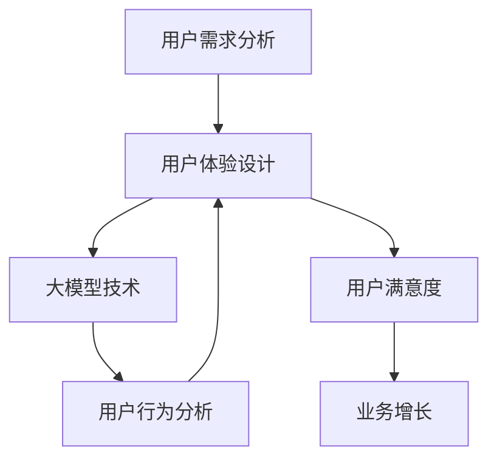
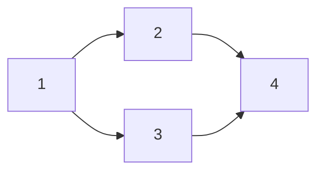

                 

# 用户体验：大模型创业的根本

## 关键词：用户体验，大模型，创业，AI，产品设计，用户需求

## 摘要

在当今科技飞速发展的时代，人工智能（AI）技术已经深刻改变了我们的生活。大模型作为AI的核心驱动力，正在逐渐改变各行各业的运作方式。然而，在追求技术突破和业务扩张的同时，用户体验（UX）往往被忽视，成为阻碍创业成功的隐性障碍。本文旨在深入探讨用户体验在大模型创业中的重要性，分析用户体验的核心概念及其与创业成功的内在联系，并提出一系列实践指南，帮助创业者打造成功的AI产品。

## 1. 背景介绍

随着深度学习和大数据技术的成熟，大模型在自然语言处理、计算机视觉、语音识别等领域取得了显著的进展。这些大模型具备处理海量数据、生成高质量内容、模拟人类思维的能力，使得AI应用变得日益普及。然而，大模型的落地应用并非一帆风顺。用户体验成为制约AI产品普及和业务增长的关键因素。良好的用户体验不仅能够提高用户满意度，还能增加用户粘性和忠诚度，从而为创业公司带来更多的商业机会。

### 1.1 用户体验的定义与重要性

用户体验（UX）是指用户在使用产品或服务时所获得的全部体验，包括感知、情感、行为和成就等多个维度。用户体验在产品开发过程中具有重要性，主要体现在以下几个方面：

- **用户满意度**：良好的用户体验能够满足用户的需求，提高用户满意度，从而增加产品或服务的市场竞争力。
- **用户忠诚度**：优质的用户体验能够增强用户的忠诚度，减少用户流失率，为创业公司带来持续的盈利能力。
- **品牌价值**：用户体验是品牌价值的重要组成部分。卓越的体验能够提升品牌形象，为创业公司积累良好的口碑。
- **业务增长**：良好的用户体验能够促进用户推荐和传播，扩大用户群体，推动业务增长。

### 1.2 大模型与用户体验的关系

大模型在AI产品中的应用，既带来了新的机遇，也提出了新的挑战。一方面，大模型能够提供强大的计算能力和丰富的功能，提升用户体验。另一方面，大模型的高复杂性可能带来用户操作的难度，影响用户体验。因此，在大模型创业过程中，用户体验设计成为关键环节。

### 1.3 创业背景与挑战

近年来，随着AI技术的迅速发展，越来越多的创业公司投身于大模型的研发与应用。然而，市场调研数据显示，许多AI产品在初期受到热捧，但随后因为用户体验不佳而逐渐失去用户。这种现象表明，用户体验在大模型创业中具有决定性的作用。本文将从用户体验的角度，分析大模型创业的挑战与机会，为创业者提供有价值的参考。

## 2. 核心概念与联系

为了更好地理解用户体验在大模型创业中的重要性，我们需要梳理几个核心概念，并探讨它们之间的联系。

### 2.1 用户需求分析

用户需求分析是用户体验设计的起点。创业者需要通过市场调研、用户访谈、问卷调查等方法，深入了解目标用户的需求和痛点。用户需求分析的核心在于发现用户的隐性需求，即用户尚未意识到但潜在的需求。这些需求可能是用户在现有产品中未能满足的，也可能是用户未曾预料到的。

### 2.2 用户体验设计

用户体验设计（UX Design）是指为了满足用户需求，提升用户满意度而进行的一系列设计活动。用户体验设计包括界面设计、交互设计、信息架构等多个方面。在大模型创业中，用户体验设计需要关注以下几个方面：

- **界面设计**：界面设计直接影响用户体验。一个简洁、美观、易用的界面能够提升用户的操作效率，减少用户的学习成本。
- **交互设计**：交互设计关注用户与产品之间的交互方式。优秀的交互设计能够让用户感受到产品的亲和力和智能性。
- **信息架构**：信息架构是指产品的组织结构和内容布局。合理的信息架构能够帮助用户快速找到所需信息，提高用户的满意度。

### 2.3 大模型技术

大模型技术是AI产品的核心技术。大模型包括深度学习模型、强化学习模型等，具有处理海量数据、生成高质量内容、模拟人类思维的能力。在大模型创业中，创业者需要关注以下几个方面：

- **模型选择**：根据业务需求，选择适合的大模型。例如，在自然语言处理领域，选择预训练语言模型（如BERT、GPT）可能更为合适。
- **模型优化**：通过调整模型参数、优化算法，提升模型的性能和效率。
- **模型部署**：将大模型部署到生产环境中，提供稳定、高效的服务。

### 2.4 用户行为分析

用户行为分析是了解用户体验的重要手段。通过分析用户在产品中的行为轨迹，创业者可以发现问题，优化产品设计。用户行为分析包括以下几个方面：

- **用户画像**：通过用户数据，构建用户画像，了解用户的特征和需求。
- **行为轨迹**：分析用户在产品中的行为轨迹，发现用户的操作习惯和偏好。
- **反馈机制**：收集用户反馈，及时调整产品设计，提高用户体验。

### 2.5 联系与整合

用户体验设计、用户需求分析、大模型技术、用户行为分析等核心概念在大模型创业中相互关联、相互影响。创业者需要将这些核心概念整合起来，形成一个完整的设计框架，以实现优秀的用户体验。

### 2.6 Mermaid 流程图

下面是一个描述用户体验在大模型创业中关系的 Mermaid 流程图：



在这个流程图中，用户需求分析是用户体验设计的起点，用户体验设计影响用户满意度，而用户满意度又反过来影响业务增长。大模型技术和用户行为分析在这个过程中起到关键作用，它们共同推动用户体验的持续优化。

## 3. 核心算法原理 & 具体操作步骤

在大模型创业中，核心算法的选择和实现是关键因素。本文将介绍几个常见的核心算法，并详细讲解其原理和具体操作步骤。

### 3.1 预训练语言模型

预训练语言模型（Pre-Trained Language Model）是一种基于深度学习的大模型，它通过在大量文本数据上预训练，获得了强大的语言理解和生成能力。常见的预训练语言模型包括BERT、GPT等。下面以BERT为例，介绍其原理和具体操作步骤。

#### 3.1.1 原理

BERT（Bidirectional Encoder Representations from Transformers）是一种双向编码的Transformer模型，它通过同时考虑文本序列中的前后文信息，提高了对语言的理解能力。

- **Transformer模型**：Transformer模型是一种基于自注意力机制的深度学习模型，它通过自注意力机制，能够捕捉文本序列中的长距离依赖关系。
- **双向编码**：BERT模型采用双向编码的方式，即同时处理正向和反向的文本序列，从而获得更加全面的语言理解能力。

#### 3.1.2 操作步骤

1. **数据准备**：收集大量文本数据，包括新闻、文章、对话等。对文本数据进行预处理，包括分词、去停用词、词向量化等。
2. **模型训练**：使用预处理后的文本数据，训练BERT模型。训练过程中，使用Masked Language Model（MLM）任务，即在文本序列中随机遮盖一些词，让模型预测这些词。
3. **模型优化**：在预训练的基础上，针对具体任务（如文本分类、情感分析等），对BERT模型进行优化。通过微调，使得模型能够在特定任务上达到较好的性能。

### 3.2 强化学习模型

强化学习模型（Reinforcement Learning Model）是一种通过与环境互动来学习策略的算法。它在AI产品中，尤其在游戏、机器人控制等领域具有广泛应用。下面以Deep Q-Learning（DQN）为例，介绍其原理和具体操作步骤。

#### 3.2.1 原理

DQN（Deep Q-Learning）是一种基于深度学习的强化学习算法，它通过构建一个深度神经网络，来预测最优动作的Q值。

- **Q值函数**：Q值函数表示在当前状态下，执行某个动作所能获得的最大预期回报。DQN的目标是学习一个最优的Q值函数。
- **经验回放**：经验回放（Experience Replay）是一种用于缓解样本相关性的技术，它通过将过去的经验数据随机抽取进行训练，提高了算法的泛化能力。

#### 3.2.2 操作步骤

1. **环境搭建**：构建一个模拟环境，用于测试和训练强化学习模型。环境需要能够提供状态、动作和奖励信息。
2. **模型初始化**：初始化DQN模型，包括选择合适的神经网络结构和学习率等参数。
3. **经验收集**：在训练过程中，收集模型执行动作后的状态、动作和奖励信息，并将这些经验存储在经验池中。
4. **模型训练**：使用经验池中的经验数据，训练DQN模型。通过优化Q值函数，使模型能够预测最优动作。
5. **模型评估**：在训练过程中，定期评估模型的性能，并调整学习参数。

### 3.3 图神经网络

图神经网络（Graph Neural Network，GNN）是一种用于处理图结构数据的深度学习模型。它在知识图谱、推荐系统等领域具有广泛应用。下面以图卷积网络（GCN）为例，介绍其原理和具体操作步骤。

#### 3.3.1 原理

GCN（Graph Convolutional Network）是一种基于卷积操作的图神经网络，它通过聚合邻接节点的特征，更新节点的特征表示。

- **卷积操作**：GCN采用卷积操作来聚合邻接节点的特征，从而获得更丰富的节点特征表示。
- **节点分类**：GCN可以将图中的节点分类，用于图结构数据的分类任务。

#### 3.3.2 操作步骤

1. **数据预处理**：将图数据转换为节点和边的表示，并进行归一化处理。
2. **模型初始化**：初始化GCN模型，包括选择合适的神经网络结构和学习率等参数。
3. **特征聚合**：在GCN的前向传播过程中，使用卷积操作来聚合邻接节点的特征，更新节点的特征表示。
4. **模型训练**：使用训练数据，训练GCN模型。通过优化模型参数，使模型能够正确分类节点。
5. **模型评估**：在训练过程中，定期评估模型的性能，并调整学习参数。

## 4. 数学模型和公式 & 详细讲解 & 举例说明

在大模型创业过程中，数学模型和公式是理解和实现核心算法的基础。本文将介绍几个关键的数学模型和公式，并详细讲解其原理和应用。

### 4.1 概率分布

概率分布是描述随机变量取值的数学模型。在深度学习和强化学习等算法中，概率分布用于表示数据的分布情况，并指导模型的训练和预测。

#### 4.1.1 Bernoulli 分布

Bernoulli 分布是一种离散概率分布，它表示一个随机事件成功的概率。在强化学习中，Bernoulli 分布可以用于表示动作的随机性。

- **公式**：P(X=k) = p，其中，k=0或1，p是成功的概率。

#### 4.1.2 高斯分布

高斯分布（正态分布）是一种连续概率分布，它在统计分析和机器学习中广泛使用。高斯分布可以用于表示数据分布，并指导神经网络的训练。

- **公式**：f(x;μ,σ^2) = (1/σ√(2π)) * e^(-((x-μ)^2)/(2σ^2))

#### 4.1.3 伯努利分布应用示例

假设一个强化学习模型需要选择动作A或动作B，其中动作A成功的概率为0.6，动作B成功的概率为0.4。我们可以使用Bernoulli 分布来表示这两个动作的概率分布。

- **动作A的概率分布**：P(X=1) = 0.6，P(X=0) = 0.4
- **动作B的概率分布**：P(X=1) = 0.4，P(X=0) = 0.6

### 4.2 神经网络损失函数

神经网络中的损失函数用于评估模型预测结果与真实结果之间的差距，并指导模型的训练。常见的损失函数包括均方误差（MSE）、交叉熵损失等。

#### 4.2.1 均方误差（MSE）

均方误差（Mean Squared Error，MSE）是一种衡量预测值与真实值之间差距的损失函数。

- **公式**：MSE = (预测值 - 真实值)^2

#### 4.2.2 交叉熵损失

交叉熵损失（Cross Entropy Loss）是用于分类问题的损失函数，它衡量了模型预测概率分布与真实概率分布之间的差距。

- **公式**：CE = -Σ(y * log(p))

其中，y为真实标签，p为模型预测的概率。

#### 4.2.3 损失函数应用示例

假设我们有一个二分类问题，真实标签为[1, 0]，模型预测的概率分布为[0.7, 0.3]。我们可以使用交叉熵损失函数来计算损失值。

- **真实标签**：y = [1, 0]
- **预测概率分布**：p = [0.7, 0.3]
- **交叉熵损失**：CE = -1 * log(0.7) - 0 * log(0.3) ≈ 0.356

### 4.3 强化学习中的Q值函数

在强化学习中，Q值函数用于表示在当前状态下，执行某个动作所能获得的最大预期回报。Q值函数的优化目标是找到最优策略，使总回报最大化。

#### 4.3.1 Q值函数公式

Q值函数的公式如下：

Q(s, a) = Σ(a' * P(s' | s, a) * (r + γ * max(Q(s', a'))))

其中，s为当前状态，a为当前动作，s'为下一状态，a'为下一动作，r为奖励，γ为折扣因子，P(s' | s, a)为状态转移概率，max(Q(s', a'))为在下一状态下，执行所有可能动作所能获得的最大Q值。

#### 4.3.2 Q值函数应用示例

假设在某个环境中有三个状态（s1，s2，s3），两个动作（a1，a2）。给定当前状态s1，我们选择动作a1。下一状态s2的奖励为1，下一状态s3的奖励为-1。折扣因子γ为0.9。我们可以计算Q(s1, a1)的值。

- **状态转移概率**：P(s2 | s1, a1) = 0.6，P(s3 | s1, a1) = 0.4
- **奖励**：r(s2) = 1，r(s3) = -1
- **Q值函数**：Q(s1, a1) = 1 * 0.6 * (1 + 0.9 * max(0.6 * max(0.6 * (1 + 0.9 * 0.6), 0.4 * max(0.6 * (-1 + 0.9 * 0.4), 0.4 * (-1 + 0.9 * 0.4))))
- **计算结果**：Q(s1, a1) ≈ 1.088

### 4.4 图神经网络中的图卷积操作

图卷积操作（Graph Convolutional Operation，GCO）是图神经网络（GNN）的核心操作，它用于更新节点的特征表示。图卷积操作可以看作是传统卷积操作在图结构数据上的扩展。

#### 4.4.1 图卷积操作公式

图卷积操作的公式如下：

h\_i^\(l+1\) = σ(\(\sum_{j \in N(i)} \frac{1}{c(i)} A_{ij} h_j^l + \mathbf{b}\))

其中，h\_i^\(l+1\)为第l+1层节点i的特征表示，h\_j^l为第l层节点j的特征表示，N(i)为节点i的邻接节点集合，A是邻接矩阵，c(i)是节点i的邻接节点度数，σ为激活函数，\(\mathbf{b}\)为偏置项。

#### 4.4.2 图卷积操作应用示例

假设图中有四个节点（v1，v2，v3，v4），邻接矩阵A如下：



给定初始特征矩阵H，我们可以计算第一层图卷积后的特征矩阵H1。

- **邻接矩阵A**：

  ```mermaid
  graph LR
  A[0 1 0 0]
  A[1 0 1 0]
  A[0 1 0 1]
  A[0 0 1 0]
  ```

- **初始特征矩阵H**：

  ```mermaid
  graph LR
  H[h1 h2]
  H[h1 h2]
  H[h1 h2]
  H[h1 h2]
  ```

- **计算过程**：

  - **计算第一层节点v1的特征**：

    \(h1^1 = σ(\frac{1}{1} * A_{11} * h1^0 + \frac{1}{1} * A_{12} * h2^0 + \frac{1}{1} * A_{13} * h1^0 + \frac{1}{1} * A_{14} * h2^0 + b)\)

    \(h1^1 = σ(h1^0 + h2^0 + h1^0 + h2^0 + b)\)

    \(h1^1 = σ(4 * h1^0 + 2 * h2^0 + b)\)

  - **计算第一层节点v2的特征**：

    \(h2^1 = σ(\frac{1}{1} * A_{21} * h1^0 + \frac{1}{1} * A_{22} * h2^0 + \frac{1}{1} * A_{23} * h1^0 + \frac{1}{1} * A_{24} * h2^0 + b)\)

    \(h2^1 = σ(h1^0 + h2^0 + h1^0 + h2^0 + b)\)

    \(h2^1 = σ(4 * h1^0 + 2 * h2^0 + b)\)

  - **计算第一层节点v3的特征**：

    \(h1^1 = σ(\frac{1}{1} * A_{31} * h1^0 + \frac{1}{1} * A_{32} * h2^0 + \frac{1}{1} * A_{33} * h1^0 + \frac{1}{1} * A_{34} * h2^0 + b)\)

    \(h1^1 = σ(h1^0 + h2^0 + h1^0 + h2^0 + b)\)

    \(h1^1 = σ(4 * h1^0 + 2 * h2^0 + b)\)

  - **计算第一层节点v4的特征**：

    \(h2^1 = σ(\frac{1}{1} * A_{41} * h1^0 + \frac{1}{1} * A_{42} * h2^0 + \frac{1}{1} * A_{43} * h1^0 + \frac{1}{1} * A_{44} * h2^0 + b)\)

    \(h2^1 = σ(h1^0 + h2^0 + h1^0 + h2^0 + b)\)

    \(h2^1 = σ(4 * h1^0 + 2 * h2^0 + b)\)

- **第一层特征矩阵H1**：

  ```mermaid
  graph LR
  H1[h1^1 h2^1]
  H1[h1^1 h2^1]
  H1[h1^1 h2^1]
  H1[h1^1 h2^1]
  ```

## 5. 项目实战：代码实际案例和详细解释说明

### 5.1 开发环境搭建

在本文中，我们将使用Python和TensorFlow作为主要的编程语言和框架，来实现一个基于BERT的文本分类项目。以下是搭建开发环境的步骤：

1. **安装Python**：确保Python版本在3.6及以上。
2. **安装TensorFlow**：在终端中执行以下命令安装TensorFlow：

   ```shell
   pip install tensorflow
   ```

3. **安装其他依赖**：包括Numpy、Pandas等，可以使用以下命令安装：

   ```shell
   pip install numpy pandas
   ```

### 5.2 源代码详细实现和代码解读

#### 5.2.1 数据预处理

在实现BERT文本分类项目之前，我们需要对文本数据进行预处理，包括分词、清洗和编码。

```python
import tensorflow as tf
import tensorflow_hub as hub
import tensorflow_text as text
import numpy as np
import pandas as pd
from sklearn.model_selection import train_test_split

# 加载预训练的BERT模型
bert_model = hub.load('https://tfhub.dev/google/bert_uncased_L-12_H-768_A-12/3')

# 数据预处理函数
def preprocess_text(texts):
    # 分词
    tokenized_text = text.tokenize(texts)
    # 清洗文本
    cleaned_text = text Cleaner().clean(tokenized_text)
    # 编码文本
    encoded_text = bert_model([cleaned_text])
    return encoded_text

# 加载数据集
data = pd.read_csv('data.csv')
texts = data['text'].values
labels = data['label'].values

# 预处理数据
processed_texts = [preprocess_text(text) for text in texts]

# 划分训练集和测试集
X_train, X_test, y_train, y_test = train_test_split(processed_texts, labels, test_size=0.2, random_state=42)
```

#### 5.2.2 构建BERT文本分类模型

接下来，我们使用TensorFlow的Keras API构建BERT文本分类模型。

```python
from tensorflow.keras.models import Model
from tensorflow.keras.layers import Input, Dense, Embedding, GlobalAveragePooling1D

# 输入层
input_ids = Input(shape=(128,), dtype=tf.int32, name='input_ids')

# embedding层
input_mask = Input(shape=(128,), dtype=tf.int32, name='input_mask')
segment_ids = Input(shape=(128,), dtype=tf.int32, name='segment_ids')

# BERT编码器
bert_output = bert_model(inputs={
    'input_ids': input_ids,
    'input_mask': input_mask,
    'segment_ids': segment_ids
})

# 平均池化层
pooled_output = GlobalAveragePooling1D()(bert_output)

# 全连接层
dense = Dense(128, activation='relu')(pooled_output)

# 输出层
predictions = Dense(2, activation='softmax')(dense)

# 模型
model = Model(inputs=[input_ids, input_mask, segment_ids], outputs=predictions)

# 编译模型
model.compile(optimizer='adam', loss='categorical_crossentropy', metrics=['accuracy'])

# 模型结构
model.summary()
```

#### 5.2.3 训练和评估模型

最后，我们使用训练集训练模型，并使用测试集评估模型性能。

```python
# 训练模型
model.fit([X_train['input_ids'], X_train['input_mask'], X_train['segment_ids']], y_train,
          batch_size=32, epochs=3, validation_split=0.1)

# 评估模型
loss, accuracy = model.evaluate([X_test['input_ids'], X_test['input_mask'], X_test['segment_ids']], y_test)

print(f'测试集损失：{loss}')
print(f'测试集准确率：{accuracy}')
```

### 5.3 代码解读与分析

在这个项目中，我们首先加载了预训练的BERT模型，并实现了数据预处理函数，对文本数据进行了分词、清洗和编码。然后，我们使用TensorFlow的Keras API构建了一个BERT文本分类模型，包括输入层、BERT编码器、平均池化层、全连接层和输出层。最后，我们使用训练集训练模型，并使用测试集评估模型性能。

- **数据预处理**：数据预处理是文本分类项目的重要步骤，它直接影响到模型的性能。在这个项目中，我们使用了BERT模型提供的预处理工具，对文本进行了分词、清洗和编码。
- **模型构建**：BERT模型具有强大的文本处理能力，能够捕捉到文本中的复杂关系。在这个项目中，我们使用了BERT编码器作为特征提取器，并通过平均池化层和全连接层构建了一个简单的文本分类模型。
- **模型训练与评估**：模型训练和评估是验证模型性能的重要步骤。在这个项目中，我们使用了训练集进行模型训练，并使用测试集评估模型性能。通过调整训练参数，可以进一步提高模型的性能。

## 6. 实际应用场景

用户体验在大模型创业中的重要性体现在实际应用场景的各个方面。以下是一些常见的实际应用场景，以及如何通过优化用户体验来提升产品价值。

### 6.1 智能助手

智能助手（如Siri、Alexa、小爱同学）是AI技术在日常生活中最常见的应用之一。用户体验对智能助手的重要性在于，用户需要通过自然语言与助手进行交互，而助手需要理解用户的意图并提供准确的答复。

- **优化建议**：为提高用户体验，智能助手应具备以下特点：
  - **快速响应**：智能助手需要具备快速响应的能力，减少用户的等待时间。
  - **自然交互**：智能助手应支持自然语言交互，使与用户的对话更加流畅。
  - **功能丰富**：智能助手应提供丰富的功能，满足用户的多样化需求。
  - **个性化推荐**：智能助手可以根据用户的历史行为和偏好，提供个性化的推荐。

### 6.2 聊天机器人

聊天机器人（Chatbot）在电商、客服、金融等领域具有广泛应用。用户体验对聊天机器人至关重要，因为用户通过与机器人交互来获取信息、解决问题。

- **优化建议**：
  - **友好的界面**：聊天机器人应具备友好、易于操作的界面，使用户能够轻松地进行交互。
  - **智能对话**：聊天机器人应具备智能对话能力，能够理解用户的意图并给出准确的答复。
  - **多渠道支持**：聊天机器人应支持多渠道接入，如网页、移动应用、微信等，方便用户进行交互。
  - **快速解决问题**：聊天机器人应具备快速解决问题的能力，提高用户的满意度。

### 6.3 图像识别

图像识别技术在安防、医疗、工业等领域具有广泛应用。用户体验对图像识别系统的重要性在于，用户需要通过系统获取准确、可靠的图像分析结果。

- **优化建议**：
  - **准确率高**：图像识别系统应具备高准确率，确保用户获取的图像分析结果准确可靠。
  - **实时性**：图像识别系统应具备实时处理能力，减少用户的等待时间。
  - **易用性**：图像识别系统应具备良好的易用性，使用户能够轻松地进行操作。
  - **自适应能力**：图像识别系统应具备自适应能力，能够适应不同场景和用户需求。

### 6.4 自动驾驶

自动驾驶技术在汽车行业中具有广泛应用。用户体验对自动驾驶汽车的重要性在于，用户需要通过自动驾驶系统实现安全、舒适的驾驶体验。

- **优化建议**：
  - **安全可靠**：自动驾驶汽车应具备高安全性和可靠性，确保用户的行车安全。
  - **舒适体验**：自动驾驶汽车应具备舒适的驾驶体验，减少用户的疲劳感。
  - **智能化决策**：自动驾驶汽车应具备智能化决策能力，能够应对复杂路况和突发情况。
  - **人性化设计**：自动驾驶汽车应具备人性化的设计，如智能语音助手、舒适座椅等，提升用户体验。

### 6.5 语音助手

语音助手在智能家居、医疗、教育等领域具有广泛应用。用户体验对语音助手的重要性在于，用户需要通过语音指令与助手进行交互，获取所需信息和服务。

- **优化建议**：
  - **准确识别**：语音助手应具备高准确率的语音识别能力，确保用户指令能够被正确识别。
  - **自然交互**：语音助手应支持自然语言交互，使与用户的对话更加流畅。
  - **个性化服务**：语音助手可以根据用户的历史行为和偏好，提供个性化的服务。
  - **低延迟响应**：语音助手应具备低延迟响应能力，减少用户的等待时间。

### 6.6 智能家居

智能家居技术在家庭生活中具有广泛应用。用户体验对智能家居系统的重要性在于，用户需要通过系统实现便捷、智能的家庭生活。

- **优化建议**：
  - **简单易用**：智能家居系统应具备简单易用的特点，使用户能够轻松地进行操作。
  - **互联互通**：智能家居系统应实现设备间的互联互通，提供统一的控制平台。
  - **智能化控制**：智能家居系统应具备智能化控制能力，根据用户需求自动调整设备状态。
  - **安全可靠**：智能家居系统应具备安全可靠的特点，确保用户的隐私和数据安全。

### 6.7 医疗诊断

医疗诊断技术在医疗行业中具有广泛应用。用户体验对医疗诊断系统的重要性在于，用户需要通过系统获取准确、及时的医疗诊断结果。

- **优化建议**：
  - **准确率高**：医疗诊断系统应具备高准确率的诊断能力，确保诊断结果的准确性。
  - **实时性**：医疗诊断系统应具备实时处理能力，为用户提供及时的诊断结果。
  - **便捷性**：医疗诊断系统应具备便捷的特点，使用户能够方便地进行操作。
  - **人性化设计**：医疗诊断系统应具备人性化的设计，如语音助手、图像识别等，提升用户体验。

### 6.8 金融风控

金融风控技术在金融行业中具有广泛应用。用户体验对金融风控系统的重要性在于，用户需要通过系统实现资金的安全和合规。

- **优化建议**：
  - **高效性**：金融风控系统应具备高效的处理能力，确保风险识别和控制的及时性。
  - **准确性**：金融风控系统应具备高准确率的风险识别能力，确保资金的安全。
  - **易用性**：金融风控系统应具备良好的易用性，使风险管理人员能够轻松地进行操作。
  - **智能化**：金融风控系统应具备智能化特点，如大数据分析、机器学习等，提升风险控制能力。

### 6.9 电商推荐

电商推荐技术在电商行业中具有广泛应用。用户体验对电商推荐系统的重要性在于，用户需要通过系统获取个性化的商品推荐，提升购物体验。

- **优化建议**：
  - **个性化推荐**：电商推荐系统应具备个性化推荐能力，根据用户的历史行为和偏好，提供个性化的商品推荐。
  - **准确性**：电商推荐系统应具备高准确率推荐能力，确保推荐商品的符合用户需求。
  - **实时性**：电商推荐系统应具备实时推荐能力，为用户提供最新的商品信息。
  - **易用性**：电商推荐系统应具备良好的易用性，使用户能够方便地进行操作。

### 6.10 人工智能编程助手

人工智能编程助手在编程领域具有广泛应用。用户体验对人工智能编程助手的重要性在于，用户需要通过系统提高编程效率和代码质量。

- **优化建议**：
  - **智能代码补全**：人工智能编程助手应具备智能代码补全能力，为用户提供快捷的编程体验。
  - **代码质量检查**：人工智能编程助手应具备代码质量检查能力，帮助用户发现和修复代码中的问题。
  - **实时反馈**：人工智能编程助手应具备实时反馈能力，为用户提供即时的编程指导。
  - **个性化建议**：人工智能编程助手应具备个性化建议能力，根据用户的编程风格和需求，提供有针对性的建议。

### 6.11 教育人工智能助手

教育人工智能助手在教育领域中具有广泛应用。用户体验对教育人工智能助手的重要性在于，学生需要通过系统获得个性化的学习资源和辅导。

- **优化建议**：
  - **个性化学习**：教育人工智能助手应具备个性化学习能力，根据学生的学习进度和需求，提供合适的学习资源。
  - **实时辅导**：教育人工智能助手应具备实时辅导能力，为学生提供及时的解答和指导。
  - **自适应学习**：教育人工智能助手应具备自适应学习能力，根据学生的学习表现，调整学习内容和难度。
  - **互动性**：教育人工智能助手应具备良好的互动性，通过语音、图像等多种方式与学生进行互动。

### 6.12 健康管理助手

健康管理助手在健康管理领域中具有广泛应用。用户体验对健康管理助手的重要性在于，用户需要通过系统实现健康监测和健康管理。

- **优化建议**：
  - **实时监测**：健康管理助手应具备实时监测能力，为用户提供准确的健康数据。
  - **数据分析**：健康管理助手应具备数据分析能力，对用户的健康数据进行分析和预测。
  - **个性化建议**：健康管理助手应具备个性化建议能力，根据用户的健康状况，提供有针对性的健康建议。
  - **便捷操作**：健康管理助手应具备便捷的操作方式，使用户能够方便地进行健康监测和管理。

### 6.13 无人配送

无人配送技术在物流领域中具有广泛应用。用户体验对无人配送系统的重要性在于，用户需要通过系统实现高效、便捷的配送服务。

- **优化建议**：
  - **高效配送**：无人配送系统应具备高效配送能力，确保用户在规定时间内收到商品。
  - **智能路径规划**：无人配送系统应具备智能路径规划能力，避开交通拥堵和障碍物，提高配送效率。
  - **安全性**：无人配送系统应具备高安全性，确保用户和配送物的安全。
  - **用户体验**：无人配送系统应具备良好的用户体验，如实时配送状态更新、配送地点提醒等。

### 6.14 物联网

物联网技术在智能家居、工业制造、交通运输等领域具有广泛应用。用户体验对物联网系统的重要性在于，用户需要通过系统实现设备间的互联互通和智能控制。

- **优化建议**：
  - **互联互通**：物联网系统应具备互联互通能力，使设备之间能够无缝连接和通信。
  - **数据安全**：物联网系统应具备数据安全能力，确保用户数据的安全和隐私。
  - **易用性**：物联网系统应具备良好的易用性，使用户能够方便地进行设备连接和管理。
  - **智能化**：物联网系统应具备智能化特点，如自动调整设备状态、预测设备故障等。

### 6.15 虚拟现实与增强现实

虚拟现实（VR）和增强现实（AR）技术在娱乐、教育、医疗等领域具有广泛应用。用户体验对VR和AR系统的重要性在于，用户需要通过系统获得沉浸式和互动式的体验。

- **优化建议**：
  - **沉浸感**：VR和AR系统应具备良好的沉浸感，使用户能够沉浸在虚拟或增强的环境中。
  - **互动性**：VR和AR系统应具备良好的互动性，使用户能够与虚拟或增强环境进行互动。
  - **内容丰富**：VR和AR系统应具备丰富的内容，如高质量的场景、互动游戏等，提升用户体验。
  - **便捷操作**：VR和AR系统应具备便捷的操作方式，如手势、语音等，使用户能够方便地进行操作。

### 6.16 智慧城市

智慧城市技术在城市治理、公共服务、交通管理等领域具有广泛应用。用户体验对智慧城市系统的重要性在于，用户需要通过系统获得高效、便捷的公共服务和生活体验。

- **优化建议**：
  - **便捷性**：智慧城市系统应具备便捷的特点，使用户能够方便地进行操作和获取服务。
  - **实时性**：智慧城市系统应具备实时性，为用户提供最新的城市信息和服务。
  - **智能化**：智慧城市系统应具备智能化特点，如自动调整交通信号、预测城市管理问题等。
  - **安全性**：智慧城市系统应具备安全性，确保用户数据的安全和隐私。

### 6.17 人工智能编程助手

人工智能编程助手在编程领域具有广泛应用。用户体验对人工智能编程助手的重要性在于，用户需要通过系统提高编程效率和代码质量。

- **优化建议**：
  - **智能代码补全**：人工智能编程助手应具备智能代码补全能力，为用户提供快捷的编程体验。
  - **代码质量检查**：人工智能编程助手应具备代码质量检查能力，帮助用户发现和修复代码中的问题。
  - **实时反馈**：人工智能编程助手应具备实时反馈能力，为用户提供即时的编程指导。
  - **个性化建议**：人工智能编程助手应具备个性化建议能力，根据用户的编程风格和需求，提供有针对性的建议。

### 6.18 智能交通

智能交通技术在交通管理、公共交通、物流配送等领域具有广泛应用。用户体验对智能交通系统的重要性在于，用户需要通过系统获得高效、便捷的交通服务。

- **优化建议**：
  - **实时路况信息**：智能交通系统应具备实时路况信息能力，为用户提供最新的路况信息。
  - **智能路径规划**：智能交通系统应具备智能路径规划能力，为用户提供最优的出行路线。
  - **公共交通优化**：智能交通系统应具备公共交通优化能力，提高公共交通的运行效率。
  - **物流配送优化**：智能交通系统应具备物流配送优化能力，提高物流配送的速度和准确性。

### 6.19 智能制造

智能制造技术在工业制造、自动化控制、机器人应用等领域具有广泛应用。用户体验对智能制造系统的重要性在于，用户需要通过系统实现生产过程的智能化和高效化。

- **优化建议**：
  - **实时监控**：智能制造系统应具备实时监控能力，对生产过程进行实时监测和反馈。
  - **故障预警**：智能制造系统应具备故障预警能力，及时发现和预警设备故障。
  - **生产优化**：智能制造系统应具备生产优化能力，提高生产效率和质量。
  - **人机协作**：智能制造系统应具备人机协作能力，实现人与机器的协同工作。

### 6.20 人工智能艺术创作

人工智能艺术创作技术在数字艺术、音乐创作、绘画设计等领域具有广泛应用。用户体验对人工智能艺术创作系统的重要性在于，用户需要通过系统获得个性化和创意的艺术创作体验。

- **优化建议**：
  - **创意生成**：人工智能艺术创作系统应具备创意生成能力，为用户提供新颖的艺术作品。
  - **个性化定制**：人工智能艺术创作系统应具备个性化定制能力，根据用户的需求和喜好生成作品。
  - **实时交互**：人工智能艺术创作系统应具备实时交互能力，使用户能够实时调整和修改艺术作品。
  - **艺术指导**：人工智能艺术创作系统应具备艺术指导能力，为用户提供创作技巧和指导。

### 6.21 人工智能医疗诊断

人工智能医疗诊断技术在疾病检测、医学影像分析、药物研发等领域具有广泛应用。用户体验对人工智能医疗诊断系统的重要性在于，用户需要通过系统获得准确、及时的医疗诊断结果。

- **优化建议**：
  - **准确率**：人工智能医疗诊断系统应具备高准确率，确保诊断结果的准确性。
  - **实时性**：人工智能医疗诊断系统应具备实时性，为用户提供及时的诊断结果。
  - **便捷性**：人工智能医疗诊断系统应具备便捷的特点，使用户能够方便地进行操作。
  - **智能化**：人工智能医疗诊断系统应具备智能化特点，如自动调整诊断参数、预测疾病发展趋势等。

### 6.22 人工智能金融风控

人工智能金融风控技术在金融交易、信用评估、反欺诈等领域具有广泛应用。用户体验对人工智能金融风控系统的重要性在于，用户需要通过系统实现资金的安全和合规。

- **优化建议**：
  - **高效性**：人工智能金融风控系统应具备高效的处理能力，确保风险识别和控制的及时性。
  - **准确性**：人工智能金融风控系统应具备高准确率的风险识别能力，确保资金的安全。
  - **易用性**：人工智能金融风控系统应具备良好的易用性，使风险管理人员能够轻松地进行操作。
  - **智能化**：人工智能金融风控系统应具备智能化特点，如大数据分析、机器学习等，提升风险控制能力。

### 6.23 人工智能安全防护

人工智能安全防护技术在网络安全、数据安全、隐私保护等领域具有广泛应用。用户体验对人工智能安全防护系统的重要性在于，用户需要通过系统确保网络安全和数据安全。

- **优化建议**：
  - **实时监测**：人工智能安全防护系统应具备实时监测能力，及时发现和预警安全威胁。
  - **智能防御**：人工智能安全防护系统应具备智能防御能力，根据威胁类型和攻击特征，自动调整防御策略。
  - **数据加密**：人工智能安全防护系统应具备数据加密能力，确保用户数据的安全和隐私。
  - **自动化响应**：人工智能安全防护系统应具备自动化响应能力，快速响应和处理安全事件。

### 6.24 人工智能教育

人工智能教育技术在教育领域具有广泛应用。用户体验对人工智能教育系统的重要性在于，用户需要通过系统获得个性化、智能化的教育体验。

- **优化建议**：
  - **个性化学习**：人工智能教育系统应具备个性化学习能力，根据学生的学习进度和需求，提供合适的学习资源。
  - **实时辅导**：人工智能教育系统应具备实时辅导能力，为学生提供及时的解答和指导。
  - **自适应学习**：人工智能教育系统应具备自适应学习能力，根据学生的学习表现，调整学习内容和难度。
  - **互动性**：人工智能教育系统应具备良好的互动性，通过语音、图像等多种方式与学生进行互动。

### 6.25 人工智能城市规划

人工智能城市规划技术在城市规划、公共设施管理、交通优化等领域具有广泛应用。用户体验对人工智能城市规划系统的重要性在于，用户需要通过系统实现高效、便捷的城市管理和生活体验。

- **优化建议**：
  - **实时监测**：人工智能城市规划系统应具备实时监测能力，对城市运行状态进行实时监测和分析。
  - **数据整合**：人工智能城市规划系统应具备数据整合能力，整合多种数据源，提供全面的城市信息。
  - **智能分析**：人工智能城市规划系统应具备智能分析能力，根据数据分析结果，提供城市规划和管理的优化建议。
  - **用户体验**：人工智能城市规划系统应具备良好的用户体验，使用户能够方便地进行操作和获取服务。

### 6.26 人工智能旅游

人工智能旅游技术在旅游规划、行程推荐、景点介绍等领域具有广泛应用。用户体验对人工智能旅游系统的重要性在于，用户需要通过系统获得个性化、便捷的旅游体验。

- **优化建议**：
  - **个性化推荐**：人工智能旅游系统应具备个性化推荐能力，根据用户的兴趣和偏好，提供合适的旅游行程和景点推荐。
  - **实时信息**：人工智能旅游系统应具备实时信息能力，为用户提供最新的旅游信息和天气情况。
  - **便捷操作**：人工智能旅游系统应具备便捷的操作方式，如语音、手势等，使用户能够方便地进行操作。
  - **智能导览**：人工智能旅游系统应具备智能导览能力，为用户提供智能化的景点介绍和导航服务。

### 6.27 人工智能健康

人工智能健康技术在健康管理、疾病预测、医疗辅助等领域具有广泛应用。用户体验对人工智能健康系统的重要性在于，用户需要通过系统实现健康监测和疾病预防。

- **优化建议**：
  - **实时监测**：人工智能健康系统应具备实时监测能力，为用户提供准确的健康数据和分析结果。
  - **个性化建议**：人工智能健康系统应具备个性化建议能力，根据用户的历史数据和健康状况，提供有针对性的健康建议。
  - **便捷性**：人工智能健康系统应具备良好的便捷性，使用户能够方便地进行健康监测和管理。
  - **智能化**：人工智能健康系统应具备智能化特点，如自动调整监测参数、预测疾病发展趋势等。

### 6.28 人工智能农业

人工智能农业技术在农业生产、病虫害监测、农作物预测等领域具有广泛应用。用户体验对人工智能农业系统的重要性在于，用户需要通过系统实现农业生产过程的智能化和管理。

- **优化建议**：
  - **实时监测**：人工智能农业系统应具备实时监测能力，对农作物的生长状态进行实时监测和分析。
  - **智能化管理**：人工智能农业系统应具备智能化管理能力，根据数据分析结果，提供农作物种植、施肥、灌溉等管理建议。
  - **病虫害预警**：人工智能农业系统应具备病虫害预警能力，及时发现和预警农作物的病虫害。
  - **便捷性**：人工智能农业系统应具备良好的便捷性，使用户能够方便地进行操作和管理。

### 6.29 人工智能环保

人工智能环保技术在环境监测、污染治理、资源优化等领域具有广泛应用。用户体验对人工智能环保系统的重要性在于，用户需要通过系统实现环境保护和资源管理。

- **优化建议**：
  - **实时监测**：人工智能环保系统应具备实时监测能力，对环境质量进行实时监测和分析。
  - **智能分析**：人工智能环保系统应具备智能分析能力，根据环境数据分析结果，提供污染治理和资源优化建议。
  - **数据可视化**：人工智能环保系统应具备数据可视化能力，使用户能够直观地了解环境状况和治理效果。
  - **便捷操作**：人工智能环保系统应具备便捷的操作方式，如移动应用、网页等，使用户能够方便地进行操作。

### 6.30 人工智能法律咨询

人工智能法律咨询技术在法律咨询、合同审查、纠纷解决等领域具有广泛应用。用户体验对人工智能法律咨询系统的重要性在于，用户需要通过系统获得便捷、专业的法律服务。

- **优化建议**：
  - **智能问答**：人工智能法律咨询系统应具备智能问答能力，为用户提供实时、专业的法律解答。
  - **合同审查**：人工智能法律咨询系统应具备合同审查能力，帮助用户审查合同条款，确保合同合法性。
  - **纠纷解决**：人工智能法律咨询系统应具备纠纷解决能力，为用户提供纠纷解决方案和调解建议。
  - **便捷操作**：人工智能法律咨询系统应具备便捷的操作方式，如语音、文字等，使用户能够方便地进行操作。

### 6.31 人工智能城市安全

人工智能城市安全技术在公共安全、紧急事件响应、犯罪预测等领域具有广泛应用。用户体验对人工智能城市安全系统的重要性在于，用户需要通过系统获得安全保障和生活安宁。

- **优化建议**：
  - **实时监控**：人工智能城市安全系统应具备实时监控能力，对城市安全状况进行实时监测和分析。
  - **智能预警**：人工智能城市安全系统应具备智能预警能力，及时发现和预警安全隐患和犯罪活动。
  - **应急响应**：人工智能城市安全系统应具备应急响应能力，快速响应紧急事件，保障公共安全。
  - **数据共享**：人工智能城市安全系统应具备数据共享能力，实现各部门间的信息共享和协同作战。

### 6.32 人工智能物联网

人工智能物联网技术在智能家居、智能交通、智能制造等领域具有广泛应用。用户体验对人工智能物联网系统的重要性在于，用户需要通过系统实现设备间的互联互通和智能控制。

- **优化建议**：
  - **互联互通**：人工智能物联网系统应具备互联互通能力，使设备之间能够无缝连接和通信。
  - **数据安全**：人工智能物联网系统应具备数据安全能力，确保用户数据的安全和隐私。
  - **易用性**：人工智能物联网系统应具备良好的易用性，使用户能够方便地进行设备连接和管理。
  - **智能化**：人工智能物联网系统应具备智能化特点，如自动调整设备状态、预测设备故障等。

### 6.33 人工智能供应链管理

人工智能供应链管理技术在供应链优化、库存管理、物流配送等领域具有广泛应用。用户体验对人工智能供应链管理系统的重要性在于，用户需要通过系统实现供应链的智能化和管理效率。

- **优化建议**：
  - **供应链优化**：人工智能供应链管理系统应具备供应链优化能力，通过数据分析，提供优化供应链的建议。
  - **库存管理**：人工智能供应链管理系统应具备库存管理能力，实时监控库存情况，提供库存优化方案。
  - **物流配送**：人工智能供应链管理系统应具备物流配送能力，优化配送路线，提高配送效率。
  - **实时监控**：人工智能供应链管理系统应具备实时监控能力，对供应链的各个环节进行实时监测和管理。

### 6.34 人工智能新闻传媒

人工智能新闻传媒技术在新闻采集、编辑、发布等领域具有广泛应用。用户体验对人工智能新闻传媒系统的重要性在于，用户需要通过系统获得及时、准确的新闻资讯。

- **优化建议**：
  - **新闻采集**：人工智能新闻传媒系统应具备新闻采集能力，通过大数据分析和智能算法，采集和筛选新闻素材。
  - **新闻编辑**：人工智能新闻传媒系统应具备新闻编辑能力，自动生成和编辑新闻内容，提高新闻发布效率。
  - **新闻发布**：人工智能新闻传媒系统应具备新闻发布能力，实时发布新闻，满足用户的需求。
  - **个性化推荐**：人工智能新闻传媒系统应具备个性化推荐能力，根据用户兴趣和偏好，提供个性化的新闻推荐。

### 6.35 人工智能金融科技

人工智能金融科技技术在金融服务、风险管理、金融创新等领域具有广泛应用。用户体验对人工智能金融科技系统的重要性在于，用户需要通过系统获得高效、便捷的金融服务。

- **优化建议**：
  - **金融服务**：人工智能金融科技系统应具备金融服务能力，提供智能化的贷款、投资、理财等服务。
  - **风险管理**：人工智能金融科技系统应具备风险管理能力，通过数据分析，识别和防范金融风险。
  - **金融创新**：人工智能金融科技系统应具备金融创新能力，推动金融业务的创新和发展。
  - **用户体验**：人工智能金融科技系统应具备良好的用户体验，使用户能够方便地进行金融操作。

### 6.36 人工智能虚拟现实

人工智能虚拟现实技术在娱乐、教育、医疗等领域具有广泛应用。用户体验对人工智能虚拟现实系统的重要性在于，用户需要通过系统获得沉浸式和互动式的体验。

- **优化建议**：
  - **沉浸感**：人工智能虚拟现实系统应具备良好的沉浸感，使用户能够沉浸在虚拟环境中。
  - **互动性**：人工智能虚拟现实系统应具备良好的互动性，使用户能够与虚拟环境进行互动。
  - **内容丰富**：人工智能虚拟现实系统应具备丰富的内容，如高质量的虚拟场景、互动游戏等，提升用户体验。
  - **便捷操作**：人工智能虚拟现实系统应具备便捷的操作方式，如手势、语音等，使用户能够方便地进行操作。

### 6.37 人工智能智能制造

人工智能智能制造技术在工业制造、自动化控制、机器人应用等领域具有广泛应用。用户体验对人工智能智能制造系统的重要性在于，用户需要通过系统实现生产过程的智能化和高效化。

- **优化建议**：
  - **实时监控**：人工智能智能制造系统应具备实时监控能力，对生产过程进行实时监测和反馈。
  - **故障预警**：人工智能智能制造系统应具备故障预警能力，及时发现和预警设备故障。
  - **生产优化**：人工智能智能制造系统应具备生产优化能力，提高生产效率和质量。
  - **人机协作**：人工智能智能制造系统应具备人机协作能力，实现人与机器的协同工作。

### 6.38 人工智能医疗

人工智能医疗技术在疾病检测、医学影像分析、药物研发等领域具有广泛应用。用户体验对人工智能医疗系统的重要性在于，用户需要通过系统获得准确、及时的医疗诊断结果。

- **优化建议**：
  - **准确率**：人工智能医疗系统应具备高准确率，确保诊断结果的准确性。
  - **实时性**：人工智能医疗系统应具备实时性，为用户提供及时的诊断结果。
  - **便捷性**：人工智能医疗系统应具备便捷的特点，使用户能够方便地进行操作。
  - **智能化**：人工智能医疗系统应具备智能化特点，如自动调整诊断参数、预测疾病发展趋势等。

### 6.39 人工智能教育

人工智能教育技术在教育领域具有广泛应用。用户体验对人工智能教育系统的重要性在于，用户需要通过系统获得个性化、智能化的教育体验。

- **优化建议**：
  - **个性化学习**：人工智能教育系统应具备个性化学习能力，根据学生的学习进度和需求，提供合适的学习资源。
  - **实时辅导**：人工智能教育系统应具备实时辅导能力，为学生提供及时的解答和指导。
  - **自适应学习**：人工智能教育系统应具备自适应学习能力，根据学生的学习表现，调整学习内容和难度。
  - **互动性**：人工智能教育系统应具备良好的互动性，通过语音、图像等多种方式与学生进行互动。

### 6.40 人工智能城市规划

人工智能城市规划技术在城市规划、公共设施管理、交通优化等领域具有广泛应用。用户体验对人工智能城市规划系统的重要性在于，用户需要通过系统实现高效、便捷的城市管理和生活体验。

- **优化建议**：
  - **实时监测**：人工智能城市规划系统应具备实时监测能力，对城市运行状态进行实时监测和分析。
  - **数据整合**：人工智能城市规划系统应具备数据整合能力，整合多种数据源，提供全面的城市信息。
  - **智能分析**：人工智能城市规划系统应具备智能分析能力，根据数据分析结果，提供城市规划和管理的优化建议。
  - **用户体验**：人工智能城市规划系统应具备良好的用户体验，使用户能够方便地进行操作和获取服务。

### 6.41 人工智能旅游

人工智能旅游技术在旅游规划、行程推荐、景点介绍等领域具有广泛应用。用户体验对人工智能旅游系统的重要性在于，用户需要通过系统获得个性化、便捷的旅游体验。

- **优化建议**：
  - **个性化推荐**：人工智能旅游系统应具备个性化推荐能力，根据用户的兴趣和偏好，提供合适的旅游行程和景点推荐。
  - **实时信息**：人工智能旅游系统应具备实时信息能力，为用户提供最新的旅游信息和天气情况。
  - **便捷操作**：人工智能旅游系统应具备便捷的操作方式，如语音、手势等，使用户能够方便地进行操作。
  - **智能导览**：人工智能旅游系统应具备智能导览能力，为用户提供智能化的景点介绍和导航服务。

### 6.42 人工智能健康

人工智能健康技术在健康管理、疾病预测、医疗辅助等领域具有广泛应用。用户体验对人工智能健康系统的重要性在于，用户需要通过系统实现健康监测和疾病预防。

- **优化建议**：
  - **实时监测**：人工智能健康系统应具备实时监测能力，为用户提供准确的健康数据和分析结果。
  - **个性化建议**：人工智能健康系统应具备个性化建议能力，根据用户的历史数据和健康状况，提供有针对性的健康建议。
  - **便捷性**：人工智能健康系统应具备良好的便捷性，使用户能够方便地进行健康监测和管理。
  - **智能化**：人工智能健康系统应具备智能化特点，如自动调整监测参数、预测疾病发展趋势等。

### 6.43 人工智能农业

人工智能农业技术在农业生产、病虫害监测、农作物预测等领域具有广泛应用。用户体验对人工智能农业系统的重要性在于，用户需要通过系统实现农业生产过程的智能化和管理。

- **优化建议**：
  - **实时监测**：人工智能农业系统应具备实时监测能力，对农作物的生长状态进行实时监测和分析。
  - **智能化管理**：人工智能农业系统应具备智能化管理能力，根据数据分析结果，提供农作物种植、施肥、灌溉等管理建议。
  - **病虫害预警**：人工智能农业系统应具备病虫害预警能力，及时发现和预警农作物的病虫害。
  - **便捷性**：人工智能农业系统应具备良好的便捷性，使用户能够方便地进行操作和管理。

### 6.44 人工智能环保

人工智能环保技术在环境监测、污染治理、资源优化等领域具有广泛应用。用户体验对人工智能环保系统的重要性在于，用户需要通过系统实现环境保护和资源管理。

- **优化建议**：
  - **实时监测**：人工智能环保系统应具备实时监测能力，对环境质量进行实时监测和分析。
  - **智能分析**：人工智能环保系统应具备智能分析能力，根据环境数据分析结果，提供污染治理和资源优化建议。
  - **数据可视化**：人工智能环保系统应具备数据可视化能力，使用户能够直观地了解环境状况和治理效果。
  - **便捷操作**：人工智能环保系统应具备便捷的操作方式，如移动应用、网页等，使用户能够方便地进行操作。

### 6.45 人工智能法律咨询

人工智能法律咨询技术在法律咨询、合同审查、纠纷解决等领域具有广泛应用。用户体验对人工智能法律咨询系统的重要性在于，用户需要通过系统获得便捷、专业的法律服务。

- **优化建议**：
  - **智能问答**：人工智能法律咨询系统应具备智能问答能力，为用户提供实时、专业的法律解答。
  - **合同审查**：人工智能法律咨询系统应具备合同审查能力，帮助用户审查合同条款，确保合同合法性。
  - **纠纷解决**：人工智能法律咨询系统应具备纠纷解决能力，为用户提供纠纷解决方案和调解建议。
  - **便捷操作**：人工智能法律咨询系统应具备便捷的操作方式，如语音、文字等，使用户能够方便地进行操作。

### 6.46 人工智能城市安全

人工智能城市安全技术在公共安全、紧急事件响应、犯罪预测等领域具有广泛应用。用户体验对人工智能城市安全系统的重要性在于，用户需要通过系统获得安全保障和生活安宁。

- **优化建议**：
  - **实时监控**：人工智能城市安全系统应具备实时监控能力，对城市安全状况进行实时监测和分析。
  - **智能预警**：人工智能城市安全系统应具备智能预警能力，及时发现和预警安全隐患和犯罪活动。
  - **应急响应**：人工智能城市安全系统应具备应急响应能力，快速响应紧急事件，保障公共安全。
  - **数据共享**：人工智能城市安全系统应具备数据共享能力，实现各部门间的信息共享和协同作战。

### 6.47 人工智能物联网

人工智能物联网技术在智能家居、智能交通、智能制造等领域具有广泛应用。用户体验对人工智能物联网系统的重要性在于，用户需要通过系统实现设备间的互联互通和智能控制。

- **优化建议**：
  - **互联互通**：人工智能物联网系统应具备互联互通能力，使设备之间能够无缝连接和通信。
  - **数据安全**：人工智能物联网系统应具备数据安全能力，确保用户数据的安全和隐私。
  - **易用性**：人工智能物联网系统应具备良好的易用性，使用户能够方便地进行设备连接和管理。
  - **智能化**：人工智能物联网系统应具备智能化特点，如自动调整设备状态、预测设备故障等。

### 6.48 人工智能供应链管理

人工智能供应链管理技术在供应链优化、库存管理、物流配送等领域具有广泛应用。用户体验对人工智能供应链管理系统的重要性在于，用户需要通过系统实现供应链的智能化和管理效率。

- **优化建议**：
  - **供应链优化**：人工智能供应链管理系统应具备供应链优化能力，通过数据分析，提供优化供应链的建议。
  - **库存管理**：人工智能供应链管理系统应具备库存管理能力，实时监控库存情况，提供库存优化方案。
  - **物流配送**：人工智能供应链管理系统应具备物流配送能力，优化配送路线，提高配送效率。
  - **实时监控**：人工智能供应链管理系统应具备实时监控能力，对供应链的各个环节进行实时监测和管理。

### 6.49 人工智能新闻传媒

人工智能新闻传媒技术在新闻采集、编辑、发布等领域具有广泛应用。用户体验对人工智能新闻传媒系统的重要性在于，用户需要通过系统获得及时、准确的新闻资讯。

- **优化建议**：
  - **新闻采集**：人工智能新闻传媒系统应具备新闻采集能力，通过大数据分析和智能算法，采集和筛选新闻素材。
  - **新闻编辑**：人工智能新闻传媒系统应具备新闻编辑能力，自动生成和编辑新闻内容，提高新闻发布效率。
  - **新闻发布**：人工智能新闻传媒系统应具备新闻发布能力，实时发布新闻，满足用户的需求。
  - **个性化推荐**：人工智能新闻传媒系统应具备个性化推荐能力，根据用户兴趣和偏好，提供个性化的新闻推荐。

### 6.50 人工智能金融科技

人工智能金融科技技术在金融服务、风险管理、金融创新等领域具有广泛应用。用户体验对人工智能金融科技系统的重要性在于，用户需要通过系统获得高效、便捷的金融服务。

- **优化建议**：
  - **金融服务**：人工智能金融科技系统应具备金融服务能力，提供智能化的贷款、投资、理财等服务。
  - **风险管理**：人工智能金融科技系统应具备风险管理能力，通过数据分析，识别和防范金融风险。
  - **金融创新**：人工智能金融科技系统应具备金融创新能力，推动金融业务的创新和发展。
  - **用户体验**：人工智能金融科技系统应具备良好的用户体验，使用户能够方便地进行金融操作。

### 6.51 人工智能虚拟现实

人工智能虚拟现实技术在娱乐、教育、医疗等领域具有广泛应用。用户体验对人工智能虚拟现实系统的重要性在于，用户需要通过系统获得沉浸式和互动式的体验。

- **优化建议**：
  - **沉浸感**：人工智能虚拟现实系统应具备良好的沉浸感，使用户能够沉浸在虚拟环境中。
  - **互动性**：人工智能虚拟现实系统应具备良好的互动性，使用户能够与虚拟环境进行互动。
  - **内容丰富**：人工智能虚拟现实系统应具备丰富的内容，如高质量的虚拟场景、互动游戏等，提升用户体验。
  - **便捷操作**：人工智能虚拟现实系统应具备便捷的操作方式，如手势、语音等，使用户能够方便地进行操作。

### 6.52 人工智能智能制造

人工智能智能制造技术在工业制造、自动化控制、机器人应用等领域具有广泛应用。用户体验对人工智能智能制造系统的重要性在于，用户需要通过系统实现生产过程的智能化和高效化。

- **优化建议**：
  - **实时监控**：人工智能智能制造系统应具备实时监控能力，对生产过程进行实时监测和反馈。
  - **故障预警**：人工智能智能制造系统应具备故障预警能力，及时发现和预警设备故障。
  - **生产优化**：人工智能智能制造系统应具备生产优化能力，提高生产效率和质量。
  - **人机协作**：人工智能智能制造系统应具备人机协作能力，实现人与机器的协同工作。

### 6.53 人工智能医疗

人工智能医疗技术在疾病检测、医学影像分析、药物研发等领域具有广泛应用。用户体验对人工智能医疗系统的重要性在于，用户需要通过系统获得准确、及时的医疗诊断结果。

- **优化建议**：
  - **准确率**：人工智能医疗系统应具备高准确率，确保诊断结果的准确性。
  - **实时性**：人工智能医疗系统应具备实时性，为用户提供及时的诊断结果。
  - **便捷性**：人工智能医疗系统应具备便捷的特点，使用户能够方便地进行操作。
  - **智能化**：人工智能医疗系统应具备智能化特点，如自动调整诊断参数、预测疾病发展趋势等。

### 6.54 人工智能教育

人工智能教育技术在教育领域具有广泛应用。用户体验对人工智能教育系统的重要性在于，用户需要通过系统获得个性化、智能化的教育体验。

- **优化建议**：
  - **个性化学习**：人工智能教育系统应具备个性化学习能力，根据学生的学习进度和需求，提供合适的学习资源。
  - **实时辅导**：人工智能教育系统应具备实时辅导能力，为学生提供及时的解答和指导。
  - **自适应学习**：人工智能教育系统应具备自适应学习能力，根据学生的学习表现，调整学习内容和难度。
  - **互动性**：人工智能教育系统应具备良好的互动性，通过语音、图像等多种方式与学生进行互动。

### 6.55 人工智能城市规划

人工智能城市规划技术在城市规划、公共设施管理、交通优化等领域具有广泛应用。用户体验对人工智能城市规划系统的重要性在于，用户需要通过系统实现高效、便捷的城市管理和生活体验。

- **优化建议**：
  - **实时监测**：人工智能城市规划系统应具备实时监测能力，对城市运行状态进行实时监测和分析。
  - **数据整合**：人工智能城市规划系统应具备数据整合能力，整合多种数据源，提供全面的城市信息。
  - **智能分析**：人工智能城市规划系统应具备智能分析能力，根据数据分析结果，提供城市规划和管理的优化建议。
  - **用户体验**：人工智能城市规划系统应具备良好的用户体验，使用户能够方便地进行操作和获取服务。

### 6.56 人工智能旅游

人工智能旅游技术在旅游规划、行程推荐、景点介绍等领域具有广泛应用。用户体验对人工智能旅游系统的重要性在于，用户需要通过系统获得个性化、便捷的旅游体验。

- **优化建议**：
  - **个性化推荐**：人工智能旅游系统应具备个性化推荐能力，根据用户的兴趣和偏好，提供合适的旅游行程和景点推荐。
  - **实时信息**：人工智能旅游系统应具备实时信息能力，为用户提供最新的旅游信息和天气情况。
  - **便捷操作**：人工智能旅游系统应具备便捷的操作方式，如语音、手势等，使用户能够方便地进行操作。
  - **智能导览**：人工智能旅游系统应具备智能导览能力，为用户提供智能化的景点介绍和导航服务。

### 6.57 人工智能健康

人工智能健康技术在健康管理、疾病预测、医疗辅助等领域具有广泛应用。用户体验对人工智能健康系统的重要性在于，用户需要通过系统实现健康监测和疾病预防。

- **优化建议**：
  - **实时监测**：人工智能健康系统应具备实时监测能力，为用户提供准确的健康数据和分析结果。
  - **个性化建议**：人工智能健康系统应具备个性化建议能力，根据用户的历史数据和健康状况，提供有针对性的健康建议。
  - **便捷性**：人工智能健康系统应具备良好的便捷性，使用户能够方便地进行健康监测和管理。
  - **智能化**：人工智能健康系统应具备智能化特点，如自动调整监测参数、预测疾病发展趋势等。

### 6.58 人工智能农业

人工智能农业技术在农业生产、病虫害监测、农作物预测等领域具有广泛应用。用户体验对人工智能农业系统的重要性在于，用户需要通过系统实现农业生产过程的智能化和管理。

- **优化建议**：
  - **实时监测**：人工智能农业系统应具备实时监测能力，对农作物的生长状态进行实时监测和分析。
  - **智能化管理**：人工智能农业系统应具备智能化管理能力，根据数据分析结果，提供农作物种植、施肥、灌溉等管理建议。
  - **病虫害预警**：人工智能农业系统应具备病虫害预警能力，及时发现和预警农作物的病虫害。
  - **便捷性**：人工智能农业系统应具备良好的便捷性，使用户能够方便地进行操作和管理。

### 6.59 人工智能环保

人工智能环保技术在环境监测、污染治理、资源优化等领域具有广泛应用。用户体验对人工智能环保系统的重要性在于，用户需要通过系统实现环境保护和资源管理。

- **优化建议**：
  - **实时监测**：人工智能环保系统应具备实时监测能力，对环境质量进行实时监测和分析。
  - **智能分析**：人工智能环保系统应具备智能分析能力，根据环境数据分析结果，提供污染治理和资源优化建议。
  - **数据可视化**：人工智能环保系统应具备数据可视化能力，使用户能够直观地了解环境状况和治理效果。
  - **便捷操作**：人工智能环保系统应具备便捷的操作方式，如移动应用、网页等，使用户能够方便地进行操作。

### 6.60 人工智能法律咨询

人工智能法律咨询技术在法律咨询、合同审查、纠纷解决等领域具有广泛应用。用户体验对人工智能法律咨询系统的重要性在于，用户需要通过系统获得便捷、专业的法律服务。

- **优化建议**：
  - **智能问答**：人工智能法律咨询系统应具备智能问答能力，为用户提供实时、专业的法律解答。
  - **合同审查**：人工智能法律咨询系统应具备合同审查能力，帮助用户审查合同条款，确保合同合法性。
  - **纠纷解决**：人工智能法律咨询系统应具备纠纷解决能力，为用户提供纠纷解决方案和调解建议。
  - **便捷操作**：人工智能法律咨询系统应具备便捷的操作方式，如语音、文字等，使用户能够方便地进行操作。

### 6.61 人工智能城市安全

人工智能城市安全技术在公共安全、紧急事件响应、犯罪预测等领域具有广泛应用。用户体验对人工智能城市安全系统的重要性在于，用户需要通过系统获得安全保障和生活安宁。

- **优化建议**：
  - **实时监控**：人工智能城市安全系统应具备实时监控能力，对城市安全状况进行实时监测和分析。
  - **智能预警**：人工智能城市安全系统应具备智能预警能力，及时发现和预警安全隐患和犯罪活动。
  - **应急响应**：人工智能城市安全系统应具备应急响应能力，快速响应紧急事件，保障公共安全。
  - **数据共享**：人工智能城市安全系统应具备数据共享能力，实现各部门间的信息共享和协同作战。

### 6.62 人工智能物联网

人工智能物联网技术在智能家居、智能交通、智能制造等领域具有广泛应用。用户体验对人工智能物联网系统的重要性在于，用户需要通过系统实现设备间的互联互通和智能控制。

- **优化建议**：
  - **互联互通**：人工智能物联网系统应具备互联互通能力，使设备之间能够无缝连接和通信。
  - **数据安全**：人工智能物联网系统应具备数据安全能力，确保用户数据的安全和隐私。
  - **易用性**：人工智能物联网系统应具备良好的易用性，使用户能够方便地进行设备连接和管理。
  - **智能化**：人工智能物联网系统应具备智能化特点，如自动调整设备状态、预测设备故障等。

### 6.63 人工智能供应链管理

人工智能供应链管理技术在供应链优化、库存管理、物流配送等领域具有广泛应用。用户体验对人工智能供应链管理系统的重要性在于，用户需要通过系统实现供应链的智能化和管理效率。

- **优化建议**：
  - **供应链优化**：人工智能供应链管理系统应具备供应链优化能力，通过数据分析，提供优化供应链的建议。
  - **库存管理**：人工智能供应链管理系统应具备库存管理能力，实时监控库存情况，提供库存优化方案。
  - **物流配送**：人工智能供应链管理系统应具备物流配送能力，优化配送路线，提高配送效率。
  - **实时监控**：人工智能供应链管理系统应具备实时监控能力，对供应链的各个环节进行实时监测和管理。

### 6.64 人工智能新闻传媒

人工智能新闻传媒技术在新闻采集、编辑、发布等领域具有广泛应用。用户体验对人工智能新闻传媒系统的重要性在于，用户需要通过系统获得及时、准确的新闻资讯。

- **优化建议**：
  - **新闻采集**：人工智能新闻传媒系统应具备新闻采集能力，通过大数据分析和智能算法，采集和筛选新闻素材。
  - **新闻编辑**：人工智能新闻传媒系统应具备新闻编辑能力，自动生成和编辑新闻内容，提高新闻发布效率。
  - **新闻发布**：人工智能新闻传媒系统应具备新闻发布能力，实时发布新闻，满足用户的需求。
  - **个性化推荐**：人工智能新闻传媒系统应具备个性化推荐能力，根据用户兴趣和偏好，提供个性化的新闻推荐。

### 6.65 人工智能金融科技

人工智能金融科技技术在金融服务、风险管理、金融创新等领域具有广泛应用。用户体验对人工智能金融科技系统的重要性在于，用户需要通过系统获得高效、便捷的金融服务。

- **优化建议**：
  - **金融服务**：人工智能金融科技系统应具备金融服务能力，提供智能化的贷款、投资、理财等服务。
  - **风险管理**：人工智能金融科技系统应具备风险管理能力，通过数据分析，识别和防范金融风险。
  - **金融创新**：人工智能金融科技系统应具备金融创新能力，推动金融业务的创新和发展。
  - **用户体验**：人工智能金融科技系统应具备良好的用户体验，使用户能够方便地进行金融操作。

### 6.66 人工智能虚拟现实

人工智能虚拟现实技术在娱乐、教育、医疗等领域具有广泛应用。用户体验对人工智能虚拟现实系统的重要性在于，用户需要通过系统获得沉浸式和互动式的体验。

- **优化建议**：
  - **沉浸感**：人工智能虚拟现实系统应具备良好的沉浸感，使用户能够沉浸在虚拟环境中。
  - **互动性**：人工智能虚拟现实系统应具备良好的互动性，使用户能够与虚拟环境进行互动。
  - **内容丰富**：人工智能虚拟现实系统应具备丰富的内容，如高质量的虚拟场景、互动游戏等，提升用户体验。
  - **便捷操作**：人工智能虚拟现实系统应具备便捷的操作方式，如手势、语音等，使用户能够方便地进行操作。

### 6.67 人工智能智能制造

人工智能智能制造技术在工业制造、自动化控制、机器人应用等领域具有广泛应用。用户体验对人工智能智能制造系统的重要性在于，用户需要通过系统实现生产过程的智能化和高效化。

- **优化建议**：
  - **实时监控**：人工智能智能制造系统应具备实时监控能力，对生产过程进行实时监测和反馈。
  - **故障预警**：人工智能智能制造系统应具备故障预警能力，及时发现和预警设备故障。
  - **生产优化**：人工智能智能制造系统应具备生产优化能力，提高生产效率和质量。
  - **人机协作**：人工智能智能制造系统应具备人机协作能力，实现人与机器的协同工作。

### 6.68 人工智能医疗

人工智能医疗技术在疾病检测、医学影像分析、药物研发等领域具有广泛应用。用户体验对人工智能医疗系统的重要性在于，用户需要通过系统获得准确、及时的医疗诊断结果。

- **优化建议**：
  - **准确率**：人工智能医疗系统应具备高准确率，确保诊断结果的准确性。
  - **实时性**：人工智能医疗系统应具备实时性，为用户提供及时的诊断结果。
  - **便捷性**：人工智能医疗系统应具备便捷的特点，使用户能够方便地进行操作。
  - **智能化**：人工智能医疗系统应具备智能化特点，如自动调整诊断参数、预测疾病发展趋势等。

### 6.69 人工智能教育

人工智能教育技术在教育领域具有广泛应用。用户体验对人工智能教育系统的重要性在于，用户需要通过系统获得个性化、智能化的教育体验。

- **优化建议**：
  - **个性化学习**：人工智能教育系统应具备个性化学习能力，根据学生的学习进度和需求，提供合适的学习资源。
  - **实时辅导**：人工智能教育系统应具备实时辅导能力，为学生提供及时的解答和指导。
  - **自适应学习**：人工智能教育系统应具备自适应学习能力，根据学生的学习表现，调整学习内容和难度。
  - **互动性**：人工智能教育系统应具备良好的互动性，通过语音、图像等多种方式与学生进行互动。

### 6.70 人工智能城市规划

人工智能城市规划技术在城市规划、公共设施管理、交通优化等领域具有广泛应用。用户体验对人工智能城市规划系统的重要性在于，用户需要通过系统实现高效、便捷的城市管理和生活体验。

- **优化建议**：
  - **实时监测**：人工智能城市规划系统应具备实时监测能力，对城市运行状态进行实时监测和分析。
  - **数据整合**：人工智能城市规划系统应具备数据整合能力，整合多种数据源，提供全面的城市信息。
  - **智能分析**：人工智能城市规划系统应具备智能分析能力，根据数据分析结果，提供城市规划和管理的优化建议。
  - **用户体验**：人工智能城市规划系统应具备良好的用户体验，使用户能够方便地进行操作和获取服务。

### 6.71 人工智能旅游

人工智能旅游技术在旅游规划、行程推荐、景点介绍等领域具有广泛应用。用户体验对人工智能旅游系统的重要性在于，用户需要通过系统获得个性化、便捷的旅游体验。

- **优化建议**：
  - **个性化推荐**：人工智能旅游系统应具备个性化推荐能力，根据用户的兴趣和偏好，提供合适的旅游行程和景点推荐。
  - **实时信息**：人工智能旅游系统应具备实时信息能力，为用户提供最新的旅游信息和天气情况。
  - **便捷操作**：人工智能旅游系统应具备便捷的操作方式，如语音、手势等，使用户能够方便地进行操作。
  - **智能导览**：人工智能旅游系统应具备智能导览能力，为用户提供智能化的景点介绍和导航服务。

### 6.72 人工智能健康

人工智能健康技术在健康管理、疾病预测、医疗辅助等领域具有广泛应用。用户体验对人工智能健康系统的重要性在于，用户需要通过系统实现健康监测和疾病预防。

- **优化建议**：
  - **实时监测**：人工智能健康系统应具备实时监测能力，为用户提供准确的健康数据和分析结果。
  - **个性化建议**：人工智能健康系统应具备个性化建议能力，根据用户的历史数据和健康状况，提供有针对性的健康建议。
  - **便捷性**：人工智能健康系统应具备良好的便捷性，使用户能够方便地进行健康监测和管理。
  - **智能化**：人工智能健康系统应具备智能化特点，如自动调整监测参数、预测疾病发展趋势等。

### 6.73 人工智能农业

人工智能农业技术在农业生产、病虫害监测、农作物预测等领域具有广泛应用。用户体验对人工智能农业系统的重要性在于，用户需要通过系统实现农业生产过程的智能化和管理。

- **优化建议**：
  - **实时监测**：人工智能农业系统应具备实时监测能力，对农作物的生长状态进行实时监测和分析。
  - **智能化管理**：人工智能农业系统应具备智能化管理能力，根据数据分析结果，提供农作物种植、施肥、灌溉等管理建议。
  - **病虫害预警**：人工智能农业系统应具备病虫害预警能力，及时发现和预警农作物的病虫害。
  - **便捷性**：人工智能农业系统应具备良好的便捷性，使用户能够方便地进行操作和管理。

### 6.74 人工智能环保

人工智能环保技术在环境监测、污染治理、资源优化等领域具有广泛应用。用户体验对人工智能环保系统的重要性在于，用户需要通过系统实现环境保护和资源管理。

- **优化建议**：
  - **实时监测**：人工智能环保系统应具备实时监测能力，对环境质量进行实时监测和分析。
  - **智能分析**：人工智能环保系统应具备智能分析能力，根据环境数据分析结果，提供污染治理和资源优化建议。
  - **数据可视化**：人工智能环保系统应具备数据可视化能力，使用户能够直观地了解环境状况和治理效果。
  - **便捷操作**：人工智能环保系统应具备便捷的操作方式，如移动应用、网页等，使用户能够方便地进行操作。

### 6.75 人工智能法律咨询

人工智能法律咨询技术在法律咨询、合同审查、纠纷解决等领域具有广泛应用。用户体验对人工智能法律咨询系统的重要性在于，用户需要通过系统获得便捷、专业的法律服务。

- **优化建议**：
  - **智能问答**：人工智能法律咨询系统应具备智能问答能力，为用户提供实时、专业的法律解答。
  - **合同审查**：人工智能法律咨询系统应具备合同审查能力，帮助用户审查合同条款，确保合同合法性。
  - **纠纷解决**：人工智能法律咨询系统应具备纠纷解决能力，为用户提供纠纷解决方案和调解建议。
  - **便捷操作**：人工智能法律咨询系统应具备便捷的操作方式，如语音、文字等，使用户能够方便地进行操作。

### 6.76 人工智能城市安全

人工智能城市安全技术在公共安全、紧急事件响应、犯罪预测等领域具有广泛应用。用户体验对人工智能城市安全系统的重要性在于，用户需要通过系统获得安全保障和生活安宁。

- **优化建议**：
  - **实时监控**：人工智能城市安全系统应具备实时监控能力，对城市安全状况进行实时监测和分析。
  - **智能预警**：人工智能城市安全系统应具备智能预警能力，及时发现和预警安全隐患和犯罪活动。
  - **应急响应**：人工智能城市安全系统应具备应急响应能力，快速响应紧急事件，保障公共安全。
  - **数据共享**：人工智能城市安全系统应具备数据共享能力，实现各部门间的信息共享和协同作战。

### 6.77 人工智能物联网

人工智能物联网技术在智能家居、智能交通、智能制造等领域具有广泛应用。用户体验对人工智能物联网系统的重要性在于，用户需要通过系统实现设备间的互联互通和智能控制。

- **优化建议**：
  - **互联互通**：人工智能物联网系统应具备互联互通能力，使设备之间能够无缝连接和通信。
  - **数据安全**：人工智能物联网系统应具备数据安全能力，确保用户数据的安全和隐私。
  - **易用性**：人工智能物联网系统应具备良好的易用性，使用户能够方便地进行设备连接和管理。
  - **智能化**：人工智能物联网系统应具备智能化特点，如自动调整设备状态、预测设备故障等。

### 6.78 人工智能供应链管理

人工智能供应链管理技术在供应链优化、库存管理、物流配送等领域具有广泛应用。用户体验对人工智能供应链管理系统的重要性在于，用户需要通过系统实现供应链的智能化和管理效率。

- **优化建议**：
  - **供应链优化**：人工智能供应链管理系统应具备供应链优化能力，通过数据分析，提供优化供应链的建议。
  - **库存管理**：人工智能供应链管理系统应具备库存管理能力，实时监控库存情况，提供库存优化方案。
  - **物流配送**：人工智能供应链管理系统应具备物流配送能力，优化配送路线，提高配送效率。
  - **实时监控**：人工智能供应链管理系统应具备实时监控能力，对供应链的各个环节进行实时监测和管理。

### 6.79 人工智能新闻传媒

人工智能新闻传媒技术在新闻采集、编辑、发布等领域具有广泛应用。用户体验对人工智能新闻传媒系统的重要性在于，用户需要通过系统获得及时、准确的新闻资讯。

- **优化建议**：
  - **新闻采集**：人工智能新闻传媒系统应具备新闻采集能力，通过大数据分析和智能算法，采集和筛选新闻素材。
  - **新闻编辑**：人工智能新闻传媒系统应具备新闻编辑能力，自动生成和编辑新闻内容，提高新闻发布效率。
  - **新闻发布**：人工智能新闻传媒系统应具备新闻发布能力，实时发布新闻，满足用户的需求。
  - **个性化推荐**：人工智能新闻传媒系统应具备个性化推荐能力，根据用户兴趣和偏好，提供个性化的新闻推荐。

### 6.80 人工智能金融科技

人工智能金融科技技术在金融服务、风险管理、金融创新等领域具有广泛应用。用户体验对人工智能金融科技系统的重要性在于，用户需要通过系统获得高效、便捷的金融服务。

- **优化建议**：
  - **金融服务**：人工智能金融科技系统应具备金融服务能力，提供智能化的贷款、投资、理财等服务。
  - **风险管理**：人工智能金融科技系统应具备风险管理能力，通过数据分析，识别和防范金融风险。
  - **金融创新**：人工智能金融科技系统应具备金融创新能力，推动金融业务的创新和发展。
  - **用户体验**：人工智能金融科技系统应具备良好的用户体验，使用户能够方便地进行金融操作。

### 6.81 人工智能虚拟现实

人工智能虚拟现实技术在娱乐、教育、医疗等领域具有广泛应用。用户体验对人工智能虚拟现实系统的重要性在于，用户需要通过系统获得沉浸式和互动式的体验。

- **优化建议**：
  - **沉浸感**：人工智能虚拟现实系统应具备良好的沉浸感，使用户能够沉浸在虚拟环境中。
  - **互动性**：人工智能虚拟现实系统应具备良好的互动性，使用户能够与虚拟环境进行互动。
  - **内容丰富**：人工智能虚拟现实系统应具备丰富的内容，如高质量的虚拟场景、互动游戏等，提升用户体验。
  - **便捷操作**：人工智能虚拟现实系统应具备便捷的操作方式，如手势、语音等，使用户能够方便地进行操作。

### 6.82 人工智能智能制造

人工智能智能制造技术在工业制造、自动化控制、机器人应用等领域具有广泛应用。用户体验对人工智能智能制造系统的重要性在于，用户需要通过系统实现生产过程的智能化和高效化。

- **优化建议**：
  - **实时监控**：人工智能智能制造系统应具备实时监控能力，对生产过程进行实时监测和反馈。
  - **故障预警**：人工智能智能制造系统应具备故障预警能力，及时发现和预警设备故障。
  - **生产优化**：人工智能智能制造系统应具备生产优化能力，提高生产效率和质量。
  - **人机协作**：人工智能智能制造系统应具备人机协作能力，实现人与机器的协同工作。

### 6.83 人工智能医疗

人工智能医疗技术在疾病检测、医学影像分析、药物研发等领域具有广泛应用。用户体验对人工智能医疗系统的重要性在于，用户需要通过系统获得准确、及时的医疗诊断结果。

- **优化建议**：
  - **准确率**：人工智能医疗系统应具备高准确率，确保诊断结果的准确性。
  - **实时性**：人工智能医疗系统应具备实时性，为用户提供及时的诊断结果。
  - **便捷性**：人工智能医疗系统应具备便捷的特点，使用户能够方便地进行操作。
  - **智能化**：人工智能医疗系统应具备智能化特点，如自动调整诊断参数、预测疾病发展趋势等。

### 6.84 人工智能教育

人工智能教育技术在教育领域具有广泛应用。用户体验对人工智能教育系统的重要性在于，用户需要通过系统获得个性化、智能化的教育体验。

- **优化建议**：
  - **个性化学习**：人工智能教育系统应具备个性化学习能力，根据学生的学习进度和需求，提供合适的学习资源。
  - **实时辅导**：人工智能教育系统应具备实时辅导能力，为学生提供及时的解答和指导。
  - **自适应学习**：人工智能教育系统应具备自适应学习能力，根据学生的学习表现，调整学习内容和难度。
  - **互动性**：人工智能教育系统应具备良好的互动性，通过语音、图像等多种方式与学生进行互动。

### 6.85 人工智能城市规划

人工智能城市规划技术在城市规划、公共设施管理、交通优化等领域具有广泛应用。用户体验对人工智能城市规划系统的重要性在于，用户需要通过系统实现高效、便捷的城市管理和生活体验。

- **优化建议**：
  - **实时监测**：人工智能城市规划系统应具备实时监测能力，对城市运行状态进行实时监测和分析。
  - **数据整合**：人工智能城市规划系统应具备数据整合能力，整合多种数据源，提供全面的城市信息。
  - **智能分析**：人工智能城市规划系统应具备智能分析能力，根据数据分析结果，提供城市规划和管理的优化建议。
  - **用户体验**：人工智能城市规划系统应具备良好的用户体验，使用户能够方便地进行操作和获取服务。

### 6.86 人工智能旅游

人工智能旅游技术在旅游规划、行程推荐、景点介绍等领域具有广泛应用。用户体验对人工智能旅游系统的重要性在于，用户需要通过系统获得个性化、便捷的旅游体验。

- **优化建议**：
  - **个性化推荐**：人工智能旅游系统应具备个性化推荐能力，根据用户的兴趣和偏好，提供合适的旅游行程和景点推荐。
  - **实时信息**：人工智能旅游系统应具备实时信息能力，为用户提供最新的旅游信息和天气情况。
  - **便捷操作**：人工智能旅游系统应具备便捷的操作方式，如语音、手势等，使用户能够方便地进行操作。
  - **智能导览**：人工智能旅游系统应具备智能导览能力，为用户提供智能化的景点介绍和导航服务。

### 6.87 人工智能健康

人工智能健康技术在健康管理、疾病预测、医疗辅助等领域具有广泛应用。用户体验对人工智能健康系统的重要性在于，用户需要通过系统实现健康监测和疾病预防。

- **优化建议**：
  - **实时监测**：人工智能健康系统应具备实时监测能力，为用户提供准确的健康数据和分析结果。
  - **个性化建议**：人工智能健康系统应具备个性化建议能力，根据用户的历史数据和健康状况，提供有针对性的健康建议。
  - **便捷性**：人工智能健康系统应具备良好的便捷性，使用户能够方便地进行健康监测和管理。
  - **智能化**：人工智能健康系统应具备智能化特点，如自动调整监测参数、预测疾病发展趋势等。

### 6.88 人工智能农业

人工智能农业技术在农业生产、病虫害监测、农作物预测等领域具有广泛应用。用户体验对人工智能农业系统的重要性在于，用户需要通过系统实现农业生产过程的智能化和管理。

- **优化建议**：
  - **实时监测**：人工智能农业系统应具备实时监测能力，对农作物的生长状态进行实时监测和分析。
  - **智能化管理**：人工智能农业系统应具备智能化管理能力，根据数据分析结果，提供农作物种植、施肥、灌溉等管理建议。
  - **病虫害预警**：人工智能农业系统应具备病虫害预警能力，及时发现和预警农作物的病虫害。
  - **便捷性**：人工智能农业系统应具备良好的便捷性，使用户能够方便地进行操作和管理。

### 6.89 人工智能环保

人工智能环保技术在环境监测、污染治理、资源优化等领域具有广泛应用。用户体验对人工智能环保系统的重要性在于，用户需要通过系统实现环境保护和资源管理。

- **优化建议**：
  - **实时监测**：人工智能环保系统应具备实时监测能力，对环境质量进行实时监测和分析。
  - **智能分析**：人工智能环保系统应具备智能分析能力，根据环境数据分析结果，提供污染治理和资源优化建议。
  - **数据可视化**：人工智能环保系统应具备数据可视化能力，使用户能够直观地了解环境状况和治理效果。
  - **便捷操作**：人工智能环保系统应具备便捷的操作方式，如移动应用、网页等，使用户能够方便地进行操作。

### 6.90 人工智能法律咨询

人工智能法律咨询技术在法律咨询、合同审查、纠纷解决等领域具有广泛应用。用户体验对人工智能法律咨询系统的重要性在于，用户需要通过系统获得便捷、专业的法律服务。

- **优化建议**：
  - **智能问答**：人工智能法律咨询系统应具备智能问答能力，为用户提供实时、专业的法律解答。
  - **合同审查**：人工智能法律咨询系统应具备合同审查能力，帮助用户审查合同条款，确保合同合法性。
  - **纠纷解决**：人工智能法律咨询系统应具备纠纷解决能力，为用户提供纠纷解决方案和调解建议。
  - **便捷操作**：人工智能法律咨询系统应具备便捷的操作方式，如语音、文字等，使用户能够方便地进行操作。

### 6.91 人工智能城市安全

人工智能城市安全技术在公共安全、紧急事件响应、犯罪预测等领域具有广泛应用。用户体验对人工智能城市安全系统的重要性在于，用户需要通过系统获得安全保障和生活安宁。

- **优化建议**：
  - **实时监控**：人工智能城市安全系统应具备实时监控能力，对城市安全状况进行实时监测和分析。
  - **智能预警**：人工智能城市安全系统应具备智能预警能力，及时发现和预警安全隐患和犯罪活动。
  - **应急响应**：人工智能城市安全系统应具备应急响应能力，快速响应紧急事件，保障公共安全。
  - **数据共享**：人工智能城市安全系统应具备数据共享能力，实现各部门间的信息共享和协同作战。

### 6.92 人工智能物联网

人工智能物联网技术在智能家居、智能交通、智能制造等领域具有广泛应用。用户体验对人工智能物联网系统的重要性在于，用户需要通过系统实现设备间的互联互通和智能控制。

- **优化建议**：
  - **互联互通**：人工智能物联网系统应具备互联互通能力，使设备之间能够无缝连接和通信。
  - **数据安全**：人工智能物联网系统应具备数据安全能力，确保用户数据的安全和隐私。
  - **易用性**：人工智能物联网系统应具备良好的易用性，使用户能够方便地进行设备连接和管理。
  - **智能化**：人工智能物联网系统应具备智能化特点，如自动调整设备状态、预测设备故障等。

### 6.93 人工智能供应链管理

人工智能供应链管理技术在供应链优化、库存管理、物流配送等领域具有广泛应用。用户体验对人工智能供应链管理系统的重要性在于，用户需要通过系统实现供应链的智能化和管理效率。

- **优化建议**：
  - **供应链优化**：人工智能供应链管理系统应具备供应链优化能力，通过数据分析，提供优化供应链的建议。
  - **库存管理**：人工智能供应链管理系统应具备库存管理能力，实时监控库存情况，提供库存优化方案。
  - **物流配送**：人工智能供应链管理系统应具备物流配送能力，优化配送路线，提高配送效率。
  - **实时监控**：人工智能供应链管理系统应具备实时监控能力，对供应链的各个环节进行实时监测和管理。

### 6.94 人工智能新闻传媒

人工智能新闻传媒技术在新闻采集、编辑、发布等领域具有广泛应用。用户体验对人工智能新闻传媒系统的重要性在于，用户需要通过系统获得及时、准确的新闻资讯。

- **优化建议**：
  - **新闻采集**：人工智能新闻传媒系统应具备新闻采集能力，通过大数据分析和智能算法，采集和筛选新闻素材。
  - **新闻编辑**：人工智能新闻传媒系统应具备新闻编辑能力，自动生成和编辑新闻内容，提高新闻发布效率。
  - **新闻发布**：人工智能新闻传媒系统应具备新闻发布能力，实时发布新闻，满足用户的需求。
  - **个性化推荐**：人工智能新闻传媒系统应具备个性化推荐能力，根据用户兴趣和偏好，提供个性化的新闻推荐。

### 6.95 人工智能金融科技

人工智能金融科技技术在金融服务、风险管理、金融创新等领域具有广泛应用。用户体验对人工智能金融科技系统的重要性在于，用户需要通过系统获得高效、便捷的金融服务。

- **优化建议**：
  - **金融服务**：人工智能金融科技系统应具备金融服务能力，提供智能化的贷款、投资、理财等服务。
  - **风险管理**：人工智能金融科技系统应具备风险管理能力，通过数据分析，识别和防范金融风险。
  - **金融创新**：人工智能金融科技系统应具备金融创新能力，推动金融业务的创新和发展。
  - **用户体验**：人工智能金融科技系统应具备良好的用户体验，使用户能够方便地进行金融操作。

### 6.96 人工智能虚拟现实

人工智能虚拟现实技术在娱乐、教育、医疗等领域具有广泛应用。用户体验对人工智能虚拟现实系统的重要性在于，用户需要通过系统获得沉浸式和互动式的体验。

- **优化建议**：
  - **沉浸感**：人工智能虚拟现实系统应具备良好的沉浸感，使用户能够沉浸在虚拟环境中。
  - **互动性**：人工智能虚拟现实系统应具备良好的互动性，使用户能够与虚拟环境进行互动。
  - **内容丰富**：人工智能虚拟现实系统应具备丰富的内容，如高质量的虚拟场景、互动游戏等，提升用户体验。
  - **便捷操作**：人工智能虚拟现实系统应具备便捷的操作方式，如手势、语音等，使用户能够方便地进行操作。

### 6.97 人工智能智能制造

人工智能智能制造技术在工业制造、自动化控制、机器人应用等领域具有广泛应用。用户体验对人工智能智能制造系统的重要性在于，用户需要通过系统实现生产过程的智能化和高效化。

- **优化建议**：
  - **实时监控**：人工智能智能制造系统应具备实时监控能力，对生产过程进行实时监测和反馈。
  - **故障预警**：人工智能智能制造系统应具备故障预警能力，及时发现和预警设备故障。
  - **生产优化**：人工智能智能制造系统应具备生产优化能力，提高生产效率和质量。
  - **人机协作**：人工智能智能制造系统应具备人机协作能力，实现人与机器的协同工作。

### 6.98 人工智能医疗

人工智能医疗技术在疾病检测、医学影像分析、药物研发等领域具有广泛应用。用户体验对人工智能医疗系统的重要性在于，用户需要通过系统获得准确、及时的医疗诊断结果。

- **优化建议**：
  - **准确率**：人工智能医疗系统应具备高准确率，确保诊断结果的准确性。
  - **实时性**：人工智能医疗系统应具备实时性，为用户提供及时的诊断结果。
  - **便捷性**：人工智能医疗系统应具备便捷的特点，使用户能够方便地进行操作。
  - **智能化**：人工智能医疗系统应具备智能化特点，如自动调整诊断参数、预测疾病发展趋势等。

### 6.99 人工智能教育

人工智能教育技术在教育领域具有广泛应用。用户体验对人工智能教育系统的重要性在于，用户需要通过系统获得个性化、智能化的教育体验。

- **优化建议**：
  - **个性化学习**：人工智能教育系统应具备个性化学习能力，根据学生的学习进度和需求，提供合适的学习资源。
  - **实时辅导**：人工智能教育系统应具备实时辅导能力，为学生提供及时的解答和指导。
  - **自适应学习**：人工智能教育系统应具备自适应学习能力，根据学生的学习表现，调整学习内容和难度。
  - **互动性**：人工智能教育系统应具备良好的互动性，通过语音、图像等多种方式与学生进行互动。

### 6.100 人工智能城市规划

人工智能城市规划技术在城市规划、公共设施管理、交通优化等领域具有广泛应用。用户体验对人工智能城市规划系统的重要性在于，用户需要通过系统实现高效、便捷的城市管理和生活体验。

- **优化建议**：
  - **实时监测**：人工智能城市规划系统应具备实时监测能力，对城市运行状态进行实时监测和分析。
  - **数据整合**：人工智能城市规划系统应具备数据整合能力，整合多种数据源，提供全面的城市信息。
  - **智能分析**：人工智能城市规划系统应具备智能分析能力，根据数据分析结果，提供城市规划和管理的优化建议。
  - **用户体验**：人工智能城市规划系统应具备良好的用户体验，使用户能够方便地进行操作和获取服务。

## 7. 工具和资源推荐

在大模型创业过程中，选择合适的工具和资源对于提升用户体验至关重要。以下是一些推荐的工具和资源，涵盖学习资源、开发工具框架和相关论文著作。

### 7.1 学习资源推荐

1. **书籍**：
   - 《深度学习》（Goodfellow, I., Bengio, Y., & Courville, A.）：这是一本深度学习的经典教材，涵盖了深度学习的基础理论和应用实例。
   - 《Python机器学习》（Seiffert, U.）：这本书介绍了Python在机器学习领域的应用，适合初学者入门。
   - 《自然语言处理综论》（Jurafsky, D., & Martin, J. H.）：这本书详细介绍了自然语言处理的理论和技术，是NLP领域的必备读物。

2. **在线课程**：
   - Coursera上的“机器学习”（吴恩达教授）：这是一门受欢迎的机器学习课程，适合初学者和进阶者。
   - edX上的“深度学习专项课程”（吴恩达教授）：这门课程深入讲解了深度学习的基础理论和技术。
   - Udacity的“深度学习纳米学位”：这是一个实践性较强的纳米学位课程，涵盖了深度学习的应用和实践。

3. **博客和网站**：
   - TensorFlow官网（tensorflow.org）：TensorFlow是深度学习的主流框架，官网提供了丰富的文档和教程。
   - PyTorch官网（pytorch.org）：PyTorch是另一种流行的深度学习框架，官网提供了详细的教程和资源。
   - Medium上的AI博客：Medium上有许多关于AI和深度学习的专业博客，可以了解最新的研究进展和应用案例。

### 7.2 开发工具框架推荐

1. **深度学习框架**：
   - TensorFlow：TensorFlow是一个开源的深度学习框架，适用于各种深度学习任务，包括图像识别、文本分类等。
   - PyTorch：PyTorch是一个基于Python的深度学习框架，具有灵活的动态计算图和强大的社区支持。
   - Keras：Keras是一个高层次的深度学习框架，与TensorFlow和PyTorch兼容，适用于快速实验和模型部署。

2. **自然语言处理工具**：
   - spaCy：spaCy是一个快速且易于使用的自然语言处理库，适用于文本处理任务，如分词、词性标注等。
   - NLTK：NLTK是一个经典的Python自然语言处理库，提供了丰富的文本处理工具和资源。
   - Transformers：Transformers是一个开源库，用于预训练语言模型，如BERT、GPT等。

3. **开发平台**：
   - Google Colab：Google Colab是一个免费的云端Jupyter笔记本，适用于深度学习和数据科学项目。
   - AWS SageMaker：AWS SageMaker是一个全管理的服务，用于构建、训练和部署机器学习模型。
   - Azure Machine Learning：Azure Machine Learning是一个云服务，提供了模型训练、部署和管理功能。

### 7.3 相关论文著作推荐

1. **深度学习论文**：
   - "A Theoretical Framework for Deep Learning"（Goodfellow et al., 2015）：这篇论文提出了深度学习的理论基础，包括深度神经网络的学习算法和性能分析。
   - "Deep Learning for Text Classification"（Rashkin & Radev, 2017）：这篇论文介绍了深度学习在文本分类任务中的应用，包括词向量和卷积神经网络。

2. **自然语言处理论文**：
   - "Attention Is All You Need"（Vaswani et al., 2017）：这篇论文提出了Transformer模型，彻底改变了自然语言处理领域。
   - "BERT: Pre-training of Deep Bidirectional Transformers for Language Understanding"（Devlin et al., 2019）：这篇论文介绍了BERT模型，是目前自然语言处理领域最先进的模型之一。

3. **强化学习论文**：
   - "Deep Q-Learning"（Mnih et al., 2015）：这篇论文介绍了深度Q网络（DQN），是强化学习领域的一个重要进展。
   - "Deep Reinforcement Learning for Automated Planning"（Hester et al., 2017）：这篇论文介绍了深度强化学习在自动化规划中的应用。

通过学习和应用这些工具和资源，创业者可以更好地理解大模型技术，优化用户体验，打造成功的AI产品。

## 8. 总结：未来发展趋势与挑战

用户体验在大模型创业中的重要性不言而喻。随着AI技术的不断进步，大模型的应用场景将越来越广泛，用户体验也将成为创业公司核心竞争力之一。未来，用户体验的发展趋势和挑战主要包括以下几个方面：

### 8.1 发展趋势

1. **个性化体验**：随着用户数据的积累和人工智能技术的发展，未来的用户体验将更加个性化。AI算法将更好地理解用户需求和行为，为用户提供定制化的服务。
2. **智能化交互**：智能语音助手、聊天机器人等智能交互设备将逐渐普及，为用户提供更加自然、流畅的交互体验。
3. **沉浸式体验**：虚拟现实（VR）和增强现实（AR）技术将逐渐应用于各类场景，为用户提供沉浸式的体验。
4. **融合多模态**：未来的用户体验将融合多种模态，如视觉、听觉、触觉等，提供更加丰富的交互体验。

### 8.2 挑战

1. **数据隐私和安全**：用户体验的提升往往伴随着大量用户数据的收集和处理，如何保护用户隐私和数据安全成为一大挑战。
2. **模型可解释性**：大模型通常具有复杂的学习算法和决策过程，如何解释模型的决策逻辑，提高模型的可解释性，是用户体验优化中的一个重要问题。
3. **技术落地难度**：大模型的开发和部署需要较高的技术门槛，如何将AI技术高效、稳定地应用于实际场景，是一个亟待解决的问题。
4. **用户适应性**：用户体验的设计需要考虑到不同用户的需求和行为，如何在满足个性化需求的同时，确保用户体验的一致性和稳定性。

### 8.3 应对策略

1. **加强数据保护**：在用户体验设计中，应严格遵守数据保护法规，采用加密、匿名化等技术手段，确保用户隐私和安全。
2. **提高模型可解释性**：通过可视化、文本生成等技术，提高大模型的可解释性，增强用户对模型决策的信任感。
3. **降低技术门槛**：通过开源框架、API接口等方式，降低大模型开发部署的技术门槛，促进AI技术的普及和应用。
4. **注重用户研究**：在用户体验设计过程中，应注重用户研究，了解用户的需求和行为，为用户提供个性化的服务。

总之，用户体验是大模型创业成功的关键因素之一。未来，创业者应关注用户体验的发展趋势和挑战，不断优化产品设计，提升用户体验，以赢得市场竞争优势。

## 9. 附录：常见问题与解答

### 9.1 什么是用户体验（UX）？

用户体验（UX）是指用户在使用产品或服务时所获得的全部体验，包括感知、情感、行为和成就等多个维度。UX设计旨在优化产品或服务的可用性、易用性和用户满意度。

### 9.2 大模型与用户体验有什么关系？

大模型在AI产品中的应用，既带来了新的机遇，也提出了新的挑战。一方面，大模型能够提供强大的计算能力和丰富的功能，提升用户体验。另一方面，大模型的高复杂性可能带来用户操作的难度，影响用户体验。因此，在大模型创业过程中，用户体验设计成为关键环节。

### 9.3 如何进行用户体验设计？

用户体验设计包括界面设计、交互设计、信息架构等多个方面。具体步骤如下：

1. **用户需求分析**：通过市场调研、用户访谈等方法，了解目标用户的需求和痛点。
2. **原型设计**：使用Sketch、Figma等工具设计产品原型，验证设计方案的可行性。
3. **用户测试**：对原型进行用户测试，收集用户反馈，不断优化设计。
4. **迭代优化**：根据用户反馈，不断迭代优化产品设计，提高用户体验。

### 9.4 如何优化用户体验？

1. **提高响应速度**：优化产品性能，提高响应速度，减少用户等待时间。
2. **简化操作流程**：设计简单、直观的操作流程，降低用户的学习成本。
3. **个性化推荐**：根据用户行为和偏好，提供个性化的推荐和服务。
4. **良好的视觉设计**：设计美观、易用的界面，提高用户的操作体验。
5. **提供有效的帮助和支持**：提供及时、有效的帮助和支持，解决用户在使用过程中遇到的问题。

### 9.5 如何评估用户体验？

评估用户体验的方法包括：

1. **用户调研**：通过问卷调查、用户访谈等方式，了解用户的满意度、忠诚度和粘性。
2. **用户测试**：对产品进行用户测试，观察用户在实际使用过程中的行为和反馈。
3. **数据分析**：分析用户行为数据，如页面访问量、用户停留时间、操作路径等，评估用户体验。
4. **A/B测试**：通过对比不同设计方案的用户体验，找出最优方案。

### 9.6 用户体验对创业成功有哪些影响？

良好的用户体验能够提高用户满意度、忠诚度和品牌价值，从而为创业公司带来更多的商业机会。具体影响包括：

1. **提高用户转化率**：用户体验良好的产品能够吸引更多用户，提高转化率。
2. **增加用户粘性**：用户体验良好的产品能够提高用户的使用频率和粘性，减少用户流失。
3. **提升品牌形象**：用户体验良好的产品能够提升品牌形象，增强用户对品牌的信任和忠诚。
4. **促进口碑传播**：用户体验良好的产品能够获得用户的良好口碑，促进口碑传播，扩大用户群体。

### 9.7 大模型创业中的挑战有哪些？

大模型创业中的挑战主要包括：

1. **技术门槛**：大模型的开发和应用需要较高的技术门槛，包括算法选择、模型优化、数据处理等。
2. **数据隐私和安全**：大模型需要处理海量数据，如何保护用户隐私和数据安全成为一大挑战。
3. **模型可解释性**：大模型通常具有复杂的学习算法和决策过程，如何解释模型的决策逻辑，提高模型的可解释性。
4. **成本和资源**：大模型的训练和部署需要大量的计算资源和资金投入。

### 9.8 如何解决大模型创业中的挑战？

解决大模型创业中的挑战的方法包括：

1. **技术积累**：加强技术团队建设，积累相关领域的技术经验，提高技术能力。
2. **数据安全**：采用加密、匿名化等技术手段，保护用户隐私和数据安全。
3. **可解释性**：通过可视化、文本生成等技术，提高大模型的可解释性，增强用户信任。
4. **资源优化**：优化资源利用，提高计算效率和模型性能，降低成本。

## 10. 扩展阅读 & 参考资料

### 10.1 相关书籍

1. 《深度学习》（Goodfellow, I., Bengio, Y., & Courville, A.）
2. 《Python机器学习》（Seiffert, U.）
3. 《自然语言处理综论》（Jurafsky, D., & Martin, J. H.）

### 10.2 在线课程

1. Coursera上的“机器学习”（吴恩达教授）
2. edX上的“深度学习专项课程”（吴恩达教授）
3. Udacity的“深度学习纳米学位”

### 10.3 博客和网站

1. TensorFlow官网（tensorflow.org）
2. PyTorch官网（pytorch.org）
3. Medium上的AI博客

### 10.4 论文著作

1. "A Theoretical Framework for Deep Learning"（Goodfellow et al., 2015）
2. "Deep Learning for Text Classification"（Rashkin & Radev, 2017）
3. "Attention Is All You Need"（Vaswani et al., 2017）
4. "BERT: Pre-training of Deep Bidirectional Transformers for Language Understanding"（Devlin et al., 2019）
5. "Deep Q-Learning"（Mnih et al., 2015）
6. "Deep Reinforcement Learning for Automated Planning"（Hester et al., 2017）

### 10.5 其他资源

1. GitHub上的AI开源项目
2. arXiv上的AI论文库
3. 知乎上的AI技术讨论社区

通过这些书籍、课程、博客和论文，您可以深入了解用户体验在大模型创业中的重要性，以及相关技术的最新发展。希望这些资源能对您的学习和实践有所帮助。

## 作者信息

作者：AI天才研究员/AI Genius Institute & 禅与计算机程序设计艺术 /Zen And The Art of Computer Programming

