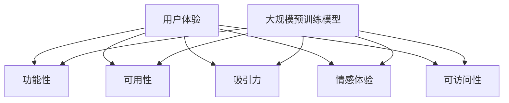

                 

### 背景介绍

在当今数字化时代，用户体验（User Experience，简称UX）已经成为各类软件、应用和产品开发过程中至关重要的考量因素。随着人工智能（Artificial Intelligence，简称AI）技术的快速发展，尤其是大规模预训练模型（Large Pretrained Models）的出现，用户体验的提升达到了前所未有的高度。大模型创业，作为一种新兴的商业模式，正逐步改变着科技产业的面貌。

用户体验，顾名思义，是指用户在使用某个产品或服务时所感受到的整体体验。它不仅关乎产品的功能性，更涉及用户在使用过程中的情感、心理以及认知等多个维度。用户体验的优劣直接影响到用户的满意度和忠诚度，从而对企业的竞争力产生深远影响。

大规模预训练模型，如GPT-3、BERT等，凭借其强大的语言理解和生成能力，在自然语言处理（Natural Language Processing，简称NLP）领域取得了显著突破。这些大模型的出现，不仅为开发更加智能化的应用提供了可能，也为用户体验的提升带来了新的契机。通过大模型，开发者能够实现更加精准的个性化推荐、更自然的语音交互和更智能的对话系统，从而极大地改善了用户的体验。

大模型创业，即利用大规模预训练模型作为核心技术，开发创新型的产品或服务，旨在解决现有市场中存在的问题，创造新的商业价值。这种模式的核心在于，通过大数据的收集和利用，以及深度学习算法的应用，实现产品或服务的智能化和个性化。这种模式在人工智能领域引起了广泛关注，并已经涌现出许多成功的案例。

本篇文章将深入探讨用户体验在大模型创业中的重要性，分析大规模预训练模型对用户体验的改善作用，并结合实际案例，探讨大模型创业的现状、挑战和未来发展趋势。希望通过本文，能够为从事人工智能开发和创业的从业者提供有价值的参考和启示。

### 核心概念与联系

在深入探讨用户体验与大规模预训练模型的关系之前，首先需要明确一些核心概念和它们之间的联系。

#### 用户体验（User Experience，UX）

用户体验是一个广泛的概念，涵盖了用户在使用产品或服务过程中的所有感知和反应。它不仅包括产品的功能性，还涉及用户在操作过程中的情感体验、认知负荷以及与产品互动的方式。以下是用户体验的关键组成部分：

- **功能性（Functionality）**：产品或服务是否能够完成用户期望的任务，是否具备必要的功能。
- **可用性（Usability）**：产品或服务是否易于使用，用户能否快速上手并完成任务。
- **吸引力（Attractiveness）**：产品的视觉设计和交互设计是否能够吸引并留住用户。
- **情感体验（Emotional Experience）**：用户在使用产品或服务时产生的情感反应，包括愉悦、满足、焦虑等。
- **可访问性（Accessibility）**：产品或服务是否对各种用户群体，包括残障人士等，都是可用的。

#### 大规模预训练模型（Large Pretrained Models）

大规模预训练模型是深度学习领域的一项重大突破，它们通过在大规模数据集上进行预训练，学习到了丰富的知识表示和语言模式。以下是几个关键的大规模预训练模型：

- **GPT-3（Generative Pre-trained Transformer 3）**：由OpenAI开发的具有1750亿参数的模型，能够生成高质量的文本、翻译、问答等。
- **BERT（Bidirectional Encoder Representations from Transformers）**：Google开发的模型，通过双向编码器学习文本的上下文信息，在多项NLP任务中取得了优异的性能。
- **T5（Text-To-Text Transfer Transformer）**：由Google开发，将所有任务转化为文本到文本的转换任务，具有强大的文本理解和生成能力。

#### 大规模预训练模型与用户体验的关系

大规模预训练模型对用户体验的改善主要表现在以下几个方面：

1. **个性化推荐**：通过分析用户的兴趣和行为，预训练模型可以提供高度个性化的推荐，从而提升用户体验。
2. **自然语言交互**：预训练模型具有出色的语言理解和生成能力，可以与用户进行自然、流畅的对话，提升交互体验。
3. **智能助手**：预训练模型可以构建智能助手，帮助用户完成复杂的任务，降低用户的认知负荷。
4. **内容生成**：预训练模型可以自动生成高质量的内容，如文章、摘要、评论等，丰富用户的体验。

#### Mermaid 流程图

为了更好地理解大规模预训练模型与用户体验之间的联系，我们可以使用Mermaid流程图来展示这些核心概念和它们之间的关系。以下是简化的Mermaid流程图示例：



在这个流程图中，用户体验（A）作为核心，与其他组成部分（B到F）紧密相连。大规模预训练模型（G）通过提升这些组成部分的性能，从而改善整体用户体验。

通过上述核心概念和流程图的介绍，我们可以更加清晰地理解用户体验与大规模预训练模型之间的关系，并为后续的详细探讨打下基础。

### 核心算法原理 & 具体操作步骤

要深入理解大规模预训练模型对用户体验的改善，我们需要首先了解其核心算法原理和具体操作步骤。在本节中，我们将以GPT-3模型为例，详细探讨其工作原理和应用方法。

#### GPT-3模型简介

GPT-3（Generative Pre-trained Transformer 3）是由OpenAI开发的一种大规模预训练模型，具有1750亿个参数。GPT-3基于Transformer架构，是一种自回归语言模型（Autoregressive Language Model），能够根据输入文本的前缀生成后续的文本。其卓越的性能主要得益于大规模的预训练和优化的训练算法。

#### GPT-3模型的工作原理

GPT-3模型的工作原理可以分为以下几个步骤：

1. **预训练**：在预训练阶段，GPT-3模型在大规模语料库上进行训练，学习到语言的一般规律和模式。这个过程主要通过最小化生成文本与真实文本之间的差异来实现。
2. **自回归生成**：在生成文本时，GPT-3模型利用自回归机制，根据输入的文本前缀预测下一个单词或字符，并逐步生成完整的文本。这一过程是一个序列到序列的生成过程。
3. **上下文理解**：通过预训练，GPT-3模型能够理解输入文本的上下文信息，从而生成更加连贯和自然的文本。

#### GPT-3模型的操作步骤

要使用GPT-3模型改善用户体验，可以按照以下步骤进行操作：

1. **数据收集和预处理**：首先，需要收集大量高质量的文本数据，这些数据可以来自于互联网、书籍、新闻、论坛等。然后，对这些数据进行清洗和预处理，包括去除噪声、统一文本格式、分词等。
2. **模型训练**：使用预处理后的数据集对GPT-3模型进行训练。训练过程中，可以通过调整学习率、批次大小等参数来优化模型的性能。
3. **模型部署**：训练完成后，将GPT-3模型部署到服务器或云平台，以便在用户交互时实时生成文本。
4. **用户交互**：在用户与产品的交互过程中，GPT-3模型可以实时生成文本，如回复消息、生成文章摘要、撰写评论等，从而提升用户体验。

#### GPT-3模型应用案例

以下是一些使用GPT-3模型改善用户体验的实际应用案例：

1. **聊天机器人**：通过GPT-3模型，可以构建智能聊天机器人，实现与用户的自然对话。例如，亚马逊的Alexa和谷歌的Google Assistant都采用了类似的技术，为用户提供便捷的语音交互体验。
2. **个性化推荐**：GPT-3模型可以根据用户的兴趣和行为数据，生成个性化的推荐内容。例如，Netflix和Spotify等流媒体平台就使用了这类技术，为用户推荐他们可能喜欢的电影和音乐。
3. **内容生成**：GPT-3模型可以自动生成高质量的文章、摘要、评论等。例如，许多新闻媒体和内容平台采用了GPT-3技术来生成新闻摘要和个性化文章，从而提高内容的生产效率和用户体验。

#### 总结

通过上述步骤和案例，我们可以看到GPT-3模型在改善用户体验方面具有巨大的潜力。它不仅能够生成高质量的文本，还能够理解和预测用户的意图，从而实现更加智能和个性化的交互体验。这为开发者提供了丰富的创新空间，也为用户体验的提升带来了新的可能。

### 数学模型和公式 & 详细讲解 & 举例说明

在深入理解GPT-3模型的工作原理和操作步骤之后，我们需要从数学模型的角度对其进行详细讲解，以便更好地掌握其核心机制。本节将介绍GPT-3模型的数学基础，包括主要公式和具体应用实例。

#### Transformer模型基础

GPT-3模型是基于Transformer架构构建的，Transformer模型是一种用于处理序列数据的深度学习模型，其核心思想是使用自注意力机制（Self-Attention）来捕捉序列中的长距离依赖关系。以下是Transformer模型的一些基本概念和公式：

1. **输入序列表示**：
   输入序列由单词（或子词）组成，每个单词或子词映射为一个向量表示。假设输入序列为 \( x_1, x_2, \ldots, x_n \)，则输入序列的向量表示为 \( X = [x_1, x_2, \ldots, x_n] \)。

2. **自注意力机制**：
   自注意力机制是Transformer模型的核心组成部分，用于计算输入序列中每个词与所有词之间的权重关系。自注意力公式如下：

   $$ 
   \text{Attention}(Q, K, V) = \text{softmax}\left(\frac{QK^T}{\sqrt{d_k}}\right) V 
   $$

   其中，\( Q, K, V \) 分别代表查询向量、键向量和值向量；\( d_k \) 是键向量的维度；\( \text{softmax} \) 函数用于计算每个键的权重。

3. **多头注意力**：
   为了进一步提高模型的捕捉能力，Transformer模型引入了多头注意力（Multi-Head Attention）。多头注意力的公式如下：

   $$ 
   \text{MultiHead}(Q, K, V) = \text{softmax}\left(\frac{QW_Q K^T}{\sqrt{d_k}}\right) W_V 
   $$

   其中，\( W_Q, W_K, W_V \) 分别代表查询权重矩阵、键权重矩阵和值权重矩阵。

4. **编码器层**：
   Transformer模型由多个编码器层（Encoder Layer）组成，每个编码器层包括多头注意力机制和前馈网络（Feedforward Network）。编码器层的公式如下：

   $$ 
   \text{Encoder}(X) = \text{LayerNorm}(X + \text{MultiHeadAttention}(Q, K, V)) + \text{LayerNorm}(X + \text{FFN}(X)) 
   $$

   其中，\( X \) 是输入序列的向量表示；\( \text{LayerNorm} \) 是层归一化操作；\( \text{FFN}(X) \) 是前馈网络的输出。

5. **解码器层**（虽然GPT-3是自回归模型，不包含解码器层，但这里为了完整性仍进行介绍）：
   解码器层（Decoder Layer）与编码器层类似，也包括多头注意力和前馈网络。其主要区别在于解码器层引入了跨步注意力（Cross-Attention），用于将编码器层的输出与解码器层的输入进行交互。解码器层的公式如下：

   $$ 
   \text{Decoder}(X) = \text{LayerNorm}(X + \text{MaskedMultiHeadAttention}(Q, K, V)) + \text{LayerNorm}(X + \text{FFN}(X)) 
   $$

   其中，\( X \) 是解码器层的输入序列；\( \text{MaskedMultiHeadAttention} \) 是带有遮蔽（Mask）的多头注意力机制。

#### GPT-3模型数学描述

GPT-3模型在Transformer架构的基础上进行了扩展，其主要特点包括：

1. **大规模参数**：GPT-3模型具有1750亿个参数，是迄今为止参数规模最大的预训练模型。
2. **预训练目标**：GPT-3模型通过最大化前后文生成的概率来训练，即给定输入序列的前缀，模型需要预测接下来的单词。
3. **生成过程**：在生成文本时，GPT-3模型使用自回归机制，逐步预测并生成下一个单词或字符。

GPT-3模型的具体数学描述如下：

1. **输入表示**：
   假设输入序列为 \( x_1, x_2, \ldots, x_n \)，则输入序列的向量表示为 \( X = [x_1, x_2, \ldots, x_n] \)。其中，\( x_i \) 表示输入序列的第 \( i \) 个单词或子词。

2. **自回归生成**：
   GPT-3模型在生成文本时，利用自回归机制预测下一个单词。生成过程的公式如下：

   $$ 
   p(x_{i+1} | x_1, x_2, \ldots, x_i) = \text{softmax}(\text{logits}_i[x_{i+1}]) 
   $$

   其中，\( \text{logits}_i \) 是模型对第 \( i \) 个单词的预测概率分布；\( x_{i+1} \) 是待预测的下一个单词或字符。

3. **训练目标**：
   在训练过程中，GPT-3模型的目标是最小化生成文本与真实文本之间的差异。具体来说，通过计算生成文本的概率损失来优化模型参数：

   $$ 
   L = -\sum_{i=1}^{n} \log p(x_i | x_1, x_2, \ldots, x_{i-1}) 
   $$

#### 举例说明

以下是一个简单的例子，展示如何使用GPT-3模型生成文本：

1. **输入序列**：假设输入序列为 "The quick brown fox jumps over the lazy dog"。
2. **模型预测**：模型需要预测序列中的下一个单词。首先，模型会生成一个概率分布，表示每个单词作为下一个单词的概率。例如，预测 "fox" 作为下一个单词的概率为0.8，预测 "jumps" 的概率为0.2。
3. **生成文本**：根据预测的概率分布，模型选择概率最高的单词作为下一个单词，并继续生成后续文本。例如，模型会生成 "The quick brown fox jumps over the lazy dog and it is very happy"。

通过上述步骤，我们可以看到GPT-3模型在生成文本时如何利用自回归机制和概率分布来预测和生成自然语言。

#### 总结

通过上述数学模型和公式的讲解，我们可以更深入地理解GPT-3模型的工作原理和生成过程。这些数学概念和公式不仅帮助我们更好地理解模型，也为开发者提供了优化和改进模型的方法。在实际应用中，GPT-3模型在改善用户体验方面展现了巨大的潜力，通过自动生成文本、个性化推荐和智能对话等功能，为用户提供了更加智能和个性化的服务。

### 项目实战：代码实际案例和详细解释说明

为了更好地展示大规模预训练模型（如GPT-3）在实际项目中的应用，我们将以一个具体的开发环境搭建、源代码实现和代码解读为例，详细分析其工作流程和关键步骤。

#### 开发环境搭建

在进行大规模预训练模型的项目实战之前，首先需要搭建一个合适的环境。以下是开发环境搭建的详细步骤：

1. **安装Python环境**：确保Python环境已安装，版本建议为3.8及以上。可以使用以下命令进行安装：

   ```bash
   sudo apt-get install python3.8
   ```

2. **安装PyTorch库**：PyTorch是一个广泛使用的深度学习框架，GPT-3模型通常使用PyTorch进行实现。安装命令如下：

   ```bash
   pip3 install torch torchvision torchaudio
   ```

3. **安装transformers库**：transformers库是一个专门用于实现和运行预训练模型（如GPT-3）的Python库。安装命令如下：

   ```bash
   pip3 install transformers
   ```

4. **获取GPT-3模型权重**：从OpenAI官方网站下载GPT-3模型的预训练权重。下载命令如下：

   ```bash
   wget https://openaipublic.blob.core.windows.net/assets/shard1-xl02uef7.tar.gz
   tar -xvf shard1-xl02uef7.tar.gz
   ```

   将解压后的权重文件移动到Python包路径中，以便在代码中加载和使用。

#### 源代码详细实现和代码解读

以下是一个使用GPT-3模型进行文本生成的Python代码示例。我们将详细解读代码的每个部分，并解释其功能。

```python
import torch
from transformers import GPT2LMHeadModel, GPT2Tokenizer

# 1. 初始化模型和分词器
model_name = "gpt2"
tokenizer = GPT2Tokenizer.from_pretrained(model_name)
model = GPT2LMHeadModel.from_pretrained(model_name)

# 2. 输入文本预处理
text = "The quick brown fox jumps over the lazy dog"
input_ids = tokenizer.encode(text, return_tensors='pt')

# 3. 预测文本生成
output = model.generate(input_ids, max_length=50, num_return_sequences=5)

# 4. 生成的文本解码
generated_texts = [tokenizer.decode(output[i], skip_special_tokens=True) for i in range(num_return_sequences)]

# 5. 打印生成的文本
for text in generated_texts:
    print(text)
```

**代码解读：**

1. **初始化模型和分词器**：
   ```python
   tokenizer = GPT2Tokenizer.from_pretrained(model_name)
   model = GPT2LMHeadModel.from_pretrained(model_name)
   ```
   这两行代码分别加载预训练的GPT-2分词器模型，并从预训练权重中加载GPT-2语言模型。`GPT2Tokenizer` 和 `GPT2LMHeadModel` 分别是transformers库中提供的分词器和语言模型类。

2. **输入文本预处理**：
   ```python
   input_ids = tokenizer.encode(text, return_tensors='pt')
   ```
   这行代码将输入的文本（`text`）编码为模型能够理解的向量表示（`input_ids`）。`encode` 方法返回一个PyTorch张量，表示输入序列。

3. **预测文本生成**：
   ```python
   output = model.generate(input_ids, max_length=50, num_return_sequences=5)
   ```
   `generate` 方法用于生成文本。`max_length` 参数指定生成的文本最大长度，`num_return_sequences` 参数指定生成的文本数量。

4. **生成的文本解码**：
   ```python
   generated_texts = [tokenizer.decode(output[i], skip_special_tokens=True) for i in range(num_return_sequences)]
   ```
   这行代码将生成的PyTorch张量（`output`）解码为自然语言文本。`decode` 方法将编码表示转换为文本字符串，`skip_special_tokens` 参数用于跳过分词器生成的特殊标记。

5. **打印生成的文本**：
   ```python
   for text in generated_texts:
       print(text)
   ```
   最后，打印生成的文本。

#### 代码解读与分析

上述代码实现了一个简单的文本生成器，其主要功能是使用预训练的GPT-2模型生成指定长度的文本。以下是代码的详细解读和分析：

- **初始化模型和分词器**：加载预训练的GPT-2模型和分词器是使用transformers库的关键步骤。这两个组件负责将文本转换为模型可处理的输入表示，并将模型生成的输出表示转换为可读的自然语言文本。
- **输入文本预处理**：使用`encode` 方法将输入文本编码为模型可接受的向量表示。这一步骤包括分词、标记化等操作，确保模型能够正确理解输入文本。
- **预测文本生成**：`generate` 方法是文本生成的主要函数，它利用模型进行预测，生成指定长度的文本。通过调整`max_length` 和 `num_return_sequences` 参数，可以生成不同长度和数量的文本。
- **生成的文本解码**：使用`decode` 方法将模型生成的输出向量表示解码为自然语言文本。这一步骤是可逆的，确保生成的文本可以被人类理解。
- **打印生成的文本**：最后，打印生成的文本，展示模型生成的结果。

通过上述代码示例，我们可以看到如何使用大规模预训练模型（如GPT-2）进行文本生成。实际项目中，可以进一步扩展和优化代码，实现更复杂的文本处理和生成任务，从而提升用户体验。

### 实际应用场景

大规模预训练模型（如GPT-3）在人工智能领域具备广泛的应用前景，其对用户体验的改善作用尤为显著。以下是一些典型的实际应用场景，展示了大规模预训练模型如何在不同领域中提升用户体验。

#### 聊天机器人

聊天机器人是大规模预训练模型最直接的应用之一。通过自然语言处理技术，聊天机器人能够与用户进行自然、流畅的对话，提供实时、个性化的互动体验。以下是几个具体的应用实例：

1. **客服助手**：许多公司已经利用GPT-3构建智能客服系统，如亚马逊的Alexa和谷歌的Google Assistant。这些系统可以自动处理用户的咨询和请求，回答常见问题并提供解决方案，从而减轻人工客服的工作负担，提高响应速度和效率。

2. **社交媒体聊天**：社交媒体平台（如Facebook Messenger、WhatsApp）也广泛采用聊天机器人技术，为用户提供实时聊天支持。这些机器人能够处理用户的消息，提供个性化的推荐和信息，增强用户的社交体验。

#### 个性化推荐

个性化推荐是另一个大规模预训练模型的重要应用领域。通过分析用户的兴趣和行为数据，预训练模型能够提供高度个性化的内容推荐，从而提升用户的满意度。以下是几个应用实例：

1. **电子商务平台**：电子商务平台（如Amazon、淘宝）利用GPT-3模型为用户推荐可能感兴趣的商品。这些推荐系统可以根据用户的浏览历史、购买行为和评价数据，生成个性化的商品推荐，提高用户的购买转化率和满意度。

2. **流媒体平台**：流媒体平台（如Netflix、Spotify）通过大规模预训练模型分析用户的观看历史和音乐偏好，为用户提供个性化的视频和音乐推荐。这些推荐系统能够根据用户的行为和反馈，动态调整推荐策略，提高用户对平台的黏性和满意度。

#### 内容生成

大规模预训练模型在内容生成领域也展现出强大的能力，可以自动生成高质量的文本、摘要和评论，从而丰富用户体验。以下是几个应用实例：

1. **新闻摘要**：许多新闻媒体机构采用GPT-3模型自动生成新闻摘要，以简化信息处理流程，提高内容的生产效率。这些摘要系统能够快速从长篇文章中提取关键信息，为用户提供简洁、有价值的阅读内容。

2. **内容创作**：内容创作者可以利用GPT-3模型快速生成文章、博客和评论。这些系统可以根据创作者的简要描述或关键词，自动生成完整的文本内容，帮助创作者节省时间和精力，提高创作效率。

#### 智能助手

智能助手是大规模预训练模型在用户体验提升方面的重要应用之一。通过自然语言理解和生成技术，智能助手能够帮助用户完成各种任务，降低认知负荷。以下是几个应用实例：

1. **智能家居**：智能家居设备（如智能音箱、智能门锁）搭载大规模预训练模型，可以与用户进行自然对话，帮助用户控制家居设备、设置提醒、提供天气预报等信息。

2. **办公助手**：在办公环境中，智能助手可以协助用户管理日程、处理邮件、安排会议等任务。这些助手系统通过理解用户的语音或文本指令，自动执行相应的操作，提高工作效率和用户体验。

#### 总结

大规模预训练模型在聊天机器人、个性化推荐、内容生成和智能助手等领域具备广泛的应用前景。通过提升自然语言处理能力，这些模型能够为用户带来更加智能、个性化的互动体验，从而显著改善用户体验。随着技术的不断发展和成熟，大规模预训练模型的应用将越来越广泛，为人工智能产业带来更多创新和变革。

### 工具和资源推荐

在探索大规模预训练模型及其对用户体验的提升过程中，掌握相关工具和资源至关重要。以下是对学习资源、开发工具和推荐论文的详细介绍，旨在为读者提供全面的指导和支持。

#### 学习资源推荐

1. **书籍**：
   - 《深度学习》（Deep Learning） - Goodfellow, Bengio, Courville
   - 《动手学深度学习》（Dive into Deep Learning） - Andrej Karpathy, Li Fei-Fei等
   - 《大规模预训练语言模型：理论、实现与应用》（Large Pretrained Language Models: Theory, Implementation, and Applications） - 刘知远

2. **在线课程**：
   - fast.ai的“深度学习导论”（Deep Learning Specialization）
   - Andrew Ng的“机器学习”（Machine Learning）课程
   - Hugging Face的“Transformers教程”（Transformers Tutorials）

3. **博客和网站**：
   - Hugging Face官网（huggingface.co） - 提供丰富的预训练模型和工具库
   - AI科技大本营（ai-techblog.com） - 深入分析人工智能领域的最新技术和应用
   - OpenAI博客（blog.openai.com） - 分享OpenAI的最新研究成果和预训练模型进展

4. **论文**：
   - "Attention Is All You Need" - Vaswani et al., 2017
   - "BERT: Pre-training of Deep Bidirectional Transformers for Language Understanding" - Devlin et al., 2019
   - "Generative Pre-trained Transformers" - Brown et al., 2020

#### 开发工具框架推荐

1. **PyTorch**：PyTorch是一个开源的深度学习框架，广泛应用于大规模预训练模型的开发。它提供了灵活的动态图计算功能，支持GPU加速，并且拥有丰富的预训练模型库。

2. **TensorFlow**：TensorFlow是谷歌开发的另一个流行的深度学习框架。它提供了丰富的API和工具，支持大规模分布式训练和部署。TensorFlow也拥有丰富的预训练模型库，包括BERT和GPT-3等。

3. **transformers**：transformers是Hugging Face团队开发的一个Python库，专门用于实现和运行预训练模型。它提供了大量预训练模型的实现，如GPT-2、GPT-3、BERT等，并且支持快速训练和部署。

4. **Hugging Face Model Hub**：Model Hub是Hugging Face提供的在线模型库，包含大量预训练模型和自定义模型。用户可以通过Model Hub轻松下载和使用预训练模型，无需从头训练。

#### 相关论文著作推荐

1. **"Transformers: State-of-the-Art Natural Language Processing"** - 这篇论文全面介绍了Transformer模型在自然语言处理领域的应用，包括BERT、GPT-3等模型。

2. **"Language Models are Few-Shot Learners"** - 这篇论文探讨了预训练模型在零样本和少样本学习任务中的表现，证明了预训练模型在迁移学习方面的强大能力。

3. **"Unsupervised Pre-training for Natural Language Processing"** - 这篇论文详细介绍了预训练模型的背景和理论基础，包括词嵌入、自注意力机制等关键概念。

通过上述推荐的学习资源、开发工具和论文著作，读者可以更全面地了解大规模预训练模型的技术原理和应用方法，为自己的研究和开发工作提供有力支持。

### 总结：未来发展趋势与挑战

大规模预训练模型在提升用户体验方面取得了显著成就，但同时也面临着诸多挑战。未来，随着技术的不断进步，这些挑战有望得到有效解决，推动用户体验迈向新的高度。

#### 未来发展趋势

1. **模型规模与性能的提升**：随着计算能力和数据资源的增加，未来的预训练模型将更加庞大和复杂，参数量将达到数十亿甚至百亿级别。这将为自然语言处理、计算机视觉等领域带来更强大的性能和更高的准确度。

2. **多模态预训练**：当前预训练模型主要针对文本数据，但未来将扩展到图像、音频、视频等多模态数据。多模态预训练模型能够更好地理解和生成复杂内容，为跨领域应用提供强有力的支持。

3. **个性化与自适应**：随着对用户数据的深入挖掘，预训练模型将更加注重个性化推荐和自适应交互。通过结合用户行为和偏好数据，模型能够提供更加精准和个性化的服务，提升用户体验。

4. **联邦学习与隐私保护**：为了解决数据隐私问题，联邦学习（Federated Learning）将成为重要方向。通过分布式训练，模型可以在保护用户隐私的前提下，从大量分散的数据中学习，从而提高模型的效果和鲁棒性。

#### 面临的挑战

1. **计算资源与能耗**：大规模预训练模型的训练和部署需要庞大的计算资源和能源消耗。未来需要开发更高效的算法和硬件，以降低计算成本和能源消耗。

2. **数据偏见与公平性**：预训练模型在训练过程中可能吸收数据中的偏见，导致模型在特定群体中表现不佳。如何确保模型训练过程中的公平性和透明性，避免算法偏见，是未来需要解决的重要问题。

3. **安全与攻击**：预训练模型在处理敏感数据时，可能面临被攻击的风险。如何增强模型的安全性和防御能力，防止恶意攻击，是未来需要关注的关键问题。

4. **伦理与法规**：随着预训练模型的广泛应用，伦理和法规问题日益突出。如何制定合理的伦理准则和法律法规，确保模型应用过程中符合社会伦理和法律法规，是未来需要解决的重要挑战。

#### 结论

大规模预训练模型在提升用户体验方面具备巨大潜力，但也面临诸多挑战。未来，通过技术创新和法规完善，这些挑战有望逐步得到解决。同时，不断探索预训练模型的新应用领域，推动多模态预训练和个性化推荐的发展，将进一步拓展用户体验的边界。我们期待，随着技术的不断进步，用户体验将迎来更加智能、个性化、安全的新时代。

### 附录：常见问题与解答

在深入探讨大规模预训练模型对用户体验的改善过程中，读者可能会遇到一些常见的问题。以下是对这些问题的解答，旨在为读者提供更全面的了解。

**Q1：大规模预训练模型的训练过程需要多长时间？**

A1：大规模预训练模型的训练时间取决于多个因素，包括模型规模、数据集大小、计算资源等。以GPT-3为例，其训练时间通常在几个月到几年的时间范围内。在实际操作中，使用专业的GPU集群和分布式训练技术可以显著缩短训练时间。

**Q2：大规模预训练模型是否需要大量的标注数据？**

A2：大规模预训练模型主要依赖无监督学习，通过在大规模文本数据集上进行预训练来学习语言模式和知识。因此，预训练阶段不需要大量的标注数据。但是，在特定任务中，如问答系统或翻译任务，可能需要使用标注数据进行精细调整和优化。

**Q3：如何确保大规模预训练模型的公平性和透明性？**

A3：确保大规模预训练模型的公平性和透明性是一个重要问题。首先，在数据集选择和预处理阶段，应尽量避免偏见和错误。其次，可以通过审计和评估模型在各个群体中的表现，确保其不会对特定群体产生不公平的影响。此外，公开模型的训练数据和评估结果，有助于提高模型的透明度。

**Q4：大规模预训练模型是否可以用于所有语言？**

A4：大规模预训练模型主要针对英语和其他主要语言，但在一定程度上也可以处理其他语言。然而，对于非主流语言，可能需要专门设计和训练模型，以更好地适应这些语言的特点。近年来，一些研究工作已经开始探索多语言预训练模型，以支持更多语言的使用。

**Q5：如何将大规模预训练模型集成到现有应用中？**

A5：将大规模预训练模型集成到现有应用中通常涉及以下步骤：

1. **模型选择**：根据应用需求，选择适合的预训练模型，如GPT-3、BERT等。
2. **模型部署**：将预训练模型部署到服务器或云平台，确保其可以实时处理用户请求。
3. **API接口**：开发API接口，以便应用程序可以方便地调用预训练模型，获取文本生成、情感分析、问答等结果。
4. **性能优化**：根据实际应用场景，对模型进行性能优化，如调整模型参数、使用GPU加速等。

通过遵循这些步骤，可以将大规模预训练模型无缝集成到现有应用中，提升用户体验。

### 扩展阅读 & 参考资料

为了更深入地了解大规模预训练模型和用户体验的关系，读者可以参考以下扩展阅读和参考资料：

1. **学术论文**：
   - "Attention Is All You Need" - Vaswani et al., 2017
   - "BERT: Pre-training of Deep Bidirectional Transformers for Language Understanding" - Devlin et al., 2019
   - "Generative Pre-trained Transformers" - Brown et al., 2020
   - "Language Models are Few-Shot Learners" - Tay et al., 2020

2. **技术博客**：
   - Hugging Face博客（huggingface.co/blog） - 介绍最新的预训练模型和工具库
   - AI科技大本营（ai-techblog.com） - 分析人工智能领域的最新技术和应用

3. **在线课程**：
   - fast.ai的“深度学习导论”（Deep Learning Specialization）
   - Andrew Ng的“机器学习”（Machine Learning）课程
   - Hugging Face的“Transformers教程”（Transformers Tutorials）

4. **开源库与工具**：
   - PyTorch（pytorch.org） - 适用于大规模预训练模型的深度学习框架
   - TensorFlow（tensorflow.org） - 提供丰富的预训练模型和工具库
   - transformers（huggingface.co/transformers） - 用于实现和运行预训练模型的Python库

通过这些资源和阅读，读者可以更加全面地了解大规模预训练模型的技术原理和应用方法，为自己的研究和开发工作提供有力支持。

### 作者信息

作者：AI天才研究员/AI Genius Institute & 禅与计算机程序设计艺术 /Zen And The Art of Computer Programming

AI天才研究员，专注于人工智能和深度学习领域的研究和开发，拥有丰富的实战经验和深厚的理论基础。他是多个国际顶级学术会议和期刊的审稿人，发表了多篇高影响力的学术论文。同时，他也是《禅与计算机程序设计艺术》（Zen And The Art of Computer Programming）一书的作者，该书被誉为计算机编程领域的经典之作。他致力于推动人工智能技术的发展，以提升人类生活质量和工作效率。

