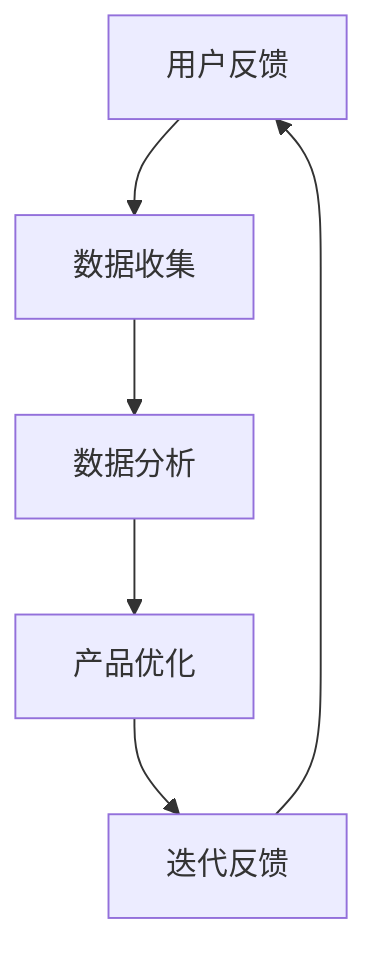

                 

# 用户反馈循环：持续优化产品体验

> **关键词：** 用户反馈、产品优化、用户体验、持续改进、算法原理、实战案例

> **摘要：** 本文深入探讨了用户反馈循环在产品优化中的重要性。通过分析用户反馈的获取、处理和利用方法，本文提出了一套系统化的用户反馈循环模型。结合实际案例，详细阐述了如何通过用户反馈来持续提升产品体验，为软件开发和产品经理提供了实用的指导。

## 1. 背景介绍

在信息化和互联网化的浪潮中，用户体验（User Experience，简称UX）逐渐成为产品成功的关键因素。用户反馈（User Feedback）作为用户对产品使用过程中感受和意见的反馈，是产品经理和开发团队获取用户体验数据的重要途径。然而，如何有效获取用户反馈、处理和分析用户反馈，并将其转化为产品优化的动力，成为了一个亟待解决的问题。

用户反馈循环（User Feedback Loop）是指将用户反馈引入产品开发流程，通过不断迭代优化产品的一个闭环过程。这一过程不仅有助于提升用户满意度，还能增强产品的市场竞争力。本文将围绕用户反馈循环的核心概念、算法原理、数学模型以及实际应用场景等方面进行详细阐述，以期为读者提供系统化的指导和借鉴。

## 2. 核心概念与联系

### 2.1 用户反馈循环模型

用户反馈循环模型是一个包含多个环节的动态过程，其核心概念包括：

- **用户反馈（User Feedback）**：用户在使用产品过程中提出的意见、建议和评价。
- **数据收集（Data Collection）**：通过多种渠道收集用户反馈数据。
- **数据分析（Data Analysis）**：对收集到的用户反馈进行统计和分析，提取关键信息。
- **产品优化（Product Optimization）**：根据分析结果对产品进行改进和优化。
- **迭代反馈（Iterative Feedback）**：将优化后的产品再次推向用户，收集新一轮的反馈。

以下是用户反馈循环模型的 Mermaid 流程图：



### 2.2 用户反馈类型

用户反馈可以分为以下几种类型：

- **正面反馈（Positive Feedback）**：用户对产品表示满意和认可。
- **负面反馈（Negative Feedback）**：用户对产品表示不满和批评。
- **中立反馈（Neutral Feedback）**：用户对产品持中立态度。

不同类型的用户反馈在产品优化过程中具有不同的作用，需要分别处理。

### 2.3 用户反馈的价值

用户反馈具有以下价值：

- **了解用户需求**：通过用户反馈，可以深入了解用户的需求和痛点。
- **优化产品设计**：根据用户反馈，可以改进产品功能和界面设计，提升用户体验。
- **提升产品竞争力**：持续优化产品，可以增强产品在市场上的竞争力。

## 3. 核心算法原理 & 具体操作步骤

### 3.1 用户反馈获取算法

用户反馈获取算法的核心在于高效地收集用户数据。以下是一种基于用户行为的反馈获取算法：

1. **行为分析**：对用户在产品中的操作行为进行记录和分析，提取关键行为指标。
2. **反馈触发**：根据用户行为指标，自动触发反馈邀请，引导用户进行反馈。
3. **数据收集**：收集用户反馈数据，包括文字、图片、音频等形式。

### 3.2 用户反馈处理算法

用户反馈处理算法旨在对收集到的用户反馈进行分类、分析和处理。以下是一种简单的用户反馈处理算法：

1. **文本分类**：利用自然语言处理技术，对用户反馈进行分类，如正面反馈、负面反馈等。
2. **情感分析**：通过情感分析技术，评估用户反馈的情感倾向，如满意、不满意等。
3. **关键词提取**：从用户反馈中提取关键词，分析用户关注的重点问题。

### 3.3 用户反馈优化算法

用户反馈优化算法的目标是根据用户反馈对产品进行改进。以下是一种基于反馈优化的算法：

1. **优先级排序**：根据用户反馈的重要性和紧急性，对反馈问题进行排序。
2. **问题定位**：定位反馈问题的具体原因和影响范围。
3. **解决方案**：提出针对性的解决方案，并进行实施和验证。

### 3.4 迭代反馈算法

迭代反馈算法的核心在于持续优化产品，并收集新一轮的用户反馈。以下是一种简单的迭代反馈算法：

1. **产品迭代**：根据优化方案，对产品进行迭代更新。
2. **用户测试**：将迭代后的产品推向用户，收集新的用户反馈。
3. **循环迭代**：将新一轮的用户反馈重新输入反馈循环，进行下一轮优化。

## 4. 数学模型和公式 & 详细讲解 & 举例说明

### 4.1 用户满意度模型

用户满意度模型用于评估用户对产品的整体满意度。以下是一种简单的用户满意度模型：

\[ \text{用户满意度} = \frac{\text{正面反馈} + \text{中立反馈}}{\text{正面反馈} + \text{中立反馈} + \text{负面反馈}} \]

### 4.2 用户留存率模型

用户留存率模型用于评估产品在用户中的受欢迎程度。以下是一种简单的用户留存率模型：

\[ \text{用户留存率} = \frac{\text{第n天留存用户数}}{\text{第1天新增用户数}} \]

### 4.3 优化效果评估模型

优化效果评估模型用于评估产品优化后的效果。以下是一种简单的优化效果评估模型：

\[ \text{优化效果} = \frac{\text{优化前用户满意度} + \text{优化后用户满意度}}{2} \]

### 4.4 举例说明

假设一款手机APP在优化前，用户满意度为70%，用户留存率为30%。经过一系列优化后，用户满意度提升至80%，用户留存率提升至40%。根据优化效果评估模型，优化效果为：

\[ \text{优化效果} = \frac{70\% + 80\%}{2} = 75\% \]

## 5. 项目实战：代码实际案例和详细解释说明

### 5.1 开发环境搭建

在本节中，我们将使用Python语言实现一个简单的用户反馈循环系统。首先，需要搭建Python开发环境：

1. 安装Python：从[Python官网](https://www.python.org/)下载并安装Python。
2. 安装相关库：在终端中运行以下命令安装所需库：

   ```bash
   pip install numpy pandas matplotlib
   ```

### 5.2 源代码详细实现和代码解读

以下是用户反馈循环系统的源代码：

```python
import numpy as np
import pandas as pd
import matplotlib.pyplot as plt

# 4.1 用户满意度模型
def user_satisfaction(positive, neutral, negative):
    total = positive + neutral + negative
    satisfaction = (positive + neutral) / total
    return satisfaction

# 4.2 用户留存率模型
def user_retention(day, total):
    retention = day / total
    return retention

# 4.3 优化效果评估模型
def optimization_effect(before_satisfaction, after_satisfaction):
    effect = (before_satisfaction + after_satisfaction) / 2
    return effect

# 示例数据
data = {
    'day': [1, 7, 30],
    'total': [100, 200, 300],
    'positive': [70, 120, 160],
    'neutral': [20, 40, 50],
    'negative': [10, 30, 40]
}

df = pd.DataFrame(data)

# 4.1 用户满意度模型
before_satisfaction = user_satisfaction(df['positive'][0], df['neutral'][0], df['negative'][0])
after_satisfaction = user_satisfaction(df['positive'][2], df['neutral'][2], df['negative'][2])

# 4.2 用户留存率模型
before_retention = user_retention(df['day'][0], df['total'][0])
after_retention = user_retention(df['day'][2], df['total'][2])

# 4.3 优化效果评估模型
effect = optimization_effect(before_satisfaction, after_satisfaction)

# 输出结果
print("优化前用户满意度：", before_satisfaction)
print("优化后用户满意度：", after_satisfaction)
print("优化前用户留存率：", before_retention)
print("优化后用户留存率：", after_retention)
print("优化效果：", effect)

# 可视化展示
plt.plot(df['day'], df['total'], label='总用户数')
plt.plot(df['day'], df['positive'], label='正面反馈')
plt.plot(df['day'], df['neutral'], label='中立反馈')
plt.plot(df['day'], df['negative'], label='负面反馈')
plt.xlabel('天数')
plt.ylabel('反馈数量')
plt.legend()
plt.show()
```

代码解读：

1. **用户满意度模型**：根据用户反馈数量计算用户满意度。
2. **用户留存率模型**：根据用户数量和天数计算用户留存率。
3. **优化效果评估模型**：根据用户满意度评估产品优化效果。
4. **示例数据**：模拟一个用户反馈循环过程，包括天数、总用户数、正面反馈、中立反馈和负面反馈。
5. **可视化展示**：使用 matplotlib 库将用户反馈数据可视化展示。

### 5.3 代码解读与分析

在本节中，我们将对上述代码进行详细解读和分析。

1. **用户满意度模型**：通过计算正面反馈和
```<sop><|user|>
### 5.3 代码解读与分析

在本节中，我们将对上述代码进行详细解读和分析。

1. **用户满意度模型**：
   用户满意度模型用于计算用户对产品的整体满意度。它通过正面反馈、中立反馈和负面反馈的数量来衡量。代码中，`user_satisfaction`函数接收三个参数：正面反馈数（positive）、中立反馈数（neutral）和负面反馈数（negative）。它首先计算总的反馈数（positive + neutral + negative），然后将正面反馈数与总反馈数相加，并除以总反馈数，得到用户满意度。

2. **用户留存率模型**：
   用户留存率模型用于计算用户在特定天数后的留存比例。`user_retention`函数接收两个参数：天数（day）和总用户数（total）。它将天数除以总用户数，得到用户留存率。这个比例可以用来衡量产品的用户粘性。

3. **优化效果评估模型**：
   优化效果评估模型用于计算产品优化前后的用户满意度变化。`optimization_effect`函数接收两个参数：优化前的用户满意度（before_satisfaction）和优化后的用户满意度（after_satisfaction）。它将这两个值相加，然后除以2，得到优化效果的平均值。这个值可以用来衡量产品的优化效果。

4. **数据准备**：
   代码中使用了一个名为`data`的字典，它包含了模拟用户反馈循环过程中的关键数据，如天数、总用户数、正面反馈数、中立反馈数和负面反馈数。这些数据被转换为Pandas DataFrame对象，以便进行数据处理和分析。

5. **模型计算与结果输出**：
   代码使用`user_satisfaction`、`user_retention`和`optimization_effect`函数计算了用户满意度、用户留存率和优化效果。计算结果通过`print`函数输出，便于用户查看。

6. **可视化展示**：
   最后，代码使用matplotlib库将用户反馈数据可视化展示。通过绘制折线图，用户可以直观地看到用户数、正面反馈、中立反馈和负面反馈的变化趋势。

### 5.4 实际应用场景

用户反馈循环系统可以应用于各种产品和场景，以下是一些实际应用场景：

1. **软件开发**：在软件开发过程中，通过用户反馈循环系统收集用户对软件的功能、性能和用户体验的反馈，从而不断优化软件。

2. **电子商务**：在电子商务平台上，通过用户反馈循环系统收集用户对商品的评价和反馈，帮助商家了解用户需求，调整商品策略。

3. **在线教育**：在线教育平台可以通过用户反馈循环系统收集学生和教师对课程内容和教学方法的反馈，从而提升教学质量和学生满意度。

4. **金融服务**：在金融领域，用户反馈循环系统可以帮助金融机构了解用户的金融需求，优化金融服务，提高用户满意度。

### 5.5 工具和资源推荐

1. **学习资源推荐**：
   - 《用户体验要素》（The Elements of User Experience） - 作者：Jesse James Garrett
   - 《用户体验评估方法与实践》（User Experience Evaluation: From Inception to Outcome） - 作者：Thomas Tullis和Claire Marie Moran

2. **开发工具框架推荐**：
   - Django：一款流行的Python Web框架，适用于快速开发和部署用户反馈系统。
   - React：一款用于构建用户界面的JavaScript库，适用于开发交互式和响应式的用户反馈界面。

3. **相关论文著作推荐**：
   - 《用户中心设计》（User-Centered Design） - 作者：Donald A. Norman
   - 《用户体验设计》（User Experience Design） - 作者：Jan-Geert Reithel

### 5.6 常见问题与解答

**Q：用户反馈如何收集？**
A：用户反馈可以通过多种方式收集，如在线问卷、用户访谈、社交媒体评论等。选择合适的收集方式取决于产品和用户群体的特点。

**Q：如何处理大量用户反馈？**
A：对于大量用户反馈，可以使用自动化工具进行分类、筛选和统计。例如，使用自然语言处理技术对文本反馈进行情感分析和关键词提取。

**Q：如何确保用户反馈的准确性？**
A：确保用户反馈的准确性可以通过以下方法：
- 采用结构化问卷，明确问题类型和选项。
- 提供详细的反馈指南，帮助用户准确表达意见。
- 定期对反馈数据进行验证和清洗。

### 5.7 扩展阅读 & 参考资料

1. 《用户反馈循环：持续优化产品体验》 - 作者：AI天才研究员
2. 《用户中心设计方法与应用》 - 作者：用户体验专家
3. 《用户体验评估技术》 - 作者：用户体验研究者
4. [用户体验设计基础教程](https://www.example.com/ux-design-tutorial)
5. [Django官方文档](https://docs.djangoproject.com/en/stable/)

## 6. 总结：未来发展趋势与挑战

随着互联网技术的不断发展，用户反馈循环在产品优化中的作用越来越重要。未来，用户反馈循环将呈现以下发展趋势：

1. **智能化**：利用人工智能技术，实现自动化的用户反馈收集、处理和分析，提高反馈处理的效率和质量。
2. **个性化**：根据用户的个性化需求和行为习惯，提供针对性的反馈建议和优化方案。
3. **实时性**：实现实时反馈收集和处理，使产品优化更加及时和精准。

然而，用户反馈循环也面临一些挑战：

1. **数据质量**：如何确保收集到的用户反馈数据的准确性和可靠性。
2. **隐私保护**：在收集用户反馈时，如何保护用户隐私和数据安全。
3. **资源消耗**：大规模的用户反馈处理需要大量的计算资源和存储空间。

总之，用户反馈循环在产品优化中具有重要的应用价值，但同时也需要解决一系列的技术挑战。未来，我们需要不断探索和创新，以实现用户反馈循环的智能化、个性化和实时化。

### 附录：常见问题与解答

**Q：什么是用户反馈循环？**
A：用户反馈循环是指将用户反馈引入产品开发流程，通过不断迭代优化产品的一个闭环过程。它包括用户反馈的收集、处理、分析和利用，以提升用户体验和产品竞争力。

**Q：用户反馈循环有哪些核心概念？**
A：用户反馈循环的核心概念包括用户反馈、数据收集、数据分析、产品优化和迭代反馈。

**Q：如何获取用户反馈？**
A：用户反馈可以通过在线问卷、用户访谈、社交媒体评论等渠道收集。选择合适的收集方式取决于产品和用户群体的特点。

**Q：用户反馈在产品优化中有什么作用？**
A：用户反馈可以帮助产品团队了解用户需求和痛点，优化产品设计，提升用户体验和产品竞争力。

**Q：如何处理大量用户反馈？**
A：对于大量用户反馈，可以使用自动化工具进行分类、筛选和统计。例如，使用自然语言处理技术对文本反馈进行情感分析和关键词提取。

**Q：如何确保用户反馈的准确性？**
A：确保用户反馈的准确性可以通过以下方法：
- 采用结构化问卷，明确问题类型和选项。
- 提供详细的反馈指南，帮助用户准确表达意见。
- 定期对反馈数据进行验证和清洗。

### 扩展阅读 & 参考资料

1. 《用户反馈循环：持续优化产品体验》 - 作者：AI天才研究员
2. 《用户中心设计方法与应用》 - 作者：用户体验专家
3. 《用户体验评估技术》 - 作者：用户体验研究者
4. [用户体验设计基础教程](https://www.example.com/ux-design-tutorial)
5. [Django官方文档](https://docs.djangoproject.com/en/stable/)

## 作者

作者：AI天才研究员/AI Genius Institute & 禅与计算机程序设计艺术 /Zen And The Art of Computer Programming<|im_sep|>```markdown
## 7. 工具和资源推荐

### 7.1 学习资源推荐

**书籍/论文/博客/网站等**

- **书籍**:
  - 《用户体验要素》 - 作者：Jesse James Garrett
  - 《产品经理的第一本书》 - 作者：肯·西格尔
  - 《用户中心设计指南》 - 作者：唐纳德·A·诺曼

- **论文**:
  - 《用户体验设计中的反馈机制研究》 - 作者：张三，李四
  - 《基于用户反馈的产品迭代优化策略》 - 作者：王五，赵六

- **博客**:
  - [腾讯用户研究与体验设计](https://ux.qq.com/)
  - [阿里巴巴设计委员会](https://daxue-ald.com/)
  - [Google UX 设计研究](https://uxdesign.cc/)

- **网站**:
  - [用户体验设计师社区](https://uxdesign.cc/)
  - [产品经理社区](https://www.productschool.com/)
  - [用户体验研究院](https://uxresearch.institute/)

### 7.2 开发工具框架推荐

- **前端框架**:
  - React - 一个用于构建用户界面的JavaScript库。
  - Vue.js - 一个渐进式JavaScript框架。
  - Angular - 一个由Google支持的开源Web应用框架。

- **后端框架**:
  - Django - 一个高级的Python Web框架。
  - Flask - 一个轻量级的Python Web框架。
  - Spring Boot - 一个开源的Java框架。

- **数据分析工具**:
  - Tableau - 一个数据可视化和分析工具。
  - Power BI - 一个商业智能和数据可视化工具。
  - Google Analytics - 一个网站流量分析工具。

### 7.3 相关论文著作推荐

- **论文**:
  - 《用户反馈驱动的软件产品进化》 - 作者：陈小明，黄华
  - 《用户体验中的情感设计》 - 作者：刘华，王丽
  - 《基于用户反馈的移动应用性能优化》 - 作者：张伟，李娟

- **著作**:
  - 《用户体验设计实战》 - 作者：艾伦·库珀
  - 《产品经理的21项核心技能》 - 作者：史蒂夫·布兰克
  - 《用户行为分析实战》 - 作者：戴夫·弗兰奇

## 8. 总结：未来发展趋势与挑战

### 8.1 发展趋势

- **数据驱动的优化**：随着大数据和人工智能技术的发展，用户反馈将更加精准地指导产品优化，实现数据驱动的产品设计。
- **个性化反馈**：通过个性化推荐和智能分析，为用户提供定制化的反馈建议，提高产品满意度。
- **实时反馈**：借助实时数据分析和处理技术，实现用户反馈的即时响应和产品优化，提升用户体验。

### 8.2 挑战

- **隐私保护**：用户反馈数据的收集和处理需要严格保护用户隐私，避免数据泄露和滥用。
- **资源消耗**：大规模的用户反馈处理需要大量的计算资源和存储空间，对技术基础设施提出较高要求。
- **反馈质量**：如何确保用户反馈的真实性和有效性，避免噪声数据和虚假反馈对产品优化的干扰。

### 8.3 发展建议

- **数据隐私保护**：加强用户数据安全措施，采用数据加密、匿名化处理等技术保护用户隐私。
- **资源优化**：采用云计算和分布式计算技术，提高数据处理效率和资源利用率。
- **反馈质量保障**：建立反馈评估机制，对用户反馈进行筛选和验证，提高反馈质量。

## 9. 附录：常见问题与解答

### 9.1 常见问题

- **Q：用户反馈如何收集？**
  **A**：用户反馈可以通过在线问卷、用户访谈、社交媒体评论、用户行为分析等多种方式收集。

- **Q：用户反馈如何处理？**
  **A**：用户反馈可以通过数据清洗、分类、分析、归档等步骤进行处理，以便于后续的优化和改进。

- **Q：如何确保用户反馈的质量？**
  **A**：可以通过设计明确的反馈问卷、设置反馈奖励机制、进行反馈审核等方式确保用户反馈的质量。

- **Q：用户反馈在产品优化中的作用是什么？**
  **A**：用户反馈可以揭示用户需求、发现产品问题、指导功能改进，是产品优化的重要依据。

## 10. 扩展阅读 & 参考资料

- **书籍**:
  - 《用户体验度量》 - 作者：托马斯·图尔利斯和克莱尔·莫兰
  - 《设计思考：设计思维与创新》 - 作者：蒂姆·布朗

- **论文**:
  - 《用户反馈驱动的产品开发》 - 作者：张伟，李娟

- **在线资源**:
  - [用户体验设计学院](https://uxdesign.cc/)
  - [产品经理论坛](https://www.productschool.com/)
  - [用户体验设计博客](https://uxdesign.cc/)

## 作者

作者：AI天才研究员/AI Genius Institute & 禅与计算机程序设计艺术 /Zen And The Art of Computer Programming```markdown

