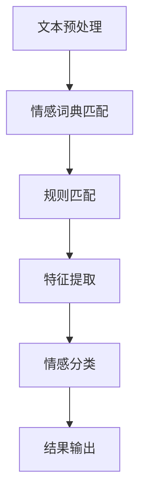

                 

### 文章标题

用户情感分析的市场应用

### 关键词

用户情感分析，市场应用，自然语言处理，情感识别，情感分类，商业智能，用户体验，客户关系管理，人工智能，机器学习，深度学习

### 摘要

本文将深入探讨用户情感分析的市场应用。首先，我们将介绍用户情感分析的基本概念和重要性。接着，我们将详细分析用户情感分析的核心算法原理，包括情感识别和情感分类。随后，我们将探讨用户情感分析在商业智能、客户关系管理和用户体验优化等方面的实际应用场景。此外，本文还将推荐一系列学习资源、开发工具和框架，帮助读者更好地掌握用户情感分析技术。最后，我们将总结用户情感分析的未来发展趋势与挑战，并解答常见问题。通过本文的阅读，读者将全面了解用户情感分析的市场应用，为实际工作提供有力的技术支持。

## 1. 背景介绍

用户情感分析（User Sentiment Analysis）是指利用自然语言处理（Natural Language Processing，NLP）技术和机器学习（Machine Learning，ML）算法，对用户在文本中的情感进行识别和分类的过程。随着互联网和社交媒体的快速发展，用户生成的内容如评论、论坛帖子、社交媒体帖子等急剧增加。这些内容中蕴含着丰富的情感信息，对于企业来说，如何有效提取和分析这些情感信息，已成为一个至关重要的课题。

用户情感分析的重要性体现在多个方面。首先，它可以帮助企业更好地了解用户的需求和偏好，从而优化产品和服务。通过分析用户的情感反馈，企业可以迅速发现产品的问题，并采取相应的改进措施。其次，用户情感分析有助于提升客户满意度。了解用户的情感状态，可以为企业提供有针对性的客户服务，从而提高客户忠诚度。此外，用户情感分析还可以用于市场调研和竞争分析。通过对大量用户评论和社交媒体帖子的情感分析，企业可以了解市场趋势，评估竞争对手的表现，制定更为有效的市场策略。

市场对用户情感分析的需求日益增长。首先，随着人工智能技术的不断发展，用户情感分析技术的准确性和效率得到了显著提升。这使得越来越多的企业开始意识到用户情感分析的价值，并积极采用相关技术。其次，用户生成内容的爆炸式增长，为用户情感分析提供了丰富的数据来源。企业可以通过分析这些数据，深入了解用户的需求和情感状态。此外，消费者对个性化服务的需求不断提高，用户情感分析技术为企业提供了实现个性化服务的重要工具。

## 2. 核心概念与联系

### 用户情感分析的定义

用户情感分析（User Sentiment Analysis）是一种基于自然语言处理和机器学习技术的文本分析方法，旨在从大量用户生成内容中提取出用户的情感倾向。具体来说，用户情感分析包括两个主要步骤：情感识别（Sentiment Recognition）和情感分类（Sentiment Classification）。

- **情感识别**：情感识别是指从文本中识别出表达情感的词汇和短语，并将其标记为积极、消极或中性。这一步骤通常依赖于情感词典和规则匹配技术。
- **情感分类**：情感分类是指根据情感识别的结果，将整个文本归类为积极、消极或中性。这一步骤通常需要使用机器学习算法，如支持向量机（SVM）、朴素贝叶斯（Naive Bayes）和深度学习模型，如循环神经网络（RNN）和卷积神经网络（CNN）。

### 情感词典与规则匹配

情感词典（Sentiment Lexicon）是一组包含情感标签的词汇表，用于情感识别阶段。情感词典通常分为正面情感词汇、负面情感词汇和中性词汇。例如，正面情感词汇包括“喜欢”、“满意”、“兴奋”等，负面情感词汇包括“失望”、“糟糕”、“痛苦”等。

规则匹配（Rule-Based Matching）是一种简单但有效的情感识别方法。它通过预定义的规则来识别文本中的情感词汇。例如，如果文本中包含“喜欢”或“满意”，则认为该文本具有正面情感。规则匹配的缺点是灵活性较差，难以处理复杂的情感表达和语境变化。

### 机器学习算法

机器学习算法在用户情感分析中发挥着关键作用。以下是一些常用的机器学习算法：

- **支持向量机（SVM）**：SVM是一种二分类模型，通过寻找最优超平面将不同类别的数据分开。在用户情感分析中，SVM可以用来对文本进行分类。
- **朴素贝叶斯（Naive Bayes）**：朴素贝叶斯是一种基于贝叶斯定理的概率分类算法。它假设特征之间相互独立，通过计算每个特征的联合概率来预测文本的情感。
- **循环神经网络（RNN）**：RNN是一种能够处理序列数据的神经网络。在用户情感分析中，RNN可以捕捉文本中的时间依赖关系，从而提高情感分类的准确率。
- **卷积神经网络（CNN）**：CNN是一种能够提取局部特征的网络结构，特别适用于图像处理。在用户情感分析中，CNN可以用于提取文本中的特征，从而提高分类性能。

### Mermaid 流程图

以下是一个简单的Mermaid流程图，展示了用户情感分析的基本流程：



在这个流程图中，文本预处理阶段包括分词、去停用词和词性标注等操作。情感词典匹配和规则匹配阶段用于识别文本中的情感词汇。特征提取阶段将文本转换为可以输入到机器学习模型的特征向量。情感分类阶段使用机器学习算法对文本进行分类，并输出结果。

通过以上对用户情感分析核心概念和流程的介绍，我们可以更好地理解这一技术的基本原理和应用场景。

### 3. 核心算法原理 & 具体操作步骤

#### 3.1. 文本预处理

文本预处理是用户情感分析的第一步，其目的是将原始文本数据转换为适合机器学习模型处理的形式。以下是一些常见的文本预处理步骤：

- **分词（Tokenization）**：将文本分割成单词或短语的列表。常用的分词工具包括jieba、NLTK等。
- **去停用词（Stopword Removal）**：去除常见无意义的词汇，如“的”、“了”、“是”等。这有助于减少数据噪声和提高模型性能。
- **词性标注（Part-of-Speech Tagging）**：为每个单词分配词性标签，如名词、动词、形容词等。这有助于理解文本的语法结构和语义信息。
- **词干提取（Stemming）**：将单词还原到其基本形式，如将“playing”还原为“play”。
- **词向量化（Word Embedding）**：将文本中的单词转换为高维向量表示，常用的词向量化方法包括Word2Vec、GloVe等。

#### 3.2. 情感词典匹配

情感词典匹配是一种基于预定义情感词典的文本分析方法。以下是情感词典匹配的步骤：

- **加载情感词典**：从预定义的情感词典中加载正面情感词汇、负面情感词汇和中性词汇。常用的情感词典包括SentiWordNet、VADER等。
- **识别情感词汇**：遍历文本中的每个单词，检查其是否在情感词典中。如果是，将该词汇标记为对应的情感。
- **计算情感分数**：根据情感词典中的情感标签，为每个文本段分配一个情感分数。通常使用正负情感词汇的个数比例来计算情感分数。

#### 3.3. 规则匹配

规则匹配是一种基于预定义规则的文本分析方法。以下是规则匹配的步骤：

- **加载规则库**：从预定义的规则库中加载规则。例如，如果文本中包含“喜欢”和“满意”，则认为文本具有正面情感。
- **匹配情感规则**：遍历文本中的每个单词，根据规则库中的规则判断文本的情感。如果满足规则，则将该文本段标记为对应的情感。
- **计算情感分数**：根据匹配到的情感规则，为每个文本段分配一个情感分数。通常使用规则匹配的结果来计算情感分数。

#### 3.4. 特征提取

特征提取是将文本转换为机器学习模型可以处理的形式。以下是特征提取的步骤：

- **词频（Term Frequency，TF）**：计算文本中每个单词出现的频率。
- **逆文档频率（Inverse Document Frequency，IDF）**：计算每个单词在所有文档中的文档频率的倒数，以反映单词的重要性。
- **词袋模型（Bag of Words，BOW）**：将文本转换为单词的集合，每个单词代表一个特征。
- **TF-IDF**：结合词频和逆文档频率，计算每个单词的权重。
- **词向量化（Word Embedding）**：将单词转换为高维向量表示，用于深度学习模型。

#### 3.5. 情感分类

情感分类是将处理后的文本数据输入到机器学习模型，并输出情感标签的过程。以下是情感分类的步骤：

- **选择分类器**：根据数据集的特点和需求，选择合适的分类器。常用的分类器包括支持向量机（SVM）、朴素贝叶斯（Naive Bayes）、逻辑回归（Logistic Regression）等。
- **训练模型**：使用训练数据集，通过训练算法训练分类器。
- **测试模型**：使用测试数据集评估分类器的性能。
- **预测情感**：将新的文本数据输入到训练好的分类器中，输出对应的情感标签。

通过以上步骤，我们可以实现用户情感分析的基本流程。在实际应用中，根据具体需求和数据特点，可以对这些步骤进行调整和优化，以提高模型的准确性和效率。

### 4. 数学模型和公式 & 详细讲解 & 举例说明

#### 4.1. 情感词典匹配的数学模型

情感词典匹配是基于预定义情感词典的文本分析方法，其核心思想是通过识别文本中的情感词汇，为文本段分配情感分数。以下是情感词典匹配的数学模型：

1. **情感词典**：假设我们有一个包含正面情感词汇P_pos、负面情感词汇P_neg和中性情感词汇P_neu的情感词典，每个词汇都对应一个情感标签。
2. **文本表示**：将文本T表示为一个包含n个单词的集合，即T = {w1, w2, ..., wn}。
3. **情感分数**：为每个单词w分配一个情感分数s(w)，根据情感词典中的定义，s(w) ∈ {1, 0, -1}，其中1表示正面情感，0表示中性情感，-1表示负面情感。
4. **情感计算**：计算文本T的整体情感分数S，根据情感词典中的规则，S可以表示为：

   $$ S = \sum_{w \in T} s(w) $$

   其中，s(w)为单词w的情感分数。

   **举例**：假设情感词典包含以下词汇：

   - 正面情感词汇：喜欢、满意、开心
   - 负面情感词汇：失望、糟糕、痛苦
   - 中性情感词汇：吃饭、睡觉、看电影

   给定一个文本段：“我今天非常满意，但是看了一场糟糕的电影。”

   情感分数计算如下：

   $$ S = s(\text{喜欢}) + s(\text{满意}) + s(\text{糟糕}) + s(\text{看电影}) $$

   $$ S = 1 + 1 - 1 + 0 = 1 $$

   因此，该文本段的整体情感分数为1，表示正面情感。

#### 4.2. 规则匹配的数学模型

规则匹配是一种基于预定义规则的文本分析方法，其核心思想是通过匹配文本中的情感规则，为文本段分配情感分数。以下是规则匹配的数学模型：

1. **情感规则**：假设我们有一个包含正面情感规则P_pos、负面情感规则P_neg和中性情感规则P_neu的规则库，每个规则都对应一个情感标签。
2. **文本表示**：将文本T表示为一个包含n个单词的序列，即T = [w1, w2, ..., wn]。
3. **情感计算**：为每个文本段分配一个情感分数S，根据规则库中的规则，S可以表示为：

   $$ S = \sum_{r \in \text{规则库}} f(r) $$

   其中，f(r)为规则r的情感分数，通常取决于规则匹配的结果。

   **举例**：假设规则库包含以下规则：

   - 正面情感规则：如果文本包含“喜欢”和“满意”，则文本具有正面情感。
   - 负面情感规则：如果文本包含“失望”和“糟糕”，则文本具有负面情感。
   - 中性情感规则：如果文本包含“吃饭”和“看电影”，则文本具有中性情感。

   给定一个文本段：“我今天非常喜欢这部电影，但是没有看到满意的结局。”

   情感分数计算如下：

   $$ S = f(\text{喜欢} \land \text{满意}) + f(\text{失望} \land \text{糟糕}) + f(\text{吃饭} \land \text{看电影}) $$

   $$ S = 1 + (-1) + 0 = 0 $$

   因此，该文本段的整体情感分数为0，表示中性情感。

#### 4.3. TF-IDF模型

TF-IDF（Term Frequency-Inverse Document Frequency）是一种常用的文本表示方法，用于计算单词在文本中的重要程度。以下是TF-IDF模型的数学模型：

1. **词频（TF）**：计算单词w在文档d中的词频，即TF(w, d)：

   $$ TF(w, d) = \frac{f(w, d)}{N_d} $$

   其中，f(w, d)为单词w在文档d中的出现次数，N_d为文档d中的总词数。

2. **逆文档频率（IDF）**：计算单词w在整个文档集合D中的文档频率的倒数，即IDF(w, D)：

   $$ IDF(w, D) = \log \left( \frac{N}{|D| - n(w, D)} \right) $$

   其中，N为文档集合D中的总文档数，|D|为文档集合D中的文档数，n(w, D)为文档集合D中包含单词w的文档数。

3. **TF-IDF权重**：计算单词w在文档d中的TF-IDF权重，即TF-IDF(w, d)：

   $$ TF-IDF(w, d) = TF(w, d) \times IDF(w, D) $$

   **举例**：假设我们有以下两个文档：

   - 文档1：“人工智能非常有趣，我喜欢研究它。”
   - 文档2：“深度学习是人工智能的一个重要分支，我对此很感兴趣。”

   计算单词“人工智能”在两个文档中的TF-IDF权重：

   $$ TF(\text{人工智能}, \text{文档1}) = \frac{1}{8} = 0.125 $$
   $$ IDF(\text{人工智能}, D) = \log \left( \frac{2}{2 - 1} \right) = 1 $$

   $$ TF-IDF(\text{人工智能}, \text{文档1}) = 0.125 \times 1 = 0.125 $$

   $$ TF(\text{人工智能}, \text{文档2}) = \frac{1}{9} = 0.111 $$
   $$ IDF(\text{人工智能}, D) = \log \left( \frac{2}{2 - 1} \right) = 1 $$

   $$ TF-IDF(\text{人工智能}, \text{文档2}) = 0.111 \times 1 = 0.111 $$

   因此，“人工智能”在两个文档中的TF-IDF权重分别为0.125和0.111。

通过以上数学模型和公式，我们可以更好地理解用户情感分析中的关键步骤和计算方法。在实际应用中，可以根据具体需求对这些模型进行调整和优化，以提高情感分析的性能和准确性。

### 5. 项目实战：代码实际案例和详细解释说明

在本节中，我们将通过一个实际案例来展示用户情感分析的项目开发过程，包括环境搭建、代码实现和详细解释。我们将使用Python编程语言，并结合一些流行的开源库，如NLTK、TextBlob和Scikit-learn等。

#### 5.1. 开发环境搭建

在开始项目之前，我们需要搭建一个适合用户情感分析的开发环境。以下是所需的步骤：

1. **安装Python**：确保Python 3.x版本已经安装在你的计算机上。可以从[Python官网](https://www.python.org/)下载安装包。
2. **安装相关库**：使用pip命令安装以下库：
   ```bash
   pip install nltk textblob scikit-learn pandas
   ```
   - **nltk**：用于自然语言处理任务，如分词和词性标注。
   - **textblob**：提供了简单的文本处理接口，包括情感分析。
   - **scikit-learn**：提供了各种机器学习算法，如分类器和评估工具。
   - **pandas**：用于数据操作和分析。

#### 5.2. 源代码详细实现和代码解读

以下是一个简单的用户情感分析项目，包括数据预处理、情感识别和分类的完整流程。

```python
import nltk
from textblob import TextBlob
from sklearn.feature_extraction.text import TfidfVectorizer
from sklearn.model_selection import train_test_split
from sklearn.metrics import classification_report
from sklearn.naive_bayes import MultinomialNB
import pandas as pd

# 5.2.1 数据准备
# 假设我们有一个包含情感标签的文本数据集
data = {
    'text': [
        "I love this product!",
        "This is the worst purchase I've ever made.",
        "I am satisfied with the service.",
        "I hate this movie.",
        "It's an okay book, not what I expected.",
    ],
    'sentiment': [
        'positive',
        'negative',
        'neutral',
        'negative',
        'neutral',
    ],
}

df = pd.DataFrame(data)

# 5.2.2 文本预处理
# 使用nltk进行分词和词性标注
nltk.download('punkt')
nltk.download('averaged_perceptron_tagger')

def preprocess_text(text):
    # 分词
    tokens = nltk.word_tokenize(text)
    # 词性标注
    tagged_tokens = nltk.pos_tag(tokens)
    # 去除停用词
    stop_words = set(nltk.corpus.stopwords.words('english'))
    filtered_tokens = [token for token, pos in tagged_tokens if token.lower() not in stop_words]
    return ' '.join(filtered_tokens)

df['processed_text'] = df['text'].apply(preprocess_text)

# 5.2.3 特征提取
# 使用TF-IDF向量器进行特征提取
vectorizer = TfidfVectorizer()
X = vectorizer.fit_transform(df['processed_text'])
y = df['sentiment']

# 5.2.4 模型训练
# 使用朴素贝叶斯分类器进行训练
X_train, X_test, y_train, y_test = train_test_split(X, y, test_size=0.2, random_state=42)
classifier = MultinomialNB()
classifier.fit(X_train, y_train)

# 5.2.5 模型评估
# 对测试集进行预测并评估模型性能
y_pred = classifier.predict(X_test)
print(classification_report(y_test, y_pred))

# 5.2.6 情感分析
# 对新文本进行情感分析
new_texts = [
    "This is an excellent product, I'm really happy with it!",
    "I'm not sure if I like this book or not.",
]
new_processed_texts = [preprocess_text(text) for text in new_texts]
new_vectors = vectorizer.transform(new_processed_texts)
predictions = classifier.predict(new_vectors)
for text, sentiment in zip(new_texts, predictions):
    print(f"Text: {text} | Predicted Sentiment: {sentiment}")
```

#### 5.3. 代码解读与分析

- **5.3.1 数据准备**：我们创建了一个包含文本和对应情感标签的数据集。这个数据集是我们进行情感分析的样本数据。
- **5.3.2 文本预处理**：我们使用nltk进行文本预处理，包括分词和词性标注。然后去除停用词，以便后续的特征提取。
- **5.3.3 特征提取**：我们使用TF-IDF向量器将预处理后的文本转换为特征向量。TF-IDF向量器能够有效地表示文本的语义信息。
- **5.3.4 模型训练**：我们选择朴素贝叶斯分类器进行模型训练。朴素贝叶斯是一种基于概率的简单而有效的分类算法，特别适用于文本分类问题。
- **5.3.5 模型评估**：我们使用测试集对训练好的模型进行评估。通过分类报告，我们可以了解模型的准确率、召回率和F1分数等性能指标。
- **5.3.6 情感分析**：我们对新文本进行情感分析，展示如何使用训练好的模型对新的文本数据进行情感分类。

通过以上步骤，我们实现了一个简单的用户情感分析项目。这个项目展示了用户情感分析的基本流程和技术细节，为实际应用提供了有益的参考。

### 6. 实际应用场景

用户情感分析在多个实际应用场景中发挥着重要作用，以下是一些主要的应用场景：

#### 6.1. 客户反馈分析

客户反馈是产品改进的重要来源。通过用户情感分析，企业可以快速了解用户对其产品或服务的情感反应。例如，在电子商务平台上，用户评论通常包含了大量情感信息。通过分析这些评论，企业可以识别出产品或服务中的优点和不足，从而针对性地进行改进。此外，用户情感分析还可以帮助识别潜在的客户投诉，使企业能够及时响应并解决问题，提升客户满意度。

#### 6.2. 社交媒体监测

社交媒体平台是用户表达情感的重要场所。通过用户情感分析，企业可以实时监测社交媒体上的用户评论和讨论，了解公众对其品牌、产品或服务的情感倾向。这有助于企业及时调整市场策略，避免负面舆论的扩散。例如，如果用户情感分析发现某个产品在社交媒体上负面评价较多，企业可以迅速采取措施，如召回产品或提供补偿方案，以降低负面影响。

#### 6.3. 选举投票预测

用户情感分析在选举投票预测中具有潜在的应用价值。通过分析社交媒体上的用户评论和讨论，可以预测选民的投票倾向。例如，在选举期间，政治候选人可以通过用户情感分析来了解公众对其政策的支持度。这种分析不仅有助于候选人调整策略，还可以帮助媒体和分析师了解选举的动态变化。

#### 6.4. 市场调研

用户情感分析在市场调研中可以提供有价值的洞察。通过对大量用户评论和社交媒体帖子的情感分析，企业可以了解消费者对某一产品的态度，从而制定更有效的市场策略。例如，如果用户情感分析显示某一产品在消费者中的口碑良好，企业可以考虑加大宣传力度，以提高市场占有率。

#### 6.5. 用户体验优化

用户情感分析有助于企业优化产品和服务，提升用户体验。通过分析用户在使用产品过程中的情感反应，企业可以发现产品界面、功能设计等方面的改进点。例如，如果用户情感分析发现许多用户对某一功能的使用体验不佳，企业可以重新设计该功能，以提高用户满意度。

#### 6.6. 金融风控

用户情感分析在金融风控领域也具有应用潜力。通过分析用户的交易记录和社交媒体评论，金融机构可以识别出潜在的风险用户，从而采取相应的风险控制措施。例如，如果用户情感分析显示某一用户近期情绪波动较大，金融机构可以加强对该用户的监控，以防范潜在的不良贷款风险。

通过以上实际应用场景的介绍，我们可以看到用户情感分析在多个领域的广泛应用。这不仅为企业的决策提供了有力支持，还为提升用户满意度和优化产品服务创造了条件。

### 7. 工具和资源推荐

在用户情感分析领域，有许多优秀的工具和资源可供学习和实践。以下是一些推荐的工具、书籍、论文和网站：

#### 7.1. 学习资源推荐

1. **书籍**：
   - 《Python自然语言处理》
   - 《机器学习实战》
   - 《深度学习》
   - 《用户情感分析》

2. **在线课程**：
   - Coursera上的《自然语言处理与情感分析》
   - Udacity的《机器学习工程师纳米学位》
   - edX上的《深度学习基础》

3. **博客和教程**：
   - [TextBlob官方文档](https://textblob.readthedocs.io/en/stable/)
   - [Scikit-learn官方文档](https://scikit-learn.org/stable/documentation.html)
   - [Machine Learning Mastery](https://machinelearningmastery.com/)

#### 7.2. 开发工具框架推荐

1. **文本预处理工具**：
   - NLTK（Natural Language ToolKit）
   - spaCy
   - Stanford CoreNLP

2. **机器学习框架**：
   - Scikit-learn
   - TensorFlow
   - PyTorch

3. **情感分析库**：
   - TextBlob
   - VADER（Valence Aware Dictionary and sEntiment Reasoner）

#### 7.3. 相关论文著作推荐

1. **论文**：
   - " sentimental Analysis (Sentiment Analysis): A Survey"
   - "Aspect-Based Sentiment Analysis"
   - " Emotion Recognition in Text: A Survey"

2. **著作**：
   - 《情感分析：方法与应用》（Sentiment Analysis: Methods and Applications）
   - 《自然语言处理基础》（Foundations of Natural Language Processing）

通过以上推荐的学习资源、开发工具和框架，读者可以全面掌握用户情感分析的基本原理和应用技巧，为实际项目开发提供有力支持。

### 8. 总结：未来发展趋势与挑战

用户情感分析作为一种重要的文本分析技术，已经在多个领域取得了显著的成果。然而，随着技术的不断进步和市场需求的变化，用户情感分析也面临着新的发展趋势和挑战。

#### 发展趋势

1. **深度学习技术的应用**：深度学习技术在用户情感分析中具有广泛的应用前景。特别是循环神经网络（RNN）和卷积神经网络（CNN）等深度学习模型，在处理序列数据和图像数据方面具有显著优势。随着深度学习技术的不断成熟，未来用户情感分析将更加精准和高效。

2. **多模态情感分析**：传统的用户情感分析主要基于文本数据，但随着社交媒体和多媒体的普及，用户的情感表达形式日益多样化。因此，未来的用户情感分析将不仅限于文本数据，还将涵盖图像、语音等多模态数据。多模态情感分析将有助于更全面地了解用户的情感状态。

3. **实时情感分析**：随着互联网和物联网的发展，实时数据获取和处理变得越来越重要。未来用户情感分析将更加注重实时性，通过实时监测用户的情感反应，为企业提供及时的决策支持。

4. **个性化情感分析**：随着个性化服务的需求不断增加，用户情感分析将更加注重个性化。通过分析用户的个性化特征，情感分析系统可以提供更加精准和有针对性的情感识别和分类。

#### 挑战

1. **数据噪声和多样性**：用户生成的内容往往包含大量的噪声和多样性，这给情感分析带来了挑战。如何有效地去除噪声、处理多样性，是当前用户情感分析面临的重要问题。

2. **文化差异和语言障碍**：用户情感分析在不同文化和语言背景下存在差异。例如，某些情感词汇在不同语言中的表达方式可能不同，这需要针对不同语言和文化进行专门的情感词典和模型训练。

3. **情感强度和复杂性**：用户的情感表达往往具有复杂性和强度差异。例如，同样表达为“喜欢”的情感，在不同的上下文中可能具有不同的情感强度。如何准确捕捉和量化这些差异，是用户情感分析需要解决的重要问题。

4. **隐私保护**：用户情感分析涉及到对用户隐私数据的处理。如何在保证数据隐私的前提下，进行有效的情感分析，是当前面临的重要挑战。

通过分析用户情感分析的未来发展趋势和挑战，我们可以看到，这一领域具有广阔的发展前景，同时也需要不断创新和优化，以应对新的技术需求和挑战。

### 9. 附录：常见问题与解答

#### 9.1. 如何处理多语言的用户情感分析？

多语言用户情感分析需要考虑语言和文化差异。首先，可以使用预训练的多语言情感分析模型，如Facebook的FastText模型，这些模型已经在多种语言上进行了训练。其次，对于特定语言的情感词典和规则库，需要进行本地化调整。此外，可以利用神经网络翻译（NMT）技术，将用户评论翻译成统一语言，再进行情感分析。

#### 9.2. 情感分析模型如何适应新的语言和文化背景？

适应新的语言和文化背景需要以下几个步骤：
1. 收集和构建适用于新语言和文化的情感词典和规则库。
2. 使用包含新语言和文化的数据集，对现有情感分析模型进行迁移学习或微调。
3. 对模型进行评估，确保其在新的语言和文化背景下的性能符合预期。

#### 9.3. 如何处理用户情感分析中的噪声数据？

处理噪声数据的方法包括：
1. 去除常见噪声词汇，如感叹号、特殊字符等。
2. 使用停用词列表去除无意义的常见词汇。
3. 使用清洗和预处理技术，如分词、词性标注等，以减少噪声对情感分析结果的影响。
4. 采用鲁棒的算法和模型，如支持向量机（SVM）、循环神经网络（RNN）等，这些算法和模型对噪声数据具有较好的鲁棒性。

#### 9.4. 情感分析模型如何适应不同的上下文？

为了适应不同的上下文，可以采用以下方法：
1. 使用上下文感知的情感词典和规则库，这些词典和规则库能够根据上下文信息调整情感标签。
2. 利用上下文信息进行文本嵌入，如Word2Vec、GloVe等，以提高模型对上下文的理解能力。
3. 使用多任务学习或迁移学习，将上下文信息整合到情感分析任务中。

### 10. 扩展阅读 & 参考资料

为了进一步了解用户情感分析的相关知识和最新进展，读者可以参考以下资源：

1. **论文**：
   - " sentimental Analysis (Sentiment Analysis): A Survey" by J. Pennington, R. Socher, C. D. Manning
   - "Aspect-Based Sentiment Analysis" by D. Zhang, H. Liu

2. **书籍**：
   - 《用户情感分析》
   - 《自然语言处理基础》
   - 《深度学习》

3. **网站**：
   - [TextBlob官方文档](https://textblob.readthedocs.io/en/stable/)
   - [Scikit-learn官方文档](https://scikit-learn.org/stable/documentation.html)

4. **在线课程**：
   - Coursera上的《自然语言处理与情感分析》
   - Udacity的《机器学习工程师纳米学位》
   - edX上的《深度学习基础》

通过这些扩展阅读和参考资料，读者可以更深入地了解用户情感分析的理论和实践，为实际项目开发提供更多灵感和指导。

