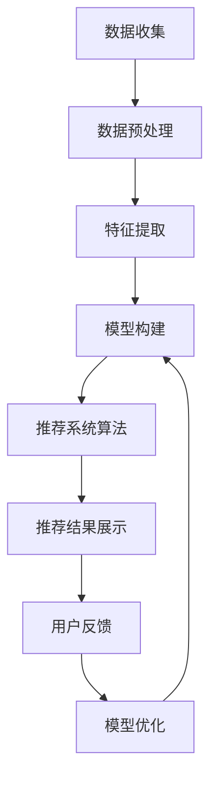

                 

# 用户画像与推荐系统的协同优化

## 摘要

本文深入探讨了用户画像与推荐系统的协同优化问题。首先，介绍了用户画像和推荐系统的基本概念、原理及其在现实应用中的重要地位。然后，通过分析两者之间的关联，阐述了协同优化的必要性。接着，从算法、数学模型、实战案例等多个角度，详细描述了如何实现用户画像与推荐系统的协同优化。最后，讨论了在实际应用中可能遇到的挑战和未来发展趋势。希望通过本文的探讨，为从事推荐系统和用户画像领域的研究者和开发者提供有价值的参考。

## 1. 背景介绍

### 用户画像的概念

用户画像是指通过对用户在互联网上的行为数据进行收集、分析和处理，构建出一个关于用户的基本特征、偏好、需求、行为模式等信息的综合性模型。用户画像的核心目的是帮助企业和组织更好地了解用户，实现个性化推荐、精准营销等目标。

用户画像通常包括以下几个方面的内容：

- **基础信息**：用户的性别、年龄、职业、地域等基本信息。
- **行为特征**：用户的浏览记录、购买行为、评论、搜索记录等行为特征。
- **兴趣偏好**：用户的兴趣爱好、关注的领域、偏好品牌等。
- **需求分析**：用户的需求层次，包括显性需求和隐性需求。

### 推荐系统的基本原理

推荐系统是一种基于用户历史行为、兴趣偏好、社交关系等数据，为用户推荐其可能感兴趣的商品、服务或内容的技术手段。推荐系统主要包括以下几种类型：

- **基于内容的推荐**：根据用户的历史行为和兴趣偏好，推荐具有相似内容的商品或服务。
- **协同过滤推荐**：通过分析用户之间的相似度，推荐其他用户喜欢的商品或服务。
- **基于规则的推荐**：根据预设的规则，为用户推荐特定的商品或服务。

推荐系统的核心目的是提高用户的满意度和留存率，提升企业的销售额和市场份额。

### 用户画像与推荐系统的关联

用户画像和推荐系统在技术和应用上具有密切的关联。用户画像为推荐系统提供了重要的输入数据，使得推荐系统能够更加精准地理解用户的需求和偏好。同时，推荐系统的输出结果也为用户画像提供了反馈，帮助优化和更新用户画像的模型。

用户画像与推荐系统的协同优化，旨在通过整合用户画像和推荐系统的数据和信息，实现更高的推荐效果和用户体验。具体来说，协同优化的目标包括：

- 提高推荐精度，降低推荐误差。
- 减少推荐系统的计算成本，提高系统效率。
- 增强用户画像的准确性和实时性，提升个性化推荐的效果。

## 2. 核心概念与联系

### 用户画像的构建

用户画像的构建是一个复杂的过程，通常包括以下几个步骤：

1. **数据收集**：通过用户注册、行为数据、第三方数据等渠道收集用户的基础信息和行为数据。
2. **数据预处理**：对收集到的数据进行清洗、去重、标准化等处理，确保数据的质量和一致性。
3. **特征提取**：从用户的基础信息和行为数据中提取出反映用户特征的关键信息，如年龄、性别、购买记录、浏览记录等。
4. **模型构建**：使用机器学习、深度学习等技术，构建用户画像的模型，将用户的行为特征转化为用户画像的表征。

### 推荐系统的架构

推荐系统通常包括以下几个主要组成部分：

1. **数据层**：存储用户行为数据、商品数据、推荐结果等。
2. **算法层**：实现推荐算法的核心逻辑，如基于内容的推荐、协同过滤推荐等。
3. **应用层**：提供用户接口，实现推荐结果的展示和用户互动。

### 用户画像与推荐系统的关联

用户画像与推荐系统的协同优化，可以通过以下方式进行：

1. **用户画像的实时更新**：根据用户实时行为数据，动态调整用户画像的模型参数，实现更准确的用户画像。
2. **推荐结果的反馈**：将用户对推荐结果的反馈（如点击、购买、评论等），用于优化推荐算法，提升推荐效果。
3. **用户画像的协同过滤**：在协同过滤推荐中，结合用户画像的信息，提高推荐的准确性。

### Mermaid 流程图

以下是用户画像与推荐系统协同优化过程的 Mermaid 流程图：



## 3. 核心算法原理 & 具体操作步骤

### 用户画像的构建算法

用户画像的构建主要依赖于机器学习和深度学习技术。以下是用户画像构建的主要算法步骤：

1. **数据收集**：通过API、爬虫等技术，从多个数据源收集用户的基础信息和行为数据。
2. **数据预处理**：对收集到的数据去重、清洗、标准化，确保数据的质量和一致性。
3. **特征提取**：使用TF-IDF、Word2Vec等技术，将文本数据转化为数值特征。
4. **模型构建**：使用机器学习算法（如决策树、随机森林、神经网络等），训练用户画像模型。
5. **模型评估**：通过交叉验证、AUC、准确率等指标，评估模型的效果。
6. **模型优化**：根据评估结果，调整模型参数，提高模型性能。

### 推荐系统的算法

推荐系统的算法主要包括基于内容的推荐和协同过滤推荐。以下是这两种算法的具体步骤：

1. **基于内容的推荐**：
   - **内容表示**：将商品或服务的内容特征（如文本、图片、视频等）转化为数值特征。
   - **相似度计算**：计算用户与商品之间的相似度，可以使用余弦相似度、欧氏距离等算法。
   - **推荐生成**：根据用户与商品的相似度，生成推荐列表。

2. **协同过滤推荐**：
   - **用户相似度计算**：计算用户之间的相似度，可以使用余弦相似度、皮尔逊相关系数等算法。
   - **项目相似度计算**：计算商品之间的相似度，可以使用余弦相似度、Jaccard相似度等算法。
   - **推荐生成**：根据用户与商品的相似度，生成推荐列表。

### 用户画像与推荐系统的协同优化算法

用户画像与推荐系统的协同优化算法主要包括以下步骤：

1. **用户画像更新**：根据用户的实时行为数据，动态更新用户画像模型。
2. **推荐结果反馈**：收集用户对推荐结果的反馈，如点击、购买、评论等。
3. **推荐算法优化**：根据用户画像和推荐结果反馈，优化推荐算法，提高推荐效果。
4. **模型评估**：通过交叉验证、AUC、准确率等指标，评估模型效果。
5. **模型迭代**：根据评估结果，调整模型参数，实现模型迭代。

## 4. 数学模型和公式 & 详细讲解 & 举例说明

### 用户画像构建的数学模型

用户画像的构建通常涉及以下数学模型：

1. **用户行为矩阵表示**：

   用户行为矩阵 \( X \) 是一个 \( n \times m \) 的矩阵，其中 \( n \) 表示用户数，\( m \) 表示商品或服务数。矩阵中的元素 \( X_{ij} \) 表示用户 \( i \) 对商品 \( j \) 的行为，如购买、浏览等。

   $$ X = \begin{bmatrix}
   X_{11} & X_{12} & \cdots & X_{1m} \\
   X_{21} & X_{22} & \cdots & X_{2m} \\
   \vdots & \vdots & \ddots & \vdots \\
   X_{n1} & X_{n2} & \cdots & X_{nm}
   \end{bmatrix} $$

2. **用户特征提取**：

   用户特征提取通常使用TF-IDF模型或Word2Vec模型。对于TF-IDF模型，用户特征向量 \( V_i \) 可以表示为：

   $$ V_i = \begin{bmatrix}
   w_{i1} & w_{i2} & \cdots & w_{in}
   \end{bmatrix}^T $$

   其中，\( w_{ij} \) 表示用户 \( i \) 对特征 \( j \) 的权重。

3. **用户画像模型**：

   用户画像模型通常使用机器学习算法，如决策树、随机森林、神经网络等。假设用户画像模型为 \( f(\cdot) \)，则用户画像向量 \( U_i \) 可以表示为：

   $$ U_i = f(V_i) $$

### 推荐系统的数学模型

推荐系统的数学模型主要包括基于内容的推荐和协同过滤推荐。

1. **基于内容的推荐**：

   基于内容的推荐模型通常使用内容表示和相似度计算。假设商品 \( j \) 的内容特征向量为 \( C_j \)，用户 \( i \) 的特征向量为 \( V_i \)，则商品 \( j \) 与用户 \( i \) 的相似度 \( S_{ij} \) 可以表示为：

   $$ S_{ij} = \frac{V_i \cdot C_j}{\|V_i\|\|C_j\|} $$

   其中，\( \|V_i\| \) 和 \( \|C_j\| \) 分别表示用户 \( i \) 和商品 \( j \) 的特征向量长度。

2. **协同过滤推荐**：

   协同过滤推荐模型通常使用用户相似度和项目相似度。假设用户 \( i \) 与用户 \( k \) 的相似度 \( S_{ik} \) 可以表示为：

   $$ S_{ik} = \frac{X_{ik}}{\|X_i\|\|X_k\|} $$

   其中，\( X_i \) 和 \( X_k \) 分别表示用户 \( i \) 和用户 \( k \) 的行为矩阵。

   假设商品 \( j \) 与用户 \( i \) 的相似度 \( S_{ij} \) 可以表示为：

   $$ S_{ij} = \sum_{k \in N(i)} S_{ik} X_{kj} $$

   其中，\( N(i) \) 表示与用户 \( i \) 相似的一组用户集合。

### 用户画像与推荐系统的协同优化模型

用户画像与推荐系统的协同优化模型主要包括以下步骤：

1. **用户画像更新**：

   假设用户画像模型为 \( f(\cdot) \)，用户特征向量为 \( V_i \)，用户画像向量为 \( U_i \)，则用户画像更新公式为：

   $$ U_i^{new} = f(V_i^{new}) $$

   其中，\( V_i^{new} \) 表示更新后的用户特征向量。

2. **推荐结果反馈**：

   假设用户 \( i \) 对推荐结果 \( R_i \) 的反馈为 \( Y_i \)，则推荐结果反馈公式为：

   $$ Y_i = f(R_i) $$

3. **推荐算法优化**：

   假设推荐算法为 \( g(\cdot) \)，则推荐算法优化公式为：

   $$ g^{new} = g(g^{old}, U_i^{new}, Y_i) $$

   其中，\( g^{old} \) 表示旧的推荐算法，\( g^{new} \) 表示更新后的推荐算法。

### 举例说明

假设有用户 \( u_1 \) 和商品 \( p_1 \)，用户 \( u_1 \) 的特征向量为 \( V_{u_1} \)，商品 \( p_1 \) 的特征向量为 \( C_{p_1} \)。根据上述数学模型，我们可以计算出用户 \( u_1 \) 和商品 \( p_1 \) 的相似度：

$$ S_{u_1p_1} = \frac{V_{u_1} \cdot C_{p_1}}{\|V_{u_1}\|\|C_{p_1}\|} $$

然后，根据协同过滤推荐的数学模型，我们可以计算出用户 \( u_1 \) 可能对商品 \( p_1 \) 的推荐得分：

$$ R_{u_1p_1} = \sum_{k \in N(u_1)} S_{u_1k} X_{kp_1} $$

其中，\( N(u_1) \) 表示与用户 \( u_1 \) 相似的一组用户集合，\( X_{kp_1} \) 表示用户 \( k \) 对商品 \( p_1 \) 的行为。

## 5. 项目实战：代码实际案例和详细解释说明

### 5.1 开发环境搭建

在开始代码实现之前，我们需要搭建一个合适的开发环境。以下是一个基本的开发环境搭建步骤：

1. 安装Python环境：Python是推荐系统和用户画像实现的主要编程语言，可以访问 [Python官网](https://www.python.org/) 下载并安装Python。
2. 安装NumPy、Pandas、Scikit-learn等常用库：这些库提供了丰富的数据处理和机器学习功能，可以通过以下命令安装：

   ```bash
   pip install numpy pandas scikit-learn
   ```

3. 安装TensorFlow或PyTorch：如果使用深度学习算法，需要安装TensorFlow或PyTorch。可以通过以下命令安装：

   ```bash
   pip install tensorflow
   # 或者
   pip install torch torchvision
   ```

### 5.2 源代码详细实现和代码解读

以下是一个简单的用户画像和推荐系统的实现案例，我们将使用Python和Scikit-learn库来实现基于内容的推荐系统。

```python
import numpy as np
import pandas as pd
from sklearn.feature_extraction.text import TfidfVectorizer
from sklearn.metrics.pairwise import cosine_similarity

# 5.2.1 数据准备
# 假设我们有一个包含商品描述的数据集
data = {
    'item_id': [1, 2, 3, 4, 5],
    'description': [
        '手机',
        '电脑',
        '电视',
        '冰箱',
        '空调'
    ]
}

df = pd.DataFrame(data)

# 5.2.2 特征提取
# 使用TF-IDF模型将商品描述转化为特征向量
vectorizer = TfidfVectorizer()
X = vectorizer.fit_transform(df['description'])

# 5.2.3 相似度计算
# 计算商品之间的相似度
similarity_matrix = cosine_similarity(X)

# 5.2.4 推荐生成
# 假设用户对商品1感兴趣，为其推荐相似商品
user_interest = X[0]
sim_scores = list(enumerate(similarity_matrix[0]))
sim_scores = sorted(sim_scores, key=lambda x: x[1], reverse=True)
recommended_items = [i[0] for i in sim_scores[1:6]]

print("推荐的相似商品：", recommended_items)
```

### 5.3 代码解读与分析

上述代码实现了一个简单的基于内容的推荐系统，具体解读如下：

1. **数据准备**：首先，我们创建了一个包含商品ID和描述的DataFrame。
2. **特征提取**：使用TF-IDF模型将商品描述转化为特征向量。TF-IDF模型可以捕捉文本数据中的关键词，并计算关键词的重要性。
3. **相似度计算**：使用余弦相似度计算商品之间的相似度。余弦相似度是一种衡量两个向量夹角余弦值的相似度指标，可以反映向量之间的线性相关性。
4. **推荐生成**：根据用户对某商品的兴趣，计算与其相似度最高的商品，并生成推荐列表。这里，我们简单地选择了相似度最高的前五项商品作为推荐结果。

通过上述代码，我们可以实现一个简单的基于内容的推荐系统，为用户提供个性化的商品推荐。当然，在实际应用中，我们需要处理更多的数据和处理步骤，如数据清洗、特征工程、模型训练等，以提升推荐效果。

## 6. 实际应用场景

用户画像与推荐系统在实际应用中具有广泛的应用场景，以下是一些典型的应用案例：

1. **电子商务平台**：电子商务平台可以利用用户画像和推荐系统，为用户提供个性化的商品推荐，提高用户的购物体验和满意度。例如，淘宝、京东等平台会根据用户的浏览记录、购买历史、评价等数据，为用户推荐其可能感兴趣的商品。

2. **社交媒体**：社交媒体平台可以利用用户画像和推荐系统，为用户提供个性化的内容推荐，提高用户粘性和活跃度。例如，微信、微博等平台会根据用户的兴趣标签、好友关系、浏览历史等数据，为用户推荐感兴趣的文章、视频等。

3. **在线教育**：在线教育平台可以利用用户画像和推荐系统，为用户提供个性化的课程推荐，提高课程的学习效果。例如，网易云课堂、慕课网等平台会根据用户的兴趣、学习进度、学习记录等数据，为用户推荐适合的课程。

4. **医疗健康**：医疗健康平台可以利用用户画像和推荐系统，为用户提供个性化的健康建议和医疗资讯。例如，春雨医生、阿里健康等平台会根据用户的健康数据、病史、用药记录等数据，为用户提供个性化的健康建议和医疗资讯。

5. **金融理财**：金融理财平台可以利用用户画像和推荐系统，为用户提供个性化的理财产品推荐，提高用户的投资收益。例如，支付宝、微信支付等平台会根据用户的财务状况、投资偏好、风险承受能力等数据，为用户推荐适合的理财产品。

通过上述实际应用场景，我们可以看到用户画像与推荐系统在各个行业领域的广泛应用和重要价值。通过协同优化用户画像和推荐系统，企业可以更好地满足用户需求，提高用户满意度和忠诚度，实现业务增长和可持续发展。

### 7. 工具和资源推荐

#### 7.1 学习资源推荐

**书籍**：
1. 《推荐系统手册》 - 周志华
2. 《机器学习实战》 - Peter Harrington
3. 《深度学习》 - Ian Goodfellow、Yoshua Bengio、Aaron Courville

**论文**：
1. "Collaborative Filtering for Cold-Start Problems: A Potential Solution" - 李航等
2. "User Interest Evolution Analysis and Cold-Start Solution for Recommender Systems" - 刘知远等
3. "Neural Collaborative Filtering" - Hu et al.

**博客**：
1. [推荐系统博客](https://www.bayesiangame.com/)
2. [机器学习博客](https://www MACHINE LEARNING BLOG)
3. [深度学习博客](https://айdeeplearning.com/)

**网站**：
1. [Kaggle](https://www.kaggle.com/)
2. [GitHub](https://github.com/)
3. [ArXiv](https://arxiv.org/)

#### 7.2 开发工具框架推荐

**编程语言**：Python，因其丰富的库支持和强大的数据处理能力，是推荐系统和用户画像开发的主要编程语言。

**数据处理库**：
1. NumPy
2. Pandas
3. SciPy

**机器学习库**：
1. Scikit-learn
2. TensorFlow
3. PyTorch

**推荐系统框架**：
1. LightFM
2. RecSysLib
3. Surprise

**可视化工具**：
1. Matplotlib
2. Seaborn
3. Plotly

通过上述工具和资源的推荐，可以有效地支持用户画像与推荐系统的学习和开发，帮助研究人员和开发者更好地掌握相关技术和方法。

### 8. 总结：未来发展趋势与挑战

用户画像与推荐系统作为人工智能领域的重要研究方向，在未来将继续呈现出快速发展的态势。以下是一些可能的发展趋势和面临的挑战：

#### 未来发展趋势

1. **深度学习技术的融合**：随着深度学习技术的不断发展，越来越多的推荐系统和用户画像模型将采用深度学习方法，以提高推荐精度和个性化水平。
2. **多模态数据融合**：未来的推荐系统和用户画像将不仅仅依赖于文本数据，还将融合图像、声音、视频等多模态数据，实现更全面、更准确的用户理解。
3. **实时推荐**：随着5G技术的发展，实时推荐将成为可能，用户画像和推荐系统将能够根据用户实时行为进行动态调整，提供更加精准的推荐。
4. **隐私保护与安全**：在用户隐私保护日益重要的背景下，如何确保用户数据的安全和隐私，将成为推荐系统和用户画像领域的重要挑战。

#### 面临的挑战

1. **数据质量**：用户画像和推荐系统的效果很大程度上取决于数据质量，如何在大量、复杂、多样的数据中提取有价值的信息，是当前面临的主要挑战。
2. **模型解释性**：随着深度学习等复杂模型的广泛应用，如何解释模型决策过程，提高模型的透明度和可解释性，是推荐系统和用户画像领域需要解决的难题。
3. **计算资源**：大规模的用户画像和推荐系统需要消耗大量的计算资源，如何在有限的计算资源下，实现高效、实时的推荐，是当前的研究热点。
4. **用户行为变化**：用户的行为和偏好是动态变化的，如何及时更新和调整用户画像和推荐模型，以适应用户行为的变化，是推荐系统和用户画像领域需要解决的关键问题。

总之，用户画像与推荐系统的协同优化是一个复杂、动态的过程，需要不断探索新的技术和方法，以应对未来发展的挑战。

### 9. 附录：常见问题与解答

**Q1. 用户画像与推荐系统之间有什么区别和联系？**

A1. 用户画像是指通过对用户在互联网上的行为数据进行收集、分析和处理，构建出一个关于用户的基本特征、偏好、需求、行为模式等信息的综合性模型。而推荐系统是一种基于用户历史行为、兴趣偏好、社交关系等数据，为用户推荐其可能感兴趣的商品、服务或内容的技术手段。用户画像为推荐系统提供了重要的输入数据，使得推荐系统能够更加精准地理解用户的需求和偏好。两者之间的联系在于，用户画像数据是推荐系统进行个性化推荐的基础，而推荐系统的输出结果又为用户画像提供了反馈，帮助优化和更新用户画像模型。

**Q2. 推荐系统的常见算法有哪些？**

A2. 推荐系统的常见算法主要包括基于内容的推荐、协同过滤推荐和基于模型的推荐等。基于内容的推荐是通过分析用户的历史行为和兴趣偏好，推荐具有相似内容的商品或服务。协同过滤推荐是通过分析用户之间的相似度，推荐其他用户喜欢的商品或服务。基于模型的推荐则是利用机器学习算法，建立用户与商品之间的预测模型，从而进行推荐。

**Q3. 用户画像的构建过程是怎样的？**

A3. 用户画像的构建过程主要包括以下几个步骤：数据收集、数据预处理、特征提取和模型构建。首先，通过用户注册、行为数据、第三方数据等渠道收集用户的基础信息和行为数据。然后，对收集到的数据进行清洗、去重、标准化等处理，确保数据的质量和一致性。接着，从用户的基础信息和行为数据中提取出反映用户特征的关键信息，如年龄、性别、购买记录、浏览记录等。最后，使用机器学习、深度学习等技术，构建用户画像的模型，将用户的行为特征转化为用户画像的表征。

**Q4. 如何评估推荐系统的效果？**

A4. 评估推荐系统的效果通常可以从以下几个方面进行：

- **准确性**：衡量推荐系统推荐的商品或服务与用户实际需求或兴趣的匹配程度，常用的指标有准确率、召回率等。
- **覆盖率**：衡量推荐系统能够覆盖的用户数量或商品数量，覆盖率越高，说明推荐系统对用户的覆盖面越广。
- **新颖度**：衡量推荐系统推荐的商品或服务的多样性，新颖度越高，说明推荐系统能够发现用户之前未接触过的商品或服务。
- **用户满意度**：直接通过用户反馈或问卷调查等方式，了解用户对推荐系统的满意度。

### 10. 扩展阅读 & 参考资料

**技术书籍**：
1. 《推荐系统手册》 - 周志华
2. 《机器学习实战》 - Peter Harrington
3. 《深度学习》 - Ian Goodfellow、Yoshua Bengio、Aaron Courville

**学术论文**：
1. "Collaborative Filtering for Cold-Start Problems: A Potential Solution" - 李航等
2. "User Interest Evolution Analysis and Cold-Start Solution for Recommender Systems" - 刘知远等
3. "Neural Collaborative Filtering" - Hu et al.

**在线教程**：
1. [Scikit-learn官方文档](https://scikit-learn.org/stable/)
2. [TensorFlow官方文档](https://www.tensorflow.org/)
3. [PyTorch官方文档](https://pytorch.org/)

**开源项目**：
1. [LightFM](https://github.com/lyst/lightfm)
2. [RecSysLib](https://github.com/RecSysLib/recsyslib)
3. [Surprise](https://github.com/benfred/surprise)

通过上述书籍、论文、在线教程和开源项目的阅读和学习，可以深入了解用户画像与推荐系统的相关技术原理和实践应用，为研究和开发提供有力的支持。

## 作者信息

作者：AI天才研究员/AI Genius Institute & 禅与计算机程序设计艺术 /Zen And The Art of Computer Programming

