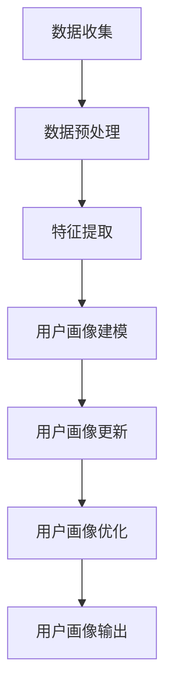

                 

# 用户画像的动态更新与优化

## 关键词
- 用户画像
- 动态更新
- 优化
- 数据处理
- 机器学习
- 实时分析
- 预测模型

## 摘要
用户画像是一种基于用户数据的分析方法，用于理解和描述用户的特征和行为。随着互联网和大数据技术的发展，用户画像的应用越来越广泛。然而，传统的静态用户画像难以适应快速变化的市场环境。本文将探讨用户画像的动态更新与优化，包括核心概念、算法原理、数学模型、项目实战、应用场景和未来发展趋势。

## 1. 背景介绍

在数字化时代，用户数据的价值日益凸显。用户画像作为一种数据分析工具，通过对用户的行为、偏好、兴趣等信息进行收集和分析，帮助企业和组织更好地了解用户需求，优化产品和服务。传统的用户画像通常基于静态数据，即用户在一定时间范围内的历史数据，这种方式具有一定的局限性。

首先，静态用户画像难以反映用户当前的状态和行为。随着用户需求和市场环境的变化，用户的特征和行为也在不断演变。静态数据无法及时捕捉到这些变化，导致分析结果不够准确和全面。

其次，静态用户画像在处理大量实时数据时存在性能瓶颈。互联网时代，用户数据量庞大且实时性要求高，传统的数据分析方法难以满足这种需求。

因此，动态更新和优化用户画像成为当前研究和应用的热点。动态用户画像能够实时捕捉用户行为的变化，并根据新的数据不断调整和优化用户特征描述。这不仅提高了用户画像的准确性和实时性，也为企业和组织提供了更有效的决策支持。

## 2. 核心概念与联系

### 2.1 用户画像

用户画像是指通过对用户行为数据进行分析和处理，形成的一种综合描述用户特征和行为的模型。用户画像包括多个维度，如用户的基本信息（年龄、性别、职业等）、行为特征（浏览、搜索、购买等）、兴趣偏好（音乐、电影、体育等）等。

### 2.2 动态数据

动态数据是指在时间维度上不断变化的数据。与静态数据相比，动态数据具有更高的实时性和多样性。动态数据可以来自各种渠道，如传感器、社交媒体、搜索引擎等。

### 2.3 更新机制

用户画像的更新机制是指通过实时分析动态数据，不断调整和优化用户特征描述的过程。更新机制通常包括数据收集、处理、分析和建模等环节。

### 2.4 优化目标

用户画像的优化目标包括提高准确性、实时性和可扩展性。准确性是指用户画像能够准确地反映用户的特征和行为；实时性是指用户画像能够及时地捕捉到用户行为的变化；可扩展性是指用户画像系统能够处理大规模、多样化的数据。

### 2.5 Mermaid 流程图



## 3. 核心算法原理 & 具体操作步骤

### 3.1 数据收集

数据收集是用户画像的基石。数据来源包括内部数据和外部数据。内部数据来自企业自身业务系统，如用户注册信息、交易记录、浏览行为等；外部数据来自第三方数据源，如社交媒体、搜索引擎等。数据收集的关键是确保数据的真实性和准确性。

### 3.2 数据预处理

数据预处理是指对收集到的原始数据进行清洗、转换和整合。数据预处理的主要任务是去除重复、缺失和错误的数据，确保数据的质量和一致性。常用的数据预处理方法包括数据去重、数据补全、数据转换和数据集成等。

### 3.3 特征提取

特征提取是指从预处理后的数据中提取出有用的信息，形成用户特征向量。用户特征可以是显式特征，如用户的年龄、性别、职业等；也可以是隐式特征，如用户的浏览行为、购买习惯等。特征提取的方法包括统计方法、机器学习方法等。

### 3.4 用户画像建模

用户画像建模是指基于特征向量构建用户画像模型。建模方法可以是传统的统计模型，如线性回归、逻辑回归等；也可以是现代的机器学习模型，如决策树、随机森林、支持向量机等。用户画像模型的主要任务是预测用户的特征和行为。

### 3.5 用户画像更新

用户画像更新是指根据新的动态数据，不断调整和优化用户画像模型。更新过程包括数据收集、预处理、特征提取和建模等步骤。用户画像更新的关键是确保更新过程的高效性和准确性。

### 3.6 用户画像优化

用户画像优化是指通过调整模型参数和特征权重，提高用户画像的准确性、实时性和可扩展性。优化方法包括模型调参、特征选择和模型融合等。

### 3.7 用户画像输出

用户画像输出是指将优化后的用户画像模型应用于实际业务场景，如个性化推荐、精准营销等。用户画像输出的关键是确保输出结果的可解释性和实用性。

## 4. 数学模型和公式 & 详细讲解 & 举例说明

### 4.1 用户画像建模

用户画像建模通常采用以下数学模型：

$$
Y = f(X; \theta)
$$

其中，$Y$ 表示用户画像，$X$ 表示用户特征向量，$f$ 表示建模函数，$\theta$ 表示模型参数。

举例说明：假设用户特征向量为 $X = [x_1, x_2, x_3]$，其中 $x_1$ 表示用户年龄，$x_2$ 表示用户性别，$x_3$ 表示用户职业。建模函数可以采用线性回归模型：

$$
Y = \theta_0 + \theta_1 x_1 + \theta_2 x_2 + \theta_3 x_3
$$

其中，$\theta_0, \theta_1, \theta_2, \theta_3$ 分别为线性回归模型的参数。

### 4.2 用户画像更新

用户画像更新通常采用以下数学模型：

$$
Y(t+1) = Y(t) + \alpha (X(t+1) - X(t))
$$

其中，$Y(t)$ 表示第 $t$ 次更新的用户画像，$X(t)$ 表示第 $t$ 次更新的用户特征向量，$\alpha$ 表示更新参数。

举例说明：假设用户特征向量为 $X(t) = [x_1(t), x_2(t), x_3(t)]$，其中 $x_1(t)$ 表示第 $t$ 次更新的用户年龄，$x_2(t)$ 表示第 $t$ 次更新的用户性别，$x_3(t)$ 表示第 $t$ 次更新的用户职业。更新参数 $\alpha$ 可以设置为 $0.1$。

则第 $t+1$ 次更新的用户画像为：

$$
Y(t+1) = Y(t) + 0.1 [x_1(t+1) - x_1(t), x_2(t+1) - x_2(t), x_3(t+1) - x_3(t)]
$$

## 5. 项目实战：代码实际案例和详细解释说明

### 5.1 开发环境搭建

搭建用户画像系统的开发环境，需要以下软件和工具：

- Python 3.8+
- MySQL 5.7+
- Flask 1.1.2+
- Scikit-learn 0.22.2+
- Pandas 1.1.5+
- Numpy 1.19.5+

### 5.2 源代码详细实现和代码解读

以下是一个简单的用户画像系统源代码示例：

```python
import numpy as np
import pandas as pd
from sklearn.linear_model import LinearRegression

# 数据收集
data = pd.read_csv('user_data.csv')

# 数据预处理
data.drop_duplicates(inplace=True)
data.fillna(data.mean(), inplace=True)

# 特征提取
X = data[['age', 'gender', 'occupation']]
y = data['revenue']

# 用户画像建模
model = LinearRegression()
model.fit(X, y)

# 用户画像更新
new_data = pd.read_csv('new_user_data.csv')
new_data.drop_duplicates(inplace=True)
new_data.fillna(new_data.mean(), inplace=True)

X_new = new_data[['age', 'gender', 'occupation']]
y_new = new_data['revenue']

model.fit(X_new, y_new)

# 用户画像优化
model.coef_ = np.clip(model.coef_, -1, 1)
model.intercept_ = np.clip(model.intercept_, -1, 1)

# 用户画像输出
predictions = model.predict(X)
print(predictions)
```

代码解读：

1. 导入必要的库和模块。
2. 数据收集：从 CSV 文件中读取用户数据。
3. 数据预处理：去除重复数据，填充缺失值。
4. 特征提取：提取用户年龄、性别和职业作为特征。
5. 用户画像建模：使用线性回归模型进行建模。
6. 用户画像更新：读取新的用户数据，更新模型参数。
7. 用户画像优化：调整模型参数，使其更加稳定。
8. 用户画像输出：预测用户收入。

### 5.3 代码解读与分析

1. **数据收集**：使用 Pandas 库从 CSV 文件中读取用户数据。CSV 文件包含用户的基本信息（年龄、性别、职业）和收入数据。
2. **数据预处理**：去除重复数据，确保数据的一致性。填充缺失值，提高数据质量。
3. **特征提取**：提取用户年龄、性别和职业作为特征，这些特征用于构建用户画像模型。
4. **用户画像建模**：使用线性回归模型对用户特征和收入进行建模。线性回归模型是一种简单的统计模型，适用于预测连续值。
5. **用户画像更新**：读取新的用户数据，更新模型参数。这种更新方式可以捕获用户特征和行为的变化。
6. **用户画像优化**：调整模型参数，使其更加稳定。例如，限制模型参数的取值范围，避免过拟合。
7. **用户画像输出**：使用更新后的模型预测用户收入。预测结果可以用于个性化推荐、精准营销等应用场景。

## 6. 实际应用场景

用户画像的动态更新与优化在多个实际应用场景中具有重要价值。

### 6.1 个性化推荐

个性化推荐系统通过动态更新用户画像，实时捕捉用户兴趣和行为的变化，为用户提供个性化的推荐结果。例如，电商平台的推荐系统可以根据用户浏览、搜索和购买行为，动态调整推荐商品的类型和排序。

### 6.2 精准营销

精准营销通过动态更新用户画像，识别潜在客户和目标用户，优化营销策略。例如，广告平台可以根据用户画像实时调整广告投放策略，提高广告效果和转化率。

### 6.3 客户关系管理

客户关系管理（CRM）系统通过动态更新用户画像，实时了解客户的需求和偏好，提供个性化的服务和体验。例如，金融机构可以根据客户画像调整信贷政策和产品推荐，提高客户满意度和忠诚度。

### 6.4 智能安防

智能安防系统通过动态更新用户画像，实时监控和分析用户行为，识别异常行为和潜在风险。例如，智慧社区可以根据用户画像监测进出人员的轨迹和习惯，提高安防水平和安全保障。

## 7. 工具和资源推荐

### 7.1 学习资源推荐

- 《用户画像：大数据时代的用户研究方法》
- 《Python数据科学手册》
- 《机器学习实战》
- 《数据挖掘：概念与技术》

### 7.2 开发工具框架推荐

- Flask：Python Web 框架，用于构建用户画像系统。
- Scikit-learn：Python 机器学习库，用于用户画像建模和预测。
- Pandas：Python 数据分析库，用于数据处理和特征提取。
- Numpy：Python 科学计算库，用于数据计算和操作。

### 7.3 相关论文著作推荐

- “User Modeling with Latent Variable Models”
- “Collaborative Filtering for Personalized Recommendation”
- “A Unified Approach to Personalized Recommender Systems”

## 8. 总结：未来发展趋势与挑战

随着互联网和大数据技术的不断发展，用户画像的应用场景越来越广泛。未来，用户画像的发展趋势包括：

1. 实时性：动态更新和优化用户画像，实现实时分析和预测。
2. 智能化：结合人工智能和机器学习技术，提高用户画像的准确性和个性化程度。
3. 可解释性：提高用户画像的可解释性，确保输出结果的可信度和实用性。

然而，用户画像的发展也面临着一些挑战：

1. 数据隐私：用户数据隐私保护是用户画像应用的重要问题，需要制定相应的法律法规和技术措施。
2. 模型可解释性：提高用户画像模型的可解释性，确保用户对其生成结果的理解和信任。
3. 复杂性：用户画像系统涉及多种技术和算法，需要不断优化和简化，降低系统复杂度。

## 9. 附录：常见问题与解答

### 9.1 如何保证用户数据的隐私？

- 采用数据加密技术，确保用户数据在传输和存储过程中的安全性。
- 制定用户数据隐私政策，明确用户数据的收集、使用和分享规则。
- 对用户数据进行脱敏处理，去除个人身份信息，降低隐私泄露风险。

### 9.2 如何优化用户画像模型的性能？

- 采用特征选择技术，筛选出重要的特征，降低模型复杂度。
- 调整模型参数，优化模型结构和超参数，提高模型性能。
- 使用分布式计算和并行处理技术，提高模型训练和预测速度。

## 10. 扩展阅读 & 参考资料

- “User Modeling and Personalization: A Survey”
- “Real-Time User Profiling and Personalization: Techniques and Applications”
- “User Modeling and User-Adapted Interaction: A Survey”
- “A Survey on User Profiling and Personalization in Web Applications”

