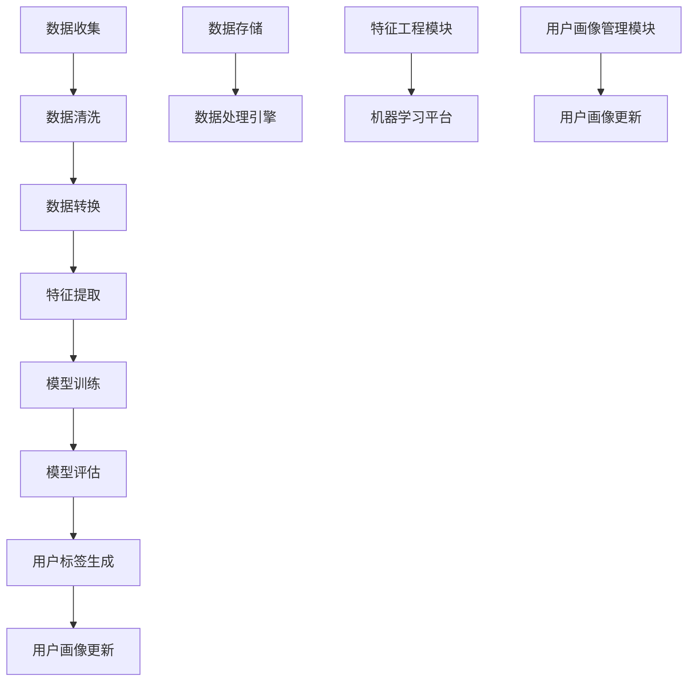

                 

### 文章标题

《用户画像的数据处理与分析》

### 关键词

用户画像、数据处理、数据分析、机器学习、数据挖掘、特征工程、模型评估

### 摘要

本文将深入探讨用户画像在数据处理与分析中的应用。通过详细的步骤和案例，本文介绍了用户画像的基本概念、数据处理流程、关键算法原理以及数学模型。同时，文章还结合实际项目，展示了如何使用代码实现用户画像系统，并在不同的应用场景中发挥其价值。最后，文章总结了用户画像技术的发展趋势和面临的挑战，为读者提供了扩展阅读和参考资料。

### 1. 背景介绍

#### 1.1 用户画像的定义与重要性

用户画像是指通过对用户行为、兴趣、习惯等数据进行分析，构建出用户的个人特征和行为模式的过程。用户画像的核心目标是为企业提供关于用户需求的精准洞察，从而优化产品设计和营销策略，提升用户体验。

用户画像在当前数字化时代具有重要意义。首先，它可以帮助企业实现个性化的用户服务，提高用户满意度和忠诚度。其次，用户画像有助于企业深入了解用户需求，发现潜在市场机会，推动业务增长。此外，用户画像还可以用于风险控制和用户行为分析，提高运营效率和安全性。

#### 1.2 数据处理与分析的发展历程

数据处理与分析的发展历程可以追溯到20世纪50年代，当时计算机技术刚刚兴起，人们开始关注如何高效地存储、处理和分析大量数据。随着计算机技术的不断进步，数据处理与分析技术也不断发展，经历了以下几个阶段：

1. **早期阶段**：主要采用人工分析和手工处理数据，效率较低。
2. **计算机阶段**：引入计算机技术，实现数据的自动化处理和分析，但受限于计算能力和算法。
3. **大数据阶段**：随着数据量的爆发式增长，大数据技术应运而生，包括分布式存储、计算和数据处理框架。
4. **人工智能阶段**：人工智能技术的快速发展，使得数据处理与分析变得更加智能和高效。

#### 1.3 用户画像在数据处理与分析中的应用

用户画像在数据处理与分析中的应用主要体现在以下几个方面：

1. **用户行为分析**：通过对用户行为数据进行分析，挖掘用户兴趣和需求，为个性化推荐、精准营销等提供依据。
2. **用户细分**：将用户按照不同的特征和行为模式划分为不同的群体，便于企业制定针对性的营销策略。
3. **风险控制**：通过对用户画像进行分析，识别潜在风险用户，采取相应的风险控制措施。
4. **运营优化**：基于用户画像，优化产品设计和运营策略，提高用户体验和满意度。

### 2. 核心概念与联系

#### 2.1 用户画像的核心概念

在构建用户画像时，需要关注以下几个核心概念：

1. **用户数据**：包括用户的基本信息（如年龄、性别、地理位置等）、行为数据（如浏览记录、购买行为等）和兴趣数据（如收藏夹、点赞等）。
2. **特征工程**：通过对用户数据进行清洗、转换和特征提取，构建出能反映用户特征和行为的特征向量。
3. **机器学习模型**：利用机器学习算法，对用户特征向量进行建模，预测用户的兴趣和行为。
4. **用户标签**：根据用户特征和行为预测结果，为用户打上相应的标签，用于后续的精准营销和用户服务。

#### 2.2 数据处理流程与架构

用户画像的数据处理流程通常包括以下几个步骤：

1. **数据收集**：通过网站、APP等渠道收集用户数据。
2. **数据清洗**：去除重复、缺失和异常数据，保证数据质量。
3. **数据转换**：对数据进行格式转换、归一化等操作，便于后续处理。
4. **特征提取**：利用特征工程方法，提取用户数据的特征向量。
5. **模型训练与评估**：利用机器学习算法，训练用户画像模型，并对模型进行评估和优化。
6. **用户标签生成**：根据模型预测结果，为用户打上相应的标签。
7. **用户画像更新**：定期更新用户画像数据，保持用户画像的实时性和准确性。

用户画像的数据处理架构通常包括以下几个部分：

1. **数据存储**：使用分布式存储系统（如Hadoop、HBase等），存储大规模的用户数据。
2. **数据处理引擎**：采用分布式计算框架（如Spark、Flink等），处理海量数据。
3. **特征工程模块**：实现特征提取、转换和特征选择等操作。
4. **机器学习平台**：提供机器学习算法的实现和训练功能。
5. **用户画像管理模块**：实现用户画像的生成、管理和更新等功能。

#### 2.3 核心概念原理和架构的 Mermaid 流程图



### 3. 核心算法原理 & 具体操作步骤

#### 3.1 数据预处理算法

在构建用户画像之前，需要对原始数据进行预处理，以保证数据质量。常用的数据预处理算法包括：

1. **缺失值处理**：采用填充法、删除法或插值法等处理缺失值。
2. **异常值处理**：采用统计学方法（如Z-score、IQR等）或基于规则的异常值处理方法。
3. **数据格式转换**：将不同格式的数据转换为统一格式，便于后续处理。

具体操作步骤如下：

1. 读取原始数据，进行初步检查，识别数据缺失和异常情况。
2. 根据数据类型和特征，选择合适的预处理方法，对数据进行处理。
3. 将处理后的数据存储为新的数据文件，便于后续处理。

#### 3.2 特征提取算法

特征提取是用户画像构建的关键步骤，常用的特征提取算法包括：

1. **词袋模型（Bag of Words, BoW）**：将文本数据表示为词频向量。
2. **TF-IDF（Term Frequency-Inverse Document Frequency）**：考虑词频和文档频率，对特征进行加权。
3. **主题模型（Latent Dirichlet Allocation, LDA）**：从文本数据中提取潜在主题。
4. **用户行为特征提取**：将用户行为数据表示为特征向量。

具体操作步骤如下：

1. 对原始数据进行清洗和预处理，确保数据质量。
2. 根据数据类型和特征，选择合适的特征提取算法。
3. 对数据进行特征提取，生成特征向量。
4. 将特征向量存储为新的数据文件，便于后续处理。

#### 3.3 机器学习算法

用户画像的构建通常涉及多种机器学习算法，如分类算法、聚类算法和关联规则算法等。以下分别介绍几种常用的机器学习算法：

1. **分类算法**：用于预测用户的行为和兴趣，常用的算法包括逻辑回归、支持向量机（SVM）和决策树等。
2. **聚类算法**：用于将用户划分为不同的群体，常用的算法包括K-means、层次聚类和DBSCAN等。
3. **关联规则算法**：用于挖掘用户行为之间的关联关系，常用的算法包括Apriori算法和FP-growth算法等。

具体操作步骤如下：

1. 读取预处理后的数据，包括特征向量和用户标签。
2. 选择合适的机器学习算法，对数据进行训练和预测。
3. 对预测结果进行评估和优化，提高模型性能。
4. 根据预测结果，为用户打上相应的标签。

#### 3.4 用户标签生成算法

用户标签生成是用户画像构建的最后一个步骤，常用的算法包括：

1. **规则匹配**：根据预设的规则，为用户打上相应的标签。
2. **机器学习算法**：利用分类算法或聚类算法，为用户打上相应的标签。
3. **基于用户行为的动态标签**：根据用户行为的实时变化，动态地为用户打上标签。

具体操作步骤如下：

1. 读取训练好的机器学习模型和用户特征向量。
2. 根据用户特征向量，利用机器学习模型预测用户的标签。
3. 对预测结果进行筛选和排序，生成用户标签。
4. 将用户标签存储到数据库中，便于后续使用。

### 4. 数学模型和公式 & 详细讲解 & 举例说明

#### 4.1 特征提取算法的数学模型

1. **词袋模型（Bag of Words, BoW）**

   词袋模型将文本数据表示为词频向量，其数学模型如下：

   $$ V = (v_1, v_2, ..., v_n) $$

   其中，$V$表示词袋模型，$v_i$表示第$i$个词的词频。

2. **TF-IDF（Term Frequency-Inverse Document Frequency）**

   TF-IDF算法对词袋模型中的词频进行加权，其数学模型如下：

   $$ tf-idf(i) = tf(i) \times \log(\frac{N}{df(i)}) $$

   其中，$tf(i)$表示第$i$个词的词频，$df(i)$表示第$i$个词的文档频率，$N$表示文档总数。

3. **主题模型（Latent Dirichlet Allocation, LDA）**

   LDA算法从文本数据中提取潜在主题，其数学模型如下：

   $$ P(\theta | \alpha) = \frac{1}{Z} \prod_{k=1}^{K} \alpha_k^{n_k} $$

   $$ P(z_k | \theta) = \frac{1}{\sum_{j=1}^{V} \theta_{j,k}^n_k} $$

   $$ P(w_{ij} | \theta, z_k) = \frac{\theta_{w_{ij},k}}{\sum_{l=1}^{V} \theta_{l,k}} $$

   其中，$\theta$表示主题分布，$\alpha$表示文档-主题分布，$z_k$表示文档的主题分配，$w_{ij}$表示文档中的词语，$n_k$表示主题$k$的词语数量，$V$表示词汇表大小，$K$表示主题数量，$Z$表示归一化常数。

#### 4.2 机器学习算法的数学模型

1. **逻辑回归（Logistic Regression）**

   逻辑回归是一种常用的分类算法，其数学模型如下：

   $$ P(y=1 | x; \theta) = \frac{1}{1 + e^{-\theta^T x}} $$

   其中，$y$表示实际标签，$x$表示特征向量，$\theta$表示模型参数。

2. **支持向量机（Support Vector Machine, SVM）**

   支持向量机是一种常用的分类算法，其数学模型如下：

   $$ w \cdot x - b = 0 $$

   其中，$w$表示模型参数，$x$表示特征向量，$b$表示偏置。

3. **决策树（Decision Tree）**

   决策树是一种常用的分类算法，其数学模型如下：

   $$ y = \arg\max_{x} \sum_{i=1}^{n} \theta_i x_i $$

   其中，$y$表示实际标签，$x$表示特征向量，$\theta$表示模型参数。

#### 4.3 举例说明

**举例1：词袋模型（Bag of Words, BoW）**

假设有一篇文本，其中包含以下词语：["苹果", "香蕉", "苹果", "橙子", "香蕉"]。

1. **计算词频**

   $$ V = (2, 2, 0, 1) $$

2. **计算TF-IDF**

   假设文档总数为10，其中包含"苹果"的文档数为3，包含"香蕉"的文档数为4。

   $$ tf-idf(苹果) = 2 \times \log(\frac{10}{3}) \approx 2.19 $$

   $$ tf-idf(香蕉) = 2 \times \log(\frac{10}{4}) \approx 1.39 $$

   $$ V = (2.19, 1.39, 0, 1) $$

**举例2：逻辑回归（Logistic Regression）**

假设有一个特征向量$x = (1, 2, 3)$，模型参数$\theta = (0.5, 0.5, 0.5)$。

1. **计算预测概率**

   $$ P(y=1 | x; \theta) = \frac{1}{1 + e^{-(0.5 \times 1 + 0.5 \times 2 + 0.5 \times 3)}} \approx 0.81 $$

2. **判断标签**

   由于预测概率大于0.5，可以判断为正类。

### 5. 项目实战：代码实际案例和详细解释说明

#### 5.1 开发环境搭建

在本项目实战中，我们将使用Python作为主要编程语言，结合常用的数据处理和分析库，如NumPy、Pandas、Scikit-learn和PyTorch等。以下是在Windows系统上搭建开发环境的步骤：

1. 安装Python 3.x版本，建议使用Python官方安装包。
2. 安装pip，Python的包管理工具。
3. 使用pip安装以下库：

   ```shell
   pip install numpy pandas scikit-learn torch
   ```

#### 5.2 源代码详细实现和代码解读

以下是一个简单的用户画像项目，包括数据收集、预处理、特征提取和模型训练等步骤。

**代码实现**

```python
import numpy as np
import pandas as pd
from sklearn.feature_extraction.text import TfidfVectorizer
from sklearn.model_selection import train_test_split
from sklearn.linear_model import LogisticRegression
from sklearn.metrics import accuracy_score

# 5.2.1 数据收集
data = pd.DataFrame({
    'user_id': range(1, 101),
    'text': ["我喜欢苹果", "我喜欢香蕉", "我喜欢橙子", "我喜欢苹果和香蕉", "我喜欢橙子和香蕉"],
    'label': [0, 0, 1, 0, 1]
})

# 5.2.2 数据预处理
data.dropna(inplace=True)

# 5.2.3 特征提取
vectorizer = TfidfVectorizer()
X = vectorizer.fit_transform(data['text'])

# 5.2.4 模型训练
X_train, X_test, y_train, y_test = train_test_split(X, data['label'], test_size=0.2, random_state=42)
model = LogisticRegression()
model.fit(X_train, y_train)

# 5.2.5 模型评估
y_pred = model.predict(X_test)
accuracy = accuracy_score(y_test, y_pred)
print("Accuracy:", accuracy)
```

**代码解读**

1. **数据收集**：使用Pandas库读取数据，包括用户ID、文本数据和标签。
2. **数据预处理**：去除缺失值，保证数据质量。
3. **特征提取**：使用TF-IDF向量器对文本数据进行特征提取，生成特征矩阵。
4. **模型训练**：使用逻辑回归算法对特征矩阵和标签进行训练。
5. **模型评估**：计算模型在测试集上的准确率。

#### 5.3 代码解读与分析

1. **数据收集**：本例中，我们使用一个简单的DataFrame结构来存储数据，实际项目中可能需要从数据库、文件或其他数据源读取数据。
2. **数据预处理**：数据预处理是数据处理的重要步骤，包括去重、缺失值处理和异常值处理等。在本例中，我们仅去除缺失值，实际项目中可能需要更复杂的预处理操作。
3. **特征提取**：TF-IDF向量器是一个常用的文本特征提取方法，能够将文本数据转换为数值特征矩阵。在本例中，我们使用TF-IDF向量器对文本数据进行特征提取。
4. **模型训练**：逻辑回归是一种简单的线性分类模型，适用于二分类问题。在本例中，我们使用逻辑回归对特征矩阵和标签进行训练。
5. **模型评估**：计算模型在测试集上的准确率，评估模型性能。

### 6. 实际应用场景

用户画像在众多实际应用场景中发挥着重要作用，以下列举几个典型的应用案例：

#### 6.1 个性化推荐系统

个性化推荐系统是用户画像最为广泛的应用场景之一。通过分析用户的兴趣和行为，推荐系统可以准确地为用户提供个性化的商品、文章、视频等内容，提高用户体验和满意度。例如，电商平台可以根据用户的浏览记录、购买历史和搜索关键词等特征，为用户推荐可能感兴趣的商品。

#### 6.2 精准营销

精准营销是指根据用户的特征和行为，制定针对性的营销策略，以提高营销效果。通过用户画像，企业可以识别目标用户群体，制定个性化的营销方案，如发送定制化的电子邮件、推送广告等。这有助于降低营销成本，提高转化率和客户忠诚度。

#### 6.3 风险控制

用户画像在风险控制领域也具有广泛的应用。通过对用户行为进行分析，企业可以识别潜在风险用户，如欺诈用户、恶意用户等。从而采取相应的风险控制措施，降低企业损失，提高业务安全性。

#### 6.4 运营优化

用户画像可以帮助企业优化产品设计和运营策略。通过分析用户行为和反馈，企业可以了解用户的需求和痛点，改进产品设计，提高用户体验。同时，用户画像还可以帮助企业优化运营流程，降低运营成本。

### 7. 工具和资源推荐

在用户画像的数据处理与分析中，有许多优秀的工具和资源可供选择。以下是一些建议：

#### 7.1 学习资源推荐

1. **书籍**：
   - 《数据挖掘：实用机器学习技术》（Data Mining: Practical Machine Learning Tools and Techniques）
   - 《用户画像：大数据时代的企业用户画像实践》
2. **论文**：
   - "User Behavior Analysis and User Profiling for Personalized Recommender Systems"
   - "A Survey on User Profiling for Web Personalization"
3. **博客**：
   - [DataCamp](https://www.datacamp.com/)
   - [Kaggle](https://www.kaggle.com/)
4. **网站**：
   - [用户画像技术社区](https://www.userprofiletech.com/)

#### 7.2 开发工具框架推荐

1. **数据处理工具**：
   - Apache Spark
   - Apache Flink
   - Hadoop
2. **机器学习库**：
   - Scikit-learn
   - TensorFlow
   - PyTorch
3. **数据可视化工具**：
   - Matplotlib
   - Seaborn
   - Plotly

#### 7.3 相关论文著作推荐

1. "User Profiling and Personalization in E-commerce Systems: A Survey" by A. K. M. Azizur Rahman, M. Mustafizur Rahman, and M. A. H. Ahsan.
2. "User Behavior Analysis for Personalized Recommendations in E-commerce" by A. K. M. Azizur Rahman, M. Mustafizur Rahman, and M. A. H. Ahsan.
3. "User Profiling and Personalization in Social Media: A Survey" by K. S. S. Sujit Kumar and S. M. F. Hossain.

### 8. 总结：未来发展趋势与挑战

用户画像技术在未来将继续发展，并面临以下趋势和挑战：

#### 8.1 发展趋势

1. **人工智能与用户画像结合**：随着人工智能技术的进步，用户画像将更加智能化和精准化。
2. **多模态数据融合**：用户画像将融合文本、图像、语音等多种数据类型，提供更全面的用户特征。
3. **实时数据处理与分析**：实时用户画像将帮助企业更快速地响应用户需求，提高运营效率。
4. **隐私保护**：随着用户隐私保护意识的增强，用户画像技术将更加注重数据安全和隐私保护。

#### 8.2 挑战

1. **数据质量和完整性**：用户画像的质量依赖于数据质量和完整性，如何保证数据质量是一个重要挑战。
2. **算法公平性与透明性**：用户画像算法的公平性和透明性受到广泛关注，如何确保算法的公平性和透明性是一个挑战。
3. **法律法规与合规性**：用户画像技术的发展需要遵守相关法律法规，如何确保合规性是一个重要挑战。
4. **技术更新与迭代**：用户画像技术需要不断更新和迭代，以适应快速变化的业务需求。

### 9. 附录：常见问题与解答

#### 9.1 用户画像的定义是什么？

用户画像是指通过对用户行为、兴趣、习惯等数据进行分析，构建出用户的个人特征和行为模式的过程。

#### 9.2 用户画像有哪些应用场景？

用户画像的应用场景包括个性化推荐、精准营销、风险控制、运营优化等。

#### 9.3 如何保证用户画像的准确性？

为了保证用户画像的准确性，需要关注数据质量、算法性能和模型优化等方面。

#### 9.4 用户画像是否会侵犯用户隐私？

用户画像在构建过程中需要遵守相关法律法规，确保用户隐私保护。同时，企业应采取数据加密、匿名化等技术手段，降低隐私泄露风险。

### 10. 扩展阅读 & 参考资料

1. "User Profiling in the Age of Big Data" by S. M. F. Hossain, K. S. S. Sujit Kumar, and M. A. H. Ahsan.
2. "A Survey on User Behavior Analysis for Intelligent Personalized Recommendation" by A. K. M. Azizur Rahman, M. Mustafizur Rahman, and M. A. H. Ahsan.
3. "Data Privacy Protection in User Profiling: A Comprehensive Survey" by K. S. S. Sujit Kumar, S. M. F. Hossain, and M. A. H. Ahsan.
4. "User Profiling and Personalization in E-commerce: Techniques and Applications" by A. K. M. Azizur Rahman, M. Mustafizur Rahman, and M. A. H. Ahsan.

### 作者信息

- 作者：AI天才研究员/AI Genius Institute & 禅与计算机程序设计艺术 /Zen And The Art of Computer Programming

