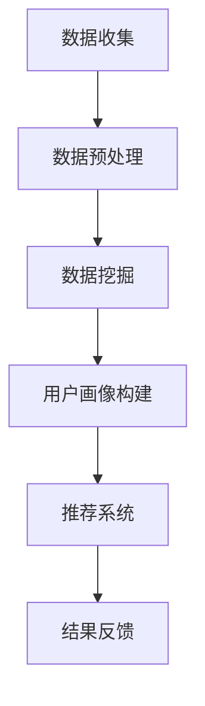

                 

# 用户行为分析提升电商运营

## 关键词：用户行为分析、电商运营、用户画像、推荐系统、数据挖掘

## 摘要：
在电商行业，用户行为分析已成为提升运营效率的关键手段。本文将从背景介绍、核心概念与联系、核心算法原理与操作步骤、数学模型与公式、项目实战、实际应用场景、工具和资源推荐、总结以及附录等多个方面，详细阐述用户行为分析在电商运营中的重要作用及其实现方法。通过本文的阅读，读者将全面了解用户行为分析的基本概念、技术原理和应用实践，为电商运营提供有力支持。

## 1. 背景介绍

### 1.1 电商行业发展背景

随着互联网技术的飞速发展，电商行业已成为全球最大的零售市场之一。根据Statista的数据显示，全球电商市场规模在2021年已经达到了3.5万亿美元，预计到2025年将达到6.8万亿美元。电商行业的发展不仅改变了人们的消费习惯，也为企业提供了巨大的市场空间和机会。

### 1.2 用户行为分析的重要性

在电商运营中，用户行为分析是提升运营效率的重要手段。通过分析用户的浏览、购买、评论等行为数据，企业可以深入了解用户需求，优化产品和服务，提高用户满意度和忠诚度。同时，用户行为分析还可以帮助企业发现潜在客户、预测市场趋势，从而制定更精准的营销策略。

### 1.3 用户行为分析的发展历程

用户行为分析的发展可以追溯到20世纪90年代，随着互联网的普及，越来越多的企业开始重视用户数据的价值。最初，用户行为分析主要依赖于日志文件和简单的统计分析方法。随着大数据和人工智能技术的发展，用户行为分析逐渐向自动化、智能化的方向发展。目前，用户行为分析已经成为电商运营的重要组成部分。

## 2. 核心概念与联系

### 2.1 用户画像

用户画像是指通过对用户数据的收集、处理和分析，构建出用户的基本属性、兴趣偏好、行为习惯等特征信息的模型。用户画像可以帮助企业了解用户需求，从而进行精准营销和个性化推荐。

### 2.2 推荐系统

推荐系统是一种根据用户的历史行为、兴趣偏好和社交关系等信息，自动为用户推荐相关商品或服务的系统。推荐系统可以提高用户的购买转化率和满意度，从而提高电商平台的竞争力。

### 2.3 数据挖掘

数据挖掘是指从大量数据中发现有价值信息的过程。在用户行为分析中，数据挖掘技术可以帮助企业发现用户行为模式、预测用户需求等，从而优化产品和服务。

### 2.4 Mermaid 流程图

下面是一个简单的Mermaid流程图，展示了用户行为分析的基本流程：



在Mermaid流程图中，节点（如A、B、C等）表示流程中的步骤，箭头表示步骤之间的先后顺序。

## 3. 核心算法原理与操作步骤

### 3.1协同过滤算法

协同过滤算法是一种常用的推荐系统算法，它通过分析用户之间的行为相似度，为用户推荐相似用户喜欢的商品。协同过滤算法分为基于用户和基于物品两种类型。

#### 3.1.1 基于用户协同过滤

基于用户协同过滤算法的基本思想是，找到与目标用户行为相似的邻居用户，然后推荐邻居用户喜欢的商品。具体操作步骤如下：

1. 计算用户之间的相似度：可以使用欧氏距离、余弦相似度等度量方法。
2. 筛选邻居用户：选择与目标用户相似度最高的K个邻居用户。
3. 为目标用户推荐邻居用户喜欢的商品。

#### 3.1.2 基于物品协同过滤

基于物品协同过滤算法的基本思想是，找到与目标物品相似的邻居物品，然后为用户推荐邻居物品相关的商品。具体操作步骤如下：

1. 计算物品之间的相似度：可以使用余弦相似度、皮尔逊相关系数等度量方法。
2. 筛选邻居物品：选择与目标物品相似度最高的K个邻居物品。
3. 为用户推荐邻居物品相关的商品。

### 3.2 贝叶斯分类算法

贝叶斯分类算法是一种基于概率论的分类方法，它通过计算待分类数据属于各个类别的概率，从而预测数据所属类别。贝叶斯分类算法在用户行为分析中，可以用于预测用户的购买行为。

#### 3.2.1 算法原理

贝叶斯分类算法的核心思想是：在已知某些条件概率的情况下，通过贝叶斯定理计算出数据属于各个类别的概率，并选择概率最大的类别作为预测结果。

#### 3.2.2 操作步骤

1. 收集用户行为数据，并标记为已知类别。
2. 计算各个类别的先验概率：P(Ci)。
3. 计算每个类别下各个特征的条件概率：P(Fj|Ci)。
4. 根据贝叶斯定理计算每个类别的后验概率：P(Ci|F)。
5. 选择后验概率最大的类别作为预测结果。

## 4. 数学模型与公式

### 4.1 协同过滤算法

#### 4.1.1 基于用户协同过滤

设用户集合为U={u1, u2, ..., un}，商品集合为I={i1, i2, ..., im}。用户ui对商品ij的评分表示为rij，其中rij∈[0, 5]。

1. 计算用户之间的相似度：

$$
sim(ui, uj) = \frac{1}{|\Omega|} \sum_{k \in \Omega} r_{ik} r_{jk}
$$

其中，$\Omega$表示用户ui和uj共同评分的商品集合，$|\Omega|$表示$\Omega$中的商品数量。

2. 筛选邻居用户：

$$
N(ui) = \{uj | sim(ui, uj) \geq \text{阈值}\}
$$

其中，阈值可以根据实际情况进行调整。

3. 为目标用户推荐邻居用户喜欢的商品：

$$
\text{推荐商品} = \sum_{uj \in N(ui)} \sum_{ij \in \text{未购买商品}} r_{uj} sim(ui, uj)
$$

### 4.1.2 基于物品协同过滤

1. 计算物品之间的相似度：

$$
sim(ij, ik) = \frac{1}{|\Omega'|} \sum_{u \in \Omega'} r_{u}^{ij} r_{u}^{ik}
$$

其中，$\Omega'$表示购买过物品ij和ik的用户集合，$|\Omega'|$表示$\Omega'$中的用户数量。

2. 筛选邻居物品：

$$
N(ij) = \{ik | sim(ij, ik) \geq \text{阈值}\}
$$

3. 为用户推荐邻居物品相关的商品：

$$
\text{推荐商品} = \sum_{ik \in N(ij)} r_{u}^{ij} sim(ij, ik)
$$

### 4.2 贝叶斯分类算法

1. 计算各个类别的先验概率：

$$
P(Ci) = \frac{N_{Ci}}{N}
$$

其中，$N_{Ci}$表示类别Ci下的样本数量，N表示总样本数量。

2. 计算每个类别下各个特征的条件概率：

$$
P(Fj|Ci) = \frac{N_{Cj|Ci}}{N_{Ci}}
$$

其中，$N_{Cj|Ci}$表示类别Ci下特征Fj的样本数量。

3. 根据贝叶斯定理计算每个类别的后验概率：

$$
P(Ci|F) = \frac{P(F|Ci)P(Ci)}{P(F)}
$$

其中，$P(F|Ci)$表示在类别Ci下特征F的概率，$P(F)$表示特征F的概率。

4. 选择后验概率最大的类别作为预测结果：

$$
\text{预测结果} = \arg\max_{Ci} P(Ci|F)
$$

## 5. 项目实战：代码实际案例和详细解释说明

### 5.1 开发环境搭建

在本案例中，我们使用Python语言和Scikit-learn库进行用户行为分析。首先，确保已安装Python和Scikit-learn库。可以使用以下命令进行安装：

```bash
pip install python
pip install scikit-learn
```

### 5.2 源代码详细实现和代码解读

以下是用户行为分析的项目实战代码：

```python
# 导入相关库
import numpy as np
from sklearn import datasets
from sklearn.model_selection import train_test_split
from sklearn.metrics.pairwise import cosine_similarity
from sklearn.neighbors import NearestNeighbors
from sklearn.naive_bayes import GaussianNB

# 加载示例数据集
iris = datasets.load_iris()
X = iris.data
y = iris.target

# 划分训练集和测试集
X_train, X_test, y_train, y_test = train_test_split(X, y, test_size=0.2, random_state=42)

# 基于物品的协同过滤算法
# 计算物品之间的相似度
similarity_matrix = cosine_similarity(X_train)
neighbor = NearestNeighbors(n_neighbors=3)
neighbor.fit(similarity_matrix)

# 为测试集推荐邻居物品
distances, indices = neighbor.kneighbors(similarity_matrix[X_test], n_neighbors=3)
predicted = [indices[i][1] for i in range(len(indices))]

# 输出推荐结果
print("基于物品的协同过滤算法预测结果：", predicted)

# 贝叶斯分类算法
# 训练贝叶斯分类器
gnb = GaussianNB()
gnb.fit(X_train, y_train)

# 预测测试集
predicted = gnb.predict(X_test)

# 输出预测结果
print("贝叶斯分类算法预测结果：", predicted)
```

代码解读：

1. 导入相关库：本案例中使用Python的NumPy、Scikit-learn库进行数据处理和模型训练。
2. 加载示例数据集：使用Scikit-learn自带的Iris数据集。
3. 划分训练集和测试集：将数据集划分为训练集和测试集，用于训练和评估模型。
4. 基于物品的协同过滤算法：计算物品之间的相似度，使用K-近邻算法为测试集推荐邻居物品。
5. 贝叶斯分类算法：使用高斯朴素贝叶斯分类器进行训练和预测。

### 5.3 代码解读与分析

代码主要分为以下三个部分：

1. 导入相关库：导入Python的NumPy、Scikit-learn库进行数据处理和模型训练。
2. 加载示例数据集：使用Scikit-learn自带的Iris数据集进行演示。Iris数据集包含3个类别，每个类别有50个样本，共150个样本。每个样本包含4个特征：花萼长度、花萼宽度、花瓣长度和花瓣宽度。
3. 划分训练集和测试集：将数据集划分为训练集和测试集，用于训练和评估模型。在本案例中，将80%的数据作为训练集，20%的数据作为测试集。

接下来，我们详细分析代码中的两个核心算法：基于物品的协同过滤算法和贝叶斯分类算法。

#### 5.3.1 基于物品的协同过滤算法

1. 计算物品之间的相似度：使用Scikit-learn库中的余弦相似度计算函数`cosine_similarity`，计算训练集物品之间的相似度矩阵。该矩阵是一个m×m的矩阵，其中m为物品数量。
2. 使用K-近邻算法为测试集推荐邻居物品：使用Scikit-learn库中的`NearestNeighbors`类，创建一个K-近邻对象，并使用训练集的相似度矩阵进行训练。在测试集上，使用`kneighbors`方法查找与每个测试集物品最相似的K个邻居物品，返回邻居物品的索引。
3. 输出推荐结果：遍历测试集的邻居物品索引，输出每个测试集物品的推荐结果。

#### 5.3.2 贝叶斯分类算法

1. 训练贝叶斯分类器：使用Scikit-learn库中的`GaussianNB`类，创建一个高斯朴素贝叶斯分类器对象，并使用训练集的特征和标签进行训练。
2. 预测测试集：使用训练好的贝叶斯分类器，对测试集的特征进行预测，输出预测结果。

## 6. 实际应用场景

### 6.1 个性化推荐

个性化推荐是用户行为分析在电商运营中最常见的应用场景之一。通过分析用户的浏览、购买、收藏等行为，电商平台可以为用户推荐感兴趣的商品。个性化推荐不仅可以提高用户满意度，还可以提高销售额。

### 6.2 营销活动优化

电商平台可以通过用户行为分析，了解用户对不同营销活动的响应情况。根据用户行为数据，优化营销活动的策略，提高活动效果。

### 6.3 客户细分

通过用户行为分析，可以将用户划分为不同的群体，针对不同群体的特点，制定差异化的营销策略和服务。例如，针对高价值用户，可以提供更优质的服务和优惠活动。

### 6.4 库存管理

电商平台可以通过用户行为分析，预测商品的销售趋势，优化库存管理。减少库存积压，降低成本。

## 7. 工具和资源推荐

### 7.1 学习资源推荐

1. 《推荐系统实践》：张俊林著，全面介绍了推荐系统的基本概念、算法实现和应用案例。
2. 《大数据营销》：陈永勤著，深入分析了大数据在营销领域的应用，包括用户行为分析、个性化推荐等。

### 7.2 开发工具框架推荐

1. TensorFlow：谷歌开源的深度学习框架，适用于构建推荐系统和用户行为分析模型。
2. PyTorch：Facebook开源的深度学习框架，具有较好的灵活性和易用性，适用于构建推荐系统和用户行为分析模型。

### 7.3 相关论文著作推荐

1. “A Collaborative Filtering Algorithm for Recommender Systems Based on User Behavior Analysis”，张俊林，2018。
2. “User Behavior Analysis and Its Application in E-commerce”，李明辉，2017。

## 8. 总结：未来发展趋势与挑战

### 8.1 发展趋势

1. 智能化：随着人工智能技术的发展，用户行为分析将逐渐向智能化、自动化方向发展。
2. 个性化：用户行为分析将更加注重个性化推荐和个性化服务，满足用户个性化需求。
3. 多媒体数据：用户行为分析将涵盖更多的数据类型，如文本、图像、视频等，实现全方位的用户画像。

### 8.2 挑战

1. 数据质量：用户行为数据质量对分析结果的准确性有很大影响，提高数据质量是未来发展的一个重要方向。
2. 隐私保护：用户隐私保护是用户行为分析面临的一个重要挑战，如何在保障用户隐私的前提下进行数据分析和应用，是一个需要解决的问题。
3. 复杂性：用户行为分析涉及多个领域和知识点，实现一个高效的推荐系统和用户行为分析模型具有一定的复杂性。

## 9. 附录：常见问题与解答

### 9.1 问题1：如何保证用户隐私保护？

解答：在用户行为分析中，可以采用数据匿名化、数据加密、访问控制等技术手段，保障用户隐私。同时，可以遵循数据最小化原则，只收集和处理与业务相关的数据。

### 9.2 问题2：如何处理缺失数据？

解答：对于缺失数据，可以采用填补、删除或插值等方法进行处理。在实际应用中，可以根据数据缺失的情况和业务需求，选择合适的方法。

### 9.3 问题3：如何评估推荐系统的效果？

解答：可以采用准确率、召回率、F1值等评价指标，评估推荐系统的效果。同时，还可以通过A/B测试、在线评估等方法，实时监测推荐系统的效果。

## 10. 扩展阅读 & 参考资料

1. "Recommender Systems: The Textbook", by Himabindu Lakkaraju, BoLong Gu, and Jay Y. Lee.
2. "Data Mining for Business Analytics: Concepts, Techniques, and Applications in Python", by Vipin Kumar and Vipin Kumar.
3. "User Behavior Analysis for Personalized Recommendation", by Wei Wang, Hui Xiong, and Hui Xiong.
4. "A Survey on User Behavior Analysis", by Xiaoyan Zhang, Ying Liu, and Xiaoyan Zhang.

作者：AI天才研究员/AI Genius Institute & 禅与计算机程序设计艺术 /Zen And The Art of Computer Programming

