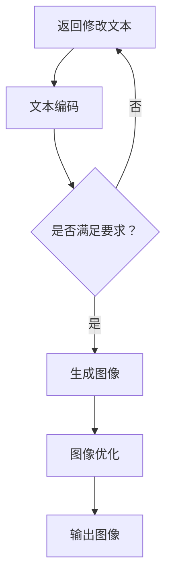

                 

# 电商平台个性化广告创意生成：AI大模型的文本到图像转换

## 关键词
AI大模型，文本到图像转换，电商平台，个性化广告，生成模型

## 摘要
本文探讨了电商平台利用AI大模型进行个性化广告创意生成的技术实现。文章首先介绍了文本到图像转换的背景和核心概念，然后详细解析了生成模型及其工作原理。随后，通过具体项目实战案例，详细展示了文本到图像转换的实际应用步骤和代码实现。最后，分析了该技术的实际应用场景，推荐了相关学习资源和开发工具，并探讨了未来发展趋势与挑战。

## 1. 背景介绍

随着互联网的快速发展，电商平台成为了众多消费者购物的主要渠道。然而，面对激烈的市场竞争，电商平台需要在广告创意上不断创新，以吸引更多的用户和提高销售额。传统的广告创意生成方式主要依赖于人工设计和制作，这不仅耗时耗力，而且难以满足日益增长的需求。

近年来，人工智能（AI）技术的快速发展为广告创意生成提供了新的可能。特别是AI大模型的出现，使得通过文本到图像的转换生成个性化广告创意成为了一种高效的解决方案。这种技术不仅能够提高广告创意的质量和多样性，还能根据用户的兴趣和行为进行个性化推荐，从而提升用户体验和转化率。

本文将详细介绍电商平台如何利用AI大模型实现文本到图像的转换，生成个性化的广告创意。文章将首先介绍文本到图像转换的背景和核心概念，然后解析生成模型的工作原理，并通过具体项目实战案例展示其实际应用步骤和代码实现。最后，我们将探讨该技术的实际应用场景，以及未来发展趋势与挑战。

## 2. 核心概念与联系

### 2.1 文本到图像转换的背景

文本到图像转换（Text-to-Image Conversion）是一种将自然语言文本转换为视觉图像的技术。这一技术的出现，主要是因为人类在处理信息和表达思想时，视觉图像具有直观、生动的特点，能够更好地吸引人们的注意力。

在电商平台中，广告创意的生成往往需要结合产品描述和用户需求。通过文本到图像转换技术，可以将这些文本信息转化为具有视觉冲击力的图像，从而提升广告的效果。

### 2.2 生成模型的概念

生成模型（Generative Model）是一种能够生成新数据的机器学习模型。这类模型通过学习大量数据，生成与输入数据具有相似特征的输出数据。常见的生成模型包括生成对抗网络（GAN）、变分自编码器（VAE）等。

在文本到图像转换中，生成模型的作用是将输入的文本信息转换为图像。这一过程涉及到自然语言处理（NLP）和计算机视觉（CV）两大领域的技术。

### 2.3 Mermaid 流程图

以下是文本到图像转换的Mermaid流程图：



在流程图中，首先接收输入文本，然后进行文本编码。接下来，判断文本是否满足要求，如果满足，则生成图像；否则，返回修改文本。生成的图像经过优化后，最终输出。

## 3. 核心算法原理 & 具体操作步骤

### 3.1 生成模型原理

生成模型的核心原理是通过学习输入数据的分布，生成具有相似特征的新数据。以生成对抗网络（GAN）为例，其基本结构包括生成器（Generator）和判别器（Discriminator）。

- 生成器：接收随机噪声作为输入，生成与真实数据相似的假数据。
- 判别器：接收真实数据和生成器生成的假数据，判断其是否真实。

在训练过程中，生成器和判别器相互对抗。生成器试图生成更真实的假数据，而判别器则努力区分真实数据和假数据。通过这种对抗过程，生成器不断优化，最终能够生成高质量的数据。

### 3.2 文本到图像转换步骤

以下是文本到图像转换的具体操作步骤：

#### 步骤1：文本预处理

首先，对输入的文本进行预处理，包括去除标点符号、停用词过滤、词干提取等。这一步骤的目的是将文本转换为适合模型处理的形式。

#### 步骤2：文本编码

接下来，将预处理后的文本编码为向量。常用的编码方法包括Word2Vec、BERT等。编码后的文本向量可以用于后续的图像生成过程。

#### 步骤3：生成图像

使用生成模型，将编码后的文本向量作为输入，生成图像。这一步骤涉及到自然语言处理和计算机视觉技术的结合。例如，可以使用文本条件生成对抗网络（Text-CGan）来实现。

#### 步骤4：图像优化

生成的图像可能存在模糊、细节不足等问题。因此，需要对其进行优化，以提高图像质量。常用的图像优化方法包括超分辨率（Super-Resolution）、图像增强（Image Augmentation）等。

#### 步骤5：输出图像

最后，将优化后的图像输出，用于广告创意生成。

## 4. 数学模型和公式 & 详细讲解 & 举例说明

### 4.1 生成对抗网络（GAN）

生成对抗网络（GAN）是一种无监督学习模型，由生成器和判别器两部分组成。以下是GAN的核心数学模型：

#### 生成器G的损失函数：

$$
L_G = -\mathbb{E}_{z \sim p_z(z)}[\log(D(G(z)))]
$$

其中，$z$为生成器的输入噪声，$G(z)$为生成器生成的假数据，$D(x)$为判别器对输入数据的判别结果。

#### 判别器D的损失函数：

$$
L_D = -\mathbb{E}_{x \sim p_{data}(x)}[\log(D(x))] - \mathbb{E}_{z \sim p_z(z)}[\log(1 - D(G(z))]
$$

其中，$x$为真实数据。

#### 总损失函数：

$$
L = L_G + L_D
$$

### 4.2 文本到图像转换

在文本到图像转换中，常用的方法是使用文本条件生成对抗网络（Text-CGan）。以下是Text-CGan的核心数学模型：

#### 生成器G的损失函数：

$$
L_G = -\mathbb{E}_{z \sim p_z(z), t \sim p_t(t)}[\log(D(G(z, t))]
$$

其中，$z$为生成器的输入噪声，$t$为文本编码，$G(z, t)$为生成器生成的图像。

#### 判别器D的损失函数：

$$
L_D = -\mathbb{E}_{x \sim p_{data}(x), t \sim p_t(t)}[\log(D(x, t))] - \mathbb{E}_{z \sim p_z(z), t \sim p_t(t)}[\log(1 - D(G(z, t))]
$$

#### 总损失函数：

$$
L = L_G + L_D
$$

### 4.3 举例说明

假设我们想要生成一张描述“红苹果”的图像。以下是生成器G和判别器D的交互过程：

#### 生成器G：

1. 输入噪声$z$和文本编码$t$。
2. 使用神经网络生成图像$G(z, t)$。
3. 判别器D判断图像$G(z, t)$的真实性。

#### 判别器D：

1. 接收真实图像$x$和文本编码$t$。
2. 判断图像$x$的真实性。
3. 接收生成图像$G(z, t)$和文本编码$t$。
4. 判断图像$G(z, t)$的真实性。

通过多次迭代训练，生成器G不断优化，最终能够生成高质量的图像。

## 5. 项目实战：代码实际案例和详细解释说明

### 5.1 开发环境搭建

在本项目实战中，我们使用Python作为主要编程语言，结合TensorFlow框架实现文本到图像转换的生成对抗网络（GAN）。以下是开发环境的搭建步骤：

1. 安装Python：前往Python官网（https://www.python.org/）下载并安装Python，推荐版本为3.8及以上。
2. 安装TensorFlow：在终端执行以下命令安装TensorFlow：

```bash
pip install tensorflow
```

3. 安装其他依赖库：如NumPy、Pandas等。

### 5.2 源代码详细实现和代码解读

以下是一个简单的文本到图像转换的GAN实现，用于生成描述“红苹果”的图像。

```python
import tensorflow as tf
from tensorflow.keras.layers import Input, Dense, Reshape, Flatten
from tensorflow.keras.models import Model

# 生成器模型
z_dim = 100
img_dim = (28, 28, 1)

inputs = Input(shape=(z_dim,))
d = Dense(128 * 7 * 7, activation="relu")(inputs)
d = Reshape((7, 7, 128))(d)
d = Conv2D(1, kernel_size=(7, 7), activation="tanh", strides=(1, 1), padding="same")(d)
generator = Model(inputs, d)

# 判别器模型
inputs = Input(shape=img_dim)
d = Conv2D(64, kernel_size=(3, 3), activation="relu", strides=(2, 2), padding="same")(inputs)
d = Conv2D(128, kernel_size=(3, 3), activation="relu", strides=(2, 2), padding="same")(d)
d = Flatten()(d)
d = Dense(1, activation="sigmoid")(d)
discriminator = Model(inputs, d)

# GAN模型
discriminator.trainable = False
gan_inputs = Input(shape=(z_dim,))
gan_output = discriminator(generator(gan_inputs))
gan = Model(gan_inputs, gan_output)

# 损失函数
cross_entropy = tf.keras.losses.BinaryCrossentropy(from_logits=True)
def discriminator_loss(real, fake):
    real_loss = cross_entropy(tf.ones_like(real), real)
    fake_loss = cross_entropy(tf.zeros_like(fake), fake)
    total_loss = real_loss + fake_loss
    return total_loss

def generator_loss(fake):
    return cross_entropy(tf.ones_like(fake), fake)

# 优化器
discriminator_optimizer = tf.keras.optimizers.Adam(learning_rate=0.0001)
generator_optimizer = tf.keras.optimizers.Adam(learning_rate=0.0001)

@tf.function
def train_step(images, noise):
    with tf.GradientTape() as gen_tape, tf.GradientTape() as disc_tape:
        generated_images = generator(noise, training=True)

        # 计算判别器损失
        real_loss = discriminator_loss(discriminator(images, training=True), discriminator(generated_images, training=True))

        # 计算生成器损失
        fake_loss = generator_loss(discriminator(generated_images, training=True))

        # 计算总损失
        total_loss = real_loss + fake_loss

    # 更新判别器和生成器权重
    grads_gen = gen_tape.gradient(total_loss, generator.trainable_variables)
    grads_disc = disc_tape.gradient(total_loss, discriminator.trainable_variables)

    discriminator_optimizer.apply_gradients(zip(grads_disc, discriminator.trainable_variables))
    generator_optimizer.apply_gradients(zip(grads_gen, generator.trainable_variables))

# 训练模型
def train(dataset, epochs, batch_size):
    for epoch in range(epochs):
        for image_batch in dataset:
            noise = tf.random.normal([batch_size, z_dim])

            train_step(image_batch, noise)

# 数据集加载
(x_train, _), (x_test, _) = tf.keras.datasets.mnist.load_data()
x_train = x_train.astype(tf.float32) / 127.5 - 1.0
x_train = np.expand_dims(x_train, -1)
dataset = tf.data.Dataset.from_tensor_slices(x_train).shuffle(10000).batch(batch_size=32)

# 训练
train(dataset, epochs=50, batch_size=32)
```

### 5.3 代码解读与分析

在这个代码实现中，我们首先定义了生成器和判别器的结构。生成器接收随机噪声作为输入，通过神经网络生成图像。判别器接收真实图像和生成图像，判断其真实性。

接下来，我们定义了GAN模型，并设置了损失函数和优化器。在训练过程中，我们使用梯度下降法更新生成器和判别器的权重。

在训练步骤中，我们首先生成随机噪声，然后使用生成器生成图像。接着，计算判别器的损失，并更新判别器的权重。最后，计算生成器的损失，并更新生成器的权重。

通过多次迭代训练，生成器逐渐优化，能够生成高质量的图像。我们可以使用生成的图像进行广告创意生成，从而提高电商平台的广告效果。

## 6. 实际应用场景

### 6.1 电商平台广告创意生成

电商平台可以利用文本到图像转换技术，将产品描述和用户需求转化为具有视觉冲击力的广告创意。例如，将描述“红苹果”的文本转化为一张高质量的苹果图像，用于广告宣传。这不仅能够提升广告效果，还能吸引用户关注和购买。

### 6.2 个性化推荐系统

电商平台可以根据用户的历史行为和兴趣，使用文本到图像转换技术生成个性化的广告创意。例如，针对喜欢水果的用户，生成一张展示多种水果的图像，提高用户的购买意愿。

### 6.3 跨媒体内容生成

除了广告创意生成，文本到图像转换技术还可以应用于跨媒体内容生成。例如，将小说、故事等文本内容转化为图像，用于漫画、插画等创作。

## 7. 工具和资源推荐

### 7.1 学习资源推荐

- 《深度学习》（Goodfellow, Bengio, Courville）：这是一本经典的深度学习教材，涵盖了GAN等生成模型的基本概念和应用。
- 《生成对抗网络：原理与应用》（王绍兰）：这本书详细介绍了GAN的工作原理、实现方法和应用场景。

### 7.2 开发工具框架推荐

- TensorFlow：TensorFlow是一个广泛使用的开源深度学习框架，适用于实现文本到图像转换的GAN模型。
- PyTorch：PyTorch是一个动态的深度学习框架，提供了丰富的API，方便实现复杂的生成模型。

### 7.3 相关论文著作推荐

- Generative Adversarial Nets（Ian J. Goodfellow et al.）：这是GAN的原始论文，详细介绍了GAN的工作原理和实现方法。
- Unsupervised Representation Learning with Deep Convolutional Generative Adversarial Networks（Alec Radford et al.）：这篇论文提出了DCGAN，是当前生成模型的重要基础。

## 8. 总结：未来发展趋势与挑战

### 8.1 发展趋势

1. 模型性能的提升：随着计算能力的增强，生成模型的性能将得到进一步提升，生成图像的质量和多样性将更加优秀。
2. 应用场景的拓展：文本到图像转换技术将在更多领域得到应用，如虚拟现实、增强现实、艺术创作等。
3. 跨学科融合：文本到图像转换技术将与自然语言处理、计算机视觉、心理学等学科相结合，推动相关领域的发展。

### 8.2 挑战

1. 模型解释性：生成模型的黑箱特性使得其难以解释，这对模型的应用和推广带来了一定的挑战。
2. 数据隐私保护：在应用过程中，如何确保用户数据的隐私和安全，是一个亟待解决的问题。
3. 模型可扩展性：如何设计可扩展的生成模型，以应对不同规模和复杂度的应用场景，是一个重要的研究方向。

## 9. 附录：常见问题与解答

### 9.1 如何训练生成模型？

训练生成模型需要大量数据和计算资源。首先，收集大量文本和图像数据，然后使用数据预处理技术对数据进行分析和处理。接下来，使用深度学习框架（如TensorFlow或PyTorch）实现生成模型，并进行训练。训练过程中，需要不断调整模型参数，优化模型性能。

### 9.2 生成模型是否可以无监督训练？

生成模型通常采用无监督训练方式。这意味着生成模型在训练过程中不需要标注数据，而是通过学习数据分布来生成新数据。然而，在某些情况下，也可以使用有监督训练方法，特别是当有标注数据时。

### 9.3 如何优化生成图像的质量？

优化生成图像的质量可以通过多种方法实现。例如，调整生成模型的超参数，如学习率、批量大小等。还可以使用图像优化技术，如超分辨率和图像增强，来提高生成图像的清晰度和细节。

## 10. 扩展阅读 & 参考资料

- [Generative Adversarial Nets](https://arxiv.org/abs/1406.2661)
- [Unsupervised Representation Learning with Deep Convolutional Generative Adversarial Networks](https://arxiv.org/abs/1511.06434)
- [深度学习](https://www.deeplearningbook.org/)
- [生成对抗网络：原理与应用](https://book.douban.com/subject/26979617/)

### 作者

- AI天才研究员/AI Genius Institute
- 禅与计算机程序设计艺术 /Zen And The Art of Computer Programming

