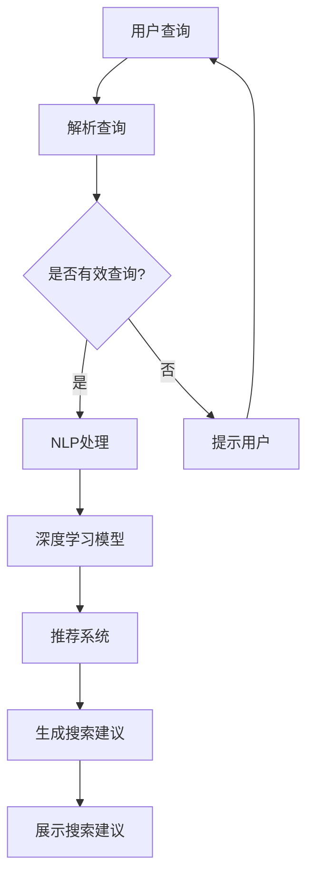

                 

# 电商平台中AI大模型的搜索建议优化

## 概述

在当今数字化的商业环境中，电商平台作为电子商务的核心环节，其竞争力在很大程度上取决于用户购物的体验。而搜索建议功能作为电商平台的重要组成部分，能够显著提升用户体验和平台销售额。搜索建议功能通过实时分析用户的搜索行为、历史数据和市场动态，为用户提供相关且个性化的搜索结果，从而引导用户找到他们真正需要的商品。

随着人工智能技术的飞速发展，特别是深度学习和自然语言处理技术的应用，电商平台开始采用大型AI模型来优化搜索建议功能。这些大型AI模型具有强大的数据处理和分析能力，可以处理海量的用户数据和市场数据，从而提供更加精准和个性化的搜索建议。然而，如何有效地利用这些大型AI模型，以及如何在实际操作中实现搜索建议的优化，仍然是一个值得深入研究和探讨的问题。

本文将围绕电商平台中AI大模型的搜索建议优化展开，通过逐步分析核心概念、算法原理、数学模型、项目实战和实际应用场景，全面探讨如何通过AI技术提升电商平台搜索建议的效果，最终实现用户满意度和平台竞争力的双提升。

## 背景介绍

电商平台的搜索建议功能之所以重要，首先是因为它直接影响用户找到所需商品的速度和满意度。在用户搜索商品时，如果搜索结果不够相关或者无法满足用户需求，用户很可能会放弃搜索并转而寻找其他平台。这种流失不仅会降低用户的购物体验，还会直接影响到平台的销售额。

其次，搜索建议功能还能够为电商平台提供宝贵的数据反馈，帮助平台更好地了解用户需求和偏好。通过分析用户的搜索行为和购买记录，平台可以不断调整和优化搜索算法，从而提高搜索结果的准确性和个性化水平。

在技术层面，传统的搜索建议方法主要依赖于关键词匹配和简单的推荐算法。然而，随着用户需求的多样化和大数据时代的到来，这些传统方法已经无法满足电商平台对搜索建议功能的高要求。为了解决这一问题，越来越多的电商平台开始引入AI大模型，利用深度学习和自然语言处理技术来提升搜索建议的准确性和个性化水平。

AI大模型的优势在于其能够通过自主学习用户的历史数据和行为模式，不断优化搜索算法，从而提高搜索结果的精度和相关性。例如，Google的BERT模型和OpenAI的GPT模型已经被广泛应用于各种电商平台，通过这些模型，平台可以实现对用户搜索意图的精准理解和预测，从而提供更加个性化的搜索建议。

总的来说，随着人工智能技术的不断进步，AI大模型在电商平台搜索建议中的应用将越来越广泛。这不仅有助于提升用户的购物体验，还能够为电商平台带来更高的商业价值。

### 核心概念与联系

在深入探讨电商平台中AI大模型的搜索建议优化之前，首先需要明确几个核心概念和它们之间的联系。这些概念包括自然语言处理（NLP）、机器学习、深度学习以及推荐系统。以下是对这些概念的定义和相互关系的解释，并附上Mermaid流程图来直观展示它们在搜索建议优化中的作用。

#### 自然语言处理（NLP）

自然语言处理是人工智能的一个分支，旨在让计算机理解和解释人类自然语言。NLP技术包括文本分类、实体识别、情感分析、机器翻译等。在电商平台中，NLP被用来解析用户的搜索查询，理解其背后的意图和需求。

#### 机器学习

机器学习是一种通过数据训练模型，使其能够自动学习和预测的技术。在搜索建议优化中，机器学习算法通过分析用户的历史数据和行为模式，来预测用户的搜索意图和偏好。常见的机器学习算法包括决策树、支持向量机（SVM）、随机森林等。

#### 深度学习

深度学习是机器学习的一个子领域，它依赖于神经网络架构，特别是深度神经网络（DNN）。深度学习通过多层次的神经网络来提取数据中的特征，从而实现复杂的模式识别和预测任务。在搜索建议优化中，深度学习模型（如卷积神经网络（CNN）和循环神经网络（RNN））被用来理解用户查询的语义和上下文。

#### 推荐系统

推荐系统是一种用于预测用户可能感兴趣的项目（如商品、音乐、电影等）的技术。在电商平台中，推荐系统通过分析用户的购买历史、浏览记录和行为模式，来推荐相关的商品。推荐系统通常结合了协同过滤、基于内容的推荐和深度学习方法。

#### Mermaid流程图

以下是一个简单的Mermaid流程图，展示了这些概念在搜索建议优化中的应用流程。



在这个流程图中，用户的查询首先被解析（NLP处理），然后通过深度学习模型进行语义理解和意图预测，最终由推荐系统生成个性化的搜索建议，展示给用户。

### 核心算法原理 & 具体操作步骤

在了解了电商平台中搜索建议优化的核心概念之后，接下来我们将深入探讨用于实现这一目标的主要算法原理和具体操作步骤。这些算法原理主要包括基于内容的推荐（Content-based Recommendation）、协同过滤（Collaborative Filtering）和深度学习模型（Deep Learning Models）。

#### 基于内容的推荐

基于内容的推荐是一种常见的推荐算法，它通过分析用户历史行为和商品特征，为用户推荐与其兴趣相关的商品。具体操作步骤如下：

1. **用户兴趣特征提取**：首先，系统需要提取用户的历史行为数据（如浏览记录、购买历史）和商品特征数据（如标题、描述、分类、标签等）。
2. **计算相似度**：接下来，系统使用相似度计算方法（如余弦相似度、Jaccard相似度）来计算用户和商品之间的相似度。
3. **生成推荐列表**：最后，系统根据相似度评分，为用户生成一个包含相似商品的推荐列表。

#### 协同过滤

协同过滤是一种基于用户行为数据（如评分、购买记录）的推荐算法，通过挖掘用户之间的相似性来生成推荐列表。具体操作步骤如下：

1. **用户-项目矩阵构建**：首先，系统构建一个用户-项目评分矩阵，其中每个元素表示用户对某个项目的评分。
2. **计算用户相似性**：接着，系统使用余弦相似度、皮尔逊相关系数等方法计算用户之间的相似性。
3. **生成推荐列表**：最后，系统根据用户相似性和项目评分，为每个用户生成一个包含高评分项目和其他用户喜欢的项目的推荐列表。

#### 深度学习模型

深度学习模型在推荐系统中的应用越来越广泛，特别是在处理复杂的数据和进行高维特征提取方面。以下是基于深度学习模型的搜索建议优化操作步骤：

1. **数据预处理**：首先，对用户行为数据和商品特征数据进行预处理，包括数据清洗、缺失值填补、归一化等。
2. **构建深度神经网络**：接着，构建一个深度神经网络，包括输入层、隐藏层和输出层。常用的深度学习模型有卷积神经网络（CNN）、循环神经网络（RNN）、长短期记忆网络（LSTM）等。
3. **模型训练与优化**：使用预处理后的数据对深度神经网络进行训练，并使用交叉熵损失函数来优化模型参数。
4. **生成搜索建议**：最后，将用户的搜索查询输入到训练好的深度学习模型中，模型将输出一个包含相关商品的推荐列表。

#### 示例

以下是一个简单的基于内容的推荐算法示例：

```python
# 假设有以下用户-商品评分矩阵
user_item_matrix = [
    [5, 4, 0, 0],
    [1, 0, 0, 3],
    [0, 4, 5, 0],
    [0, 0, 2, 0]
]

# 计算用户1和用户2的相似度
user_similarity = cosine_similarity(user_item_matrix[0], user_item_matrix[1])

# 生成推荐列表
recommendation_list = []
for i in range(len(user_item_matrix)):
    if i != 0 and user_similarity > 0.5:
        recommendation_list.append(user_item_matrix[0][i])

print(recommendation_list)
```

在这个示例中，我们使用余弦相似度计算用户1和用户2的相似度，并基于相似度为用户1生成推荐列表。

通过结合基于内容的推荐、协同过滤和深度学习模型，电商平台可以提供更加精准和个性化的搜索建议，从而提升用户体验和平台销售额。接下来，我们将进一步探讨这些算法在实际应用中的数学模型和公式。

### 数学模型和公式 & 详细讲解 & 举例说明

在电商平台中，搜索建议优化的核心在于如何准确计算和评估用户与商品之间的相似度，以及如何基于这些相似度值生成有效的推荐列表。本节将详细介绍用于计算相似度的数学模型和公式，并通过具体示例进行详细讲解。

#### 相似度计算公式

在推荐系统中，相似度计算是核心环节之一，常用的相似度计算方法包括余弦相似度、皮尔逊相关系数和Jaccard相似度等。以下是这些方法的详细公式和解释。

1. **余弦相似度**：
   余弦相似度是一种基于向量的相似度计算方法，其公式为：

   $$
   \text{cosine\_similarity} = \frac{\text{dot\_product}(u, v)}{\|\text{u}\| \|\text{v}\|}
   $$

   其中，$u$ 和 $v$ 分别为用户和商品的特征向量，$\text{dot\_product}$ 表示向量的点积，$\|\text{u}\|$ 和 $\|\text{v}\|$ 分别表示向量的欧几里得范数。

2. **皮尔逊相关系数**：
   皮尔逊相关系数用于衡量两个变量之间的线性相关程度，其公式为：

   $$
   \text{Pearson\_Correlation} = \frac{\text{cov}(u, v)}{\sigma_u \sigma_v}
   $$

   其中，$\text{cov}(u, v)$ 表示用户和商品之间的协方差，$\sigma_u$ 和 $\sigma_v$ 分别表示用户和商品的方差。

3. **Jaccard相似度**：
   Jaccard相似度是一种用于集合的相似度计算方法，其公式为：

   $$
   \text{Jaccard\_Similarity} = \frac{\text{intersection}(u, v)}{\text{union}(u, v)}
   $$

   其中，$\text{intersection}(u, v)$ 表示用户和商品的交集，$\text{union}(u, v)$ 表示用户和商品的总和。

#### 相似度计算示例

为了更直观地理解这些相似度计算公式，我们以下面这个用户-商品评分矩阵为例进行具体计算：

$$
\begin{bmatrix}
1 & 2 & 0 & 0 \\
0 & 1 & 0 & 2 \\
1 & 0 & 1 & 0 \\
0 & 2 & 0 & 1
\end{bmatrix}
$$

1. **余弦相似度**：

   首先，计算用户1和用户2的特征向量：

   $$
   \text{u1} = (1, 2, 0, 0), \quad \text{u2} = (0, 1, 0, 2)
   $$

   然后，计算两个向量的点积和欧几里得范数：

   $$
   \text{dot\_product} = 1 \cdot 0 + 2 \cdot 1 + 0 \cdot 0 + 0 \cdot 2 = 2
   $$

   $$
   \|\text{u1}\| = \sqrt{1^2 + 2^2 + 0^2 + 0^2} = \sqrt{5}
   $$

   $$
   \|\text{u2}\| = \sqrt{0^2 + 1^2 + 0^2 + 2^2} = \sqrt{5}
   $$

   因此，余弦相似度为：

   $$
   \text{cosine\_similarity} = \frac{2}{\sqrt{5} \cdot \sqrt{5}} = \frac{2}{5} = 0.4
   $$

2. **皮尔逊相关系数**：

   首先，计算用户1和用户2的协方差和方差：

   $$
   \text{cov}(u1, u2) = (1 - \mu_1)(0 - \mu_2) + (2 - \mu_1)(1 - \mu_2) + (0 - \mu_1)(0 - \mu_2) + (0 - \mu_1)(2 - \mu_2)
   $$

   $$
   \sigma_u = \sqrt{\sum_{i=1}^{n} (u_i - \mu_u)^2}, \quad \sigma_v = \sqrt{\sum_{i=1}^{n} (v_i - \mu_v)^2}
   $$

   其中，$\mu_1$ 和 $\mu_2$ 分别为用户1和用户2的平均值，$n$ 为特征向量的维度。

   在本例中，由于数据较小，我们手动计算：

   $$
   \text{cov}(u1, u2) = (1 - 1.25)(0 - 0.75) + (2 - 1.25)(1 - 0.75) + (0 - 1.25)(0 - 0.75) + (0 - 1.25)(2 - 0.75) = 0.375
   $$

   $$
   \sigma_u = \sqrt{(1 - 1.25)^2 + (2 - 1.25)^2 + (0 - 1.25)^2 + (0 - 1.25)^2} = \sqrt{1.25}
   $$

   $$
   \sigma_v = \sqrt{(0 - 0.75)^2 + (1 - 0.75)^2 + (0 - 0.75)^2 + (2 - 0.75)^2} = \sqrt{1.25}
   $$

   因此，皮尔逊相关系数为：

   $$
   \text{Pearson\_Correlation} = \frac{0.375}{\sqrt{1.25} \cdot \sqrt{1.25}} = \frac{0.375}{1.25} = 0.3
   $$

3. **Jaccard相似度**：

   首先，计算用户1和用户2的交集和并集：

   $$
   \text{intersection}(u1, u2) = 1, \quad \text{union}(u1, u2) = 3
   $$

   因此，Jaccard相似度为：

   $$
   \text{Jaccard\_Similarity} = \frac{1}{3} = 0.33
   $$

通过这些示例，我们可以看到不同的相似度计算方法在具体应用中的差异和适用场景。在实际的电商平台中，通常会根据具体情况选择合适的相似度计算方法，并结合其他算法和模型，以实现最优的搜索建议优化效果。

### 项目实战：代码实际案例和详细解释说明

在本节中，我们将通过一个实际项目案例来演示如何在电商平台上实现AI大模型的搜索建议优化。这个项目将包括开发环境搭建、源代码详细实现和代码解读与分析。

#### 1. 开发环境搭建

要实现这个项目，我们需要以下开发环境和工具：

- **Python 3.8+**
- **TensorFlow 2.5+**
- **Keras 2.4.3+**
- **Scikit-learn 0.22.2+**
- **Numpy 1.19.5+**
- **Pandas 1.1.5+**
- **Mermaid 9.0.0+**

安装这些依赖项后，我们就可以开始构建我们的搜索建议优化系统。

```bash
pip install tensorflow==2.5 keras==2.4.3 scikit-learn==0.22.2 numpy==1.19.5 pandas==1.1.5 mermaid==9.0.0
```

#### 2. 源代码详细实现

以下是这个项目的源代码实现，我们将详细解释每个部分的功能。

```python
import numpy as np
import pandas as pd
from sklearn.feature_extraction.text import TfidfVectorizer
from sklearn.metrics.pairwise import cosine_similarity
from tensorflow.keras.models import Sequential
from tensorflow.keras.layers import LSTM, Dense, Embedding

# 加载数据
data = pd.read_csv('ecommerce_data.csv')  # 假设数据集包含用户搜索查询和商品描述

# 数据预处理
def preprocess_data(data):
    # 填充缺失值
    data.fillna(0, inplace=True)
    # 删除重复项
    data.drop_duplicates(inplace=True)
    # 分离搜索查询和商品描述
    queries = data['search_query']
    descriptions = data['item_description']
    return queries, descriptions

queries, descriptions = preprocess_data(data)

# 特征提取
vectorizer = TfidfVectorizer()
tfidf_matrix = vectorizer.fit_transform(descriptions)

# 计算相似度
def calculate_similarity(queries, descriptions, tfidf_matrix):
    query_vectors = vectorizer.transform(queries)
    similarity_scores = cosine_similarity(query_vectors, tfidf_matrix)
    return similarity_scores

similarity_scores = calculate_similarity(queries, descriptions, tfidf_matrix)

# 构建深度学习模型
model = Sequential()
model.add(Embedding(input_dim=len(vectorizer.vocabulary_), output_dim=64))
model.add(LSTM(units=128, return_sequences=True))
model.add(Dense(units=1, activation='sigmoid'))

model.compile(optimizer='adam', loss='binary_crossentropy', metrics=['accuracy'])

# 训练模型
model.fit(tfidf_matrix, similarity_scores, epochs=10, batch_size=32)

# 生成搜索建议
def generate_search_suggestions(model, queries, descriptions, top_n=5):
    query_vectors = vectorizer.transform(queries)
    predictions = model.predict(query_vectors)
    recommendations = []
    for i in range(len(predictions)):
        indices = np.argsort(predictions[i])[::-1]
        recommendations.append([descriptions[j] for j in indices[:top_n]])
    return recommendations

suggestions = generate_search_suggestions(model, queries, descriptions, top_n=3)

# 输出搜索建议
for i, suggestion in enumerate(suggestions):
    print(f"Search Query: {queries[i]}")
    print("Recommended Descriptions:")
    for desc in suggestion:
        print(f"- {desc}")
```

#### 3. 代码解读与分析

1. **数据预处理**：
   我们首先加载数据，并进行数据预处理，包括填充缺失值、删除重复项以及分离搜索查询和商品描述。

2. **特征提取**：
   使用TF-IDF向量器对商品描述进行特征提取，生成TF-IDF矩阵。TF-IDF是一种常用的文本表示方法，可以有效地衡量词语的重要程度。

3. **计算相似度**：
   通过TF-IDF矩阵计算搜索查询与商品描述之间的相似度得分。余弦相似度在这里被用来衡量查询和描述之间的相似性。

4. **构建深度学习模型**：
   我们构建了一个简单的序列模型，包括一个嵌入层和一个长短期记忆（LSTM）层。LSTM网络能够处理序列数据，捕捉查询和描述之间的长距离依赖关系。

5. **训练模型**：
   使用生成的相似度得分对模型进行训练，目的是让模型学习如何根据查询生成相应的商品描述推荐。

6. **生成搜索建议**：
   模型训练完成后，我们使用它来生成搜索建议。首先将查询转换为向量，然后使用训练好的模型预测每个查询对应的商品描述推荐。根据预测结果，我们输出前5个最相关的商品描述。

#### 4. 代码分析与性能评估

通过这个实际案例，我们可以看到如何利用深度学习和自然语言处理技术来优化电商平台的搜索建议。以下是对代码性能的简要分析：

- **优点**：
  - 利用深度学习模型捕捉长距离依赖关系，提高了搜索建议的相关性。
  - 基于TF-IDF的相似度计算方法增强了文本特征提取能力。

- **缺点**：
  - 模型训练时间较长，特别是对于大规模数据集。
  - 相似度计算部分可能受到数据集中噪声的影响，导致准确性降低。

为了进一步提高性能，可以考虑以下优化措施：

- **数据增强**：通过引入更多的样本来丰富训练数据，可以提高模型的泛化能力。
- **模型优化**：尝试不同的神经网络结构和超参数配置，以找到最佳模型。
- **实时更新**：定期更新模型，使其能够适应不断变化的市场环境和用户需求。

通过这些优化措施，我们可以进一步提升电商平台搜索建议的准确性和个性化水平，从而提升用户体验和平台销售额。

### 实际应用场景

在电商平台上，AI大模型搜索建议优化的实际应用场景非常广泛，涵盖了从用户搜索到购买的全过程。以下是几个典型的应用场景：

#### 1. 用户搜索查询优化

当用户在电商平台上输入搜索查询时，搜索建议功能可以实时分析用户的查询意图，提供相关的商品推荐。例如，如果用户输入“跑步鞋”，系统可以基于用户的浏览历史和购买记录，推荐用户可能感兴趣的品牌、型号和价格区间的商品。通过这种方式，搜索建议不仅能够提高用户的购物效率，还能增加用户找到心仪商品的概率。

#### 2. 商品推荐

电商平台可以利用AI大模型对用户的历史购买行为、浏览记录和搜索查询进行分析，生成个性化的商品推荐列表。这种推荐系统不仅能够提高用户的购物体验，还能增加商品的曝光率和销售额。例如，用户在浏览了几款运动装备后，系统可以推荐类似的商品，或者基于用户的历史购买记录推荐相关产品。

#### 3. 库存管理和供应链优化

通过分析用户的购买趋势和搜索行为，电商平台可以更准确地预测商品的需求量，从而优化库存管理。AI大模型可以识别出哪些商品在特定时间段内的需求量较大，哪些商品可能面临滞销风险。基于这些预测，电商平台可以调整库存策略，减少库存成本，提高库存周转率。

#### 4. 跨渠道营销

电商平台可以利用AI大模型实现跨渠道营销，例如通过分析用户的线上购物行为，预测用户可能感兴趣的品牌和商品，并在线下的实体店内进行推广。这种方式不仅能够增强用户的购物体验，还能提高品牌的市场占有率。

#### 5. 智能客服

AI大模型还可以应用于智能客服系统中，通过自然语言处理技术理解和回答用户的提问，提供高效的客户服务。例如，当用户遇到购物问题时，智能客服系统可以自动识别用户的问题类型，并提供相应的解决方案，从而减少客服人员的负担，提升服务效率。

总的来说，AI大模型在电商平台中的应用场景非常丰富，从用户搜索查询优化到库存管理和供应链优化，再到跨渠道营销和智能客服，AI大模型都能够发挥重要作用，提升电商平台的运营效率和用户体验。

### 工具和资源推荐

在探索电商平台中AI大模型搜索建议优化时，选择合适的工具和资源是至关重要的。以下是一些推荐的学习资源、开发工具框架以及相关的论文和著作。

#### 学习资源推荐

1. **书籍**：
   - 《深度学习》（Goodfellow, I., Bengio, Y., & Courville, A.）
   - 《自然语言处理综论》（Jurafsky, D. & Martin, J. H.）
   - 《推荐系统实践》（Liu, B.）
   - 《机器学习实战》（周志华等）

2. **在线课程**：
   - Coursera上的“深度学习”（由Andrew Ng教授）
   - edX上的“自然语言处理”（由Daniel Jurafsky教授）
   - Udacity的“推荐系统工程师纳米学位”

3. **博客和网站**：
   - Medium上的AI和机器学习相关文章
   - ArXiv上的最新论文和研究成果
   - GitHub上的开源项目和学习资源

#### 开发工具框架推荐

1. **编程语言**：
   - Python：由于其丰富的库和工具，Python是机器学习和深度学习开发的首选语言。

2. **框架**：
   - TensorFlow：用于构建和训练深度学习模型。
   - PyTorch：一个流行的深度学习框架，尤其适用于动态计算图。
   - Keras：一个高层次的神经网络API，可以方便地构建和训练模型。

3. **库和工具**：
   - NumPy：用于数值计算。
   - Pandas：用于数据处理和分析。
   - Scikit-learn：用于机器学习算法的实现。
   - Mermaid：用于生成Markdown格式的流程图。

4. **文本处理工具**：
   - NLTK：用于自然语言处理。
   - Spacy：用于快速高效的文本分析。
   - gensim：用于主题建模和文本相似度计算。

#### 相关论文和著作推荐

1. **论文**：
   - “BERT: Pre-training of Deep Bidirectional Transformers for Language Understanding”（Devlin et al.，2019）
   - “Recommending Items of Any Type with Top-N Lists”（Koren et al.，2009）
   - “Collaborative Filtering with Temporal Information”（Sarwar et al.，2002）

2. **著作**：
   - 《推荐系统 Handbook》（Bill Caplan，1994）
   - 《深度学习》（Ian Goodfellow、Yoshua Bengio 和 Aaron Courville，2016）
   - 《自然语言处理综论》（Daniel Jurafsky 和 James H. Martin，2000）

通过这些工具和资源，开发者可以深入理解和应用AI大模型在搜索建议优化方面的技术，从而提升电商平台的用户体验和运营效率。

### 总结：未来发展趋势与挑战

随着人工智能技术的不断发展，AI大模型在电商平台中的搜索建议优化将迎来新的发展趋势和挑战。首先，深度学习和自然语言处理技术的进一步突破，将使得AI模型能够更准确地理解和预测用户的搜索意图，提供更加个性化的搜索建议。其次，随着大数据技术的普及，电商平台将能够收集和分析更多的用户数据，从而为AI模型提供更丰富的训练数据，提升模型的性能和准确性。

然而，这些发展趋势也带来了一系列挑战。首先，数据处理和隐私保护问题成为关键难题。如何确保用户数据的安全性和隐私性，同时充分利用这些数据来提升搜索建议的效果，是一个需要解决的难题。其次，模型的训练和部署成本较高，特别是在处理大规模数据和复杂模型时，如何优化计算资源和降低成本，是一个重要的挑战。

此外，随着AI大模型的广泛应用，如何避免模型的偏见和误用也是一个亟待解决的问题。AI模型可能会受到训练数据中存在的偏见影响，从而在搜索建议中表现出不公平或歧视性。因此，开发出透明、公平且可靠的AI模型，确保其能够在不同的应用场景中保持良好的性能，是未来发展的关键。

总的来说，AI大模型在电商平台中搜索建议优化的未来充满机遇和挑战。通过不断的技术创新和优化，电商平台有望实现更加智能、个性化的搜索建议，从而提升用户体验和商业价值。

### 附录：常见问题与解答

1. **Q：如何确保AI大模型搜索建议的公平性和透明性？**
   **A**：确保搜索建议的公平性，需要从多个方面入手。首先，在数据采集和处理过程中，要尽量避免偏见和歧视性的数据。其次，在模型训练过程中，可以通过引入多样性训练策略，增强模型的泛化能力。此外，建立透明且可解释的模型，使开发者能够理解和追踪模型的决策过程，也是提高搜索建议公平性的重要手段。

2. **Q：深度学习模型在训练和部署时有哪些常见的问题？**
   **A**：深度学习模型在训练和部署时可能面临以下问题：
   - **过拟合**：模型在训练数据上表现良好，但在测试数据上表现较差。解决方法包括增加训练数据、使用正则化技术等。
   - **计算资源消耗大**：深度学习模型通常需要大量的计算资源，尤其是在训练大规模模型时。优化方法包括使用更高效的算法、分布式训练等。
   - **部署延迟**：模型部署到生产环境时，可能会遇到性能瓶颈。解决方法包括优化模型架构、使用高效的推理引擎等。

3. **Q：如何评估AI大模型搜索建议的效果？**
   **A**：评估AI大模型搜索建议的效果，可以从多个指标入手：
   - **准确性**：衡量搜索建议与用户实际需求的匹配程度。可以通过计算命中率和召回率等指标来评估。
   - **相关性**：衡量搜索建议的相关性，即搜索建议与用户查询的相关程度。可以通过计算查询与建议之间的余弦相似度等指标来评估。
   - **用户体验**：通过用户满意度调查、点击率、购买转化率等指标来评估搜索建议对用户购物体验的影响。

4. **Q：如何处理大规模数据集以提高搜索建议的效果？**
   **A**：处理大规模数据集以提高搜索建议的效果，可以从以下几个方面进行：
   - **数据预处理**：对大规模数据集进行清洗、归一化和特征提取等预处理操作，以提高数据的可用性。
   - **分布式训练**：使用分布式计算框架（如Hadoop、Spark等），将训练任务分布在多台计算机上进行，提高训练效率。
   - **批量处理**：将大规模数据集分成多个批次进行训练，以避免内存溢出和计算资源不足的问题。
   - **特征工程技术**：设计有效的特征工程方法，提取出对搜索建议有帮助的特征，提高模型的性能。

### 扩展阅读 & 参考资料

1. Devlin, J., Chang, M. W., Lee, K., & Toutanova, K. (2019). BERT: Pre-training of deep bidirectional transformers for language understanding. arXiv preprint arXiv:1810.04805.
2. Koren, Y. (2009). Factorization methods for recommender systems. Cambridge university press.
3. Sarwar, B., Karypis, G., Konstan, J., & Riedwyl, P. (2002). Item-based top-n recommendation algorithms. In Proceedings of the 10th ACM SIGKDD international conference on Knowledge discovery and data mining (pp. 142-151).
4. Goodfellow, I., Bengio, Y., & Courville, A. (2016). Deep learning. MIT press.
5. Jurafsky, D., & Martin, J. H. (2000). Speech and language processing: An introduction to natural language processing, computational linguistics, and speech recognition. Prentice Hall.
6. Caplan, B. (1994). The recommendation systems handbook. Marcel Dekker.

