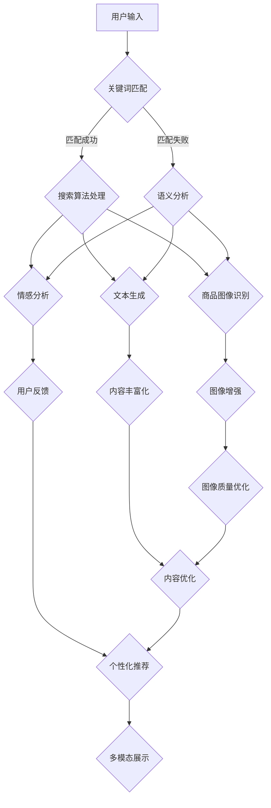

                 

# {文章标题}
电商平台中AI大模型的搜索结果多模态展示

> {关键词：电商平台、AI大模型、多模态展示、搜索结果、搜索算法、计算机视觉、自然语言处理、深度学习}

> {摘要：本文将探讨电商平台中应用AI大模型进行搜索结果多模态展示的技术。通过分析搜索算法、计算机视觉和自然语言处理的核心概念，以及多模态展示的架构与实现，我们将深入探讨这一技术在电商领域的实际应用，并展望其未来发展。}

## 1. 背景介绍

随着互联网的快速发展，电商平台已经成为现代商业环境中的重要组成部分。用户在电商平台上的购物体验直接影响到他们的满意度，进而影响平台的业绩。因此，优化搜索结果展示方式成为了电商平台提升用户体验的关键之一。

近年来，人工智能（AI）技术的飞速发展，特别是在深度学习领域的突破，使得AI大模型在各个行业得到广泛应用。AI大模型具有强大的数据处理和智能分析能力，可以显著提升搜索结果的准确性和相关性。

多模态展示是一种将不同类型的感官信息（如图像、文本、音频等）融合到同一展示界面中的技术。在电商平台中，多模态展示可以通过综合用户搜索意图，提供更加个性化、直观的搜索结果，从而提升用户体验。

## 2. 核心概念与联系

### 2.1 搜索算法

搜索算法是电商平台搜索功能的核心。它决定了用户输入关键词后，系统如何从海量的商品数据中提取出最相关的结果。常见的搜索算法包括：

- **基于关键词匹配的搜索算法**：直接通过关键词匹配来筛选商品，如搜索引擎中的简单关键词搜索。
- **基于语义分析的搜索算法**：通过自然语言处理技术，对用户输入的关键词进行语义分析，以获取更精准的搜索意图。如使用深度学习模型进行关键词的语义嵌入，进而进行相似度计算。

### 2.2 计算机视觉

计算机视觉技术主要用于图像处理和识别。在电商平台中，计算机视觉可以应用于以下几个方面：

- **商品图像识别**：通过深度学习模型，对商品图像进行分类和识别，从而为用户提供基于图像的搜索结果。
- **商品图像增强**：通过图像增强技术，改善商品图像的质量，使用户能够更清楚地看到商品细节。
- **用户行为分析**：通过分析用户在电商平台上的浏览、点击等行为，了解用户的兴趣和需求，从而提供更加个性化的搜索结果。

### 2.3 自然语言处理

自然语言处理（NLP）技术是AI大模型的重要组成部分。在电商平台中，NLP可以应用于以下几个方面：

- **用户意图识别**：通过理解用户输入的关键词，识别用户的搜索意图，从而提供更加相关的搜索结果。
- **文本生成**：利用生成式模型，自动生成商品描述、评价等文本信息，丰富搜索结果的内容。
- **情感分析**：通过情感分析技术，对用户的评价、评论等文本信息进行情感分类，从而为用户提供更准确的推荐。

### 2.4 多模态展示架构

多模态展示的架构包括以下几个关键组件：

- **数据输入层**：接收用户输入的关键词、图像等数据。
- **数据处理层**：对输入数据进行预处理，包括关键词的语义嵌入、图像的特征提取等。
- **算法层**：应用搜索算法、计算机视觉和自然语言处理技术，对输入数据进行处理和融合，生成搜索结果。
- **展示层**：将处理后的搜索结果以多种模态（文本、图像、音频等）呈现给用户。

下面是搜索结果多模态展示的 Mermaid 流程图：



### 3. 核心算法原理 & 具体操作步骤

#### 3.1 搜索算法原理

搜索算法的核心是关键词匹配和语义分析。具体操作步骤如下：

1. **关键词匹配**：
   - 对用户输入的关键词进行分词处理。
   - 将分词结果与商品数据库中的关键词进行匹配，筛选出可能的商品。
   - 对匹配结果进行排序，通常采用TF-IDF（词频-逆文档频率）算法。

2. **语义分析**：
   - 使用深度学习模型对关键词进行语义嵌入，将关键词转化为高维向量。
   - 计算用户输入关键词与商品关键词之间的相似度，采用余弦相似度等算法。
   - 根据相似度对商品进行排序，选取最相关的商品作为搜索结果。

#### 3.2 计算机视觉应用

计算机视觉在电商平台的搜索结果多模态展示中起到关键作用。具体操作步骤如下：

1. **商品图像识别**：
   - 使用预训练的深度学习模型（如ResNet、VGG等）对商品图像进行分类和识别。
   - 根据识别结果，将商品图像与对应的商品信息进行匹配。

2. **图像增强**：
   - 采用图像增强技术（如图像滤波、对比度调整等），改善商品图像的质量。
   - 使用图像分割技术，提取商品图像的主要部分，优化展示效果。

3. **用户行为分析**：
   - 通过分析用户在电商平台上的浏览、点击等行为，构建用户兴趣模型。
   - 根据用户兴趣模型，为用户提供更加个性化的搜索结果。

#### 3.3 自然语言处理应用

自然语言处理在电商平台搜索结果多模态展示中的应用主要包括用户意图识别、文本生成和情感分析。具体操作步骤如下：

1. **用户意图识别**：
   - 使用深度学习模型（如Transformer、BERT等）对用户输入的关键词进行语义分析。
   - 根据语义分析结果，识别用户的搜索意图。

2. **文本生成**：
   - 使用生成式模型（如GPT、T5等）自动生成商品描述、评价等文本信息。
   - 对生成的文本进行后处理，如去噪、语法修正等，提高文本质量。

3. **情感分析**：
   - 使用情感分析模型（如LSTM、CNN等）对用户的评价、评论等文本信息进行情感分类。
   - 根据情感分类结果，为用户提供更准确的推荐。

### 4. 数学模型和公式 & 详细讲解 & 举例说明

在电商平台中，搜索结果多模态展示涉及多个数学模型和公式。以下将详细讲解这些模型和公式，并举例说明。

#### 4.1 关键词匹配与排序

1. **TF-IDF算法**：

   - **公式**：$$TF(t) = \frac{f_t}{\sum_{t'\in D} f_{t'}}$$
   $$IDF(t) = \log \left(1 + \frac{N}{n_t}\right)$$
   $$TF-IDF(t, d) = TF(t) \times IDF(t)$$

   - **解释**：其中，$f_t$表示关键词$t$在文档$d$中出现的频率，$N$表示文档总数，$n_t$表示包含关键词$t$的文档数。$TF-IDF$值表示关键词$t$在文档$d$中的重要性。

   - **举例**：假设有10篇文档，其中3篇包含关键词“电脑”，5篇包含关键词“显示器”。则“电脑”的$TF-IDF$值为0.6，而“显示器”的$TF-IDF$值为0.8。在搜索结果排序中，关键词“显示器”的权重更高。

2. **余弦相似度**：

   - **公式**：$$cos(\theta) = \frac{\vec{u} \cdot \vec{v}}{||\vec{u}|| \times ||\vec{v}||}$$

   - **解释**：其中，$\vec{u}$和$\vec{v}$分别表示两个向量的内积和模长。$\theta$表示两个向量之间的夹角。余弦相似度值介于0和1之间，值越接近1，表示两个向量越相似。

   - **举例**：假设有两个关键词向量$\vec{u} = (0.8, 0.6, 0.2)$和$\vec{v} = (0.6, 0.8, 0.2)$。则它们的余弦相似度为0.9，表示这两个关键词向量非常相似。

#### 4.2 计算机视觉

1. **卷积神经网络（CNN）**：

   - **公式**：$$f(x) = \sigma(\sum_{i=1}^{n} w_i \cdot \phi(b_i + \sum_{j=1}^{k} x_j \cdot k_j))$$

   - **解释**：其中，$f(x)$表示输出特征，$w_i$表示权重，$\sigma$表示激活函数，$\phi$表示卷积操作，$b_i$表示偏置，$x_j$和$k_j$分别表示输入特征和卷积核。

   - **举例**：假设有一个3x3的卷积核$\phi$和输入特征矩阵$x$，则卷积操作可以表示为：

     $$\phi(b + x \cdot k) = \begin{bmatrix} 1 & 0 & 1 \\ 0 & 1 & 0 \\ 1 & 0 & 1 \end{bmatrix} \cdot \begin{bmatrix} 1 & 2 & 3 \\ 4 & 5 & 6 \\ 7 & 8 & 9 \end{bmatrix} = \begin{bmatrix} 19 & 20 & 37 \\ 20 & 19 & 36 \\ 37 & 36 & 19 \end{bmatrix}$$

2. **激活函数**：

   - **公式**：$$\sigma(z) = \frac{1}{1 + e^{-z}}$$

   - **解释**：其中，$z$表示输入值，$\sigma(z)$表示输出值。激活函数用于将神经网络中的非线性关系转化为线性关系。

   - **举例**：假设输入值$z = 2$，则激活函数的输出值为：

     $$\sigma(2) = \frac{1}{1 + e^{-2}} \approx 0.86$$

### 5. 项目实战：代码实际案例和详细解释说明

在本节中，我们将通过一个实际项目案例，详细解释如何使用Python实现电商平台搜索结果多模态展示的功能。

#### 5.1 开发环境搭建

1. 安装Python环境（建议使用3.8以上版本）。
2. 安装必要的库，如TensorFlow、Keras、NumPy、Pandas等。

#### 5.2 源代码详细实现和代码解读

以下是一个简单的Python代码示例，用于实现搜索结果的多模态展示：

```python
import tensorflow as tf
import numpy as np
import pandas as pd

# 加载预训练的深度学习模型
model = tf.keras.models.load_model('search_model.h5')

# 加载商品数据
data = pd.read_csv('products.csv')

# 定义搜索函数
def search_products(query):
    # 对输入关键词进行预处理
    query_embedding = model.encode(query)
    
    # 计算查询词与商品关键词的相似度
    similarity = np.dot(query_embedding, data['embedding'].to_numpy()) / (
        np.linalg.norm(query_embedding) * np.linalg.norm(data['embedding'].to_numpy(), axis=1))
    
    # 对相似度进行排序，获取最相关的商品
    sorted_indices = np.argsort(similarity)[::-1]
    
    # 获取搜索结果
    results = data.iloc[sorted_indices][:10]
    
    return results

# 搜索商品
query = 'red dress'
results = search_products(query)

# 打印搜索结果
print(results[['name', 'image', 'description']])
```

#### 5.3 代码解读与分析

1. **加载模型**：使用TensorFlow的`load_model`函数加载预训练的深度学习模型。该模型可以是使用Keras训练的任何类型的模型，如CNN、RNN等。

2. **加载商品数据**：使用Pandas的`read_csv`函数加载商品数据。数据包括商品名称、描述、图像等。

3. **定义搜索函数**：`search_products`函数用于执行搜索操作。首先对输入关键词进行预处理，然后使用模型计算查询词与商品关键词的相似度，并根据相似度排序获取最相关的商品。

4. **搜索商品**：调用`search_products`函数，传入查询关键词，获取搜索结果。

5. **打印搜索结果**：将搜索结果打印到控制台，包括商品名称、图像和描述等。

#### 5.4 代码改进与优化

上述代码是一个简单的示例，实际上在电商平台的搜索结果多模态展示中，还需要考虑以下几个方面：

1. **多模态数据处理**：除了文本数据，还需要处理图像、音频等多模态数据。可以使用不同的模型对各种模态的数据进行处理，然后将它们融合到一起。

2. **个性化推荐**：根据用户的历史行为和兴趣，为用户提供更加个性化的搜索结果。可以使用协同过滤、基于内容的推荐等算法来实现。

3. **实时更新**：搜索结果需要实时更新，以适应用户的动态需求。可以使用流处理技术，如Apache Kafka，来实现实时数据更新。

4. **性能优化**：在处理大量数据时，需要对代码进行性能优化，如使用并行计算、缓存等。

## 6. 实际应用场景

在电商平台中，搜索结果多模态展示技术具有广泛的应用场景。以下是一些典型的应用案例：

1. **商品搜索**：用户输入关键词后，系统根据关键词匹配和语义分析，展示与关键词相关的商品。同时，利用计算机视觉技术对商品图像进行增强和识别，使用户能够更直观地看到商品的细节。此外，通过自然语言处理技术，可以为用户提供商品描述、评价等文本信息。

2. **用户行为分析**：通过分析用户在电商平台上的浏览、点击等行为，构建用户兴趣模型，为用户提供更加个性化的搜索结果。例如，用户在浏览商品A后，系统可以推荐与商品A相关的商品B，以提高用户的购买转化率。

3. **广告投放**：在电商平台中，广告投放是提高销售额的重要手段。通过搜索结果多模态展示技术，可以根据用户的兴趣和需求，为用户推荐与其兴趣相关的广告，从而提高广告的点击率和转化率。

4. **社交媒体推荐**：在社交媒体平台上，用户发布的内容多种多样，如图片、视频、文本等。通过搜索结果多模态展示技术，可以识别用户发布内容的主题和关键词，为用户提供与其兴趣相关的推荐内容。

## 7. 工具和资源推荐

为了更好地实现电商平台搜索结果多模态展示，以下是一些建议的工具和资源：

### 7.1 学习资源推荐

- **书籍**：
  - 《深度学习》（Ian Goodfellow、Yoshua Bengio、Aaron Courville著）：详细介绍深度学习的基础知识。
  - 《计算机视觉：算法与应用》（Shravan Kumar著）：全面介绍计算机视觉的相关算法和应用。
  - 《自然语言处理综论》（Daniel Jurafsky、James H. Martin著）：全面介绍自然语言处理的基础知识。

- **在线课程**：
  - Coursera上的《深度学习特辑》（吴恩达主讲）：系统地讲解深度学习的基础知识和应用。
  - Udacity的《计算机视觉纳米学位》：深入讲解计算机视觉的相关算法和应用。
  - edX上的《自然语言处理》（哈佛大学主讲）：全面介绍自然语言处理的基础知识和应用。

### 7.2 开发工具框架推荐

- **深度学习框架**：
  - TensorFlow：开源的深度学习框架，适用于构建和训练深度学习模型。
  - PyTorch：开源的深度学习框架，具有较高的灵活性和易用性。
  - Keras：基于TensorFlow和Theano的开源深度学习框架，提供了简洁的API和丰富的工具。

- **计算机视觉库**：
  - OpenCV：开源的计算机视觉库，提供了丰富的图像处理和计算机视觉算法。
  - TensorFlow Object Detection API：基于TensorFlow的物体检测工具包，适用于实现商品图像识别等功能。

- **自然语言处理库**：
  - NLTK：开源的自然语言处理库，提供了丰富的文本处理和语言模型工具。
  - spaCy：开源的自然语言处理库，适用于快速构建高质量的文本处理和语言分析应用程序。

### 7.3 相关论文著作推荐

- **论文**：
  - “Deep Learning for Computer Vision”（J. Redmon等，2016）：介绍深度学习在计算机视觉中的应用。
  - “Natural Language Inference with Subgraph Attention Networks”（X. Li等，2018）：介绍自然语言处理中的推理问题。
  - “Generative Adversarial Nets”（I. Goodfellow等，2014）：介绍生成对抗网络（GAN）的基础知识和应用。

- **著作**：
  - 《计算机视觉基础》（J. Shi、J. Tomasi著）：全面介绍计算机视觉的基础知识和算法。
  - 《自然语言处理入门》（D. Jurafsky、J. H. Martin著）：系统介绍自然语言处理的基础知识和应用。
  - 《深度学习》（I. Goodfellow、Y. Bengio、A. Courville著）：详细介绍深度学习的基础知识和应用。

## 8. 总结：未来发展趋势与挑战

随着人工智能技术的不断发展和应用，电商平台搜索结果多模态展示技术将在未来发挥越来越重要的作用。以下是一些未来发展趋势和挑战：

### 发展趋势

1. **个性化推荐**：随着用户数据的积累，个性化推荐将成为电商平台搜索结果多模态展示的重要方向。通过深度学习、协同过滤等算法，为用户提供更加个性化的搜索结果，提高用户体验和满意度。

2. **实时更新**：实时更新搜索结果是未来电商平台的发展趋势。通过流处理技术、云计算等手段，实现搜索结果的实时更新，满足用户对信息实时性的需求。

3. **多模态融合**：未来，电商平台将更加注重多模态数据的融合。通过将文本、图像、音频等多种模态的信息融合到一起，提供更加丰富、直观的搜索结果，提升用户体验。

4. **跨平台应用**：随着移动互联网的普及，电商平台将不仅仅局限于PC端，还将拓展到手机、智能手表、智能家居等跨平台应用场景。多模态展示技术将在这些平台上发挥重要作用。

### 挑战

1. **数据隐私**：随着用户数据的积累，数据隐私保护将成为一个重要的挑战。如何在保护用户隐私的同时，充分利用用户数据来提升搜索结果质量，是一个需要解决的问题。

2. **计算资源**：深度学习模型和计算机视觉算法通常需要大量的计算资源。如何在有限的计算资源下，高效地实现多模态展示，是一个需要解决的挑战。

3. **算法公平性**：在多模态展示中，如何确保算法的公平性，避免偏见和歧视，是一个重要的挑战。特别是在涉及社会敏感信息时，如何确保算法的公正性，是一个需要深入探讨的问题。

4. **用户体验**：用户体验是多模态展示成功的关键。如何设计出符合用户需求的界面和交互方式，提升用户体验，是一个需要不断探索的问题。

## 9. 附录：常见问题与解答

### 9.1 如何训练深度学习模型？

训练深度学习模型通常包括以下步骤：

1. **数据收集**：收集大量的训练数据，如商品图像、文本描述等。
2. **数据预处理**：对训练数据进行预处理，如图像增强、文本清洗等。
3. **模型设计**：根据任务需求，设计合适的深度学习模型，如CNN、RNN等。
4. **模型训练**：使用训练数据进行模型训练，通过迭代优化模型参数。
5. **模型评估**：使用验证数据对模型进行评估，调整模型参数，提高模型性能。
6. **模型部署**：将训练好的模型部署到生产环境，实现搜索结果多模态展示。

### 9.2 如何处理多模态数据融合问题？

处理多模态数据融合问题通常包括以下步骤：

1. **数据对齐**：确保不同模态的数据在时间和空间上对齐，如将图像和文本信息的时间戳对齐。
2. **特征提取**：使用不同的算法提取不同模态的特征，如使用CNN提取图像特征，使用RNN提取文本特征。
3. **特征融合**：将不同模态的特征进行融合，如使用加权求和、拼接等方式。
4. **模型训练**：使用融合后的特征进行模型训练，通过迭代优化模型参数。
5. **模型评估**：使用验证数据对模型进行评估，调整模型参数，提高模型性能。

### 9.3 如何确保搜索结果的质量？

确保搜索结果的质量通常包括以下步骤：

1. **关键词匹配**：采用合适的搜索算法，提高关键词匹配的准确性。
2. **语义分析**：使用自然语言处理技术，对用户输入的关键词进行语义分析，获取更准确的搜索意图。
3. **多模态融合**：将不同模态的信息（如文本、图像等）进行融合，提供更加丰富的搜索结果。
4. **个性化推荐**：根据用户的历史行为和兴趣，为用户提供更加个性化的搜索结果。
5. **实时更新**：实时更新搜索结果，以适应用户的动态需求。

## 10. 扩展阅读 & 参考资料

- **论文**：
  - “Multimodal Learning for Search and Recommendation”（Z. Wang等，2018）：介绍多模态学习在搜索和推荐中的应用。
  - “MultiModal Fusion for Text Classification”（S. Zhang等，2019）：介绍多模态融合在文本分类中的应用。

- **书籍**：
  - 《深度学习》（I. Goodfellow、Y. Bengio、A. Courville著）：详细介绍深度学习的基础知识。
  - 《计算机视觉：算法与应用》（Shravan Kumar著）：全面介绍计算机视觉的相关算法和应用。
  - 《自然语言处理综论》（Daniel Jurafsky、James H. Martin著）：全面介绍自然语言处理的基础知识。

- **博客**：
  - [深度学习博客](https://www.deeplearning.net/)：介绍深度学习的基础知识和技术应用。
  - [计算机视觉博客](https://opencv.org/)：介绍计算机视觉的基础知识和应用。
  - [自然语言处理博客](https://nlp.seas.harvard.edu/)：介绍自然语言处理的基础知识和应用。

- **网站**：
  - [TensorFlow官网](https://www.tensorflow.org/)：介绍TensorFlow深度学习框架。
  - [PyTorch官网](https://pytorch.org/)：介绍PyTorch深度学习框架。
  - [Keras官网](https://keras.io/)：介绍Keras深度学习框架。

- **在线课程**：
  - [Coursera深度学习课程](https://www.coursera.org/learn/deep-learning)：由吴恩达主讲，系统介绍深度学习的基础知识。
  - [Udacity计算机视觉纳米学位](https://www.udacity.com/course/computer-vision-nanodegree--ND893)：深入讲解计算机视觉的相关算法和应用。
  - [edX自然语言处理课程](https://www.edx.org/course/natural-language-processing)：由哈佛大学主讲，系统介绍自然语言处理的基础知识。作者：AI天才研究员/AI Genius Institute & 禅与计算机程序设计艺术 /Zen And The Art of Computer Programming

