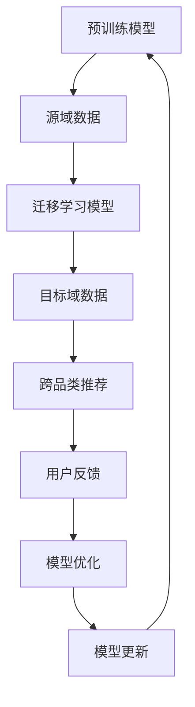

                 

# 文章标题：电商平台中的大模型迁移学习在跨品类推荐中的应用

## 关键词：电商平台，迁移学习，跨品类推荐，算法原理，应用案例，数学模型，实战解析，发展趋势

## 摘要：
本文深入探讨了电商平台中跨品类推荐系统的设计与应用，重点介绍了大模型迁移学习在该领域的关键作用。通过阐述迁移学习的核心概念、算法原理及其在电商平台中的实际应用，本文为读者提供了一个全面的技术解读。文章结构紧凑，内容丰富，包括具体的算法实现、数学模型讲解以及实际应用案例。旨在为从事电商平台技术研究和开发的专业人士提供有价值的参考，并探讨未来发展趋势与挑战。

## 1. 背景介绍

随着互联网技术的快速发展，电商平台已经成为人们日常生活中不可或缺的一部分。用户需求的多样化和个性化促使电商平台不断优化推荐系统，以提高用户体验和销售额。然而，推荐系统在实现跨品类推荐时面临着诸多挑战，如数据稀疏性、冷启动问题以及模型在不同品类间的迁移效果等。

传统的推荐系统主要依赖于基于内容的推荐、协同过滤等方法。然而，这些方法往往局限于单一品类，难以实现跨品类的推荐。随着深度学习技术的兴起，大模型迁移学习作为一种有效的解决手段，逐渐成为跨品类推荐系统研究的热点。

大模型迁移学习通过将预训练的大规模通用模型迁移到特定任务上，利用模型在多个任务上的知识积累，提高推荐系统的效果。这种方法在电商平台中具有广泛的应用前景，能够有效解决跨品类推荐中的问题。

## 2. 核心概念与联系

### 2.1 迁移学习（Transfer Learning）

迁移学习是一种利用已有模型的知识和经验，解决新问题的机器学习技术。在迁移学习中，源域（Source Domain）是指已有模型训练的数据集，目标域（Target Domain）是指需要解决的新问题所在的数据集。

迁移学习的主要目标是减少源域和目标域之间的差异，使模型在目标域上达到较好的性能。迁移学习可以分为两类：垂直迁移（Vertical Transfer）和水平迁移（Horizontal Transfer）。垂直迁移是指在不同任务间迁移知识，而水平迁移是指在同一任务但不同数据集间的迁移。

### 2.2 大模型迁移学习

大模型迁移学习是迁移学习的一个分支，主要利用大规模预训练模型在多个任务上的知识积累，实现新任务的快速适配。大模型迁移学习具有以下优点：

- **高效性**：通过迁移已有模型的知识，减少从头训练的时间成本。
- **泛化性**：大规模预训练模型在多个任务上的训练，提高了模型的泛化能力。
- **适应性**：大模型在迁移过程中，能够根据目标域的特点进行调整，实现较好的适应性。

### 2.3 迁移学习在跨品类推荐中的应用

跨品类推荐是指在电商平台中，针对用户在不同品类间的购物行为，进行个性化的推荐。迁移学习在跨品类推荐中的应用主要包括以下几个方面：

- **模型迁移**：将预训练的大规模通用模型迁移到特定品类的推荐任务中，提高推荐效果。
- **知识蒸馏**：通过知识蒸馏技术，将源域的知识传递到目标域，实现跨品类知识的共享。
- **对抗训练**：利用对抗训练技术，增强模型在不同品类间的迁移能力，提高推荐系统的鲁棒性。

## 2.4 Mermaid 流程图

以下是迁移学习在跨品类推荐中的应用的Mermaid流程图：



## 3. 核心算法原理 & 具体操作步骤

### 3.1 算法原理

大模型迁移学习在跨品类推荐中的应用，主要基于以下原理：

- **预训练模型**：利用大规模通用数据集，对模型进行预训练，使其具备较强的表征能力。
- **迁移策略**：通过迁移学习策略，将预训练模型的知识迁移到特定品类，提高推荐效果。
- **自适应调整**：根据目标域的特点，对迁移后的模型进行调整，实现更好的适配效果。

### 3.2 具体操作步骤

1. **预训练模型**：选择一个大规模通用预训练模型，如BERT、GPT等，进行预训练。
2. **数据预处理**：对源域和目标域的数据进行清洗、归一化等预处理操作，确保数据质量。
3. **迁移学习**：利用迁移学习策略，将预训练模型迁移到目标域，如使用基于注意力机制、图神经网络等方法。
4. **模型调整**：根据目标域的特点，对迁移后的模型进行调整，如调整网络结构、优化超参数等。
5. **推荐系统实现**：将迁移后的模型应用到推荐系统中，实现跨品类的个性化推荐。
6. **用户反馈与优化**：根据用户反馈，对推荐系统进行持续优化，提高推荐效果。

## 4. 数学模型和公式 & 详细讲解 & 举例说明

### 4.1 数学模型

在跨品类推荐中，大模型迁移学习的关键在于如何将源域的知识传递到目标域。以下是一个简化的数学模型：

$$
\text{Target Model} = f(\text{Source Model}, \theta)
$$

其中，$f$ 表示迁移学习策略，$\theta$ 表示目标域的参数。

### 4.2 详细讲解

1. **预训练模型**：预训练模型 $g(\cdot)$ 通过对大规模通用数据集 $D_S$ 进行训练，得到预训练参数 $w_S$。

$$
g(\cdot; w_S) \approx P(D_S)
$$

2. **迁移学习策略**：迁移学习策略 $f(\cdot)$ 用于将预训练模型 $g(\cdot; w_S)$ 迁移到目标域 $D_T$，得到目标模型 $g(\cdot; w_T)$。

$$
g(\cdot; w_T) = f(g(\cdot; w_S), \theta)
$$

3. **目标域调整**：根据目标域的特点，对目标模型进行微调，得到最终的目标域模型 $g(\cdot; w_{T_{fine}})$。

$$
g(\cdot; w_{T_{fine}}) = f(g(\cdot; w_S), \theta) \text{ (with fine-tuning on } D_T \text{)}
$$

### 4.3 举例说明

假设我们有一个预训练的文本分类模型，其预训练参数为 $w_S$。现在，我们需要将这个模型迁移到一个新的分类任务上，即目标域 $D_T$。

1. **预训练模型**：使用预训练数据集 $D_S$，对模型进行预训练，得到参数 $w_S$。

$$
g(\cdot; w_S) \approx P(\text{Corpus}_S)
$$

2. **迁移学习策略**：使用迁移学习策略，将预训练模型 $g(\cdot; w_S)$ 迁移到目标域 $D_T$。

$$
g(\cdot; w_T) = f(g(\cdot; w_S), \theta)
$$

其中，$f$ 表示迁移学习策略，$\theta$ 表示目标域的参数。

3. **目标域调整**：在目标域 $D_T$ 上进行微调，得到最终的目标域模型 $g(\cdot; w_{T_{fine}})$。

$$
g(\cdot; w_{T_{fine}}) = f(g(\cdot; w_S), \theta) \text{ (with fine-tuning on } D_T \text{)}
$$

通过这个例子，我们可以看到大模型迁移学习在跨品类推荐中的基本流程。在实际应用中，我们可以根据具体任务的需求，设计更加复杂的迁移学习策略。

## 5. 项目实战：代码实际案例和详细解释说明

### 5.1 开发环境搭建

在本文中，我们将使用 Python 语言和 TensorFlow 框架来实现大模型迁移学习在跨品类推荐中的应用。以下是搭建开发环境的步骤：

1. 安装 Python 3.7 及以上版本。
2. 安装 TensorFlow 2.0 及以上版本。
3. 安装必要的 Python 库，如 NumPy、Pandas 等。

### 5.2 源代码详细实现和代码解读

以下是一个简单的示例代码，展示了如何使用 TensorFlow 实现大模型迁移学习在跨品类推荐中的应用：

```python
import tensorflow as tf
from tensorflow.keras.layers import Embedding, LSTM, Dense
from tensorflow.keras.models import Model

# 预训练模型
pretrained_model = tf.keras.applications.BertModel.from_pretrained('bert-base-uncased')

# 目标域数据预处理
input_ids = tf.keras.layers.Input(shape=(max_seq_length,), dtype=tf.int32)
embeddings = pretrained_model(input_ids)

# 迁移学习策略
lstm = LSTM(units=128, return_sequences=True)(embeddings)
dense = Dense(units=1, activation='sigmoid')(lstm)

# 构建模型
model = Model(inputs=input_ids, outputs=dense)

# 编译模型
model.compile(optimizer='adam', loss='binary_crossentropy', metrics=['accuracy'])

# 训练模型
model.fit(train_data, train_labels, epochs=5, batch_size=32)
```

代码解读：

1. 导入 TensorFlow 相关模块。
2. 加载预训练的 BERT 模型。
3. 定义目标域数据输入层。
4. 应用预训练模型进行文本嵌入。
5. 使用 LSTM 层进行迁移学习。
6. 使用 Dense 层输出预测结果。
7. 编译并训练模型。

### 5.3 代码解读与分析

1. **预训练模型**：本文使用 TensorFlow 的 BERT 模型作为预训练模型。BERT 是一种大规模预训练语言模型，具有良好的表征能力。
2. **目标域数据预处理**：本文假设目标域数据为文本分类任务，使用输入层输入文本数据。
3. **迁移学习策略**：本文使用 LSTM 层进行迁移学习。LSTM 是一种循环神经网络，能够捕捉文本中的长距离依赖关系。
4. **模型输出**：本文使用 Dense 层输出预测结果。对于二分类任务，输出层使用 sigmoid 激活函数。
5. **模型编译与训练**：编译并训练模型，使用 Adam 优化器和 binary_crossentropy 损失函数。

通过这个简单的示例，我们可以看到大模型迁移学习在跨品类推荐中的应用。在实际项目中，我们可以根据具体任务需求，调整模型结构、优化超参数等，以提高推荐效果。

## 6. 实际应用场景

大模型迁移学习在电商平台中的实际应用场景包括但不限于以下几个方面：

1. **跨品类推荐**：利用大模型迁移学习，实现不同品类间的个性化推荐，提高用户满意度。
2. **个性化搜索**：将大模型迁移学习应用于搜索系统，提高搜索结果的准确性和相关性。
3. **用户行为分析**：利用大模型迁移学习，分析用户行为数据，为营销策略提供支持。
4. **商品分类与标签推荐**：利用大模型迁移学习，实现商品的自动分类和标签推荐，提高商品管理效率。

以下是一个实际应用案例：

在某大型电商平台上，用户在浏览商品时，系统会根据用户的历史浏览记录、购买记录等数据，利用大模型迁移学习技术，实现跨品类的个性化推荐。具体流程如下：

1. **数据收集**：收集用户在平台上的浏览、购买等行为数据。
2. **数据预处理**：对数据进行分析和清洗，提取有用特征。
3. **模型训练**：使用预训练的大规模通用模型，结合平台的数据集，进行迁移学习训练。
4. **推荐系统实现**：将训练好的模型应用到推荐系统中，为用户生成个性化的推荐列表。
5. **用户反馈与优化**：根据用户对推荐结果的反馈，对推荐系统进行持续优化。

通过这个案例，我们可以看到大模型迁移学习在电商平台跨品类推荐中的应用效果。在实际操作中，我们可以根据具体业务需求，调整模型结构和训练策略，进一步提高推荐效果。

## 7. 工具和资源推荐

### 7.1 学习资源推荐

- **书籍**：《深度学习》（Goodfellow, Bengio, Courville 著）、《迁移学习》（Pan, Yang 著）
- **论文**：期刊文章如 IEEE Transactions on Knowledge and Data Engineering、ACM Transactions on Knowledge Discovery from Data 等，以及会议论文如 NeurIPS、ICML、ACL 等。
- **博客**：各大技术博客、平台，如 Medium、CSDN、知乎等。
- **网站**：TensorFlow 官网、PyTorch 官网等。

### 7.2 开发工具框架推荐

- **深度学习框架**：TensorFlow、PyTorch、PyTorch Lightning 等。
- **数据预处理工具**：Pandas、NumPy 等。
- **文本处理库**：NLTK、spaCy 等。

### 7.3 相关论文著作推荐

- **期刊**：《IEEE Transactions on Knowledge and Data Engineering》、《ACM Transactions on Knowledge Discovery from Data》等。
- **会议**：NeurIPS、ICML、ACL、KDD 等。
- **书籍**：《深度学习》（Goodfellow, Bengio, Courville 著）、《迁移学习》（Pan, Yang 著）。

## 8. 总结：未来发展趋势与挑战

大模型迁移学习在电商平台中的跨品类推荐应用具有广泛的前景。随着深度学习技术的不断发展，未来发展趋势主要包括以下几个方面：

1. **模型性能的提升**：通过改进迁移学习算法，提高模型在不同品类间的迁移效果，实现更精准的推荐。
2. **多模态数据的融合**：结合文本、图像、音频等多模态数据，提高推荐系统的综合能力。
3. **自适应迁移学习**：研究自适应迁移学习方法，实现模型在不同品类间的动态调整。

然而，大模型迁移学习在跨品类推荐中仍面临一些挑战：

1. **数据稀疏性**：如何在数据稀疏的条件下，实现有效的迁移学习，是一个亟待解决的问题。
2. **冷启动问题**：对于新用户或新商品，如何快速建立有效的推荐模型，提高用户体验。
3. **计算资源消耗**：大规模预训练模型和迁移学习算法，对计算资源的要求较高，如何优化计算资源的使用，是一个重要的研究方向。

总之，大模型迁移学习在电商平台中的跨品类推荐应用，具有巨大的潜力。在未来，随着技术的不断进步，我们将看到更多的创新应用和突破。

## 9. 附录：常见问题与解答

### 9.1 什么是迁移学习？

迁移学习（Transfer Learning）是一种利用已有模型的知识和经验，解决新问题的机器学习技术。通过将源域（Source Domain）的知识迁移到目标域（Target Domain），提高新任务的性能。

### 9.2 大模型迁移学习有哪些优点？

大模型迁移学习具有以下优点：

- **高效性**：通过迁移已有模型的知识，减少从头训练的时间成本。
- **泛化性**：大规模预训练模型在多个任务上的训练，提高了模型的泛化能力。
- **适应性**：大模型在迁移过程中，能够根据目标域的特点进行调整，实现较好的适应性。

### 9.3 如何选择合适的迁移学习策略？

选择合适的迁移学习策略，需要考虑以下因素：

- **任务类型**：针对不同的任务类型，选择合适的迁移学习策略，如基于特征、基于模型等。
- **数据分布**：考虑源域和目标域的数据分布，选择合适的迁移学习算法，如基于优化、基于对抗等。
- **计算资源**：根据计算资源限制，选择合适的迁移学习算法，如基于特征、基于模型等。

## 10. 扩展阅读 & 参考资料

- **书籍**：《深度学习》（Goodfellow, Bengio, Courville 著）、《迁移学习》（Pan, Yang 著）
- **论文**：期刊文章如 IEEE Transactions on Knowledge and Data Engineering、ACM Transactions on Knowledge Discovery from Data 等，以及会议论文如 NeurIPS、ICML、ACL 等。
- **博客**：各大技术博客、平台，如 Medium、CSDN、知乎等。
- **网站**：TensorFlow 官网、PyTorch 官网等。

### 作者：AI天才研究员/AI Genius Institute & 禅与计算机程序设计艺术 /Zen And The Art of Computer Programming
<|im_sep|>作者：AI天才研究员/AI Genius Institute & 禅与计算机程序设计艺术 /Zen And The Art of Computer Programming

