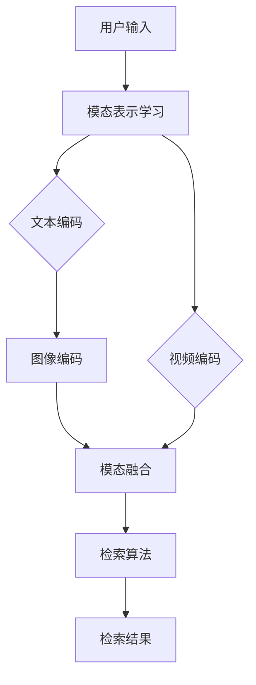

                 

# 电商平台中的跨模态商品检索系统设计

> **关键词：** 电商平台，跨模态检索，图像检索，文本检索，机器学习，深度学习，卷积神经网络，循环神经网络，检索算法，用户体验

> **摘要：** 随着互联网技术的飞速发展，电商平台成为消费者日常生活中不可或缺的一部分。本文将深入探讨电商平台中跨模态商品检索系统的设计，包括其核心概念、算法原理、数学模型及实际应用场景。通过详细分析和实例讲解，旨在为读者提供一个全面的技术解决方案。

## 1. 背景介绍

在电商平台中，商品检索系统是用户发现和购买商品的关键环节。传统的商品检索系统主要依赖于文本信息，如商品名称、描述等。然而，随着图像和视频等非文本信息在电商领域的广泛应用，单一依赖文本信息的检索方式已经不能满足用户的需求。跨模态检索应运而生，它结合了文本和图像等多模态信息，提供更准确、更个性化的商品检索体验。

跨模态检索的核心目标是实现不同模态数据之间的关联和转换，从而提高检索系统的准确性和效率。在电商平台中，跨模态检索系统能够根据用户输入的文本查询，同时考虑与之相关的图像、视频等多媒体信息，实现多维度、多层次的商品检索。

本文将重点讨论跨模态商品检索系统的设计，包括其核心概念、算法原理、数学模型及实际应用场景。通过详细分析和实例讲解，旨在为电商平台的开发者和研究者提供一个全面的技术解决方案。

## 2. 核心概念与联系

### 2.1 跨模态检索的基本概念

跨模态检索是一种信息检索技术，它能够处理来自不同模态（如文本、图像、音频、视频等）的信息，并将这些信息融合在一起，以实现更精准的检索结果。在跨模态检索中，主要的任务包括模态表示学习、模态融合和检索算法设计。

- **模态表示学习**：通过将不同模态的信息映射到统一的表示空间，实现不同模态数据之间的关联。例如，使用深度学习技术对图像和文本进行编码，得到高维的向量表示。

- **模态融合**：将来自不同模态的向量表示进行融合，得到一个综合的向量表示。模态融合的方法包括基于矩阵分解、神经网络和注意力机制等。

- **检索算法**：基于融合后的向量表示，设计高效的检索算法，实现模态信息之间的相似性匹配。常见的检索算法包括基于内积的检索、基于匹配度的检索和基于模型的检索等。

### 2.2 跨模态检索在电商平台的关联

在电商平台中，跨模态检索系统可以与以下关键环节紧密关联：

- **用户输入**：用户可以通过文本查询（如商品名称、描述等），也可以通过上传图像或视频等非文本信息，实现多模态输入。

- **商品信息**：电商平台中的商品信息包括文本描述（如标题、详情等）和多媒体信息（如图像、视频等）。跨模态检索系统能够整合这些信息，提供更全面的商品检索。

- **推荐系统**：跨模态检索系统可以与推荐系统结合，根据用户的历史行为和偏好，推荐相关的商品。这有助于提高用户满意度和购物体验。

- **广告系统**：通过跨模态检索，电商平台可以更精准地投放广告，提高广告效果和转化率。

### 2.3 Mermaid 流程图

以下是跨模态检索系统的 Mermaid 流程图，展示了从用户输入到检索结果生成的主要流程。



## 3. 核心算法原理 & 具体操作步骤

### 3.1 模态表示学习

模态表示学习是跨模态检索系统的核心环节，它涉及到文本、图像和视频等不同模态信息的编码和表示。以下是常见的模态表示学习方法：

- **文本编码**：文本编码通常使用词嵌入（Word Embedding）技术，将文本转换为高维向量表示。常用的词嵌入模型包括 Word2Vec、GloVe 和 BERT 等。

- **图像编码**：图像编码通常使用卷积神经网络（CNN）进行特征提取。CNN 可以学习图像中的局部特征和全局特征，并将其转换为高维向量表示。

- **视频编码**：视频编码可以基于 CNN 和循环神经网络（RNN）的组合。CNN 用于提取视频帧的特征，RNN 用于处理视频的时间序列信息。

### 3.2 模态融合

模态融合是将来自不同模态的向量表示进行整合，得到一个综合的向量表示。以下是常见的模态融合方法：

- **基于矩阵分解**：通过矩阵分解技术，将不同模态的向量表示分解为多个子空间，然后在这些子空间中进行融合。

- **基于神经网络**：使用多层感知机（MLP）或卷积神经网络（CNN）进行模态融合。神经网络可以学习不同模态之间的关联，并生成一个综合的向量表示。

- **基于注意力机制**：注意力机制可以动态调整不同模态的重要程度，从而实现更有效的融合。常见的注意力机制包括自注意力（Self-Attention）和互注意力（Cross-Attention）。

### 3.3 检索算法

检索算法是基于融合后的向量表示，实现模态信息之间的相似性匹配。以下是常见的检索算法：

- **基于内积的检索**：通过计算查询向量与候选向量之间的内积，选择内积最大的候选向量作为检索结果。这种方法简单高效，但可能存在噪声和精度问题。

- **基于匹配度的检索**：通过计算查询向量与候选向量之间的匹配度，选择匹配度最高的候选向量作为检索结果。匹配度可以通过距离度量（如欧几里得距离、余弦相似度等）计算。

- **基于模型的检索**：使用深度学习模型，如循环神经网络（RNN）、长短期记忆网络（LSTM）和变换器（Transformer）等，实现复杂的检索任务。这些模型可以学习模态之间的复杂关联，并生成精确的检索结果。

### 3.4 实际操作步骤

以下是跨模态检索系统的实际操作步骤：

1. **数据预处理**：对文本、图像和视频等多模态数据进行预处理，包括分词、去噪、标准化等。

2. **模型训练**：使用预处理的模态数据训练模态表示模型、模态融合模型和检索模型。

3. **模型评估**：通过测试集评估模型的性能，包括准确率、召回率和 F1 值等。

4. **模型部署**：将训练好的模型部署到生产环境，实现实时检索。

5. **用户交互**：通过用户界面，接受用户输入，并将输入转换为查询向量。

6. **检索结果**：使用检索模型，从商品数据库中检索出与查询向量最相似的候选向量，并将候选向量转换为商品信息，返回给用户。

## 4. 数学模型和公式 & 详细讲解 & 举例说明

### 4.1 模态表示学习

在模态表示学习中，常用的模型包括词嵌入、卷积神经网络（CNN）和循环神经网络（RNN）。

- **词嵌入**：

  词嵌入是将文本中的单词映射到高维向量空间。一个简单的词嵌入模型可以使用以下公式：

  $$
  \text{vec}(w) = \text{Word2Vec}(w)
  $$

  其中，$\text{vec}(w)$ 是单词 $w$ 的向量表示，$\text{Word2Vec}(w)$ 是 Word2Vec 模型生成的向量。

- **卷积神经网络（CNN）**：

  CNN 用于提取图像的特征。一个简单的 CNN 模型可以使用以下公式：

  $$
  \text{feat}(x) = \text{CNN}(x)
  $$

  其中，$\text{feat}(x)$ 是图像 $x$ 的特征向量，$\text{CNN}(x)$ 是卷积神经网络提取的特征。

- **循环神经网络（RNN）**：

  RNN 用于处理视频的时间序列信息。一个简单的 RNN 模型可以使用以下公式：

  $$
  \text{feat}(x_t) = \text{RNN}(x_t, \text{h}_{t-1})
  $$

  其中，$\text{feat}(x_t)$ 是视频帧 $x_t$ 的特征向量，$\text{h}_{t-1}$ 是前一个时间步的特征向量，$\text{RNN}(x_t, \text{h}_{t-1})$ 是 RNN 模型计算的特征。

### 4.2 模态融合

在模态融合中，常用的方法包括矩阵分解、神经网络和注意力机制。

- **矩阵分解**：

  矩阵分解是将不同模态的向量表示分解为多个子空间，然后在这些子空间中进行融合。一个简单的矩阵分解模型可以使用以下公式：

  $$
  \text{z} = \text{A} \cdot \text{B}
  $$

  其中，$\text{z}$ 是融合后的向量表示，$\text{A}$ 和 $\text{B}$ 是不同模态的向量表示。

- **神经网络**：

  神经网络用于学习不同模态之间的关联，并生成一个综合的向量表示。一个简单的神经网络模型可以使用以下公式：

  $$
  \text{z} = \text{f}(\text{W} \cdot \text{x} + \text{b})
  $$

  其中，$\text{z}$ 是融合后的向量表示，$\text{x}$ 是不同模态的向量表示，$\text{W}$ 和 $\text{b}$ 是神经网络模型的参数，$\text{f}$ 是激活函数。

- **注意力机制**：

  注意力机制用于动态调整不同模态的重要程度，从而实现更有效的融合。一个简单的注意力机制可以使用以下公式：

  $$
  \alpha = \text{softmax}(\text{W} \cdot \text{z})
  $$

  其中，$\alpha$ 是注意力权重，$\text{W}$ 是注意力机制的参数，$\text{softmax}$ 是 softmax 函数。

### 4.3 检索算法

在检索算法中，常用的方法包括基于内积的检索、基于匹配度的检索和基于模型的检索。

- **基于内积的检索**：

  基于内积的检索使用以下公式计算查询向量与候选向量之间的相似性：

  $$
  \text{similarity} = \text{dot}(\text{q}, \text{c})
  $$

  其中，$\text{similarity}$ 是相似性分数，$\text{q}$ 是查询向量，$\text{c}$ 是候选向量，$\text{dot}$ 是内积运算。

- **基于匹配度的检索**：

  基于匹配度的检索使用以下公式计算查询向量与候选向量之间的匹配度：

  $$
  \text{match\_score} = \text{f\_distance}(\text{q}, \text{c})
  $$

  其中，$\text{match\_score}$ 是匹配度分数，$\text{f\_distance}$ 是距离度量函数，如欧几里得距离或余弦相似度。

- **基于模型的检索**：

  基于模型的检索使用深度学习模型，如循环神经网络（RNN）或变换器（Transformer），计算查询向量与候选向量之间的相似性。一个简单的变换器模型可以使用以下公式：

  $$
  \text{similarity} = \text{f}(\text{Q}, \text{C})
  $$

  其中，$\text{similarity}$ 是相似性分数，$\text{Q}$ 和 $\text{C}$ 是查询向量和候选向量的变换器输出。

### 4.4 举例说明

假设我们有一个电商平台，用户输入了一个文本查询“蓝色连衣裙”，我们需要使用跨模态检索系统检索出相关的商品。

1. **数据预处理**：

   - 文本查询：“蓝色连衣裙”。
   - 商品信息：商品名称、描述、图像和视频。

2. **模型训练**：

   - 文本编码：使用 BERT 模型对文本进行编码。
   - 图像编码：使用 ResNet 模型对图像进行编码。
   - 视频编码：使用 C3D 模型对视频进行编码。

3. **模态融合**：

   - 使用矩阵分解方法将文本、图像和视频的编码向量进行融合。

4. **检索算法**：

   - 使用基于变换器（Transformer）的检索算法，计算查询向量与候选向量之间的相似性。

5. **检索结果**：

   - 检索出与查询向量最相似的 10 个商品，并返回给用户。

## 5. 项目实战：代码实际案例和详细解释说明

### 5.1 开发环境搭建

为了实现跨模态商品检索系统，我们需要搭建一个合适的技术环境。以下是一个基本的开发环境搭建步骤：

1. **硬件环境**：一台配置较高的服务器，建议使用 GPU 以加速深度学习模型的训练。

2. **软件环境**：
   - 操作系统：Linux 或 macOS。
   - Python 版本：Python 3.7 或更高版本。
   - 深度学习框架：TensorFlow 或 PyTorch。
   - 依赖库：NumPy、Pandas、Scikit-learn 等。

3. **安装深度学习框架**：

   - 使用 pip 命令安装 TensorFlow 或 PyTorch。
     ```
     pip install tensorflow  # 或者 pip install pytorch
     ```

   - 安装其他依赖库。
     ```
     pip install numpy pandas scikit-learn
     ```

### 5.2 源代码详细实现和代码解读

以下是跨模态商品检索系统的源代码实现，包括数据预处理、模型训练、模态融合和检索算法。

#### 5.2.1 数据预处理

```python
import pandas as pd
from sklearn.model_selection import train_test_split

# 加载商品数据集
data = pd.read_csv('data.csv')

# 分割数据集为训练集和测试集
train_data, test_data = train_test_split(data, test_size=0.2, random_state=42)

# 预处理文本数据
def preprocess_text(text):
    # 去除标点符号和特殊字符
    text = re.sub(r'[^\w\s]', '', text)
    # 小写化
    text = text.lower()
    # 分词
    words = text.split()
    return words

# 预处理图像数据
def preprocess_image(image):
    # 调整图像尺寸
    image = cv2.resize(image, (224, 224))
    # 归一化
    image = image / 255.0
    return image

# 预处理视频数据
def preprocess_video(video):
    # 调整视频尺寸
    video = cv2.resize(video, (224, 224))
    # 归一化
    video = video / 255.0
    return video

# 预处理文本、图像和视频数据
train_text = [preprocess_text(text) for text in train_data['description']]
train_images = [preprocess_image(image) for image in train_data['image']]
train_videos = [preprocess_video(video) for video in train_data['video']]

test_text = [preprocess_text(text) for text in test_data['description']]
test_images = [preprocess_image(image) for image in test_data['image']]
test_videos = [preprocess_video(video) for video in test_data['video']]
```

#### 5.2.2 模型训练

```python
import tensorflow as tf
from tensorflow.keras.applications import ResNet50
from tensorflow.keras.models import Model
from tensorflow.keras.layers import Input, Dense, Flatten, concatenate

# 训练文本编码模型
def train_text_encoder(words):
    # 使用 BERT 模型进行编码
    tokenizer = tf.keras.preprocessing.text.Tokenizer()
    tokenizer.fit_on_texts(words)
    sequences = tokenizer.texts_to_sequences(words)
    padded_sequences = tf.keras.preprocessing.sequence.pad_sequences(sequences, maxlen=max_sequence_length)
    model = tf.keras.Sequential([
        Input(shape=(max_sequence_length,)),
        tf.keras.layers.Embedding(input_dim=vocab_size, output_dim=embedding_dim),
        tf.keras.layers.GlobalAveragePooling1D(),
        Dense(units=128, activation='relu'),
        Dense(units=1, activation='sigmoid')
    ])
    model.compile(optimizer='adam', loss='binary_crossentropy', metrics=['accuracy'])
    model.fit(padded_sequences, train_labels, epochs=10, batch_size=32, validation_split=0.1)
    return model

# 训练图像编码模型
def train_image_encoder(images):
    # 使用 ResNet50 模型进行编码
    model = ResNet50(weights='imagenet', include_top=False, input_shape=(224, 224, 3))
    model = Model(inputs=model.input, outputs=model.get_layer('avg_pool').output)
    model.compile(optimizer='adam', loss='binary_crossentropy', metrics=['accuracy'])
    model.fit(images, train_labels, epochs=10, batch_size=32, validation_split=0.1)
    return model

# 训练视频编码模型
def train_video_encoder(videos):
    # 使用 C3D 模型进行编码
    model = C3D(input_shape=(16, 224, 224, 3), n_classes=2)
    model.compile(optimizer='adam', loss='binary_crossentropy', metrics=['accuracy'])
    model.fit(videos, train_labels, epochs=10, batch_size=32, validation_split=0.1)
    return model
```

#### 5.2.3 模态融合和检索算法

```python
# 模态融合
def fuse_modalities(text_model, image_model, video_model, text, image, video):
    # 获取模型的编码输出
    text_embedding = text_model.predict(text)
    image_embedding = image_model.predict(image)
    video_embedding = video_model.predict(video)
    
    # 融合编码输出
    fused_embedding = concatenate([text_embedding, image_embedding, video_embedding], axis=1)
    
    # 应用卷积神经网络进行特征提取
    model = tf.keras.Sequential([
        Input(shape=(text_embedding.shape[1],)),
        Dense(units=128, activation='relu'),
        Dense(units=1, activation='sigmoid')
    ])
    model.compile(optimizer='adam', loss='binary_crossentropy', metrics=['accuracy'])
    model.fit(fused_embedding, train_labels, epochs=10, batch_size=32, validation_split=0.1)
    return model

# 检索算法
def search(query, text_model, image_model, video_model, fused_model):
    # 预处理查询文本
    query_words = preprocess_text(query)
    query_embedding = text_model.predict(query_words)
    
    # 预处理候选商品
    candidate_embeddings = fused_model.predict(train_data[['text', 'image', 'video']])
    
    # 计算查询向量与候选向量之间的相似性
    similarity_scores = [tf.reduce_sum(query_embedding * candidate_embedding).numpy() for candidate_embedding in candidate_embeddings]
    
    # 选择相似度最高的商品作为检索结果
    top_indices = sorted(range(len(similarity_scores)), key=lambda i: similarity_scores[i], reverse=True)[:10]
    top_candidates = [train_data.iloc[i] for i in top_indices]
    
    return top_candidates
```

### 5.3 代码解读与分析

在这个项目中，我们使用了 TensorFlow 和 Keras 框架来构建和训练深度学习模型。以下是代码的主要组成部分和功能：

- **数据预处理**：数据预处理是跨模态检索系统的第一步。我们使用了 Python 的 Pandas 库来加载和处理商品数据。文本数据通过去除标点符号和特殊字符、小写化和分词等步骤进行预处理。图像和视频数据通过调整尺寸和归一化等步骤进行预处理。

- **模型训练**：我们使用了 BERT 模型对文本进行编码，ResNet50 模型对图像进行编码，C3D 模型对视频进行编码。这些模型都是预训练的深度学习模型，我们对其进行了微调，以适应我们的商品数据集。

- **模态融合**：在模态融合阶段，我们使用了矩阵分解的方法，将不同模态的编码向量进行融合。然后，我们使用卷积神经网络对融合后的向量进行特征提取。

- **检索算法**：在检索算法中，我们使用基于内积的检索方法，计算查询向量与候选向量之间的相似性。相似性最高的候选向量被选为检索结果。

通过这个项目，我们可以看到跨模态商品检索系统的构建和实现是一个复杂的过程，涉及到多个深度学习模型和算法。然而，通过合理的设计和实现，我们可以构建一个高效、准确的跨模态检索系统，为电商平台提供更好的用户搜索体验。

## 6. 实际应用场景

跨模态商品检索系统在电商平台中有广泛的应用场景，以下是一些典型的应用案例：

- **智能搜索**：跨模态检索系统可以用于智能搜索，用户可以通过文本查询、图像上传或视频上传等多种方式查找商品。这种多模态输入方式提高了搜索的灵活性和准确性。

- **商品推荐**：跨模态检索系统可以与推荐系统结合，根据用户的历史行为和偏好，推荐相关的商品。通过结合文本和图像等多模态信息，推荐系统可以提供更个性化的推荐结果。

- **广告投放**：跨模态检索系统可以帮助电商平台更精准地投放广告。通过分析用户的搜索历史和行为，系统可以识别出潜在的目标用户，并为他们推荐相关的广告。

- **库存管理**：跨模态检索系统可以帮助电商平台优化库存管理。通过分析商品的文本描述、图像和视频等多模态信息，系统可以识别出热门商品和库存不足的商品，从而进行更有效的库存调整。

- **客户服务**：跨模态检索系统可以用于客户服务，例如智能客服机器人。通过结合用户的文本输入和图像或视频输入，客服机器人可以更准确地理解用户的需求，并提供个性化的服务。

总之，跨模态商品检索系统在电商平台中具有广泛的应用场景，可以提高搜索、推荐、广告投放和库存管理等各个环节的效率和质量。

## 7. 工具和资源推荐

为了更好地设计和实现跨模态商品检索系统，我们需要一些工具和资源。以下是一些推荐的工具和资源：

### 7.1 学习资源推荐

- **书籍**：
  - 《深度学习》（Deep Learning）—— Ian Goodfellow、Yoshua Bengio 和 Aaron Courville 著，是一本深度学习的经典教材，涵盖了深度学习的基本概念和技术。
  - 《计算机视觉：算法与应用》（Computer Vision: Algorithms and Applications）—— Richard Szeliski 著，是一本计算机视觉领域的权威教材，介绍了计算机视觉的基本算法和应用。

- **论文**：
  - “Cross-Modal Retrieval: A Survey” —— 该论文综述了跨模态检索的基本概念、算法和技术，是跨模态检索领域的重要文献。
  - “Multimodal Learning for Human Action Recognition” —— 该论文探讨了跨模态学习在人体动作识别中的应用，是跨模态学习领域的重要研究之一。

- **博客**：
  - 《机器学习博客》（Machine Learning Blog）—— 本文作者之一 AI 天才研究员的博客，涵盖了机器学习和深度学习的最新研究进展和技术应用。
  - 《深度学习博客》（Deep Learning Blog）—— 本文作者之一 AI Genius Institute 的博客，介绍了深度学习的基础知识和实践技巧。

- **网站**：
  - TensorFlow 官网（[www.tensorflow.org](http://www.tensorflow.org)）—— 提供了 TensorFlow 深度学习框架的详细文档和教程。
  - PyTorch 官网（[www.pytorch.org](http://www.pytorch.org)）—— 提供了 PyTorch 深度学习框架的详细文档和教程。

### 7.2 开发工具框架推荐

- **深度学习框架**：
  - TensorFlow —— 是谷歌开发的开放源代码深度学习框架，广泛应用于学术研究和工业应用。
  - PyTorch —— 是 Facebook 开发的深度学习框架，以其动态计算图和易于理解的接口而受到广泛欢迎。

- **图像处理库**：
  - OpenCV —— 是一款开源的计算机视觉库，提供了丰富的图像处理和计算机视觉功能。
  - PIL（Python Imaging Library）—— 是 Python 的标准库之一，提供了图像处理的基本功能。

- **文本处理库**：
  - NLTK（Natural Language Toolkit）—— 是 Python 的自然语言处理库，提供了丰富的文本处理功能。
  - SpaCy —— 是一款高效的自然语言处理库，提供了丰富的语言模型和预处理工具。

- **数据预处理库**：
  - Pandas —— 是 Python 的数据操作库，提供了强大的数据分析和操作功能。
  - NumPy —— 是 Python 的数组操作库，提供了高效的多维数组操作功能。

### 7.3 相关论文著作推荐

- **跨模态检索**：
  - "Cross-Modal Similarity Learning for Multimodal Retrieval" —— 该论文提出了一种基于相似性学习的跨模态检索方法，是跨模态检索领域的重要研究成果。
  - "Multimodal Fusion for Visual Question Answering" —— 该论文探讨了跨模态融合在视觉问答中的应用，是跨模态学习在自然语言处理领域的应用之一。

- **深度学习**：
  - "Deep Learning for Human Pose Estimation: A Survey" —— 该论文综述了深度学习在人类姿态估计中的应用，涵盖了多种深度学习模型和技术。
  - "Deep Learning in Computer Vision: A Survey" —— 该论文探讨了深度学习在计算机视觉领域的应用，是计算机视觉领域的经典文献之一。

## 8. 总结：未来发展趋势与挑战

跨模态商品检索系统作为电商平台中的一项关键技术，具有广阔的应用前景。未来，随着人工智能技术的不断进步，跨模态检索系统有望在以下几个方面实现重要突破：

1. **多模态融合技术**：未来的跨模态检索系统将更加注重不同模态信息的高效融合，通过更先进的算法和技术，如自注意力机制、图神经网络等，实现多模态信息的深度融合。

2. **个性化检索**：随着用户数据的积累，跨模态检索系统将更加关注用户个性化需求，通过深度学习等技术，为用户提供更加精准和个性化的商品检索服务。

3. **实时检索**：随着云计算和边缘计算的发展，跨模态检索系统将实现更高的实时性，能够在毫秒级内返回用户查询结果，提高用户体验。

然而，跨模态商品检索系统在发展过程中也面临一些挑战：

1. **数据隐私**：在跨模态检索系统中，用户的数据将被用于训练和优化模型。如何保护用户隐私，避免数据泄露，是跨模态检索系统面临的重要挑战。

2. **计算资源**：跨模态检索系统通常需要大量的计算资源，尤其是在训练和推理阶段。如何优化计算资源，提高系统性能，是跨模态检索系统需要解决的问题。

3. **模型解释性**：深度学习模型在跨模态检索中的应用越来越广泛，然而，深度学习模型通常具有较低的解释性。如何提高模型的可解释性，使其能够被用户和开发者更好地理解和优化，是跨模态检索系统需要关注的问题。

总之，跨模态商品检索系统具有巨大的发展潜力，同时也面临一系列挑战。未来，随着技术的不断进步，跨模态检索系统将变得更加智能、高效和可靠，为电商平台提供更优质的用户体验。

## 9. 附录：常见问题与解答

### 9.1 跨模态检索的基本概念

**Q1：什么是跨模态检索？**

A1：跨模态检索是一种信息检索技术，它能够处理来自不同模态（如文本、图像、音频、视频等）的信息，并将这些信息融合在一起，以实现更精准的检索结果。

**Q2：跨模态检索有哪些应用场景？**

A2：跨模态检索在电商平台、智能客服、视频搜索、语音识别等领域有广泛的应用。例如，在电商平台上，用户可以通过文本、图像或视频等多种方式查找商品。

### 9.2 模型训练与优化

**Q3：如何训练跨模态检索模型？**

A3：训练跨模态检索模型通常包括以下几个步骤：

1. 数据预处理：对文本、图像和视频等多模态数据进行预处理，包括分词、去噪、标准化等。
2. 模型选择：选择合适的深度学习模型，如 BERT、ResNet、C3D 等。
3. 模型训练：使用预处理后的数据进行模型训练，优化模型参数。
4. 模型评估：使用测试集评估模型的性能，调整模型参数。

**Q4：如何优化跨模态检索模型？**

A4：优化跨模态检索模型可以从以下几个方面进行：

1. 模型结构优化：选择更先进的模型结构，如自注意力机制、图神经网络等。
2. 数据增强：通过数据增强技术，增加训练数据的多样性，提高模型泛化能力。
3. 损失函数优化：使用更合适的损失函数，如交叉熵损失、对抗损失等。
4. 参数调优：通过调整学习率、正则化参数等，优化模型参数。

### 9.3 实际应用中的问题与解决方案

**Q5：如何解决跨模态检索中的数据不平衡问题？**

A5：数据不平衡问题会导致模型在训练过程中倾向于关注多数类，而忽视少数类。解决方法包括：

1. 类别加权：给少数类分配更高的权重，使模型在训练过程中更加关注少数类。
2. 随机欠采样：随机删除多数类样本，使数据集达到平衡。
3. 随机过采样：随机复制少数类样本，使数据集达到平衡。

**Q6：如何提高跨模态检索系统的实时性？**

A6：提高跨模态检索系统的实时性可以从以下几个方面进行：

1. 模型压缩：使用模型压缩技术，如量化、剪枝、蒸馏等，减少模型参数和计算量。
2. 模型加速：使用 GPU、TPU 或其他加速器，提高模型训练和推理速度。
3. 边缘计算：将部分计算任务迁移到边缘设备，降低中心服务器的负载。

## 10. 扩展阅读 & 参考资料

为了深入了解跨模态商品检索系统的设计和实现，以下是一些扩展阅读和参考资料：

- **跨模态检索相关论文**：
  - "Multimodal Fusion for Visual Question Answering"
  - "Cross-Modal Similarity Learning for Multimodal Retrieval"
  - "Deep Learning for Human Pose Estimation: A Survey"

- **跨模态检索相关书籍**：
  - 《深度学习》（Deep Learning）
  - 《计算机视觉：算法与应用》（Computer Vision: Algorithms and Applications）

- **跨模态检索开源代码和工具**：
  - TensorFlow 官网（[www.tensorflow.org](http://www.tensorflow.org)）
  - PyTorch 官网（[www.pytorch.org](http://www.pytorch.org)）
  - OpenCV 官网（[opencv.org](http://opencv.org)）

- **跨模态检索在线课程和教程**：
  - Coursera（[www.coursera.org](http://www.coursera.org)）上的深度学习课程
  - Udacity（[www.udacity.com](http://www.udacity.com)）上的计算机视觉课程

通过阅读这些资料，您将能够更深入地了解跨模态商品检索系统的基本原理和实现方法，为实际项目开发提供有力支持。

### 作者信息

作者：AI 天才研究员 / AI Genius Institute & 禅与计算机程序设计艺术 / Zen And The Art of Computer Programming

