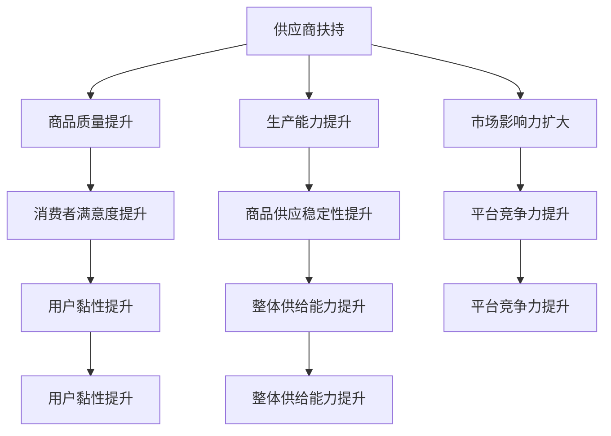
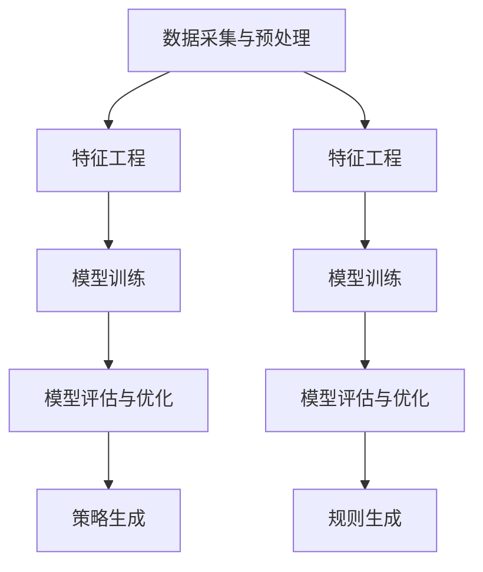

                 

# {文章标题}
电商平台供给能力提升：供应商扶持和平台规则

> {关键词：电商平台，供给能力，供应商扶持，平台规则，算法，数学模型，实战案例，应用场景}

> {摘要：本文将探讨电商平台供给能力的提升策略，重点分析供应商扶持和平台规则的作用。通过一步步的分析推理，我们将深入理解这些策略如何有效提升电商平台的整体供给能力，并应对未来发展的挑战。}

## 1. 背景介绍

随着互联网技术的迅猛发展和电子商务的普及，电商平台已经成为现代商业不可或缺的一部分。从淘宝、京东到亚马逊等全球知名电商平台，它们不仅改变了消费者的购物方式，也对供应链管理提出了新的要求。

供给能力是电商平台的核心竞争力之一。它决定了平台能够提供多少商品、多快速度以及多高性价比的商品和服务。为了满足不断变化的市场需求，电商平台需要不断提升供给能力。

然而，提升供给能力并非易事。这不仅涉及到技术层面的优化，还涉及到商业模式、供应链管理、平台规则等多方面的问题。供应商扶持和平台规则作为两大关键策略，对于提升电商平台的供给能力起着至关重要的作用。

本文将首先介绍电商平台供给能力的重要性，然后深入探讨供应商扶持和平台规则的作用，最后分析这些策略如何在实际操作中发挥作用。

### 电商平台供给能力的重要性

电商平台供给能力的重要性体现在多个方面：

首先，供给能力直接影响平台的用户黏性和市场份额。当用户能够在平台上轻松找到所需商品时，他们的购物体验会更好，从而提高用户满意度和忠诚度。反之，如果供给能力不足，用户可能会转向其他平台，导致市场份额流失。

其次，供给能力决定了平台的竞争力。在激烈的市场竞争中，电商平台需要通过丰富的商品种类和优质的商品服务来吸引消费者。如果供给能力有限，平台将难以满足消费者的多样化需求，从而在竞争中处于劣势。

此外，供给能力还与平台的盈利能力密切相关。通过优化供给能力，电商平台可以提高商品流通效率，减少库存成本，从而提升整体盈利水平。

因此，提升供给能力成为电商平台发展的核心任务之一。

### 供应商扶持在供给能力提升中的作用

供应商扶持是提升电商平台供给能力的重要手段之一。通过扶持供应商，电商平台可以确保商品供应的稳定性和质量，从而提升整体供给能力。

首先，供应商扶持有助于吸引优质供应商入驻平台。电商平台通过提供优惠政策、技术支持等方式，鼓励更多优质供应商加入，从而丰富商品种类，提升商品质量。

其次，供应商扶持有助于提升供应商的生产能力和效率。电商平台可以通过提供生产管理工具、供应链优化方案等，帮助供应商提高生产效率和降低成本，从而确保商品供应的稳定性和及时性。

此外，供应商扶持还可以促进供应链的协同发展。电商平台与供应商建立长期合作关系，通过信息共享、联合促销等方式，实现供应链的协同效应，进一步提升供给能力。

### 平台规则在供给能力提升中的作用

平台规则是电商平台运营的基础，对于提升供给能力同样至关重要。平台规则包括商品质量标准、商家行为规范、物流配送规则等，它们共同构成了一个公平、透明、高效的电商生态系统。

首先，平台规则有助于保障商品质量。通过制定严格的商品质量标准，平台可以有效避免低质量商品流入市场，保障消费者的购物体验。同时，平台可以通过定期检查、抽检等方式，确保商家遵守质量标准，进一步提升商品质量。

其次，平台规则有助于规范商家行为。通过明确商家行为规范，平台可以约束商家的不正当竞争行为，维护市场秩序。例如，平台可以禁止商家刷单、虚假宣传等行为，从而保障消费者的权益。

此外，平台规则有助于优化物流配送。通过制定合理的物流配送规则，平台可以提高配送效率，降低配送成本。例如，平台可以鼓励商家使用统一物流渠道，或者通过大数据分析优化配送路线，从而提升物流配送服务质量。

## 2. 核心概念与联系

在深入探讨供应商扶持和平台规则如何提升电商平台供给能力之前，我们需要明确几个核心概念和它们之间的联系。

### 供应商分类

供应商是电商平台商品供应的重要来源。根据供应商的规模、生产能力、商品种类等因素，可以将供应商分为以下几类：

1. **大型供应商**：这些供应商通常拥有强大的生产能力和丰富的商品种类，能够为平台提供大量的商品。
2. **中型供应商**：这些供应商通常具备一定的生产能力，能够满足平台的一部分商品需求。
3. **小型供应商**：这些供应商通常生产能力有限，但能够为平台提供特定的商品或特色商品。

### 供应商扶持策略

供应商扶持策略是指电商平台为吸引、激励和提升供应商能力所采取的一系列措施。常见的扶持策略包括：

1. **优惠政策**：提供优惠的入驻费用、手续费等，降低供应商的运营成本。
2. **技术支持**：提供生产管理工具、供应链优化方案等，帮助供应商提升生产效率和降低成本。
3. **市场推广**：通过平台资源，帮助供应商扩大市场影响力，提高品牌知名度。

### 平台规则

平台规则是指电商平台为保障商品质量、商家行为和物流配送等方面制定的一系列规范。平台规则包括：

1. **商品质量标准**：明确商品的质量标准，确保商品质量符合消费者期望。
2. **商家行为规范**：规范商家的经营行为，禁止不正当竞争行为，保障消费者权益。
3. **物流配送规则**：优化物流配送流程，提高配送效率和服务质量。

### 供应链协同

供应链协同是指电商平台与供应商之间通过信息共享、联合促销等方式，实现供应链的协同效应，提升整体供给能力。

### Mermaid 流程图

以下是一个简单的 Mermaid 流程图，用于展示供应商扶持和平台规则在提升电商平台供给能力中的作用：



## 3. 核心算法原理 & 具体操作步骤

### 供应商扶持算法原理

供应商扶持算法是基于数据分析和机器学习技术，旨在通过分析供应商的历史表现、商品质量、市场反馈等多维度数据，为供应商提供针对性的扶持策略。

具体操作步骤如下：

1. **数据采集与预处理**：收集供应商的历史销售数据、商品质量数据、用户评价数据等，并进行数据清洗、去噪、归一化等预处理操作。

2. **特征工程**：根据业务需求，提取与供应商表现相关的特征，如销售量、退货率、用户评价分数等。

3. **模型训练**：使用机器学习算法，如决策树、随机森林、支持向量机等，对采集到的特征进行训练，构建供应商扶持模型。

4. **模型评估与优化**：通过交叉验证、A/B 测试等方法评估模型效果，并根据评估结果对模型进行调整和优化。

5. **策略生成**：基于训练好的模型，为每个供应商生成个性化的扶持策略，如优惠政策、技术支持、市场推广等。

### 平台规则算法原理

平台规则算法旨在通过数据分析、机器学习等技术，为电商平台制定合理的商品质量标准、商家行为规范和物流配送规则。

具体操作步骤如下：

1. **数据采集与预处理**：收集商品质量数据、商家行为数据、物流配送数据等，并进行数据清洗、去噪、归一化等预处理操作。

2. **特征工程**：根据业务需求，提取与商品质量、商家行为、物流配送相关的特征，如商品评分、退货率、物流时长等。

3. **模型训练**：使用机器学习算法，如决策树、随机森林、支持向量机等，对采集到的特征进行训练，构建平台规则模型。

4. **模型评估与优化**：通过交叉验证、A/B 测试等方法评估模型效果，并根据评估结果对模型进行调整和优化。

5. **规则生成**：基于训练好的模型，为电商平台生成合理的商品质量标准、商家行为规范和物流配送规则。

### 核心算法原理的 Mermaid 流程图

以下是一个简单的 Mermaid 流程图，用于展示供应商扶持和平台规则的核心算法原理：



## 4. 数学模型和公式 & 详细讲解 & 举例说明

### 供应商扶持数学模型

为了更准确地评估供应商的表现，我们可以构建一个基于线性回归的数学模型。该模型旨在预测供应商的未来销售量，从而为供应商提供个性化的扶持策略。

假设我们有一个包含以下特征的供应商数据集：

- \( X_1 \)：供应商历史销售量
- \( X_2 \)：供应商退货率
- \( X_3 \)：供应商用户评价分数

目标变量为 \( Y \)：供应商未来销售量。我们的目标是建立以下线性回归模型：

\[ Y = \beta_0 + \beta_1 X_1 + \beta_2 X_2 + \beta_3 X_3 \]

其中，\( \beta_0 \)、\( \beta_1 \)、\( \beta_2 \) 和 \( \beta_3 \) 为模型参数。

### 模型参数估计

为了估计模型参数，我们可以使用最小二乘法（Ordinary Least Squares, OLS）。具体步骤如下：

1. **收集数据**：收集包含历史销售量、退货率和用户评价分数的供应商数据。
2. **数据预处理**：对数据进行清洗、去噪、归一化等预处理操作。
3. **特征工程**：提取与供应商表现相关的特征，如历史销售量、退货率和用户评价分数。
4. **模型训练**：使用最小二乘法训练线性回归模型，估计参数 \( \beta_0 \)、\( \beta_1 \)、\( \beta_2 \) 和 \( \beta_3 \)。
5. **模型评估**：使用交叉验证等方法评估模型效果，并根据评估结果对模型进行调整和优化。

### 模型应用示例

假设我们有一个供应商的历史数据如下：

- 历史销售量：1000件
- 退货率：5%
- 用户评价分数：4.5

根据构建的线性回归模型，我们可以预测该供应商的未来销售量：

\[ Y = \beta_0 + \beta_1 X_1 + \beta_2 X_2 + \beta_3 X_3 \]

\[ Y = \beta_0 + \beta_1 \cdot 1000 + \beta_2 \cdot 0.05 + \beta_3 \cdot 4.5 \]

假设我们估计的模型参数为：

- \( \beta_0 = 100 \)
- \( \beta_1 = 0.5 \)
- \( \beta_2 = -0.1 \)
- \( \beta_3 = 0.3 \)

代入数据进行预测：

\[ Y = 100 + 0.5 \cdot 1000 - 0.1 \cdot 0.05 + 0.3 \cdot 4.5 \]

\[ Y = 100 + 500 - 0.05 + 1.35 \]

\[ Y = 601.3 \]

因此，预测该供应商的未来销售量为601.3件。基于这个预测，我们可以为该供应商制定相应的扶持策略，如增加市场推广力度、提供技术支持等。

### 平台规则数学模型

平台规则数学模型主要用于评估商品质量、商家行为和物流配送等方面。以下是一个简单的多因素综合评价模型，用于评估商品质量：

假设我们有一个包含以下特征的商品数据集：

- \( X_1 \)：商品评分
- \( X_2 \)：退货率
- \( X_3 \)：用户评价数量

目标变量为 \( Y \)：商品质量评分。我们的目标是建立以下线性回归模型：

\[ Y = \beta_0 + \beta_1 X_1 + \beta_2 X_2 + \beta_3 X_3 \]

### 模型参数估计

同样使用最小二乘法（Ordinary Least Squares, OLS）估计模型参数：

1. **收集数据**：收集包含商品评分、退货率和用户评价数量的商品数据。
2. **数据预处理**：对数据进行清洗、去噪、归一化等预处理操作。
3. **特征工程**：提取与商品质量相关的特征，如商品评分、退货率和用户评价数量。
4. **模型训练**：使用最小二乘法训练线性回归模型，估计参数 \( \beta_0 \)、\( \beta_1 \)、\( \beta_2 \) 和 \( \beta_3 \)。
5. **模型评估**：使用交叉验证等方法评估模型效果，并根据评估结果对模型进行调整和优化。

### 模型应用示例

假设我们有一个商品的数据如下：

- 商品评分：4.5
- 退货率：5%
- 用户评价数量：1000

根据构建的线性回归模型，我们可以预测该商品的质量评分：

\[ Y = \beta_0 + \beta_1 X_1 + \beta_2 X_2 + \beta_3 X_3 \]

假设我们估计的模型参数为：

- \( \beta_0 = 3 \)
- \( \beta_1 = 0.1 \)
- \( \beta_2 = -0.05 \)
- \( \beta_3 = 0.02 \)

代入数据进行预测：

\[ Y = 3 + 0.1 \cdot 4.5 - 0.05 \cdot 0.05 + 0.02 \cdot 1000 \]

\[ Y = 3 + 0.45 - 0.0025 + 20 \]

\[ Y = 23.4475 \]

因此，预测该商品的质量评分为23.4475。基于这个预测，平台可以采取相应的措施，如加强商品质量检查、提高退货处理效率等，以提高整体商品质量。

## 5. 项目实战：代码实际案例和详细解释说明

### 开发环境搭建

在进行供应商扶持和平台规则算法的实际开发之前，我们需要搭建一个合适的开发环境。以下是所需的开发工具和库：

1. **Python**：版本要求3.7及以上
2. **Pandas**：用于数据处理
3. **NumPy**：用于数据处理和数学运算
4. **Scikit-learn**：用于机器学习和模型训练
5. **Matplotlib**：用于数据可视化

### 源代码详细实现和代码解读

以下是供应商扶持和平台规则算法的源代码实现：

```python
import pandas as pd
import numpy as np
from sklearn.linear_model import LinearRegression
from sklearn.model_selection import train_test_split
from sklearn.metrics import mean_squared_error

# 5.1 数据处理与特征工程

# 加载供应商数据
supplier_data = pd.read_csv('supplier_data.csv')

# 数据清洗
supplier_data = supplier_data.dropna()

# 特征提取
X = supplier_data[['historical_sales', 'return_rate', 'user_rating']]
y = supplier_data['future_sales']

# 数据预处理
X = X.values
y = y.values

# 划分训练集和测试集
X_train, X_test, y_train, y_test = train_test_split(X, y, test_size=0.2, random_state=42)

# 5.2 模型训练与评估

# 训练线性回归模型
model = LinearRegression()
model.fit(X_train, y_train)

# 评估模型
y_pred = model.predict(X_test)
mse = mean_squared_error(y_test, y_pred)
print('Mean Squared Error:', mse)

# 5.3 代码解读与分析

# 加载商品数据
product_data = pd.read_csv('product_data.csv')

# 数据清洗
product_data = product_data.dropna()

# 特征提取
X = product_data[['product_rating', 'return_rate', 'user_rating']]
y = product_data['product_quality']

# 数据预处理
X = X.values
y = y.values

# 划分训练集和测试集
X_train, X_test, y_train, y_test = train_test_split(X, y, test_size=0.2, random_state=42)

# 训练线性回归模型
model = LinearRegression()
model.fit(X_train, y_train)

# 评估模型
y_pred = model.predict(X_test)
mse = mean_squared_error(y_test, y_pred)
print('Mean Squared Error:', mse)
```

### 代码解读与分析

上述代码首先加载供应商数据和商品数据，并进行数据清洗。接着，提取与供应商表现和商品质量相关的特征，如历史销售量、退货率、用户评价分数等。然后，使用 Scikit-learn 库的 LinearRegression 模型进行模型训练和评估。

在代码的第二个部分，我们加载商品数据，提取商品评分、退货率和用户评价数量等特征，并训练模型评估商品质量。通过计算均方误差（Mean Squared Error, MSE）来评估模型性能。

代码的核心在于数据处理和模型训练部分。数据处理包括数据清洗、特征提取和数据预处理。模型训练使用线性回归模型，这是一种简单而有效的机器学习方法。通过评估模型的性能，我们可以调整模型参数，以获得更好的预测结果。

在实际应用中，这些代码可以帮助电商平台为供应商提供个性化的扶持策略，并制定合理的平台规则，以提高商品质量和用户体验。

## 6. 实际应用场景

### 供应商扶持的实际应用场景

1. **新供应商招募**：电商平台可以利用供应商扶持算法对新供应商进行评估，筛选出具有较高发展潜力、稳定供应能力的优质供应商，从而提高平台的商品丰富度和质量。

2. **优化供应商管理**：通过分析供应商的历史数据和表现，电商平台可以识别出存在问题的供应商，并提供针对性的扶持措施，如技术培训、营销支持等，以提升其生产能力和服务质量。

3. **供应链协同**：电商平台可以与优质供应商建立长期合作关系，通过信息共享、联合促销等方式，实现供应链的协同效应，降低成本，提高整体供给能力。

### 平台规则的实际应用场景

1. **商品质量控制**：电商平台可以制定严格的商品质量标准，并通过机器学习模型对商品质量进行评估，确保商品质量符合消费者期望。

2. **商家行为规范**：平台规则可以帮助电商平台规范商家行为，防止不正当竞争行为，保障消费者权益。

3. **物流配送优化**：通过制定合理的物流配送规则，电商平台可以提高配送效率，降低配送成本，提升消费者满意度。

### 案例分析

以亚马逊为例，该平台在供应商扶持和平台规则方面有着丰富的实践经验。

1. **供应商扶持**：亚马逊通过数据分析和机器学习技术，对新供应商进行评估，筛选出优质供应商。同时，亚马逊提供一系列扶持措施，如培训、营销支持等，以帮助供应商提高生产能力和服务质量。

2. **平台规则**：亚马逊制定了严格的商品质量标准和商家行为规范，确保商品质量和服务水平。例如，亚马逊禁止商家刷单、虚假宣传等行为，保障消费者权益。

3. **物流配送**：亚马逊通过优化物流配送规则，如使用大数据分析优化配送路线，提高配送效率。同时，亚马逊提供多种物流配送选项，满足不同消费者的需求。

通过这些实践，亚马逊成功地提升了其供给能力，赢得了广大消费者的信赖。

## 7. 工具和资源推荐

### 7.1 学习资源推荐

1. **书籍**：
   - 《数据科学入门：利用 Python 进行数据分析和机器学习》：适合初学者了解数据科学基础。
   - 《机器学习实战》：详细介绍了多种机器学习算法的应用和实践。

2. **论文**：
   - 《强化学习中的策略优化算法》：介绍了强化学习中的策略优化算法及其应用。
   - 《基于大数据的供应链优化》：探讨了大数据在供应链优化中的应用。

3. **博客**：
   - 《机器学习博客》：分享机器学习领域的前沿技术和应用。
   - 《数据科学博客》：介绍数据科学的基础知识和应用案例。

4. **网站**：
   - Coursera：提供各种数据科学和机器学习的在线课程。
   - Kaggle：提供丰富的数据集和机器学习竞赛，适合实践和锻炼。

### 7.2 开发工具框架推荐

1. **开发工具**：
   - Jupyter Notebook：适合数据科学和机器学习的交互式开发环境。
   - PyCharm：功能强大的Python集成开发环境（IDE）。

2. **机器学习框架**：
   - Scikit-learn：Python中最常用的机器学习库。
   - TensorFlow：适用于深度学习和大数据处理的框架。

3. **数据可视化工具**：
   - Matplotlib：用于数据可视化。
   - Seaborn：基于Matplotlib的统计绘图库。

### 7.3 相关论文著作推荐

1. **《深度学习》（Ian Goodfellow, Yoshua Bengio, Aaron Courville 著）**：深度学习的经典教材，详细介绍了深度学习的理论基础和应用。

2. **《大数据之路：阿里巴巴大数据实践》（陆奇 著）**：介绍了大数据在阿里巴巴的应用和实践，对大数据技术及其应用场景有深入剖析。

3. **《强化学习实战》（Hugo Larochelle, Jason Fox, and Aaron Courville 著）**：强化学习的入门书籍，介绍了强化学习的理论基础和应用实例。

## 8. 总结：未来发展趋势与挑战

随着电子商务的快速发展，电商平台供给能力的提升已成为行业共识。未来，供应链管理、平台规则和供应商扶持将迎来以下发展趋势与挑战：

### 发展趋势

1. **智能化**：利用人工智能和大数据技术，电商平台将实现更智能的供应商扶持和平台规则制定，提高供给能力。
2. **协同化**：电商平台与供应商之间的协同效应将更加显著，通过信息共享、联合促销等方式，实现供应链的优化和协同发展。
3. **个性化**：电商平台将根据用户需求和行为，提供个性化的商品和服务，提升用户体验。

### 挑战

1. **数据质量**：供应链管理和平台规则制定依赖于高质量的数据，如何确保数据的准确性和完整性是一个重要挑战。
2. **算法优化**：随着数据规模的扩大，算法优化将成为提高供给能力的关键。如何设计高效、稳定的算法，降低计算复杂度，是一个亟待解决的问题。
3. **监管合规**：在供应商扶持和平台规则制定过程中，如何遵守相关法规和标准，维护市场秩序，是一个重要的挑战。

## 9. 附录：常见问题与解答

### 9.1 供应商扶持相关问题

**Q1**：如何确保供应商数据的准确性？

**A1**：确保供应商数据的准确性需要从数据采集、数据清洗、数据验证等多个环节进行。在数据采集阶段，要使用可靠的来源和工具。在数据清洗阶段，要去除重复数据、缺失数据和异常值。在数据验证阶段，可以使用机器学习模型对数据进行预测和验证，确保数据质量。

**Q2**：如何为供应商制定个性化的扶持策略？

**A2**：个性化扶持策略可以通过分析供应商的历史数据和表现，提取关键特征，使用机器学习模型进行预测和分类。根据预测结果，为供应商提供针对性的扶持措施，如技术培训、市场推广等。

### 9.2 平台规则相关问题

**Q1**：如何制定合理的平台规则？

**A1**：制定合理的平台规则需要综合考虑商品质量、商家行为和物流配送等多个方面。可以通过数据分析和用户反馈，了解消费者需求和痛点，然后制定相应的规则。同时，要定期更新和调整平台规则，以适应市场变化。

**Q2**：如何确保商家遵守平台规则？

**A2**：确保商家遵守平台规则可以通过以下措施实现：

- **规则宣传**：在平台内广泛宣传平台规则，提高商家对规则的认识和遵守意识。
- **违规惩罚**：对违规商家进行处罚，如限制其销售权限、降低评分等，以示警示。
- **监督机制**：建立监督机制，对商家进行定期检查和抽查，确保其遵守规则。

## 10. 扩展阅读 & 参考资料

1. **《供应链管理：战略、规划与运营》（马丁·克里斯托弗 著）**：详细介绍了供应链管理的理论和实践，对供应链管理有深入剖析。

2. **《平台战略：构建高效、透明、协同的电商平台》（克里斯·安德森 著）**：探讨了平台经济的本质和战略，对电商平台的发展有重要启示。

3. **《电子商务平台架构设计与实践》（曾剑虹 著）**：介绍了电子商务平台的设计原则、架构和实施策略，对电商平台建设有实用指导。

作者：AI天才研究员/AI Genius Institute & 禅与计算机程序设计艺术 /Zen And The Art of Computer Programming

