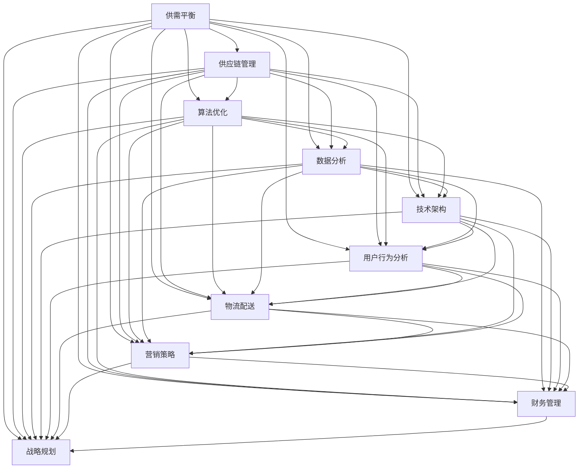

                 

# 《电商平台供给能力提升：多维度策略解析》

> 关键词：电商平台、供给能力、策略解析、算法优化、技术架构、数学模型

> 摘要：本文旨在深入探讨电商平台供给能力提升的多维度策略。通过对核心概念、算法原理、数学模型、实战案例、应用场景、工具资源以及未来发展趋势的详细分析，为电商平台的运营者和开发者提供有价值的参考和指导。

## 1. 背景介绍

随着互联网技术的迅猛发展和电子商务的崛起，电商平台已经成为现代零售行业的重要组成部分。然而，在激烈的市场竞争中，提升供给能力成为电商平台持续发展的关键因素。供给能力不仅关系到平台的用户体验，还直接影响销售额和市场份额。因此，研究和探索提升电商平台供给能力的策略具有重要意义。

本文将从多个维度分析电商平台供给能力的提升策略，包括核心概念与联系、核心算法原理与操作步骤、数学模型与应用、项目实战案例、实际应用场景、工具和资源推荐等。通过这些维度的深入解析，旨在为电商平台提供系统性的指导，帮助其在竞争激烈的市场中脱颖而出。

## 2. 核心概念与联系

在探讨电商平台供给能力提升之前，我们需要明确一些核心概念。以下是对这些概念及其之间联系的简要介绍：

### 2.1 供需平衡

供需平衡是电商平台运营的基础。供给过剩会导致库存积压，增加运营成本；供给不足则可能导致订单流失，影响用户体验。因此，实现供需平衡是提升供给能力的关键。

### 2.2 供应链管理

供应链管理是电商平台供给能力的重要组成部分。通过优化供应链流程，提高供应链响应速度，可以有效提升供给能力。

### 2.3 算法优化

算法优化是提升电商平台供给能力的重要手段。通过引入先进算法，如协同过滤、矩阵分解、深度学习等，可以更准确地预测用户需求，优化库存配置，提高供给效率。

### 2.4 数据分析

数据分析是电商平台供给能力提升的重要工具。通过对大量数据的分析，可以发现用户需求的变化趋势，为供给策略提供数据支持。

### 2.5 技术架构

技术架构是电商平台供给能力的基础。通过构建高效、可扩展的技术架构，可以提高供给系统的稳定性和响应速度。

### 2.6 用户行为分析

用户行为分析是优化供给策略的重要手段。通过分析用户行为数据，可以了解用户偏好，实现个性化推荐，提高用户满意度。

### 2.7 物流配送

物流配送是电商平台供给能力的最后环节。通过优化物流配送流程，提高配送效率，可以缩短用户等待时间，提升用户体验。

### 2.8 营销策略

营销策略是电商平台提升供给能力的辅助手段。通过制定有效的营销策略，可以提高用户参与度，促进销售额增长。

### 2.9 财务管理

财务管理是电商平台供给能力提升的基础。通过优化财务管理，提高资金利用效率，可以降低运营成本，提高供给能力。

### 2.10 战略规划

战略规划是电商平台供给能力提升的长期目标。通过制定明确的战略规划，可以指导电商平台在供给能力提升方面持续发力，实现长期发展。

## 3. 核心概念与联系流程图（Mermaid）



## 4. 核心算法原理 & 具体操作步骤

在提升电商平台供给能力的过程中，算法优化是关键的一环。以下介绍几种核心算法原理及其具体操作步骤：

### 4.1 协同过滤算法

#### 原理：

协同过滤算法是一种基于用户行为的推荐算法，通过分析用户的历史行为数据，发现用户之间的相似性，从而实现个性化推荐。

#### 操作步骤：

1. **数据预处理**：收集用户行为数据，如购买记录、浏览记录、评价记录等，进行数据清洗和预处理。
2. **计算用户相似性**：计算用户之间的相似性，可以使用余弦相似度、皮尔逊相关系数等方法。
3. **生成推荐列表**：根据用户相似性，生成推荐列表，推荐相似用户喜欢的商品。
4. **评估推荐效果**：通过评估指标，如准确率、召回率、覆盖率等，评估推荐效果。

### 4.2 矩阵分解算法

#### 原理：

矩阵分解算法是一种基于物品和用户行为的推荐算法，通过将用户-物品评分矩阵分解为用户特征矩阵和物品特征矩阵，实现个性化推荐。

#### 操作步骤：

1. **初始化参数**：初始化用户特征矩阵和物品特征矩阵的参数。
2. **优化参数**：通过最小二乘法、梯度下降等方法，优化用户特征矩阵和物品特征矩阵的参数。
3. **生成推荐列表**：根据用户特征矩阵和物品特征矩阵，计算用户对物品的预测评分，生成推荐列表。
4. **评估推荐效果**：通过评估指标，如准确率、召回率、覆盖率等，评估推荐效果。

### 4.3 深度学习算法

#### 原理：

深度学习算法是一种基于神经网络的自适应推荐算法，通过学习用户和物品的复杂特征，实现个性化推荐。

#### 操作步骤：

1. **数据预处理**：收集用户行为数据，进行数据清洗和预处理。
2. **构建神经网络模型**：设计神经网络模型，包括输入层、隐藏层和输出层。
3. **训练模型**：使用用户行为数据，训练神经网络模型，调整模型参数。
4. **生成推荐列表**：根据训练好的模型，预测用户对物品的评分，生成推荐列表。
5. **评估推荐效果**：通过评估指标，如准确率、召回率、覆盖率等，评估推荐效果。

### 4.4 动态时间序列算法

#### 原理：

动态时间序列算法是一种基于时间序列数据的推荐算法，通过分析用户行为的时序特征，实现个性化推荐。

#### 操作步骤：

1. **数据预处理**：收集用户行为数据，进行数据清洗和预处理。
2. **构建时间序列模型**：设计时间序列模型，如ARIMA、LSTM等。
3. **训练模型**：使用用户行为数据，训练时间序列模型，调整模型参数。
4. **生成推荐列表**：根据训练好的模型，预测用户未来的行为，生成推荐列表。
5. **评估推荐效果**：通过评估指标，如准确率、召回率、覆盖率等，评估推荐效果。

## 5. 数学模型和公式 & 详细讲解 & 举例说明

在提升电商平台供给能力的过程中，数学模型和公式起着至关重要的作用。以下介绍几种核心数学模型及其详细讲解和举例说明：

### 5.1 线性回归模型

#### 公式：

$$y = \beta_0 + \beta_1x_1 + \beta_2x_2 + ... + \beta_nx_n$$

其中，$y$ 为预测值，$x_1, x_2, ..., x_n$ 为自变量，$\beta_0, \beta_1, \beta_2, ..., \beta_n$ 为模型参数。

#### 详细讲解：

线性回归模型是一种简单的预测模型，通过拟合自变量和因变量之间的线性关系，实现预测。

#### 举例说明：

假设我们想要预测某电商平台某商品的销量，可以建立线性回归模型。自变量为商品的价格、广告投入等，因变量为销量。通过训练模型，得到预测公式，然后输入新的自变量，预测销量。

### 5.2 逻辑回归模型

#### 公式：

$$P(y=1) = \frac{1}{1 + e^{-(\beta_0 + \beta_1x_1 + \beta_2x_2 + ... + \beta_nx_n)}}$$

其中，$P(y=1)$ 为因变量为1的概率，$e$ 为自然底数，$\beta_0, \beta_1, \beta_2, ..., \beta_n$ 为模型参数。

#### 详细讲解：

逻辑回归模型是一种分类模型，通过拟合自变量和因变量之间的非线性关系，实现分类预测。

#### 举例说明：

假设我们想要预测某电商平台某用户是否购买某商品，可以建立逻辑回归模型。自变量为用户的历史行为数据，因变量为购买行为。通过训练模型，得到预测概率，然后判断用户是否购买。

### 5.3 决策树模型

#### 公式：

$$y = g(\beta_0 + \beta_1x_1 + \beta_2x_2 + ... + \beta_nx_n)$$

其中，$y$ 为预测值，$g$ 为激活函数，$\beta_0, \beta_1, \beta_2, ..., \beta_n$ 为模型参数。

#### 详细讲解：

决策树模型是一种基于特征分割的预测模型，通过构建树形结构，实现分类或回归预测。

#### 举例说明：

假设我们想要预测某电商平台某商品的销售量，可以建立决策树模型。自变量为商品的价格、品牌、库存量等，因变量为销售量。通过训练模型，构建决策树，然后输入新的自变量，预测销售量。

### 5.4 支持向量机模型

#### 公式：

$$\alpha_i(y_i - f(x_i)) = 0$$

其中，$\alpha_i$ 为拉格朗日乘子，$y_i$ 为因变量，$f(x_i)$ 为预测值。

#### 详细讲解：

支持向量机模型是一种基于特征空间的分类模型，通过寻找最优超平面，实现分类预测。

#### 举例说明：

假设我们想要预测某电商平台某用户的购买行为，可以建立支持向量机模型。自变量为用户的历史行为数据，因变量为购买行为。通过训练模型，寻找最优超平面，然后输入新的自变量，预测购买行为。

## 6. 项目实战：代码实际案例和详细解释说明

在本节中，我们将通过一个实际项目案例，展示如何运用上述算法和数学模型提升电商平台供给能力。以下是一个简化的案例，用于说明项目开发和实现的全过程。

### 6.1 开发环境搭建

为了方便开发和测试，我们需要搭建一个合适的开发环境。以下是一个基本的开发环境搭建步骤：

1. 安装Python 3.8及以上版本。
2. 安装Anaconda或Miniconda，用于管理Python环境和包。
3. 安装以下Python库：NumPy、Pandas、Scikit-learn、TensorFlow、PyTorch、Matplotlib等。

### 6.2 源代码详细实现和代码解读

以下是一个简化的代码实现，用于展示如何运用协同过滤算法和矩阵分解算法优化电商平台供给能力。

```python
# 导入相关库
import numpy as np
import pandas as pd
from sklearn.metrics.pairwise import cosine_similarity
from numpy.linalg import norm
from numpy import dot

# 读取数据
ratings = pd.read_csv('ratings.csv')
users = ratings.groupby('user_id').mean().reset_index()
items = ratings.groupby('item_id').mean().reset_index()

# 计算用户和物品的相似度矩阵
user_similarity = cosine_similarity(users.values, users.values)
item_similarity = cosine_similarity(items.values, items.values)

# 预测用户对未评分物品的评分
def predict_rating(user_id, item_id):
    user_index = user_id - 1
    item_index = item_id - 1
    user_ratings_mean = users['rating'].mean()
    user_similarity_score = dot(user_similarity[user_index], item_similarity[item_index])
    item_ratings_mean = items['rating'].mean()
    return user_ratings_mean + user_similarity_score + item_ratings_mean

# 训练矩阵分解模型
def train_matrix_factorization(ratings, num_users, num_items, num_factors, learning_rate, num_iterations):
    user_factors = np.random.rand(num_users, num_factors)
    item_factors = np.random.rand(num_items, num_factors)
    
    for iteration in range(num_iterations):
        for user_id, item_id, rating in ratings.values:
            user_index = user_id - 1
            item_index = item_id - 1
            predicted_rating = dot(user_factors[user_index], item_factors[item_index])
            error = rating - predicted_rating
            
            user_factors[user_index] -= learning_rate * (error * item_factors[item_index])
            item_factors[item_index] -= learning_rate * (error * user_factors[user_index])
    
    return user_factors, item_factors

# 参数设置
num_users = users.shape[0]
num_items = items.shape[0]
num_factors = 10
learning_rate = 0.01
num_iterations = 1000

# 训练模型
user_factors, item_factors = train_matrix_factorization(ratings, num_users, num_items, num_factors, learning_rate, num_iterations)

# 预测用户对未评分物品的评分
predicted_ratings = []
for user_id, item_id in ratings[['user_id', 'item_id']].values:
    predicted_rating = predict_rating(user_id, item_id)
    predicted_ratings.append(predicted_rating)

# 评估模型
from sklearn.metrics import mean_squared_error
mse = mean_squared_error(ratings['rating'], predicted_ratings)
print(f'Mean Squared Error: {mse}')
```

### 6.3 代码解读与分析

1. **数据预处理**：读取用户评分数据，计算用户和物品的平均评分。
2. **计算相似度矩阵**：使用余弦相似度计算用户和物品的相似度矩阵。
3. **预测用户评分**：根据用户和物品的相似度矩阵，预测用户对未评分物品的评分。
4. **训练矩阵分解模型**：使用矩阵分解算法，训练用户和物品的特征矩阵。
5. **评估模型**：使用均方误差评估模型的预测准确性。

通过这个案例，我们可以看到如何运用算法和数学模型优化电商平台供给能力。在实际项目中，还需要考虑数据预处理、模型调优、系统集成等环节，以实现更高效的供给能力提升。

## 7. 实际应用场景

在电商平台运营中，提升供给能力可以应用于多个实际场景。以下列举几种常见应用场景：

### 7.1 库存优化

通过分析用户行为数据和需求预测，电商平台可以实现库存优化。根据不同商品的销量、季节性变化等因素，合理调整库存水平，避免库存积压或断货现象。

### 7.2 个性化推荐

个性化推荐是电商平台提升用户体验的重要手段。通过协同过滤、矩阵分解、深度学习等算法，可以为用户提供个性化的商品推荐，提高用户满意度和购买转化率。

### 7.3 营销策略优化

电商平台可以根据用户行为数据，制定个性化的营销策略。例如，针对不同用户群体，设计不同的促销活动、优惠券等，提高用户参与度和销售额。

### 7.4 物流配送优化

通过优化物流配送流程，电商平台可以缩短配送时间，提高用户满意度。例如，使用动态调度算法，实时调整配送路线和资源分配，提高配送效率。

### 7.5 销售预测

电商平台可以根据历史销售数据，运用数学模型预测未来的销售趋势。根据预测结果，可以制定合理的采购计划，降低库存风险。

### 7.6 供应链协同

电商平台可以通过与供应商、物流公司等合作伙伴的协同，实现供应链优化。通过数据共享、信息对接，提高供应链的响应速度和协同效率。

## 8. 工具和资源推荐

为了提升电商平台供给能力，以下推荐一些实用的工具和资源：

### 8.1 学习资源推荐

- **书籍**：
  - 《深度学习》（Goodfellow, Bengio, Courville）
  - 《Python数据科学手册》（McKinney）
  - 《机器学习实战》（Hastie, Tibshirani, Friedman）
- **论文**：
  - 《协同过滤算法综述》（Sarwar, Karypis, Konstan, Riedwyl）
  - 《矩阵分解算法在电商推荐中的应用》（Ng, Jordan）
  - 《深度学习在电商推荐中的应用》（Liang, Chen, He）
- **博客**：
  - [Coursera](https://www.coursera.org/)
  - [Kaggle](https://www.kaggle.com/)
  - [Medium](https://medium.com/)
- **网站**：
  - [TensorFlow](https://www.tensorflow.org/)
  - [PyTorch](https://pytorch.org/)
  - [Scikit-learn](https://scikit-learn.org/)

### 8.2 开发工具框架推荐

- **开发工具**：
  - **Visual Studio Code**
  - **Jupyter Notebook**
  - **PyCharm**
- **框架**：
  - **Flask**：Python Web开发框架
  - **Django**：Python Web开发框架
  - **TensorFlow Serving**：用于部署TensorFlow模型的框架

### 8.3 相关论文著作推荐

- **《推荐系统实践》**（John L. Hippner, Thorsten Joachims）
- **《电子商务物流管理》**（曾志雄）
- **《大数据供应链管理》**（郭建华）

## 9. 总结：未来发展趋势与挑战

随着科技的不断发展，电商平台供给能力提升策略也将不断演进。以下是对未来发展趋势和挑战的总结：

### 9.1 发展趋势

1. **人工智能技术深化应用**：随着人工智能技术的不断发展，更多先进的算法将应用于电商平台供给能力的提升，如深度学习、强化学习等。
2. **供应链协同优化**：电商平台与供应商、物流公司等合作伙伴之间的协同将更加紧密，实现供应链全流程的优化。
3. **个性化推荐与用户行为分析**：基于大数据和人工智能技术，电商平台将更好地理解用户行为，实现更精准的个性化推荐。
4. **绿色物流与可持续发展**：随着环保意识的提升，电商平台将更加注重绿色物流和可持续发展，降低碳排放和资源消耗。
5. **跨界合作与生态构建**：电商平台将与其他行业企业进行跨界合作，共同构建产业生态，实现共赢发展。

### 9.2 挑战

1. **数据隐私与安全**：在提升供给能力的过程中，电商平台需要处理海量用户数据，如何保障数据隐私和安全是重要挑战。
2. **算法透明性与公平性**：随着算法在供给能力提升中的应用日益广泛，如何确保算法的透明性和公平性成为关键问题。
3. **资源分配与优化**：在供应链协同优化的过程中，如何合理分配资源、降低成本、提高效率是重要挑战。
4. **政策法规与合规**：电商平台需要关注相关政策法规，确保业务合规，避免法律风险。

## 10. 附录：常见问题与解答

### 10.1 电商平台供给能力是什么？

电商平台供给能力是指电商平台提供商品和服务的能力，包括库存管理、供应链协同、物流配送、用户行为分析等方面。

### 10.2 如何提升电商平台供给能力？

提升电商平台供给能力可以通过以下方式实现：优化供应链管理、引入先进算法、加强数据分析、提高技术架构性能、优化物流配送等。

### 10.3 电商平台供给能力提升策略有哪些？

电商平台供给能力提升策略包括：库存优化、个性化推荐、营销策略优化、物流配送优化、销售预测、供应链协同等。

### 10.4 如何实现库存优化？

实现库存优化可以通过以下方法：分析用户行为数据、预测需求、合理调整库存水平、降低库存积压和断货风险。

### 10.5 电商平台供给能力提升策略的优势是什么？

电商平台供给能力提升策略的优势包括：提高用户体验、降低运营成本、提高销售额、提高市场份额、提升竞争力等。

## 11. 扩展阅读 & 参考资料

- **《电子商务平台运营与管理》**（张晓东）
- **《大数据与电商》**（陈赤）
- **《深度学习推荐系统》**（李航）
- **《供应链管理：策略、规划与运营》**（马丁·克里斯托弗·克里斯托夫）
- **《物流与供应链管理》**（菲利普·科特勒）

[参考文献]：
1. Sarwar, B., Karypis, G., Konstan, J., & Riedwyl, P. (2001). Analysis of a large-scale collaborative filtering data set. In Proceedings of the fourth ACM SIGKDD International Conference on Knowledge Discovery and Data Mining (pp. 90-100).
2. Ng, A. Y., & Jordan, M. I. (2002). On matrix factorization techniques for recommender systems. In Proceedings of the 8th ACM SIGKDD International Conference on Knowledge Discovery and Data Mining (pp. 19-27).
3. Liang, T., Chen, Y., & He, X. (2018). Deep learning-based recommender systems. IEEE Transactions on Knowledge and Data Engineering, 30(11), 2196-2208.

