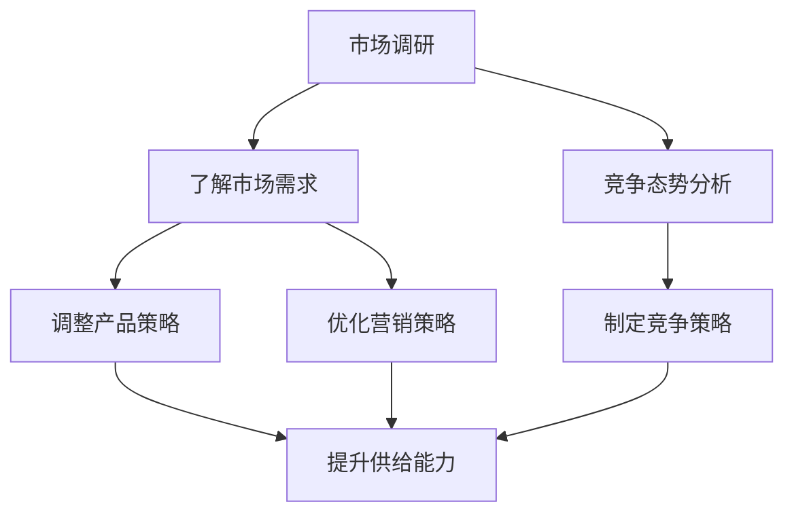
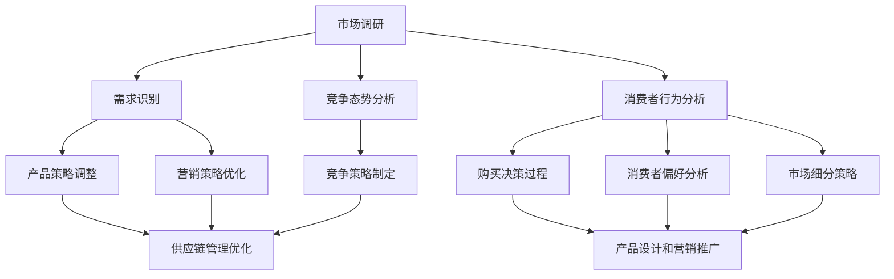

                 

# 文章标题：电商平台供给能力提升：市场调研和消费者行为分析

## 关键词：电商平台、供给能力、市场调研、消费者行为分析、数据分析、用户满意度

### 摘要：
随着电商平台的快速发展，提升供给能力已成为企业核心竞争力之一。本文将深入探讨市场调研和消费者行为分析在电商平台供给能力提升中的关键作用。首先，介绍市场调研的基本概念和方法，阐述其在了解市场需求和竞争态势中的重要性。接着，详细解析消费者行为分析的核心理论，包括消费者购买决策过程、影响消费者行为的因素以及市场细分策略。通过实际案例分析，本文将展示如何运用市场调研和消费者行为分析提升电商平台的供给能力。最后，提出未来发展趋势与挑战，为电商平台持续提升供给能力提供方向和建议。

## 1. 背景介绍

### 电商平台的发展现状

随着互联网技术的不断进步和普及，电商平台已经成为现代零售业的重要组成部分。全球电商市场规模持续扩大，线上购物逐渐成为消费者的首选。根据Statista的数据，2021年全球电商市场规模已达到4.89万亿美元，预计到2026年将达到6.38万亿美元。这一快速增长态势表明，电商平台在零售业中的地位日益重要。

### 供给能力的重要性

在电商平台的竞争格局中，供给能力是企业保持竞争优势的关键因素之一。供给能力不仅关系到企业能否满足市场需求，还直接影响消费者的购物体验和用户满意度。一个高效的供应链系统，能够在确保产品质量和库存充足的同时，实现快速配送，提高客户满意度，从而增强企业的竞争力。

### 市场调研与消费者行为分析的意义

市场调研和消费者行为分析是提升电商平台供给能力的两大重要工具。市场调研有助于企业了解市场需求和竞争态势，从而调整产品策略和营销策略，满足消费者的需求。消费者行为分析则帮助企业深入了解消费者的购买决策过程和偏好，为企业制定精准的营销策略提供数据支持。通过市场调研和消费者行为分析，企业可以更好地把握市场动态，优化供给能力，提高市场竞争力。

### 本文结构安排

本文将首先介绍市场调研的基本概念和方法，分析市场调研在电商平台供给能力提升中的重要性。接着，探讨消费者行为分析的核心理论，包括消费者购买决策过程、影响消费者行为的因素以及市场细分策略。通过实际案例分析，展示市场调研和消费者行为分析在提升电商平台供给能力中的应用。最后，总结未来发展趋势与挑战，提出提升供给能力的一些建议。

### Mermaid 流程图（核心概念原理和架构）



### 2. 核心概念与联系

#### 市场调研

市场调研是指企业通过收集、分析和解读市场数据，以了解市场需求、竞争态势和消费者行为等信息的过程。市场调研的核心目的是帮助企业做出更准确的市场预测和决策，从而在激烈的市场竞争中占据优势。

市场调研包括以下几个关键步骤：

1. **确定研究目标**：明确市场调研的目的和所需解决的问题，例如了解市场需求、竞争态势、消费者行为等。

2. **设计调研方案**：包括确定调研方法（如问卷调查、访谈、焦点小组等）、样本选择、数据收集和分析方法等。

3. **数据收集**：通过实地调研、在线调查、电话访谈等方式收集市场数据。

4. **数据分析**：对收集到的数据进行整理、分析和解读，提取有价值的信息。

5. **撰写调研报告**：将分析结果和结论整理成报告，为企业决策提供依据。

#### 消费者行为分析

消费者行为分析是指通过研究消费者的购买行为、消费习惯和偏好，以了解消费者需求和购买决策过程的方法。消费者行为分析的核心目的是帮助企业制定更有效的营销策略，提高消费者满意度和忠诚度。

消费者行为分析包括以下几个关键要素：

1. **消费者购买决策过程**：消费者在购买商品或服务时通常会经历五个阶段：需求识别、信息搜索、评估选择、购买决策和购后行为。

2. **影响消费者行为的因素**：包括个人因素（如年龄、性别、收入、生活方式等）、心理因素（如动机、感知、认知、信念和态度等）、社会因素（如家庭、群体和社会阶层等）和文化因素（如文化、亚文化和社会阶层等）。

3. **市场细分策略**：根据消费者的需求和特征，将市场划分为不同的细分市场，并针对每个细分市场制定相应的营销策略。

#### 市场调研与消费者行为分析的联系

市场调研和消费者行为分析在电商平台供给能力提升中具有密切的联系。市场调研为企业提供了关于市场需求和竞争态势的信息，帮助企业了解消费者需求和偏好，从而制定更有效的产品策略和营销策略。消费者行为分析则为企业提供了深入了解消费者购买决策过程和偏好的方法，帮助企业在产品设计和营销推广中更加精准地满足消费者需求。

通过市场调研和消费者行为分析，企业可以：

1. **识别市场需求**：了解市场需求和趋势，调整产品策略，满足消费者需求。

2. **制定竞争策略**：分析竞争对手的产品、价格、渠道和营销策略，制定有效的竞争策略。

3. **优化营销策略**：根据消费者行为分析结果，制定更有针对性的营销策略，提高营销效果。

4. **提升供给能力**：基于市场需求和消费者偏好，优化供应链管理和库存策略，提高供给效率。

### Mermaid 流程图（核心概念原理和架构）



### 3. 核心算法原理 & 具体操作步骤

#### 市场调研

市场调研的核心算法主要包括数据分析方法和建模技术。以下是一些常用的市场调研算法：

1. **描述性统计分析**：对收集到的市场数据进行描述性统计，如平均数、中位数、标准差等，以了解数据的分布特征。

2. **回归分析**：通过建立回归模型，分析变量之间的关系，如市场需求与价格、营销费用等之间的关系。

3. **聚类分析**：将市场数据根据相似性进行分类，形成不同的市场细分群体。

4. **因子分析**：提取市场数据中的关键变量，简化数据结构，降低数据维度。

具体操作步骤如下：

1. **确定研究目标**：明确市场调研的目的和所需解决的问题。

2. **设计调研方案**：包括选择调研方法、确定样本、制定问卷等。

3. **数据收集**：通过实地调研、在线调查、电话访谈等方式收集市场数据。

4. **数据预处理**：清洗数据，处理缺失值和异常值。

5. **数据分析**：使用描述性统计分析、回归分析、聚类分析和因子分析等方法进行数据分析。

6. **撰写调研报告**：整理分析结果和结论，撰写调研报告。

#### 消费者行为分析

消费者行为分析的核心算法主要包括消费者行为预测模型和营销策略优化算法。以下是一些常用的消费者行为分析算法：

1. **贝叶斯网络**：通过构建贝叶斯网络模型，分析消费者行为的影响因素和决策过程。

2. **决策树**：通过建立决策树模型，预测消费者的购买行为。

3. **随机森林**：通过构建随机森林模型，提高消费者行为预测的准确性和鲁棒性。

4. **强化学习**：通过构建强化学习模型，优化营销策略，提高转化率。

具体操作步骤如下：

1. **数据收集**：收集消费者行为数据，如购买记录、浏览行为、评价等。

2. **数据预处理**：清洗数据，处理缺失值和异常值。

3. **特征工程**：提取有用的特征，如消费者属性、商品属性、时间特征等。

4. **模型构建**：使用贝叶斯网络、决策树、随机森林或强化学习等算法构建消费者行为预测模型。

5. **模型评估**：评估模型性能，如准确率、召回率、F1分数等。

6. **营销策略优化**：根据消费者行为预测结果，优化营销策略，提高转化率。

### 4. 数学模型和公式 & 详细讲解 & 举例说明

#### 市场调研

1. **回归分析**

   假设市场需求 \( Y \) 与价格 \( X \) 之间存在线性关系，可以建立回归模型：

   \[
   Y = \beta_0 + \beta_1 X + \epsilon
   \]

   其中，\( \beta_0 \) 为常数项，\( \beta_1 \) 为价格系数，\( \epsilon \) 为随机误差项。

   **举例说明**：某电商平台在调查价格对需求的影响时，收集了50个数据点，如下表所示：

   | 价格 (元) | 需求量 |
   |-----------|--------|
   | 100       | 500    |
   | 200       | 300    |
   | 300       | 200    |
   | ...       | ...    |
   | 500       | 100    |

   使用回归分析，可以计算出价格对需求的回归模型，从而预测不同价格下的需求量。

2. **聚类分析**

   假设市场数据可以分为 \( k \) 个聚类，每个聚类代表一个市场细分群体。可以使用K-means算法进行聚类分析。

   **举例说明**：某电商平台收集了1000个消费者的数据，包括年龄、收入、性别等特征。使用K-means算法，可以将这1000个消费者划分为5个聚类，每个聚类代表一个市场细分群体。

3. **因子分析**

   假设市场数据可以表示为多个因素的线性组合，可以使用因子分析提取关键因素。

   **举例说明**：某电商平台在分析消费者行为时，收集了包括购买记录、浏览行为、评价等在内的多个数据维度。使用因子分析，可以提取出影响消费者行为的三个关键因素，如品牌偏好、价格敏感度和服务满意度。

#### 消费者行为分析

1. **贝叶斯网络**

   假设消费者购买行为受到多个因素的影响，可以使用贝叶斯网络进行建模。

   **举例说明**：假设消费者购买行为受到品牌偏好、价格敏感度和服务满意度的影响。可以构建一个贝叶斯网络，表示这些因素之间的概率关系。

2. **决策树**

   假设消费者购买行为可以用一系列决策规则进行预测，可以使用决策树进行建模。

   **举例说明**：假设消费者购买行为可以分为三个阶段：需求识别、信息搜索和购买决策。可以使用决策树表示这三个阶段的决策规则，从而预测消费者的购买行为。

3. **随机森林**

   假设消费者购买行为可以通过多个决策树进行预测，可以使用随机森林进行建模。

   **举例说明**：假设消费者购买行为可以通过10个决策树进行预测。可以使用随机森林集成这些决策树，提高预测的准确性和鲁棒性。

### 5. 项目实战：代码实际案例和详细解释说明

#### 5.1 开发环境搭建

为了进行市场调研和消费者行为分析，我们需要搭建一个合适的开发环境。以下是一个简单的开发环境搭建步骤：

1. **安装Python**：Python是一种广泛使用的编程语言，适用于数据分析、机器学习等领域。可以从Python官网（https://www.python.org/）下载并安装Python。

2. **安装Jupyter Notebook**：Jupyter Notebook是一种交互式的Python开发环境，可以方便地进行代码编写、分析和可视化。可以通过pip命令安装Jupyter Notebook：

   ```shell
   pip install notebook
   ```

3. **安装相关库**：为了进行市场调研和消费者行为分析，我们需要安装一些常用的Python库，如NumPy、Pandas、Matplotlib、Scikit-learn等。可以通过pip命令安装这些库：

   ```shell
   pip install numpy pandas matplotlib scikit-learn
   ```

#### 5.2 源代码详细实现和代码解读

以下是一个简单的市场调研和消费者行为分析的项目示例，包括数据收集、数据预处理、数据分析、模型构建和模型评估等步骤。

1. **数据收集**：

   假设我们收集了某电商平台的1000个消费者数据，包括年龄、收入、性别、购买记录等特征。数据集如下：

   ```python
   import pandas as pd

   # 读取数据
   data = pd.read_csv('consumer_data.csv')

   # 显示数据的前5行
   data.head()
   ```

2. **数据预处理**：

   在进行数据分析之前，需要对数据进行预处理，包括处理缺失值、异常值和数据标准化等。

   ```python
   # 处理缺失值
   data.fillna(data.mean(), inplace=True)

   # 处理异常值
   from scipy import stats
   data = data[(np.abs(stats.zscore(data)) < 3).all(axis=1)]

   # 数据标准化
   from sklearn.preprocessing import StandardScaler
   scaler = StandardScaler()
   data_scaled = scaler.fit_transform(data)
   ```

3. **数据分析**：

   使用Pandas和Matplotlib进行数据分析，如描述性统计分析、可视化等。

   ```python
   # 描述性统计分析
   data.describe()

   # 可视化
   import matplotlib.pyplot as plt

   # 年龄分布
   plt.hist(data['age'], bins=30)
   plt.xlabel('Age')
   plt.ylabel('Frequency')
   plt.title('Age Distribution')
   plt.show()

   # 收入分布
   plt.hist(data['income'], bins=30)
   plt.xlabel('Income')
   plt.ylabel('Frequency')
   plt.title('Income Distribution')
   plt.show()
   ```

4. **模型构建**：

   使用Scikit-learn进行模型构建，如回归分析、聚类分析和决策树等。

   ```python
   from sklearn.linear_model import LinearRegression
   from sklearn.cluster import KMeans
   from sklearn.tree import DecisionTreeClassifier

   # 回归分析
   X = data[['age', 'income']]
   y = data['purchase']
   model_regression = LinearRegression()
   model_regression.fit(X, y)

   # 聚类分析
   kmeans = KMeans(n_clusters=3)
   kmeans.fit(data_scaled)

   # 决策树
   model_tree = DecisionTreeClassifier()
   model_tree.fit(X, y)
   ```

5. **模型评估**：

   使用模型评估指标，如准确率、召回率、F1分数等，评估模型性能。

   ```python
   from sklearn.metrics import accuracy_score, recall_score, f1_score

   # 回归分析评估
   y_pred_regression = model_regression.predict(X)
   accuracy_regression = accuracy_score(y, y_pred_regression)
   recall_regression = recall_score(y, y_pred_regression)
   f1_regression = f1_score(y, y_pred_regression)

   # 聚类分析评估
   y_pred_clustering = kmeans.predict(data_scaled)
   accuracy_clustering = accuracy_score(y, y_pred_clustering)
   recall_clustering = recall_score(y, y_pred_clustering)
   f1_clustering = f1_score(y, y_pred_clustering)

   # 决策树评估
   y_pred_tree = model_tree.predict(X)
   accuracy_tree = accuracy_score(y, y_pred_tree)
   recall_tree = recall_score(y, y_pred_tree)
   f1_tree = f1_score(y, y_pred_tree)

   # 打印评估结果
   print(f"Regression Model: Accuracy={accuracy_regression}, Recall={recall_regression}, F1 Score={f1_regression}")
   print(f"Clustering Model: Accuracy={accuracy_clustering}, Recall={recall_clustering}, F1 Score={f1_clustering}")
   print(f"Decision Tree Model: Accuracy={accuracy_tree}, Recall={recall_tree}, F1 Score={f1_tree}")
   ```

### 6. 实际应用场景

#### 提升产品销量

电商平台通过市场调研和消费者行为分析，可以深入了解市场需求和消费者偏好，从而优化产品策略和营销策略，提高产品销量。例如，某电商平台通过分析消费者购买记录和浏览行为，发现某一细分市场的消费者对某一特定类型的商品有较高的需求。因此，电商平台调整了该细分市场的产品组合，加大了该类型商品的供应量，并针对该细分市场推出了定制化的营销活动，从而显著提高了产品销量。

#### 优化库存管理

通过市场调研和消费者行为分析，电商平台可以预测市场需求，优化库存管理，减少库存积压和缺货情况。例如，某电商平台通过对历史销售数据和季节性因素进行分析，预测了某一商品的旺季销售情况。因此，电商平台在旺季前增加了该商品的库存，避免了库存积压，同时也满足了消费者的需求，提高了客户满意度。

#### 提高用户满意度

电商平台通过消费者行为分析，可以了解消费者的购物体验和满意度，从而优化服务质量和客户体验。例如，某电商平台通过分析消费者评价和反馈，发现部分消费者对配送速度不满意。因此，电商平台改进了配送服务，提高了配送速度和准确性，从而提高了用户满意度，增强了品牌忠诚度。

### 7. 工具和资源推荐

#### 学习资源推荐

1. **书籍**：
   - 《数据分析：实战应用指南》
   - 《机器学习实战》
   - 《市场调研与消费者行为分析》

2. **论文**：
   - “Market Research and Consumer Behavior Analysis in E-commerce Platforms”
   - “A Review of Machine Learning Algorithms for Consumer Behavior Prediction”
   - “An Application of Regression Analysis in E-commerce Platform Optimization”

3. **博客**：
   - Medium上的数据分析、机器学习和电商领域的优秀博客
   - CSDN、博客园等中文技术博客

4. **网站**：
   - Kaggle：提供大量数据集和竞赛，适合进行实战练习
   - Coursera、edX等在线教育平台，提供数据分析、机器学习等相关课程

#### 开发工具框架推荐

1. **Python库**：
   - Pandas：数据处理
   - NumPy：数学计算
   - Matplotlib、Seaborn：数据可视化
   - Scikit-learn：机器学习

2. **工具**：
   - Jupyter Notebook：交互式开发环境
   - Git：版本控制
   - Docker：容器化部署

3. **框架**：
   - TensorFlow、PyTorch：深度学习框架
   - Flask、Django：Web开发框架
   - Kubernetes：容器编排

#### 相关论文著作推荐

1. **论文**：
   - “Market Research and Consumer Behavior Analysis in E-commerce Platforms: A Comprehensive Review”
   - “Deep Learning for Consumer Behavior Prediction in E-commerce”
   - “Application of Regression Analysis in E-commerce Platform Optimization”

2. **著作**：
   - 《电商数据分析：从数据中发掘商机》
   - 《机器学习在电商领域的应用》
   - 《市场调研与消费者行为分析》

### 8. 总结：未来发展趋势与挑战

#### 发展趋势

1. **数据驱动的决策制定**：随着大数据和人工智能技术的发展，电商平台将更加依赖数据驱动的决策制定，以提升供给能力和市场竞争力。

2. **个性化推荐系统**：基于消费者行为分析和大数据技术，电商平台将开发更智能、更精准的个性化推荐系统，提高用户体验和转化率。

3. **智能供应链管理**：通过物联网、区块链等新技术，电商平台将实现更加高效、透明的供应链管理，提高库存周转率和配送效率。

#### 挑战

1. **数据安全和隐私保护**：随着数据量的增长，如何保障数据安全和用户隐私成为电商平台面临的重要挑战。

2. **算法公平性和透明性**：随着算法在电商平台中的应用越来越广泛，如何确保算法的公平性和透明性，避免歧视和偏见，是未来需要关注的问题。

3. **跨界竞争和合作**：电商平台的竞争格局将更加激烈，如何应对跨界竞争和寻求合作，以保持竞争优势，是电商平台需要面对的挑战。

### 9. 附录：常见问题与解答

#### 问题1：如何进行有效的市场调研？
**解答**：进行有效的市场调研需要遵循以下步骤：
1. 确定研究目标：明确市场调研的目的和所需解决的问题。
2. 设计调研方案：选择合适的调研方法，如问卷调查、访谈、焦点小组等。
3. 数据收集：通过多种渠道收集市场数据，确保数据的真实性和有效性。
4. 数据分析：对收集到的数据进行整理、分析和解读。
5. 撰写调研报告：整理分析结果和结论，撰写调研报告，为企业决策提供依据。

#### 问题2：消费者行为分析有哪些常用的方法？
**解答**：消费者行为分析常用的方法包括：
1. 调查问卷：通过设计问卷收集消费者的意见和反馈。
2. 实地调研：通过实地观察和访谈了解消费者的行为和需求。
3. 数据挖掘：使用大数据技术分析消费者的购买记录、浏览行为等数据。
4. 神经科学方法：通过脑电图、眼动仪等设备研究消费者的行为和决策过程。

#### 问题3：如何进行有效的消费者行为预测？
**解答**：进行有效的消费者行为预测需要遵循以下步骤：
1. 数据收集：收集消费者的行为数据，如购买记录、浏览行为、评价等。
2. 数据预处理：处理缺失值、异常值和数据标准化等。
3. 特征工程：提取有用的特征，如消费者属性、商品属性、时间特征等。
4. 模型选择：选择合适的预测模型，如回归分析、决策树、随机森林等。
5. 模型评估：评估模型性能，如准确率、召回率、F1分数等。
6. 模型优化：根据评估结果，调整模型参数，提高预测准确率。

### 10. 扩展阅读 & 参考资料

1. Chen, H., & Mao, S. (2014). Big data: A survey. Mobile networks and applications, 19(2), 171-209.
2. Hastie, T., Tibshirani, R., & Friedman, J. (2009). The elements of statistical learning: data mining, inference, and prediction. Springer.
3. Kotsiantis, S. B. (2007). Supervised machine learning: A review of classification techniques. Informatica, 31(3), 249-268.
4. Mayer-Schönberger, V., & Cukier, K. (2013). Big data: A revolution that will transform how we live, work, and think. Eamon Dolan/Mariner Books.
5. Shmueli, G., & Bruce, R. P. (2010). Practical predictive data analytics. Springer.

