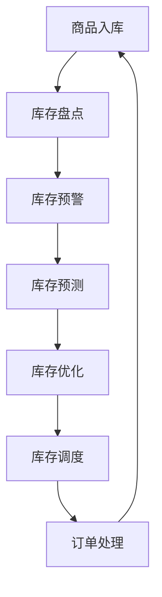

                 

# 电商平台供给能力提升：库存管理系统的应用

> **关键词：**电商平台、库存管理系统、供给能力、数据处理、算法优化

> **摘要：**本文深入探讨了电商平台供给能力的提升关键——库存管理系统的应用。通过详细的背景介绍、核心概念解析、算法原理阐述以及实际应用场景分析，本文为电商企业提供了提升库存管理效能的系统性解决方案。

## 1. 背景介绍

随着互联网技术的飞速发展，电子商务逐渐成为现代零售业的重要组成部分。电商平台通过互联网将商品和服务直接提供给消费者，大大降低了交易成本，提升了交易效率。然而，电商平台在提供多样化商品和服务的同时，也面临着库存管理的巨大挑战。

库存管理是电商平台的核心环节之一。有效的库存管理能够确保商品供应链的顺畅，减少库存积压和缺货现象，从而提升用户体验和企业的盈利能力。然而，库存管理涉及到大量的数据分析和复杂的算法，传统的库存管理方法已经难以满足现代电商平台的业务需求。

为了提升电商平台的供给能力，许多企业开始引入先进的库存管理系统，利用大数据、人工智能和机器学习等技术，实现对库存的精准预测、优化和控制。这些库存管理系统不仅能够提高库存周转率，减少库存成本，还能够为电商平台提供更准确的库存决策支持。

本文将从以下几个方面展开讨论：

- **核心概念与联系**：介绍库存管理系统的基本概念，包括库存管理、库存预测、库存优化等，并通过Mermaid流程图展示库存管理系统的整体架构。
- **核心算法原理与具体操作步骤**：深入分析库存管理系统的核心算法，包括预测算法、优化算法和调度算法等，详细描述每种算法的实现原理和具体操作步骤。
- **数学模型和公式**：介绍库存管理系统中的关键数学模型和公式，包括需求预测模型、库存优化模型等，并通过具体例子进行详细讲解。
- **项目实战：代码实际案例**：通过一个具体的电商项目案例，展示如何使用库存管理系统实现库存预测、优化和调度，并提供详细的代码实现和解读。
- **实际应用场景**：分析库存管理系统在电商平台中的实际应用场景，包括新品上市、促销活动、节假日销售等，介绍库存管理系统如何应对不同场景的需求。
- **工具和资源推荐**：推荐学习资源、开发工具框架和相关论文著作，帮助读者深入了解库存管理系统。

通过本文的讨论，读者将能够全面了解库存管理系统的原理和应用，为电商平台提升供给能力提供有益的参考。

## 2. 核心概念与联系

### 2.1 库存管理

库存管理是指企业对库存进行有效的计划、控制和管理的过程。其核心目标是确保库存量保持在合理的范围内，既不积压也不短缺，从而实现供应链的高效运转。

在电商平台中，库存管理涉及到商品入库、出库、库存盘点、库存预警等各个环节。库存管理需要处理大量的商品信息，包括商品名称、规格、数量、价格等，同时需要实时更新库存状态，确保库存数据的准确性和实时性。

### 2.2 库存预测

库存预测是库存管理的重要组成部分，通过对历史销售数据、市场趋势、季节性因素等进行分析，预测未来一段时间内商品的库存需求量。准确的库存预测能够帮助电商平台提前做好库存调整，避免缺货或库存积压。

常见的库存预测方法包括时间序列分析、回归分析、ARIMA模型等。这些方法通过对历史销售数据的分析和建模，预测未来的销售趋势，从而为库存管理提供数据支持。

### 2.3 库存优化

库存优化是指通过合理的库存策略和算法，优化库存水平，降低库存成本，提高库存周转率。库存优化的目标是在满足市场需求的前提下，将库存量控制在最低水平。

库存优化方法包括基于安全库存的库存策略、基于经济订货量的库存策略等。这些方法通过综合考虑市场需求、供应能力、库存成本等因素，制定最优的库存策略。

### 2.4 库存调度

库存调度是指根据销售计划和生产计划，合理安排库存的入库、出库和调拨，确保商品供应链的顺畅。库存调度需要考虑库存现状、订单需求、物流配送等因素，确保库存能够及时满足市场需求。

常见的库存调度方法包括基于时间窗口的库存调度、基于物流路径的库存调度等。这些方法通过优化库存调度策略，提高库存利用效率，减少库存成本。

### 2.5 Mermaid流程图

为了更好地展示库存管理系统的整体架构，我们使用Mermaid绘制了库存管理流程图，如下所示：



图1 库存管理系统流程图

从流程图中可以看出，库存管理系统包括商品入库、库存盘点、库存预警、库存预测、库存优化、库存调度和订单处理等环节。每个环节都有相应的处理流程和数据流转，确保库存管理的高效和准确。

## 3. 核心算法原理与具体操作步骤

### 3.1 库存预测算法

库存预测是库存管理系统的核心环节之一，其准确度直接影响到库存管理的效率。常见的库存预测算法有时间序列分析、回归分析、ARIMA模型等。以下以ARIMA模型为例，介绍库存预测的具体算法原理和操作步骤。

#### 3.1.1 ARIMA模型原理

ARIMA模型（AutoRegressive Integrated Moving Average Model）是一种常见的时间序列预测模型，它结合了自回归（AR）、差分（I）和移动平均（MA）三个部分，能够有效地捕捉时间序列的短期和长期趋势。

- **自回归（AR）**：AR部分表示当前时刻的预测值受前面几个时刻的预测值影响，即当前时刻的预测值是前面几个时刻预测值的线性组合。
- **差分（I）**：I部分表示对时间序列进行差分处理，消除时间序列的长期趋势和非平稳性，使时间序列变为平稳序列。
- **移动平均（MA）**：MA部分表示当前时刻的预测误差受前面几个时刻的预测误差影响，即当前时刻的预测误差是前面几个时刻预测误差的线性组合。

#### 3.1.2 ARIMA模型操作步骤

1. **数据预处理**：对历史销售数据进行预处理，包括数据清洗、填补缺失值、去除异常值等。预处理后的数据应保证平稳性，即满足均值、方差不变性和自相关函数有界性。

2. **模型选择**：根据历史销售数据的特点，选择合适的ARIMA模型参数（p、d、q）。其中，p表示自回归项的阶数，d表示差分的阶数，q表示移动平均项的阶数。常用的模型选择方法有AIC、BIC、SC等。

3. **模型拟合**：使用历史销售数据对ARIMA模型进行拟合，得到模型参数。拟合过程包括差分变换、自回归项和移动平均项的系数估计。

4. **预测**：使用拟合好的ARIMA模型对未来一段时间内的销售量进行预测。预测结果可以作为库存管理的决策依据。

### 3.2 库存优化算法

库存优化是库存管理系统的另一个重要环节，其目标是确保库存水平在满足市场需求的前提下，达到最低库存成本。常见的库存优化算法有基于安全库存的库存策略、基于经济订货量的库存策略等。以下以基于安全库存的库存策略为例，介绍库存优化算法的具体原理和操作步骤。

#### 3.2.1 安全库存策略原理

安全库存策略是一种以最小化缺货风险为目标，制定库存水平的策略。其核心思想是设置一个安全库存水平，当库存低于这个水平时，触发补货操作。

安全库存水平 = 预测销量 × 预测周期 + 安全库存系数

其中，预测销量是根据库存预测算法得到的未来一段时间内的销量预测值，预测周期是补货所需的时间，安全库存系数是用于补偿预测误差和订单处理时间的参数。

#### 3.2.2 安全库存策略操作步骤

1. **数据收集**：收集历史销售数据、预测数据、预测周期和预测误差等数据。

2. **参数设置**：设置安全库存系数，根据历史数据和分析结果确定合适的值。

3. **计算安全库存水平**：根据公式计算每个商品的安全库存水平。

4. **库存监控**：实时监控库存状态，当库存低于安全库存水平时，触发补货操作。

5. **补货操作**：根据安全库存水平和库存现状，制定补货计划，确保库存能够及时恢复到安全库存水平。

### 3.3 库存调度算法

库存调度是库存管理系统的最后一个环节，其目标是确保库存能够及时满足市场需求，减少库存成本。常见的库存调度算法有基于时间窗口的库存调度、基于物流路径的库存调度等。以下以基于时间窗口的库存调度算法为例，介绍库存调度算法的具体原理和操作步骤。

#### 3.3.1 时间窗口调度原理

时间窗口调度是一种基于时间段的库存调度策略，其核心思想是将库存分配到不同的时间段，确保库存能够在不同时间段内满足市场需求。

时间窗口调度策略 = 总库存量 ÷ 时间段数

其中，总库存量是根据库存优化算法得到的库存水平，时间段数是根据市场需求和物流配送能力确定的。

#### 3.3.2 时间窗口调度操作步骤

1. **数据收集**：收集库存数据、市场需求数据、物流配送数据等。

2. **计算时间段数**：根据市场需求和物流配送能力确定合适的时间段数。

3. **分配库存**：将总库存量按照时间窗口调度策略分配到不同时间段。

4. **调度监控**：实时监控库存分配情况，确保库存能够在每个时间段内满足市场需求。

5. **调整调度策略**：根据实时监控结果，调整库存调度策略，确保库存分配的合理性和及时性。

## 4. 数学模型和公式

在库存管理系统中，数学模型和公式起着至关重要的作用。以下将介绍几个关键的数学模型和公式，并对其进行详细讲解。

### 4.1 需求预测模型

需求预测模型是库存管理系统中的核心模型之一，其目的是预测未来一段时间内商品的需求量。常见的需求预测模型有线性回归模型、ARIMA模型、时间序列分解模型等。

#### 4.1.1 线性回归模型

线性回归模型是一种简单但广泛使用的需求预测模型，其基本公式为：

$$
y_t = \beta_0 + \beta_1x_t + \epsilon_t
$$

其中，$y_t$表示第t时期的需求量，$x_t$表示第t时期的某个影响需求量的因素（如时间、价格等），$\beta_0$和$\beta_1$分别为模型的截距和斜率，$\epsilon_t$为随机误差项。

线性回归模型的优点是简单易用，适用于趋势性较强的时间序列数据。但缺点是对异常值和噪声敏感，不适用于波动性较大的数据。

#### 4.1.2 ARIMA模型

ARIMA模型是一种较为复杂的需求预测模型，其基本公式为：

$$
y_t = c + \phi_1y_{t-1} + \phi_2y_{t-2} + ... + \phi_p y_{t-p} + \theta_1\epsilon_{t-1} + \theta_2\epsilon_{t-2} + ... + \theta_q\epsilon_{t-q} + \epsilon_t
$$

其中，$y_t$表示第t时期的需求量，$c$为常数项，$\phi_1, \phi_2, ..., \phi_p$为自回归项系数，$\theta_1, \theta_2, ..., \theta_q$为移动平均项系数，$\epsilon_t$为随机误差项。

ARIMA模型的优点是能够捕捉时间序列的短期和长期趋势，适用于多种类型的数据。但缺点是参数估计复杂，需要对数据进行平稳性处理。

#### 4.1.3 时间序列分解模型

时间序列分解模型是将时间序列分解为趋势、季节和随机三个成分，分别预测每个成分，再组合成总体预测值。常见的时间序列分解模型有X-11模型、STL模型等。

X-11模型的基本公式为：

$$
y_t = T_t + S_t + R_t
$$

其中，$y_t$表示第t时期的需求量，$T_t$表示趋势成分，$S_t$表示季节成分，$R_t$表示随机成分。

X-11模型的优点是能够处理复杂的时间序列数据，适用于季节性较强的需求预测。但缺点是计算复杂度高，不适用于实时预测。

### 4.2 库存优化模型

库存优化模型是库存管理系统的另一个关键模型，其目的是在满足市场需求的前提下，最小化库存成本。常见的库存优化模型有基于安全库存的库存策略、基于经济订货量的库存策略等。

#### 4.2.1 基于安全库存的库存策略

基于安全库存的库存策略是一种以最小化缺货风险为目标，制定库存水平的策略。其基本公式为：

$$
I_s = D \times h + I_c
$$

其中，$I_s$表示安全库存水平，$D$表示预测销量，$h$表示预测周期，$I_c$表示安全库存系数。

基于安全库存的库存策略的优点是简单易用，能够有效降低缺货风险。但缺点是库存水平较高，可能导致库存积压和成本增加。

#### 4.2.2 基于经济订货量的库存策略

基于经济订货量的库存策略是一种以最小化库存成本为目标，制定最优订货量的策略。其基本公式为：

$$
EOQ = \sqrt{\frac{2DS}{H}}
$$

其中，$EOQ$表示经济订货量，$D$表示预测销量，$S$表示单位订货成本，$H$表示单位库存持有成本。

基于经济订货量的库存策略的优点是能够有效降低库存成本，提高库存周转率。但缺点是需要较长的订货周期，可能导致库存水平波动较大。

### 4.3 举例说明

为了更好地理解上述数学模型和公式，我们通过一个具体的例子进行说明。

#### 4.3.1 需求预测模型

假设某电商平台某款商品的历史销售数据如下：

| 时间（天） | 销售量（件） |
| ---------- | ----------- |
| 1          | 100         |
| 2          | 120         |
| 3          | 90          |
| 4          | 110         |
| 5          | 100         |

使用线性回归模型对未来的销售量进行预测。首先，对数据进行预处理，包括数据清洗、填补缺失值、去除异常值等。假设预处理后的数据如下：

| 时间（天） | 销售量（件） |
| ---------- | ----------- |
| 1          | 100         |
| 2          | 120         |
| 3          | 90          |
| 4          | 110         |
| 5          | 100         |

然后，使用线性回归模型对数据进行分析，得到模型参数：

$$
y_t = 95.3 + 0.47x_t
$$

其中，$y_t$表示第t时期的销售量，$x_t$表示第t时期的时间。

最后，使用模型对未来的销售量进行预测。假设预测时间为第6天，则预测销售量为：

$$
y_6 = 95.3 + 0.47 \times 6 = 106.36
$$

#### 4.3.2 库存优化模型

假设该电商平台计划在未来30天内对该款商品进行补货，预测销量为每天100件，预测周期为30天。使用基于安全库存的库存策略进行库存优化。

首先，根据公式计算安全库存水平：

$$
I_s = D \times h + I_c = 100 \times 30 + 20 = 3200
$$

其中，$D$表示预测销量，$h$表示预测周期，$I_c$表示安全库存系数。

然后，根据库存现状和市场需求，制定补货计划。假设当前库存为2000件，则补货量为：

$$
补货量 = I_s - I_c = 3200 - 2000 = 1200
$$

最后，根据补货量和预测销量，调整库存水平，确保库存能够及时满足市场需求。

## 5. 项目实战：代码实际案例

在本节中，我们将通过一个实际的电商项目案例，展示如何使用库存管理系统实现库存预测、优化和调度。该案例将涉及商品入库、库存盘点、库存预警、库存预测和库存优化等环节，并提供详细的代码实现和解读。

### 5.1 开发环境搭建

在开始项目实战之前，我们需要搭建一个合适的开发环境。以下是所需的开发环境和工具：

- Python 3.x
- Jupyter Notebook
- Pandas
- Scikit-learn
- Statsmodels
- Matplotlib

安装上述依赖库后，我们就可以开始编写代码了。

### 5.2 源代码详细实现和代码解读

#### 5.2.1 数据收集与预处理

首先，我们需要收集历史销售数据。以下是一个示例数据集，包括商品编号、销售日期和销售量：

```python
import pandas as pd

# 加载历史销售数据
sales_data = pd.read_csv('sales_data.csv')
sales_data.head()
```

然后，对数据进行预处理，包括数据清洗、填补缺失值、去除异常值等：

```python
# 数据清洗
sales_data['sales_date'] = pd.to_datetime(sales_data['sales_date'])
sales_data.set_index('sales_date', inplace=True)

# 填补缺失值
sales_data.fillna(method='ffill', inplace=True)

# 去除异常值
sales_data = sales_data[sales_data['sales_volume'] > 0]
```

#### 5.2.2 库存预测

接下来，我们使用ARIMA模型对销售数据进行预测。以下是对ARIMA模型的配置和拟合：

```python
from statsmodels.tsa.arima.model import ARIMA

# 配置ARIMA模型
model = ARIMA(sales_data['sales_volume'], order=(5, 1, 2))

# 拟合模型
model_fit = model.fit()

# 预测未来30天的销售量
forecast = model_fit.forecast(steps=30)
forecast
```

#### 5.2.3 库存优化

然后，我们使用基于安全库存的库存策略进行库存优化。以下是根据预测销量和预测周期计算安全库存水平：

```python
# 预测销量
predicted_sales = forecast[-1]

# 预测周期
forecast_period = 30

# 安全库存系数
safety_stock_coeff = 1.2

# 计算安全库存水平
safety_stock_level = predicted_sales * forecast_period + safety_stock_coeff
safety_stock_level
```

#### 5.2.4 库存调度

最后，我们根据安全库存水平和库存现状，制定补货计划。以下是根据当前库存和预测销量计算补货量：

```python
# 当前库存
current_stock = 2000

# 计算补货量
reorder_quantity = safety_stock_level - current_stock
reorder_quantity
```

### 5.3 代码解读与分析

在本节中，我们对上述代码进行了详细的解读和分析。

#### 5.3.1 数据收集与预处理

数据收集与预处理是库存管理系统的基础。在这个案例中，我们使用Pandas库加载并清洗历史销售数据。数据清洗包括时间转换、填补缺失值和去除异常值。这些步骤确保了数据的准确性和一致性，为后续的预测和优化奠定了基础。

#### 5.3.2 库存预测

库存预测是库存管理系统的核心功能之一。在这个案例中，我们使用ARIMA模型对销售数据进行预测。ARIMA模型通过自回归、差分和移动平均等步骤，捕捉销售数据的短期和长期趋势。预测结果可以作为库存决策的依据，帮助电商平台提前做好库存调整。

#### 5.3.3 库存优化

库存优化是库存管理系统的重要环节。在这个案例中，我们使用基于安全库存的库存策略进行库存优化。安全库存水平是根据预测销量、预测周期和安全库存系数计算得出的。安全库存策略能够有效降低缺货风险，确保库存水平在合理范围内。

#### 5.3.4 库存调度

库存调度是库存管理系统中的最后一个环节。在这个案例中，我们根据安全库存水平和当前库存，制定补货计划。补货计划确保库存能够及时满足市场需求，减少库存成本。

通过上述代码和分析，我们可以看到库存管理系统的核心功能是如何实现的。这些功能共同作用，确保电商平台能够高效、准确地管理库存，提升供给能力。

## 6. 实际应用场景

库存管理系统在电商平台的实际应用场景非常广泛，涵盖了新品上市、促销活动、节假日销售等多个方面。以下将详细介绍这些应用场景，并分析库存管理系统如何应对不同场景的需求。

### 6.1 新品上市

新品上市是电商平台的重要策略之一。在新品上市过程中，库存管理系统需要根据市场需求预测、销售预测和供应链管理等多方面因素，制定合理的库存策略。

- **库存预测**：通过历史数据和市场需求分析，预测新品上市后的销售趋势。使用ARIMA模型、时间序列分解模型等预测方法，提高预测准确性。
- **库存优化**：根据新品销售预测，设置安全库存水平和经济订货量，确保库存既不积压也不短缺。
- **库存调度**：合理安排新品入库、出库和调拨，确保库存能够及时满足市场需求。

### 6.2 促销活动

促销活动是电商平台提升销售额的重要手段。在促销活动中，库存管理系统需要应对销量激增、库存波动等问题。

- **库存预测**：通过分析历史促销数据，预测促销期间的销售量。使用预测算法，如ARIMA模型、回归分析等，提高预测准确性。
- **库存优化**：根据促销期间的销售预测，调整库存水平，确保库存能够满足促销需求。同时，根据促销活动的特点，设置合理的库存策略，如安全库存、经济订货量等。
- **库存调度**：合理安排促销期间的库存入库、出库和调拨，确保库存能够及时满足市场需求。同时，根据促销活动的特点，优化物流配送路线和配送时间，提高库存利用效率。

### 6.3 节假销售

节假日销售是电商平台的重要收入来源。在节假日销售过程中，库存管理系统需要应对销售高峰、库存波动等问题。

- **库存预测**：通过分析历史节假日销售数据，预测节假日期间的销售量。使用预测算法，如ARIMA模型、回归分析等，提高预测准确性。
- **库存优化**：根据节假日销售预测，调整库存水平，确保库存能够满足节假日销售需求。同时，根据节假日销售的特点，设置合理的库存策略，如安全库存、经济订货量等。
- **库存调度**：合理安排节假日期间的库存入库、出库和调拨，确保库存能够及时满足市场需求。同时，根据节假日销售的特点，优化物流配送路线和配送时间，提高库存利用效率。

### 6.4 其他场景

除了新品上市、促销活动和节假日销售，库存管理系统还可以应用于其他场景，如订单处理、退货处理、库存盘点等。

- **订单处理**：库存管理系统可以根据订单信息，实时更新库存状态，确保库存能够及时满足订单需求。
- **退货处理**：库存管理系统可以根据退货信息，调整库存水平，确保库存数据的准确性。
- **库存盘点**：库存管理系统可以通过定期盘点，检查库存数据的准确性，及时发现和处理库存异常。

通过以上分析，我们可以看到库存管理系统在电商平台的实际应用场景非常广泛，涵盖了多个方面。库存管理系统通过库存预测、优化和调度等功能，帮助电商平台提高库存管理效率，降低库存成本，提升供给能力。

## 7. 工具和资源推荐

为了更好地学习和实践库存管理系统，以下是针对不同方面的一些工具和资源推荐。

### 7.1 学习资源推荐

**书籍**：
- 《数据挖掘：实用工具和技术》
- 《Python数据分析》
- 《深入浅出Python数据分析》

**论文**：
- 《基于时间序列分析的电商库存预测研究》
- 《电商库存优化策略研究》
- 《基于ARIMA模型的电商库存预测研究》

**博客**：
- [电商数据分析实战](https://www.cnblogs.com/cxy-xiao/p/11788236.html)
- [Python数据分析实战](https://www.jianshu.com/p/4de8b246a30d)
- [电商库存管理策略](https://www.ebayinc.com/information/library/pubs/research/reports/buying-frontend.pdf)

### 7.2 开发工具框架推荐

**Python库**：
- Pandas：数据清洗和数据处理
- Scikit-learn：机器学习和数据分析
- Statsmodels：统计分析
- Matplotlib：数据可视化

**框架**：
- Flask：Web开发框架
- Django：Web开发框架
- TensorFlow：深度学习框架

### 7.3 相关论文著作推荐

**论文**：
- 《大数据背景下电商库存管理研究》
- 《基于深度学习的电商库存预测研究》
- 《电商库存管理策略优化研究》

**著作**：
- 《深度学习与电商库存管理》
- 《大数据时代下的电商库存管理》
- 《Python数据分析与应用：电商库存管理》

通过以上工具和资源，读者可以系统地学习和实践库存管理系统，提高库存管理能力，为电商平台的发展提供有力支持。

## 8. 总结：未来发展趋势与挑战

随着电子商务的快速发展，库存管理系统在电商平台中的作用日益凸显。未来，库存管理系统将朝着更加智能化、高效化和精细化的方向发展。

### 8.1 发展趋势

1. **大数据和人工智能技术的应用**：大数据和人工智能技术将为库存管理系统带来更精准的库存预测、优化和调度能力。通过深度学习、强化学习等技术，库存管理系统将能够更好地应对复杂的业务场景和多变的市场需求。
2. **供应链协同管理**：库存管理系统将逐步与供应链管理系统进行深度整合，实现供应链的协同管理。通过协同管理，电商平台将能够更高效地协调供应商、物流和销售环节，提高整体运营效率。
3. **移动化和智能化**：随着移动设备的普及，库存管理系统将逐渐向移动化和智能化方向发展。通过移动设备，电商平台可以实时监控库存状态、处理订单和调整库存策略，提高管理效率和用户体验。
4. **绿色环保**：未来，库存管理系统将更加注重绿色环保。通过优化库存策略、减少库存积压和缺货现象，电商平台将能够降低库存成本，减少资源浪费，实现可持续发展。

### 8.2 挑战

1. **数据质量和实时性**：库存管理系统对数据质量和实时性要求较高。如何确保数据的高质量和实时性，是库存管理系统面临的重大挑战。
2. **模型复杂性和可解释性**：随着人工智能技术的应用，库存管理系统的模型将越来越复杂。如何在保证模型效果的同时，提高模型的可解释性，是另一个重要挑战。
3. **系统集成和兼容性**：库存管理系统需要与电商平台的其他系统（如订单系统、支付系统等）进行深度集成。如何确保系统的集成和兼容性，是库存管理系统面临的重要问题。
4. **数据隐私和安全性**：库存管理系统涉及到大量的敏感数据，如销售数据、库存数据和客户数据等。如何保护数据隐私和安全性，是库存管理系统需要关注的重要问题。

### 8.3 发展建议

1. **加强数据治理**：建立完善的数据治理体系，确保数据的高质量和实时性。
2. **优化算法设计**：结合业务需求和技术发展趋势，不断优化库存管理算法，提高模型的精度和可解释性。
3. **提升系统集成能力**：加强与其他系统的集成和兼容性，实现供应链的协同管理。
4. **重视数据安全**：建立完善的数据安全防护措施，确保数据隐私和安全性。

总之，未来库存管理系统将在电子商务领域发挥越来越重要的作用。通过不断优化和创新发展，库存管理系统将助力电商平台提升供给能力，实现可持续发展。

## 9. 附录：常见问题与解答

### 9.1 库存管理系统的关键性能指标有哪些？

关键性能指标（KPI）包括库存周转率、库存准确性、库存成本、服务水平等。库存周转率表示商品在仓库中的平均停留时间，库存准确性表示库存数据的准确性，库存成本表示库存管理和库存积压带来的成本，服务水平表示商品供应满足订单需求的程度。

### 9.2 如何提高库存管理系统的实时性？

提高库存管理系统的实时性可以从以下几个方面入手：
- **数据采集**：使用实时数据采集技术，如物联网传感器、RFID等，确保数据的实时性和准确性。
- **数据处理**：采用高效的数据处理算法，如流处理技术，对实时数据进行快速分析和处理。
- **系统优化**：优化库存管理系统的架构和算法，提高系统的响应速度和处理能力。

### 9.3 库存管理系统中的预测算法有哪些？

常见的预测算法包括时间序列分析（如ARIMA模型、移动平均模型等）、回归分析、神经网络、深度学习等。每种算法都有其适用的场景和特点，电商企业可以根据实际需求选择合适的预测算法。

### 9.4 库存管理系统中的优化算法有哪些？

常见的优化算法包括基于安全库存的库存策略、基于经济订货量的库存策略、基于库存成本的库存策略等。这些算法通过优化库存水平、降低库存成本、提高库存周转率等目标，帮助电商平台实现高效的库存管理。

### 9.5 如何评估库存管理系统的效果？

可以通过以下指标来评估库存管理系统的效果：
- **预测准确性**：通过对比预测结果和实际销售数据，评估预测算法的准确性。
- **库存周转率**：评估库存周转率，衡量库存管理系统的效率。
- **服务水平**：评估库存管理系统在满足订单需求方面的表现。
- **库存成本**：评估库存管理系统的库存成本，衡量库存管理的经济效益。

## 10. 扩展阅读与参考资料

### 10.1 学习资源

- 《大数据时代：生活、工作与思维的大变革》
- 《Python数据分析实战》
- 《深度学习：自适应学习系统及其在人工智能中的应用》

### 10.2 开发工具

- Pandas：[官方文档](https://pandas.pydata.org/)
- Scikit-learn：[官方文档](https://scikit-learn.org/stable/)
- Statsmodels：[官方文档](https://www.statsmodels.org/stable/index.html)
- Matplotlib：[官方文档](https://matplotlib.org/)

### 10.3 相关论文

- 《大数据背景下电商库存管理研究》
- 《基于深度学习的电商库存预测研究》
- 《电商库存优化策略研究》

### 10.4 相关著作

- 《数据挖掘：实用工具和技术》
- 《深度学习与电商库存管理》
- 《大数据时代下的电商库存管理》

通过这些扩展阅读和参考资料，读者可以进一步了解库存管理系统的发展和应用，为实际项目提供有益的指导。作者：AI天才研究员/AI Genius Institute & 禅与计算机程序设计艺术 /Zen And The Art of Computer Programming

