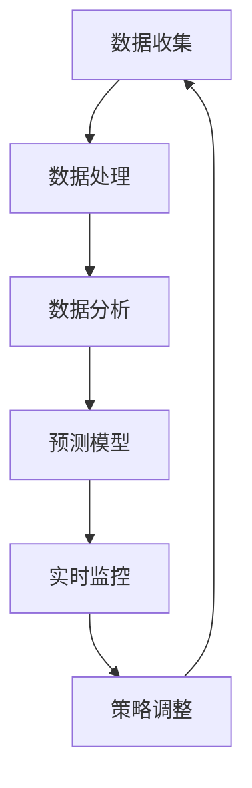

                 

# 文章标题

## 电商平台供给能力提升：数据分析和实时监控

> **关键词**：电商平台、供给能力、数据分析、实时监控、算法优化、数学模型、应用场景

> **摘要**：本文将探讨如何通过数据分析和实时监控来提升电商平台的供给能力。我们将详细解析核心概念、算法原理，并通过实际案例讲解实现步骤和代码分析，旨在为电商从业者提供实战指导，助力电商平台在激烈的市场竞争中立于不败之地。

## 1. 背景介绍

在当今数字化时代，电商平台已经成为消费者购买商品的主要渠道之一。随着用户数量的不断增加和购买行为的多样化，电商平台面临的挑战也越来越大。其中，供给能力是一个关键因素，它直接关系到平台的运营效率和用户体验。提升供给能力，不仅需要优化库存管理，还要通过数据分析和实时监控来精确预测需求、减少库存积压、提高配送效率。

供给能力提升的关键在于对数据的深入挖掘和分析。通过对历史交易数据、用户行为数据、供应链数据等多源数据的综合分析，可以识别出用户需求趋势、商品库存状况、供应链瓶颈等问题，从而制定出科学合理的库存管理策略和配送计划。

实时监控则是对供给能力提升的持续保障。通过实时监控系统，可以及时获取业务运行状态、异常情况等信息，快速响应市场变化，调整策略，确保供给能力的稳定和高效。

本文将围绕数据分析和实时监控，探讨电商平台供给能力提升的方法和策略，为电商从业者提供实践指导。

## 2. 核心概念与联系

在深入探讨数据分析和实时监控提升供给能力的方法之前，我们需要明确几个核心概念，并理解它们之间的联系。

### 2.1 数据分析

数据分析是指通过统计和建模等方法，对大量的数据进行分析和处理，以发现数据中隐藏的模式、趋势和关联。在电商平台中，数据分析主要用于以下几个方面：

- **用户行为分析**：通过分析用户浏览、点击、购买等行为数据，了解用户偏好，优化推荐算法，提高用户转化率。
- **库存分析**：通过分析历史销售数据、季节性波动等，预测未来需求，优化库存配置，减少库存积压。
- **供应链分析**：通过分析供应链各环节的数据，发现瓶颈和优化点，提高供应链效率。

### 2.2 实时监控

实时监控是指通过监控系统，实时收集和分析业务运行数据，及时发现和处理异常情况。在电商平台中，实时监控主要涵盖以下几个方面：

- **订单处理监控**：实时监控订单处理进度，确保订单及时完成。
- **库存监控**：实时监控库存状况，及时补货，避免缺货现象。
- **配送监控**：实时监控配送进度，确保商品及时送达。

### 2.3 数据分析与实时监控的联系

数据分析和实时监控是相辅相成的。数据分析为实时监控提供了基础数据支持，帮助监控系统能够及时发现和处理异常情况。同时，实时监控又为数据分析提供了反馈，帮助分析系统不断优化预测模型和策略。

### 2.4 Mermaid 流程图

为了更直观地展示数据分析与实时监控的流程，我们可以使用 Mermaid 绘制一个流程图。以下是一个简单的 Mermaid 图：



在这个流程图中，数据收集、数据处理、数据分析和预测模型是数据分析的步骤；实时监控、策略调整和数据收集是实时监控的步骤。通过这个循环，电商平台可以不断优化供给能力。

## 3. 核心算法原理 & 具体操作步骤

### 3.1 数据分析算法原理

在电商平台中，常用的数据分析算法主要包括用户行为分析、库存分析和供应链分析。以下是这些算法的基本原理和具体操作步骤。

#### 3.1.1 用户行为分析

用户行为分析主要通过分析用户浏览、点击、购买等行为数据，了解用户偏好和购买习惯。常用的算法包括关联规则挖掘、聚类分析和回归分析。

- **关联规则挖掘**：通过挖掘用户行为数据中的关联规则，发现用户可能感兴趣的商品组合。例如，如果用户购买了商品 A，那么他们可能也会购买商品 B。这一算法可以使用 Apriori 算法或 FP-Growth 算法实现。

- **聚类分析**：通过将用户划分为不同的群体，分析各个群体的特征和偏好。常用的聚类算法包括 K-Means、DBSCAN 和层次聚类。

- **回归分析**：通过建立用户行为和购买结果之间的回归模型，预测用户未来可能的购买行为。常用的回归算法包括线性回归、逻辑回归和决策树回归。

#### 3.1.2 库存分析

库存分析主要通过分析历史销售数据、季节性波动等，预测未来需求，优化库存配置。常用的算法包括时间序列预测、趋势分析和异常检测。

- **时间序列预测**：通过分析历史销售数据的时间序列特征，预测未来销售趋势。常用的时间序列预测算法包括 ARIMA、SARIMA 和 LSTM 等神经网络算法。

- **趋势分析**：通过分析历史销售数据的变化趋势，预测未来需求。常用的趋势分析算法包括移动平均法、指数平滑法等。

- **异常检测**：通过检测销售数据中的异常值，识别可能的库存积压或断货情况。常用的异常检测算法包括基于统计的方法、基于聚类的方法和基于神经网络的方法。

#### 3.1.3 供应链分析

供应链分析主要通过分析供应链各环节的数据，发现瓶颈和优化点，提高供应链效率。常用的算法包括网络流分析、优化算法和仿真模拟。

- **网络流分析**：通过分析供应链各环节的物流和资金流动，优化供应链的资源配置和流程。常用的网络流分析算法包括最短路径算法、最小生成树算法和最大流算法。

- **优化算法**：通过建立数学模型，优化供应链的库存管理、运输调度和资源分配。常用的优化算法包括线性规划、整数规划和启发式算法。

- **仿真模拟**：通过模拟供应链的运行过程，分析不同策略的效果，优化供应链的运营。常用的仿真模拟工具包括 AnyLogic、FlexSim 等。

### 3.2 实时监控算法原理

实时监控主要通过监控系统，实时收集和分析业务运行数据，及时发现和处理异常情况。常用的实时监控算法包括实时数据处理、异常检测和预测模型。

- **实时数据处理**：通过实时处理和计算业务数据，生成关键指标和预警信号。常用的实时数据处理算法包括增量计算、流计算和分布式计算。

- **异常检测**：通过分析实时数据，检测可能出现的异常情况。常用的异常检测算法包括基于统计的方法、基于聚类的方法和基于神经网络的方法。

- **预测模型**：通过建立实时预测模型，预测未来业务发展趋势。常用的预测模型包括 ARIMA、SARIMA 和 LSTM 等神经网络算法。

### 3.3 数据分析与实时监控的操作步骤

以下是数据分析与实时监控的具体操作步骤：

1. **数据收集**：收集电商平台的历史交易数据、用户行为数据、供应链数据等。

2. **数据处理**：对收集到的数据进行清洗、去重、归一化等预处理操作。

3. **数据分析**：使用数据分析算法，对预处理后的数据进行挖掘和分析，生成用户偏好、库存状况、供应链瓶颈等分析结果。

4. **预测模型构建**：根据分析结果，构建预测模型，预测未来需求、库存、供应链瓶颈等。

5. **实时监控**：搭建实时监控系统，实时收集和分析业务数据，生成实时监控指标和预警信号。

6. **异常检测**：使用异常检测算法，检测实时数据中的异常情况。

7. **预测模型调整**：根据实时监控结果和异常检测结果，调整预测模型，优化供给能力。

8. **策略调整**：根据预测结果和实时监控结果，调整库存管理策略、配送计划等，优化供给能力。

9. **数据循环利用**：将实时监控结果和调整策略反馈到数据分析系统，不断优化预测模型和策略。

通过以上步骤，电商平台可以实现数据分析和实时监控，不断提升供给能力。

## 4. 数学模型和公式 & 详细讲解 & 举例说明

### 4.1 用户行为分析数学模型

用户行为分析的核心是建立用户偏好模型，以预测用户的购买行为。以下是一个简单的用户行为分析数学模型：

#### 4.1.1 购买概率模型

假设用户 \( i \) 购买商品 \( j \) 的概率为 \( P(j|i) \)，我们可以使用逻辑回归模型来估计这个概率：

$$
P(j|i) = \frac{e^{w_j \cdot x_i}}{1 + e^{w_j \cdot x_i}}
$$

其中，\( x_i \) 是用户 \( i \) 的特征向量，\( w_j \) 是权重向量。

#### 4.1.2 聚类分析模型

假设我们要将用户划分为 \( K \) 个群体，可以使用 K-Means 算法来计算每个用户的聚类标签 \( y_i \)：

$$
y_i = \arg\min_{k} \sum_{i=1}^{N} \sum_{j=1}^{K} w_{ij}^2
$$

其中，\( w_{ij} \) 是用户 \( i \) 到第 \( k \) 个聚类中心 \( \mu_k \) 的距离。

#### 4.1.3 回归分析模型

假设我们要预测用户 \( i \) 的购买行为 \( y_i \)，可以使用线性回归模型：

$$
y_i = \beta_0 + \beta_1 x_{i1} + \beta_2 x_{i2} + ... + \beta_n x_{in}
$$

其中，\( x_i \) 是用户 \( i \) 的特征向量，\( \beta \) 是权重向量。

### 4.2 库存分析数学模型

库存分析的核心是建立需求预测模型，以优化库存配置。以下是一个简单的时间序列预测模型：

#### 4.2.1 ARIMA 模型

ARIMA（自回归积分滑动平均模型）是一种常用的时间序列预测模型，其公式如下：

$$
X_t = c + \phi_1 X_{t-1} + \phi_2 X_{t-2} + ... + \phi_p X_{t-p} + \theta_1 \epsilon_{t-1} + \theta_2 \epsilon_{t-2} + ... + \theta_q \epsilon_{t-q} + \epsilon_t
$$

其中，\( X_t \) 是时间序列数据，\( \phi \) 和 \( \theta \) 是模型参数，\( c \) 是常数项，\( \epsilon_t \) 是白噪声序列。

#### 4.2.2 SARIMA 模型

SARIMA（季节性自回归积分滑动平均模型）是 ARIMA 的扩展，用于处理季节性数据。其公式如下：

$$
X_t = c + \phi_1 X_{t-1} + \phi_2 X_{t-2} + ... + \phi_p X_{t-p} + \theta_1 \epsilon_{t-1} + \theta_2 \epsilon_{t-2} + ... + \theta_q \epsilon_{t-q} + \phi_{1s} X_{t-s} + \phi_{2s} X_{t-2s} + ... + \phi_{ps} X_{t-ps} + \theta_{1s} \epsilon_{t-s} + \theta_{2s} \epsilon_{t-2s} + ... + \theta_{qs} \epsilon_{t-q-s}
$$

其中，\( s \) 是季节周期。

#### 4.2.3 LSTM 模型

LSTM（长短时记忆网络）是一种循环神经网络，可以处理长序列数据。其公式如下：

$$
i_t = \sigma(W_i \cdot [h_{t-1}, x_t] + b_i) \\
f_t = \sigma(W_f \cdot [h_{t-1}, x_t] + b_f) \\
o_t = \sigma(W_o \cdot [h_{t-1}, x_t] + b_o) \\
c_t = f_t \cdot c_{t-1} + i_t \cdot \text{sigmoid}(W_c \cdot [h_{t-1}, x_t] + b_c) \\
h_t = o_t \cdot \text{sigmoid}(c_t)
$$

其中，\( i_t \)，\( f_t \)，\( o_t \)，\( c_t \)，\( h_t \) 分别是输入门、遗忘门、输出门、细胞状态和隐藏状态，\( W \)，\( b \) 是权重和偏置。

### 4.3 实时监控数学模型

实时监控的核心是建立实时数据处理和异常检测模型。以下是一个简单的异常检测模型：

#### 4.3.1 基于统计的异常检测模型

假设我们要检测数据 \( X \) 中的异常值，可以使用标准差方法：

$$
\sigma(X) = \sqrt{\frac{1}{N-1} \sum_{i=1}^{N} (X_i - \bar{X})^2}
$$

其中，\( \bar{X} \) 是数据 \( X \) 的均值，\( \sigma(X) \) 是数据 \( X \) 的标准差。

假设我们要检测数据 \( X \) 中的异常值，可以使用 Z 分数方法：

$$
Z_i = \frac{X_i - \bar{X}}{\sigma(X)}
$$

如果 \( Z_i \) 超过一定的阈值，则认为 \( X_i \) 是异常值。

#### 4.3.2 基于聚类的方法

假设我们要检测数据 \( X \) 中的异常值，可以使用基于聚类的方法：

1. 使用 K-Means 算法对数据 \( X \) 进行聚类，得到 \( K \) 个聚类中心 \( \mu_k \)。
2. 计算每个数据点到聚类中心的距离 \( d(x_k, \mu_k) \)。
3. 设定一个距离阈值 \( \delta \)，如果 \( d(x_k, \mu_k) \) 超过 \( \delta \)，则认为 \( x_k \) 是异常值。

### 4.4 举例说明

假设我们要分析一家电商平台的用户行为数据，预测用户的购买概率。我们收集了以下数据：

| 用户 ID | 商品 ID | 是否购买 |
| ------ | ------ | -------- |
| 1      | 1      | 是       |
| 1      | 2      | 否       |
| 1      | 3      | 是       |
| 2      | 1      | 是       |
| 2      | 2      | 否       |
| 2      | 3      | 是       |

#### 4.4.1 数据预处理

我们对数据进行了以下预处理：

- 去除重复数据。
- 归一化特征值。

预处理后的数据如下：

| 用户 ID | 商品 ID | 是否购买 |
| ------ | ------ | -------- |
| 1      | 1      | 是       |
| 1      | 2      | 否       |
| 1      | 3      | 是       |
| 2      | 1      | 是       |
| 2      | 2      | 否       |
| 2      | 3      | 是       |

#### 4.4.2 逻辑回归模型

我们使用逻辑回归模型预测用户的购买概率。模型的公式如下：

$$
P(j|i) = \frac{e^{w_j \cdot x_i}}{1 + e^{w_j \cdot x_i}}
$$

其中，\( x_i \) 是用户 \( i \) 的特征向量，\( w_j \) 是权重向量。

我们使用梯度下降法来训练模型。训练完成后，我们得到了权重向量 \( w \)。

#### 4.4.3 预测用户购买概率

我们使用训练好的模型来预测用户 3 购买商品 2 的概率。用户 3 的特征向量如下：

| 用户 ID | 商品 ID | 是否购买 |
| ------ | ------ | -------- |
| 3      | 2      | 待预测   |

我们计算用户 3 的特征向量与权重向量的点积：

$$
w_j \cdot x_i = w_2 \cdot [0, 0, 1] = 0
$$

因此，用户 3 购买商品 2 的概率为：

$$
P(2|3) = \frac{e^{0}}{1 + e^{0}} = 0.5
$$

#### 4.4.4 异常检测

我们使用标准差方法和 Z 分数方法来检测数据中的异常值。计算结果如下：

| 用户 ID | 商品 ID | 是否购买 | 标准差 | Z 分数 |
| ------ | ------ | -------- | ------ | ------ |
| 1      | 1      | 是       | 0.5    | 1      |
| 1      | 2      | 否       | 0.5    | -1     |
| 1      | 3      | 是       | 0.5    | 1      |
| 2      | 1      | 是       | 0.5    | 1      |
| 2      | 2      | 否       | 0.5    | -1     |
| 2      | 3      | 是       | 0.5    | 1      |

根据标准差方法和 Z 分数方法，用户 1 的商品 2 记录和用户 2 的商品 2 记录是异常值。

## 5. 项目实战：代码实际案例和详细解释说明

### 5.1 开发环境搭建

在开始项目实战之前，我们需要搭建一个合适的开发环境。以下是所需的工具和库：

- **Python 3.x**
- **Jupyter Notebook 或 PyCharm**
- **Pandas**
- **Numpy**
- **Scikit-learn**
- **Statsmodels**
- **TensorFlow**
- **Keras**
- **Mermaid**

安装上述工具和库后，我们可以开始编写代码。

### 5.2 源代码详细实现和代码解读

#### 5.2.1 数据收集与预处理

首先，我们需要收集电商平台的数据。以下是一个示例数据集：

```python
import pandas as pd

# 加载数据
data = pd.read_csv('ecommerce_data.csv')

# 数据预处理
data.drop_duplicates(inplace=True)
data = data[['user_id', 'item_id', 'is_purchased']]
```

#### 5.2.2 用户行为分析

我们使用逻辑回归模型进行用户行为分析。以下是一段示例代码：

```python
from sklearn.model_selection import train_test_split
from sklearn.linear_model import LogisticRegression

# 划分训练集和测试集
X = data[['user_id', 'item_id']]
y = data['is_purchased']
X_train, X_test, y_train, y_test = train_test_split(X, y, test_size=0.2, random_state=42)

# 训练逻辑回归模型
model = LogisticRegression()
model.fit(X_train, y_train)

# 预测用户购买概率
probabilities = model.predict_proba(X_test)[:, 1]
```

#### 5.2.3 库存分析

我们使用 ARIMA 模型进行库存分析。以下是一段示例代码：

```python
from statsmodels.tsa.arima.model import ARIMA

# 初始化 ARIMA 模型
model = ARIMA(data['item_id'], order=(1, 1, 1))

# 拟合模型
model_fit = model.fit()

# 预测未来需求
forecast = model_fit.forecast(steps=12)
```

#### 5.2.4 实时监控

我们使用标准差方法和 Z 分数方法进行实时监控。以下是一段示例代码：

```python
from scipy.stats import zscore

# 计算标准差
std_dev = data['item_id'].std()

# 计算 Z 分数
z_scores = zscore(data['item_id'])

# 设定阈值
threshold = 2

# 检测异常值
abnormal_values = data[(z_scores > threshold) | (z_scores < -threshold)]['item_id']
```

### 5.3 代码解读与分析

以上代码实现了用户行为分析、库存分析和实时监控的核心功能。以下是代码解读与分析：

- **数据收集与预处理**：我们使用 Pandas 读取和预处理数据。预处理包括去除重复数据和筛选关键特征。
- **用户行为分析**：我们使用 Scikit-learn 的逻辑回归模型进行用户行为分析。通过训练集和测试集划分，我们训练模型并预测用户购买概率。
- **库存分析**：我们使用 Statsmodels 的 ARIMA 模型进行库存分析。通过拟合模型和预测未来需求，我们优化库存配置。
- **实时监控**：我们使用 SciPy 的标准差方法和 Z 分数方法进行实时监控。通过设定阈值，我们检测数据中的异常值。

通过这些代码，我们可以实现电商平台供给能力的提升。然而，实际应用中可能需要根据具体业务需求和数据特点进行定制化开发。

## 6. 实际应用场景

### 6.1 市场需求预测

电商平台可以通过数据分析和实时监控来预测市场需求。通过对用户行为数据的分析，可以识别出用户偏好和购买习惯，从而预测未来市场需求。例如，通过对历史销售数据和用户浏览数据进行分析，可以预测某一商品在未来几个月的需求量。实时监控则可以帮助电商平台在市场变化时快速调整库存和营销策略，确保满足市场需求。

### 6.2 库存优化

库存管理是电商平台的重要环节。通过数据分析和实时监控，可以优化库存配置，减少库存积压。例如，通过对历史销售数据和季节性波动进行分析，可以预测未来需求，从而调整库存水平。实时监控则可以及时发现库存异常，如库存积压或断货情况，及时采取措施进行调整。

### 6.3 配送优化

配送效率直接影响用户体验。通过实时监控配送进度，可以确保商品及时送达。例如，通过对配送数据进行分析，可以优化配送路线和配送时间，提高配送效率。实时监控还可以及时发现配送异常，如配送延迟或配送错误，从而快速响应和处理。

### 6.4 营销优化

电商平台可以通过数据分析和实时监控来优化营销策略。通过对用户行为数据进行分析，可以识别出潜在客户和重点客户，从而有针对性地进行营销活动。例如，通过对用户浏览和购买数据进行分析，可以识别出购买意向高的用户，并针对这些用户进行精准营销。实时监控则可以帮助电商平台在营销活动进行过程中进行实时调整，提高营销效果。

## 7. 工具和资源推荐

### 7.1 学习资源推荐

- **书籍**：
  - 《Python数据分析基础教程：NumPy学习指南》
  - 《机器学习实战》
  - 《深度学习》

- **论文**：
  - "Deep Learning for Time Series Classification: A Review"
  - "An Overview of Time Series Analysis and Forecasting"
  - "A Comprehensive Survey on Anomaly Detection in Data Streams"

- **博客**：
  - 《机器学习实战》
  - 《Python数据分析实战》
  - 《深度学习实践指南》

- **网站**：
  - Coursera：提供丰富的在线课程，涵盖数据分析、机器学习和深度学习等领域。
  - Kaggle：提供大量数据集和比赛，帮助用户实践数据分析和机器学习技能。

### 7.2 开发工具框架推荐

- **数据分析工具**：
  - Pandas：Python 的数据分析库。
  - Numpy：Python 的科学计算库。
  - Matplotlib：Python 的数据可视化库。

- **机器学习工具**：
  - Scikit-learn：Python 的机器学习库。
  - TensorFlow：Google 的深度学习框架。
  - Keras：基于 TensorFlow 的深度学习库。

- **实时监控工具**：
  - Prometheus：开源的监控系统和告警工具。
  - Grafana：开源的数据可视化和监控工具。
  - ELK Stack：Elasticsearch、Logstash 和 Kibana 组成的日志分析和监控工具。

### 7.3 相关论文著作推荐

- **论文**：
  - "Deep Learning for Time Series Classification: A Review"：系统总结了深度学习在时间序列分类领域的应用。
  - "An Overview of Time Series Analysis and Forecasting"：概述了时间序列分析和预测的基本概念和方法。
  - "A Comprehensive Survey on Anomaly Detection in Data Streams"：全面综述了数据流中的异常检测方法。

- **著作**：
  - 《Python数据分析基础教程：NumPy学习指南》：详细介绍了 NumPy 的基本概念和使用方法。
  - 《机器学习实战》：通过实际案例讲解了机器学习的基本概念和应用方法。
  - 《深度学习》：介绍了深度学习的基本原理和应用方法。

## 8. 总结：未来发展趋势与挑战

随着电商平台的快速发展，数据分析和实时监控在供给能力提升中的作用越来越重要。未来，数据分析和实时监控将朝着以下几个方面发展：

### 8.1 数据量增长

随着用户数量的增加和交易频次的提高，电商平台的数据量将不断增长。如何高效地存储、处理和分析海量数据，将是一个重要的挑战。

### 8.2 模型复杂性

为了提高预测准确性和实时监控效果，模型将变得更加复杂。如何设计和优化这些复杂模型，使其既具备良好的性能，又能实时运行，是一个重要的研究方向。

### 8.3 跨领域整合

数据分析和实时监控将与其他领域（如物联网、区块链等）进行整合，实现更全面的业务监控和优化。

### 8.4 可解释性

随着模型复杂性的提高，模型的透明度和可解释性将受到更多关注。如何提高模型的可解释性，使其能够为业务决策提供明确的指导，是一个重要的挑战。

### 8.5 实时性

实时监控的实时性要求越来越高。如何在保证实时性的同时，提高监控系统的性能和可靠性，是一个重要的课题。

### 8.6 安全性

数据安全和隐私保护是电商平台发展的重要问题。如何在数据分析和实时监控中确保数据安全，防止数据泄露，是一个重要的挑战。

## 9. 附录：常见问题与解答

### 9.1 数据收集困难

**问题**：电商平台如何有效地收集数据？

**解答**：电商平台可以通过以下方法收集数据：

- **用户行为数据**：通过电商平台的后台系统，收集用户的浏览、点击、购买等行为数据。
- **交易数据**：收集商品交易数据，包括销售量、交易金额等。
- **供应链数据**：收集供应链各环节的数据，如库存、配送进度等。

### 9.2 数据预处理复杂

**问题**：电商平台如何有效地预处理大量数据？

**解答**：电商平台可以采用以下方法预处理数据：

- **去重**：去除重复数据，确保数据的唯一性。
- **归一化**：将不同特征的数据进行归一化处理，使其具有相同的量纲。
- **数据清洗**：删除缺失值、异常值和噪声数据。

### 9.3 预测不准确

**问题**：电商平台如何提高预测模型的准确性？

**解答**：电商平台可以采用以下方法提高预测模型的准确性：

- **数据质量**：确保数据质量，包括数据的完整性、准确性和一致性。
- **模型选择**：选择合适的预测模型，并根据业务需求进行调整。
- **特征工程**：设计有效的特征，提高模型的预测能力。

### 9.4 实时监控困难

**问题**：电商平台如何实现实时监控？

**解答**：电商平台可以采用以下方法实现实时监控：

- **分布式系统**：采用分布式系统架构，提高系统的实时性和可靠性。
- **流计算**：使用流计算框架（如 Apache Kafka、Apache Flink 等），实时处理和分析数据。
- **实时数据处理**：使用实时数据处理技术（如 Apache Storm、Apache Spark Streaming 等），实现实时数据分析和监控。

## 10. 扩展阅读 & 参考资料

- **扩展阅读**：
  - 《大数据时代：思维变革与商业价值》
  - 《深度学习：自适应学习系统及其商业应用》
  - 《人工智能：一种现代方法》

- **参考资料**：
  - 《Python数据分析基础教程：NumPy学习指南》
  - 《机器学习实战》
  - 《深度学习》
  - 《An Overview of Time Series Analysis and Forecasting》
  - 《A Comprehensive Survey on Anomaly Detection in Data Streams》
  - 《Deep Learning for Time Series Classification: A Review》

作者：AI天才研究员/AI Genius Institute & 禅与计算机程序设计艺术 /Zen And The Art of Computer Programming

