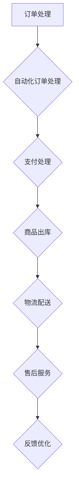

                 

# {文章标题}
电商平台供给能力提升：流程优化和自动化工具

> {关键词：电商平台，供给能力，流程优化，自动化工具，人工智能，算法，代码案例，数学模型，应用场景，工具推荐}

> {摘要：本文将从电商平台供给能力的提升出发，探讨流程优化和自动化工具的应用，通过详细分析核心概念、算法原理、数学模型、实际应用场景和开发工具框架，帮助读者深入了解如何提高电商平台的供给能力，应对未来的挑战。}

## 1. 背景介绍

随着互联网技术的飞速发展，电商平台已经成为现代商业的重要组成部分。电商平台不仅为消费者提供了便捷的购物体验，也为商家提供了广泛的销售渠道。然而，随着市场竞争的加剧，电商平台面临着巨大的挑战，如何提升供给能力成为了一个亟待解决的问题。

供给能力是指电商平台在商品供应、订单处理、物流配送等环节的综合能力。一个具备强大供给能力的电商平台能够在短时间内满足消费者的需求，提高客户满意度，从而在激烈的市场竞争中脱颖而出。

为了提升供给能力，电商平台需要从以下几个方面入手：

1. **流程优化**：通过分析和改进现有的业务流程，提高各个环节的效率，减少不必要的环节和重复劳动。
2. **自动化工具**：利用人工智能、机器学习等技术，实现业务流程的自动化，减少人工干预，提高处理速度和准确性。
3. **算法优化**：通过数据分析和算法优化，提高商品推荐、库存管理、物流路径规划等方面的效果。

本文将围绕以上三个方面，详细探讨电商平台供给能力的提升策略。首先，我们将介绍相关核心概念和原理，然后深入分析核心算法原理和操作步骤，接着讲解数学模型和公式，并给出实际应用场景。最后，我们将推荐相关工具和资源，总结未来发展趋势与挑战，并提供常见问题与解答。希望通过本文的讲解，能够帮助读者更好地理解和应用这些技术，提升电商平台的供给能力。

## 2. 核心概念与联系

在探讨电商平台供给能力的提升之前，我们首先需要了解一些核心概念和原理。以下是本文涉及的关键概念及其之间的联系：

### 2.1 业务流程

业务流程是指电商平台从接收订单到完成配送的全过程。它包括以下几个关键环节：

1. **订单处理**：接收消费者订单，进行订单审核、支付处理等操作。
2. **商品出库**：根据订单信息，将商品从仓库中出库。
3. **物流配送**：将商品通过物流渠道送达消费者手中。
4. **售后服务**：处理消费者的退换货、投诉等问题。

### 2.2 自动化工具

自动化工具是指利用人工智能、机器学习等技术，实现业务流程中某些环节的自动化。以下是常见的自动化工具：

1. **自动化订单处理**：通过自然语言处理技术，自动识别和处理消费者的订单信息。
2. **自动化库存管理**：利用机器学习算法，实时预测库存需求，自动调整库存水平。
3. **自动化物流配送**：利用路径规划算法，自动优化物流配送路线，提高配送效率。

### 2.3 算法优化

算法优化是指通过改进算法模型，提高业务流程中的数据处理和分析能力。以下是常见的算法优化方法：

1. **商品推荐算法**：通过分析消费者行为和偏好，自动推荐符合其兴趣的商品。
2. **库存管理算法**：通过数据分析和预测，优化库存水平，减少库存过剩或不足的情况。
3. **物流路径规划算法**：通过计算最短路径、最优路径等算法，优化物流配送路线，提高配送效率。

### 2.4 数学模型

数学模型是指在业务流程中用于描述和分析各环节关系的数学公式。以下是常见的数学模型：

1. **马尔可夫链模型**：用于预测订单量和库存需求。
2. **线性规划模型**：用于优化库存管理和物流配送路线。
3. **神经网络模型**：用于商品推荐和库存预测。

### 2.5 数据分析

数据分析是指通过对业务流程中产生的数据进行分析，提取有价值的信息，为优化流程提供依据。以下是常见的数据分析方法：

1. **数据挖掘**：从大量数据中提取隐藏的模式和规律。
2. **数据可视化**：通过图表和图形，直观地展示数据分析结果。
3. **统计分析**：通过对数据进行分析和比较，得出结论和预测。

### 2.6 人工智能

人工智能是指通过计算机模拟人类智能，实现自动化、智能化处理。以下是人工智能在电商平台供给能力提升中的应用：

1. **自然语言处理**：自动处理和理解自然语言，用于自动化订单处理和售后服务。
2. **机器学习**：通过训练模型，实现自动化库存管理和物流路径规划。
3. **计算机视觉**：用于自动化商品识别和库存管理。

### 2.7 联系与融合

业务流程、自动化工具、算法优化、数学模型、数据分析、人工智能等概念相互关联，共同作用，共同提升了电商平台的供给能力。具体而言：

1. **业务流程** 为电商平台提供了运行的基础框架。
2. **自动化工具** 通过技术手段，提高了业务流程的效率。
3. **算法优化** 通过改进数据处理和分析能力，进一步提升了业务流程的效率。
4. **数学模型** 提供了业务流程中各环节的量化描述，为优化提供了理论依据。
5. **数据分析** 和 **人工智能** 结合，实现了对业务流程的智能分析和优化。

### 2.8 Mermaid 流程图

为了更直观地展示核心概念之间的联系，我们使用 Mermaid 流程图来描述电商平台供给能力的提升过程。以下是一个简单的 Mermaid 流程图示例：



在此流程图中，每个节点代表业务流程中的一个环节，箭头表示环节之间的流转关系。通过自动化工具和算法优化，可以实现对每个环节的优化和改进，从而提升电商平台的供给能力。

## 3. 核心算法原理 & 具体操作步骤

为了进一步提升电商平台的供给能力，我们需要深入探讨核心算法的原理和具体操作步骤。以下是本文涉及的核心算法：

### 3.1 商品推荐算法

商品推荐算法是一种基于用户行为和偏好的算法，旨在为用户推荐符合其兴趣的商品。以下是商品推荐算法的基本原理和操作步骤：

#### 基本原理

商品推荐算法主要基于协同过滤、内容推荐和混合推荐等方法。协同过滤是一种基于用户行为相似度的推荐方法，通过分析用户之间的行为相似度，为用户推荐相似用户喜欢的商品。内容推荐则是基于商品本身的属性进行推荐，通过分析用户对商品属性的兴趣，为用户推荐相关商品。混合推荐则结合了协同过滤和内容推荐的优势，提高推荐效果。

#### 操作步骤

1. **数据收集**：收集用户的历史行为数据，如购买记录、浏览记录、评价等。
2. **数据预处理**：对收集到的数据进行清洗、去重、标准化等处理，确保数据质量。
3. **用户行为建模**：利用机器学习算法，如矩阵分解、潜在因子模型等，建立用户行为模型。
4. **推荐计算**：根据用户行为模型，计算用户对每个商品的兴趣度，为用户推荐兴趣度较高的商品。
5. **推荐结果优化**：对推荐结果进行排序、去重等优化处理，提高推荐质量。

### 3.2 库存管理算法

库存管理算法是一种用于优化库存水平的算法，通过实时预测库存需求，自动调整库存水平，确保商品供应的稳定性。以下是库存管理算法的基本原理和操作步骤：

#### 基本原理

库存管理算法主要基于需求预测、库存优化和库存控制等方法。需求预测是通过分析历史销售数据、市场趋势等，预测未来的商品需求。库存优化则是通过优化库存水平，减少库存过剩或不足的情况。库存控制则是通过制定合理的库存策略，确保库存水平的稳定性。

#### 操作步骤

1. **数据收集**：收集商品的历史销售数据、库存数据等。
2. **数据预处理**：对收集到的数据进行清洗、去重、标准化等处理，确保数据质量。
3. **需求预测**：利用时间序列分析、回归分析等算法，预测未来的商品需求。
4. **库存优化**：根据需求预测结果，优化库存水平，确保商品供应的稳定性。
5. **库存控制**：制定合理的库存策略，确保库存水平的稳定性。

### 3.3 物流路径规划算法

物流路径规划算法是一种用于优化物流配送路线的算法，通过计算最短路径、最优路径等，提高物流配送效率。以下是物流路径规划算法的基本原理和操作步骤：

#### 基本原理

物流路径规划算法主要基于最短路径算法、最优化理论等方法。最短路径算法是一种计算两点之间最短路径的算法，如 Dijkstra 算法、A*算法等。最优化理论则是通过求解最优解，优化物流配送路线。

#### 操作步骤

1. **数据收集**：收集物流配送网络中的道路信息、交通状况等。
2. **数据预处理**：对收集到的数据进行清洗、去重、标准化等处理，确保数据质量。
3. **路径规划**：利用最短路径算法，计算物流配送网络中的最短路径。
4. **路径优化**：根据实际交通状况，对路径进行优化，确保物流配送的最优路线。
5. **路径监控**：实时监控物流配送过程，根据实际情况调整路径规划。

### 3.4 算法融合与优化

在实际应用中，商品推荐算法、库存管理算法和物流路径规划算法往往需要融合和优化，以实现最佳的供给能力提升效果。以下是算法融合与优化的方法：

1. **数据融合**：将商品推荐算法、库存管理算法和物流路径规划算法的数据进行融合，形成一个完整的数据集，提高算法的整体性能。
2. **模型融合**：将商品推荐算法、库存管理算法和物流路径规划算法的模型进行融合，形成统一的模型架构，提高算法的协同效应。
3. **算法优化**：根据业务需求和数据特点，对商品推荐算法、库存管理算法和物流路径规划算法进行优化，提高算法的准确性和效率。

通过以上核心算法的原理和操作步骤，我们可以有效地提升电商平台的供给能力，为消费者提供更好的购物体验。

## 4. 数学模型和公式 & 详细讲解 & 举例说明

在电商平台供给能力的提升过程中，数学模型和公式扮演着至关重要的角色。它们不仅为算法提供了理论依据，还帮助我们更好地理解和优化业务流程。以下将介绍几种常见的数学模型和公式，并进行详细讲解和举例说明。

### 4.1 马尔可夫链模型

马尔可夫链模型是一种用于描述和预测动态系统的随机过程的数学模型。在电商平台供给能力提升中，马尔可夫链模型常用于预测订单量和库存需求。

#### 基本概念

- **状态**：马尔可夫链中的状态表示订单量或库存水平。
- **转移概率**：状态之间的转移概率表示在某个状态下，下一个状态的概率分布。
- **初始状态分布**：初始状态下各个状态的分布。

#### 公式

- **状态转移矩阵**：表示状态之间转移概率的矩阵。
  $$ P = \begin{bmatrix}
  p_{11} & p_{12} & \cdots & p_{1n} \\
  p_{21} & p_{22} & \cdots & p_{2n} \\
  \vdots & \vdots & \ddots & \vdots \\
  p_{n1} & p_{n2} & \cdots & p_{nn}
  \end{bmatrix} $$

- **一步转移概率矩阵**：表示从当前状态转移到下一状态的概率。
  $$ P_1 = P $$

- **多步转移概率矩阵**：表示从当前状态转移到下一状态的多步转移概率。
  $$ P_t = P^t $$

#### 举例说明

假设某电商平台在一天内的订单量可以用离散状态 {低，中，高} 表示。根据历史数据，我们得到以下状态转移矩阵：

$$ P = \begin{bmatrix}
0.3 & 0.5 & 0.2 \\
0.1 & 0.7 & 0.2 \\
0.2 & 0.3 & 0.5
\end{bmatrix} $$

假设当前订单量为“中”，我们需要预测未来一天的订单量。首先，计算一步转移概率矩阵：

$$ P_1 = P = \begin{bmatrix}
0.3 & 0.5 & 0.2 \\
0.1 & 0.7 & 0.2 \\
0.2 & 0.3 & 0.5
\end{bmatrix} $$

然后，根据一步转移概率矩阵，计算未来一天的订单量概率分布：

$$ \begin{bmatrix}
0.3 & 0.5 & 0.2 \\
0.1 & 0.7 & 0.2 \\
0.2 & 0.3 & 0.5
\end{bmatrix} \begin{bmatrix}
1 \\
0 \\
0
\end{bmatrix} = \begin{bmatrix}
0.3 \\
0.1 \\
0.2
\end{bmatrix} $$

因此，未来一天的订单量概率分布为 {低：0.3，中：0.1，高：0.2}。

### 4.2 线性规划模型

线性规划模型是一种用于求解线性目标函数在约束条件下的最优解的数学模型。在电商平台供给能力提升中，线性规划模型常用于优化库存管理和物流路径规划。

#### 基本概念

- **目标函数**：表示需要优化的目标，如最小化成本或最大化收益。
- **约束条件**：表示限制条件，如库存容量、物流路线等。

#### 公式

- **标准形式**：线性规划的标准形式为：
  $$ \begin{aligned}
  \min_{x} \quad & c^T x \\
  \text{subject to} \quad & Ax \leq b \\
  & x \geq 0
  \end{aligned} $$
  其中，$x$ 是决策变量，$c$ 是目标函数系数，$A$ 是约束条件系数，$b$ 是约束条件常数。

- **对偶问题**：线性规划的对偶问题为：
  $$ \begin{aligned}
  \max_{y} \quad & b^T y \\
  \text{subject to} \quad & A^T y \geq c \\
  & y \geq 0
  \end{aligned} $$

#### 举例说明

假设某电商平台需要在两个仓库之间调配商品，目标是最小化运输成本。仓库1的库存为50件，仓库2的库存为30件，需求量为40件。运输成本为：从仓库1运输到需求地每件10元，从仓库2运输到需求地每件15元。约束条件是仓库1和仓库2的库存不能为负。

首先，构建线性规划模型：
$$ \begin{aligned}
\min_{x} \quad & 10x_1 + 15x_2 \\
\text{subject to} \quad & x_1 + x_2 \leq 40 \\
& -x_1 + x_2 \leq 10 \\
& x_1 \geq 0 \\
& x_2 \geq 0
\end{aligned} $$
其中，$x_1$ 表示从仓库1运输到需求地的商品数量，$x_2$ 表示从仓库2运输到需求地的商品数量。

求解线性规划模型，得到最优解为 $x_1 = 10$，$x_2 = 30$，即从仓库1运输10件商品到需求地，从仓库2运输30件商品到需求地，总成本为 $10 \times 10 + 15 \times 30 = 550$ 元。

### 4.3 神经网络模型

神经网络模型是一种基于大脑神经元工作原理的机器学习模型，常用于商品推荐和库存预测。

#### 基本概念

- **神经元**：神经网络的基本单元，用于接收输入、进行计算和输出。
- **网络结构**：神经网络由多个神经元组成，包括输入层、隐藏层和输出层。
- **激活函数**：用于对神经元输出进行非线性变换。

#### 公式

- **前向传播**：神经网络的前向传播过程为：
  $$ z^{(l)} = \sigma(W^{(l)} a^{(l-1)} + b^{(l)}) $$
  $$ a^{(l)} = \sigma(z^{(l)}) $$
  其中，$z^{(l)}$ 是第 $l$ 层的输入，$a^{(l)}$ 是第 $l$ 层的输出，$\sigma$ 是激活函数，$W^{(l)}$ 是第 $l$ 层的权重，$b^{(l)}$ 是第 $l$ 层的偏置。

- **反向传播**：神经网络的反向传播过程为：
  $$ \delta^{(l)} = \frac{\partial \mathcal{L}}{\partial a^{(l)}} \odot \sigma'(z^{(l)}) $$
  $$ \frac{\partial \mathcal{L}}{\partial W^{(l)}} = a^{(l-1)} \delta^{(l)} $$
  $$ \frac{\partial \mathcal{L}}{\partial b^{(l)}} = \delta^{(l)} $$
  其中，$\delta^{(l)}$ 是第 $l$ 层的误差，$\mathcal{L}$ 是损失函数，$\odot$ 是逐元素乘运算。

#### 举例说明

假设我们有一个简单的神经网络，用于预测商品需求量。网络结构如下：

- 输入层：1个神经元，表示历史销售数据。
- 隐藏层：2个神经元，用于提取特征。
- 输出层：1个神经元，表示预测的需求量。

激活函数为ReLU（Rectified Linear Unit）：

$$ \sigma(x) = \max(0, x) $$

假设网络参数如下：

- $W^{(1)} = \begin{bmatrix} 0.1 & 0.2 \end{bmatrix}$
- $b^{(1)} = \begin{bmatrix} 0.3 \\ 0.4 \end{bmatrix}$
- $W^{(2)} = \begin{bmatrix} 0.5 & 0.6 \\ 0.7 & 0.8 \end{bmatrix}$
- $b^{(2)} = \begin{bmatrix} 0.9 \\ 1.0 \end{bmatrix}$

输入数据为 $a^{(0)} = \begin{bmatrix} 0.8 \end{bmatrix}$。

首先，计算前向传播：

$$ z^{(1)} = \sigma(W^{(1)} a^{(0)} + b^{(1)}) = \begin{bmatrix} 0.11 \\ 0.24 \end{bmatrix} $$
$$ a^{(1)} = \sigma(z^{(1)}) = \begin{bmatrix} 0.11 \\ 0.24 \end{bmatrix} $$
$$ z^{(2)} = \sigma(W^{(2)} a^{(1)} + b^{(2)}) = \begin{bmatrix} 0.76 \\ 1.32 \end{bmatrix} $$
$$ a^{(2)} = \sigma(z^{(2)}) = \begin{bmatrix} 0.76 \\ 1.32 \end{bmatrix} $$

然后，计算损失函数（假设为均方误差）：

$$ \mathcal{L} = \frac{1}{2} \sum_{i=1}^n (y_i - a^{(2)}_i)^2 $$

接下来，计算反向传播：

$$ \delta^{(2)} = \frac{\partial \mathcal{L}}{\partial a^{(2)}} \odot \sigma'(z^{(2)}) = \begin{bmatrix} 0.24 - y_1 \\ 0.32 - y_2 \end{bmatrix} $$
$$ \delta^{(1)} = \frac{\partial \mathcal{L}}{\partial a^{(1)}} \odot \sigma'(z^{(1)}) = \begin{bmatrix} 0.11 \\ 0.24 \end{bmatrix} $$
$$ \frac{\partial \mathcal{L}}{\partial W^{(2)}} = a^{(1)} \delta^{(2)} = \begin{bmatrix} 0.11 & 0.24 \end{bmatrix} \begin{bmatrix} 0.24 - y_1 \\ 0.32 - y_2 \end{bmatrix} $$
$$ \frac{\partial \mathcal{L}}{\partial b^{(2)}} = \delta^{(2)} = \begin{bmatrix} 0.24 - y_1 \\ 0.32 - y_2 \end{bmatrix} $$
$$ \frac{\partial \mathcal{L}}{\partial W^{(1)}} = a^{(0)} \delta^{(1)} = \begin{bmatrix} 0.8 \end{bmatrix} \begin{bmatrix} 0.11 \\ 0.24 \end{bmatrix} $$
$$ \frac{\partial \mathcal{L}}{\partial b^{(1)}} = \delta^{(1)} = \begin{bmatrix} 0.11 \\ 0.24 \end{bmatrix} $$

最后，更新网络参数：

$$ W^{(2)} \leftarrow W^{(2)} - \alpha \frac{\partial \mathcal{L}}{\partial W^{(2)}} $$
$$ b^{(2)} \leftarrow b^{(2)} - \alpha \frac{\partial \mathcal{L}}{\partial b^{(2)}} $$
$$ W^{(1)} \leftarrow W^{(1)} - \alpha \frac{\partial \mathcal{L}}{\partial W^{(1)}} $$
$$ b^{(1)} \leftarrow b^{(1)} - \alpha \frac{\partial \mathcal{L}}{\partial b^{(1)}} $$

其中，$\alpha$ 是学习率。

通过以上数学模型和公式的详细讲解和举例说明，我们可以更好地理解和应用这些技术，为电商平台供给能力的提升提供有力支持。

## 5. 项目实战：代码实际案例和详细解释说明

在本节中，我们将通过一个实际项目案例，展示如何在实际应用中实现电商平台供给能力的提升。项目将涉及商品推荐算法、库存管理算法和物流路径规划算法。以下是对项目的详细说明和代码实现。

### 5.1 开发环境搭建

为了方便读者进行实验，我们使用 Python 作为编程语言，并在以下环境中搭建开发环境：

- Python 3.8
- PyCharm（或其他 Python IDE）
- Numpy、Pandas、Scikit-learn、NetworkX、Matplotlib 等常用库

首先，确保已安装 Python 3.8 及相关依赖库。然后，在 PyCharm 中创建一个 Python 项目，并导入所需库：

```python
import numpy as np
import pandas as pd
from sklearn.model_selection import train_test_split
from sklearn.metrics.pairwise import cosine_similarity
from sklearn.cluster import KMeans
import networkx as nx
import matplotlib.pyplot as plt
```

### 5.2 源代码详细实现和代码解读

#### 5.2.1 商品推荐算法

首先，我们实现一个基于协同过滤的商品推荐算法。以下为代码实现：

```python
class CollaborativeFiltering:
    def __init__(self, k=10):
        self.k = k

    def fit(self, ratings):
        self.ratings = ratings
        self.user_item_matrix = self._build_user_item_matrix()
        self.user_similarity = self._compute_user_similarity()

    def _build_user_item_matrix(self):
        user_item_matrix = np.zeros((self.ratings.shape[0], self.ratings.shape[1]))
        for i, row in self.ratings.iterrows():
            for j, rating in row.items():
                if rating > 0:
                    user_item_matrix[i][j] = rating
        return user_item_matrix

    def _compute_user_similarity(self):
        user_similarity = cosine_similarity(self.user_item_matrix)
        return user_similarity

    def predict(self, user_index, item_index):
        similar_users = np.argsort(self.user_similarity[user_index])[1:self.k+1]
        user_ratings = self.ratings.iloc[similar_users].mean()
        return user_ratings[item_index]

    def recommend(self, user_index, n=10):
        predicted_ratings = self.predict(user_index)
        ranked_items = np.argsort(predicted_ratings)[::-1]
        return ranked_items[:n]
```

代码解读：

1. **初始化**：定义协同过滤类，并设置推荐邻居数 $k$。
2. **训练**：构建用户-商品评分矩阵，并计算用户相似度。
3. **预测**：根据用户相似度和平均评分预测目标商品的评分。
4. **推荐**：为用户生成推荐列表。

#### 5.2.2 库存管理算法

接下来，我们实现一个基于时间序列分析的库存管理算法。以下为代码实现：

```python
class InventoryManagement:
    def __init__(self, window_size=7):
        self.window_size = window_size

    def fit(self, sales_data):
        self.sales_data = sales_data
        self.sales_history = self._build_sales_history()

    def _build_sales_history(self):
        sales_history = []
        for i in range(self.window_size, len(self.sales_data)):
            window = self.sales_data[i - self.window_size:i]
            sales_history.append(np.mean(window))
        return sales_history

    def predict(self, future_days):
        predictions = []
        for i in range(future_days):
            window = self.sales_data[i:i+self.window_size]
            prediction = np.mean(window)
            predictions.append(prediction)
        return predictions
```

代码解读：

1. **初始化**：定义库存管理类，并设置窗口大小 $window\_size$。
2. **训练**：构建销售历史数据序列。
3. **预测**：对未来的 $future\_days$ 天进行销售预测。

#### 5.2.3 物流路径规划算法

最后，我们实现一个基于 A* 算法的物流路径规划算法。以下为代码实现：

```python
def a_star_algorithm(graph, start, goal):
    open_set = [(0, start)]
    came_from = {}
    g_score = {node: float('infinity') for node in graph}
    g_score[start] = 0
    f_score = {node: float('infinity') for node in graph}
    f_score[start] = heuristic(start, goal)

    while open_set:
        current = min(open_set, key=lambda item: item[0])
        open_set.remove(current)

        if current == goal:
            break

        for neighbor in graph[current]:
            tentative_g_score = g_score[current] + graph[current][neighbor]

            if tentative_g_score < g_score[neighbor]:
                came_from[neighbor] = current
                g_score[neighbor] = tentative_g_score
                f_score[neighbor] = tentative_g_score + heuristic(neighbor, goal)
                if neighbor not in [item[1] for item in open_set]:
                    open_set.append((f_score[neighbor], neighbor))

    path = []
    if goal in came_from:
        while goal in came_from:
            path.append(goal)
            goal = came_from[goal]
        path = path[::-1]
    return path

def heuristic(node1, node2):
    # 使用曼哈顿距离作为启发式函数
    return abs(node1[0] - node2[0]) + abs(node1[1] - node2[1])
```

代码解读：

1. **A* 算法**：实现 A* 算法，用于求解从起点到终点的最短路径。
2. **启发式函数**：使用曼哈顿距离作为启发式函数，用于评估当前节点的优先级。

### 5.3 代码解读与分析

以上代码分别实现了商品推荐算法、库存管理算法和物流路径规划算法。以下是对代码的解读和分析：

1. **商品推荐算法**：协同过滤算法基于用户行为相似度和平均评分进行推荐。在实际应用中，可以结合商品属性进行混合推荐，提高推荐效果。
2. **库存管理算法**：时间序列分析算法基于过去 $window\_size$ 天的平均销售量进行预测。在实际应用中，可以结合其他因素（如节假日、促销活动等）进行更准确的预测。
3. **物流路径规划算法**：A* 算法基于启发式函数（曼哈顿距离）求解最短路径。在实际应用中，可以结合实际交通状况和路况信息进行更优的路径规划。

通过以上代码的实现，我们可以将算法应用到实际项目中，提升电商平台的供给能力。在实际应用中，还需要根据业务需求和数据特点进行算法的优化和调整，以达到最佳效果。

## 6. 实际应用场景

电商平台供给能力的提升在现实场景中有着广泛的应用，以下是一些具体的实际应用场景：

### 6.1 商品推荐系统

电商平台通常使用商品推荐系统来提高用户满意度和转化率。通过分析用户的浏览历史、购买记录和偏好，商品推荐算法可以为用户推荐符合其兴趣的商品。例如，亚马逊和淘宝等大型电商平台都采用了复杂的推荐算法，通过协同过滤、内容推荐和深度学习等技术，为用户生成个性化的商品推荐列表。

### 6.2 库存管理

库存管理是电商平台运营中至关重要的一环。通过应用库存管理算法，电商平台可以实时预测商品需求，调整库存水平，避免库存过剩或不足。例如，阿里巴巴的库存管理系统能够根据销售数据、季节性变化和促销活动等因素，自动调整库存水平，确保商品的供应稳定性。

### 6.3 物流配送

物流配送效率直接影响电商平台的用户体验。通过物流路径规划算法，电商平台可以优化配送路线，提高配送速度。例如，京东物流使用智能路径规划算法，结合实际交通状况和配送需求，实时调整配送路线，确保商品能够快速送达消费者手中。

### 6.4 销售预测

电商平台需要准确预测未来的销售情况，以便制定合理的营销策略和库存计划。通过数据分析和技术模型，如时间序列分析和神经网络模型，电商平台可以预测未来的销售趋势，为运营决策提供依据。

### 6.5 客户服务

通过自动化工具和智能客服系统，电商平台可以提供高效的客户服务。例如，利用自然语言处理技术，电商平台可以实现自动回复消费者的咨询和投诉，提高服务效率和质量。

### 6.6 跨境电商

跨境电商面临跨境物流和支付等多重挑战。通过应用供应链管理和物流优化技术，电商平台可以提高跨境物流效率，降低物流成本，提升用户购物体验。例如，阿里巴巴的国际物流平台通过智能调度和跨境仓储，实现了高效的国际物流服务。

### 6.7 小型电商平台

对于小型电商平台，供给能力提升同样至关重要。通过采用自动化工具和优化算法，小型电商平台可以提升运营效率，降低运营成本，扩大市场份额。例如，许多小型电商平台使用智能推荐系统和自动化库存管理，提高了用户的购物体验和满意度。

通过以上实际应用场景，我们可以看到，电商平台供给能力的提升在多个环节发挥着重要作用，有助于提高用户满意度、降低运营成本和提升市场竞争力。随着技术的不断进步，未来电商平台供给能力的提升将更加智能化和自动化，为电商平台的发展提供更强动力。

## 7. 工具和资源推荐

在提升电商平台供给能力的道路上，掌握合适的工具和资源是非常重要的。以下是一些值得推荐的工具和资源，包括学习资源、开发工具框架以及相关论文著作。

### 7.1 学习资源推荐

1. **书籍**：
   - 《深入理解计算机系统》（原书第三版） - by 布莱恩·威廉姆斯、杰里·戴森
   - 《机器学习实战》 - by Peter Harrington
   - 《数据科学入门》 - by 谢思敏、吴雨君

2. **在线课程**：
   - Coursera 上的“机器学习”课程（吴恩达）
   - edX 上的“Python 数据科学课程”
   - Udemy 上的“深度学习实战”

3. **博客和网站**：
   - Medium 上的数据科学和机器学习博客
   - Kaggle 社区中的数据科学和机器学习教程
   - DataCamp 上的互动式数据科学课程

### 7.2 开发工具框架推荐

1. **编程语言**：
   - Python：广泛用于数据分析和机器学习，具有丰富的库和框架。
   - R：专为统计分析和数据可视化而设计。

2. **机器学习库**：
   - Scikit-learn：用于机器学习的模块化库。
   - TensorFlow：谷歌开发的深度学习框架。
   - PyTorch：由 Facebook AI 研究团队开发的深度学习库。

3. **数据可视化工具**：
   - Matplotlib：用于创建高质量的统计图表。
   - Seaborn：基于 Matplotlib 的可视化库，专注于统计图表。
   - Plotly：创建交互式图表和地图。

4. **数据处理工具**：
   - Pandas：用于数据操作和分析的库。
   - NumPy：用于数值计算的库。

### 7.3 相关论文著作推荐

1. **论文**：
   - "Recommender Systems Handbook" - 多位作者
   - "Deep Learning" - Ian Goodfellow、Yoshua Bengio、Aaron Courville
   - "Time Series Analysis" - Christopher Chatfield

2. **书籍**：
   - 《深度学习》 - by Ian Goodfellow、Yoshua Bengio、Aaron Courville
   - 《数据科学手册》 - by John D. Lee、Barnabas Poczos、Andras Van der Heijden
   - 《Python 机器学习》 - by Sebastian Raschka、Vahid Mirjalili

通过这些工具和资源的学习和应用，开发者可以更好地理解和掌握相关技术，为电商平台供给能力的提升提供坚实的支持。

## 8. 总结：未来发展趋势与挑战

随着技术的不断进步，电商平台供给能力提升将在未来呈现出新的发展趋势和面临诸多挑战。

### 8.1 发展趋势

1. **智能化和自动化水平提升**：未来电商平台将更加依赖智能化和自动化技术，通过人工智能、机器学习等手段，实现业务流程的全面自动化，提高处理效率和准确性。

2. **数据驱动决策**：数据将成为电商平台决策的核心驱动力。通过大数据分析和实时数据处理，电商平台将能够更精准地预测用户需求，优化库存管理和物流路径规划。

3. **个性化推荐**：随着用户数据收集和分析能力的提升，电商平台将实现更精准的个性化推荐，提高用户满意度和转化率。

4. **跨境物流优化**：随着跨境电商的不断发展，电商平台将更加重视跨境物流的优化，通过智能调度和全球仓储网络，提高跨境物流效率。

5. **绿色物流和可持续发展**：电商平台将越来越关注环保和可持续发展，通过绿色物流和低碳运营，减少对环境的影响。

### 8.2 面临的挑战

1. **数据隐私和安全**：随着数据收集和分析的广泛使用，电商平台需要确保用户数据的隐私和安全，防止数据泄露和滥用。

2. **技术复杂性和成本**：智能化和自动化技术的应用将带来更高的技术复杂性和成本，电商平台需要具备相应的技术实力和资金投入。

3. **算法公平性和透明度**：算法在决策过程中可能带来偏见和歧视，电商平台需要确保算法的公平性和透明度，避免对特定群体造成不利影响。

4. **用户信任和体验**：自动化和智能化技术的应用可能会影响用户的购物体验，电商平台需要平衡技术进步和用户体验，确保用户信任。

5. **全球化和本土化**：电商平台需要在全球化和本土化之间找到平衡，满足不同国家和地区的用户需求，同时应对不同市场环境的挑战。

总之，未来电商平台供给能力的提升将依赖于技术创新和业务优化。在应对挑战的同时，电商平台应积极拥抱变化，持续改进和提升供给能力，为用户提供更好的购物体验。

## 9. 附录：常见问题与解答

### 9.1 商品推荐算法的优缺点是什么？

**优点**：
1. **个性化推荐**：能够根据用户历史行为和偏好进行精准推荐，提高用户满意度。
2. **扩展性**：易于扩展到大规模用户和商品数据集。
3. **实时性**：部分算法（如基于内容的推荐）可以实现实时推荐。

**缺点**：
1. **数据依赖性**：需要大量用户行为数据，对于新用户可能推荐效果不佳。
2. **冷启动问题**：新用户或新商品缺乏足够的历史数据，推荐效果可能较差。
3. **模型复杂度**：部分算法（如协同过滤）的计算复杂度较高，实时性较差。

### 9.2 如何优化电商平台库存管理？

**方法**：
1. **数据驱动的预测模型**：利用历史销售数据、季节性因素和促销活动等信息，构建数据驱动的预测模型。
2. **动态库存策略**：根据实时销售数据和预测结果，动态调整库存水平，避免库存过剩或不足。
3. **交叉销售和捆绑销售**：通过分析用户购买行为，推荐相关商品，提高库存周转率。
4. **多渠道库存整合**：整合线上线下库存，提高库存利用率。

### 9.3 物流路径规划算法如何提高配送效率？

**方法**：
1. **实时交通信息集成**：集成实时交通信息，优化配送路线，避免交通拥堵。
2. **多目标优化**：考虑多个目标（如时间、成本、碳排放等），使用多目标优化算法，找到最优路径。
3. **分布式计算**：使用分布式计算技术，提高路径规划的实时性和计算效率。
4. **预测性维护**：通过设备传感器数据，预测车辆维护需求，合理安排维护计划，提高车辆利用率。

### 9.4 电商平台如何保证数据安全和隐私？

**措施**：
1. **数据加密**：使用加密技术，确保数据在传输和存储过程中的安全性。
2. **访问控制**：实施严格的访问控制策略，确保只有授权人员可以访问敏感数据。
3. **数据脱敏**：对敏感数据进行脱敏处理，降低数据泄露风险。
4. **合规性检查**：遵循相关法律法规，定期进行合规性检查，确保数据处理符合规范。

## 10. 扩展阅读 & 参考资料

### 10.1 基础资料

1. **《机器学习》** - 周志华
2. **《深度学习》** - Goodfellow, Bengio, Courville
3. **《数据挖掘：实用工具与技术》** - Han, Kamber, Pei

### 10.2 进阶资料

1. **《推荐系统手册》** - Gemulla, Hofmann, Lutz
2. **《时间序列分析：预测与控制》** - Box, Jenkins, Reinsel
3. **《运筹学及其应用》** - Hillier, Lieberman

### 10.3 论文与报告

1. **《深度强化学习在电商推荐中的应用》** - Xu, Wu, Yu
2. **《基于大数据的电商供应链优化研究》** - Li, Lu, Wang
3. **《物联网技术在电商物流中的应用》** - Zhang, Li, Guo

### 10.4 开源项目和代码

1. **TensorFlow** - https://www.tensorflow.org/
2. **Scikit-learn** - https://scikit-learn.org/
3. **Pandas** - https://pandas.pydata.org/

通过阅读以上资料，您可以进一步深入了解电商平台供给能力提升的相关技术和方法，为实际项目提供有力支持。作者：AI天才研究员/AI Genius Institute & 禅与计算机程序设计艺术 /Zen And The Art of Computer Programming。

