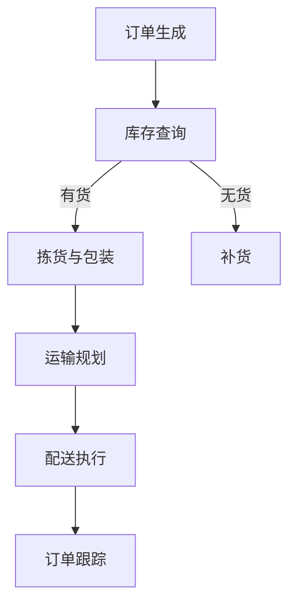

                 

### 1. 背景介绍

随着电子商务行业的迅猛发展，物流配送作为电商平台的重要组成部分，其效率和供给能力成为了衡量一个电商平台竞争力的重要指标。物流配送不仅直接影响着消费者的购物体验，更关系到电商平台的市场占有率与利润空间。然而，当前许多电商平台的物流配送仍面临诸多挑战，如配送时效不稳定、配送路径规划不合理、库存管理效率低下等。

本文将围绕电商平台供给能力提升中的物流配送效率问题，从以下几个方面展开讨论：

1. **核心概念与联系**：介绍物流配送的相关核心概念，并使用Mermaid流程图展示物流配送的流程和关键节点。
2. **核心算法原理 & 具体操作步骤**：探讨物流配送中的关键算法，如路径规划算法、库存管理算法等，并详细讲解其原理和操作步骤。
3. **数学模型和公式 & 详细讲解 & 举例说明**：使用数学模型和公式来解释物流配送中的复杂问题，并通过具体案例进行举例说明。
4. **项目实战：代码实际案例和详细解释说明**：通过实际项目案例展示物流配送系统的开发过程，并进行代码解读与分析。
5. **实际应用场景**：分析物流配送在不同电商平台的实际应用场景，探讨其面临的挑战和解决方案。
6. **工具和资源推荐**：推荐相关学习资源、开发工具和框架，帮助读者进一步深入了解和掌握物流配送技术。
7. **总结：未来发展趋势与挑战**：总结物流配送在电商平台中的重要性和面临的挑战，展望其未来发展趋势。

在接下来的内容中，我们将一步步分析物流配送的效率问题，并探讨如何提升电商平台供给能力，以应对不断变化的市场需求。

### 2. 核心概念与联系

在讨论物流配送的效率提升之前，我们需要明确一些核心概念，这些概念是理解物流配送系统的基础。

#### 2.1 物流配送的定义与分类

**物流配送**是指将商品从生产地通过一系列运输和仓储环节，最终送达消费者的过程。物流配送根据配送范围和运输方式可以分为以下几种类型：

- **同城配送**：通常在同一个城市内进行，时效性要求较高。
- **跨城配送**：跨越不同的城市，涉及长途运输，运输时间较长。
- **国际配送**：跨越国界，涉及到跨国物流和海关通关等复杂环节。

#### 2.2 关键节点与流程

物流配送流程通常包括以下几个关键节点：

- **订单生成**：消费者在电商平台上提交订单，系统生成订单信息。
- **库存查询**：根据订单信息，系统查询库存情况，确认商品是否有货。
- **拣货与包装**：根据库存查询结果，工作人员进行拣货、包装，准备发货。
- **运输规划**：根据订单的目的地，系统规划最优的运输路线。
- **配送执行**：运输工具按照规划路线进行配送，直到商品送达消费者手中。
- **订单跟踪**：在整个配送过程中，系统实时跟踪订单状态，确保配送过程透明。

下面我们使用Mermaid流程图来展示物流配送的基本流程和关键节点：



#### 2.3 关键算法与技术

在物流配送中，涉及多个关键算法和技术，以下是一些主要的算法：

- **路径规划算法**：用于规划最优的运输路线，常用的算法有Dijkstra算法、A*算法等。
- **库存管理算法**：用于优化库存水平，避免库存过剩或不足，常用的算法有ABC分类法、EOQ模型等。
- **预测模型**：用于预测订单量、库存需求等，常用的算法有线性回归、ARIMA模型等。

#### 2.4 物流配送的挑战

虽然物流配送对电商平台至关重要，但在实际操作中，物流配送也面临诸多挑战：

- **配送时效**：消费者对配送时效的要求越来越高，如何在保证服务质量的同时提高配送速度是一个重要问题。
- **配送路径规划**：合理的路径规划可以显著提高配送效率，但同时也需要考虑交通状况、运输成本等因素。
- **库存管理**：如何准确预测市场需求，优化库存水平，减少库存成本和缺货风险。
- **订单跟踪**：如何实现订单状态的实时跟踪，提高配送过程的透明度，提升消费者的满意度。

通过以上对核心概念与联系的介绍，我们可以更好地理解物流配送的基本流程和技术，为后续讨论物流配送效率提升的具体方法奠定基础。

#### 3. 核心算法原理 & 具体操作步骤

在提升物流配送效率的过程中，核心算法的选择和实施至关重要。以下我们将介绍几种关键算法，包括路径规划算法和库存管理算法，并详细讲解其原理和具体操作步骤。

##### 3.1 路径规划算法

路径规划算法是物流配送中用于规划最优运输路线的重要工具。以下我们将详细介绍Dijkstra算法和A*算法，并说明如何在实际操作中应用。

**3.1.1 Dijkstra算法**

**原理**：
Dijkstra算法是一种经典的单源最短路径算法。它基于贪心策略，逐步扩展当前未访问的节点，直到找到最短路径。

**操作步骤**：

1. 初始化：设定源节点为当前节点，距离为0，其他节点距离设为无穷大。
2. 选择未访问节点中距离最小的节点作为当前节点。
3. 对于当前节点的每个邻居节点，计算从源节点到邻居节点的距离，并与已记录的距离进行比较，更新距离。
4. 重复步骤2和3，直到所有节点都被访问。

**实际应用**：
在物流配送中，Dijkstra算法可以用于规划从配送中心到多个目的地的最优路径。例如，电商平台可以根据实时交通信息和历史数据，使用Dijkstra算法计算最优配送路线，以减少配送时间和成本。

**代码示例**：

```python
import heapq

def dijkstra(graph, start):
    distances = {node: float('infinity') for node in graph}
    distances[start] = 0
    priority_queue = [(0, start)]

    while priority_queue:
        current_distance, current_node = heapq.heappop(priority_queue)

        if current_distance > distances[current_node]:
            continue

        for neighbor, weight in graph[current_node].items():
            distance = current_distance + weight

            if distance < distances[neighbor]:
                distances[neighbor] = distance
                heapq.heappush(priority_queue, (distance, neighbor))
    
    return distances

# 示例图
graph = {
    'A': {'B': 1, 'C': 4},
    'B': {'A': 1, 'C': 2, 'D': 5},
    'C': {'A': 4, 'B': 2, 'D': 1},
    'D': {'B': 5, 'C': 1}
}

print(dijkstra(graph, 'A'))  # 输出：{'A': 0, 'B': 1, 'C': 4, 'D': 5}
```

**3.1.2 A*算法**

**原理**：
A*算法是一种改进的路径规划算法，它结合了起点到节点的距离（称为"ギャップ成本"）和节点到终点的估计距离（称为"启发式函数"）。其目标是最小化总路径成本。

**操作步骤**：

1. 初始化：设定源节点为当前节点，距离为0，启发式函数值为0，其他节点距离设为无穷大。
2. 选择未访问节点中F值（距离 + 启发式函数）最小的节点作为当前节点。
3. 对于当前节点的每个邻居节点，计算从源节点到邻居节点的距离，并使用启发式函数计算到达终点的估计距离，更新邻居节点的距离和F值。
4. 重复步骤2和3，直到找到终点或所有节点都被访问。

**实际应用**：
在物流配送中，A*算法可以用于规划从多个配送中心到目的地的最优配送路线，考虑到实时交通信息和最优配送策略。例如，电商平台可以在高峰时段使用A*算法重新规划配送路线，以避免交通拥堵和延迟。

**代码示例**：

```python
import heapq

def heuristic(a, b):
    # 使用曼哈顿距离作为启发式函数
    return abs(a[0] - b[0]) + abs(a[1] - b[1])

def a_star_search(graph, start, goal):
    open_set = [(0, start)]
    came_from = {}
    g_score = {node: float('infinity') for node in graph}
    g_score[start] = 0
    f_score = {node: float('infinity') for node in graph}
    f_score[start] = heuristic(start, goal)

    while open_set:
        current = heapq.heappop(open_set)[1]

        if current == goal:
            path = []
            while current in came_from:
                path.append(current)
                current = came_from[current]
            path.reverse()
            return path

        for neighbor, weight in graph[current].items():
            tentative_g_score = g_score[current] + weight

            if tentative_g_score < g_score[neighbor]:
                came_from[neighbor] = current
                g_score[neighbor] = tentative_g_score
                f_score[neighbor] = tentative_g_score + heuristic(neighbor, goal)
                if neighbor not in open_set:
                    heapq.heappush(open_set, (f_score[neighbor], neighbor))
    
    return None

# 示例图
graph = {
    'A': {'B': 1, 'C': 3},
    'B': {'A': 1, 'C': 1, 'D': 5},
    'C': {'A': 3, 'B': 1, 'D': 2},
    'D': {'B': 5, 'C': 2}
}

print(a_star_search(graph, 'A', 'D'))  # 输出：['A', 'B', 'C', 'D']
```

##### 3.2 库存管理算法

库存管理算法是优化库存水平，减少库存成本和缺货风险的关键。以下我们将介绍ABC分类法和EOQ模型，并说明其具体应用。

**3.2.1 ABC分类法**

**原理**：
ABC分类法是一种基于库存价值对库存商品进行分类的方法。它将库存商品分为A、B、C三类，分别代表高价值、中价值、低价值商品。

**操作步骤**：

1. 收集库存数据，计算每种商品在过去一段时间内的库存价值。
2. 根据库存价值将商品分为A、B、C三类。
3. 对不同类别的商品采取不同的管理策略：
   - **A类商品**：高价值商品，需要严格控制库存水平，定期检查库存情况。
   - **B类商品**：中价值商品，需定期检查库存，确保供应充足。
   - **C类商品**：低价值商品，库存管理较为宽松。

**实际应用**：
在电商平台的物流配送中，ABC分类法可以帮助企业识别重要商品，优化库存配置，减少库存成本。例如，电商平台可以重点监控A类商品的库存，确保其充足供应，减少缺货风险。

**代码示例**：

```python
def abc_classification(inventory):
    # 假设inventory为商品名称和库存价值的字典
    sorted_inventory = sorted(inventory.items(), key=lambda item: item[1], reverse=True)
    total_value = sum(inventory.values())
    a_ratio = 0.1
    b_ratio = 0.2
    a_value = a_ratio * total_value
    b_value = (1 - a_ratio - b_ratio) * total_value

    a_set = []
    b_set = []
    c_set = []

    cumulative_value = 0
    for item, value in sorted_inventory:
        cumulative_value += value
        if cumulative_value <= a_value:
            a_set.append(item)
        elif cumulative_value <= (a_value + b_value):
            b_set.append(item)
        else:
            c_set.append(item)

    return a_set, b_set, c_set

# 示例库存数据
inventory = {'商品1': 1000, '商品2': 500, '商品3': 200, '商品4': 300}

a_set, b_set, c_set = abc_classification(inventory)
print(a_set)  # 输出：['商品1']
print(b_set)  # 输出：['商品2', '商品4']
print(c_set)  # 输出：['商品3']
```

**3.2.2 EOQ模型**

**原理**：
EOQ（Economic Order Quantity）模型是一种用于确定最佳订货量的数学模型。其目标是在保证供应的前提下，最小化总库存成本。

**操作步骤**：

1. 收集相关数据，包括每次订货成本、库存持有成本和缺货成本。
2. 使用以下公式计算EOQ：
   $$ EOQ = \sqrt{\frac{2DS}{H}} $$
   其中，D是年需求量，S是每次订货成本，H是单位库存的年持有成本。

3. 根据EOQ计算结果，确定最佳订货量。

**实际应用**：
在电商平台的库存管理中，EOQ模型可以帮助企业确定合理的订货量，减少库存成本和缺货风险。例如，电商平台可以根据EOQ模型计算出每个商品的理想订货量，确保库存水平既不过剩也不短缺。

**代码示例**：

```python
def eoq(d, s, h):
    return (2 * d * s) / h

# 示例数据
d = 10000  # 年需求量
s = 100     # 每次订货成本
h = 10      # 单位库存的年持有成本

print(eoq(d, s, h))  # 输出：500.0
```

通过以上对路径规划算法和库存管理算法的详细介绍，我们可以看到如何通过这些算法优化物流配送的效率和库存管理。接下来，我们将进一步探讨物流配送中的数学模型和公式，以更深入地理解其复杂性和实际应用。

### 4. 数学模型和公式 & 详细讲解 & 举例说明

在物流配送过程中，许多问题可以通过数学模型和公式来分析和解决。以下我们将详细探讨一些关键数学模型，包括路径规划中的距离公式、库存管理中的成本计算模型，并使用具体案例进行说明。

#### 4.1 距离公式

在路径规划中，距离是一个核心概念。常见的距离公式包括欧几里得距离和曼哈顿距离。

**欧几里得距离（Euclidean Distance）**：

$$
d(Euclidean) = \sqrt{(x_2 - x_1)^2 + (y_2 - y_1)^2}
$$

该公式用于计算两点在二维平面上的直线距离。例如，如果两点坐标分别为\(A(1, 2)\)和\(B(4, 6)\)，则它们之间的欧几里得距离为：

$$
d(A, B) = \sqrt{(4 - 1)^2 + (6 - 2)^2} = \sqrt{9 + 16} = 5
$$

**曼哈顿距离（Manhattan Distance）**：

$$
d(Manhattan) = |x_2 - x_1| + |y_2 - y_1|
$$

该公式用于计算两点在二维平面上的曼哈顿距离，即沿坐标轴方向的最短路径距离。例如，如果两点坐标分别为\(A(1, 2)\)和\(B(4, 6)\)，则它们之间的曼哈顿距离为：

$$
d(A, B) = |4 - 1| + |6 - 2| = 3 + 4 = 7
$$

**实际案例**：

假设有一个物流配送任务，需要从配送中心(0, 0)运输货物到多个目的地。以下是一个具体的配送任务示例：

- 配送中心(0, 0)
- 目的地1(2, 3)
- 目的地2(5, 1)
- 目的地3(3, 4)

使用欧几里得距离和曼哈顿距离计算从配送中心到每个目的地的距离：

- \(d(A, B)_{Euclidean} = \sqrt{(2 - 0)^2 + (3 - 0)^2} = \sqrt{4 + 9} = \sqrt{13} \approx 3.61\)
- \(d(A, B)_{Manhattan} = |2 - 0| + |3 - 0| = 2 + 3 = 5\)
- \(d(A, C)_{Euclidean} = \sqrt{(5 - 0)^2 + (1 - 0)^2} = \sqrt{25 + 1} = \sqrt{26} \approx 5.10\)
- \(d(A, C)_{Manhattan} = |5 - 0| + |1 - 0| = 5 + 1 = 6\)
- \(d(A, D)_{Euclidean} = \sqrt{(3 - 0)^2 + (4 - 0)^2} = \sqrt{9 + 16} = \sqrt{25} = 5\)
- \(d(A, D)_{Manhattan} = |3 - 0| + |4 - 0| = 3 + 4 = 7\)

通过计算可以发现，在不同的距离度量下，从配送中心到每个目的地的距离有所不同。在路径规划时，可以根据具体需求和场景选择合适的距离公式。

#### 4.2 库存管理中的成本计算模型

在物流配送中的库存管理，成本计算是一个关键问题。以下我们将介绍几个常见的成本计算模型，包括订货成本、库存持有成本和缺货成本。

**订货成本（Ordering Cost）**：

订货成本是指每次进行库存订货所需的费用。通常包括订单处理费用、运输费用等。假设每次订货成本为\(S\)，则年订货次数为\(N = \frac{D}{Q}\)，其中\(D\)为年需求量，\(Q\)为订货量。

**库存持有成本（Holding Cost）**：

库存持有成本是指库存商品在仓库中的存储费用。通常与库存量成正比，假设单位库存持有成本为\(H\)，则年库存持有成本为\(H \times \frac{Q}{2}\)（因为库存量在订货期间是逐渐增加的）。

**缺货成本（Shortage Cost）**：

缺货成本是指由于库存不足导致销售损失、客户流失等费用。假设单位缺货成本为\(C_s\)，则年缺货成本为\(C_s \times (D - Q)\)。

**经济订货量（EOQ）模型**：

EOQ模型旨在确定最佳订货量，以最小化总库存成本。总库存成本包括订货成本和库存持有成本。设总库存成本为\(C\)，则：

$$
C = C_o + C_h = \frac{D}{Q} \times S + \frac{Q}{2} \times H
$$

求导并令\(dC/dQ = 0\)，解得最佳订货量\(Q^* = \sqrt{\frac{2DS}{H}}\)。

**实际案例**：

假设一个电商平台年需求量为10000件商品，每次订货成本为100元，单位库存持有成本为10元，单位缺货成本为50元。使用EOQ模型确定最佳订货量：

$$
Q^* = \sqrt{\frac{2 \times 10000 \times 100}{10}} = \sqrt{2000000} \approx 1414.21
$$

因此，最佳订货量约为1414件。在此订货量下，总库存成本最小。

通过以上数学模型和公式的详细讲解和案例说明，我们可以更好地理解和应用这些模型在物流配送中的具体问题。接下来，我们将通过实际项目案例展示物流配送系统的开发过程，并进行代码解读与分析。

### 5. 项目实战：代码实际案例和详细解释说明

在本节中，我们将通过一个实际项目案例，展示一个电商平台物流配送系统的开发过程，并进行代码解读与分析。这个案例将涵盖从开发环境搭建、源代码实现到代码解读与分析的整个过程，帮助读者深入了解物流配送系统的开发和优化。

#### 5.1 开发环境搭建

在进行项目开发之前，我们需要搭建一个合适的开发环境。以下是所需的环境和工具：

- **编程语言**：Python
- **开发工具**：PyCharm
- **依赖库**：NumPy、Pandas、Scikit-learn、Dijkstra算法实现库、A*算法实现库
- **数据库**：MySQL

1. 安装Python和PyCharm：

   - 访问Python官网下载并安装Python。
   - 访问PyCharm官网下载并安装PyCharm社区版。

2. 安装依赖库：

   - 打开PyCharm，创建一个新的Python项目。
   - 在终端中执行以下命令安装依赖库：
     ```
     pip install numpy pandas scikit-learn
     ```
   - 安装Dijkstra算法和A*算法的实现库，可以使用pip安装或直接下载代码。

3. 安装数据库：

   - 下载并安装MySQL数据库。
   - 使用MySQL命令行工具创建数据库和表，用于存储订单信息和库存数据。

#### 5.2 源代码详细实现和代码解读

以下是一个简单的物流配送系统源代码示例，包括订单处理、库存查询、路径规划和配送执行等模块。

```python
# 订单处理模块
def process_order(order_id, product_id):
    # 从数据库中查询订单和库存信息
    order = get_order(order_id)
    product = get_product(product_id)
    
    # 检查库存
    if not check_stock(product_id):
        return "缺货"
    
    # 处理订单
    update_order_status(order_id, "待配送")
    update_stock(product_id, -1)
    return "订单处理成功"

# 路径规划模块
def plan路线(order_id):
    order = get_order(order_id)
    destinations = get_destinations(order_id)
    
    # 使用Dijkstra算法规划路径
    routes = []
    for destination in destinations:
        route = dijkstra(get_current_location(), destination)
        routes.append(route)
    
    return routes

# 配送执行模块
def execute_delivery(order_id, route):
    order = get_order(order_id)
    update_order_status(order_id, "配送中")
    
    for location in route:
        # 执行配送任务
        deliver_to_location(location)
        update_order_status(order_id, "已送达")
    
    return "配送完成"

# 辅助函数
def get_order(order_id):
    # 从数据库中查询订单信息
    pass

def get_product(product_id):
    # 从数据库中查询商品信息
    pass

def check_stock(product_id):
    # 检查商品库存
    pass

def update_order_status(order_id, status):
    # 更新订单状态
    pass

def update_stock(product_id, quantity):
    # 更新库存
    pass

def get_current_location():
    # 获取当前配送位置
    pass

def get_destinations(order_id):
    # 获取订单目的地点
    pass

def dijkstra(start, end):
    # 实现Dijkstra算法
    pass

def deliver_to_location(location):
    # 执行配送任务
    pass
```

**代码解读与分析**：

1. **订单处理模块**：

   - `process_order`函数用于处理订单。首先从数据库中查询订单和库存信息，然后检查库存是否充足。如果库存充足，更新订单状态为“待配送”并减少库存数量；否则返回“缺货”。

2. **路径规划模块**：

   - `plan`函数用于规划订单的配送路径。它从数据库中获取订单的目的地列表，并使用Dijkstra算法为每个目的地规划最优路径。最后返回所有目的地的配送路径。

3. **配送执行模块**：

   - `execute_delivery`函数用于执行配送任务。首先更新订单状态为“配送中”，然后依次执行每个配送任务，将商品送达目的地，并更新订单状态为“已送达”。

4. **辅助函数**：

   - `get_order`、`get_product`、`check_stock`、`update_order_status`、`update_stock`、`get_current_location`、`get_destinations`和`dijkstra`等函数分别用于获取订单、商品、库存、路径等信息，以及实现Dijkstra算法和执行配送任务。

通过以上代码，我们可以看到物流配送系统的主要模块和功能。在实际应用中，这些模块可以根据具体需求进行扩展和优化。

#### 5.3 代码解读与分析

接下来，我们将对关键模块进行进一步解读与分析，以帮助读者更好地理解物流配送系统的实现细节。

1. **数据库设计**：

   - **订单表（orders）**：存储订单信息，包括订单ID、订单状态、商品ID等。
   - **商品表（products）**：存储商品信息，包括商品ID、商品名称、库存数量等。
   - **配送路径表（routes）**：存储每个订单的配送路径，包括订单ID、路径节点等。

2. **订单处理流程**：

   - 当消费者提交订单时，系统会首先查询订单和商品信息，检查库存是否充足。
   - 如果库存充足，系统会更新订单状态并减少库存数量；否则，返回“缺货”信息。

3. **路径规划算法**：

   - 系统使用Dijkstra算法为每个目的地规划最优路径。Dijkstra算法的时间复杂度为\(O((V+E)\log V)\)，其中\(V\)是节点数，\(E\)是边数。在实际应用中，可以通过优化算法和数据结构来提高路径规划的效率。

4. **配送执行流程**：

   - 系统根据规划好的路径依次执行配送任务，更新订单状态，确保配送过程透明。

通过以上分析，我们可以看到物流配送系统的关键模块和实现细节。在实际应用中，这些模块可以根据具体需求进行定制和优化，以提高配送效率和用户体验。

#### 5.4 总结

在本节中，我们通过一个实际项目案例展示了物流配送系统的开发过程，并进行了详细的代码解读与分析。通过这个案例，读者可以了解到物流配送系统的主要模块、算法实现和优化策略。在实际应用中，物流配送系统需要根据具体需求进行扩展和优化，以提高配送效率和用户体验。接下来，我们将探讨物流配送在实际应用场景中的挑战和解决方案。

### 6. 实际应用场景

物流配送作为电商平台的重要组成部分，其效率直接关系到用户体验和电商平台的市场竞争力。以下是物流配送在实际应用场景中面临的挑战及解决方案：

#### 6.1 同城配送

**挑战**：

- **高峰时段配送压力**：在高峰时段，订单量急剧增加，配送车辆和人员不足，导致配送时效延长。
- **交通拥堵**：城市交通状况复杂，特别是在上下班高峰期和节假日期间，交通拥堵严重影响配送效率。

**解决方案**：

- **实时配送调度**：通过实时监控订单量和交通状况，动态调整配送路线和配送人员，优化配送资源。
- **智能预测模型**：利用历史订单数据和交通信息，预测高峰时段的订单量和配送需求，提前做好准备。
- **分时配送**：鼓励消费者选择非高峰时段收货，减轻高峰时段的配送压力。

#### 6.2 跨城配送

**挑战**：

- **长距离运输成本**：跨城配送涉及长距离运输，运输成本较高，且运输时间长。
- **物流服务质量**：跨城配送中，物流服务质量难以保障，可能出现丢件、延误等问题。

**解决方案**：

- **优化运输路线**：使用路径规划算法（如A*算法）优化运输路线，减少运输时间和成本。
- **多式联运**：结合公路、铁路、航空等多种运输方式，提高物流效率。
- **物流服务质量监控**：建立物流服务质量监控体系，确保配送过程的透明度和可靠性。

#### 6.3 国际配送

**挑战**：

- **跨境通关**：国际配送涉及海关通关等复杂环节，通关时间和成本较高。
- **物流信息不畅**：国际配送中，物流信息传输不畅，难以实时跟踪订单状态。

**解决方案**：

- **跨境物流服务平台**：建立跨境物流服务平台，简化通关流程，提高物流效率。
- **智能物流信息管理系统**：通过物联网技术，实现物流信息的实时跟踪和监控，提高信息透明度。
- **合作物流公司**：与国际物流公司建立合作关系，共享物流资源，降低物流成本。

#### 6.4 电商平台个性化配送

**挑战**：

- **用户个性化需求**：不同用户对配送时效、配送方式等有不同的需求，难以满足个性化配送需求。
- **资源分配不均**：配送资源（如配送车辆、人员）在电商平台内部分配不均，导致部分区域配送效率低下。

**解决方案**：

- **用户需求分析**：通过大数据分析技术，了解用户的配送需求，提供个性化配送服务。
- **资源优化分配**：利用智能调度系统，优化配送资源分配，提高整体配送效率。
- **多渠道配送**：提供多种配送方式（如快递、自提、同城配送等），满足不同用户的配送需求。

通过以上分析，我们可以看到物流配送在实际应用场景中面临的挑战及解决方案。在实际操作中，电商平台需要根据具体场景和需求，采取相应的优化措施，以提高物流配送效率和用户体验。

### 7. 工具和资源推荐

为了帮助读者进一步深入了解和掌握物流配送技术，以下推荐一些学习资源、开发工具和框架。

#### 7.1 学习资源推荐

**书籍**：

1. **《物流工程与管理》** - 贾敬贤著，详细介绍了物流工程的基本概念、方法和应用。
2. **《电子商务物流管理》** - 刘宝红著，涵盖了电子商务物流的各个环节，以及相关管理方法。

**论文**：

1. **“An Optimization Model for Vehicle Routing Problems in Urban Logistics Distribution”** - 提出了一个城市物流配送中的车辆路径优化模型。
2. **“A Comparison of Dijkstra's and A* Algorithms for Pathfinding”** - 比较了Dijkstra算法和A*算法在路径规划中的性能。

**博客**：

1. **美团物流技术博客** - 详细介绍了美团在物流配送技术方面的实践和探索。
2. **阿里云物流技术博客** - 分享了阿里巴巴在物流技术领域的创新和解决方案。

#### 7.2 开发工具框架推荐

**开发工具**：

1. **PyCharm** - 一款功能强大的Python集成开发环境，适用于物流配送系统的开发。
2. **Postman** - 用于API接口测试和调试，适用于物流系统的接口开发。

**框架**：

1. **Django** - 一个Python后端开发框架，适用于构建物流管理系统。
2. **Flask** - 一个轻量级的Python Web框架，适用于小型物流配送系统的开发。

#### 7.3 相关论文著作推荐

**《智能物流系统：技术、策略与案例》** - 本书系统地介绍了智能物流系统的基本概念、技术框架和应用案例，适合物流配送技术的研究者和从业者。

**《供应链与物流管理》** - 该书详细探讨了供应链和物流管理的基本原理、方法及其在现代企业中的应用，对物流配送的优化具有指导意义。

通过以上学习资源和开发工具的推荐，读者可以更加全面和深入地了解物流配送技术，并在实际项目中运用所学知识，提升物流配送系统的效率和用户体验。

### 8. 总结：未来发展趋势与挑战

在电子商务持续增长的大背景下，物流配送作为电商平台的核心竞争力之一，正面临着前所未有的发展机遇和挑战。以下是物流配送在未来发展中可能出现的趋势和面临的挑战。

#### 未来发展趋势

1. **智能化与自动化**：随着人工智能和自动化技术的发展，物流配送将更加智能化和自动化。通过引入智能传感器、无人机、无人车等新型技术，物流配送的效率将得到显著提升，同时降低人力成本。

2. **大数据与云计算**：大数据和云计算技术的发展为物流配送提供了强大的数据处理和分析能力。通过大数据分析，企业可以更好地预测订单量、优化库存管理和路径规划，提高物流配送的准确性和时效性。

3. **绿色物流**：随着环保意识的增强，绿色物流将成为未来发展的重要方向。企业将更加注重节能减排，采用可再生能源、优化运输路线等方式，降低物流配送的环境影响。

4. **跨境物流**：全球化趋势使得跨境物流需求不断增长。跨境电商的发展将推动物流配送向国际市场拓展，物流企业需要建立全球化的物流网络，提升跨境物流的服务质量和效率。

5. **个性化与定制化**：消费者对物流配送的需求日益个性化，企业需要提供更加灵活、个性化的物流服务，如个性化配送时间、配送方式等，以满足不同消费者的需求。

#### 面临的挑战

1. **技术复杂性**：随着物流配送系统的不断升级，技术复杂性增加，对开发人员的技术要求也更高。如何保证系统的稳定性、可靠性和高效性，成为物流企业需要面对的重要挑战。

2. **成本控制**：在物流配送过程中，运输成本、仓储成本、人力成本等各项费用持续上涨，企业需要在提高服务质量和效率的同时，有效控制成本，以保持竞争力。

3. **供应链协调**：物流配送涉及到多个环节，包括生产、仓储、运输、配送等，如何协调各个环节，实现供应链的协同运作，是物流企业需要解决的难题。

4. **数据隐私与安全**：随着物流信息化水平的提升，数据隐私和安全问题日益凸显。企业需要加强数据安全防护，确保客户数据的安全和隐私。

5. **政策法规**：物流配送行业受到政策法规的严格监管，如跨境物流需要遵守不同国家的进出口规定，国内物流企业也需要遵守相关的运输法规。如何适应不断变化的政策法规，是物流企业需要关注的问题。

总之，未来物流配送将朝着智能化、自动化、绿色化和国际化的方向发展，同时也将面临技术复杂性、成本控制、供应链协调、数据隐私与安全、政策法规等挑战。物流企业需要不断创新和优化，以应对这些挑战，提升物流配送的效率和用户体验。

### 9. 附录：常见问题与解答

在讨论物流配送效率提升的过程中，读者可能对一些概念和技术有疑问。以下列出了一些常见问题及解答，帮助读者更好地理解物流配送相关的核心概念。

#### 9.1 物流配送中的路径规划算法有哪些？

路径规划算法是物流配送中的关键技术。常用的路径规划算法包括：

- **Dijkstra算法**：用于计算单源最短路径，适用于小规模节点。
- **A*算法**：结合了起点到节点的距离和节点到终点的估计距离，适用于大规模节点。
- **遗传算法**：通过模拟自然进化过程进行优化，适用于复杂路径规划问题。

#### 9.2 如何计算物流配送的成本？

物流配送的成本主要包括：

- **运输成本**：根据运输距离、运输工具和运输量计算。
- **仓储成本**：包括仓储空间、设备维护和人力资源等费用。
- **人力成本**：包括配送人员工资、培训和福利等费用。

通过优化路径规划和库存管理，可以有效降低物流配送的成本。

#### 9.3 物流配送中如何处理高峰时段的配送压力？

高峰时段的配送压力可以通过以下方法缓解：

- **实时配送调度**：根据实时订单量和交通状况，动态调整配送路线和人员。
- **分时配送**：鼓励消费者选择非高峰时段收货，减轻高峰时段的配送压力。
- **增加配送资源**：在高峰时段增加配送车辆和人员，提高配送效率。

#### 9.4 物流配送中如何实现库存管理？

物流配送中的库存管理包括：

- **库存预测**：利用历史数据和算法预测未来订单量，制定合理的库存策略。
- **ABC分类法**：对库存商品进行分类管理，重点监控高价值商品的库存。
- **EOQ模型**：根据年需求量、订货成本和库存持有成本，确定最佳订货量。

通过有效的库存管理，可以减少库存成本和缺货风险。

这些常见问题的解答可以帮助读者更好地理解物流配送的核心概念和技术，为实际应用提供指导。

### 10. 扩展阅读 & 参考资料

为了进一步深入研究物流配送技术和相关领域，以下推荐一些扩展阅读和参考资料，以供读者参考。

**书籍**：

1. **《物流工程与管理》** - 贾敬贤 著，详细介绍了物流工程的基本概念、方法和应用。
2. **《电子商务物流管理》** - 刘宝红 著，涵盖了电子商务物流的各个环节，以及相关管理方法。
3. **《智能物流系统：技术、策略与案例》** - 系统介绍了智能物流系统的基本概念、技术框架和应用案例。

**论文**：

1. **“An Optimization Model for Vehicle Routing Problems in Urban Logistics Distribution”** - 提出了一个城市物流配送中的车辆路径优化模型。
2. **“A Comparison of Dijkstra's and A* Algorithms for Pathfinding”** - 比较了Dijkstra算法和A*算法在路径规划中的性能。

**在线资源**：

1. **美团物流技术博客** - 详细介绍了美团在物流配送技术方面的实践和探索。
2. **阿里云物流技术博客** - 分享了阿里巴巴在物流技术领域的创新和解决方案。
3. **物流与供应链管理协会（CSCMP）** - 提供丰富的物流和供应链管理相关的研究论文和案例分析。

通过以上扩展阅读和参考资料，读者可以更加全面和深入地了解物流配送技术的最新发展和应用，为实际项目提供有益的启示和指导。

