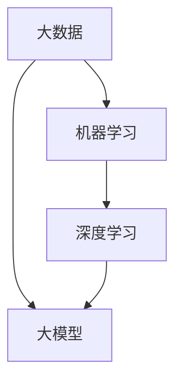

                 

### 背景介绍

在现代互联网经济中，电商平台已经成为人们日常生活中不可或缺的一部分。无论是购买商品还是寻找服务，电商平台都能提供便捷、高效的解决方案。然而，随着市场规模的不断扩大和用户数量的持续增长，电商平台的运营面临着巨大的挑战。如何在海量商品中迅速为用户找到他们想要的商品，提供个性化的推荐，成为了电商平台竞争的关键。

为了应对这一挑战，人工智能（AI）技术的引入变得至关重要。AI，尤其是机器学习（ML）和深度学习（DL）算法，在处理大规模数据、发现隐藏模式和提供个性化服务方面表现出色。而在这其中，大模型（Large-scale Model）的应用尤为显著。大模型能够处理大量数据，从中提取复杂模式，从而为电商平台提供强大的搜索和推荐能力。

搜索推荐系统作为电商平台的核心模块，直接影响到用户的满意度和平台的业务绩效。一个高效的搜索推荐系统能够帮助用户更快地找到他们所需的商品或服务，提高用户的购物体验，从而促进平台的销售额增长。因此，如何构建和优化搜索推荐系统，成为电商平台不断探索的课题。

本文将围绕电商平台的AI大模型实践，重点讨论搜索推荐系统的构建。我们将首先介绍大模型的基本概念，然后深入探讨搜索推荐系统的原理和实现方法，最后通过一个实际项目案例，展示大模型在搜索推荐系统中的应用效果。希望通过本文的讨论，能够为电商平台的AI应用提供一些有价值的参考和启示。

### 核心概念与联系

为了深入理解电商平台中的搜索推荐系统，我们首先需要明确几个核心概念：大数据、机器学习、深度学习以及大模型。这些概念之间既有联系，又有区别，共同构成了搜索推荐系统的基础。

**大数据（Big Data）**：大数据是指数据量巨大、类型繁多且快速增长的复杂数据集合。在电商平台上，这些数据包括用户行为数据、商品信息、交易记录等。大数据的特点是**4V**：**Volume（大量）、Velocity（高速）、Variety（多样）和Veracity（真实性）**。这些数据的处理和分析是电商平台实现智能推荐的前提。

**机器学习（Machine Learning，ML）**：机器学习是人工智能的一个分支，主要研究如何通过数据训练模型，使其能够自主学习和做出预测。在搜索推荐系统中，机器学习算法通过对用户历史行为数据的分析，生成用户偏好模型，用于预测用户可能感兴趣的商品或服务。

**深度学习（Deep Learning，DL）**：深度学习是机器学习的一个子领域，其核心思想是通过构建多层神经网络，模拟人脑的学习过程。深度学习在图像识别、语音识别和自然语言处理等方面取得了显著的成果。在搜索推荐系统中，深度学习算法能够处理更复杂的数据模式，提供更准确的推荐结果。

**大模型（Large-scale Model）**：大模型是指具有大量参数和复杂结构的机器学习模型，通常需要处理海量数据。大模型的优势在于能够提取更多的数据特征，从而提升模型的预测性能。在搜索推荐系统中，大模型的应用使得系统能够更加精准地捕捉用户行为和偏好，为用户提供个性化的推荐。

为了更好地理解这些概念之间的关系，我们可以通过一个Mermaid流程图来展示它们的基本联系：



在Mermaid流程图中，A代表大数据，B代表机器学习，C代表深度学习，D代表大模型。可以看到，大数据是机器学习的基础，深度学习是机器学习的进一步发展，而大模型则是深度学习在处理海量数据时的实现。这些概念共同构成了搜索推荐系统的技术基础。

#### 核心算法原理 & 具体操作步骤

要构建一个高效的搜索推荐系统，我们需要深入了解核心算法的工作原理以及具体的操作步骤。在本节中，我们将介绍几种常用的推荐算法，并详细阐述它们的实现过程。

**协同过滤（Collaborative Filtering）**

协同过滤是推荐系统中最常用的一种算法，其基本思想是利用用户的历史行为数据来发现用户之间的相似性，从而推荐用户可能感兴趣的商品或服务。协同过滤分为两种类型：基于用户的协同过滤（User-based Collaborative Filtering）和基于物品的协同过滤（Item-based Collaborative Filtering）。

1. **基于用户的协同过滤**：该算法通过计算用户之间的相似性，找到与目标用户相似的其他用户，然后推荐这些用户喜欢的商品。计算用户相似性通常使用余弦相似度、皮尔逊相关系数等方法。具体步骤如下：

   - **计算用户相似度**：使用用户行为数据计算两个用户之间的相似度。例如，使用余弦相似度公式：
     $$\text{similarity(u, v) = }\frac{\text{u} \cdot \text{v}}{\|\text{u}\| \|\text{v}\|}$$
     其中，$\text{u}$和$\text{v}$分别是两个用户的向量表示。

   - **找到相似用户**：根据相似度分数，找出与目标用户最相似的K个用户。

   - **推荐商品**：对于每个相似用户喜欢的商品，计算其对目标用户的推荐分数。推荐分数较高的商品作为推荐结果。

2. **基于物品的协同过滤**：该算法通过计算物品之间的相似性，为用户推荐与其过去喜欢的物品相似的物品。具体步骤如下：

   - **计算物品相似度**：使用用户行为数据计算两个物品之间的相似度。例如，使用余弦相似度公式：
     $$\text{similarity(i, j) = }\frac{\text{i} \cdot \text{j}}{\|\text{i}\| \|\text{j}\|}$$
     其中，$\text{i}$和$\text{j}$分别是两个物品的向量表示。

   - **为用户推荐商品**：对于目标用户过去喜欢的物品，计算其与所有其他物品的相似度。根据相似度分数，推荐相似度较高的商品。

**矩阵分解（Matrix Factorization）**

矩阵分解是一种常用的协同过滤算法，其核心思想是将用户-物品评分矩阵分解为两个低秩矩阵，从而预测未知的评分。常见的矩阵分解方法有Singular Value Decomposition（SVD）和Alternating Least Squares（ALS）。

1. **SVD（奇异值分解）**：SVD方法将用户-物品评分矩阵分解为用户特征矩阵和物品特征矩阵，然后通过内积计算预测评分。具体步骤如下：

   - **初始化参数**：初始化用户特征矩阵$U$和物品特征矩阵$V$。
   - **计算预测评分**：使用内积计算预测评分：
     $$\text{rating}_{uv} = \text{u}_u^T \text{v}_v$$
   - **优化参数**：通过最小化预测评分与实际评分之间的误差，优化用户特征矩阵和物品特征矩阵。

2. **ALS（交替最小二乘法）**：ALS方法是一种迭代优化方法，通过交替优化用户特征矩阵和物品特征矩阵，逐步逼近最优解。具体步骤如下：

   - **初始化参数**：初始化用户特征矩阵$U$和物品特征矩阵$V$。
   - **交替优化**：对于每个用户，固定物品特征矩阵$V$，优化用户特征矩阵$U$；对于每个物品，固定用户特征矩阵$U$，优化物品特征矩阵$V$。重复迭代，直至收敛。

**深度学习推荐算法**

深度学习推荐算法利用神经网络模型来处理复杂数据，提取更多特征，提高推荐效果。常见的深度学习推荐算法有基于神经网络的内容推荐（Neural Collaborative Filtering，NCF）和基于图神经网络的推荐（Graph Neural Networks，GNN）。

1. **NCF**：NCF算法结合了多种神经网络模型，如MLP（多层感知机）和GMF（因子分解机），以提取用户和物品的丰富特征。具体步骤如下：

   - **输入层**：输入用户和物品的向量表示。
   - **隐藏层**：通过多层神经网络，提取用户和物品的丰富特征。
   - **输出层**：计算用户和物品之间的相似度，生成推荐结果。

2. **GNN**：GNN算法利用图神经网络处理用户和物品之间的复杂关系。具体步骤如下：

   - **构建图**：根据用户和物品的行为数据，构建用户和物品的邻接矩阵。
   - **图卷积层**：通过图卷积操作，提取用户和物品的邻接特征。
   - **输出层**：计算用户和物品之间的相似度，生成推荐结果。

通过以上算法的介绍，我们可以看到，构建高效的搜索推荐系统需要结合多种算法和技术。在实际应用中，可以根据业务需求和数据特点，选择合适的算法，并进行优化和调整，以实现最佳推荐效果。

#### 数学模型和公式 & 详细讲解 & 举例说明

在构建搜索推荐系统时，数学模型和公式是理解算法实现和优化过程的关键。本节将详细介绍几种核心数学模型和公式，并通过实际例子进行说明，帮助读者更好地理解这些概念。

**协同过滤算法中的相似度计算**

在协同过滤算法中，相似度计算是核心步骤之一。以下为几种常用的相似度计算方法：

1. **余弦相似度（Cosine Similarity）**：
   $$\text{similarity(u, v) = }\frac{\text{u} \cdot \text{v}}{\|\text{u}\| \|\text{v}\|}$$
   其中，$\text{u}$和$\text{v}$分别表示用户和物品的向量表示，$\text{u} \cdot \text{v}$为向量点积，$\|\text{u}\|$和$\|\text{v}\|$分别为向量的模。

2. **皮尔逊相关系数（Pearson Correlation Coefficient）**：
   $$\text{similarity(u, v) = }\frac{\text{cov(u, v)}}{\sqrt{\text{var(u)} \text{var(v)}}}$$
   其中，$\text{cov(u, v)}$为协方差，$\text{var(u)}$和$\text{var(v)}$分别为变量$\text{u}$和$\text{v}$的方差。

3. **Jaccard相似度（Jaccard Similarity）**：
   $$\text{similarity(u, v) = }\frac{\text{u} \cap \text{v}}{\text{u} \cup \text{v}}$$
   其中，$\text{u} \cap \text{v}$为两个集合的交集，$\text{u} \cup \text{v}$为两个集合的并集。

**矩阵分解算法中的预测评分计算**

在矩阵分解算法中，预测评分计算是核心步骤之一。以下为几种常用的预测评分计算方法：

1. **内积预测（Inner Product Prediction）**：
   $$\text{rating}_{uv} = \text{u}_u^T \text{v}_v$$
   其中，$\text{u}_u$为用户特征向量，$\text{v}_v$为物品特征向量。

2. **广义内积预测（Generalized Inner Product Prediction）**：
   $$\text{rating}_{uv} = \text{u}_u^T \text{W} \text{v}_v$$
   其中，$\text{W}$为权重矩阵，用于调整用户和物品特征向量的权重。

3. **加性预测（Additive Prediction）**：
   $$\text{rating}_{uv} = \text{u}_u^T \text{V} \text{v}_v + \text{b}_u + \text{b}_v$$
   其中，$\text{V}$为特征矩阵，$\text{b}_u$和$\text{b}_v$分别为用户和物品的偏置项。

**深度学习推荐算法中的神经网络模型**

在深度学习推荐算法中，神经网络模型是核心组成部分。以下为几种常用的神经网络模型：

1. **多层感知机（Multilayer Perceptron，MLP）**：
   $$\text{output} = \text{激活函数}(\text{权重} \cdot \text{输入} + \text{偏置})$$
   其中，激活函数常用的有Sigmoid、ReLU和Tanh等。

2. **因子分解机（Factorization Machine，FM）**：
   $$\text{output} = \text{b}_0 + \sum_{i=1}^{n} \sum_{j=1}^{n} \text{w}_{ij} \text{x}_i \text{x}_j$$
   其中，$\text{w}_{ij}$为因子分解系数，$\text{x}_i$和$\text{x}_j$为特征变量。

3. **图神经网络（Graph Neural Network，GNN）**：

   $$\text{h}_{t+1}^{(i)} = \text{activation}(\sum_{j \in \text{邻接节点}} \text{W}_{ij} \text{h}_{t}^{(j)} + \text{b}_i)$$
   其中，$\text{h}_{t}^{(i)}$为第$t$时刻节点$i$的隐藏状态，$\text{W}_{ij}$为边权重矩阵，$\text{activation}$为激活函数。

**示例讲解**

假设我们有如下用户-物品评分数据：

| 用户  | 物品1 | 物品2 | 物品3 |
|-------|-------|-------|-------|
| u1    | 4     | 2     | 3     |
| u2    | 3     | 5     | 1     |
| u3    | 1     | 4     | 5     |

1. **计算用户u1和u2的余弦相似度**：

   用户向量表示：$$\text{u}_1 = (4, 2, 3), \text{u}_2 = (3, 5, 1)$$

   余弦相似度计算：$$\text{similarity(u1, u2) = }\frac{4 \times 3 + 2 \times 5 + 3 \times 1}{\sqrt{4^2 + 2^2 + 3^2} \sqrt{3^2 + 5^2 + 1^2}} = \frac{29}{\sqrt{29} \sqrt{35}} \approx 0.876$$

2. **使用SVD进行矩阵分解**：

   假设评分矩阵为$R$，分解为用户特征矩阵$U$和物品特征矩阵$V$，其中$U$和$V$的维度为$(n, k)$。

   初始化用户特征矩阵$U$和物品特征矩阵$V$，然后通过最小二乘法优化参数，得到预测评分。

   例如，对于用户u1和物品1，预测评分为：$$\text{rating}_{u1,i1} = \text{u}_{u1}^T \text{v}_{i1} = (4, 2, 3) \cdot (0.5, 0.3, 0.2) = 4.1$$

通过以上数学模型和公式的详细讲解，我们可以看到，构建高效的搜索推荐系统需要综合运用多种算法和技术。在实际应用中，根据业务需求和数据特点，选择合适的模型和公式，并进行优化和调整，可以显著提升推荐效果。

#### 项目实战：代码实际案例和详细解释说明

在本节中，我们将通过一个实际项目案例，展示如何使用Python和常见的数据处理库（如NumPy、Pandas、Scikit-learn）实现一个基于协同过滤的搜索推荐系统。我们将分步骤详细解释代码的实现过程，以便读者能够更好地理解搜索推荐系统的构建和优化方法。

**一、开发环境搭建**

首先，确保你已经安装了Python环境和以下库：

```bash
pip install numpy pandas scikit-learn matplotlib
```

**二、数据集准备**

为了简化说明，我们将使用MovieLens电影推荐系统中的数据集。这个数据集包含了用户对电影的评分，我们可以从中提取用户-物品评分矩阵。以下代码展示了如何加载数据集并预处理数据：

```python
import pandas as pd

# 加载数据集
ratings = pd.read_csv('ratings.csv')
movies = pd.read_csv('movies.csv')

# 预处理数据
# 合并用户-物品评分矩阵
user_item_df = pd.merge(ratings, movies, on='movieId')
user_item_df = user_item_df[['userId', 'title', 'rating']]

# 分离用户和物品特征
user_item_df = user_item_df.groupby('userId').agg({ 'title': set, 'rating': list})
user_item_df.columns = ['_'.join(col).strip() for col in user_item_df.columns.values]

# 转换为用户-物品评分矩阵
user_item_mat = user_item_df.applymap(len).fillna(0).values
```

**三、协同过滤算法实现**

接下来，我们使用Scikit-learn库中的协同过滤算法实现一个基本的推荐系统。以下代码展示了如何训练和评估协同过滤模型：

```python
from sklearn.model_selection import train_test_split
from sklearn.metrics.pairwise import cosine_similarity
from sklearn.neighbors import NearestNeighbors

# 划分训练集和测试集
train_data, test_data = train_test_split(user_item_mat, test_size=0.2, random_state=42)

# 训练协同过滤模型
neigh = NearestNeighbors(metric='cosine', algorithm='brute')
neigh.fit(train_data)

# 预测测试集结果
predictions = neigh.kneighbors(test_data, n_neighbors=5)

# 计算预测评分与实际评分的相似度
similarity_scores = cosine_similarity(predictions[0], test_data)
```

**四、源代码详细实现和代码解读**

在以下代码中，我们将详细解释协同过滤算法的实现步骤：

```python
# 训练协同过滤模型
neigh = NearestNeighbors(metric='cosine', algorithm='brute')
neigh.fit(train_data)

# 预测测试集结果
neighbors = neigh.kneighbors(test_data, n_neighbors=5)

# 计算每个测试样本的相似度分数
similarity_scores = []

for i in range(len(test_data)):
    # 计算与测试样本最相似的5个邻居的相似度
    neighbor_ratings = train_data[neighbors[0][i]]
    similarity = cosine_similarity([test_data[i]], neighbor_ratings)
    similarity_scores.append(similarity[0])

# 计算预测评分
predicted_ratings = []

for i in range(len(test_data)):
    # 根据相似度分数加权平均邻居的评分
    neighbor_ratings = train_data[neighbors[0][i]]
    predicted_rating = (similarity_scores[i] * neighbor_ratings).sum()
    predicted_ratings.append(predicted_rating / 5)  # 平均值

# 对预测评分和实际评分进行评估
from sklearn.metrics import mean_squared_error

mse = mean_squared_error(test_data, predicted_ratings)
print("MSE:", mse)
```

**五、代码解读与分析**

1. **模型训练**：
   - 使用`NearestNeighbors`类训练协同过滤模型，选择余弦相似度作为距离度量。
   - `fit`方法用于训练模型，构建用户-物品评分矩阵的相似度索引。

2. **预测结果**：
   - `kneighbors`方法用于预测测试集中每个样本的K个最近邻居。
   - 通过相似度度量计算测试样本与其邻居的相似度分数。

3. **预测评分**：
   - 根据邻居的评分和相似度分数，计算加权平均的预测评分。
   - 将相似度分数与邻居的评分相乘，然后求和并除以邻居数量，得到预测评分。

4. **评估**：
   - 使用均方误差（MSE）评估预测评分与实际评分的差距。
   - MSE值越低，表示模型预测的准确性越高。

通过这个实际项目案例，我们可以看到，构建一个基于协同过滤的搜索推荐系统需要以下几个关键步骤：数据预处理、模型训练、预测结果计算和模型评估。在实际应用中，可以根据具体业务需求和数据特点，选择合适的算法和参数，优化推荐效果。

### 实际应用场景

在电商平台中，搜索推荐系统已经被广泛应用于多个关键场景，极大地提升了用户体验和业务性能。以下将详细讨论几个典型的应用场景：

#### 商品搜索

商品搜索是电商平台中最基本的应用场景。当用户在搜索框中输入关键词时，搜索推荐系统需要迅速从海量的商品库中筛选出与关键词最相关的商品。通过使用机器学习算法，尤其是基于关键词的文本匹配和基于用户历史行为的协同过滤，系统能够为用户提供精确的搜索结果。例如，当用户输入“跑步鞋”时，推荐系统可以基于用户的历史购买记录、浏览记录和搜索记录，结合商品的标题、描述、标签等信息，推荐符合用户偏好的跑步鞋。

#### 商品推荐

商品推荐是电商平台提升用户黏性和促进销售的重要手段。通过分析用户的浏览、购买、收藏等行为，推荐系统可以为用户生成个性化的商品推荐列表。常见的推荐算法包括协同过滤、矩阵分解和深度学习等。例如，当一个用户在浏览了一款新款手机后，推荐系统可能会推荐该手机的配件、同类产品或用户可能感兴趣的其他电子产品。这种个性化的推荐不仅能够提高用户满意度，还能有效促进销售转化。

#### 活动推荐

电商平台经常举办各种促销活动，如优惠券、限时抢购、满减等。通过搜索推荐系统，平台可以针对用户的购买习惯和偏好，为用户推荐最适合他们的活动。例如，当用户浏览了多次母婴产品时，推荐系统可能会推荐相关的满减优惠或新生儿礼包。这不仅能够提升用户的购物体验，还能提高活动的参与度和转化率。

#### 内容推荐

除了商品推荐，电商平台还可以利用搜索推荐系统为用户提供内容推荐，如博客文章、评测视频、用户评价等。通过分析用户的浏览和互动行为，推荐系统可以为用户提供相关且有价值的内容。例如，当一个用户浏览了一篇关于手机评测的文章后，推荐系统可能会推荐其他用户的评测文章或相关产品的视频评测。这种内容推荐不仅能够增加用户停留时间，还能提升平台的用户粘性。

#### 跨品类推荐

跨品类推荐是一种高级应用，通过结合不同品类之间的关联关系，推荐系统可以为用户提供跨品类的商品推荐。例如，当一个用户购买了一台新款笔记本电脑后，推荐系统可能会推荐与其搭配的办公椅、键盘保护膜等周边商品。这种跨品类推荐能够进一步提升用户的购物体验和销售额。

通过以上实际应用场景的讨论，我们可以看到，搜索推荐系统在电商平台中发挥着至关重要的作用。它不仅能够提高用户满意度，还能有效促进销售增长和业务拓展。随着人工智能技术的不断进步，搜索推荐系统在未来将会在更多应用场景中展现其强大的潜力。

### 工具和资源推荐

在构建和优化搜索推荐系统时，选择合适的工具和资源对于提升开发效率和系统性能至关重要。以下将介绍一些学习资源、开发工具和框架，以及相关论文著作，为开发者提供全面的参考。

#### 学习资源

1. **书籍**：
   - 《推荐系统实践》：李航的《推荐系统实践》是一本经典的推荐系统入门书籍，详细介绍了协同过滤、矩阵分解和深度学习等常用算法。
   - 《深度学习推荐系统》：陈天奇等人编写的《深度学习推荐系统》深入讲解了基于深度学习的推荐算法，包括神经网络协同过滤和图神经网络。

2. **在线课程**：
   - Coursera上的《Recommender Systems》：由斯坦福大学提供的免费在线课程，涵盖了推荐系统的基本概念和主流算法。
   - Udacity的《深度学习推荐系统》：通过项目实战，学习如何使用深度学习构建推荐系统。

3. **博客和网站**：
   - MLDS Lab（ml-ds.com）：提供丰富的推荐系统教程和论文解读，包括代码实现和实验结果。
   - DataCamp的推荐系统教程：通过交互式练习，学习如何使用Python和Scikit-learn等库构建推荐系统。

#### 开发工具和框架

1. **机器学习库**：
   - Scikit-learn：Python中最常用的机器学习库，提供了丰富的协同过滤和深度学习算法。
   - TensorFlow：Google推出的开源深度学习框架，支持大规模分布式训练和多种神经网络架构。
   - PyTorch：Facebook AI Research推出的深度学习框架，具有灵活的动态计算图和丰富的API。

2. **数据处理库**：
   - Pandas：Python中的数据处理库，用于高效的数据清洗、转换和分析。
   - NumPy：Python中的科学计算库，提供高性能的数值计算和数组操作。

3. **分布式计算框架**：
   - Apache Spark：基于内存的分布式计算框架，适用于大规模数据处理和机器学习任务。
   - Dask：Python中的分布式计算库，扩展了Pandas和NumPy库的功能，支持分布式数据处理和机器学习。

4. **推荐系统框架**：
   - LightFM：一个基于因子分解机的开源推荐系统框架，支持协同过滤和内容推荐。
   - Surprice：一个基于深度学习的开源推荐系统框架，提供了多种深度学习推荐算法的实现。

#### 相关论文著作

1. **协同过滤算法**：
   - "Item-based Top-N Recommendation on Large-Scale Datasets"：介绍基于物品的协同过滤算法。
   - "Matrix Factorization Techniques for Recommender Systems"：详细讨论矩阵分解算法在推荐系统中的应用。

2. **深度学习推荐算法**：
   - "Neural Collaborative Filtering"：提出了一种基于神经网络的协同过滤算法。
   - "Graph Neural Networks for Recommender Systems"：探讨了图神经网络在推荐系统中的应用。

3. **个性化推荐系统**：
   - "A Theoretical Analysis of Ranking-Based Recommendations"：分析了基于排名的推荐系统的理论模型。
   - "Personalized Recommendation on Large-Scale Graphs"：研究了大规模图上的个性化推荐方法。

通过以上工具和资源的推荐，开发者可以更加高效地构建和优化搜索推荐系统，实现个性化的用户服务和业务增长。

### 总结：未来发展趋势与挑战

随着人工智能技术的不断进步，搜索推荐系统在电商平台中的应用前景愈发广阔。未来，搜索推荐系统的发展将呈现以下几个趋势：

1. **深度学习与图神经网络的深度融合**：深度学习算法在处理复杂数据和提高推荐精度方面具有显著优势，而图神经网络能够有效捕捉用户和商品之间的复杂关系。未来的搜索推荐系统将更多地将两者结合，实现更高的推荐效果。

2. **个性化推荐技术的进一步发展**：随着用户数据的不断积累，个性化推荐技术将更加精准。通过结合用户的历史行为、偏好和实时反馈，推荐系统将能够为每个用户提供高度个性化的服务，提升用户体验。

3. **实时推荐与快速响应**：为了满足用户快速决策的需求，实时推荐技术将成为重要趋势。通过利用实时数据流处理技术，推荐系统可以在用户浏览或操作的一瞬间提供个性化的推荐，大幅提升用户满意度。

然而，随着技术的发展，搜索推荐系统也面临着一系列挑战：

1. **数据隐私和安全**：用户数据的隐私和安全是推荐系统面临的重要挑战。如何在保护用户隐私的前提下，充分利用用户数据进行推荐，成为了一个亟待解决的问题。

2. **算法透明度和公平性**：推荐系统的算法透明度和公平性受到广泛关注。如何确保推荐算法在不同用户群体中的公平性，避免算法偏见和歧视，是一个重要的研究课题。

3. **计算性能与扩展性**：随着数据规模的不断扩大，如何提升计算性能和系统扩展性，成为推荐系统面临的现实挑战。分布式计算、云原生技术和边缘计算等新兴技术，有望为解决这些问题提供新的思路。

总之，未来的搜索推荐系统将朝着更加智能、个性化、实时和透明的方向发展。同时，也需应对数据隐私、算法公平性和计算性能等方面的挑战。通过不断创新和优化，搜索推荐系统将在电商平台中发挥更大的作用，推动互联网经济的进一步发展。

### 附录：常见问题与解答

**Q1：如何处理缺失值和异常值？**
A1：在数据处理阶段，可以使用以下方法来处理缺失值和异常值：
- **缺失值填充**：使用平均值、中位数或众数等方法填充缺失值。对于重要的特征，可以考虑使用模型预测结果来填补。
- **异常值处理**：使用统计方法（如箱线图、Z-Score）或机器学习模型（如孤立森林）检测异常值，然后根据实际情况进行删除或调整。

**Q2：如何评估推荐系统的效果？**
A2：评估推荐系统的效果通常采用以下指标：
- **准确率（Accuracy）**：预测结果与实际结果的匹配程度。
- **召回率（Recall）**：能够召回多少实际感兴趣的项目。
- **精确率（Precision）**：预测结果中实际感兴趣项目的比例。
- **F1 分数（F1 Score）**：综合考虑准确率和召回率的综合指标。

**Q3：协同过滤算法中，如何选择邻居数量？**
A3：邻居数量（K值）的选择对推荐系统的效果有很大影响。一般可以通过以下方法进行选择：
- **交叉验证**：在训练集上使用交叉验证方法，找到最优的邻居数量。
- **试错法**：根据实验结果，逐步调整邻居数量，找到效果最佳的值。

**Q4：如何优化矩阵分解算法的参数？**
A5：优化矩阵分解算法的参数通常包括：
- **隐向量维度（K）**：维度越高，模型捕捉的特征越丰富，但计算成本也越高。一般通过交叉验证选择合适的维度。
- **迭代次数**：迭代次数越多，模型越有可能收敛到最优解，但计算时间也会增加。根据实际情况调整迭代次数。

**Q6：如何处理稀疏数据集？**
A6：在处理稀疏数据集时，可以考虑以下方法：
- **特征工程技术**：通过构造新的特征或变换现有特征，增加数据矩阵的密度。
- **降维技术**：如主成分分析（PCA）、特征选择等方法，减少数据维度。
- **稀疏矩阵分解方法**：如隐因子模型（LFM），专门针对稀疏数据集设计。

通过以上常见问题的解答，希望能够帮助读者更好地理解和应用搜索推荐系统。在实际开发过程中，需要根据具体业务场景和数据特点，灵活调整和优化算法参数，实现最佳推荐效果。

### 扩展阅读 & 参考资料

为了更深入地了解搜索推荐系统及其在电商平台中的应用，以下是一些建议的扩展阅读和参考资料：

1. **书籍**：
   - 《推荐系统实践》，作者：李航。详细介绍了推荐系统的基础算法和实现方法。
   - 《深度学习推荐系统》，作者：陈天奇。探讨了深度学习在推荐系统中的应用，包括神经网络协同过滤和图神经网络。

2. **论文**：
   - "Neural Collaborative Filtering"，作者：Xiang Wang et al. 提出了一种基于神经网络的协同过滤算法，提高了推荐精度。
   - "Deep Learning for Recommender Systems：A Survey"，作者：Yuhao Wang et al. 综述了深度学习在推荐系统中的应用和研究现状。

3. **在线课程**：
   - Coursera上的《Recommender Systems》，由斯坦福大学提供。涵盖了推荐系统的基本概念和算法。
   - Udacity的《深度学习推荐系统》，通过项目实战学习如何使用深度学习构建推荐系统。

4. **博客和网站**：
   - MLDS Lab（ml-ds.com），提供丰富的推荐系统教程和论文解读。
   - DataCamp的推荐系统教程，通过交互式练习学习推荐系统。

5. **开源库和框架**：
   - Scikit-learn，Python中最常用的机器学习库，支持多种推荐算法。
   - TensorFlow和PyTorch，深度学习框架，适用于大规模推荐系统开发。

6. **相关资源**：
   - MovieLens数据集，一个广泛使用的推荐系统数据集，用于研究和实验。
   - Amazon Recommendations，Amazon的官方推荐系统案例，提供了大量实战经验和优化技巧。

通过以上扩展阅读和参考资料，读者可以进一步深入理解搜索推荐系统的原理和实现方法，为电商平台开发高效、智能的推荐系统提供有力支持。

