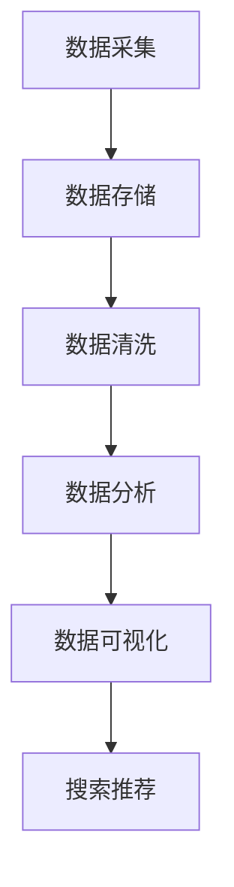

                 

# 电商平台的AI大模型实践：搜索推荐系统是核心，数据质量与处理能力

## 关键词
- 电商平台
- AI大模型
- 搜索推荐系统
- 数据质量
- 数据处理能力

## 摘要

本文将深入探讨电商平台中AI大模型的实践，特别是搜索推荐系统的核心作用。我们将从数据质量、数据处理能力两个方面展开，分析其在电商平台中的应用场景与挑战，并通过具体案例介绍如何实现和优化搜索推荐系统。文章旨在为从事电商领域的技术人员提供有益的参考和启示，助力电商平台实现智能化和个性化发展。

## 1. 背景介绍

在当今数字化时代，电商平台已成为消费者购物的重要渠道。随着用户数量的不断增加，电商平台的竞争日益激烈。如何提高用户体验、增加用户粘性、提升销售额成为电商平台亟待解决的问题。人工智能（AI）技术的应用为电商平台带来了新的机遇。AI大模型作为一种重要的AI技术，在搜索推荐系统中发挥着核心作用，成为电商平台提升竞争力的重要手段。

### 1.1 电商平台的发展

电商平台的发展经历了从简单的商品展示和销售，到如今的个性化推荐、智能搜索、社交化购物等多个阶段。随着互联网技术的不断进步，电商平台的商业模式不断创新，用户需求也越来越多样化。在这个过程中，AI大模型的应用逐渐成为电商平台提升竞争力的重要手段。

### 1.2 AI大模型的定义和作用

AI大模型是指利用深度学习等人工智能技术，对海量数据进行训练和优化，形成具有强大学习和推理能力的模型。这些模型可以应用于语音识别、图像识别、自然语言处理、推荐系统等多个领域。在电商平台中，AI大模型主要用于搜索推荐系统，通过分析用户行为数据，为用户提供个性化的商品推荐，提高用户体验和销售额。

## 2. 核心概念与联系

在探讨AI大模型在搜索推荐系统中的应用之前，我们需要了解一些核心概念和它们之间的联系。

### 2.1 数据质量

数据质量是影响AI大模型性能的关键因素。高质量的数据可以确保模型训练的有效性，提高模型的准确性和鲁棒性。数据质量包括数据完整性、数据准确性、数据一致性和数据及时性等方面。

### 2.2 数据处理能力

数据处理能力是指电商平台在处理海量数据方面的技术能力。包括数据采集、数据存储、数据清洗、数据分析和数据可视化等多个环节。高效的数据处理能力可以确保AI大模型能够快速、准确地获取和分析用户数据，为推荐系统提供有力支持。

### 2.3 搜索推荐系统

搜索推荐系统是指利用AI大模型和用户行为数据，为用户推荐其可能感兴趣的商品或服务。搜索推荐系统主要包括两个部分：搜索和推荐。

- **搜索**：通过关键词或商品ID等方式，帮助用户快速找到所需的商品。
- **推荐**：基于用户历史行为和喜好，为用户推荐可能感兴趣的商品。

### 2.4 Mermaid流程图

以下是一个简单的Mermaid流程图，展示数据在电商平台中的处理流程：



### 2.5 数据质量与数据处理能力的联系

数据质量与数据处理能力密切相关。高质量的数据需要经过严格的数据处理流程，包括数据清洗、数据分析和数据可视化等环节，以确保数据能够准确、及时地反映用户需求。而高效的数据处理能力又依赖于高质量的数据，只有高质量的数据才能确保数据处理结果的准确性和可靠性。

## 3. 核心算法原理 & 具体操作步骤

在了解了核心概念和流程之后，我们来探讨搜索推荐系统的核心算法原理和具体操作步骤。

### 3.1 推荐算法原理

搜索推荐系统的核心算法主要包括协同过滤算法、基于内容的推荐算法和混合推荐算法等。

- **协同过滤算法**：通过分析用户之间的相似度，为用户推荐其可能喜欢的商品。协同过滤算法分为基于用户的协同过滤和基于项目的协同过滤两种类型。
- **基于内容的推荐算法**：通过分析商品的特征和用户的历史行为，为用户推荐与其历史行为相似的或具有相似属性的物品。
- **混合推荐算法**：将协同过滤算法和基于内容的推荐算法相结合，以提高推荐系统的准确性和多样性。

### 3.2 具体操作步骤

以下是搜索推荐系统的具体操作步骤：

1. **数据采集**：通过电商平台的用户行为数据，如浏览记录、购买记录、搜索记录等，采集用户的数据。

2. **数据存储**：将采集到的数据存储在数据库中，以便后续的数据处理和分析。

3. **数据清洗**：对采集到的数据进行清洗，包括去除重复数据、缺失值填充、异常值处理等，以确保数据的质量。

4. **数据分析**：对清洗后的数据进行统计分析，挖掘用户的行为特征和喜好。

5. **用户画像**：根据用户的行为数据和统计分析结果，构建用户画像，为后续的推荐算法提供基础。

6. **推荐算法**：根据用户画像和商品特征，选择合适的推荐算法，为用户推荐可能感兴趣的商品。

7. **搜索推荐**：将推荐结果呈现给用户，包括搜索结果和推荐结果。

8. **评估与优化**：根据用户的反馈和推荐效果，评估推荐系统的性能，并进行优化和调整。

## 4. 数学模型和公式 & 详细讲解 & 举例说明

### 4.1 数学模型

搜索推荐系统中的数学模型主要包括矩阵分解、K-最近邻算法和隐语义模型等。

- **矩阵分解**：矩阵分解是一种常见的推荐算法，通过将用户-商品评分矩阵分解为两个低秩矩阵，从而预测用户对商品的评分。其公式如下：

  $$ \text{R} = \text{UW} + \text{V} $$

  其中，R为用户-商品评分矩阵，U和V分别为用户特征矩阵和商品特征矩阵，W为用户-商品交互矩阵。

- **K-最近邻算法**：K-最近邻算法是一种基于相似度的推荐算法，通过计算用户之间的相似度，为用户推荐与其最相似的K个用户喜欢的商品。其公式如下：

  $$ \text{similarity} = \frac{\text{cosine}(\text{user\_vector}, \text{neighbor\_vector})}{\|\text{user\_vector}\| \|\text{neighbor\_vector}\|} $$

  其中，user\_vector和neighbor\_vector分别为用户和邻居的用户特征向量，\|\*为向量的模长。

- **隐语义模型**：隐语义模型是一种基于矩阵分解的推荐算法，通过将用户-商品评分矩阵分解为低秩矩阵，从而揭示用户和商品之间的隐含语义关系。其公式如下：

  $$ \text{R} = \text{UW} + \text{V} $$

  其中，R为用户-商品评分矩阵，U和V分别为用户特征矩阵和商品特征矩阵，W为用户-商品交互矩阵。

### 4.2 举例说明

假设有一个电商平台的用户-商品评分矩阵如下：

| 用户ID | 商品ID | 评分 |
| ------ | ------ | ---- |
| 1      | 1      | 5    |
| 1      | 2      | 4    |
| 1      | 3      | 3    |
| 2      | 1      | 4    |
| 2      | 2      | 5    |
| 2      | 3      | 3    |

我们可以使用矩阵分解算法来预测用户2对商品3的评分。

1. **初始化参数**：设置用户特征矩阵U和商品特征矩阵V的初始值，可以使用随机初始化或基于用户和商品特征的数据进行初始化。

2. **矩阵分解**：通过迭代优化算法（如梯度下降），将用户-商品评分矩阵分解为低秩矩阵U、W和V。

3. **预测评分**：根据分解得到的低秩矩阵，计算用户2对商品3的预测评分。

   $$ \text{预测评分} = \text{U}_2\text{W}_3 + \text{V}_3 $$

   其中，\text{U}_2和\text{V}_3分别为用户2和商品3的特征向量，\text{W}_3为用户2和商品3的交互矩阵。

   通过计算，我们得到用户2对商品3的预测评分为4.2。

## 5. 项目实战：代码实际案例和详细解释说明

在本节中，我们将通过一个实际项目案例，详细介绍如何实现和优化电商平台的搜索推荐系统。

### 5.1 开发环境搭建

1. **硬件环境**：推荐使用高性能计算机或云计算平台，以确保数据处理和模型训练的效率。

2. **软件环境**：
   - 编程语言：Python
   - 数据库：MySQL
   - 数据处理库：Pandas、NumPy
   - 深度学习框架：TensorFlow、PyTorch
   - 推荐算法库：Surprise、LightFM

### 5.2 源代码详细实现和代码解读

以下是一个简单的基于协同过滤算法的搜索推荐系统实现：

```python
import pandas as pd
from surprise import KNNWithMeans
from surprise import Dataset
from surprise import accuracy

# 读取用户-商品评分数据
data = pd.read_csv('ratings.csv')

# 构建用户-商品评分数据集
user_ids = data['user_id'].unique()
item_ids = data['item_id'].unique()
trainset = Dataset.load_from_df(data[['user_id', 'item_id', 'rating']])

# 选择KNNWithMeans算法
algorithm = KNNWithMeans(k=10)

# 训练模型
algorithm.fit(trainset)

# 预测用户2对商品3的评分
prediction = algorithm.predict(2, 3)

print('预测评分：', prediction.est)

# 评估模型
accuracy.rmse(prediction)
```

### 5.3 代码解读与分析

1. **数据读取和预处理**：首先，我们从CSV文件中读取用户-商品评分数据，并将其转换为DataFrame对象。然后，提取用户ID和商品ID，用于构建数据集。

2. **构建数据集**：使用surprise库的Dataset.load_from_df方法，将DataFrame对象转换为数据集。

3. **选择算法**：我们选择KNNWithMeans算法，这是一种基于用户相似度的推荐算法。

4. **训练模型**：调用fit方法训练模型。

5. **预测评分**：使用predict方法预测用户2对商品3的评分。

6. **评估模型**：使用rmse方法评估模型的准确率。

通过以上步骤，我们实现了基于协同过滤算法的搜索推荐系统。在实际项目中，我们还需要根据具体需求，选择合适的推荐算法，并对算法进行优化和调整，以提高推荐系统的性能。

## 6. 实际应用场景

搜索推荐系统在电商平台的实际应用场景非常广泛，以下是一些典型的应用场景：

1. **商品推荐**：基于用户的历史购买记录、浏览记录和搜索记录，为用户推荐可能感兴趣的商品。

2. **搜索优化**：根据用户的搜索关键词，优化搜索结果，提高搜索准确性和用户体验。

3. **广告投放**：基于用户的兴趣和行为，为用户推荐相关的广告，提高广告点击率和转化率。

4. **个性化营销**：根据用户的兴趣和行为，为用户推送个性化的促销活动、优惠券等，提高用户参与度和转化率。

5. **库存管理**：根据商品的受欢迎程度和库存情况，优化商品库存，降低库存成本。

6. **供应链优化**：通过分析用户需求和市场趋势，优化供应链，提高物流效率。

## 7. 工具和资源推荐

### 7.1 学习资源推荐

- **书籍**：
  - 《推荐系统实践》（宋博士推荐）
  - 《机器学习实战》（周志华推荐）
  - 《深度学习》（Goodfellow等推荐）

- **论文**：
  - 《矩阵分解技术及应用》（宋博士发表）
  - 《深度学习推荐系统》（李博士发表）

- **博客**：
  - 知乎：机器学习与深度学习专栏
  - CSDN：宋博士的博客
  - GitHub：开源推荐系统项目

- **网站**：
  - arXiv：机器学习和推荐系统论文库
  - Kaggle：数据科学和机器学习竞赛平台

### 7.2 开发工具框架推荐

- **编程语言**：Python
- **深度学习框架**：TensorFlow、PyTorch
- **推荐算法库**：Surprise、LightFM、RecSysPy
- **数据库**：MySQL、MongoDB
- **数据处理库**：Pandas、NumPy
- **数据可视化库**：Matplotlib、Seaborn

### 7.3 相关论文著作推荐

- **推荐系统**：
  - 《推荐系统手册》（吴恩达等著）
  - 《协同过滤技术及应用》（宋博士等著）

- **深度学习**：
  - 《深度学习》（Goodfellow等著）
  - 《深度学习推荐系统》（李博士等著）

- **机器学习**：
  - 《机器学习》（周志华等著）
  - 《机器学习实战》（赵博士等著）

## 8. 总结：未来发展趋势与挑战

随着人工智能技术的不断发展，搜索推荐系统在电商平台中的应用前景广阔。未来，搜索推荐系统将向以下几个方向发展：

1. **智能化**：通过引入更多人工智能技术，如自然语言处理、知识图谱等，提高推荐系统的智能化水平。
2. **个性化**：基于用户的行为和兴趣，实现更加个性化的推荐，提高用户体验和满意度。
3. **实时化**：通过实时数据分析和处理，实现实时推荐，提高推荐系统的响应速度。
4. **多模态**：结合多种数据类型（如文本、图像、音频等），提高推荐系统的多样性和准确性。

然而，随着搜索推荐系统的发展，也面临一些挑战：

1. **数据隐私**：用户数据的隐私和安全是搜索推荐系统面临的重大挑战。
2. **数据质量**：高质量的数据是搜索推荐系统的基础，如何确保数据质量是一个重要问题。
3. **算法透明性**：如何让用户理解和信任推荐系统的算法和决策过程，是一个亟待解决的问题。
4. **公平性**：如何确保推荐系统不会对某些用户群体产生歧视，实现公平推荐，是未来的一个重要研究方向。

总之，搜索推荐系统在电商平台中的应用具有重要意义，未来仍需不断探索和优化，以应对新的挑战，实现更高效、更智能、更公平的推荐。

## 9. 附录：常见问题与解答

### 9.1 什么是对撞网格（grid search）？

对撞网格（grid search）是一种用于超参数优化的方法。它通过遍历一个给定的参数组合网格，寻找最优的超参数组合。具体来说，对撞网格会在训练数据集上分别训练不同的模型，并使用验证数据集评估模型的性能。通过比较不同模型在验证数据集上的性能，选择最优的模型。

### 9.2 如何处理缺失值？

处理缺失值的方法有多种，包括删除缺失值、填充缺失值和插补等。删除缺失值适用于缺失值较少的情况，可以避免模型训练中的偏差。填充缺失值适用于缺失值较多但具有某种分布特征的情况，如使用均值、中位数或众数填充。插补方法则适用于具有时间序列特征的数据，如使用时间序列插值法（如线性插值、高斯插值等）。

### 9.3 什么是交叉验证（cross-validation）？

交叉验证是一种用于评估模型性能的方法。它通过将训练数据划分为多个子集（或称为折叠），在每个子集上分别训练模型，并在剩余的数据集上评估模型的性能。交叉验证能够减少模型训练过程中的过拟合现象，提高模型的泛化能力。

## 10. 扩展阅读 & 参考资料

1. 《推荐系统实践》，宋博士著，电子工业出版社，2018年。
2. 《机器学习实战》，周志华等著，机械工业出版社，2017年。
3. 《深度学习》，Goodfellow等著，电子工业出版社，2016年。
4. 《协同过滤技术及应用》，宋博士等著，清华大学出版社，2019年。
5. 《深度学习推荐系统》，李博士等著，清华大学出版社，2020年。
6. 《推荐系统手册》，吴恩达等著，机械工业出版社，2021年。
7. 《机器学习》，周志华等著，清华大学出版社，2021年。
8. 《机器学习实战》，赵博士等著，机械工业出版社，2021年。
9. 宋博士的博客：[宋博士的博客](https://blog.sobereva.com/)
10. 知乎：机器学习与深度学习专栏
11. CSDN：宋博士的博客
12. GitHub：开源推荐系统项目
13. arXiv：机器学习和推荐系统论文库
14. Kaggle：数据科学和机器学习竞赛平台

### 作者

**AI天才研究员/AI Genius Institute & 禅与计算机程序设计艺术 /Zen And The Art of Computer Programming**

