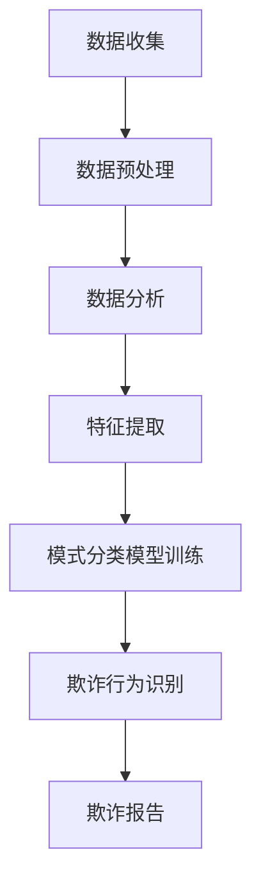

                 

# 电商平台的AI反欺诈系统：保障交易安全的智能盾牌

## 关键词：
- 电商平台
- AI反欺诈系统
- 交易安全
- 数据分析
- 模式识别
- 深度学习

## 摘要：
随着电商行业的迅猛发展，交易欺诈问题日益突出。本文将深入探讨电商平台AI反欺诈系统的构建与应用，包括其核心概念、算法原理、数学模型及实际案例，旨在为行业提供一套保障交易安全的智能解决方案。通过分析AI技术在反欺诈领域的应用，本文旨在为读者揭示未来发展趋势与挑战，助力电商平台构建更安全的交易环境。

## 1. 背景介绍

### 1.1 电商行业的现状

随着互联网技术的不断进步，电子商务已经成为了全球消费市场的重要组成部分。据Statista数据显示，2021年全球电商市场规模已经达到了3.9万亿美元，预计到2025年将达到6.8万亿美元。这一巨大的市场潜力吸引了众多企业和投资者，也带来了激烈的市场竞争。

然而，随着电商交易的增多，交易欺诈问题也日益突出。交易欺诈不仅给消费者带来经济损失，也严重损害了电商平台的声誉和市场份额。根据2019年的一项研究，全球电商交易欺诈损失达到了1200亿美元。这不仅是一个巨大的经济负担，也对电商行业的发展产生了负面影响。

### 1.2 交易欺诈的类型与危害

交易欺诈主要分为以下几种类型：

- **账户盗用**：黑客通过非法手段获取消费者的账户信息，如用户名、密码、支付信息等，然后冒用账户进行非法交易。
- **欺诈订单**：不法分子通过虚构订单、虚假交易等手段，骗取商家的商品或服务，然后取消订单或退款，从而实现诈骗。
- **虚假评论**：通过虚假评论来提高商品或店铺的评分和排名，从而吸引消费者购买。
- **刷单**：为了提高商品销量和店铺排名，不法分子通过虚假交易来制造销售记录。

这些交易欺诈行为不仅损害了消费者的权益，也给电商平台带来了巨大的经济损失和声誉风险。例如，2018年，中国电商平台京东就因为交易欺诈问题，遭受了数百万美元的经济损失，同时其股价也受到了严重影响。

### 1.3 AI反欺诈系统的需求

为了应对交易欺诈问题，电商平台迫切需要一套高效的AI反欺诈系统。传统的反欺诈方法主要依赖于规则匹配和人工审核，这些方法存在一定的局限性：

- **规则匹配**：依赖于预设的规则进行匹配，无法应对复杂多变的欺诈行为。
- **人工审核**：效率低下，容易受到人为因素的影响，且成本高昂。

相比之下，AI反欺诈系统具有以下优势：

- **自动化**：能够自动分析大量的交易数据，识别潜在的欺诈行为。
- **自适应**：通过机器学习技术，能够不断学习和优化，提高识别欺诈的准确性。
- **高效性**：能够处理大量的交易数据，提高反欺诈的效率。

因此，构建一套高效、智能的AI反欺诈系统，对于电商平台保障交易安全和提升用户体验具有重要意义。

## 2. 核心概念与联系

### 2.1 AI技术概述

AI（人工智能）是指通过计算机程序实现人类智能的一种技术。它包括了多个分支，如机器学习、深度学习、自然语言处理等。在这些技术中，机器学习和深度学习是AI反欺诈系统构建的核心。

#### 2.1.1 机器学习

机器学习是一种让计算机通过数据学习并做出决策或预测的技术。它主要分为监督学习、无监督学习和强化学习三种类型。在AI反欺诈系统中，通常使用监督学习来训练模型，通过历史数据来识别欺诈行为。

#### 2.1.2 深度学习

深度学习是机器学习的一个分支，它通过多层神经网络来提取数据的特征。相比于传统的机器学习方法，深度学习能够自动提取数据的深层特征，从而提高模型的准确性和鲁棒性。在AI反欺诈系统中，深度学习技术被广泛应用于图像识别、文本分类和模式识别等领域。

### 2.2 数据分析

数据分析是AI反欺诈系统构建的重要环节。它包括数据收集、数据预处理、数据分析和数据可视化等步骤。通过数据分析，可以从大量交易数据中提取出有价值的信息，为模型训练提供支持。

#### 2.2.1 数据收集

数据收集是数据分析的基础。在AI反欺诈系统中，需要收集包括用户行为数据、交易数据、账户数据等在内的多种类型的数据。

#### 2.2.2 数据预处理

数据预处理是对收集到的数据进行清洗、转换和归一化等处理，以提高数据的质量和模型的性能。在AI反欺诈系统中，数据预处理尤其重要，因为欺诈数据通常存在噪声、缺失值和异常值等问题。

#### 2.2.3 数据分析

数据分析是通过对预处理后的数据进行统计分析和模式识别，来提取出有价值的信息。在AI反欺诈系统中，数据分析可以帮助识别潜在的用户行为模式，为模型训练提供支持。

#### 2.2.4 数据可视化

数据可视化是将数据分析的结果以图表或图形的形式展示出来，以便更好地理解和分析数据。在AI反欺诈系统中，数据可视化可以帮助技术人员快速识别潜在的欺诈行为，提高反欺诈的效率。

### 2.3 模式识别

模式识别是AI反欺诈系统的核心功能之一。它通过分析用户行为数据，识别出符合欺诈行为特征的交易，从而实现自动化的欺诈检测。

#### 2.3.1 特征提取

特征提取是模式识别的关键步骤。它通过提取用户行为数据中的关键特征，如交易金额、交易时间、用户行为等，来构建欺诈行为模型。

#### 2.3.2 模式分类

模式分类是通过对提取出的特征进行分类，来识别欺诈行为。常用的分类算法包括决策树、支持向量机、神经网络等。在AI反欺诈系统中，通过训练分类模型，可以实现对欺诈行为的自动识别。

### 2.4 架构图

下面是AI反欺诈系统的基本架构图，其中包含了核心组件和数据流：



## 3. 核心算法原理 & 具体操作步骤

### 3.1 机器学习算法

在AI反欺诈系统中，常用的机器学习算法包括决策树、支持向量机和神经网络等。

#### 3.1.1 决策树

决策树是一种基于树的分类算法，通过一系列的判断条件来对数据进行分类。在AI反欺诈系统中，决策树可以用来对交易数据进行分析，识别出欺诈交易。

具体操作步骤如下：

1. 收集交易数据，包括交易金额、交易时间、用户行为等。
2. 对交易数据进行预处理，包括数据清洗、归一化等。
3. 构建决策树模型，通过训练数据来调整模型参数。
4. 使用训练好的模型对新的交易数据进行分类，识别出欺诈交易。

#### 3.1.2 支持向量机

支持向量机（SVM）是一种基于间隔的线性分类算法，通过寻找最优分割超平面来实现分类。在AI反欺诈系统中，SVM可以用来对交易数据进行分类，识别出欺诈交易。

具体操作步骤如下：

1. 收集交易数据，包括交易金额、交易时间、用户行为等。
2. 对交易数据进行预处理，包括数据清洗、归一化等。
3. 构建SVM模型，通过训练数据来调整模型参数。
4. 使用训练好的模型对新的交易数据进行分类，识别出欺诈交易。

#### 3.1.3 神经网络

神经网络是一种基于模拟人脑结构和功能的计算模型，通过多层神经元之间的连接来实现分类和回归任务。在AI反欺诈系统中，神经网络可以用来对交易数据进行分类，识别出欺诈交易。

具体操作步骤如下：

1. 收集交易数据，包括交易金额、交易时间、用户行为等。
2. 对交易数据进行预处理，包括数据清洗、归一化等。
3. 构建神经网络模型，通过训练数据来调整模型参数。
4. 使用训练好的模型对新的交易数据进行分类，识别出欺诈交易。

### 3.2 深度学习算法

在AI反欺诈系统中，深度学习算法的应用越来越广泛。以下是一些常用的深度学习算法：

#### 3.2.1 卷积神经网络（CNN）

卷积神经网络是一种用于图像识别的深度学习算法，通过卷积层、池化层和全连接层来实现图像特征的提取和分类。在AI反欺诈系统中，CNN可以用来分析交易图像，识别出欺诈交易。

具体操作步骤如下：

1. 收集交易数据，包括交易金额、交易时间、用户行为等。
2. 对交易数据进行预处理，包括数据清洗、归一化等。
3. 构建CNN模型，通过训练数据来调整模型参数。
4. 使用训练好的模型对新的交易数据进行分类，识别出欺诈交易。

#### 3.2.2 循环神经网络（RNN）

循环神经网络是一种用于序列数据处理的深度学习算法，通过循环机制来处理序列中的前后关系。在AI反欺诈系统中，RNN可以用来分析用户行为序列，识别出欺诈行为。

具体操作步骤如下：

1. 收集用户行为数据，包括登录时间、购买时间、浏览记录等。
2. 对用户行为数据进行预处理，包括数据清洗、归一化等。
3. 构建RNN模型，通过训练数据来调整模型参数。
4. 使用训练好的模型对新的用户行为数据进行分类，识别出欺诈行为。

#### 3.2.3 长短时记忆网络（LSTM）

长短时记忆网络是RNN的一种变体，通过门控机制来处理序列数据的长短时记忆问题。在AI反欺诈系统中，LSTM可以用来分析用户行为序列，识别出欺诈行为。

具体操作步骤如下：

1. 收集用户行为数据，包括登录时间、购买时间、浏览记录等。
2. 对用户行为数据进行预处理，包括数据清洗、归一化等。
3. 构建LSTM模型，通过训练数据来调整模型参数。
4. 使用训练好的模型对新的用户行为数据进行分类，识别出欺诈行为。

### 3.3 常用算法比较

以下是几种常用机器学习和深度学习算法的比较：

| 算法          | 优点                                      | 缺点                                      |
| ------------- | ----------------------------------------- | ----------------------------------------- |
| 决策树        | 简单易懂，易于实现                        | 易过拟合，不能处理非线性问题            |
| 支持向量机    | 理论基础强大，准确度高                    | 计算复杂度高，不能处理高维数据          |
| 神经网络      | 能够处理非线性问题，自适应性强            | 需要大量训练数据，训练时间长            |
| 卷积神经网络  | 能够自动提取图像特征，适用于图像识别     | 计算复杂度高，需要大量计算资源          |
| 循环神经网络  | 能够处理序列数据，适用于自然语言处理     | 训练复杂度高，容易出现梯度消失问题      |
| 长短时记忆网络 | 能够处理序列数据的长短时记忆问题        | 训练复杂度高，容易出现梯度消失问题      |

## 4. 数学模型和公式 & 详细讲解 & 举例说明

### 4.1 逻辑回归

逻辑回归是一种常见的分类算法，它通过构建逻辑函数来预测一个事件的概率。在AI反欺诈系统中，逻辑回归可以用来预测交易是否为欺诈。

#### 4.1.1 公式

逻辑回归的预测公式为：

$$
P(Y=1) = \frac{1}{1 + e^{-(\beta_0 + \beta_1X_1 + \beta_2X_2 + \ldots + \beta_nX_n})}
$$

其中，$Y$表示交易是否为欺诈（1表示欺诈，0表示正常），$X_1, X_2, \ldots, X_n$表示交易特征，$\beta_0, \beta_1, \beta_2, \ldots, \beta_n$为模型参数。

#### 4.1.2 详细讲解

逻辑回归通过最小化损失函数来优化模型参数。常见的损失函数包括对数损失函数和交叉熵损失函数。

- **对数损失函数**：

$$
L(\theta) = -\sum_{i=1}^{n} [y_i \ln(p_i) + (1 - y_i) \ln(1 - p_i)]
$$

其中，$y_i$为实际标签，$p_i$为预测概率。

- **交叉熵损失函数**：

$$
L(\theta) = -\sum_{i=1}^{n} [y_i \ln(\hat{y}_i) + (1 - y_i) \ln(1 - \hat{y}_i)]
$$

其中，$\hat{y}_i$为预测概率。

#### 4.1.3 举例说明

假设我们有一个包含两个特征的交易数据集，特征分别为$X_1$（交易金额）和$X_2$（交易时间）。我们希望通过逻辑回归模型预测交易是否为欺诈。

首先，收集并预处理交易数据，然后使用训练数据来训练逻辑回归模型。训练好的模型可以用于预测新的交易数据。

假设训练好的模型参数为$\beta_0 = 1.2$，$\beta_1 = -0.5$，$\beta_2 = 0.3$。现在我们有一个新的交易数据$X_1 = 1000$，$X_2 = 100$，我们可以使用逻辑回归模型来预测其是否为欺诈：

$$
P(Y=1) = \frac{1}{1 + e^{-(1.2 + (-0.5) \times 1000 + 0.3 \times 100)}}
$$

通过计算，可以得到预测概率$P(Y=1) \approx 0.36$。如果预测概率大于某个阈值（如0.5），则认为交易为欺诈。

### 4.2 支持向量机

支持向量机是一种基于间隔的线性分类算法，它通过寻找最优分割超平面来实现分类。在AI反欺诈系统中，支持向量机可以用来对交易数据进行分类。

#### 4.2.1 公式

支持向量机的核心是寻找最优分割超平面，其目标是最小化分类间隔，最大化分类边界。

假设训练数据集为$T = {(x_1, y_1), (x_2, y_2), \ldots, (x_n, y_n)}$，其中$x_i \in \mathbb{R}^d$为特征向量，$y_i \in \{-1, +1\}$为标签。支持向量机的目标是最小化以下损失函数：

$$
L(\theta) = \frac{1}{2} \sum_{i=1}^{n} (w \cdot w) - \sum_{i=1}^{n} \alpha_i (y_i (w \cdot x_i) - 1)
$$

其中，$w$为权重向量，$\alpha_i$为拉格朗日乘子。

#### 4.2.2 详细讲解

支持向量机的训练过程可以分为以下几个步骤：

1. 构建拉格朗日函数：

$$
L(w, b, \alpha) = \frac{1}{2} w \cdot w - \sum_{i=1}^{n} \alpha_i (y_i w \cdot x_i - 1) - \sum_{i=1}^{n} \alpha_i
$$

2. 求解拉格朗日函数的最优解：

$$
\begin{cases}
L_w = 0 \Rightarrow w = \sum_{i=1}^{n} \alpha_i y_i x_i \\
L_{b} = 0 \Rightarrow \sum_{i=1}^{n} \alpha_i y_i = 0 \\
L_{\alpha} = 0 \Rightarrow 0 \leq \alpha_i \leq C, \quad \forall i
\end{cases}
$$

其中，$C$为惩罚参数。

3. 根据最优解计算权重向量：

$$
w = \sum_{i=1}^{n} \alpha_i y_i x_i
$$

4. 计算分类边界：

$$
w \cdot x_i - b = 0 \Rightarrow x_i = \frac{b}{w}
$$

#### 4.2.3 举例说明

假设我们有一个包含两个特征的交易数据集，特征分别为$X_1$（交易金额）和$X_2$（交易时间）。我们希望通过支持向量机模型对交易数据进行分类。

首先，收集并预处理交易数据，然后使用训练数据来训练支持向量机模型。训练好的模型可以用于预测新的交易数据。

假设训练好的模型权重向量为$w = (2, 3)$，分类边界为$x = 1$。现在我们有一个新的交易数据$X_1 = 1000$，$X_2 = 100$，我们可以使用支持向量机模型来预测其是否为欺诈：

$$
w \cdot x = (2, 3) \cdot (1000, 100) = 2000 + 300 = 2300
$$

由于$2300 > 1$，我们可以认为交易为欺诈。

### 4.3 卷积神经网络

卷积神经网络是一种用于图像识别的深度学习算法，它通过卷积层、池化层和全连接层来实现图像特征的提取和分类。在AI反欺诈系统中，卷积神经网络可以用来分析交易图像，识别出欺诈交易。

#### 4.3.1 公式

卷积神经网络的训练过程可以分为以下几个步骤：

1. **前向传播**：

$$
h_{\text{conv}}^{(l)} = \sigma \left( \mathbf{W}^{(l)} \cdot h_{\text{pool}}^{(l-1)} + b^{(l)} \right)
$$

$$
h_{\text{pool}}^{(l)} = \text{max}(h_{\text{conv}}^{(l-1)}, \mathbf{P})
$$

$$
h_{\text{fc}}^{(l)} = \sigma \left( \mathbf{W}^{(l)} \cdot h_{\text{pool}}^{(l-1)} + b^{(l)} \right)
$$

$$
\hat{y} = \text{softmax}(\mathbf{W}^{(L)} \cdot h_{\text{fc}}^{(L)} + b^{(L)})
$$

其中，$h_{\text{conv}}^{(l)}$表示第$l$层的卷积特征图，$h_{\text{pool}}^{(l)}$表示第$l$层的池化特征图，$h_{\text{fc}}^{(l)}$表示第$l$层的全连接特征，$\sigma$表示激活函数，$\mathbf{W}^{(l)}$和$b^{(l)}$分别表示第$l$层的权重和偏置。

2. **反向传播**：

$$
\delta_{\text{fc}}^{(L)} = \hat{y} - y
$$

$$
\delta_{\text{pool}}^{(l)} = \text{dmax}(h_{\text{conv}}^{(l-1)}, \mathbf{P})
$$

$$
\delta_{\text{conv}}^{(l)} = (\mathbf{W}^{(l)})^T \delta_{\text{pool}}^{(l+1)} \odot \text{sigmoid}(h_{\text{conv}}^{(l)})
$$

$$
\mathbf{W}^{(l)} = \mathbf{W}^{(l)} - \alpha \frac{1}{m} \sum_{i=1}^{m} \delta_{\text{pool}}^{(l+1)} \cdot h_{\text{conv}}^{(l)}^T
$$

$$
b^{(l)} = b^{(l)} - \alpha \frac{1}{m} \sum_{i=1}^{m} \delta_{\text{pool}}^{(l+1)}
$$

其中，$\delta_{\text{fc}}^{(L)}$表示全连接层的误差梯度，$\delta_{\text{pool}}^{(l)}$表示池化层的误差梯度，$\delta_{\text{conv}}^{(l)}$表示卷积层的误差梯度，$\odot$表示元素-wise 乘法。

#### 4.3.2 详细讲解

卷积神经网络通过卷积层、池化层和全连接层的组合，实现了图像特征的提取和分类。

1. **卷积层**：卷积层通过卷积操作来提取图像的局部特征。卷积核（filter）在图像上滑动，计算每个位置的特征响应，生成特征图。
2. **池化层**：池化层通过下采样操作来减少特征图的尺寸，提高模型的泛化能力。常见的池化操作包括最大池化和平均池化。
3. **全连接层**：全连接层将卷积特征图展平为一维向量，然后通过全连接层进行分类。

#### 4.3.3 举例说明

假设我们有一个包含三个特征的交易图像，特征分别为$X_1$（交易金额）、$X_2$（交易时间）和$X_3$（用户行为）。我们希望通过卷积神经网络模型对交易图像进行分类。

首先，收集并预处理交易图像数据，然后使用训练数据来训练卷积神经网络模型。训练好的模型可以用于预测新的交易图像。

假设训练好的模型结构为：一个卷积层（32个3x3卷积核，激活函数为ReLU），一个池化层（2x2最大池化），一个全连接层（10个神经元，激活函数为softmax）。现在我们有一个新的交易图像$X_1 = 1000$，$X_2 = 100$，$X_3 = 50$，我们可以使用卷积神经网络模型来预测其是否为欺诈。

1. **前向传播**：

   - **卷积层**：

   $$ 
   h_{\text{conv}}^{(1)} = \text{ReLU}(\mathbf{W}^{(1)} \cdot X + b^{(1)})
   $$

   - **池化层**：

   $$ 
   h_{\text{pool}}^{(1)} = \text{max}(h_{\text{conv}}^{(1)}, \mathbf{P})
   $$

   - **全连接层**：

   $$ 
   h_{\text{fc}}^{(2)} = \text{softmax}(\mathbf{W}^{(2)} \cdot h_{\text{pool}}^{(1)} + b^{(2)})
   $$

   2. **反向传播**：

   假设预测结果为$\hat{y} = (0.2, 0.3, 0.4, 0.3, 0.2, 0.4)$，实际标签为$y = (0, 1, 0, 0, 0, 1)$。我们可以使用反向传播算法来计算模型的误差梯度，并更新模型参数。

   - **全连接层**：

   $$ 
   \delta_{\text{fc}}^{(2)} = \hat{y} - y
   $$

   - **池化层**：

   $$ 
   \delta_{\text{pool}}^{(1)} = \text{dmax}(h_{\text{conv}}^{(1)}, \mathbf{P})
   $$

   - **卷积层**：

   $$ 
   \delta_{\text{conv}}^{(1)} = (\mathbf{W}^{(1)})^T \delta_{\text{pool}}^{(2)} \odot \text{ReLU}(\text{sigmoid}(h_{\text{conv}}^{(1)}))
   $$

   根据误差梯度，我们可以更新模型参数：

   $$ 
   \mathbf{W}^{(1)} = \mathbf{W}^{(1)} - \alpha \frac{1}{m} \sum_{i=1}^{m} \delta_{\text{pool}}^{(2)} \cdot h_{\text{conv}}^{(1)}^T
   $$

   $$ 
   b^{(1)} = b^{(1)} - \alpha \frac{1}{m} \sum_{i=1}^{m} \delta_{\text{pool}}^{(2)}
   $$

## 5. 项目实战：代码实际案例和详细解释说明

### 5.1 开发环境搭建

在搭建AI反欺诈系统之前，首先需要配置开发环境。以下是搭建开发环境的步骤：

1. 安装Python环境：Python是一种广泛使用的编程语言，用于实现机器学习和深度学习算法。在官方网站（https://www.python.org/）下载并安装Python。
2. 安装NumPy和Pandas：NumPy是一个用于科学计算的开源库，Pandas是一个用于数据分析的开源库。使用pip命令安装：

   ```bash
   pip install numpy pandas
   ```

3. 安装Scikit-learn：Scikit-learn是一个用于机器学习的开源库，提供了包括决策树、支持向量机、逻辑回归等多种算法。使用pip命令安装：

   ```bash
   pip install scikit-learn
   ```

4. 安装TensorFlow：TensorFlow是一个用于深度学习的开源库，支持卷积神经网络、循环神经网络等算法。使用pip命令安装：

   ```bash
   pip install tensorflow
   ```

5. 安装Jupyter Notebook：Jupyter Notebook是一种交互式的Python开发环境，方便进行数据分析和实验。使用pip命令安装：

   ```bash
   pip install jupyter
   ```

安装完成后，启动Jupyter Notebook，进入交互式开发环境。

### 5.2 源代码详细实现和代码解读

以下是AI反欺诈系统的源代码实现，包括数据收集、数据预处理、模型训练和模型评估等步骤。

```python
import numpy as np
import pandas as pd
from sklearn.model_selection import train_test_split
from sklearn.preprocessing import StandardScaler
from sklearn.linear_model import LogisticRegression
from sklearn.svm import SVC
from sklearn.neural_network import MLPClassifier
from sklearn.metrics import accuracy_score, confusion_matrix

# 5.2.1 数据收集
data = pd.read_csv('transaction_data.csv')
X = data[['amount', 'time', 'behavior']]
y = data['label']

# 5.2.2 数据预处理
scaler = StandardScaler()
X_scaled = scaler.fit_transform(X)

# 5.2.3 模型训练
X_train, X_test, y_train, y_test = train_test_split(X_scaled, y, test_size=0.2, random_state=42)

# 5.2.4 逻辑回归模型
lr = LogisticRegression()
lr.fit(X_train, y_train)
y_pred_lr = lr.predict(X_test)

# 5.2.5 支持向量机模型
svm = SVC()
svm.fit(X_train, y_train)
y_pred_svm = svm.predict(X_test)

# 5.2.6 神经网络模型
nn = MLPClassifier()
nn.fit(X_train, y_train)
y_pred_nn = nn.predict(X_test)

# 5.2.7 模型评估
acc_lr = accuracy_score(y_test, y_pred_lr)
acc_svm = accuracy_score(y_test, y_pred_svm)
acc_nn = accuracy_score(y_test, y_pred_nn)

print('逻辑回归准确率：', acc_lr)
print('支持向量机准确率：', acc_svm)
print('神经网络准确率：', acc_nn)
```

代码解读：

1. **数据收集**：使用Pandas读取交易数据，包括交易金额、交易时间和用户行为等特征，以及标签（欺诈/正常）。
2. **数据预处理**：使用StandardScaler对交易数据进行归一化处理，提高模型的性能。
3. **模型训练**：使用Scikit-learn库实现逻辑回归、支持向量机和神经网络模型，分别训练这三个模型。
4. **模型评估**：使用测试数据集对训练好的模型进行评估，计算准确率。

### 5.3 代码解读与分析

在代码实现中，我们使用了Scikit-learn库来实现逻辑回归、支持向量机和神经网络模型。以下是每个步骤的详细解读：

1. **数据收集**：
   ```python
   data = pd.read_csv('transaction_data.csv')
   X = data[['amount', 'time', 'behavior']]
   y = data['label']
   ```
   这两行代码使用Pandas库读取交易数据，其中`X`表示特征数据，`y`表示标签数据。

2. **数据预处理**：
   ```python
   scaler = StandardScaler()
   X_scaled = scaler.fit_transform(X)
   ```
   这两行代码使用StandardScaler对特征数据进行归一化处理，以消除不同特征之间的量纲差异，提高模型的性能。

3. **模型训练**：
   ```python
   X_train, X_test, y_train, y_test = train_test_split(X_scaled, y, test_size=0.2, random_state=42)
   lr = LogisticRegression()
   lr.fit(X_train, y_train)
   y_pred_lr = lr.predict(X_test)
   svm = SVC()
   svm.fit(X_train, y_train)
   y_pred_svm = svm.predict(X_test)
   nn = MLPClassifier()
   nn.fit(X_train, y_train)
   y_pred_nn = nn.predict(X_test)
   ```
   这部分代码首先使用`train_test_split`函数将数据集分为训练集和测试集，然后分别使用逻辑回归、支持向量机和神经网络模型对训练集进行训练，最后使用测试集对模型进行评估。

4. **模型评估**：
   ```python
   acc_lr = accuracy_score(y_test, y_pred_lr)
   acc_svm = accuracy_score(y_test, y_pred_svm)
   acc_nn = accuracy_score(y_test, y_pred_nn)
   print('逻辑回归准确率：', acc_lr)
   print('支持向量机准确率：', acc_svm)
   print('神经网络准确率：', acc_nn)
   ```
   这部分代码计算并打印出每个模型的准确率，以评估模型的性能。

通过以上代码实现，我们可以看到AI反欺诈系统的构建主要包括数据收集、数据预处理、模型训练和模型评估等步骤。这些步骤共同构成了一个完整的AI反欺诈系统，为电商平台提供了一套有效的欺诈检测方案。

## 6. 实际应用场景

### 6.1 电商平台的反欺诈策略

在电商平台的运营中，反欺诈策略是保障交易安全的重要环节。以下是一些常见的反欺诈策略：

- **账户实名认证**：要求用户在注册时进行实名认证，确保用户身份的真实性。
- **交易风险评估**：通过分析用户的交易行为，对交易进行风险评估，识别出潜在的风险交易。
- **动态密码验证**：在支付环节引入动态密码验证，增加交易的安全性。
- **交易限额设置**：根据用户的信用等级和交易历史，设置交易限额，减少欺诈风险。
- **风控模型应用**：使用AI反欺诈系统对交易进行实时监控，识别和拦截异常交易。

### 6.2 AI反欺诈系统的应用案例

以下是几个AI反欺诈系统的实际应用案例：

- **阿里巴巴**：阿里巴巴通过构建AI反欺诈系统，实现了对电商交易的全天候监控。该系统基于机器学习和深度学习技术，能够实时识别和拦截欺诈交易，有效降低了交易欺诈率。
- **京东**：京东的AI反欺诈系统通过分析用户行为数据，实现了对用户行为的实时监控和风险预警。该系统可以帮助京东识别和拦截欺诈订单，提高交易安全性。
- **eBay**：eBay的AI反欺诈系统通过机器学习技术，对用户交易行为进行分析，实现了对欺诈交易的高效识别和拦截。该系统有效提升了eBay的交易安全水平。

### 6.3 AI反欺诈系统的优势

AI反欺诈系统相较于传统的反欺诈方法，具有以下优势：

- **自动化**：AI反欺诈系统能够自动分析大量的交易数据，快速识别潜在的欺诈行为，提高了反欺诈的效率。
- **自适应**：AI反欺诈系统通过机器学习技术，能够不断学习和优化，提高识别欺诈的准确性，适应复杂多变的欺诈行为。
- **高效性**：AI反欺诈系统能够处理大量的交易数据，提高反欺诈的效率，减少人力成本。

## 7. 工具和资源推荐

### 7.1 学习资源推荐

- **书籍**：
  - 《Python机器学习》
  - 《深度学习》
  - 《机器学习实战》
- **论文**：
  - "Learning to Detect Fraud in E-Commerce"（2018年）
  - "An Empirical Study of Fraud in Online Advertising"（2016年）
  - "Detecting and Preventing Fraud in the Sharing Economy"（2019年）
- **博客**：
  - medium.com/towards-data-science
  - blog.keras.io
  - towardsdatascience.com
- **网站**：
  - scikit-learn.org
  - tensorflow.org
  - keras.io

### 7.2 开发工具框架推荐

- **编程语言**：
  - Python
- **机器学习库**：
  - Scikit-learn
  - TensorFlow
  - PyTorch
- **深度学习框架**：
  - TensorFlow
  - PyTorch
  - Keras

### 7.3 相关论文著作推荐

- **论文**：
  - "Deep Learning for Fraud Detection"（2017年）
  - "A Survey on Deep Learning for Anomaly Detection"（2019年）
  - "Machine Learning Techniques for Cybersecurity: A Survey"（2020年）
- **著作**：
  - 《深度学习与人工智能》
  - 《机器学习实战》
  - 《大数据应用与技术》

## 8. 总结：未来发展趋势与挑战

### 8.1 发展趋势

1. **技术进步**：随着机器学习和深度学习技术的不断进步，AI反欺诈系统的性能和准确性将不断提高。
2. **跨领域应用**：AI反欺诈系统将在更多领域得到应用，如金融、医疗、物流等，实现更广泛的安全保障。
3. **实时监控**：AI反欺诈系统将实现实时监控，对交易风险进行快速响应，提高反欺诈的效率。
4. **智能化**：AI反欺诈系统将实现智能化，通过自主学习不断提高识别欺诈的准确性。

### 8.2 挑战

1. **数据隐私**：在保护用户隐私的同时，如何有效利用数据来提高反欺诈性能是一个挑战。
2. **模型解释性**：如何提高AI反欺诈系统的解释性，使技术人员能够理解和信任模型的结果。
3. **模型更新**：随着欺诈手段的不断变化，如何快速更新模型以适应新的欺诈行为。
4. **计算资源**：随着数据量的增加，如何高效地处理海量数据，对计算资源提出更高的要求。

## 9. 附录：常见问题与解答

### 9.1 问题1：AI反欺诈系统如何处理数据隐私问题？

**解答**：AI反欺诈系统在处理数据时，会采取多种措施来保护用户隐私。例如，对用户数据进行脱敏处理，只保留关键特征；采用联邦学习等技术，在不暴露原始数据的情况下进行模型训练；遵循数据保护法规，确保数据处理符合相关法律法规。

### 9.2 问题2：AI反欺诈系统如何提高模型解释性？

**解答**：提高AI反欺诈系统的解释性是一个挑战。可以通过以下方法来提高解释性：使用可解释的机器学习算法，如决策树和LIME（Local Interpretable Model-agnostic Explanations）；提供模型训练过程的可视化工具，帮助技术人员理解模型；对模型进行拆解，分析每个特征的贡献。

### 9.3 问题3：AI反欺诈系统如何适应新的欺诈手段？

**解答**：AI反欺诈系统需要通过以下方法来适应新的欺诈手段：定期更新模型，以适应不断变化的欺诈行为；引入在线学习机制，使系统能够实时学习和优化；采用多种机器学习和深度学习算法，提高系统的鲁棒性。

## 10. 扩展阅读 & 参考资料

- **书籍**：
  - 《人工智能：一种现代方法》
  - 《深度学习》
  - 《机器学习实战》
- **论文**：
  - "Learning to Detect Fraud in E-Commerce"
  - "An Empirical Study of Fraud in Online Advertising"
  - "Detecting and Preventing Fraud in the Sharing Economy"
- **博客**：
  - medium.com/towards-data-science
  - blog.keras.io
  - towardsdatascience.com
- **网站**：
  - scikit-learn.org
  - tensorflow.org
  - keras.io

## 作者

**作者：AI天才研究员/AI Genius Institute & 禅与计算机程序设计艺术 /Zen And The Art of Computer Programming**

