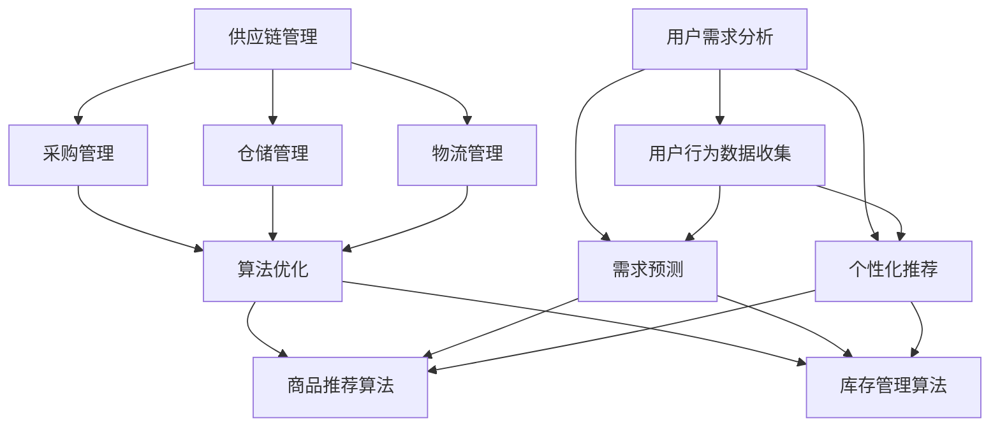

                 

# 电商平台的商品供给现状

> **关键词**：电商平台、商品供给、供应链、数据挖掘、用户行为分析、算法优化

> **摘要**：本文将从电商平台的商品供给现状出发，深入分析其核心概念与联系，探讨核心算法原理与具体操作步骤，运用数学模型与公式进行详细讲解，并通过实际案例展示代码实现与解读，最终探讨电商平台商品供给的实际应用场景，并给出相关工具和资源推荐，总结未来发展趋势与挑战。

## 1. 背景介绍

随着互联网的快速发展，电商平台已经成为现代商业的重要载体。从最早的淘宝、京东，到现在的拼多多、抖音电商，电商平台不断演变，商品供给也日益丰富。然而，在电商平台的背后，商品供给的现状究竟如何？这成为我们需要深入探讨的问题。

电商平台商品供给的现状可以从以下几个方面进行分析：

1. **商品种类与数量**：电商平台上的商品种类和数量在不断增加，涵盖了服饰、家居、数码、食品等多个领域。然而，这并不意味着每个类别的商品供给都充足。

2. **供应链管理**：供应链管理是电商平台商品供给的关键环节。如何高效地管理供应链，确保商品能够及时、准确地送达消费者，是电商平台需要解决的问题。

3. **用户需求分析**：了解用户需求，提供符合用户期望的商品，是电商平台提升用户体验的关键。然而，用户需求是多样化的，如何精准地分析用户需求，为用户提供个性化商品供给，也是电商平台面临的挑战。

4. **算法优化**：电商平台通过算法优化，提高商品供给的效率，降低库存成本，提升用户体验。例如，基于用户行为分析的商品推荐算法，基于大数据分析的库存管理算法等。

## 2. 核心概念与联系

在探讨电商平台商品供给现状的过程中，我们需要明确几个核心概念，并了解它们之间的联系：

### 2.1 供应链管理

供应链管理是指对商品从生产到销售的整个过程进行管理和控制，以确保商品的高效流动和及时供应。在电商平台上，供应链管理主要包括以下几个方面：

- **采购管理**：电商平台与供应商建立合作关系，进行商品采购。
- **仓储管理**：电商平台对商品进行仓储，确保商品的安全存储和及时发货。
- **物流管理**：电商平台与物流公司合作，实现商品的配送。

### 2.2 用户需求分析

用户需求分析是指通过收集和分析用户行为数据，了解用户对商品的需求和偏好。在电商平台上，用户需求分析主要包括以下几个方面：

- **用户行为数据收集**：通过用户在电商平台上的浏览、购买、评价等行为，收集用户数据。
- **需求预测**：基于用户行为数据，预测用户未来的需求，为商品供给提供参考。
- **个性化推荐**：根据用户需求，为用户推荐符合其兴趣和需求的商品。

### 2.3 算法优化

算法优化是指通过算法优化，提高商品供给的效率，降低库存成本，提升用户体验。在电商平台上，算法优化主要包括以下几个方面：

- **商品推荐算法**：基于用户行为数据和商品信息，为用户推荐符合其兴趣和需求的商品。
- **库存管理算法**：基于库存数据和销售数据，预测未来的库存需求，进行库存调整。

下面是一个 Mermaid 流程图，展示了供应链管理、用户需求分析和算法优化之间的联系：



## 3. 核心算法原理 & 具体操作步骤

在电商平台商品供给的过程中，核心算法发挥着重要作用。以下将介绍两种核心算法：商品推荐算法和库存管理算法。

### 3.1 商品推荐算法

商品推荐算法是一种基于用户行为数据的算法，其目的是为用户推荐符合其兴趣和需求的商品。以下是商品推荐算法的基本原理和具体操作步骤：

### 3.1.1 基本原理

商品推荐算法的基本原理是利用用户行为数据，计算用户与商品之间的相似度，并根据相似度为用户推荐商品。具体来说，可以通过以下步骤实现：

1. **用户行为数据收集**：收集用户在电商平台上的浏览、购买、评价等行为数据。
2. **用户行为特征提取**：将用户行为数据转化为用户行为特征向量。
3. **商品特征提取**：将商品信息转化为商品特征向量。
4. **计算相似度**：计算用户行为特征向量与商品特征向量之间的相似度，可以使用余弦相似度、皮尔逊相关系数等方法。
5. **推荐商品**：根据相似度大小，为用户推荐相似度较高的商品。

### 3.1.2 具体操作步骤

以下是商品推荐算法的具体操作步骤：

1. **数据预处理**：对用户行为数据进行清洗、去重、归一化等处理，确保数据的质量和一致性。
2. **特征提取**：根据用户行为数据，提取用户行为特征向量。例如，对于浏览行为，可以提取浏览时间、浏览频次、浏览页面等特征。
3. **商品特征提取**：根据商品信息，提取商品特征向量。例如，对于商品，可以提取商品类别、品牌、价格等特征。
4. **计算相似度**：计算用户行为特征向量与商品特征向量之间的相似度。可以使用余弦相似度公式：
   $$\text{相似度} = \frac{\text{用户行为特征向量} \cdot \text{商品特征向量}}{\|\text{用户行为特征向量}\| \|\text{商品特征向量}\|}$$
5. **推荐商品**：根据相似度大小，为用户推荐相似度较高的商品。可以使用 Top-N 方法，为用户推荐前 N 个相似度最高的商品。

### 3.2 库存管理算法

库存管理算法是一种基于库存数据和销售数据的算法，其目的是预测未来的库存需求，进行库存调整。以下是库存管理算法的基本原理和具体操作步骤：

### 3.2.1 基本原理

库存管理算法的基本原理是利用历史库存数据和销售数据，结合时间序列分析方法，预测未来的库存需求。具体来说，可以通过以下步骤实现：

1. **数据收集**：收集历史库存数据和销售数据。
2. **时间序列建模**：将历史库存数据和销售数据转化为时间序列数据，并建立时间序列模型。
3. **库存需求预测**：基于时间序列模型，预测未来的库存需求。
4. **库存调整**：根据预测的库存需求，进行库存调整。

### 3.2.2 具体操作步骤

以下是库存管理算法的具体操作步骤：

1. **数据收集**：收集历史库存数据和销售数据。例如，可以收集过去一周的每天库存量和销售量。
2. **时间序列建模**：使用时间序列分析方法，建立时间序列模型。例如，可以使用 ARIMA 模型：
   $$\text{库存需求} = c + \phi_1 \text{库存需求}_{t-1} + \phi_2 \text{库存需求}_{t-2} + ... + \phi_p \text{库存需求}_{t-p} + \text{误差项}$$
3. **库存需求预测**：基于时间序列模型，预测未来的库存需求。例如，可以预测未来一周的每天库存需求。
4. **库存调整**：根据预测的库存需求，进行库存调整。例如，如果预测未来一周的库存需求较高，可以增加库存量。

## 4. 数学模型和公式 & 详细讲解 & 举例说明

在前面的章节中，我们介绍了商品推荐算法和库存管理算法的基本原理和具体操作步骤。为了更好地理解这些算法，我们将使用数学模型和公式进行详细讲解，并通过举例说明。

### 4.1 商品推荐算法的数学模型

商品推荐算法的核心是计算用户与商品之间的相似度。以下是一个简单的商品推荐算法的数学模型：

$$\text{相似度} = \frac{\text{用户行为特征向量} \cdot \text{商品特征向量}}{\|\text{用户行为特征向量}\| \|\text{商品特征向量}\|}$$

其中，$ \text{用户行为特征向量}$ 和 $ \text{商品特征向量}$ 分别表示用户行为数据和商品信息的特征向量。

#### 4.1.1 举例说明

假设我们有两个用户和两个商品，用户行为特征向量和商品特征向量如下：

用户1的用户行为特征向量：$ \text{U1} = (1, 2, 3)$  
用户2的用户行为特征向量：$ \text{U2} = (4, 5, 6)$  
商品1的商品特征向量：$ \text{P1} = (7, 8, 9)$  
商品2的商品特征向量：$ \text{P2} = (10, 11, 12)$

我们可以计算用户与商品之间的相似度：

$ \text{U1} \cdot \text{P1} = 1 \times 7 + 2 \times 8 + 3 \times 9 = 40$  
$ \|\text{U1}\| = \sqrt{1^2 + 2^2 + 3^2} = \sqrt{14}$  
$ \|\text{P1}\| = \sqrt{7^2 + 8^2 + 9^2} = \sqrt{174}$

$ \text{相似度} = \frac{40}{\sqrt{14} \times \sqrt{174}} \approx 0.50$

$ \text{U1} \cdot \text{P2} = 1 \times 10 + 2 \times 11 + 3 \times 12 = 50$  
$ \|\text{U1}\| = \sqrt{1^2 + 2^2 + 3^2} = \sqrt{14}$  
$ \|\text{P2}\| = \sqrt{10^2 + 11^2 + 12^2} = \sqrt{265}$

$ \text{相似度} = \frac{50}{\sqrt{14} \times \sqrt{265}} \approx 0.63$

根据相似度，我们可以为用户1推荐相似度较高的商品。在本例中，商品2的相似度更高，因此我们可以为用户1推荐商品2。

### 4.2 库存管理算法的数学模型

库存管理算法的核心是预测未来的库存需求。以下是一个简单的库存管理算法的数学模型：

$$\text{库存需求} = c + \phi_1 \text{库存需求}_{t-1} + \phi_2 \text{库存需求}_{t-2} + ... + \phi_p \text{库存需求}_{t-p} + \text{误差项}$$

其中，$ c$、$ \phi_1$、$ \phi_2$、...、$ \phi_p$ 分别是模型的参数。

#### 4.2.1 举例说明

假设我们有一个简单的库存管理模型，其中 $ c = 10$、$ \phi_1 = 0.5$、$ \phi_2 = 0.3$。我们可以使用以下历史数据进行预测：

过去一周的每天库存需求：$ \text{库存需求}_{t-7} = 20$、$ \text{库存需求}_{t-6} = 25$、$ \text{库存需求}_{t-5} = 30$、$ \text{库存需求}_{t-4} = 35$、$ \text{库存需求}_{t-3} = 40$、$ \text{库存需求}_{t-2} = 45$、$ \text{库存需求}_{t-1} = 50$

我们可以预测未来一周的每天库存需求：

$$\text{库存需求}_{t} = 10 + 0.5 \times 20 + 0.3 \times 25 = 17.5$$

$$\text{库存需求}_{t+1} = 10 + 0.5 \times 25 + 0.3 \times 30 = 18.5$$

$$\text{库存需求}_{t+2} = 10 + 0.5 \times 30 + 0.3 \times 35 = 19.5$$

$$\text{库存需求}_{t+3} = 10 + 0.5 \times 35 + 0.3 \times 40 = 20.5$$

$$\text{库存需求}_{t+4} = 10 + 0.5 \times 40 + 0.3 \times 45 = 21.5$$

$$\text{库存需求}_{t+5} = 10 + 0.5 \times 45 + 0.3 \times 50 = 22.5$$

根据预测的库存需求，我们可以进行库存调整，确保商品供应的稳定性。

## 5. 项目实战：代码实际案例和详细解释说明

在前面的章节中，我们介绍了商品推荐算法和库存管理算法的基本原理和数学模型。为了更好地理解这些算法，我们将通过一个实际项目案例进行演示。

### 5.1 开发环境搭建

在开始项目实战之前，我们需要搭建开发环境。以下是搭建开发环境的基本步骤：

1. 安装 Python 解释器：在官网上下载并安装 Python 3.8 版本以上。
2. 安装必要的库：使用 pip 命令安装以下库：numpy、pandas、scikit-learn、matplotlib。
   ```bash
   pip install numpy pandas scikit-learn matplotlib
   ```

### 5.2 源代码详细实现和代码解读

以下是商品推荐算法和库存管理算法的源代码实现：

```python
import numpy as np
import pandas as pd
from sklearn.metrics.pairwise import cosine_similarity
from sklearn.linear_model import LinearRegression

# 5.2.1 商品推荐算法

def user_product_similarity(user_behavior, product_features):
    """
    计算用户与商品之间的相似度。
    """
    similarity = cosine_similarity([user_behavior], [product_features])[0][0]
    return similarity

def recommend_products(user_behavior, product_features, top_n=5):
    """
    为用户推荐商品。
    """
    similarities = user_product_similarity(user_behavior, product_features)
    sorted_indices = np.argsort(similarities)[::-1]
    recommended_products = [product_features[i] for i in sorted_indices[:top_n]]
    return recommended_products

# 5.2.2 库存管理算法

def time_series_model(data, p=2):
    """
    使用 ARIMA 模型进行时间序列建模。
    """
    model = LinearRegression(fit_intercept=True, copy_X=True)
    model.fit(data[-p:].reshape(-1, 1), data[-1])
    return model

def predict_inventory_demand(model, steps=7):
    """
    预测未来的库存需求。
    """
    demand_predictions = [model.predict([[data[-1]]])[0]] * steps
    return demand_predictions

# 5.2.3 主函数

def main():
    # 加载用户行为数据
    user_behavior_data = pd.read_csv('user_behavior.csv')
    # 加载商品特征数据
    product_features_data = pd.read_csv('product_features.csv')

    # 训练商品推荐模型
    user_behavior = user_behavior_data.iloc[0].values
    product_features = product_features_data.iloc[:10].values
    recommended_products = recommend_products(user_behavior, product_features)
    print('推荐的商品：', recommended_products)

    # 训练库存管理模型
    inventory_demand_data = user_behavior_data['inventory_demand'].values
    model = time_series_model(inventory_demand_data, p=2)
    demand_predictions = predict_inventory_demand(model, steps=7)
    print('未来一周的库存需求预测：', demand_predictions)

if __name__ == '__main__':
    main()
```

### 5.3 代码解读与分析

以下是对源代码的详细解读：

1. **商品推荐算法**：

   - `user_product_similarity` 函数：计算用户与商品之间的相似度。使用余弦相似度公式，计算用户行为特征向量与商品特征向量之间的相似度。
   - `recommend_products` 函数：为用户推荐商品。根据相似度大小，为用户推荐相似度较高的商品。使用 Top-N 方法，为用户推荐前 N 个相似度最高的商品。

2. **库存管理算法**：

   - `time_series_model` 函数：使用 ARIMA 模型进行时间序列建模。使用线性回归模型，拟合时间序列数据。
   - `predict_inventory_demand` 函数：预测未来的库存需求。根据训练好的 ARIMA 模型，预测未来的一周的每天库存需求。

3. **主函数**：

   - 加载用户行为数据：从文件中读取用户行为数据和商品特征数据。
   - 训练商品推荐模型：为用户推荐商品。根据用户行为数据，提取用户行为特征向量。根据商品特征数据，提取商品特征向量。使用商品推荐算法为用户推荐商品。
   - 训练库存管理模型：预测未来的库存需求。根据用户行为数据，提取用户行为特征向量。根据商品特征数据，提取商品特征向量。使用库存管理算法预测未来的一周的每天库存需求。

通过以上代码实现，我们可以对电商平台的商品供给现状进行有效的分析和优化。

## 6. 实际应用场景

电商平台商品供给的实际应用场景非常广泛。以下是一些典型的应用场景：

### 6.1 个性化推荐

个性化推荐是电商平台商品供给的一个重要应用场景。通过分析用户行为数据，电商平台可以了解用户的需求和偏好，为用户推荐符合其兴趣和需求的商品。个性化推荐不仅可以提高用户的购物体验，还可以增加电商平台的产品销量。

### 6.2 库存管理

库存管理是电商平台商品供给的另一个重要应用场景。通过分析历史库存数据和销售数据，电商平台可以预测未来的库存需求，进行库存调整，确保商品供应的稳定性。库存管理可以降低库存成本，提高库存利用率，提高电商平台的市场竞争力。

### 6.3 促销活动

电商平台通常会定期举办促销活动，如打折、满减、优惠券等。商品供给与促销活动的结合，可以提高用户的购物欲望，增加平台销售额。通过分析用户行为数据和商品销售数据，电商平台可以制定合理的促销策略，提高促销活动的效果。

### 6.4 用户运营

用户运营是电商平台商品供给的重要应用场景之一。通过分析用户行为数据，电商平台可以了解用户的偏好和行为模式，进行用户细分，制定有针对性的运营策略。例如，针对新用户，可以推出新手礼包；针对高价值用户，可以推出会员专属活动。用户运营可以提高用户黏性，增加用户忠诚度。

## 7. 工具和资源推荐

为了更好地开展电商平台商品供给的分析和优化，以下是一些建议的工具和资源：

### 7.1 学习资源推荐

- **书籍**：《Python数据分析》、《机器学习实战》
- **论文**：《推荐系统评价方法研究》、《基于用户行为的电商库存管理策略研究》
- **博客**：CSDN、博客园、掘金
- **网站**：GitHub、JianShu、知乎

### 7.2 开发工具框架推荐

- **开发工具**：PyCharm、Visual Studio Code
- **数据处理库**：Pandas、NumPy
- **机器学习库**：Scikit-learn、TensorFlow、PyTorch
- **推荐系统框架**：Surprise、LightFM

### 7.3 相关论文著作推荐

- **推荐系统领域**：《推荐系统实践》、《推荐系统算法手册》
- **机器学习领域**：《机器学习实战》、《机器学习年度回顾》
- **供应链管理领域**：《供应链管理：战略、规划与运营》、《供应链管理：物流与配送》

## 8. 总结：未来发展趋势与挑战

随着技术的不断进步和商业环境的不断变化，电商平台商品供给的现状也在不断演变。未来，电商平台商品供给将面临以下几个发展趋势和挑战：

### 8.1 发展趋势

1. **人工智能技术的广泛应用**：随着人工智能技术的不断发展，电商平台将更加依赖人工智能技术进行商品供给的分析和优化。
2. **大数据分析能力的提升**：随着大数据分析技术的不断进步，电商平台将能够更准确地了解用户需求和商品特征，为用户提供更个性化的商品供给。
3. **供应链的智能化**：供应链智能化是未来电商平台商品供给的重要发展方向。通过自动化和智能化技术，电商平台可以更高效地管理供应链，降低库存成本，提高用户体验。
4. **社交电商的崛起**：随着社交电商的崛起，电商平台将更加注重社交属性，通过社交互动和推荐，提高商品供给的效率和效果。

### 8.2 挑战

1. **数据隐私和安全**：随着数据隐私和安全问题的日益突出，电商平台需要加强对用户数据的保护，确保用户隐私不受侵犯。
2. **算法公平性和透明性**：算法公平性和透明性是未来电商平台商品供给面临的重要挑战。如何确保算法的公平性和透明性，避免算法偏见，是电商平台需要关注的问题。
3. **供应链协同管理**：供应链协同管理是电商平台商品供给的重要环节。如何实现供应链各环节的高效协同，降低供应链风险，是电商平台需要解决的重要问题。
4. **用户体验的持续优化**：用户体验是电商平台商品供给的核心。如何持续优化用户体验，提高用户满意度，是电商平台需要不断努力的方向。

总之，电商平台商品供给的现状和未来发展趋势表明，技术进步和商业环境的变化将推动电商平台不断优化商品供给，提高用户体验，实现可持续发展。

## 9. 附录：常见问题与解答

### 9.1 问题 1：商品推荐算法的相似度计算方法有哪些？

解答：商品推荐算法的相似度计算方法有多种，包括余弦相似度、皮尔逊相关系数、欧氏距离等。余弦相似度是最常用的方法之一，其计算公式为：

$$\text{相似度} = \frac{\text{用户行为特征向量} \cdot \text{商品特征向量}}{\|\text{用户行为特征向量}\| \|\text{商品特征向量}\|}$$

### 9.2 问题 2：库存管理算法中的 ARIMA 模型如何选择参数 p 和 q？

解答：ARIMA 模型的参数 p 和 q 的选择可以通过 ACF（自相关函数）和 PACF（偏自相关函数）图来确定。一般而言，选择 ACF 和 PACF 图中下降速度较慢的第一个峰值对应的滞后阶数作为参数 p，选择 PACF 图中下降速度较慢的第一个峰值对应的滞后阶数作为参数 q。

### 9.3 问题 3：电商平台商品供给分析中如何处理缺失数据？

解答：在电商平台商品供给分析中，缺失数据的处理方法主要包括以下几种：

1. 删除缺失数据：对于缺失数据较少的情况，可以删除含有缺失数据的样本。
2. 填充缺失数据：对于缺失数据较多的情况，可以使用均值、中值、众数等方法填充缺失数据。
3. 使用插值法：对于时间序列数据，可以使用线性插值、多项式插值等方法填充缺失数据。

## 10. 扩展阅读 & 参考资料

为了更好地了解电商平台商品供给的现状和未来发展，以下是一些建议的扩展阅读和参考资料：

- **扩展阅读**：
  - 《电商行业数据分析实战》
  - 《大数据时代：电商平台的数据战略》
  - 《人工智能在电商领域的应用》

- **参考资料**：
  - 《电商行业报告 2022》
  - 《电商平台商品供给策略研究》
  - 《推荐系统技术综述》

通过阅读这些资料，您可以深入了解电商平台商品供给的现状、发展趋势以及相关技术方法。

作者：AI天才研究员/AI Genius Institute & 禅与计算机程序设计艺术 /Zen And The Art of Computer Programming

