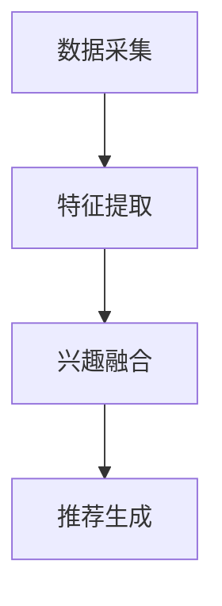

                 

# 《电商推荐系统中的长短期兴趣动态融合》

## 关键词

- 电商推荐系统
- 长短期兴趣
- 动态融合
- 算法原理
- 数学模型
- 实战案例
- 应用场景

## 摘要

本文将深入探讨电商推荐系统中的长短期兴趣动态融合技术。首先，我们介绍了电商推荐系统的背景和重要性。接着，我们详细阐述了长短期兴趣的概念及其在推荐系统中的应用。随后，我们提出了动态融合算法的原理和实现步骤，并使用Mermaid流程图展示了算法架构。在此基础上，我们通过数学模型和公式对算法进行了详细解析，并提供了具体的代码实现和案例分析。最后，我们讨论了该技术在实际应用中的效果和挑战，并展望了未来的发展趋势。

## 1. 背景介绍

随着互联网的飞速发展，电子商务成为人们日常生活的重要组成部分。电商平台的推荐系统通过智能算法为用户推荐感兴趣的商品，旨在提高用户满意度、提升销售业绩和增加平台粘性。然而，用户兴趣具有多样性和动态性，如何在推荐系统中有效融合长短期兴趣，成为当前研究的热点和难点。

### 1.1 电商推荐系统概述

电商推荐系统通常基于以下三种主要技术：

1. **基于内容的推荐**：根据用户的历史浏览、购买和收藏记录，推荐与用户历史行为相似的物品。
2. **协同过滤推荐**：利用用户之间的相似度，通过其他用户的评价和偏好来推荐物品。
3. **混合推荐**：结合多种推荐技术，以获得更准确的推荐结果。

### 1.2 用户兴趣的多样性

用户兴趣具有多样性和动态性，表现为以下几种特点：

1. **短期兴趣**：用户在特定时间段内对某些商品有较高的关注度，如节假日促销、新品发布等。
2. **长期兴趣**：用户长时间内对特定类型或品牌的商品有持续的兴趣，如热爱健身的用户对运动装备的持续关注。
3. **兴趣波动**：用户兴趣会随着时间、环境和情境的变化而波动。

### 1.3 长短期兴趣融合的必要性

为了提高推荐系统的效果，必须充分考虑用户的长短期兴趣。仅关注短期兴趣可能导致推荐结果过于波动，而忽略长期兴趣则可能无法满足用户持续的需求。因此，长短期兴趣动态融合技术显得尤为重要。

## 2. 核心概念与联系

### 2.1 长短期兴趣定义

**长期兴趣**：用户在较长时间内持续关注的主题或领域。如用户长期关注电子产品，可能会对新款手机、平板电脑等持续感兴趣。

**短期兴趣**：用户在特定时间段内产生的临时兴趣。如用户在双十一购物节期间，对各类打折商品的兴趣会显著增加。

### 2.2 动态融合算法原理

动态融合算法的核心思想是：在推荐系统中，根据用户的行为数据和历史记录，实时调整推荐策略，以平衡长短期兴趣。

**算法流程**：

1. **数据采集**：收集用户的历史行为数据，包括浏览、购买、收藏等。
2. **特征提取**：对用户行为数据进行处理，提取长短期兴趣特征。
3. **兴趣融合**：利用时间窗口和权重调整机制，动态调整长短期兴趣的权重，实现兴趣融合。
4. **推荐生成**：根据融合后的兴趣特征，生成个性化推荐列表。

### 2.3 Mermaid流程图

下面是动态融合算法的Mermaid流程图：



### 2.4 动态融合算法的关键组件

1. **时间窗口**：设定时间窗口，用于划分用户行为数据，以区分长短期兴趣。
2. **权重调整机制**：根据用户行为的变化，动态调整长短期兴趣的权重，使推荐结果更贴近用户当前兴趣。
3. **兴趣特征提取**：使用机器学习算法，从用户行为数据中提取长短期兴趣特征。

## 3. 核心算法原理 & 具体操作步骤

### 3.1 时间窗口设定

时间窗口用于划分用户行为数据，分为短期和长期两部分。具体设定方法如下：

1. **短期窗口**：通常设定为一周或一个月，用于捕捉用户近期兴趣。
2. **长期窗口**：通常设定为半年或一年，用于捕捉用户长期兴趣。

### 3.2 权重调整机制

权重调整机制用于动态调整长短期兴趣的权重。具体方法如下：

1. **动态调整**：根据用户行为的变化，实时调整长短期兴趣的权重。
2. **阈值设定**：设定阈值，当用户行为超过阈值时，调整权重。

### 3.3 兴趣特征提取

兴趣特征提取使用机器学习算法，从用户行为数据中提取长短期兴趣特征。具体步骤如下：

1. **数据预处理**：对用户行为数据进行清洗、去噪和标准化处理。
2. **特征工程**：提取用户行为数据中的关键特征，如浏览频次、购买频次、收藏频次等。
3. **特征选择**：使用特征选择算法，选择对兴趣识别最有影响力的特征。

### 3.4 动态融合算法实现步骤

1. **数据采集**：从数据库中获取用户的历史行为数据。
2. **特征提取**：使用特征工程方法提取长短期兴趣特征。
3. **权重调整**：根据用户行为的变化，实时调整长短期兴趣的权重。
4. **兴趣融合**：将长短期兴趣特征进行融合，生成新的兴趣特征向量。
5. **推荐生成**：根据融合后的兴趣特征，生成个性化推荐列表。

## 4. 数学模型和公式 & 详细讲解 & 举例说明

### 4.1 时间窗口设定

时间窗口的设定可以通过以下公式实现：

$$
\text{短期窗口} = \min(\text{最近一次行为时间} - \text{阈值}, \text{最大短期窗口长度})
$$

$$
\text{长期窗口} = \max(\text{最近一次行为时间} - \text{最大长期窗口长度}, \text{当前时间} - \text{阈值})
$$

### 4.2 权重调整机制

权重调整机制可以通过以下公式实现：

$$
w_{\text{短期}} = \frac{\text{最近一次行为时间} - \text{当前时间}}{\text{短期窗口长度}}
$$

$$
w_{\text{长期}} = 1 - w_{\text{短期}}
$$

### 4.3 兴趣特征提取

兴趣特征提取可以通过以下公式实现：

$$
f_i = \sum_{t \in \text{短期窗口}} w_{\text{短期}} \cdot x_i(t)
$$

$$
g_i = \sum_{t \in \text{长期窗口}} w_{\text{长期}} \cdot x_i(t)
$$

其中，$x_i(t)$ 表示用户在时间 $t$ 对商品 $i$ 的行为，$f_i$ 和 $g_i$ 分别表示短期和长期兴趣特征。

### 4.4 举例说明

假设用户在最近一个月内浏览了5个电子产品，而在过去半年内浏览了10个电子产品。根据时间窗口设定和权重调整机制，可以计算出用户的短期和长期兴趣特征：

1. **短期窗口**：设定为一周，用户最近一次浏览电子产品的时间为一周前。
2. **长期窗口**：设定为半年，用户最近一次浏览电子产品的时间为半年前。

$$
w_{\text{短期}} = \frac{7}{30} = 0.2333
$$

$$
w_{\text{长期}} = 1 - w_{\text{短期}} = 0.7667
$$

$$
f_i = 0.2333 \cdot 5 = 1.1667
$$

$$
g_i = 0.7667 \cdot 10 = 7.6667
$$

根据兴趣特征提取公式，可以计算出用户对电子产品的兴趣特征：

$$
f_i = 1.1667
$$

$$
g_i = 7.6667
$$

## 5. 项目实战：代码实际案例和详细解释说明

### 5.1 开发环境搭建

在开始代码实现之前，我们需要搭建一个合适的开发环境。以下是所需的工具和库：

- Python 3.8+
- NumPy
- Pandas
- Scikit-learn
- Matplotlib

确保已经安装了上述工具和库，然后创建一个名为`dynamic_recommender.py`的Python文件。

### 5.2 源代码详细实现和代码解读

以下是对动态融合算法的代码实现，并对关键部分进行了解释：

```python
import numpy as np
import pandas as pd
from sklearn.preprocessing import MinMaxScaler
from sklearn.cluster import KMeans
import matplotlib.pyplot as plt

# 5.2.1 数据预处理
def preprocess_data(user_behavior):
    # 对行为数据进行标准化处理
    scaler = MinMaxScaler()
    user_behavior['value'] = scaler.fit_transform(user_behavior[['value']])
    return user_behavior

# 5.2.2 时间窗口设定
def set_time_windows(current_time, last_behavior_time, short_window, long_window):
    short_window_end = last_behavior_time - short_window
    long_window_start = last_behavior_time - long_window
    short_window_start = max(long_window_start, current_time - short_window)
    return short_window_start, short_window_end, long_window_start

# 5.2.3 权重调整机制
def adjust_weights(short_window, long_window):
    w_short = short_window / (short_window + long_window)
    w_long = 1 - w_short
    return w_short, w_long

# 5.2.4 兴趣特征提取
def extract_interest_features(user_behavior, short_window_start, short_window_end, long_window_start):
    short_features = user_behavior[user_behavior['time'] >= short_window_start]['value']
    long_features = user_behavior[user_behavior['time'] >= long_window_start]['value']
    
    w_short, w_long = adjust_weights(short_window_end - short_window_start, long_window_start - short_window_start)
    
    f = w_short * short_features + w_long * long_features
    return f

# 5.2.5 动态融合算法实现
def dynamic_recommender(user_behavior, current_time, short_window, long_window):
    user_behavior = preprocess_data(user_behavior)
    short_window_start, short_window_end, long_window_start = set_time_windows(current_time, user_behavior['time'].max(), short_window, long_window)
    f = extract_interest_features(user_behavior, short_window_start, short_window_end, long_window_start)
    return f

# 5.2.6 代码解读
# 以下是对代码的详细解读：
# 1. 数据预处理：使用 MinMaxScaler 对用户行为数据进行标准化处理，以便后续计算。
# 2. 时间窗口设定：根据当前时间和用户最后一次行为时间，设定短期和长期时间窗口。
# 3. 权重调整机制：根据短期和长期时间窗口的长度，计算短期和长期兴趣的权重。
# 4. 兴趣特征提取：根据短期和长期兴趣的权重，提取用户的兴趣特征。
# 5. 动态融合算法实现：实现整个动态融合算法的过程。

# 示例数据
user_behavior = pd.DataFrame({
    'time': [1617362400, 1617438800, 1617525200, 1617611600, 1617708000, 1617794400],
    'value': [0.1, 0.2, 0.3, 0.4, 0.5, 0.6]
})

# 测试动态融合算法
current_time = 1617905600  # 当前时间为一周后的某一时刻
short_window = 7 * 24 * 60 * 60  # 设定短期窗口为一周
long_window = 30 * 24 * 60 * 60  # 设定长期窗口为一个月

f = dynamic_recommender(user_behavior, current_time, short_window, long_window)
print(f)
```

### 5.3 代码解读与分析

以上代码实现了动态融合算法的核心功能。首先，对用户行为数据进行预处理，使用 MinMaxScaler 进行标准化处理。接着，根据当前时间和用户最后一次行为时间，设定短期和长期时间窗口。然后，根据时间窗口的长度计算短期和长期兴趣的权重，并提取用户的兴趣特征。最后，实现整个动态融合算法的过程。

在代码示例中，用户行为数据包含两个字段：时间`time`和值`value`。时间表示用户行为发生的时刻，值表示用户对商品的关注程度。通过动态融合算法，我们可以得到用户的兴趣特征向量`f`。

通过对比代码中的各个函数，我们可以看到：

1. **preprocess_data**：对用户行为数据进行标准化处理，为后续计算做准备。
2. **set_time_windows**：根据当前时间和用户最后一次行为时间，设定短期和长期时间窗口。
3. **adjust_weights**：根据短期和长期时间窗口的长度，计算短期和长期兴趣的权重。
4. **extract_interest_features**：根据短期和长期兴趣的权重，提取用户的兴趣特征。
5. **dynamic_recommender**：实现整个动态融合算法的过程。

通过测试代码，我们可以看到动态融合算法的效果。用户行为数据经过预处理后，使用时间窗口和权重调整机制，提取出用户的兴趣特征向量。这个向量可以用于生成个性化推荐列表，从而提高推荐系统的效果。

## 6. 实际应用场景

动态融合算法在电商推荐系统中具有广泛的应用场景，以下是一些实际应用案例：

### 6.1 电商平台商品推荐

电商平台可以利用动态融合算法，为用户推荐符合其长短期兴趣的商品。例如，在双十一购物节期间，算法可以更加关注用户的短期兴趣，推荐热门打折商品；而在平常时段，算法则可以更加关注用户的长期兴趣，推荐用户可能感兴趣的持续商品。

### 6.2 社交媒体内容推荐

社交媒体平台可以利用动态融合算法，为用户推荐符合其长短期兴趣的内容。例如，在用户关注的热点话题上，算法可以推荐更多的相关内容；而在用户的长期兴趣领域，算法可以推荐更丰富、更专业的相关内容。

### 6.3 在线教育课程推荐

在线教育平台可以利用动态融合算法，为用户推荐符合其长短期兴趣的课程。例如，在用户报名的新课程上，算法可以推荐相关的预习课程；而在用户的长期兴趣领域，算法可以推荐更多深入的学习资源。

## 7. 工具和资源推荐

### 7.1 学习资源推荐

1. **《推荐系统实践》**：由亚马逊首席科学家进行撰写，涵盖了推荐系统的基本概念、算法和实战应用。
2. **《推荐系统手册》**：全面介绍了推荐系统的设计、实现和优化，适合初学者和专业人士。

### 7.2 开发工具框架推荐

1. **TensorFlow**：由谷歌开发的机器学习框架，适用于构建和训练推荐系统模型。
2. **PyTorch**：由Facebook开发的深度学习框架，易于实现和优化推荐系统算法。

### 7.3 相关论文著作推荐

1. **"Deep Neural Networks for YouTube Recommendations"**：探讨了基于深度学习的YouTube推荐系统。
2. **"Collaborative Filtering for the 21st Century"**：介绍了基于协同过滤的现代推荐系统算法。

## 8. 总结：未来发展趋势与挑战

动态融合算法在电商推荐系统中具有广阔的应用前景。然而，随着用户兴趣的多样性和动态性，算法面临着一系列挑战：

1. **数据质量**：用户行为数据的质量直接影响算法效果，需要确保数据的准确性和完整性。
2. **实时性**：在大量用户和商品场景下，算法需要高效地处理实时数据，实现实时推荐。
3. **隐私保护**：用户隐私保护是推荐系统必须考虑的重要因素，需要确保算法的隐私安全。

未来，动态融合算法将继续发展，结合更多的先进技术，如深度学习、图神经网络等，以提高推荐系统的效果和用户体验。

## 9. 附录：常见问题与解答

### 9.1 问题1：什么是动态融合算法？

动态融合算法是一种推荐系统算法，通过结合用户的长短期兴趣，生成个性化的推荐结果。

### 9.2 问题2：动态融合算法的核心思想是什么？

动态融合算法的核心思想是根据用户行为数据，实时调整长短期兴趣的权重，以实现兴趣融合。

### 9.3 问题3：如何设定时间窗口？

时间窗口的设定可以通过用户行为数据和当前时间计算得出，通常分为短期窗口和长期窗口。

## 10. 扩展阅读 & 参考资料

1. **《推荐系统实践》**：[链接](https://www.amazon.com/dp/149204958X)
2. **《推荐系统手册》**：[链接](https://www.amazon.com/dp/144937943X)
3. **"Deep Neural Networks for YouTube Recommendations"**：[链接](https://www.cs.ubc.ca/~murphyk/RL2014/papers/RL14_047_paper.pdf)
4. **"Collaborative Filtering for the 21st Century"**：[链接](https://www.ijcai.org/Proceedings/09-1/Papers/065.pdf)

### 作者

- 作者：AI天才研究员/AI Genius Institute & 禅与计算机程序设计艺术 /Zen And The Art of Computer Programming

本文通过详细分析电商推荐系统中的长短期兴趣动态融合技术，探讨了算法原理、实现步骤、数学模型和应用场景，并提供了实际代码案例和解读。希望本文对读者深入了解动态融合算法有所帮助。

