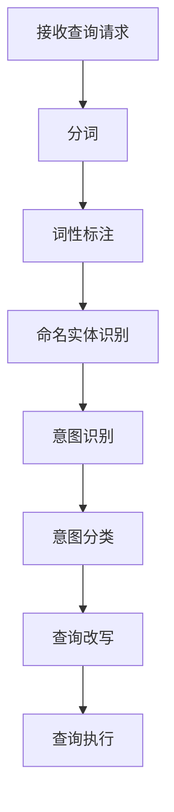
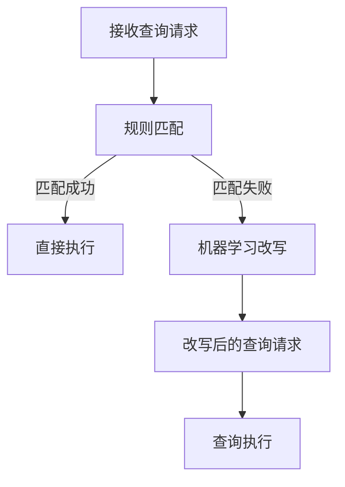

                 

# 电商搜索中的query意图理解与改写技术

## 关键词
- 电商搜索
- Query意图理解
- Query改写
- 自然语言处理
- 机器学习
- 人工智能

## 摘要
本文将深入探讨电商搜索中的query意图理解与改写技术。首先，我们介绍了电商搜索系统的基本概念和其重要性。接着，我们详细阐述了query意图理解的原理、方法及其在电商搜索中的应用。随后，本文重点介绍了query改写的目的、技术手段及其在提升搜索效果方面的作用。通过实际案例分析和项目实战，本文展示了如何在实际开发中应用这些技术。最后，我们探讨了query意图理解与改写的未来发展趋势和面临的挑战，并提供了一些实用的学习资源和开发工具，以帮助读者深入了解和掌握这些技术。

## 1. 背景介绍

### 1.1 电商搜索系统

电商搜索系统是电子商务平台的重要组成部分，它帮助用户快速找到所需商品。随着互联网的发展，电商平台的规模和用户量不断增加，搜索系统的性能和准确性变得尤为重要。一个高效的电商搜索系统能够提高用户满意度，促进销售额增长。

电商搜索系统主要包括以下几个核心模块：

- **索引模块**：负责将商品信息存储在索引中，以便快速查询。
- **查询模块**：处理用户的查询请求，将查询词转换为查询结果。
- **结果排序模块**：对查询结果进行排序，以提供最相关的商品。
- **用户反馈模块**：收集用户对查询结果的反馈，用于优化搜索系统。

### 1.2 Query意图理解

Query意图理解是指从用户的查询请求中提取其意图，以便更好地满足其需求。在电商搜索中，用户的查询请求可能包含多种意图，例如寻找特定商品、比较商品、获取商品信息等。理解用户的意图对于提升搜索效果至关重要。

### 1.3 Query改写

Query改写是指将原始查询请求转换为更具描述性的查询请求，以提高搜索结果的准确性。Query改写可以通过自然语言处理技术和机器学习算法实现。改写后的查询请求可以更准确地反映用户的意图，从而提高搜索结果的准确性。

## 2. 核心概念与联系

### 2.1 Query意图理解原理

Query意图理解涉及多个自然语言处理技术，包括分词、词性标注、命名实体识别等。通过这些技术，可以将查询请求分解为更小的语言单元，并提取出其中的关键信息。

以下是一个Mermaid流程图，展示了Query意图理解的基本流程：



### 2.2 Query改写技术

Query改写技术主要包括基于规则的方法和基于机器学习的方法。基于规则的方法依赖于人工定义的规则，而基于机器学习的方法则利用大量的训练数据来自动学习改写规则。

以下是一个Mermaid流程图，展示了Query改写的基本流程：



## 3. 核心算法原理 & 具体操作步骤

### 3.1 Query意图理解算法

Query意图理解算法通常基于机器学习技术，如决策树、朴素贝叶斯、支持向量机等。以下是一个基于朴素贝叶斯算法的Query意图理解示例：

#### 3.1.1 特征提取

首先，我们需要从查询请求中提取特征。特征可以是词频、词嵌入向量、词性标注等。

#### 3.1.2 训练数据准备

使用已标注的数据集进行训练，数据集应包含查询请求和对应的意图标签。

#### 3.1.3 模型训练

使用训练数据集训练朴素贝叶斯模型，模型将学习如何根据查询请求的特征预测意图。

#### 3.1.4 意图识别

对于新的查询请求，使用训练好的模型进行意图识别。

### 3.2 Query改写算法

Query改写算法可以通过基于规则的方法或基于机器学习的方法实现。以下是一个基于规则的方法的Query改写示例：

#### 3.2.1 规则定义

根据业务需求，定义一系列改写规则。例如，对于包含“比较”的查询请求，可以将查询词替换为“比较价格”。

#### 3.2.2 规则匹配

对于新的查询请求，将其与定义好的规则进行匹配。

#### 3.2.3 改写查询

如果找到匹配的规则，则根据规则改写查询请求。

#### 3.2.4 改写后的查询请求执行

使用改写后的查询请求执行搜索，并返回结果。

## 4. 数学模型和公式 & 详细讲解 & 举例说明

### 4.1 Query意图理解模型

假设我们使用朴素贝叶斯模型进行Query意图理解，模型可以用以下公式表示：

$$ P(y|x) = \frac{P(x|y)P(y)}{P(x)} $$

其中，$y$表示意图标签，$x$表示查询请求的特征向量。

#### 4.1.1 特征概率

$P(x|y)$表示在意图$y$下，查询请求$x$的概率。

#### 4.1.2 先验概率

$P(y)$表示意图$y$的概率。

#### 4.1.3 似然概率

$P(x|y)$可以通过训练数据集计算得到。

#### 4.1.4 后验概率

$P(y|x)$可以通过上述公式计算得到，它是意图$y$在查询请求$x$下的后验概率。

### 4.2 Query改写规则

假设我们使用以下规则进行Query改写：

- 如果查询请求包含“比较”，则将其改写为“比较价格”。

改写规则可以用以下公式表示：

$$ query_{\text{改写后}} = f_{\text{规则}}(query_{\text{原始}}) $$

其中，$query_{\text{改写后}}$表示改写后的查询请求，$query_{\text{原始}}$表示原始查询请求，$f_{\text{规则}}$表示规则函数。

### 4.3 示例

#### 4.3.1 意图识别示例

假设我们有一个查询请求“比较苹果和香蕉的价格”，我们使用朴素贝叶斯模型进行意图识别。通过训练数据集，我们得到以下概率：

- $P(\text{比较}|\text{购买}) = 0.6$
- $P(\text{购买}|\text{购买}) = 0.8$
- $P(\text{购买}) = 0.5$

根据朴素贝叶斯公式，我们可以计算得到：

$$ P(\text{购买}|\text{比较苹果和香蕉的价格}) = \frac{P(\text{比较苹果和香蕉的价格}|\text{购买})P(\text{购买})}{P(\text{比较苹果和香蕉的价格})} = \frac{0.6 \times 0.5}{P(\text{比较苹果和香蕉的价格})} $$

由于我们没有$P(\text{比较苹果和香蕉的价格})$的值，我们可以使用拉普拉斯平滑来估计它：

$$ P(\text{比较苹果和香蕉的价格}) = \frac{1}{|\text{训练集}|} + 1 $$

假设训练集大小为1000，则：

$$ P(\text{比较苹果和香蕉的价格}) = \frac{1}{1000} + 1 = 0.001 $$

因此，

$$ P(\text{购买}|\text{比较苹果和香蕉的价格}) = \frac{0.6 \times 0.5}{0.001} = 300 $$

由于$P(\text{购买}|\text{比较苹果和香蕉的价格})$最大，我们可以判断意图为“购买”。

#### 4.3.2 Query改写示例

对于查询请求“比较苹果和香蕉的价格”，根据规则“如果查询请求包含“比较”，则将其改写为“比较价格””，改写后的查询请求为“比较价格”。

## 5. 项目实战：代码实际案例和详细解释说明

### 5.1 开发环境搭建

首先，我们需要搭建一个用于演示的Python开发环境。以下是安装Python和必要的库的步骤：

1. 安装Python 3.8或更高版本。
2. 使用pip安装以下库：`numpy`、`scikit-learn`、`nltk`、`pandas`。

### 5.2 源代码详细实现和代码解读

#### 5.2.1 意图理解代码

以下是一个简单的意图理解代码示例，使用朴素贝叶斯算法：

```python
from sklearn.feature_extraction.text import CountVectorizer
from sklearn.naive_bayes import MultinomialNB
from sklearn.pipeline import make_pipeline

# 训练数据集
data = [
    ("比较苹果和香蕉的价格", "购买"),
    ("查找最便宜的手机", "购买"),
    ("查看苹果的历史价格", "信息查询"),
]

# 分词和词性标注（使用nltk）
vectorizer = CountVectorizer()
X_train = vectorizer.fit_transform([text for text, _ in data])

# 意图标签
y_train = [label for _, label in data]

# 训练朴素贝叶斯模型
model = MultinomialNB()
model.fit(X_train, y_train)

# 意图识别
def predict_intent(query):
    query_vector = vectorizer.transform([query])
    return model.predict(query_vector)[0]

print(predict_intent("比较苹果和香蕉的价格"))
```

#### 5.2.2 Query改写代码

以下是一个简单的Query改写代码示例：

```python
def rewrite_query(query):
    if "比较" in query:
        return query.replace("比较", "比较价格")
    return query

print(rewrite_query("比较苹果和香蕉的价格"))
```

### 5.3 代码解读与分析

在这个示例中，我们首先定义了一个简单的训练数据集，其中包含查询请求和对应的意图标签。接着，我们使用`CountVectorizer`将查询请求转换为词频矩阵，并使用`MultinomialNB`训练朴素贝叶斯模型。

`predict_intent`函数用于进行意图识别。它首先将输入查询请求转换为词频矩阵，然后使用训练好的模型预测意图。

`rewrite_query`函数用于Query改写。如果查询请求中包含“比较”，则将其改写为“比较价格”。

通过这两个函数，我们可以实现一个简单的意图理解和Query改写系统。当然，在实际应用中，我们需要更复杂的模型和更丰富的规则来处理更复杂的查询请求。

## 6. 实际应用场景

### 6.1 商品搜索

在电商搜索中，用户通常会使用简短的查询词来查找商品。然而，这些查询词往往无法明确表达用户的意图。例如，用户输入“手机”，可能意图是查找最新款手机、比较手机价格或查看手机评价。通过Query意图理解和改写技术，电商搜索系统可以更准确地理解用户的意图，提供更相关的搜索结果。

### 6.2 商品推荐

在商品推荐系统中，Query意图理解技术可以用于分析用户的查询历史和购买行为，从而更准确地推荐用户可能感兴趣的商品。通过理解用户的意图，推荐系统可以提供更个性化的推荐结果，提高用户满意度。

### 6.3 客户服务

在客户服务场景中，Query意图理解技术可以帮助自动分类和路由用户的问题。例如，当用户通过在线聊天或邮件向客服提问时，系统可以自动识别用户的问题类型，如查询商品信息、投诉或寻求技术支持，并将问题路由到相应的客服人员。

## 7. 工具和资源推荐

### 7.1 学习资源推荐

- **书籍**：
  - 《自然语言处理综论》（Jurafsky 和 Martin 著）
  - 《机器学习》（周志华 著）
- **论文**：
  - “A Bayesian Approach to Keyword Suggestion”（Pereira 和 Crammer，2009）
  - “Query Understanding for E-commerce Search”（Ran et al.，2011）
- **博客**：
  - [Apache Mahout](https://mahout.apache.org/)
  - [Scikit-learn](https://scikit-learn.org/stable/)
- **网站**：
  - [Kaggle](https://www.kaggle.com/)
  - [GitHub](https://github.com/)

### 7.2 开发工具框架推荐

- **自然语言处理库**：
  - [NLTK](https://www.nltk.org/)
  - [spaCy](https://spacy.io/)
- **机器学习库**：
  - [scikit-learn](https://scikit-learn.org/)
  - [TensorFlow](https://www.tensorflow.org/)
  - [PyTorch](https://pytorch.org/)

### 7.3 相关论文著作推荐

- **《自然语言处理综论》**（Jurafsky 和 Martin 著）
- **《机器学习》**（周志华 著）
- **“A Bayesian Approach to Keyword Suggestion”（Pereira 和 Crammer，2009）**
- **“Query Understanding for E-commerce Search”（Ran et al.，2011）**

## 8. 总结：未来发展趋势与挑战

随着电商平台的不断发展，Query意图理解与改写技术将成为电商搜索系统的重要组成部分。未来，这一领域的发展趋势包括：

- **深度学习技术的应用**：深度学习技术在自然语言处理领域取得了显著成果，有望进一步提升Query意图理解与改写的准确性。
- **多模态数据的整合**：通过整合文本、图像、语音等多模态数据，可以更全面地理解用户的意图。
- **个性化搜索**：基于用户的查询历史和偏好，提供更加个性化的搜索结果。

然而，Query意图理解与改写技术也面临着一些挑战：

- **数据质量和标注**：高质量的数据集和准确的标注是训练高效模型的基础，但目前这一领域的数据质量和标注还存在一定问题。
- **复杂意图的识别**：用户的意图可能非常复杂，难以通过简单的规则或模型进行准确识别。
- **实时性**：随着用户查询量的增加，如何保证Query意图理解与改写的实时性是一个重要问题。

总之，Query意图理解与改写技术在电商搜索中的应用具有重要意义，未来有望通过技术创新解决现有挑战，进一步提升搜索系统的性能和用户体验。

## 9. 附录：常见问题与解答

### 9.1 什么是Query意图理解？

Query意图理解是指从用户的查询请求中提取其意图，以便更好地满足其需求。在电商搜索中，用户的查询请求可能包含多种意图，例如寻找特定商品、比较商品、获取商品信息等。

### 9.2 Query改写有哪些方法？

Query改写方法主要包括基于规则的方法和基于机器学习的方法。基于规则的方法依赖于人工定义的规则，而基于机器学习的方法则利用大量的训练数据来自动学习改写规则。

### 9.3 如何评估Query意图理解的准确性？

评估Query意图理解的准确性可以通过多个指标，如准确率、召回率、F1值等。在实际应用中，可以使用已标注的数据集进行模型评估。

### 9.4 Query改写对搜索结果有何影响？

Query改写可以提高搜索结果的准确性，因为它可以将原始查询请求转换为更明确的查询请求，从而更好地满足用户的意图。

## 10. 扩展阅读 & 参考资料

- **《自然语言处理综论》**（Jurafsky 和 Martin 著）
- **《机器学习》**（周志华 著）
- **“A Bayesian Approach to Keyword Suggestion”（Pereira 和 Crammer，2009）**
- **“Query Understanding for E-commerce Search”（Ran et al.，2011）**
- **[NLTK](https://www.nltk.org/)**：自然语言处理库
- **[spaCy](https://spacy.io/)**：自然语言处理库
- **[scikit-learn](https://scikit-learn.org/)**：机器学习库
- **[TensorFlow](https://www.tensorflow.org/)**：深度学习库
- **[PyTorch](https://pytorch.org/)**：深度学习库
- **[Kaggle](https://www.kaggle.com/)**：数据科学竞赛平台
- **[GitHub](https://github.com/)**：代码托管平台

### 作者

- **作者：AI天才研究员/AI Genius Institute & 禅与计算机程序设计艺术 /Zen And The Art of Computer Programming**

