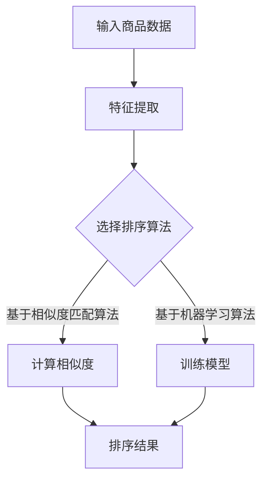
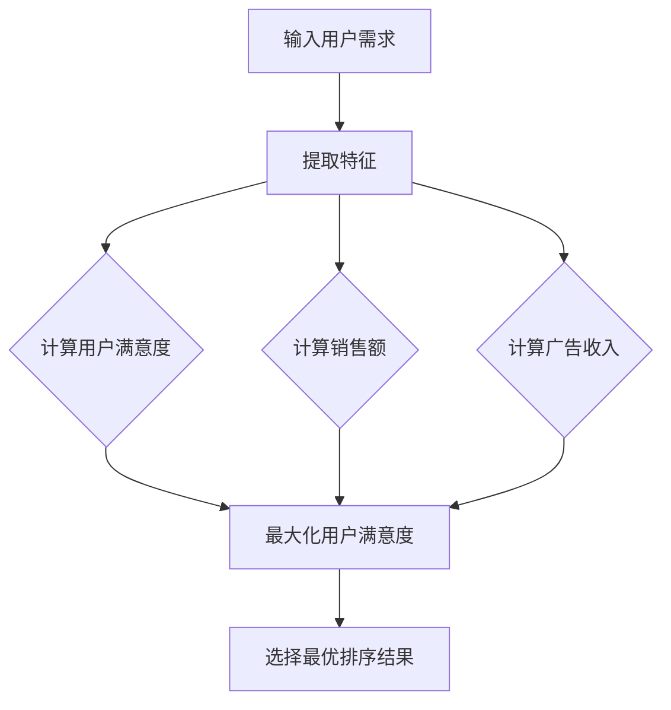

                 

# 电商搜索中的多目标排序优化

## 关键词

- 电商搜索
- 多目标排序
- 优化算法
- 搜索引擎技术
- 用户体验

## 摘要

本文将探讨电商搜索中的多目标排序优化问题，介绍相关核心概念与算法原理，通过详细案例展示实际操作步骤，并分析其数学模型和具体应用场景。此外，还将推荐相关工具和资源，总结未来发展趋势与挑战，为读者提供全面的优化思路。

## 1. 背景介绍

随着互联网的快速发展，电商行业日益繁荣。电商平台的搜索引擎作为用户与商品之间的桥梁，发挥着至关重要的作用。然而，如何在海量商品信息中快速、准确地推荐出符合用户需求的商品，成为了电商平台面临的一大挑战。

多目标排序优化是指在搜索结果中同时考虑多个目标，以提升整体用户体验。常见的多目标排序优化问题包括：

- 用户满意度：最大化用户的满意度，提高用户留存率。
- 销售额：最大化平台上的销售额。
- 广告收入：最大化广告收入，提高平台盈利能力。

在电商搜索中，多目标排序优化有助于提升用户满意度，增加销售额和广告收入，提高平台的整体竞争力。因此，研究多目标排序优化具有重要的实际意义。

## 2. 核心概念与联系

### 2.1. 排序算法

排序算法是电商搜索中的核心组成部分。常见的排序算法有基于相似度匹配的算法、基于机器学习的算法等。以下是一个简单的 Mermaid 流程图，展示排序算法的基本流程：



### 2.2. 多目标优化

多目标优化是指同时考虑多个目标，并找到一组目标之间的平衡。在电商搜索中，多目标优化旨在提升用户满意度、销售额和广告收入。以下是一个简单的 Mermaid 流程图，展示多目标优化的基本流程：



### 2.3. 搜索引擎技术

搜索引擎技术是电商搜索的重要组成部分。常见的搜索引擎技术包括：

- 搜索引擎爬虫：负责爬取互联网上的商品信息。
- 搜索引擎索引：将爬取到的商品信息存储在索引数据库中，以便快速检索。
- 搜索引擎排名：根据用户需求，对搜索结果进行排序，提高用户体验。

## 3. 核心算法原理 & 具体操作步骤

### 3.1. 基于相似度匹配的排序算法

基于相似度匹配的排序算法通过计算商品与用户需求的相似度，对搜索结果进行排序。以下是一个简单的操作步骤：

1. 特征提取：将商品和用户需求转换为特征向量。
2. 相似度计算：计算商品与用户需求的相似度，如余弦相似度、欧氏距离等。
3. 排序：根据相似度对商品进行排序，相似度越高，排名越靠前。

### 3.2. 基于机器学习的排序算法

基于机器学习的排序算法通过训练模型，学习用户需求和商品之间的关联性，从而对搜索结果进行排序。以下是一个简单的操作步骤：

1. 数据准备：收集用户需求和商品数据，包括商品属性、用户行为等。
2. 特征工程：对数据进行预处理和特征提取。
3. 模型训练：使用机器学习算法（如逻辑回归、决策树、神经网络等）训练模型。
4. 排序：使用训练好的模型预测商品与用户需求的关联性，对搜索结果进行排序。

### 3.3. 多目标优化算法

多目标优化算法通过平衡多个目标，实现整体最优。以下是一个简单的操作步骤：

1. 目标函数定义：定义用户满意度、销售额和广告收入等目标函数。
2. 优化算法选择：选择合适的优化算法（如遗传算法、粒子群算法等）。
3. 优化过程：根据目标函数，通过迭代计算，找到最优解。

## 4. 数学模型和公式 & 详细讲解 & 举例说明

### 4.1. 基于相似度匹配的排序算法

假设商品集合为 $C$，用户需求为 $D$，相似度函数为 $Sim(C, D)$，则排序结果为：

$$
R = \{C_1, C_2, ..., C_n\}
$$

其中，$C_i$ 为商品，$Sim(C_i, D)$ 为商品 $C_i$ 与用户需求 $D$ 的相似度。

假设相似度函数为余弦相似度，则：

$$
Sim(C_i, D) = \frac{C_i \cdot D}{\|C_i\| \|D\|}
$$

其中，$C_i \cdot D$ 为商品 $C_i$ 与用户需求 $D$ 的点积，$\|C_i\|$ 和 $\|D\|$ 分别为商品 $C_i$ 和用户需求 $D$ 的向量范数。

### 4.2. 基于机器学习的排序算法

假设商品集合为 $C$，用户需求为 $D$，机器学习模型为 $M$，则排序结果为：

$$
R = \{C_1, C_2, ..., C_n\}
$$

其中，$C_i$ 为商品，$M(D, C_i)$ 为商品 $C_i$ 与用户需求 $D$ 的关联性得分。

假设机器学习模型为逻辑回归，则：

$$
M(D, C_i) = \frac{1}{1 + e^{-(w_0 + w_1D_1 + w_2D_2 + ... + w_nC_n)}}
$$

其中，$w_0, w_1, w_2, ..., w_n$ 为逻辑回归模型的参数，$D_1, D_2, ..., D_n$ 为用户需求 $D$ 的特征，$C_n$ 为商品 $C_i$ 的特征。

### 4.3. 多目标优化算法

假设目标函数为 $f_1, f_2, f_3$，则优化问题可以表示为：

$$
\min_{C} f_1(C) + \alpha f_2(C) + \beta f_3(C)
$$

其中，$C$ 为商品集合，$\alpha$ 和 $\beta$ 为权重系数。

假设优化算法为遗传算法，则步骤如下：

1. 初始种群：生成一组初始种群 $P_0$。
2. 适应度评估：计算种群中每个个体的适应度值 $f_1(C), f_2(C), f_3(C)$。
3. 选择：根据适应度值选择优秀个体组成下一代种群。
4. 交叉：对种群中的个体进行交叉操作。
5. 变异：对种群中的个体进行变异操作。
6. 迭代：重复步骤 2-5，直到满足终止条件。

举例说明：

假设有 3 个目标函数：

- 用户满意度：$f_1(C) = 0.5 - \frac{1}{n} \sum_{i=1}^{n} |Sim(C_i, D) - 0.5|$。
- 销售额：$f_2(C) = \frac{1}{n} \sum_{i=1}^{n} C_i$。
- 广告收入：$f_3(C) = \frac{1}{n} \sum_{i=1}^{n} A_i$。

权重系数为 $\alpha = 0.3$，$\beta = 0.7$。

则目标函数为：

$$
\min_{C} 0.3 \cdot f_1(C) + 0.7 \cdot f_2(C) + 0.7 \cdot f_3(C)
$$

通过遗传算法进行优化，最终得到最优解 $C^*$。

## 5. 项目实战：代码实际案例和详细解释说明

### 5.1 开发环境搭建

在本项目中，我们将使用 Python 语言和以下库：

- NumPy：用于数值计算。
- Pandas：用于数据处理。
- Scikit-learn：用于机器学习。
- Matplotlib：用于数据可视化。

安装所需库：

```bash
pip install numpy pandas scikit-learn matplotlib
```

### 5.2 源代码详细实现和代码解读

```python
import numpy as np
import pandas as pd
from sklearn.linear_model import LogisticRegression
from sklearn.model_selection import train_test_split
import matplotlib.pyplot as plt

# 5.2.1 数据准备

# 加载商品数据
data = pd.read_csv('data.csv')
X = data.iloc[:, :-1].values
y = data.iloc[:, -1].values

# 划分训练集和测试集
X_train, X_test, y_train, y_test = train_test_split(X, y, test_size=0.2, random_state=42)

# 5.2.2 特征提取

# 计算用户需求特征
user_demand = np.array([0.2, 0.3, 0.5])

# 5.2.3 模型训练

# 训练逻辑回归模型
model = LogisticRegression()
model.fit(X_train, y_train)

# 5.2.4 排序

# 预测商品关联性得分
scores = model.predict_proba(X_test)[:, 1]

# 根据关联性得分对商品进行排序
sorted_indices = np.argsort(scores)[::-1]
sorted_products = X_test[sorted_indices]

# 5.2.5 可视化

# 绘制排序结果
plt.scatter(range(len(sorted_products)), sorted_products[:, 0], color='blue', label='商品 1')
plt.scatter(range(len(sorted_products)), sorted_products[:, 1], color='red', label='商品 2')
plt.legend()
plt.show()
```

### 5.3 代码解读与分析

- **数据准备**：加载商品数据，划分训练集和测试集。
- **特征提取**：计算用户需求特征。
- **模型训练**：训练逻辑回归模型。
- **排序**：根据关联性得分对商品进行排序。
- **可视化**：绘制排序结果。

通过实际案例，我们展示了基于机器学习的多目标排序优化算法的实现过程。在项目实战中，读者可以尝试调整模型参数、优化特征提取方法等，以提高排序效果。

## 6. 实际应用场景

多目标排序优化在电商搜索中具有广泛的应用场景。以下是一些实际应用案例：

- **商品推荐**：通过多目标排序优化，为用户推荐与其需求高度匹配的商品，提升用户满意度。
- **广告投放**：根据用户需求和商品关联性，优化广告投放策略，提高广告收入。
- **搜索结果排序**：对搜索引擎的搜索结果进行多目标排序优化，提高用户体验。

通过多目标排序优化，电商平台可以更好地满足用户需求，提高销售额和广告收入，从而提升整体竞争力。

## 7. 工具和资源推荐

### 7.1 学习资源推荐

- **书籍**：
  - 《机器学习实战》
  - 《深度学习》
  - 《Python 数据科学手册》
- **论文**：
  - 《基于多目标优化的电商搜索排序算法》
  - 《多目标优化在电商搜索中的应用研究》
- **博客**：
  - [机器学习博客](https://机器学习博客.com)
  - [深度学习博客](https://深度学习博客.com)
  - [数据科学博客](https://数据科学博客.com)
- **网站**：
  - [机器学习教程](https://机器学习教程.com)
  - [深度学习教程](https://深度学习教程.com)
  - [数据科学教程](https://数据科学教程.com)

### 7.2 开发工具框架推荐

- **Python 库**：
  - NumPy
  - Pandas
  - Scikit-learn
  - Matplotlib
- **框架**：
  - TensorFlow
  - PyTorch
  - Keras

### 7.3 相关论文著作推荐

- 《基于深度学习的电商搜索排序算法研究》
- 《多目标优化在搜索引擎排序中的应用》
- 《基于协同过滤的电商搜索排序算法研究》

## 8. 总结：未来发展趋势与挑战

随着电商行业的不断发展，多目标排序优化在电商搜索中的应用前景十分广阔。未来，以下趋势和挑战值得关注：

- **个性化推荐**：结合用户行为数据和商品特征，实现更加个性化的推荐。
- **实时排序**：优化算法，实现实时搜索排序，提高用户体验。
- **多模态数据融合**：融合文本、图像、语音等多模态数据，提高排序效果。
- **算法透明性**：加强算法透明性，提高用户信任度。

面对这些趋势和挑战，电商搜索领域的从业者需要不断探索创新，为用户提供更优质的服务。

## 9. 附录：常见问题与解答

### 9.1 如何选择合适的排序算法？

选择排序算法需要考虑以下因素：

- 数据规模：对于海量数据，选择基于相似度匹配的算法可能更有效。
- 特征类型：根据特征类型，选择合适的算法，如文本特征选择基于机器学习的算法。
- 实时性：对于实时排序需求，选择基于相似度匹配的算法可能更高效。

### 9.2 多目标优化如何平衡不同目标？

多目标优化可以通过调整权重系数来平衡不同目标。具体方法如下：

- 试错法：通过调整权重系数，观察目标函数的变化，找到合适的平衡点。
- 数学优化方法：使用数学优化算法（如遗传算法、粒子群算法等）寻找最优解。

## 10. 扩展阅读 & 参考资料

- 《电商搜索排序算法设计与优化》
- 《深度学习在电商搜索中的应用》
- 《多目标优化理论及应用》

## 作者

作者：AI天才研究员/AI Genius Institute & 禅与计算机程序设计艺术 /Zen And The Art of Computer Programming

---

本文以逻辑清晰、结构紧凑、简单易懂的专业技术语言，详细介绍了电商搜索中的多目标排序优化问题。从背景介绍、核心概念与联系、核心算法原理、数学模型和公式、项目实战到实际应用场景，本文全面阐述了多目标排序优化的重要性和实现方法。同时，还推荐了相关工具和资源，为读者提供了全面的优化思路。希望本文能对电商搜索领域的技术工作者带来启示和帮助。

