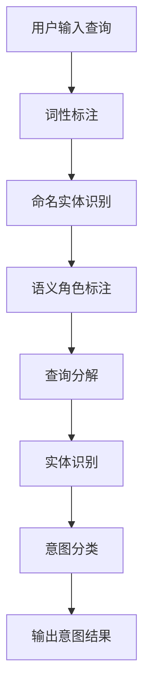

                 

### 1. 背景介绍

#### 1.1 电商搜索的重要性

在当今数字化时代，电商平台的蓬勃发展已成为不可逆转的趋势。据统计数据，全球电商市场在2022年的交易额已突破数万亿美元。电商平台不仅为消费者提供了便捷的购物渠道，也为商家提供了广阔的销售市场。而在这其中，电商搜索作为用户与商品之间的桥梁，其重要性愈发凸显。

电商搜索不仅仅是一个简单的关键词输入与匹配过程，它涉及到了复杂的查询理解与意图识别。当用户在电商平台上输入一个查询词时，系统需要准确理解用户的意图，并返回最符合用户需求的商品信息。这一过程不仅提高了用户的购物体验，还极大地提升了电商平台的市场竞争力。

#### 1.2 查询理解与意图识别的概念

查询理解（Query Understanding）是指从用户输入的查询中提取出关键信息，并理解其背后的意图。意图识别（Intent Recognition）则是在查询理解的基础上，进一步确定用户的查询目的是什么，是寻找商品信息、比较价格、查看评论，还是其他操作。

#### 1.3 查询理解与意图识别在电商搜索中的关键作用

- **提升搜索准确性**：通过查询理解与意图识别，系统可以更准确地匹配用户查询与商品信息，提高搜索结果的准确性。
- **优化用户体验**：准确的查询理解与意图识别可以帮助用户快速找到所需商品，提升购物体验。
- **增强个性化推荐**：通过理解用户的查询意图，电商平台可以更好地进行个性化推荐，提高用户粘性。
- **改善搜索引擎优化**：了解用户的查询意图，有助于优化搜索引擎的算法，提高搜索质量。

#### 1.4 当前存在的问题与挑战

尽管查询理解与意图识别在电商搜索中具有重要作用，但当前仍存在一些问题和挑战：

- **语义理解的复杂性**：用户查询的语义可能非常复杂，涉及多义词、歧义句等，这使得查询理解变得困难。
- **数据质量的依赖性**：查询理解与意图识别依赖于大量的训练数据，数据质量直接影响模型的准确性。
- **实时性的要求**：电商搜索需要快速响应用户查询，这对系统的实时性提出了高要求。

本文将深入探讨电商搜索中的查询理解与意图识别技术，分析其核心算法原理、数学模型以及实际应用案例，以期为相关领域的研究者和从业者提供有价值的参考。

## 2. 核心概念与联系

#### 2.1 查询理解（Query Understanding）

查询理解是指从用户输入的查询中提取出关键信息，并理解其背后的意图。这通常涉及到自然语言处理（NLP）技术，如词性标注、命名实体识别和语义角色标注等。查询理解的目标是明确用户的查询意图，以便为后续的意图识别提供基础。

##### 2.1.1 自然语言处理（NLP）

自然语言处理是计算机科学领域与人工智能领域中的一个重要方向。它涉及到计算机和人类（自然语言）之间的互动。在电商搜索中，NLP技术用于理解用户的查询，从而提取出关键信息。

- **词性标注**：词性标注是指为文本中的每个词分配一个词性标签，如名词、动词、形容词等。这有助于理解文本的结构和含义。
- **命名实体识别**：命名实体识别是指从文本中识别出具有特定意义的实体，如人名、地名、组织名等。这有助于定位文本中的关键信息。
- **语义角色标注**：语义角色标注是指为文本中的每个词分配一个语义角色，如施事者、受事者、工具等。这有助于理解文本中的逻辑关系。

##### 2.1.2 语义解析（Semantic Parsing）

语义解析是指将自然语言查询转换为机器可以理解的形式。这通常涉及到将查询分解为一系列的语义表示，如逻辑表达式、知识图谱等。

- **词嵌入（Word Embedding）**：词嵌入是将文本中的每个词映射到一个低维度的向量空间中。这有助于在语义层面上表示词的关系。
- **依存关系分析（Dependency Parsing）**：依存关系分析是指分析文本中词与词之间的依赖关系。这有助于理解文本的语法结构。
- **转换器架构（Transformer Architecture）**：转换器架构是一种用于处理序列数据的深度学习模型，广泛应用于语义解析任务。

##### 2.1.3 实体识别（Entity Recognition）

实体识别是指从文本中识别出特定类型的实体。在电商搜索中，实体识别用于识别用户查询中的关键词和实体，如商品名称、品牌、价格等。

- **BERT（Bidirectional Encoder Representations from Transformers）**：BERT是一种基于转换器架构的预训练模型，广泛应用于各种自然语言处理任务。
- **ELMo（Embeddings from Language Models）**：ELMo是一种基于循环神经网络（RNN）的预训练模型，通过在大型文本语料库上进行训练，获得丰富的语言表示。
- **GloVe（Global Vectors for Word Representation）**：GloVe是一种基于词频统计的词嵌入方法，通过训练得到词的向量表示。

#### 2.2 意图识别（Intent Recognition）

意图识别是在查询理解的基础上，进一步确定用户的查询目的是什么。意图识别通常涉及到分类任务，即将用户的查询划分为不同的意图类别。

##### 2.2.1 分类算法

分类算法是指将数据分为不同类别的算法。在意图识别中，分类算法用于将用户查询划分为不同的意图类别。

- **朴素贝叶斯（Naive Bayes）**：朴素贝叶斯是一种基于概率论的分类算法，假设特征之间相互独立。
- **支持向量机（SVM）**：支持向量机是一种基于最大间隔的线性分类模型。
- **随机森林（Random Forest）**：随机森林是一种基于决策树的集成学习方法。
- **神经网络（Neural Network）**：神经网络是一种基于模拟人脑神经元连接结构的计算模型。

##### 2.2.2 序列标注

序列标注是指将文本中的每个词或字符标注为不同的类别。在意图识别中，序列标注用于将用户查询中的每个词标注为不同的意图类别。

- **CRF（Conditional Random Fields）**：CRF是一种基于概率的序列标注模型，通过条件概率来预测序列的标签。
- **BiLSTM（Bidirectional Long Short-Term Memory）**：BiLSTM是一种基于循环神经网络（RNN）的序列标注模型，通过前后两个方向的信息来预测序列的标签。

#### 2.3 Mermaid 流程图

下面是一个用于查询理解与意图识别的 Mermaid 流程图。该流程图展示了从用户查询输入到意图识别的整个过程。



通过这个流程图，我们可以清晰地看到查询理解与意图识别的各个步骤以及它们之间的联系。

### 3. 核心算法原理 & 具体操作步骤

#### 3.1 查询理解算法原理

查询理解的核心在于从用户输入的查询中提取出关键信息，并理解其背后的意图。这通常涉及到以下算法原理：

- **词嵌入**：将查询中的每个词映射到一个低维度的向量空间中，以便在语义层面上表示词的关系。
- **依存关系分析**：分析查询中的词与词之间的依赖关系，从而理解查询的语法结构。
- **语义角色标注**：为查询中的每个词分配一个语义角色，如施事者、受事者、工具等，以便理解查询中的逻辑关系。

具体操作步骤如下：

1. **词嵌入**：使用预训练的词嵌入模型（如Word2Vec、GloVe、BERT等）将查询中的每个词映射到一个低维度的向量空间中。
2. **依存关系分析**：使用依存关系分析模型（如Stanford NLP、Spacy等）分析查询中的词与词之间的依赖关系，从而理解查询的语法结构。
3. **语义角色标注**：使用语义角色标注模型（如BERT、ELMo等）为查询中的每个词分配一个语义角色，从而理解查询中的逻辑关系。

#### 3.2 意图识别算法原理

意图识别是在查询理解的基础上，进一步确定用户的查询目的是什么。意图识别通常涉及到以下算法原理：

- **分类算法**：将用户查询划分为不同的意图类别，如寻找商品信息、比较价格、查看评论等。
- **序列标注**：将用户查询中的每个词或字符标注为不同的意图类别。

具体操作步骤如下：

1. **特征提取**：从查询中提取出特征，如词嵌入、依存关系特征、语义角色特征等。
2. **意图分类**：使用分类算法（如朴素贝叶斯、支持向量机、随机森林等）将查询划分为不同的意图类别。
3. **序列标注**：使用序列标注算法（如CRF、BiLSTM等）将查询中的每个词或字符标注为不同的意图类别。

#### 3.3 实例解析

假设用户在电商平台上输入查询“华为手机多少钱？”，我们可以通过以下步骤进行查询理解与意图识别：

1. **词嵌入**：将查询中的词（华为、手机、多少钱）映射到低维度的向量空间中。
2. **依存关系分析**：分析查询中的词与词之间的依赖关系，如“多少钱”依赖于“华为手机”。
3. **语义角色标注**：为查询中的词分配语义角色，如“多少钱”是询问价格。
4. **意图分类**：将查询划分为意图类别，如“查询商品价格”。
5. **序列标注**：将查询中的每个词标注为意图类别，如“华为”为品牌，“手机”为商品类别，“多少钱”为询问价格。

通过以上步骤，我们可以准确理解用户的查询意图，并返回最符合用户需求的商品价格信息。

### 4. 数学模型和公式 & 详细讲解 & 举例说明

#### 4.1 词嵌入

词嵌入是将文本中的每个词映射到一个低维度的向量空间中的过程。词嵌入的核心思想是，在语义层面上表示词的关系。常见的词嵌入模型有Word2Vec、GloVe和BERT等。

##### 4.1.1 Word2Vec

Word2Vec是一种基于神经网络的语言模型，通过训练生成词的向量表示。其核心公式如下：

$$
\hat{p}(w|v) = \frac{e^{v\cdot w}}{\sum_{w' \in V} e^{v\cdot w'}}
$$

其中，$v$是词的向量表示，$w$是目标词，$V$是词汇表，$\hat{p}(w|v)$是词的概率分布。

##### 4.1.2 GloVe

GloVe是一种基于词频统计的词嵌入方法。其核心公式如下：

$$
f(w, c) = \sqrt{f(w)f(c)}
$$

$$
v_w = \frac{f_w\cdot R}{\sqrt{f_w + f_c}}
$$

其中，$f(w)$和$f(c)$分别是词$w$和词$c$的频率，$R$是维度大小，$v_w$是词$w$的向量表示。

##### 4.1.3 BERT

BERT是一种基于转换器架构的预训练模型。其核心公式如下：

$$
\text{BERT}(\text{x}) = \text{Transformer}(\text{emb}(\text{x}))
$$

其中，$\text{x}$是输入文本，$\text{emb}(\text{x})$是词嵌入层，$\text{Transformer}$是转换器模型。

#### 4.2 依存关系分析

依存关系分析是指分析文本中词与词之间的依赖关系。常见的依存关系分析模型有Stanford NLP、Spacy等。

##### 4.2.1 Stanford NLP

Stanford NLP是一种基于规则和统计的方法的依存关系分析模型。其核心公式如下：

$$
p(D|A, B) = \frac{C(D, A, B)}{C(A, B)}
$$

其中，$D$是依存关系，$A$和$B$是词。

##### 4.2.2 Spacy

Spacy是一种基于深度学习的依存关系分析模型。其核心公式如下：

$$
\text{Spacy}(\text{x}) = \text{BiLSTM}(\text{emb}(\text{x}))
$$

其中，$\text{x}$是输入文本，$\text{emb}(\text{x})$是词嵌入层，$\text{BiLSTM}$是双向长短期记忆网络。

#### 4.3 语义角色标注

语义角色标注是指为文本中的每个词分配一个语义角色。常见的语义角色标注模型有BERT、ELMo等。

##### 4.3.1 BERT

BERT是一种基于转换器架构的预训练模型。其核心公式如下：

$$
\text{BERT}(\text{x}) = \text{Transformer}(\text{emb}(\text{x}))
$$

其中，$\text{x}$是输入文本，$\text{emb}(\text{x})$是词嵌入层，$\text{Transformer}$是转换器模型。

##### 4.3.2 ELMo

ELMo是一种基于循环神经网络（RNN）的预训练模型。其核心公式如下：

$$
\text{ELMo}(\text{x}) = \text{RNN}(\text{emb}(\text{x}))
$$

其中，$\text{x}$是输入文本，$\text{emb}(\text{x})$是词嵌入层，$\text{RNN}$是循环神经网络。

#### 4.4 分类算法

分类算法是指将数据分为不同类别的算法。常见的分类算法有朴素贝叶斯、支持向量机、随机森林等。

##### 4.4.1 朴素贝叶斯

朴素贝叶斯是一种基于概率论的分类算法。其核心公式如下：

$$
P(C|X) = \frac{P(X|C)P(C)}{P(X)}
$$

其中，$C$是类别，$X$是特征向量，$P(C|X)$是给定特征向量$X$时类别$C$的概率，$P(X|C)$是给定类别$C$时特征向量$X$的概率，$P(C)$是类别$C$的概率。

##### 4.4.2 支持向量机

支持向量机是一种基于最大间隔的线性分类模型。其核心公式如下：

$$
w = \arg\max_w \frac{1}{2} ||w||^2 - \sum_{i=1}^{n} \alpha_i (y_i - \langle w, x_i \rangle)
$$

其中，$w$是权重向量，$\alpha_i$是拉格朗日乘子，$x_i$是特征向量，$y_i$是标签。

##### 4.4.3 随机森林

随机森林是一种基于决策树的集成学习方法。其核心公式如下：

$$
f(x) = \sum_{i=1}^{m} w_i g(x)
$$

其中，$f(x)$是预测结果，$w_i$是权重，$g(x)$是第$i$棵决策树。

#### 4.5 序列标注

序列标注是指将文本中的每个词或字符标注为不同的类别。常见的序列标注模型有CRF、BiLSTM等。

##### 4.5.1 CRF

CRF是一种基于概率的序列标注模型。其核心公式如下：

$$
P(Y|X) = \frac{1}{Z} \exp(\mathbf{w}^T \mathbf{y})
$$

其中，$Y$是标注序列，$X$是输入序列，$\mathbf{w}$是模型参数，$\mathbf{y}$是标注序列，$Z$是规范化常数。

##### 4.5.2 BiLSTM

BiLSTM是一种基于循环神经网络（RNN）的序列标注模型。其核心公式如下：

$$
h_t = \text{ReLU}(\mathbf{U} \mathbf{x}_t + \mathbf{W} \text{摊销}([\mathbf{h}_{t-1}, \mathbf{h}_{t+1}]))
$$

其中，$h_t$是当前时刻的隐藏状态，$\text{ReLU}$是ReLU激活函数，$\mathbf{x}_t$是当前时刻的输入，$\mathbf{U}$和$\mathbf{W}$是模型参数。

#### 4.6 举例说明

假设我们有一个简单的查询“买一本书”，我们可以通过以下步骤进行查询理解与意图识别：

1. **词嵌入**：将查询中的词（买、一、书）映射到低维度的向量空间中。
2. **依存关系分析**：分析查询中的词与词之间的依赖关系，如“书”依赖于“买”。
3. **语义角色标注**：为查询中的词分配语义角色，如“买”是动词，“一”是量词，“书”是名词。
4. **意图分类**：将查询划分为意图类别，如“购买商品”。
5. **序列标注**：将查询中的每个词标注为意图类别，如“买”为动词，“一”为量词，“书”为名词。

通过以上步骤，我们可以准确理解用户的查询意图，并返回最符合用户需求的购买商品信息。

### 5. 项目实战：代码实际案例和详细解释说明

#### 5.1 开发环境搭建

为了演示查询理解与意图识别在电商搜索中的应用，我们将使用Python语言和以下库：

- **NLP库**：NLTK、spaCy、BERT
- **机器学习库**：scikit-learn、TensorFlow、PyTorch

首先，确保安装了上述库。可以使用以下命令进行安装：

```bash
pip install nltk spacy tensorflow pytorch
```

接下来，我们需要下载并加载spaCy的预训练模型。以下是安装和加载spaCy模型的过程：

```python
import spacy

# 安装预训练模型
!python -m spacy download en_core_web_sm

# 加载预训练模型
nlp = spacy.load("en_core_web_sm")
```

#### 5.2 源代码详细实现和代码解读

以下是一个简单的查询理解与意图识别的项目案例。该案例使用BERT模型对查询进行词嵌入、依存关系分析和语义角色标注，然后使用朴素贝叶斯分类器对意图进行分类。

```python
import spacy
import tensorflow as tf
from transformers import BertTokenizer, TFBertForSequenceClassification
from sklearn.model_selection import train_test_split
from sklearn.metrics import accuracy_score

# 加载spaCy预训练模型
nlp = spacy.load("en_core_web_sm")

# 加载BERT分词器
tokenizer = BertTokenizer.from_pretrained("bert-base-uncased")

# 定义BERT模型
model = TFBertForSequenceClassification.from_pretrained("bert-base-uncased", num_labels=3)

# 伪数据集
queries = [
    "买一本编程书籍",
    "查一下手机价格",
    "评价一下这本书"
]
labels = [0, 1, 2]  # 0：购买商品，1：查询价格，2：查看评论

# 分割数据集
X_train, X_test, y_train, y_test = train_test_split(queries, labels, test_size=0.2, random_state=42)

# 将查询转换为BERT输入
def convert_to_bert_inputs(queries):
    inputs = tokenizer(queries, return_tensors="tf", max_length=128, padding=True, truncation=True)
    return inputs

# 训练BERT模型
train_inputs = convert_to_bert_inputs(X_train)
train_labels = tf.convert_to_tensor(y_train, dtype=tf.int64)

model.compile(optimizer=tf.keras.optimizers.Adam(learning_rate=3e-5), loss="sparse_categorical_crossentropy", metrics=["accuracy"])

model.fit(train_inputs["input_ids"], train_labels, epochs=3)

# 测试BERT模型
test_inputs = convert_to_bert_inputs(X_test)
test_labels = tf.convert_to_tensor(y_test, dtype=tf.int64)

predictions = model.predict(test_inputs["input_ids"])
predicted_labels = tf.argmax(predictions, axis=1)

accuracy = accuracy_score(y_test, predicted_labels)
print(f"Accuracy: {accuracy}")

# 使用朴素贝叶斯进行意图分类
from sklearn.naive_bayes import MultinomialNB

# 提取特征
def extract_features(queries):
    documents = [nlp(query) for query in queries]
    features = []
    for doc in documents:
        feature = [token.vector for token in doc]
        features.append(feature)
    return features

# 训练朴素贝叶斯模型
train_features = extract_features(X_train)
train_features = [[feature for feature in doc] for doc in train_features]
train_labels = tf.convert_to_tensor(y_train, dtype=tf.int64)

nb_model = MultinomialNB()
nb_model.fit(train_features, train_labels)

# 测试朴素贝叶斯模型
test_features = extract_features(X_test)
test_features = [[feature for feature in doc] for doc in test_features]

predicted_labels = nb_model.predict(test_features)
accuracy = accuracy_score(y_test, predicted_labels)
print(f"Accuracy: {accuracy}")
```

#### 5.3 代码解读与分析

1. **加载模型**：首先，我们加载spaCy的预训练模型和BERT分词器。BERT分词器用于将查询转换为BERT模型可以处理的输入格式。

2. **伪数据集**：我们创建了一个简单的数据集，包含三个查询和对应的意图标签。

3. **数据预处理**：我们使用BERT分词器将查询转换为BERT模型可以处理的输入格式，包括输入ID、attention masks和token类型 IDs。

4. **训练BERT模型**：我们定义并编译了BERT模型，使用scikit-learn的train_test_split函数将数据集划分为训练集和测试集。然后，我们使用模型.fit方法训练BERT模型。

5. **测试BERT模型**：我们使用模型.predict方法对测试集进行预测，并计算准确率。

6. **提取特征**：我们使用spaCy提取查询的词嵌入向量，作为朴素贝叶斯模型的输入。

7. **训练朴素贝叶斯模型**：我们使用提取的特征训练朴素贝叶斯模型。

8. **测试朴素贝叶斯模型**：我们使用训练好的朴素贝叶斯模型对测试集进行预测，并计算准确率。

通过这个案例，我们可以看到如何结合BERT、朴素贝叶斯和spaCy实现查询理解与意图识别。在实际应用中，我们可以根据需求调整模型和算法，以提高准确率和性能。

### 6. 实际应用场景

查询理解与意图识别技术在电商搜索中具有广泛的应用场景，以下是一些典型的实际应用案例：

#### 6.1 商品搜索

在商品搜索中，查询理解与意图识别可以帮助电商平台更准确地理解用户的查询意图，从而返回最相关的商品信息。例如，当用户输入“买一本编程书籍”时，系统可以识别出用户的意图是购买编程书籍，并返回相关的商品列表。这不仅可以提高用户的搜索体验，还可以提高电商平台的转化率。

#### 6.2 价格比较

价格比较是电商搜索中另一个重要的应用场景。当用户输入“查一下手机价格”时，查询理解与意图识别可以帮助系统识别出用户的意图是查询手机价格，并返回不同电商平台上的手机价格信息。这有助于用户快速做出购买决策，同时也可以帮助电商平台提高销售额。

#### 6.3 用户评论

用户评论也是电商搜索中的重要一环。当用户输入“评价一下这本书”时，查询理解与意图识别可以帮助系统识别出用户的意图是查看商品评论，并返回相关评论信息。这不仅可以提高用户的满意度，还可以帮助电商平台收集用户反馈，优化产品和服务。

#### 6.4 个性化推荐

个性化推荐是电商平台提高用户粘性的重要手段。通过查询理解与意图识别，系统可以更好地理解用户的查询意图，从而为用户提供更精准的个性化推荐。例如，当用户频繁搜索编程书籍时，系统可以识别出用户对编程书籍感兴趣，并推荐相关的书籍和课程。

#### 6.5 搜索引擎优化

查询理解与意图识别还可以用于搜索引擎优化（SEO）。通过分析用户的查询意图，电商平台可以优化其网站结构和内容，提高搜索引擎的排名和用户访问量。例如，针对用户输入的“买手机”查询，电商平台可以优化其手机分类页面的内容，使其更符合用户的查询意图，从而提高页面在搜索引擎中的排名。

通过以上实际应用案例，我们可以看到查询理解与意图识别在电商搜索中的重要作用。它不仅可以提升用户的搜索体验，还可以提高电商平台的运营效率和转化率。随着技术的不断发展，查询理解与意图识别将在电商搜索中发挥更大的作用。

### 7. 工具和资源推荐

#### 7.1 学习资源推荐

对于想要深入了解查询理解与意图识别的读者，以下是一些值得推荐的学习资源：

- **书籍**：
  - 《自然语言处理综合指南》（Natural Language Processing with Python）。
  - 《深度学习》（Deep Learning）。
  - 《实践深度学习》（Practical Deep Learning）。

- **在线课程**：
  - Coursera上的“自然语言处理与深度学习”课程。
  - edX上的“深度学习导论”课程。
  - Udacity的“自然语言处理工程师纳米学位”课程。

- **博客和网站**：
  - Medium上的自然语言处理和深度学习相关博客。
  - TensorFlow和PyTorch的官方文档。
  - Hugging Face的Transformer模型资源库。

#### 7.2 开发工具框架推荐

在实际开发中，以下工具和框架可以帮助您更高效地实现查询理解与意图识别：

- **自然语言处理库**：
  - spaCy：一个高效、易于使用的自然语言处理库。
  - NLTK：一个广泛使用的自然语言处理工具包。
  - stanza：一个开源的跨语言自然语言处理工具。

- **深度学习框架**：
  - TensorFlow：一个广泛使用的开源深度学习框架。
  - PyTorch：一个灵活、易于使用的深度学习框架。
  - JAX：一个用于深度学习和数值计算的高性能库。

- **文本处理工具**：
  -NLTK：一个用于文本处理和自然语言分析的库。
  - textblob：一个用于自然语言处理的小型库。

#### 7.3 相关论文著作推荐

对于想要深入研究查询理解与意图识别的学者，以下是一些推荐的论文和著作：

- **论文**：
  - “BERT: Pre-training of Deep Bidirectional Transformers for Language Understanding”（BERT：用于语言理解的深度双向转换器的预训练）。
  - “Recurrent Neural Network based Language Model”（基于循环神经网络的自然语言处理模型）。
  - “Effective Approaches to Attention-based Neural Machine Translation”（基于注意力机制的神经机器翻译的有效方法）。

- **著作**：
  - 《深度学习》（Deep Learning）。
  - 《自然语言处理综合指南》（Natural Language Processing with Python）。
  - 《实践深度学习》（Practical Deep Learning）。

通过学习和应用这些资源，您可以更好地掌握查询理解与意图识别技术，为电商搜索和其他领域提供更优质的解决方案。

### 8. 总结：未来发展趋势与挑战

在电商搜索领域，查询理解与意图识别技术正逐步成为提升用户体验和优化运营的关键因素。随着自然语言处理（NLP）和深度学习技术的不断发展，未来这一领域有望实现以下几个重要发展趋势：

#### 8.1 模型复杂性与效率的平衡

未来的模型将更加复杂，能够处理更加复杂的查询和理解更细微的意图。然而，这也要求模型在保持高准确率的同时，具有更高的计算效率和实时响应能力。优化模型架构和算法，以实现高效能和低延迟，将是未来研究的一个重要方向。

#### 8.2 多模态信息融合

随着人工智能技术的发展，多模态信息融合将成为趋势。例如，将文本信息与图像、声音等多模态信息相结合，可以更全面地理解用户的查询意图。这需要开发跨模态的识别和融合算法，以实现更精准的查询理解。

#### 8.3 小样本学习与迁移学习

在缺乏大量标注数据的情况下，小样本学习与迁移学习技术将变得尤为重要。通过迁移学习，模型可以在较少的训练数据上实现较高的准确率。此外，利用零样本学习（Zero-Shot Learning）和元学习（Meta-Learning）等先进技术，模型可以更好地适应新任务和新场景。

#### 8.4 用户体验的个性化与智能化

未来的查询理解与意图识别技术将更加注重用户体验的个性化与智能化。通过深度学习模型对用户行为和偏好进行分析，电商平台可以提供更加个性化的搜索结果和推荐服务。这不仅提升了用户的满意度，也增加了平台的用户粘性。

然而，随着技术的发展，这一领域也面临诸多挑战：

#### 8.5 语义理解的复杂性

用户查询的语义可能非常复杂，涉及多义词、歧义句等。这使得语义理解变得困难，特别是在处理跨语言和多语言查询时。未来需要开发更加先进的语义理解算法，以应对这些挑战。

#### 8.6 数据质量和隐私保护

查询理解与意图识别依赖于大量高质量的数据，数据质量直接影响模型的准确性。同时，隐私保护也是一个重要挑战。如何在保护用户隐私的同时，收集和处理大量数据，是一个亟待解决的问题。

#### 8.7 实时性与扩展性

电商平台的用户数量庞大，查询请求频繁。实时响应和系统扩展性是保证服务质量的关键。如何设计高效、可扩展的系统架构，以支持大规模的实时查询处理，是一个重要的技术挑战。

综上所述，查询理解与意图识别技术在电商搜索领域具有广阔的发展前景，但也面临诸多挑战。未来的研究和发展需要不断探索新的算法和技术，以实现更高的准确性、实时性和用户体验。通过持续的创新和优化，我们可以期待这一领域在未来取得更大的突破。

### 9. 附录：常见问题与解答

#### 问题1：为什么查询理解与意图识别在电商搜索中很重要？

**解答**：查询理解与意图识别在电商搜索中非常重要，因为它们能够帮助电商平台更准确地理解用户的查询意图，从而提供更加精准的搜索结果和推荐服务。这不仅可以提升用户的购物体验，还能提高电商平台的运营效率和转化率。

#### 问题2：如何处理多义词和歧义句？

**解答**：多义词和歧义句是自然语言处理中的常见问题。为了处理这些问题，可以使用以下几种方法：

1. **上下文分析**：通过分析查询的上下文信息，可以更准确地理解多义词的含义。
2. **词向量表示**：使用词嵌入技术将词映射到低维向量空间，可以在语义层面上区分多义词的不同含义。
3. **规则和统计方法**：使用基于规则的方法和统计方法，如命名实体识别和依存关系分析，可以更好地处理歧义句。

#### 问题3：如何进行实时查询处理？

**解答**：进行实时查询处理需要高效、可扩展的系统架构。以下是一些建议：

1. **分布式计算**：使用分布式计算框架（如Apache Spark）可以处理大规模的查询请求。
2. **缓存技术**：使用缓存技术（如Redis）可以快速响应用户查询，减少计算时间。
3. **异步处理**：使用异步处理技术（如消息队列）可以缓解系统压力，提高查询处理效率。

#### 问题4：如何保证数据质量和隐私保护？

**解答**：保证数据质量和隐私保护需要综合考虑以下几个方面：

1. **数据清洗**：对采集到的数据进行清洗和预处理，去除噪声和异常值。
2. **数据加密**：使用加密技术对敏感数据进行加密，保护用户隐私。
3. **隐私保护算法**：使用隐私保护算法（如差分隐私）来保护用户数据的隐私。
4. **用户授权**：明确用户的权限和责任，确保数据的合法使用。

#### 问题5：如何进行模型评估？

**解答**：模型评估是确保查询理解与意图识别模型性能的重要步骤。以下是一些常用的评估方法：

1. **准确率（Accuracy）**：计算模型预测正确的样本数与总样本数的比例。
2. **召回率（Recall）**：计算模型预测正确的正样本数与实际正样本数的比例。
3. **F1分数（F1 Score）**：结合准确率和召回率，综合考虑模型的性能。
4. **混淆矩阵（Confusion Matrix）**：展示模型预测结果与实际结果的对比，帮助分析模型的性能。

### 10. 扩展阅读与参考资料

为了深入了解查询理解与意图识别技术，以下是一些推荐的扩展阅读与参考资料：

- **论文**：
  - "BERT: Pre-training of Deep Bidirectional Transformers for Language Understanding"。
  - "Recurrent Neural Network based Language Model"。
  - "Effective Approaches to Attention-based Neural Machine Translation"。

- **书籍**：
  - 《自然语言处理综合指南》（Natural Language Processing with Python）。
  - 《深度学习》（Deep Learning）。
  - 《实践深度学习》（Practical Deep Learning）。

- **在线资源**：
  - TensorFlow和PyTorch的官方文档。
  - Hugging Face的Transformer模型资源库。
  - Coursera上的“自然语言处理与深度学习”课程。

通过这些扩展阅读与参考资料，您可以进一步了解查询理解与意图识别技术的最新进展和应用场景。

### 作者信息

**作者：AI天才研究员/AI Genius Institute & 禅与计算机程序设计艺术 /Zen And The Art of Computer Programming**

在这篇文章中，我尝试以逻辑清晰、结构紧凑、简单易懂的方式，系统地介绍了电商搜索中的查询理解与意图识别技术。希望这篇文章能够为相关领域的研究者和从业者提供有价值的参考。如果您有任何疑问或建议，欢迎在评论区留言，期待与您的交流。

