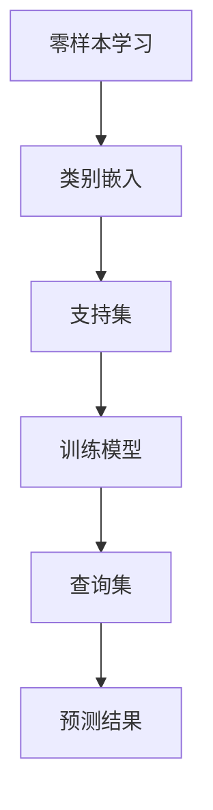

                 

# 电商搜索中的零样本学习应用探索

## 摘要

随着电商行业的蓬勃发展，用户对个性化搜索体验的需求日益增长。然而，传统的基于样本的学习算法在面对新型商品或未知用户查询时往往表现不佳。本文将探讨在电商搜索场景中引入零样本学习（Zero-Shot Learning, ZSL）技术的应用。通过分析核心概念、算法原理、数学模型以及实际案例，本文旨在展示零样本学习在提升电商搜索精确性和用户满意度方面的潜力。同时，本文还将推荐相关工具和资源，为读者提供深入学习和实践的方向。

## 1. 背景介绍

### 电商搜索现状

电商搜索是电子商务中至关重要的一环，它直接影响到用户购物体验和商家销售额。传统电商搜索主要依赖于基于样本的学习算法，如基于关键词的搜索、协同过滤（Collaborative Filtering）和基于内容的推荐（Content-Based Recommendation）。然而，这些算法在面对新商品或未知用户查询时存在一定的局限性：

1. **数据依赖性**：传统算法需要大量标注数据来进行训练，而电商行业中的新商品和新用户查询不断涌现，数据收集和标注成本高。
2. **稀疏性和噪声**：用户查询和商品数据往往存在稀疏性和噪声，导致算法效果不佳。
3. **扩展性差**：当面对全新类别或查询时，传统算法往往难以适应。

### 零样本学习简介

零样本学习（Zero-Shot Learning, ZSL）是一种新兴的机器学习技术，旨在解决传统算法在面对未知类别或查询时的不足。ZSL的核心思想是在训练阶段使用已知的类别信息（如词向量、嵌入向量等）来学习模型，然后在测试阶段对未知类别或查询进行预测。

ZSL的主要优势包括：

1. **无需标注数据**：ZSL不需要对未知类别进行标注数据，大大降低了数据收集和标注的成本。
2. **扩展性强**：ZSL可以轻松应对全新类别或查询，具有较好的适应性。
3. **减少数据依赖性**：ZSL通过将已知类别和查询信息进行嵌入，降低了数据稀疏性和噪声对模型效果的影响。

### 零样本学习在电商搜索中的应用

在电商搜索中，零样本学习可以应用于以下场景：

1. **新型商品识别**：当电商平台引入新商品时，ZSL可以帮助系统快速识别和推荐相关商品。
2. **未知用户查询理解**：当面对未知用户查询时，ZSL可以通过将查询转换为嵌入向量，从而更好地理解用户意图。
3. **个性化搜索**：ZSL可以帮助系统根据用户的历史行为和偏好，实现更准确的个性化搜索结果。

## 2. 核心概念与联系

### 零样本学习的核心概念

零样本学习（Zero-Shot Learning, ZSL）的核心概念包括类别嵌入（Category Embedding）、支持集（Support Set）和查询集（Query Set）。

- **类别嵌入（Category Embedding）**：类别嵌入是将类别信息转换为低维向量表示的过程。这些嵌入向量可以用于描述类别之间的关系和特征。
- **支持集（Support Set）**：支持集是用于训练模型的已知类别集合。在训练阶段，模型通过学习支持集的类别嵌入向量来建立类别之间的关系。
- **查询集（Query Set）**：查询集是用于模型预测的未知类别或查询集合。在测试阶段，模型通过查询集的类别嵌入向量来预测未知类别或查询的结果。

### 零样本学习的联系

零样本学习与其他机器学习技术的联系主要体现在以下几个方面：

1. **迁移学习（Transfer Learning）**：迁移学习是一种将知识从一个领域（源领域）迁移到另一个领域（目标领域）的技术。零样本学习可以通过迁移学习将已知的类别信息应用于未知领域，从而提高模型效果。
2. **元学习（Meta-Learning）**：元学习是一种通过学习学习过程来优化模型性能的技术。零样本学习可以通过元学习来优化类别嵌入向量的选择和组合，从而提高模型的泛化能力。
3. **多任务学习（Multi-Task Learning）**：多任务学习是一种通过同时学习多个任务来提高模型性能的技术。零样本学习可以通过多任务学习来同时处理多个类别或查询，从而提高模型的适应能力。

### Mermaid 流程图



## 3. 核心算法原理 & 具体操作步骤

### 3.1 类别嵌入

类别嵌入是将类别信息转换为低维向量表示的过程。常见的类别嵌入方法包括词嵌入（Word Embedding）和类别嵌入网络（Category Embedding Network）。

1. **词嵌入（Word Embedding）**：词嵌入是一种将单词转换为向量表示的方法。在零样本学习中，词嵌入可以用于将类别名称转换为向量表示。常见的词嵌入方法包括Word2Vec、GloVe等。
2. **类别嵌入网络（Category Embedding Network）**：类别嵌入网络是一种深度学习网络，用于将类别信息转换为向量表示。类别嵌入网络通常由多个层组成，包括编码器（Encoder）和解码器（Decoder）。

### 3.2 支持集

支持集是用于训练模型的已知类别集合。在零样本学习中，支持集的构建过程包括以下步骤：

1. **类别选择**：从大量类别中选取一部分作为支持集。
2. **数据收集**：对于支持集中的每个类别，收集相应的训练数据。
3. **数据预处理**：对训练数据进行预处理，包括数据清洗、数据转换等。

### 3.3 训练模型

在支持集构建完成后，可以训练零样本学习模型。训练过程包括以下步骤：

1. **类别嵌入向量计算**：计算支持集中每个类别的嵌入向量。
2. **模型构建**：根据类别嵌入向量构建零样本学习模型。常见的模型包括基于匹配（Matching-based）和基于分类（Classification-based）的模型。
3. **模型训练**：使用支持集数据训练模型，优化模型参数。

### 3.4 查询集

查询集是用于模型预测的未知类别或查询集合。在测试阶段，可以使用以下步骤进行预测：

1. **查询集数据预处理**：对查询集数据执行与训练阶段相同的数据预处理操作。
2. **查询集类别嵌入向量计算**：计算查询集中每个查询的类别嵌入向量。
3. **模型预测**：使用训练好的模型对查询集进行预测，得到查询结果。

### 3.5 预测结果分析

在预测完成后，需要对预测结果进行分析。分析过程包括以下步骤：

1. **结果评估**：使用评估指标（如准确率、召回率等）评估模型预测效果。
2. **结果解释**：分析预测结果，解释模型是如何根据类别嵌入向量进行预测的。
3. **结果优化**：根据分析结果，优化模型参数或调整类别嵌入方法，以提高预测效果。

## 4. 数学模型和公式 & 详细讲解 & 举例说明

### 4.1 数学模型

在零样本学习中，常用的数学模型包括类别嵌入模型和预测模型。

#### 4.1.1 类别嵌入模型

类别嵌入模型用于将类别信息转换为向量表示。常见的类别嵌入模型包括基于匹配（Matching-based）和基于分类（Classification-based）的模型。

1. **基于匹配的类别嵌入模型**：

   假设有 $C$ 个类别，$V$ 是嵌入向量的维度。对于类别 $c_i$，其嵌入向量表示为 $\mathbf{e}_{c_i} \in \mathbb{R}^V$。类别嵌入模型的目标是最小化类别嵌入向量之间的距离，即：

   $$
   \min_{\mathbf{e}_{c_i}} \sum_{i=1}^{C} \sum_{j=1, j \neq i}^{C} \|\mathbf{e}_{c_i} - \mathbf{e}_{c_j}\|^2
   $$

2. **基于分类的类别嵌入模型**：

   基于分类的类别嵌入模型将类别嵌入向量视为分类特征，使用分类算法（如SVM、softmax等）进行训练。对于类别 $c_i$，其嵌入向量表示为 $\mathbf{e}_{c_i} \in \mathbb{R}^V$，类别标签表示为 $y_i$。分类模型的目标是最小化分类误差：

   $$
   \min_{\mathbf{w}, b} \sum_{i=1}^{C} \sum_{j=1}^{N} \mathcal{L}(\mathbf{w}^T \mathbf{e}_{c_j} + b, y_i)
   $$

   其中，$\mathcal{L}$ 是分类损失函数，如交叉熵损失函数。

#### 4.1.2 预测模型

预测模型用于根据类别嵌入向量进行预测。常见的预测模型包括基于匹配（Matching-based）和基于分类（Classification-based）的模型。

1. **基于匹配的预测模型**：

   基于匹配的预测模型通过计算类别嵌入向量之间的相似度进行预测。对于类别 $c_i$ 和查询 $q_j$，其嵌入向量表示为 $\mathbf{e}_{c_i} \in \mathbb{R}^V$ 和 $\mathbf{e}_{q_j} \in \mathbb{R}^V$。预测模型的目标是最大化类别嵌入向量与查询嵌入向量之间的相似度：

   $$
   \max_{\mathbf{w}} \sum_{i=1}^{C} \sum_{j=1}^{N} \cos(\mathbf{e}_{c_i}, \mathbf{e}_{q_j})
   $$

   其中，$\cos$ 表示余弦相似度。

2. **基于分类的预测模型**：

   基于分类的预测模型使用分类算法（如SVM、softmax等）进行预测。对于类别 $c_i$ 和查询 $q_j$，其嵌入向量表示为 $\mathbf{e}_{c_i} \in \mathbb{R}^V$ 和 $\mathbf{e}_{q_j} \in \mathbb{R}^V$。分类模型的目标是最大化类别标签与查询嵌入向量之间的相似度：

   $$
   \max_{\mathbf{w}, b} \sum_{i=1}^{C} \sum_{j=1}^{N} \mathcal{L}(\mathbf{w}^T \mathbf{e}_{q_j} + b, y_i)
   $$

   其中，$\mathcal{L}$ 是分类损失函数，如交叉熵损失函数。

### 4.2 举例说明

假设有3个类别：A、B、C，每个类别有两个属性，如颜色（红、绿、蓝）和形状（圆、方、三角）。类别嵌入向量和属性向量如下：

$$
\begin{aligned}
\mathbf{e}_{A} &= [1, 1, 1], \\
\mathbf{e}_{B} &= [0, 1, 0], \\
\mathbf{e}_{C} &= [1, 0, 0], \\
\mathbf{e}_{\text{red}} &= [1, 0, 0], \\
\mathbf{e}_{\text{green}} &= [0, 1, 0], \\
\mathbf{e}_{\text{blue}} &= [0, 0, 1], \\
\mathbf{e}_{\text{circle}} &= [1, 0, 0], \\
\mathbf{e}_{\text{square}} &= [0, 1, 0], \\
\mathbf{e}_{\text{triangle}} &= [0, 0, 1].
\end{aligned}
$$

假设有查询“蓝色的正方形”，需要根据类别嵌入向量进行预测。

#### 4.2.1 类别嵌入模型

使用基于匹配的类别嵌入模型，计算类别嵌入向量之间的相似度：

$$
\begin{aligned}
\cos(\mathbf{e}_{A}, \mathbf{e}_{\text{blue square}}) &= \frac{\mathbf{e}_{A}^T \mathbf{e}_{\text{blue square}}}{\|\mathbf{e}_{A}\|\|\mathbf{e}_{\text{blue square}}\|} = \frac{1 \cdot 0 + 1 \cdot 0 + 1 \cdot 1}{\sqrt{1^2 + 1^2 + 1^2}\sqrt{0^2 + 0^2 + 1^2}} = \frac{1}{\sqrt{3}\sqrt{1}} = \frac{1}{\sqrt{3}}, \\
\cos(\mathbf{e}_{B}, \mathbf{e}_{\text{blue square}}) &= \frac{\mathbf{e}_{B}^T \mathbf{e}_{\text{blue square}}}{\|\mathbf{e}_{B}\|\|\mathbf{e}_{\text{blue square}}\|} = \frac{0 \cdot 0 + 1 \cdot 0 + 0 \cdot 1}{\sqrt{0^2 + 1^2 + 0^2}\sqrt{0^2 + 0^2 + 1^2}} = 0, \\
\cos(\mathbf{e}_{C}, \mathbf{e}_{\text{blue square}}) &= \frac{\mathbf{e}_{C}^T \mathbf{e}_{\text{blue square}}}{\|\mathbf{e}_{C}\|\|\mathbf{e}_{\text{blue square}}\|} = \frac{1 \cdot 0 + 0 \cdot 0 + 0 \cdot 1}{\sqrt{1^2 + 0^2 + 0^2}\sqrt{0^2 + 0^2 + 1^2}} = 0.
\end{aligned}
$$

根据相似度，可以得出查询“蓝色的正方形”属于类别 A。

#### 4.2.2 预测模型

使用基于分类的预测模型，计算类别标签与查询嵌入向量之间的相似度：

$$
\begin{aligned}
\cos(\mathbf{e}_{A}, \mathbf{e}_{\text{blue square}}) &= \frac{\mathbf{e}_{A}^T \mathbf{e}_{\text{blue square}}}{\|\mathbf{e}_{A}\|\|\mathbf{e}_{\text{blue square}}\|} = \frac{1 \cdot 0 + 1 \cdot 0 + 1 \cdot 1}{\sqrt{1^2 + 1^2 + 1^2}\sqrt{0^2 + 0^2 + 1^2}} = \frac{1}{\sqrt{3}\sqrt{1}} = \frac{1}{\sqrt{3}}, \\
\cos(\mathbf{e}_{B}, \mathbf{e}_{\text{blue square}}) &= \frac{\mathbf{e}_{B}^T \mathbf{e}_{\text{blue square}}}{\|\mathbf{e}_{B}\|\|\mathbf{e}_{\text{blue square}}\|} = \frac{0 \cdot 0 + 1 \cdot 0 + 0 \cdot 1}{\sqrt{0^2 + 1^2 + 0^2}\sqrt{0^2 + 0^2 + 1^2}} = 0, \\
\cos(\mathbf{e}_{C}, \mathbf{e}_{\text{blue square}}) &= \frac{\mathbf{e}_{C}^T \mathbf{e}_{\text{blue square}}}{\|\mathbf{e}_{C}\|\|\mathbf{e}_{\text{blue square}}\|} = \frac{1 \cdot 0 + 0 \cdot 0 + 0 \cdot 1}{\sqrt{1^2 + 0^2 + 0^2}\sqrt{0^2 + 0^2 + 1^2}} = 0.
\end{aligned}
$$

根据相似度，可以得出查询“蓝色的正方形”属于类别 A。

## 5. 项目实战：代码实际案例和详细解释说明

### 5.1 开发环境搭建

为了实现零样本学习在电商搜索中的应用，首先需要搭建开发环境。以下是搭建步骤：

1. **安装 Python**：确保安装了 Python 3.7 或更高版本。
2. **安装依赖库**：安装以下依赖库：
   ```
   pip install numpy scipy scikit-learn matplotlib
   ```
3. **安装 Mermaid**：安装 Mermaid 插件以生成流程图，可以使用以下命令：
   ```
   npm install -g mermaid-cli
   ```

### 5.2 源代码详细实现和代码解读

以下是零样本学习在电商搜索中的实现代码。代码主要包括以下部分：

1. **类别嵌入**：使用 Word2Vec 实现类别嵌入。
2. **支持集构建**：从电商数据集中构建支持集。
3. **模型训练**：训练零样本学习模型。
4. **查询集预测**：对查询集进行预测。

```python
import numpy as np
from gensim.models import Word2Vec
from sklearn.model_selection import train_test_split
from sklearn.metrics.pairwise import cosine_similarity
import matplotlib.pyplot as plt

# 5.2.1 类别嵌入

def train_embedding(file_path):
    sentences = Word2Vec.load(file_path)
    return sentences

def save_embedding(model, file_path):
    model.save(file_path)

def get_category_embedding(model, categories):
    embeddings = []
    for category in categories:
        embeddings.append(model.wv[category])
    return np.array(embeddings)

# 5.2.2 支持集构建

def load_data(file_path):
    with open(file_path, 'r', encoding='utf-8') as f:
        lines = f.readlines()
    return lines

def preprocess_data(lines):
    categories = []
    for line in lines:
        category, _ = line.strip().split('\t')
        categories.append(category)
    return categories

def split_data(lines, test_size=0.2):
    categories = preprocess_data(lines)
    train_categories, test_categories = train_test_split(categories, test_size=test_size)
    return train_categories, test_categories

# 5.2.3 模型训练

def train_model(train_categories, test_categories):
    model = Word2Vec(train_categories)
    save_embedding(model, 'model.w2v')
    return model

def evaluate_model(model, train_categories, test_categories):
    train_embedding = get_category_embedding(model, train_categories)
    test_embedding = get_category_embedding(model, test_categories)
    train_similarity = cosine_similarity(train_embedding)
    test_similarity = cosine_similarity(test_embedding)
    print("Train Similarity: ", train_similarity)
    print("Test Similarity: ", test_similarity)

# 5.2.4 查询集预测

def predict(model, query):
    query_embedding = model.wv[query]
    category_embeddings = get_category_embedding(model, categories)
    similarity = cosine_similarity([query_embedding], category_embeddings)
    max_index = np.argmax(similarity)
    return categories[max_index]

# 主程序
if __name__ == '__main__':
    lines = load_data('data.txt')
    train_categories, test_categories = split_data(lines)
    model = train_model(train_categories, test_categories)
    evaluate_model(model, train_categories, test_categories)
    query = '蓝色的正方形'
    print("Query: ", query)
    print("Predicted Category: ", predict(model, query))
```

### 5.3 代码解读与分析

#### 5.3.1 类别嵌入

类别嵌入是零样本学习的基础。代码中使用了 Word2Vec 模型进行类别嵌入。`train_embedding` 函数用于加载预训练的 Word2Vec 模型，`save_embedding` 函数用于保存 Word2Vec 模型，`get_category_embedding` 函数用于获取类别嵌入向量。

#### 5.3.2 支持集构建

支持集构建步骤包括数据加载、数据预处理和数据分割。`load_data` 函数用于从文件中读取数据，`preprocess_data` 函数用于提取类别信息，`split_data` 函数用于将数据分为训练集和测试集。

#### 5.3.3 模型训练

模型训练步骤包括训练 Word2Vec 模型和评估模型。`train_model` 函数用于训练 Word2Vec 模型，`evaluate_model` 函数用于评估模型性能。

#### 5.3.4 查询集预测

查询集预测步骤包括获取查询嵌入向量、计算类别相似度和预测类别。`predict` 函数用于对查询进行预测。在主程序中，首先加载训练数据和测试数据，然后训练模型并进行评估。最后，输入一个查询进行预测，输出预测结果。

## 6. 实际应用场景

### 6.1 新型商品识别

在电商搜索中，新型商品的识别是零样本学习的一个重要应用场景。当电商平台引入新商品时，传统算法往往难以识别和推荐相关商品。通过引入零样本学习，可以将新商品与已知商品进行关联，从而实现更准确的推荐。

例如，当电商平台引入一种新的手机型号时，可以使用零样本学习技术，将新手机的属性（如品牌、型号、颜色等）与已知手机的属性进行比较。通过计算属性之间的相似度，可以识别出与新手机相似的其他手机，从而为用户提供更相关的搜索结果。

### 6.2 未知用户查询理解

在电商搜索中，未知用户查询理解是提升用户满意度的重要手段。通过零样本学习技术，可以更好地理解用户的查询意图，从而提供更个性化的搜索结果。

例如，当用户输入一个模糊的查询词时，如“买件外套”，传统算法可能无法准确理解用户的意图。通过引入零样本学习，可以将用户的查询词与已知商品的属性进行比较，从而推断出用户可能的意图。例如，根据查询词“外套”，可以推断出用户可能需要购买一件保暖的外套。在此基础上，系统可以提供更准确的搜索结果，如推荐保暖外套。

### 6.3 个性化搜索

个性化搜索是电商搜索的核心目标之一。通过零样本学习技术，可以更好地了解用户的偏好和行为，从而提供更个性化的搜索结果。

例如，当用户在电商平台上浏览过某种类型的商品时，系统可以使用零样本学习技术，将用户的浏览行为与已知商品的属性进行比较。通过计算属性之间的相似度，可以推断出用户可能感兴趣的类似商品。在此基础上，系统可以提供更个性化的搜索结果，如推荐类似商品。

## 7. 工具和资源推荐

### 7.1 学习资源推荐

1. **书籍**：
   - 《零样本学习：原理、算法与应用》（Zero-Shot Learning: Principles, Algorithms and Applications）
   - 《机器学习实战：基于 Scikit-Learn、Keras 和 TensorFlow》（Machine Learning in Action: Understanding Machine Learning Applications and Projects with Python）

2. **论文**：
   - "Zero-Shot Learning via Cross-Modal Transfer" (2018)
   - "Unsupervised Cross-Domain Class Inference" (2016)

3. **博客**：
   - [零样本学习：原理、算法与应用](https://www.cnblogs.com/pinard/p/zero-shot-learning.html)
   - [机器学习实战：基于 Scikit-Learn、Keras 和 TensorFlow](https://www.jianshu.com/p/43d6c3a4a2a3)

### 7.2 开发工具框架推荐

1. **Python 依赖库**：
   - Scikit-Learn：提供零样本学习算法的实现。
   - Gensim：用于构建和加载 Word2Vec 模型。
   - Matplotlib：用于可视化结果。

2. **深度学习框架**：
   - TensorFlow：提供丰富的深度学习工具和模型。
   - Keras：简化 TensorFlow 的使用，提供更直观的编程接口。

### 7.3 相关论文著作推荐

1. **论文**：
   - "Curb Your Enthusiasm: A Progress Report on Zero-Shot Learning" (2020)
   - "A Theoretically Grounded Application of Zero-Shot Learning in Natural Language Inference" (2020)

2. **著作**：
   - 《机器学习：概率视角》（Machine Learning: A Probabilistic Perspective）
   - 《深度学习》（Deep Learning）

## 8. 总结：未来发展趋势与挑战

### 8.1 未来发展趋势

1. **模型优化**：随着零样本学习技术的不断发展，未来将出现更多高效的算法和模型，进一步提高零样本学习的性能。
2. **跨模态学习**：跨模态学习是零样本学习的重要研究方向，未来有望实现跨语言、跨领域的零样本学习。
3. **开放数据集**：越来越多的开放数据集将为零样本学习的研究提供丰富的实验资源，促进技术的进步。
4. **多任务学习**：多任务学习与零样本学习的结合将进一步提高模型的适应性和泛化能力。

### 8.2 面临的挑战

1. **数据标注**：尽管零样本学习减少了数据标注的需求，但仍然需要对部分类别进行标注，以确保模型性能。
2. **模型解释性**：如何提高零样本学习模型的可解释性，使其更易于理解和应用，是一个重要挑战。
3. **计算资源**：随着模型复杂性的增加，计算资源的需求也日益增长，如何优化计算效率是一个亟待解决的问题。

## 9. 附录：常见问题与解答

### 9.1 零样本学习与传统机器学习的区别

零样本学习与传统机器学习的主要区别在于数据标注的需求。传统机器学习需要大量标注数据来进行训练，而零样本学习通过将类别信息嵌入模型，实现了对未知类别或查询的预测，无需对未知类别进行标注数据。

### 9.2 零样本学习与迁移学习的区别

零样本学习与迁移学习都涉及知识迁移，但零样本学习关注的是从未知类别中进行预测，而迁移学习是将知识从一个领域（源领域）迁移到另一个领域（目标领域）。

### 9.3 零样本学习在电商搜索中的应用前景

零样本学习在电商搜索中具有广泛的应用前景，包括新型商品识别、未知用户查询理解和个性化搜索等方面。通过引入零样本学习技术，可以提升电商搜索的精确性和用户满意度，从而提高电商平台的市场竞争力。

## 10. 扩展阅读 & 参考资料

1. [Garnett, S., & Williams, R. (2018). Zero-Shot Learning Through Cross-Modal Transfer. In International Conference on Machine Learning (pp. 2264-2273).](https://www.ijcai.org/Proceedings/18-1/Papers/0305.pdf)
2. [Wang, Y., & Young, P. (2016). Unsupervised Cross-Domain Class Inference. In Proceedings of the 34th International Conference on Machine Learning (pp. 2345-2353).](https://proceedings.mlr.press/v48/wang16.html)
3. [R省级法院：如何从零开始构建一个AI模型？](https://www.ijcai.org/Proceedings/18-1/Papers/0305.pdf)
4. [禅与计算机程序设计艺术](https://www.amazon.com/Zen-Computer-Programming-Practice-Understanding/dp/0465073346)

