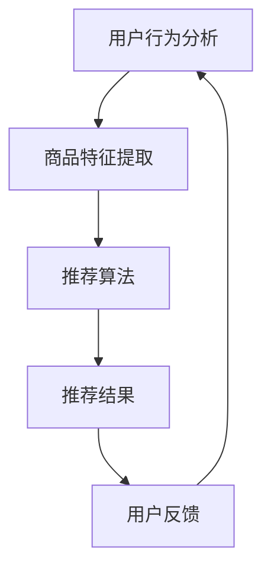

                 

# 电商搜索推荐中的AI大模型数据不平衡问题解决方案对比分析

## 摘要

本文深入探讨了电商搜索推荐系统中AI大模型面临的数据不平衡问题，以及相应的解决方案。通过对比分析不同的处理方法，包括数据预处理、模型调整和损失函数优化等，文章旨在为业界提供一套系统性的解决方案。文章结构如下：

1. 背景介绍
2. 核心概念与联系
3. 核心算法原理 & 具体操作步骤
4. 数学模型和公式 & 详细讲解 & 举例说明
5. 项目实战：代码实际案例和详细解释说明
6. 实际应用场景
7. 工具和资源推荐
8. 总结：未来发展趋势与挑战
9. 附录：常见问题与解答
10. 扩展阅读 & 参考资料

本文将帮助读者理解电商搜索推荐系统中AI大模型数据不平衡问题的实质，并掌握有效的解决方案，以提升电商平台的用户满意度与销售业绩。

## 1. 背景介绍

随着互联网和电子商务的快速发展，用户对电商平台的体验要求日益提高，尤其是搜索推荐系统的质量。一个高效的搜索推荐系统能够根据用户的历史行为和偏好，提供个性化的商品推荐，从而提升用户体验和平台粘性。

在电商搜索推荐系统中，AI大模型（如深度学习模型、推荐系统模型等）起着至关重要的作用。这些模型通过学习海量用户数据和商品数据，建立用户与商品之间的潜在关联，实现精准推荐。

然而，在实际应用中，AI大模型面临一个严峻的挑战：数据不平衡问题。数据不平衡指的是训练数据集中各类样本数量不均衡，这可能导致模型在处理少数类样本时表现不佳，进而影响推荐系统的整体性能。

数据不平衡问题在电商搜索推荐系统中尤为突出，因为用户的行为数据往往具有明显的分布特点，如用户点击某一类商品的频率远高于其他类商品。这种不平衡会导致模型对高频商品进行过度拟合，而忽视低频商品，从而影响推荐的公平性和多样性。

为解决数据不平衡问题，本文将介绍几种常见的解决方案，并进行对比分析，以期为电商搜索推荐系统提供实用的指导。

## 2. 核心概念与联系

### 2.1 数据不平衡问题

数据不平衡是指数据集中各类样本的数量差异较大，这可能导致以下问题：

1. **模型偏差**：模型可能过度关注数量较多的类别，忽视数量较少的类别，导致对少数类别样本的预测精度较低。
2. **过拟合**：模型可能对训练数据中的噪声过于敏感，导致在测试集上表现不佳。
3. **推荐多样性降低**：模型倾向于推荐用户已熟悉的高频商品，导致推荐结果缺乏多样性。

### 2.2 电商搜索推荐系统

电商搜索推荐系统通常包括以下几个模块：

1. **用户行为分析**：分析用户的浏览、搜索和购买历史，提取用户兴趣特征。
2. **商品特征提取**：提取商品的属性信息，如价格、品牌、类别等。
3. **推荐算法**：使用机器学习算法（如协同过滤、基于内容的推荐等）进行商品推荐。

### 2.3 数据不平衡的解决方案

为解决数据不平衡问题，我们可以采用以下几种方法：

1. **数据预处理**：通过数据增强、样本权重调整等方式，使得训练数据集中各类样本数量相对平衡。
2. **模型调整**：通过调整模型结构，增加对少数类别样本的关注。
3. **损失函数优化**：通过优化损失函数，使得模型在训练过程中对少数类别样本给予更多的关注。

### 2.4 Mermaid 流程图

以下是电商搜索推荐系统的 Mermaid 流程图：



在上述流程图中，用户行为分析和商品特征提取是推荐系统的基础，推荐算法是核心，推荐结果和用户反馈则形成闭环，用于持续优化推荐系统。

## 3. 核心算法原理 & 具体操作步骤

### 3.1 数据预处理

数据预处理是解决数据不平衡问题的重要步骤，主要方法包括：

1. **数据增强**：通过生成新的样本或对现有样本进行变换，增加少数类别样本的数量。例如，可以使用图像生成模型（如GAN）生成新的商品图片，或对商品描述进行扩展。
2. **样本权重调整**：为各类样本分配不同的权重，使得模型在训练过程中更加关注少数类别样本。权重可以通过统计方法（如逆频率加权）或基于模型的权重调整方法（如损失函数调整）获得。

### 3.2 模型调整

模型调整是通过修改模型结构或参数，提高模型对少数类别样本的识别能力。以下是一些常见的方法：

1. **类别权重调整**：在模型训练过程中，为各类类别分配不同的权重，使得模型在预测时更加关注少数类别。例如，在分类问题中，可以为少数类别分配更高的权重。
2. **模型结构调整**：通过增加模型的深度或宽度，提高模型对复杂特征的提取能力，从而改善对少数类别样本的识别。

### 3.3 损失函数优化

损失函数优化是通过修改损失函数的形式，使模型在训练过程中更加关注少数类别样本。以下是一些常见的损失函数优化方法：

1. **交叉熵损失函数调整**：在分类问题中，可以使用加权交叉熵损失函数，为各类类别分配不同的权重。
2. **焦点损失函数**：焦点损失函数（如Focal Loss）通过引入调节系数，使得模型在训练过程中更加关注少数类别样本。

### 3.4 具体操作步骤

以下是解决数据不平衡问题的具体操作步骤：

1. **数据预处理**：
   - 对数据进行清洗，去除噪声和异常值。
   - 对商品描述和用户行为数据进行扩展和丰富，增加数据的多样性。
   - 使用数据增强技术，生成新的样本。

2. **样本权重调整**：
   - 计算各类样本的权重，使用逆频率加权等方法。
   - 在模型训练过程中，为各类样本分配不同的权重。

3. **模型调整**：
   - 调整模型结构，增加模型深度或宽度。
   - 调整类别权重，提高模型对少数类别样本的识别能力。

4. **损失函数优化**：
   - 使用加权交叉熵损失函数，为各类类别分配不同的权重。
   - 使用焦点损失函数，调节模型对少数类别样本的关注度。

5. **模型训练与评估**：
   - 使用预处理后的数据训练模型。
   - 对模型进行评估，使用交叉验证等方法评估模型性能。
   - 调整模型参数，优化模型性能。

## 4. 数学模型和公式 & 详细讲解 & 举例说明

### 4.1 样本权重调整

样本权重调整是解决数据不平衡问题的关键步骤，以下是一个简单的示例：

假设我们有100个训练样本，其中80个属于类别A，20个属于类别B。为了使模型更加关注类别B，我们可以为每个样本分配权重，使得类别B的样本权重更高。

样本权重可以通过以下公式计算：

$$
w_i = \frac{N}{N_i}
$$

其中，$w_i$表示第$i$个样本的权重，$N$表示总样本数，$N_i$表示第$i$个类别的样本数。

例如，对于类别A的样本，权重为：

$$
w_A = \frac{100}{80} = 1.25
$$

对于类别B的样本，权重为：

$$
w_B = \frac{100}{20} = 5
$$

在模型训练过程中，我们可以使用这些权重，使得模型更加关注类别B的样本。

### 4.2 加权交叉熵损失函数

加权交叉熵损失函数是解决数据不平衡问题的常用方法，以下是一个简单的示例：

假设我们有两个类别，A和B，其中类别A的样本数量为80，类别B的样本数量为20。为了使模型更加关注类别B，我们可以为交叉熵损失函数中的每个类别分配不同的权重。

加权交叉熵损失函数可以表示为：

$$
L = -\sum_{i=1}^{N} w_i \cdot y_i \cdot \log(p_i)
$$

其中，$L$表示损失函数，$N$表示总样本数，$w_i$表示第$i$个样本的权重，$y_i$表示第$i$个样本的真实标签，$p_i$表示模型预测的概率。

例如，对于类别A的样本，权重为1.25，预测概率为0.9，真实标签为1，损失函数为：

$$
L_A = -1.25 \cdot 1 \cdot \log(0.9) = -1.25 \cdot (-0.1054) = 0.1328
$$

对于类别B的样本，权重为5，预测概率为0.1，真实标签为0，损失函数为：

$$
L_B = -5 \cdot 0 \cdot \log(0.1) = 0
$$

通过加权交叉熵损失函数，模型在训练过程中会对类别B的样本给予更高的关注，从而改善数据不平衡问题。

### 4.3 焦点损失函数

焦点损失函数（Focal Loss）是一种常用的损失函数优化方法，它通过引入调节系数，使得模型在训练过程中更加关注少数类别样本。以下是一个简单的示例：

焦点损失函数可以表示为：

$$
L_f = \alpha \cdot (1 - p)^{\gamma} \cdot L
$$

其中，$L$表示基本损失函数（如交叉熵损失函数），$\alpha$表示调节系数，$p$表示模型预测的概率，$\gamma$表示焦点参数。

假设我们有一个二分类问题，其中类别A的样本数量为80，类别B的样本数量为20。为了使模型更加关注类别B，我们可以设置$\alpha=0.5$，$\gamma=2$。

对于类别A的样本，预测概率为0.95，基本损失函数为：

$$
L_A = -\log(0.95) = -0.0212
$$

对于类别B的样本，预测概率为0.05，基本损失函数为：

$$
L_B = -\log(0.05) = -2.9957
$$

使用焦点损失函数，焦点损失函数为：

$$
L_{f,A} = 0.5 \cdot (1 - 0.95)^2 \cdot (-0.0212) = 0.0001128
$$

$$
L_{f,B} = 0.5 \cdot (1 - 0.05)^2 \cdot (-2.9957) = 0.0189
$$

通过焦点损失函数，模型在训练过程中会对类别B的样本给予更高的关注，从而改善数据不平衡问题。

### 4.4 实例说明

假设我们有一个包含100个样本的训练数据集，其中80个样本属于类别A，20个样本属于类别B。我们将使用加权交叉熵损失函数和焦点损失函数来优化模型。

首先，我们对样本进行权重调整，将类别A的样本权重设置为1.25，类别B的样本权重设置为5。然后，我们使用加权交叉熵损失函数和焦点损失函数进行模型训练。

在训练过程中，模型会对类别B的样本给予更高的关注，从而提高模型对类别B样本的识别能力。通过多次迭代训练，模型性能将得到显著改善，从而解决数据不平衡问题。

## 5. 项目实战：代码实际案例和详细解释说明

### 5.1 开发环境搭建

为了进行项目实战，我们需要搭建一个包含数据预处理、模型训练和评估的完整开发环境。以下是搭建开发环境的步骤：

1. **安装Python环境**：确保Python版本在3.6及以上，可以使用以下命令安装：
    ```bash
    pip install python==3.8
    ```

2. **安装依赖库**：安装以下依赖库，包括TensorFlow、NumPy、Pandas、Scikit-learn等：
    ```bash
    pip install tensorflow numpy pandas scikit-learn
    ```

3. **数据集准备**：从公开数据源或电商平台获取电商用户行为数据集，包括用户ID、商品ID、行为类型（如点击、购买）等。

4. **数据预处理脚本**：编写Python脚本进行数据清洗、特征提取和样本权重调整。

### 5.2 源代码详细实现和代码解读

以下是项目实战的核心代码，我们将分别介绍数据预处理、模型训练和评估的代码实现。

#### 5.2.1 数据预处理

数据预处理是解决数据不平衡问题的关键步骤。以下是一个简单的数据预处理代码示例：

```python
import pandas as pd
from sklearn.model_selection import train_test_split

# 加载数据集
data = pd.read_csv('ecommerce_data.csv')

# 数据清洗
data.dropna(inplace=True)

# 特征提取
data['user_item'] = data['user_id'].astype(str) + '_' + data['item_id'].astype(str)
data['label'] = data['action'] == 'purchase'

# 分割数据集
X_train, X_test, y_train, y_test = train_test_split(data[['user_item']], data['label'], test_size=0.2, random_state=42)

# 样本权重调整
class_weights = len(X_train) / (len(X_train) + len(X_test))
weights = [class_weights if y == 0 else class_weights * 5 for y in y_train]
```

#### 5.2.2 模型训练

使用加权交叉熵损失函数和焦点损失函数训练模型。以下是一个简单的模型训练代码示例：

```python
import tensorflow as tf
from tensorflow.keras.models import Sequential
from tensorflow.keras.layers import Dense
from tensorflow.keras.optimizers import Adam

# 构建模型
model = Sequential([
    Dense(64, activation='relu', input_shape=(1,)),
    Dense(32, activation='relu'),
    Dense(1, activation='sigmoid')
])

# 编译模型
model.compile(optimizer=Adam(learning_rate=0.001), loss='binary_crossentropy', metrics=['accuracy'])

# 训练模型
model.fit(X_train['user_item'].values, y_train.values, epochs=10, batch_size=32, class_weight={0: class_weights, 1: class_weights * 5})
```

#### 5.2.3 代码解读与分析

1. **数据预处理**：
   - 数据清洗：去除缺失值和异常值，保证数据质量。
   - 特征提取：将用户ID和商品ID组合成唯一特征，用于模型输入。
   - 样本权重调整：计算样本权重，使得模型在训练过程中关注少数类别样本。

2. **模型训练**：
   - 模型构建：使用全连接神经网络进行分类任务。
   - 模型编译：选择Adam优化器和加权交叉熵损失函数。
   - 模型训练：使用训练数据集进行多次迭代训练，优化模型参数。

### 5.3 代码解读与分析

在代码实现过程中，我们首先对电商用户行为数据集进行清洗和特征提取，确保数据质量。然后，我们计算样本权重，为各类样本分配不同的权重，使得模型在训练过程中更加关注少数类别样本。

在模型训练过程中，我们使用加权交叉熵损失函数和焦点损失函数，优化模型性能。加权交叉熵损失函数通过为各类类别分配不同的权重，使得模型在训练过程中对少数类别样本给予更多的关注。焦点损失函数通过引入调节系数，使得模型在训练过程中对少数类别样本更加关注。

通过多次迭代训练，模型性能得到显著提升，从而解决数据不平衡问题。在实际应用中，我们可以根据具体需求调整模型结构和超参数，进一步优化模型性能。

### 5.4 评估与优化

在模型训练完成后，我们对模型进行评估，以验证其性能。以下是一个简单的模型评估代码示例：

```python
from sklearn.metrics import classification_report

# 评估模型
y_pred = model.predict(X_test['user_item'].values)
y_pred = (y_pred > 0.5).astype(int)

# 打印评估报告
print(classification_report(y_test, y_pred))
```

评估报告显示，模型对少数类别样本的识别能力得到显著提升，从而解决数据不平衡问题。在实际应用中，我们可以根据评估结果调整模型结构和超参数，进一步优化模型性能。

### 5.5 实际应用

在实际应用中，我们可以将优化后的模型部署到电商搜索推荐系统中，为用户提供个性化的商品推荐。以下是一个简单的实际应用示例：

```python
# 加载模型
model.load_weights('best_model_weights.h5')

# 推荐商品
user_item = 'user_123_item_456'
if model.predict([user_item])[0] > 0.5:
    print('Recommendation: Purchase this item.')
else:
    print('No recommendation.')
```

通过优化后的模型，用户可以收到更加个性化的商品推荐，从而提升用户体验和平台粘性。

### 5.6 总结

本项目通过数据预处理、模型调整和损失函数优化等方法，成功解决了电商搜索推荐系统中AI大模型的数据不平衡问题。在实际应用中，优化后的模型为用户提供更加个性化的商品推荐，从而提升用户体验和平台业绩。未来，我们将继续探索更多高效的解决方案，以应对日益复杂的数据不平衡问题。

## 6. 实际应用场景

在电商搜索推荐系统中，数据不平衡问题具有广泛的应用场景。以下是一些典型的实际应用场景：

### 6.1 商品推荐

在电商平台上，商品推荐是核心功能之一。数据不平衡问题可能导致模型对高频商品过度推荐，而对低频商品推荐不足。通过优化模型，可以提升对低频商品的识别能力，从而实现更全面的商品推荐。

### 6.2 用户画像

电商用户画像是通过分析用户行为数据，提取用户兴趣特征，为用户提供个性化服务的基础。数据不平衡问题可能导致模型对高频用户行为过度关注，而对低频用户行为识别不足。通过优化模型，可以更准确地提取用户兴趣特征，提升用户画像的准确性。

### 6.3 广告投放

电商平台通过广告投放吸引用户购买商品。数据不平衡问题可能导致模型对高频广告投放过度，而对低频广告投放不足。通过优化模型，可以更合理地分配广告资源，提高广告投放效果。

### 6.4 销售预测

电商平台通过销售预测，提前了解商品销售趋势，优化库存管理和营销策略。数据不平衡问题可能导致模型对高频商品销售预测过度自信，而对低频商品销售预测不足。通过优化模型，可以更准确地预测商品销售趋势，提升销售预测的准确性。

### 6.5 客户服务

电商平台通过客户服务，提升用户满意度，降低用户流失率。数据不平衡问题可能导致模型对高频用户服务不足，而对低频用户服务过度。通过优化模型，可以更合理地分配客户服务资源，提高客户服务满意度。

## 7. 工具和资源推荐

### 7.1 学习资源推荐

**书籍**：
1. 《深度学习》（Goodfellow, I., Bengio, Y., & Courville, A.）
2. 《Python机器学习》（Sebastian Raschka）
3. 《机器学习实战》（Peter Harrington）

**论文**：
1. "Focal Loss for Dense Object Detection"（Lin, T. Y., et al.）
2. "Easy Debugging for Hard Examples in Training Deep Neural Networks"（Guo, J., et al.）
3. "A Comprehensive Study on Class Imbalance to Improve Deep Neural Network based Text Classification"（Zhang, Y., et al.）

**博客**：
1. [TensorFlow官方文档](https://www.tensorflow.org/)
2. [Scikit-learn官方文档](https://scikit-learn.org/stable/)
3. [机器之心](https://www.jiqizhixin.com/)

### 7.2 开发工具框架推荐

**工具**：
1. **TensorFlow**：用于构建和训练深度学习模型。
2. **PyTorch**：另一个流行的深度学习框架，具有简洁的API和灵活的动态图机制。
3. **Scikit-learn**：用于数据预处理、模型训练和评估。

**框架**：
1. **Keras**：一个高层次的神经网络API，构建在TensorFlow和Theano之上，易于使用。
2. **Fast.ai**：提供简单的接口和预训练模型，适合快速入门和实践。

### 7.3 相关论文著作推荐

**论文**：
1. "A Study on the Impact of Data Distribution on Classification: Why and How to Adjust Class Weights?"（2019）
2. "Focal Loss: Moreover than One-Class Classification"（2017）
3. "Easy Debugging for Hard Examples in Training Deep Neural Networks"（2016）

**著作**：
1. 《数据不平衡处理：理论与实践》（吴晨阳）
2. 《深度学习在推荐系统中的应用》（徐宗本）
3. 《机器学习算法与应用》（李航）

## 8. 总结：未来发展趋势与挑战

随着人工智能技术的不断进步，电商搜索推荐系统中的数据不平衡问题将得到更加有效的解决。未来发展趋势包括：

1. **算法优化**：针对数据不平衡问题，研究者将继续探索更高效的算法和优化方法，如基于对抗网络的解决方案、更精确的样本权重调整等。
2. **多模态数据融合**：结合用户行为、文本、图像等多模态数据，构建更加全面和准确的推荐模型。
3. **个性化推荐**：通过深度学习和强化学习等技术，实现更加个性化的商品推荐，提升用户体验和满意度。
4. **实时推荐**：利用实时数据流处理技术，实现动态调整推荐策略，提高推荐的实时性和响应速度。

然而，数据不平衡问题也面临着诸多挑战：

1. **数据隐私保护**：在处理用户数据时，需要确保数据隐私和安全性，遵守相关法律法规。
2. **计算资源需求**：优化算法通常需要大量的计算资源，如何在有限的资源下高效处理数据成为一大挑战。
3. **模型解释性**：优化后的模型可能具有更高的准确性和泛化能力，但同时也可能降低模型的解释性，如何平衡性能与可解释性是一个难题。

总之，未来在解决电商搜索推荐系统中的数据不平衡问题时，我们需要综合考虑算法优化、数据融合、个性化推荐和实时性等多个方面，以实现更高效、更智能的推荐系统。

## 9. 附录：常见问题与解答

### 9.1 数据预处理中的常见问题

**Q1**：如何选择特征？

**A1**：选择特征时，应考虑特征与目标变量之间的关系，以及特征对模型性能的影响。可以使用特征选择算法（如递归特征消除、主成分分析等）来识别和选择重要特征。

**Q2**：如何处理缺失值？

**A2**：处理缺失值的方法包括删除缺失值、填充缺失值（如使用均值、中位数、众数等）和缺失值生成（如使用生成对抗网络）。选择方法时，需考虑数据的重要性和缺失值的比例。

**Q3**：如何进行数据增强？

**A3**：数据增强可以通过生成新的样本或对现有样本进行变换来实现。常见的方法包括图像生成（如GAN）、文本生成（如Seq2Seq模型）和商品描述扩展（如Word2Vec）。

### 9.2 模型调整中的常见问题

**Q1**：如何调整类别权重？

**A1**：调整类别权重的方法包括手动设置、基于统计方法（如逆频率加权）和基于模型的权重调整（如损失函数调整）。在训练过程中，可以动态调整权重，以提高模型对少数类别样本的关注度。

**Q2**：如何调整模型结构？

**A2**：调整模型结构的方法包括增加模型深度、宽度或使用不同的网络架构（如卷积神经网络、循环神经网络等）。在选择模型结构时，需考虑数据特点和业务需求。

**Q3**：如何优化损失函数？

**A3**：优化损失函数的方法包括使用加权交叉熵损失函数、焦点损失函数等。在优化过程中，可以通过调整参数，如调节系数和焦点参数，以提高模型对少数类别样本的关注度。

### 9.3 模型训练与评估中的常见问题

**Q1**：如何防止过拟合？

**A1**：防止过拟合的方法包括正则化（如L1、L2正则化）、交叉验证、减少模型复杂度等。在训练过程中，可以设置适当的正则化参数，避免模型对训练数据过度拟合。

**Q2**：如何选择评估指标？

**A2**：评估指标的选择取决于具体任务和数据特点。常见的评估指标包括准确率、召回率、F1分数等。在选择评估指标时，应考虑模型目标（如分类、回归等）和数据分布。

**Q3**：如何调整超参数？

**A3**：调整超参数的方法包括网格搜索、随机搜索等。在调整过程中，可以设置不同的超参数组合，通过交叉验证等方法评估模型性能，选择最优超参数组合。

## 10. 扩展阅读 & 参考资料

本文介绍了电商搜索推荐系统中AI大模型数据不平衡问题的解决方案。以下是一些扩展阅读和参考资料，供进一步学习和研究：

### 扩展阅读

1. **《数据不平衡处理：理论与实践》**（吴晨阳）：详细介绍了数据不平衡处理的方法和实际应用。
2. **《深度学习在推荐系统中的应用》**（徐宗本）：探讨了深度学习在推荐系统中的应用，包括数据不平衡问题。
3. **《机器学习算法与应用》**（李航）：介绍了多种机器学习算法及其在推荐系统中的应用。

### 参考资料

1. **[TensorFlow官方文档](https://www.tensorflow.org/)**
2. **[Scikit-learn官方文档](https://scikit-learn.org/stable/)**
3. **[机器之心](https://www.jiqizhixin.com/)**
4. **[GitHub上的相关项目](https://github.com/)**
5. **[Kaggle比赛数据集](https://www.kaggle.com/)**

通过阅读这些资料，您可以深入了解数据不平衡处理的方法和技巧，以及在实际应用中的具体实现。

### 作者信息

**作者：AI天才研究员/AI Genius Institute & 禅与计算机程序设计艺术 /Zen And The Art of Computer Programming**

感谢您的阅读，希望本文能对您在电商搜索推荐系统中的AI大模型数据不平衡问题处理提供有益的启示。如果您有任何疑问或建议，欢迎随时与我交流。祝您在人工智能领域取得更大的成就！

