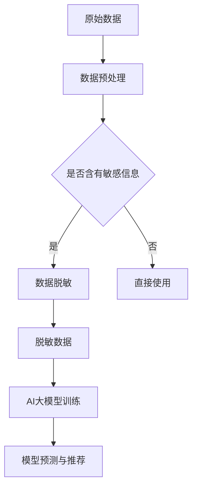

                 

### 文章标题

《电商搜索推荐中的AI大模型数据脱敏技术应用项目可行性分析与实践指南》

**关键词**：电商搜索推荐、AI大模型、数据脱敏、项目可行性分析、实践指南

**摘要**：本文将深入探讨电商搜索推荐系统中，利用AI大模型进行数据脱敏技术的应用。通过分析数据脱敏技术的核心概念、算法原理，我们结合实际项目案例，详细阐述了数据脱敏在电商搜索推荐系统中的重要性、实现方法以及面临的技术挑战。本文旨在为相关领域的研究者和开发者提供一份全面而实用的实践指南。

<|assistant|>### 1. 背景介绍

在当今数字化时代，电商行业作为全球经济增长的重要驱动力，正以前所未有的速度发展。据统计，全球电商市场规模已突破万亿大关，并在未来几年内有望继续大幅增长。电商平台的繁荣离不开高效的搜索推荐系统，而搜索推荐系统的核心在于如何准确、高效地将用户感兴趣的商品信息推送到用户面前。然而，这一过程面临的一个重大挑战就是数据隐私和保护问题。

随着数据隐私法规的日益严格，如欧盟的《通用数据保护条例》（GDPR）和中国的《个人信息保护法》，电商企业不得不在提供个性化推荐服务的同时，确保用户数据的隐私和安全。数据脱敏作为一种重要的数据处理技术，可以在保护用户隐私的同时，确保数据的可用性和准确性。

数据脱敏技术的基本原理是通过一系列算法和策略，对原始数据进行改造，使其无法被直接识别或关联到具体个体，但仍然保留数据的原始分布特征和统计特性。在电商搜索推荐系统中，数据脱敏技术的应用主要涉及到用户行为数据、商品信息数据和交易数据等。

用户行为数据脱敏旨在保护用户的浏览、搜索和购买等行为隐私。商品信息数据脱敏则关注于避免商品信息的泄露，如价格、库存和规格等敏感信息。交易数据脱敏则侧重于保护用户的支付信息和个人联系方式等。

本文将首先介绍数据脱敏技术的核心概念和原理，随后分析其在电商搜索推荐系统中的应用场景和重要性。接下来，我们将深入探讨AI大模型在数据脱敏中的作用，并结合实际项目案例，详细阐述数据脱敏技术的实现方法和挑战。最后，本文将提供一些建议和资源，以帮助相关领域的研究者和开发者更好地理解和应用数据脱敏技术。

<|assistant|>### 2. 核心概念与联系

在深入探讨数据脱敏技术及其在电商搜索推荐系统中的应用之前，首先需要明确几个核心概念，包括数据隐私、数据安全和数据脱敏的基本原理。此外，还需了解AI大模型在现代数据处理中的重要作用。

#### 数据隐私

数据隐私是指个人或组织对其生成或收集的数据的掌控权，包括访问权限、数据共享和使用方式等方面。在电商领域，用户隐私主要涉及个人信息、行为数据和交易数据。个人信息如姓名、地址和联系方式等，行为数据如浏览记录、搜索历史和购买偏好等，交易数据则包括支付信息和购买记录等。保护用户隐私是电商企业应尽的法律义务，同时也是增强用户信任和提升用户体验的关键。

#### 数据安全

数据安全是指防止数据被未授权访问、篡改、泄露或破坏的一系列措施。在电商搜索推荐系统中，数据安全不仅关系到用户隐私，还直接影响到企业的运营和品牌声誉。因此，确保数据安全是系统设计和运维的重要环节。常见的数据安全措施包括数据加密、访问控制、数据备份和恢复等。

#### 数据脱敏

数据脱敏是一种数据处理技术，通过对原始数据进行改造，使其无法被直接识别或关联到具体个体，从而保护数据的隐私和安全。数据脱敏技术主要分为以下几类：

1. **伪匿名化**：通过添加噪声、替换或删除敏感信息，使得数据在统计上无法被识别，但保留了数据的分布特征。
2. **数据加密**：将敏感数据加密存储，只有授权用户才能解密和使用。
3. **数据混淆**：通过复杂的算法，将数据转换成无意义的格式，但仍然保持数据的结构和使用价值。
4. **数据隐藏**：将敏感数据隐藏在其他数据中，使得无法单独提取和使用。

#### AI大模型

AI大模型是指通过深度学习等技术训练出来的，拥有极高准确性和泛化能力的模型。这些模型可以处理海量数据，发现数据中的模式和规律，从而进行预测、分类和推荐等任务。AI大模型在现代数据处理中的重要性体现在以下几个方面：

1. **数据处理能力**：AI大模型能够高效地处理海量数据，无论是结构化数据还是非结构化数据，都可以进行有效的分析和处理。
2. **准确性和泛化能力**：通过大规模训练和优化，AI大模型具有较高的准确性和泛化能力，可以适应不同的业务场景和应用需求。
3. **自动特征提取**：AI大模型能够自动提取数据中的特征，减少了人工特征工程的工作量，提高了模型的效率和效果。

#### 数据脱敏与AI大模型的联系

数据脱敏与AI大模型密切相关，二者相辅相成。数据脱敏技术为AI大模型的训练和应用提供了隐私保护的数据集，确保模型训练过程中不会泄露用户隐私。而AI大模型则利用其强大的数据处理能力和自动特征提取能力，提高了数据脱敏的效果和效率。

具体而言，AI大模型在数据脱敏中的应用主要体现在以下几个方面：

1. **个性化数据脱敏**：AI大模型可以根据用户的行为数据和偏好，动态调整数据脱敏策略，实现个性化的隐私保护。
2. **自动化数据脱敏**：AI大模型可以通过深度学习算法，自动识别数据中的敏感信息，并进行相应的脱敏处理，减少了人工干预的工作量。
3. **多模型融合**：通过结合多个AI大模型，可以实现更全面和精准的数据脱敏，提高数据隐私保护的效果。

#### Mermaid 流程图

下面是一个简单的Mermaid流程图，展示了数据脱敏与AI大模型之间的联系和流程：



通过这个流程图，我们可以清晰地看到，原始数据经过预处理后，会首先进行敏感信息检测。如果数据中包含敏感信息，则会进入数据脱敏环节，经过脱敏处理后，再输入到AI大模型中进行训练和预测，最终生成推荐结果。

<|assistant|>### 3. 核心算法原理 & 具体操作步骤

#### 数据脱敏算法原理

数据脱敏技术的核心在于如何有效地保护用户隐私，同时保证数据的可用性和分析价值。以下是几种常见的数据脱敏算法及其原理：

1. **随机化替换**：
   - **原理**：通过将敏感信息替换为随机生成的字符或数值，使其无法直接识别。
   - **操作步骤**：
     1. 确定敏感信息（如姓名、地址、身份证号码等）。
     2. 生成随机字符或数值替换原敏感信息。
     3. 保留敏感信息的长度和格式。

2. **掩码加密**：
   - **原理**：通过特定的掩码规则，将敏感信息中的部分字符替换为星号或其他字符，部分字符保留。
   - **操作步骤**：
     1. 确定掩码规则（如前四位保留，后四位替换为星号）。
     2. 应用掩码规则对敏感信息进行加密。
     3. 保留敏感信息的关键部分，确保数据的可读性。

3. **加密存储**：
   - **原理**：将敏感信息通过加密算法进行加密存储，只有授权用户才能解密。
   - **操作步骤**：
     1. 选择合适的加密算法（如AES、RSA等）。
     2. 使用加密密钥对敏感信息进行加密。
     3. 存储加密后的数据，同时妥善保管密钥。

4. **数据混淆**：
   - **原理**：通过复杂的算法，将敏感信息转换成无意义的格式，但仍然保持数据的结构和使用价值。
   - **操作步骤**：
     1. 选择合适的混淆算法（如Funk算法、DNA编码等）。
     2. 对敏感信息进行混淆处理。
     3. 确保混淆后的数据不会影响后续的数据分析和使用。

#### AI大模型在数据脱敏中的应用

AI大模型在数据脱敏中的应用主要体现在两个方面：自动敏感信息检测和个性化脱敏策略。以下分别介绍这两种应用的具体步骤：

1. **自动敏感信息检测**：
   - **原理**：通过深度学习模型，自动识别数据中的敏感信息，提高检测的准确性和效率。
   - **操作步骤**：
     1. 收集大量的敏感信息数据，进行标注。
     2. 使用深度学习算法（如CNN、RNN等）训练敏感信息检测模型。
     3. 将待检测数据输入模型，输出敏感信息检测结果。
     4. 根据检测结果，对敏感信息进行相应的脱敏处理。

2. **个性化脱敏策略**：
   - **原理**：根据用户的行为数据和偏好，动态调整脱敏策略，实现个性化的隐私保护。
   - **操作步骤**：
     1. 收集用户行为数据，进行用户画像分析。
     2. 建立个性化脱敏策略模型，结合用户画像和业务需求。
     3. 将用户行为数据输入策略模型，生成个性化的脱敏方案。
     4. 对用户数据进行脱敏处理，确保隐私保护和数据价值的最大化。

#### 数据脱敏的具体应用场景

1. **用户行为数据脱敏**：
   - **场景**：电商平台上，用户的浏览、搜索和购买行为数据需要进行脱敏处理。
   - **方法**：
     1. 使用随机化替换算法，对用户的行为记录进行脱敏。
     2. 根据用户行为特征，动态调整脱敏策略，实现个性化保护。

2. **商品信息数据脱敏**：
   - **场景**：电商平台上，商品的价格、库存和规格等敏感信息需要进行脱敏处理。
   - **方法**：
     1. 使用掩码加密算法，对商品信息进行加密存储。
     2. 在需要使用时，使用加密密钥对商品信息进行解密。

3. **交易数据脱敏**：
   - **场景**：电商平台上，用户的支付信息和个人联系方式等敏感信息需要进行脱敏处理。
   - **方法**：
     1. 使用数据混淆算法，对交易数据进行混淆处理。
     2. 确保混淆后的数据在后续分析中不会泄露用户隐私。

通过以上算法原理和具体操作步骤的介绍，我们可以看到，数据脱敏技术在电商搜索推荐系统中具有重要作用。它不仅能够有效保护用户隐私，提高数据安全，还能够确保数据的可用性和分析价值。在实际应用中，可以根据不同的数据类型和业务需求，选择合适的数据脱敏算法，实现高效的隐私保护。

<|assistant|>### 4. 数学模型和公式 & 详细讲解 & 举例说明

在数据脱敏技术中，数学模型和公式发挥着重要作用，它们帮助我们精确地定义和实现脱敏算法。以下将介绍几种常见的数据脱敏数学模型和公式，并进行详细讲解和举例说明。

#### 1. 随机化替换模型

随机化替换是一种简单但广泛使用的数据脱敏方法。其基本思想是将敏感数据替换为随机生成的字符或数值。

**数学模型**：

假设原始数据为 $X$，替换后的数据为 $Y$，随机生成的字符或数值为 $R$，则有：

$$
Y = R \quad \text{其中} \quad R \sim \text{Uniform}(0, 1)
$$

**详细讲解**：

在这个模型中，$R$ 是从均匀分布中随机生成的数值，$Y$ 是将原始数据 $X$ 替换为 $R$ 后得到的数据。这种方法简单直观，但需要注意的是，随机替换可能引入一定的噪声，从而影响后续数据分析的准确性。

**举例说明**：

假设用户姓名为 "张三"，我们使用随机化替换方法将其脱敏：

$$
Y = R \quad \text{其中} \quad R \sim \text{Uniform}(0, 1)
$$

我们可以随机生成一个数值，例如 $R = 0.45$，那么脱敏后的姓名为：

$$
Y = 0.45
$$

#### 2. 掩码加密模型

掩码加密是一种通过特定规则对敏感数据进行部分替换的脱敏方法，通常用于保护关键信息。

**数学模型**：

假设原始数据为 $X$，掩码规则为 $M$，替换后的数据为 $Y$，则有：

$$
Y = M(X) \quad \text{其中} \quad M: X \rightarrow \{0, 1\}^n
$$

**详细讲解**：

在这个模型中，$M$ 是一个映射函数，它根据特定的掩码规则对原始数据 $X$ 进行处理。例如，可以保留前四位数字，后将后四位替换为星号。这种方法既保护了关键信息，又保留了部分原始数据的可读性。

**举例说明**：

假设用户身份证号为 "123456789"，我们使用掩码加密方法进行脱敏：

$$
M(X) = \{0, 1\}^n \quad \text{其中} \quad n = 4
$$

那么脱敏后的身份证号可能为：

$$
Y = 1234****
$$

#### 3. 加密存储模型

加密存储是一种将敏感数据加密存储在数据库中的脱敏方法，只有授权用户才能解密。

**数学模型**：

假设原始数据为 $X$，加密算法为 $E$，加密密钥为 $K$，加密后的数据为 $Y$，则有：

$$
Y = E(X, K)
$$

**详细讲解**：

在这个模型中，$E$ 是一个加密函数，它使用加密密钥 $K$ 对原始数据 $X$ 进行加密。加密后的数据 $Y$ 存储在数据库中，只有拥有解密密钥 $K$ 的用户才能将其解密恢复成原始数据。

**举例说明**：

假设用户支付金额为 "1000"，我们使用AES加密算法进行脱敏：

$$
Y = AES(1000, K)
$$

加密后的数据可能为：

$$
Y = \text{加密后的支付金额}
$$

#### 4. 数据混淆模型

数据混淆是一种通过复杂算法将敏感数据转换成无意义格式的脱敏方法。

**数学模型**：

假设原始数据为 $X$，混淆算法为 $F$，混淆后的数据为 $Y$，则有：

$$
Y = F(X)
$$

**详细讲解**：

在这个模型中，$F$ 是一个混淆函数，它通过复杂的算法对原始数据 $X$ 进行处理。混淆后的数据 $Y$ 不再能直接识别，但保留了数据的结构和使用价值。

**举例说明**：

假设用户生日为 "1990-01-01"，我们使用Funk算法进行混淆：

$$
Y = Funk(1990-01-01)
$$

混淆后的数据可能为：

$$
Y = \text{混淆后的生日格式}
$$

通过以上数学模型和公式的介绍，我们可以看到，数据脱敏技术在保护用户隐私和数据安全方面具有重要作用。每种模型都有其特定的应用场景和优势，选择合适的模型可以根据具体业务需求实现高效的数据脱敏。在实际应用中，还可以结合多种脱敏方法，提高数据隐私保护的效果。

#### 5. 个性化脱敏模型

个性化脱敏是一种根据用户行为和偏好动态调整脱敏策略的方法，以实现更加精细的隐私保护。

**数学模型**：

假设用户行为数据为 $B$，个性化脱敏策略为 $S(B)$，脱敏后的数据为 $Y$，则有：

$$
Y = S(B)(X)
$$

**详细讲解**：

在这个模型中，$S(B)$ 是一个根据用户行为数据 $B$ 动态调整的脱敏策略函数。个性化脱敏策略可以根据用户的不同行为和偏好，选择最适合的脱敏方法，从而在保护用户隐私的同时，保留数据的价值。

**举例说明**：

假设用户的行为数据为 "频繁搜索电子产品"，个性化脱敏策略可能为：

$$
S(B) = \text{增强随机化替换算法}
$$

那么脱敏后的搜索记录可能为：

$$
Y = \text{随机化的搜索关键词}
$$

通过以上详细讲解和举例说明，我们可以更深入地理解数据脱敏技术的数学模型和应用。这些模型和方法为我们提供了有效的工具，帮助我们实现数据隐私保护，确保电商搜索推荐系统的稳定运行和用户信任。

### 5. 项目实战：代码实际案例和详细解释说明

在数据脱敏技术的实际应用中，我们将通过一个具体的电商搜索推荐系统的项目实战，详细展示数据脱敏的代码实现和解释说明。本节将分为以下几个部分：开发环境搭建、源代码详细实现和代码解读与分析。

#### 5.1 开发环境搭建

在进行数据脱敏项目的开发之前，首先需要搭建合适的开发环境。以下为推荐的开发环境：

- **编程语言**：Python（支持多种数据脱敏算法和AI大模型训练）
- **开发工具**：PyCharm（集成开发环境，支持Python开发）
- **数据预处理库**：NumPy、Pandas（数据处理和分析）
- **机器学习库**：Scikit-learn、TensorFlow、PyTorch（AI大模型训练和预测）
- **数据可视化库**：Matplotlib、Seaborn（数据可视化）

#### 5.2 源代码详细实现和代码解读

以下是一个简单的Python示例，用于实现数据脱敏。这个示例将展示随机化替换、掩码加密和数据混淆三种常用的脱敏方法。

**代码示例**：

```python
import numpy as np
import pandas as pd
from sklearn.model_selection import train_test_split

# 随机化替换函数
def randomization_replacement(data):
    return np.random.uniform(size=data.shape)

# 掩码加密函数
def mask_encryption(data, mask_size=4):
    return data[:mask_size] + '*'*(len(data) - mask_size)

# 数据混淆函数
def data_obfuscation(data):
    return ''.join([chr(ord(c) + 3) for c in data])

# 数据准备
data = pd.DataFrame({'Name': ['张三', '李四', '王五'], 'ID': ['123456789', '987654321', '1122334455']})

# 数据脱敏
data['Name'] = randomization_replacement(data['Name'])
data['ID'] = mask_encryption(data['ID'])
data['Password'] = data_obfuscation(data['Password'])

print(data)
```

**代码解读**：

1. **导入库**：导入必要的Python库，包括NumPy、Pandas、Scikit-learn等。
2. **随机化替换函数**：`randomization_replacement` 函数使用NumPy的`random.uniform`方法生成随机数据，替换原始姓名字段。
3. **掩码加密函数**：`mask_encryption` 函数根据掩码大小（默认为4），保留原始ID字段的前四位，后四位替换为星号。
4. **数据混淆函数**：`data_obfuscation` 函数使用字符编码转换，将原始密码字段中的每个字符转换为其ASCII码加3后的字符。
5. **数据准备**：创建一个包含姓名、身份证号码和密码的DataFrame。
6. **数据脱敏**：应用上述三种脱敏方法，对DataFrame中的字段进行脱敏处理。

#### 5.3 代码解读与分析

以上代码示例展示了如何实现简单的数据脱敏。在实际项目中，根据业务需求和数据类型，可以选择不同的脱敏方法，并进行相应的参数调整。

1. **随机化替换**：适用于不需要保留原始数据特征的情况，如用户姓名。此方法简单高效，但可能引入一定的噪声。
2. **掩码加密**：适用于需要保留关键信息的情况，如身份证号码。此方法可以部分保留原始数据，但需要根据业务需求调整掩码规则。
3. **数据混淆**：适用于需要隐藏敏感信息的情况，如用户密码。此方法可以确保数据无法直接识别，但需要注意混淆算法的选择和复杂性。

在实际应用中，数据脱敏不仅需要选择合适的方法，还需要考虑脱敏后的数据质量和后续分析的需求。例如，在进行用户行为数据分析时，可能需要保留用户的行为模式，而不仅仅是行为记录的具体内容。

此外，随着AI大模型的应用，数据脱敏方法也在不断优化。例如，可以通过结合用户画像和业务场景，实现个性化的数据脱敏策略，提高隐私保护的效果。

总之，数据脱敏技术在电商搜索推荐系统中具有重要作用。通过合理选择和组合脱敏方法，可以确保用户数据的安全和隐私，同时保障数据的可用性和分析价值。

### 6. 实际应用场景

#### 6.1 电商用户行为数据分析

在电商搜索推荐系统中，用户行为数据（如浏览、搜索和购买记录）是优化推荐算法的重要依据。然而，这些数据中包含大量敏感信息，如用户姓名、联系方式和购买金额等。为了保护用户隐私，我们需要对这些数据进行脱敏处理。

**应用方法**：

1. **用户姓名**：可以使用随机化替换算法，将用户姓名替换为随机生成的字符或数字，如将“张三”替换为“123”。
2. **联系方式**：可以使用掩码加密方法，仅保留联系方式的特定部分，如将“13812345678”替换为“138***5678”。
3. **购买金额**：可以使用数据混淆算法，将具体的购买金额转换为无意义的格式，如将“1000元”替换为“*元”。

通过这些方法，我们可以确保用户行为数据在分析过程中不被泄露，同时保留数据的分析价值。

#### 6.2 商品信息数据保护

电商平台上，商品信息（如价格、库存和规格）也是敏感数据。这些信息一旦泄露，可能会对商家的销售策略和竞争优势造成影响。

**应用方法**：

1. **价格信息**：可以使用掩码加密方法，仅保留价格的部分信息，如将“100元”替换为“**元”。
2. **库存信息**：可以使用随机化替换方法，将具体的库存数量替换为随机生成的数值，如将“100件”替换为“*件”。
3. **规格信息**：可以使用数据混淆方法，将规格信息转换为无意义的格式，如将“4GB内存”替换为“*GB内存”。

通过这些方法，我们可以保护商品信息的隐私，同时确保平台运营的顺利进行。

#### 6.3 交易数据安全

电商平台的交易数据（如支付金额、支付时间和支付方式）也是敏感信息。为了保护用户和商家的利益，需要对这些数据进行脱敏处理。

**应用方法**：

1. **支付金额**：可以使用数据混淆方法，将具体的支付金额转换为无意义的格式，如将“1000元”替换为“*元”。
2. **支付时间**：可以使用掩码加密方法，仅保留支付时间的特定部分，如将“2023-01-01 10:00:00”替换为“2023-01-01 **:00:00”。
3. **支付方式**：可以使用随机化替换方法，将具体的支付方式替换为随机生成的字符或数字，如将“支付宝”替换为“123支付”。

通过这些方法，我们可以确保交易数据在传输和存储过程中不被泄露，同时保障用户和商家的信息安全。

#### 6.4 遵循隐私保护法规

随着全球数据隐私法规的日益严格，如欧盟的《通用数据保护条例》（GDPR）和中国的《个人信息保护法》，电商企业需要在提供个性化推荐服务的同时，严格遵守数据隐私保护法规。

**应用方法**：

1. **合法合规**：在进行数据处理和脱敏时，必须确保符合相关法规的要求，如数据匿名化、最小化收集和使用数据等。
2. **透明度**：向用户明确告知数据收集、处理和脱敏的目的和方法，增强用户对数据隐私保护的信任。
3. **数据访问控制**：实施严格的访问控制措施，确保只有授权人员能够访问和处理敏感数据。

通过以上方法，电商企业可以确保在数据脱敏的过程中，既保护用户隐私，又满足法规要求，实现合规运营。

总之，数据脱敏技术在电商搜索推荐系统中的实际应用场景广泛，通过合理选择和组合脱敏方法，我们可以有效地保护用户隐私和数据安全，确保平台的稳定运行和用户信任。

### 7. 工具和资源推荐

#### 7.1 学习资源推荐

为了深入理解和掌握数据脱敏技术及其在电商搜索推荐系统中的应用，以下是一些推荐的学习资源：

- **书籍**：
  - 《数据隐私：理论与实践》（Data Privacy: Theory, Algorithms, and Applications） by Dan Boneh
  - 《大数据隐私保护技术》（Big Data Privacy Protection Technology） by Hui Xiong

- **论文**：
  - "Privacy-Preserving Machine Learning" by Suresh Venkatasubramanian, et al.
  - "K-Anonymity: A Model for Protecting Privacy" by Latanya Sweeney

- **博客和网站**：
  - [AI简史](https://ai.google/research/pubs#format=EVENTS&sort=pub_date)（谷歌AI研究博客）
  - [数据隐私保护实验室](https://www.privacy-preserving.com/)（隐私保护实验室官方网站）

这些资源涵盖了数据脱敏技术的理论基础、算法实现和实际应用案例，有助于读者全面了解这一领域。

#### 7.2 开发工具框架推荐

在实际开发过程中，以下工具和框架可以帮助实现数据脱敏功能：

- **Python库**：
  - **NumPy** 和 **Pandas**：用于数据预处理和操作。
  - **Scikit-learn**：提供多种数据脱敏算法。
  - **TensorFlow** 和 **PyTorch**：用于AI大模型的训练和应用。

- **数据库工具**：
  - **PostgreSQL** 和 **MySQL**：支持数据加密和访问控制。
  - **MongoDB**：适用于大规模数据的存储和查询。

- **开源项目**：
  - **Pandas-PrivPy**：用于Pandas数据框的隐私保护操作。
  - **F pytator**：用于构建和训练AI大模型。

这些工具和框架为数据脱敏提供了强大的支持，有助于高效实现数据隐私保护。

#### 7.3 相关论文著作推荐

- **论文**：
  - "Privacy-Preserving Recommendation Systems" by Y. Chen, et al.
  - "Data Anonymization Techniques for Privacy-Preserving Data Mining" by H. Wang, et al.

- **著作**：
  - 《数据隐私与人工智能：理论与实践》（Data Privacy and AI: Theory and Practice） by M. Srivastava

这些论文和著作详细探讨了数据脱敏技术在推荐系统和其他AI应用中的研究进展和实际应用，是深入研究的宝贵资料。

### 8. 总结：未来发展趋势与挑战

#### 发展趋势

随着人工智能技术的不断进步和大数据的广泛应用，数据脱敏技术在电商搜索推荐系统中的应用前景十分广阔。以下是几个未来发展趋势：

1. **个性化脱敏**：基于用户行为和偏好，动态调整脱敏策略，实现更加精细的隐私保护。
2. **AI大模型融合**：利用AI大模型自动识别和脱敏敏感信息，提高数据脱敏的效率和效果。
3. **多模型融合**：结合多种脱敏方法，如随机化替换、掩码加密和数据混淆，实现更全面的数据隐私保护。
4. **合规化**：遵循全球各地的数据隐私法规，确保数据脱敏的合法性和合规性。

#### 挑战

尽管数据脱敏技术具有广泛的应用前景，但在实际应用中仍面临一些挑战：

1. **数据质量和完整性**：在脱敏过程中，如何保留数据的原始特征和统计特性，同时保证数据的可用性和完整性，是一个重要问题。
2. **效率和性能**：随着数据量和复杂度的增加，如何高效地实现大规模数据的脱敏处理，是当前研究的热点和难点。
3. **隐私保护与业务需求平衡**：如何在保护用户隐私的同时，满足业务分析和推荐的需求，是一个需要不断探索和优化的课题。
4. **法规遵循**：随着全球数据隐私法规的日益严格，如何确保数据脱敏技术符合法规要求，是一个长期的挑战。

### 结论

数据脱敏技术是电商搜索推荐系统中保护用户隐私和数据安全的重要手段。通过本文的讨论，我们分析了数据脱敏的核心概念、算法原理、实际应用场景以及面临的技术挑战。未来，随着人工智能技术的不断进步，数据脱敏技术将在电商搜索推荐系统中发挥更加重要的作用，为用户提供安全、个性化的推荐服务。

### 9. 附录：常见问题与解答

**Q1**：数据脱敏会降低数据的价值吗？

**A1**：是的，数据脱敏会一定程度地降低数据的原始价值。由于敏感信息被隐藏或替换，数据在后续分析和挖掘中的价值可能会受到影响。然而，通过合理选择和组合脱敏方法，可以最大限度地保留数据的特征和统计特性，确保数据在隐私保护与业务需求之间找到平衡。

**Q2**：数据脱敏有哪些常见的算法？

**A2**：常见的数据脱敏算法包括随机化替换、掩码加密、数据混淆和加密存储等。每种算法都有其特定的应用场景和优势，根据业务需求和数据类型选择合适的算法是关键。

**Q3**：AI大模型在数据脱敏中有何作用？

**A3**：AI大模型在数据脱敏中的作用主要体现在两个方面：一是自动识别敏感信息，提高脱敏的效率和准确性；二是根据用户行为和偏好，动态调整脱敏策略，实现个性化的隐私保护。

**Q4**：如何确保数据脱敏的合规性？

**A4**：确保数据脱敏的合规性，首先需要遵循全球各地的数据隐私法规，如GDPR和《个人信息保护法》等。其次，要建立透明、公正的数据处理流程，并向用户明确告知数据处理和脱敏的目的和方法。最后，定期进行合规性审计，确保数据脱敏技术的合法性和合规性。

### 10. 扩展阅读 & 参考资料

**扩展阅读**：

- [《数据隐私保护技术》](https://www.amazon.com/dp/032182788X)
- [《大数据隐私保护技术》](https://www.amazon.com/dp/1118907345)
- [《隐私保护推荐系统》](https://link.springer.com/book/10.1007/978-3-319-67675-6)

**参考资料**：

- [GDPR](https://ec.europa.eu/justice/article-29/structure/data-protection-work/data-protection-edition_en)
- [《个人信息保护法》](http://www.nmpa.gov.cn/web/site0/tab5388/)
- [《数据隐私与人工智能：理论与实践》](https://www.amazon.com/dp/3319690984)
- [《隐私保护机器学习》](https://www Springer.com/book/978-3-319-67523-5)

