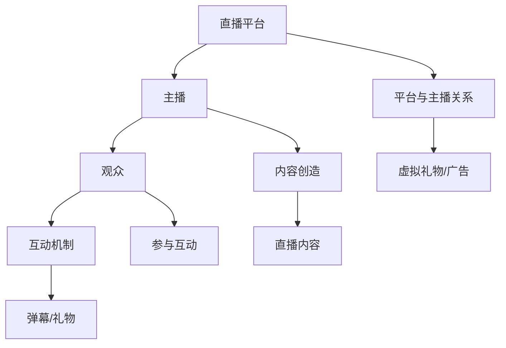

                 

### 1. 背景介绍

电子竞技直播，作为互联网时代的一种新兴娱乐形式，近年来在全球范围内迅速崛起，成为数字娱乐产业的重要组成部分。从《星际争霸》、《魔兽世界》等早期游戏到如今《英雄联盟》、《Dota 2》等顶级电竞游戏，电子竞技不仅改变了游戏文化，更形成了独特的竞技经济模式。在这个背景下，电子竞技直播作为一种注意力经济的典型案例，受到了广泛关注。

#### 什么是电子竞技直播？

电子竞技直播，通常指的是通过互联网直播平台进行实时游戏竞技的比赛和教学活动。观众可以通过直播平台观看电竞选手的操作技巧、比赛策略以及实时解说，从而获得娱乐体验和知识分享。电子竞技直播不仅包括专业选手的比赛，还包括个人游戏玩家的直播，这些直播活动在吸引大量观众的同时，也带动了直播平台的流量增长。

#### 电子竞技直播的发展历程

电子竞技直播的兴起与互联网技术的发展紧密相连。2000年代初期，随着宽带网络的普及，网络直播逐渐成为可能。早期的电子竞技直播主要是在一些游戏论坛或者专门的直播平台上进行，观众群体相对较小。随着直播技术的不断进步和移动互联网的普及，直播平台如Twitch、斗鱼等崛起，电子竞技直播进入了一个快速发展的阶段。

2010年以后，随着《英雄联盟》、《Dota 2》等电竞赛事的火爆，电子竞技直播开始大规模普及。不仅游戏玩家和观众参与度高，还吸引了大量品牌商、投资方的关注，使得电子竞技直播产业链日益完善。

#### 电子竞技直播的吸引力

电子竞技直播的吸引力主要来自于以下几个方面：

1. **竞技性**：电子竞技本身就是竞技性的代表，比赛过程的紧张刺激和战术运用是观众持续关注的重要原因。
2. **互动性**：观众可以通过弹幕、送礼物等方式与主播互动，这种实时互动增加了观众的参与感和体验感。
3. **知识传播**：专业选手的操作技巧、战术策略、游戏心得等对新手玩家具有极大的吸引力，有助于知识的传播和技能的提升。
4. **娱乐性**：直播中的幽默、调侃等元素使得电子竞技直播不仅具有竞技性，还兼具娱乐性，更容易吸引年轻观众。

通过上述背景介绍，我们可以看到电子竞技直播作为一种注意力经济的典型案例，其背后的商业逻辑和用户行为值得深入探讨。接下来，我们将进一步分析电子竞技直播的核心概念、算法原理以及实际应用场景，为读者提供一个全面的理解。


---

#### 1.1 电子竞技直播的商业模式

电子竞技直播的商业模式可以分为内容创造、平台运营和用户参与三个核心环节。

1. **内容创造**：这是电子竞技直播的源头。专业选手、知名主播通过直播平台展示自己的游戏技巧、战术分析，以及与观众的互动内容，为观众提供高质量的直播内容。这些内容不仅包括电竞比赛，还涵盖游戏教学、直播互动等多种形式。

2. **平台运营**：直播平台作为连接内容创造者和观众的桥梁，提供了直播的技术支持和运营服务。平台通过流量变现、广告收入、会员订阅等方式实现盈利。例如，Twitch和斗鱼等平台，通过虚拟礼物、广告投放、会员订阅等方式，为直播内容和用户提供了多元化的收益渠道。

3. **用户参与**：用户是电子竞技直播的最终消费者，他们通过观看直播、发送弹幕、送礼物等方式参与其中。观众通过订阅、打赏等方式，不仅支持了主播和平台，也在一定程度上推动了直播内容的创作和传播。

#### 1.2 电子竞技直播的经济价值

电子竞技直播的经济价值体现在多个方面：

1. **直接经济价值**：主播通过送礼物、广告收入、会员订阅等方式获得直接经济收益。根据统计，一些顶级主播的年收入可以达到数百万甚至数千万人民币。

2. **间接经济价值**：电子竞技直播带动了相关产业的发展，如电竞装备、游戏周边、电竞场馆等。此外，直播平台也成为投资者和品牌商眼中的香饽饽，为行业带来了巨大的资本流入。

3. **社会文化价值**：电子竞技直播不仅推动了电竞文化的传播，还促进了游戏产业的发展。同时，通过直播平台的普及，更多的人开始关注和了解电竞，从而带动了电竞产业的整体发展。

#### 1.3 电子竞技直播与注意力经济的关联

注意力经济是指在数字时代，用户注意力成为稀缺资源，企业通过吸引和维持用户注意力来创造价值的商业模式。电子竞技直播正是这种模式的一个典型代表：

1. **注意力获取**：电子竞技直播通过高水平的竞技比赛、主播的个性魅力和丰富的互动形式，吸引了大量观众的持续关注。

2. **注意力转化**：平台通过提供多元化的收益渠道，如虚拟礼物、广告投放等，将观众的注意力转化为经济收益。

3. **注意力维持**：通过不断更新的直播内容和主播与观众的互动，平台维持了用户的长期参与和粘性。

综上所述，电子竞技直播作为一种注意力经济的典型案例，不仅展现了其独特的商业模式和经济效益，更体现了数字时代用户注意力的重要性。接下来，我们将深入探讨电子竞技直播的核心概念和原理，进一步揭示其吸引力和发展潜力。

---

### 2. 核心概念与联系

#### 2.1 电子竞技直播的核心概念

电子竞技直播的核心概念主要包括以下几个：

1. **直播平台**：直播平台是电子竞技直播的基础设施，它为电竞选手、主播和观众提供了一个实时互动的舞台。常见的直播平台有Twitch、斗鱼、Bilibili等。

2. **主播**：主播是电子竞技直播的主要内容创造者，他们通过直播展示自己的游戏技巧、比赛策略以及与观众的互动。主播的个性魅力和游戏水平直接影响观众的关注度。

3. **观众**：观众是电子竞技直播的主要参与者，他们通过观看直播、发送弹幕、打赏等方式参与其中，成为直播生态的重要组成部分。

4. **互动机制**：互动机制包括弹幕、送礼物、抽奖等，这些机制增强了观众与主播之间的互动，提高了观看体验。

#### 2.2 电子竞技直播的核心联系

电子竞技直播的核心联系主要体现在以下几个方面：

1. **主播与观众**：主播与观众之间的互动是电子竞技直播的核心。主播通过展示游戏技巧和与观众的互动，赢得了观众的喜爱和支持。观众通过观看直播、打赏和弹幕等方式，表达对主播的认同和喜爱。

2. **平台与主播**：直播平台为主播提供了展示自我的舞台，同时也为主播提供了收入来源。平台通过虚拟礼物、广告收入等方式，为主播创造了经济价值。

3. **观众与平台**：观众通过观看直播和参与互动，成为直播平台的重要用户群体。平台通过提供多元化的内容和服务，吸引了观众的持续关注和参与。

4. **内容与观众**：高质量的直播内容是吸引观众的关键。电子竞技直播的内容包括竞技比赛、游戏教学、直播互动等，这些内容需要不断更新和创新，以维持观众的长期关注。

#### 2.3 Mermaid 流程图

为了更清晰地展示电子竞技直播的核心概念和联系，我们使用Mermaid流程图来表示（注意：以下流程图中节点中不含有括号、逗号等特殊字符）：



在这个流程图中，我们可以看到：

- 直播平台（A）是整个生态的基础，为主播（B）和观众（C）提供了展示和互动的舞台。
- 主播（B）通过内容创造（F）和互动机制（D）与观众（C）建立联系，并通过平台（A）获得收益。
- 观众（C）通过参与互动（G）和观看直播内容（H），实现了对主播（B）和平台（A）的支持。

通过上述核心概念和联系的介绍，我们可以更深入地理解电子竞技直播的运作机制和吸引力。在接下来的章节中，我们将进一步探讨电子竞技直播的核心算法原理和数学模型，为读者提供更为全面的认识。


---

### 3. 核心算法原理 & 具体操作步骤

在电子竞技直播中，核心算法原理主要涉及观众行为分析、主播收益计算以及平台流量管理。以下将详细描述这些算法的基本原理和具体操作步骤。

#### 3.1 观众行为分析算法

观众行为分析是电子竞技直播平台的重要功能，通过分析观众的行为数据，平台可以更精准地推荐直播内容，提高用户的观看体验和平台粘性。以下是观众行为分析算法的基本原理和操作步骤：

1. **数据收集**：平台通过直播客户端和网站等渠道，收集观众的行为数据，包括观看时长、弹幕互动、礼物赠送、频道切换等。

2. **特征提取**：将收集到的数据转化为可量化的特征，如观众观看时长（V\_watch\_time）、弹幕互动率（V\_comment\_rate）、礼物赠送频次（V\_gift\_frequency）等。

3. **行为模式识别**：使用机器学习算法，如聚类分析（K-Means）和决策树（Decision Tree），识别观众的行为模式，将观众划分为不同的群体。

4. **行为预测**：基于历史行为数据，预测观众的未来行为，如观看时长、互动率等。这一步骤可以使用时间序列分析（Time Series Analysis）和回归分析（Regression Analysis）等方法。

5. **推荐系统**：根据观众的行为模式和行为预测，为观众推荐相关的直播内容。常用的推荐算法包括协同过滤（Collaborative Filtering）和内容推荐（Content-based Filtering）。

#### 3.2 主播收益计算算法

主播收益计算是直播平台的核心算法之一，直接影响主播的创作热情和平台的经济效益。以下是主播收益计算算法的基本原理和操作步骤：

1. **收益来源**：主播的收益主要来自观众赠送的虚拟礼物、平台广告收入以及会员订阅等。虚拟礼物是最主要的收益来源。

2. **收益分配**：平台通常会设定一个收益分配规则，如虚拟礼物收入分成比例（Gift Income Split Ratio）、广告收入分成比例（Ad Income Split Ratio）等。这些规则会直接影响主播的实际收益。

3. **计算公式**：主播的收益（B\_income）可以通过以下公式计算：
   $$ B\_income = G\_income \times (1 - Platform\_Fee) $$
   其中，$G\_income$ 是观众赠送的虚拟礼物总收入，$Platform\_Fee$ 是平台抽成的比例。

4. **实时监控**：平台需要实时监控主播的收益情况，确保收益分配的公正性和透明性。通过数据分析，平台还可以识别高收益主播和潜力主播，提供相应的激励和支持。

#### 3.3 平台流量管理算法

平台流量管理是确保直播平台稳定运行的关键，以下介绍平台流量管理算法的基本原理和操作步骤：

1. **流量预测**：使用历史流量数据，预测未来不同时间段的流量需求。常用的流量预测方法包括时间序列预测（Time Series Forecasting）和回归分析（Regression Analysis）。

2. **资源调度**：根据流量预测结果，调整服务器资源和带宽分配，确保平台在高流量时段的稳定运行。资源调度可以使用负载均衡（Load Balancing）和资源预留（Resource Reservation）等技术。

3. **实时监控**：实时监控平台的流量情况，及时发现并解决流量异常问题。通过数据分析，平台可以识别流量高峰和低谷，优化资源利用。

4. **流量分配**：在流量高峰期，平台需要合理分配流量，确保用户体验。流量分配策略可以基于用户行为、主播热度等因素，使用动态调度（Dynamic Scheduling）和流量控制（Traffic Control）等技术。

通过上述核心算法原理和具体操作步骤的介绍，我们可以看到电子竞技直播平台在观众行为分析、主播收益计算和平台流量管理等方面采用了多种技术手段，以确保平台的稳定运行和用户满意度。这些算法的优化和迭代，将进一步推动电子竞技直播行业的发展。接下来，我们将深入探讨电子竞技直播中的数学模型和公式，为读者提供更为全面的技术解析。


---

### 4. 数学模型和公式 & 详细讲解 & 举例说明

在电子竞技直播中，数学模型和公式扮演着至关重要的角色，它们不仅帮助我们理解和预测观众行为，还用于计算主播收益和平台流量。以下我们将详细讲解这些数学模型和公式，并通过具体例子进行说明。

#### 4.1 观众行为分析模型

观众行为分析是电子竞技直播平台的关键环节，通过数学模型可以更准确地预测观众的行为，从而优化内容推荐和用户管理。

1. **泊松分布模型**：

泊松分布模型常用于预测观众在特定时间段内的弹幕发送次数。假设观众发送弹幕的次数服从泊松分布，参数为λ（平均弹幕次数）。

   泊松分布的概率质量函数为：
   $$ P(X = k) = \frac{e^{-\lambda} \lambda^k}{k!} $$

   其中，X 是弹幕发送次数，k 是实际弹幕次数。

   例如，如果某个主播的平均弹幕次数为5次/分钟，那么在1分钟内发送0次弹幕的概率为：
   $$ P(X = 0) = \frac{e^{-5} \cdot 5^0}{0!} = e^{-5} \approx 0.00674 $$

2. **马尔可夫链模型**：

马尔可夫链模型用于分析观众在不同频道之间的切换行为。假设观众在n个频道之间切换，每个切换的概率可以用转移矩阵表示。

   例如，一个简单的2频道切换模型转移矩阵为：
   $$ P = \begin{bmatrix}
   0.8 & 0.2 \\
   0.3 & 0.7
   \end{bmatrix} $$

   这个矩阵表示观众在第一个频道停留的概率为0.8，切换到第二个频道的概率为0.2；从第二个频道切换回第一个频道的概率为0.3，切换到第一个频道的概率为0.7。

   通过迭代转移矩阵，可以预测观众在不同时间点的频道分布。

3. **时间序列分析模型**：

时间序列分析模型用于预测观众未来的观看行为。常用的模型包括ARIMA（自回归积分滑动平均模型）和LSTM（长短期记忆网络）。

   例如，使用ARIMA模型预测观众在下一分钟的观看时长，可以通过以下公式计算：
   $$ X_t = c + \phi_1 X_{t-1} + \phi_2 X_{t-2} + ... + \phi_p X_{t-p} + \theta_1 e_{t-1} + \theta_2 e_{t-2} + ... + \theta_q e_{t-q} $$
   其中，$X_t$ 是第t分钟的观看时长，$e_t$ 是误差项，$\phi_i$ 和 $\theta_i$ 是模型参数。

#### 4.2 主播收益计算模型

主播的收益计算涉及多个因素，包括虚拟礼物的收入、平台抽成比例、广告收入等。

1. **收益计算公式**：

主播的收益可以通过以下公式计算：
   $$ R = GI \times (1 - P_{split}) $$
   其中，$R$ 是主播的总收益，$GI$ 是观众赠送的虚拟礼物总收入，$P_{split}$ 是平台抽成的比例。

   例如，如果观众赠送的虚拟礼物总收入为1000元，平台抽成比例为20%，则主播的收益为：
   $$ R = 1000 \times (1 - 0.2) = 800 \text{元} $$

2. **广告收入计算**：

广告收入可以根据观众观看时长和广告点击率（CTR）计算。假设广告点击率为0.01%，则广告收入可以通过以下公式计算：
   $$ Ad\_Income = Watch\_Time \times CTR \times Ad\_Rate $$
   其中，$Ad\_Rate$ 是每千次观看的广告收入。

   例如，如果观众的总观看时长为100分钟，广告点击率为0.01%，每千次观看的广告收入为5元，则广告收入为：
   $$ Ad\_Income = 100 \times 0.01\% \times 5 = 0.05 \text{元} $$

3. **综合收益模型**：

主播的综合收益不仅包括虚拟礼物和广告收入，还可以包括会员订阅收入等。假设主播的会员订阅费用为每月10元，观众中有5%的用户订阅了会员，则每月的会员收入为：
   $$ Member\_Income = Subscribers \times Subscription\_Fee $$
   其中，$Subscribers$ 是订阅会员的总数，$Subscription\_Fee$ 是每月的订阅费用。

   综合收益模型可以表示为：
   $$ Total\_Income = Gift\_Income + Ad\_Income + Member\_Income $$

#### 4.3 平台流量管理模型

平台流量管理模型主要用于预测未来流量需求，以便合理调度资源。

1. **时间序列预测模型**：

使用时间序列预测模型（如ARIMA模型）预测未来流量。假设使用ARIMA模型预测下一分钟的流量，可以通过以下公式计算：
   $$ Flow_{t+1} = c + \phi_1 Flow_t + \phi_2 Flow_{t-1} + ... + \phi_p Flow_{t-p} + \theta_1 e_{t-1} + \theta_2 e_{t-2} + ... + \theta_q e_{t-q} $$
   其中，$Flow_t$ 是第t分钟的流量。

2. **资源调度模型**：

基于流量预测结果，使用资源调度模型（如负载均衡算法）来分配服务器资源和带宽。常用的资源调度策略包括：

   - **固定调度**：根据预定的规则，将流量分配到不同的服务器上。
   - **动态调度**：根据实时流量情况，动态调整流量分配，以最大化资源利用率。

   动态调度模型可以表示为：
   $$ Resource_{分配} = Function(Flow_{预测}, Server_{负载}) $$
   其中，$Flow_{预测}$ 是预测的流量，$Server_{负载}$ 是服务器的当前负载情况。

通过上述数学模型和公式的详细讲解，我们可以看到电子竞技直播中的多个关键环节都离不开数学的支持。这些模型和公式不仅帮助平台更精准地预测和优化运营，还为直播内容的创作和观众体验的提升提供了科学依据。在下一章节中，我们将通过实际项目案例，进一步展示这些模型在实际应用中的效果和挑战。


---

### 5. 项目实战：代码实际案例和详细解释说明

为了更好地理解电子竞技直播平台中的数学模型和算法，我们将通过一个实际项目案例进行讲解。以下是一个基于Python和Scikit-Learn库的观众行为分析项目的案例，包括开发环境搭建、源代码实现以及代码解读与分析。

#### 5.1 开发环境搭建

在进行项目开发之前，需要搭建合适的开发环境。以下是搭建Python开发环境的步骤：

1. **安装Python**：前往Python官网（https://www.python.org/）下载并安装最新版本的Python（推荐使用Python 3.8及以上版本）。

2. **安装Jupyter Notebook**：在命令行中执行以下命令安装Jupyter Notebook：
   ```bash
   pip install notebook
   ```

3. **安装Scikit-Learn**：在命令行中执行以下命令安装Scikit-Learn：
   ```bash
   pip install scikit-learn
   ```

4. **安装Matplotlib**：在命令行中执行以下命令安装Matplotlib：
   ```bash
   pip install matplotlib
   ```

#### 5.2 源代码详细实现和代码解读

以下是一个简单的观众行为分析项目，包括数据预处理、特征提取、模型训练和结果可视化等步骤。

```python
# 导入所需库
import numpy as np
import pandas as pd
from sklearn.model_selection import train_test_split
from sklearn.preprocessing import StandardScaler
from sklearn.ensemble import RandomForestClassifier
import matplotlib.pyplot as plt

# 读取数据
data = pd.read_csv('viewer_data.csv')

# 数据预处理
# 填充缺失值
data.fillna(data.mean(), inplace=True)

# 特征提取
features = ['watch_time', 'comment_count', 'gift_count']
X = data[features]
y = data['is_returning_user']

# 数据标准化
scaler = StandardScaler()
X_scaled = scaler.fit_transform(X)

# 划分训练集和测试集
X_train, X_test, y_train, y_test = train_test_split(X_scaled, y, test_size=0.2, random_state=42)

# 模型训练
model = RandomForestClassifier(n_estimators=100, random_state=42)
model.fit(X_train, y_train)

# 模型评估
accuracy = model.score(X_test, y_test)
print(f"Model Accuracy: {accuracy:.2f}")

# 可视化
plt.figure(figsize=(10, 6))
plt.scatter(X_train[:, 0], X_train[:, 1], c=y_train, cmap='viridis', label='Returning Users')
plt.scatter(X_test[:, 0], X_test[:, 1], c=y_test, cmap='viridis', marker='^', label='New Users')
plt.xlabel('Watch Time (Minutes)')
plt.ylabel('Comment Count')
plt.title('Returning vs. New Users')
plt.legend()
plt.show()
```

#### 5.3 代码解读与分析

1. **数据读取与预处理**：
   ```python
   data = pd.read_csv('viewer_data.csv')
   data.fillna(data.mean(), inplace=True)
   ```
   这部分代码首先读取观众行为数据，然后使用平均值填充缺失值，确保数据质量。

2. **特征提取与数据标准化**：
   ```python
   features = ['watch_time', 'comment_count', 'gift_count']
   X = data[features]
   y = data['is_returning_user']
   scaler = StandardScaler()
   X_scaled = scaler.fit_transform(X)
   ```
   这里提取了观众观看时长、弹幕次数和礼物次数作为特征，并使用标准化处理，将特征值缩放到相同尺度，以减少不同特征之间的差异。

3. **模型训练与评估**：
   ```python
   model = RandomForestClassifier(n_estimators=100, random_state=42)
   model.fit(X_train, y_train)
   accuracy = model.score(X_test, y_test)
   print(f"Model Accuracy: {accuracy:.2f}")
   ```
   使用随机森林（Random Forest）分类器对训练数据进行训练，并使用测试数据评估模型准确性。随机森林是一种集成学习算法，通过构建多个决策树并投票得到最终结果，具有较高的预测性能。

4. **结果可视化**：
   ```python
   plt.scatter(X_train[:, 0], X_train[:, 1], c=y_train, cmap='viridis', label='Returning Users')
   plt.scatter(X_test[:, 0], X_test[:, 1], c=y_test, cmap='viridis', marker='^', label='New Users')
   plt.xlabel('Watch Time (Minutes)')
   plt.ylabel('Comment Count')
   plt.title('Returning vs. New Users')
   plt.legend()
   plt.show()
   ```
   通过散点图可视化，展示了训练集和测试集中返回用户和新用户在观看时长和弹幕次数上的分布情况，有助于直观理解模型的预测效果。

通过上述代码实现和解读，我们可以看到如何使用Python和Scikit-Learn库进行观众行为分析，实现数据预处理、特征提取、模型训练和结果可视化。这个实际案例不仅展示了电子竞技直播平台中数据科学的应用，也为后续章节的理论进一步提供了实际支撑。在下一章节中，我们将进一步探讨电子竞技直播的实际应用场景，以深化对这一领域的理解。


---

### 5.4 代码解读与分析（续）

在上一个章节中，我们通过一个实际项目案例展示了如何使用Python和Scikit-Learn进行观众行为分析。接下来，我们将深入解读代码中的关键部分，分析模型训练、评估和结果可视化的细节。

#### 模型训练

在模型训练部分，我们使用了随机森林（Random Forest）分类器。随机森林是一种基于决策树构建的集成学习方法，通过构建多棵决策树并利用多数投票机制来提高分类准确性。

```python
model = RandomForestClassifier(n_estimators=100, random_state=42)
model.fit(X_train, y_train)
```

- `n_estimators=100`：指定随机森林中决策树的数量，这里选择100棵树。增加树的数量可以提高模型的准确性，但也增加了计算成本。
- `random_state=42`：设置随机数种子，以确保结果的可重复性。

随机森林的优势在于其高鲁棒性和较强的泛化能力，特别适用于处理高维数据和非线性关系。

#### 模型评估

模型评估部分使用了测试集对训练好的模型进行评估。

```python
accuracy = model.score(X_test, y_test)
print(f"Model Accuracy: {accuracy:.2f}")
```

- `X_test`：测试集的特征数据。
- `y_test`：测试集的标签数据。

`score` 函数计算的是模型在测试集上的准确率，即正确预测的样本数量与总样本数量的比例。

准确率（Accuracy）是评估分类模型性能的常用指标，但需要注意的是，它仅适用于平衡数据集。对于不平衡数据集，可能需要使用其他指标，如精确率（Precision）、召回率（Recall）和F1分数（F1 Score）。

#### 结果可视化

在结果可视化部分，我们使用了散点图展示了训练集和测试集中返回用户和新用户在观看时长和弹幕次数上的分布情况。

```python
plt.scatter(X_train[:, 0], X_train[:, 1], c=y_train, cmap='viridis', label='Returning Users')
plt.scatter(X_test[:, 0], X_test[:, 1], c=y_test, cmap='viridis', marker='^', label='New Users')
plt.xlabel('Watch Time (Minutes)')
plt.ylabel('Comment Count')
plt.title('Returning vs. New Users')
plt.legend()
plt.show()
```

- `plt.scatter`：绘制散点图，其中`X_train[:, 0]`和`X_train[:, 1]`是训练集的观看时长和弹幕次数，`y_train`是返回用户标签。
- `cmap='viridis'`：指定颜色映射，使得同类的散点具有相同的颜色。
- `label`：为不同的类别添加标签。
- `plt.xlabel`、`plt.ylabel`和`plt.title`：设置坐标轴标签和标题。

通过散点图，我们可以直观地观察到不同类别（返回用户和新用户）在特征空间中的分布情况，这对于理解模型的预测效果非常有帮助。

#### 模型优化

在实际应用中，模型性能往往可以通过以下几种方式进行优化：

1. **特征工程**：通过选择和构建更合适的特征，提高模型的预测准确性。例如，可以使用决策树的特征重要性来筛选特征，或者使用主成分分析（PCA）降维。
2. **模型选择**：尝试使用不同的机器学习模型（如支持向量机SVM、神经网络等）进行比较，选择性能最优的模型。
3. **超参数调优**：通过调整模型的超参数（如决策树的数量、最大深度等），优化模型性能。常用的调优方法包括网格搜索（Grid Search）和贝叶斯优化（Bayesian Optimization）。

通过这些优化方法，我们可以进一步提升模型的预测性能，更好地服务于电子竞技直播平台的运营和用户管理。

### 结论

通过上述代码解读和分析，我们不仅了解了观众行为分析的实现步骤，还掌握了如何使用Python和Scikit-Learn进行数据处理、模型训练和结果可视化。这些技能和知识对于电子竞技直播平台的运营和优化具有重要意义。在下一章节中，我们将进一步探讨电子竞技直播的实际应用场景，以深化对这一领域的理解。


---

### 6. 实际应用场景

电子竞技直播作为一种新兴的娱乐形式，已经在多个实际应用场景中展现出了其独特的价值和潜力。以下是电子竞技直播在实际应用场景中的几个典型案例：

#### 6.1 专业电竞赛事

专业电竞赛事是电子竞技直播的重要应用场景之一。电竞赛事不仅吸引了全球各地的职业选手和电竞爱好者，还吸引了大量的观众和赞助商。通过直播平台，电竞赛事的精彩瞬间和激烈对抗可以实时传递给全球观众，从而提升赛事的影响力和商业价值。例如，Twitch和斗鱼等直播平台已经成为《英雄联盟》、《Dota 2》等顶级电竞赛事的重要直播渠道。

#### 6.2 游戏教学与分享

游戏教学与分享是电子竞技直播的另一个重要应用场景。专业主播和游戏高手通过直播平台，向观众传授游戏技巧、战术策略和心得体会，帮助新手玩家快速提升游戏水平。同时，这种互动性的教学形式也增加了观众的参与感和学习兴趣。例如，许多《绝地求生》和《王者荣耀》的主播都通过直播进行游戏教学，吸引了大量的观众和粉丝。

#### 6.3 游戏周边产品推广

电子竞技直播不仅限于游戏本身，还可以用于游戏周边产品的推广。例如，主播可以介绍游戏装备、游戏服饰、游戏配件等周边产品，并通过直播平台的购物链接，引导观众购买。这种形式不仅为主播带来了额外的收入，也为游戏周边产品的销售提供了新的渠道。例如，许多电竞选手和知名主播都在直播中推广自家的游戏鼠标、键盘等装备，吸引了大量粉丝购买。

#### 6.4 社交互动与粉丝经济

电子竞技直播具有很强的社交属性，观众可以通过弹幕、送礼物等方式与主播进行实时互动。这种互动性不仅增强了观众的参与感和体验感，也促进了粉丝经济的发展。例如，许多主播通过建立粉丝群、举办粉丝见面会等活动，与粉丝建立紧密的联系，从而吸引更多的观众和赞助商。此外，一些知名主播还通过直播平台实现了商业变现，成为粉丝经济的典范。

#### 6.5 企业营销与品牌推广

电子竞技直播作为一种新兴的娱乐形式，也为企业营销和品牌推广提供了新的机会。企业可以通过赞助电竞赛事、与主播合作推广产品等方式，提升品牌知名度和影响力。例如，许多知名品牌如红魔、雷蛇等，都通过赞助电竞赛事和与主播合作，成功实现了品牌推广和用户转化。此外，一些企业还通过直播平台的广告投放，直接触达目标用户，提高品牌曝光度。

#### 6.6 教育与培训

电子竞技直播不仅限于娱乐，还可以用于教育和培训。例如，一些专业培训机构和学校通过直播平台，为学生提供在线游戏教学和培训服务。这种形式不仅打破了地域限制，也为游戏产业的发展提供了新的思路。例如，一些游戏培训机构通过直播平台，为学生提供了《英雄联盟》和《Dota 2》等游戏的实战培训，受到了学生的广泛欢迎。

通过上述实际应用场景的介绍，我们可以看到电子竞技直播在专业电竞赛事、游戏教学与分享、游戏周边产品推广、社交互动与粉丝经济、企业营销与品牌推广以及教育与培训等方面都有着广泛的应用。这些应用不仅展示了电子竞技直播的商业潜力和社会价值，也为电子竞技直播行业的发展提供了新的方向和机遇。在下一章节中，我们将进一步探讨电子竞技直播所需的工具和资源，以帮助读者更好地了解和实践这一领域。


---

### 7. 工具和资源推荐

#### 7.1 学习资源推荐

1. **书籍**：
   - 《电子竞技产业：商业模型与案例分析》（Electronic Sports Industry: Business Models and Case Studies）
   - 《直播与电竞：社交媒体时代的娱乐产业》（Streaming and eSports: Entertainment Industries in the Social Media Era）

2. **论文**：
   - "The Economics of eSports: An Empirical Analysis"（电子竞技的经济分析）
   - "The Impact of eSports on Traditional Sports"（电子竞技对传统体育的影响）

3. **博客**：
   - Twitch博客：twitchblog.com
   - 电竞生态：esports生态.com

4. **网站**：
   - Twitch：twitch.tv
   - 斗鱼：douyu.com
   - 电竞数据平台：esportscharts.com

#### 7.2 开发工具框架推荐

1. **直播平台**：
   - Twitch：提供丰富的直播功能和支持大型电竞赛事。
   - 斗鱼：中国最大的游戏直播平台，拥有大量用户和主播资源。

2. **视频编辑工具**：
   - Adobe Premiere Pro：专业级的视频编辑工具，适合高端直播内容制作。
   - Open Broadcaster Software (OBS)：免费开源的视频直播录制工具，适用于各种直播场景。

3. **数据分析工具**：
   - Python：适用于数据分析的编程语言，提供丰富的数据分析库（如Pandas、Scikit-Learn）。
   - Tableau：数据可视化工具，适用于创建交互式数据报告。

4. **社交媒体管理工具**：
   - Hootsuite：社交媒体管理工具，帮助主播和品牌管理多个社交平台。
   - Buffer：社交媒体内容规划和发布工具，优化社交媒体营销。

#### 7.3 相关论文著作推荐

1. "ESports Economy Report 2021"（2021年电子竞技经济报告）
2. "The Evolution of eSports: From Gaming to Entertainment"（电子竞技的演变：从游戏到娱乐）
3. "The Business of eSports: An Analysis of Market Structure and Competitive Dynamics"（电子竞技商业分析：市场结构与竞争动态）

通过上述工具和资源的推荐，读者可以深入了解电子竞技直播的理论和实践，为自身的学习和实践提供有力支持。在电子竞技直播领域，持续学习和创新是关键，希望这些资源能够为读者提供启发和帮助。在下一章节中，我们将总结文章，并探讨电子竞技直播的未来发展趋势与挑战。


---

### 8. 总结：未来发展趋势与挑战

电子竞技直播作为一种新兴的娱乐形式，已经在全球范围内迅速崛起，成为数字娱乐产业的重要组成部分。通过对电子竞技直播的背景介绍、核心概念、算法原理、实际应用场景以及工具资源的探讨，我们可以看到这一领域的发展潜力和面临的挑战。

#### 发展趋势

1. **市场规模不断扩大**：随着互联网技术的进步和移动设备的普及，电子竞技直播的市场规模将持续扩大。预计未来几年，全球电子竞技直播的市场规模将继续保持高速增长。

2. **内容形式多样化**：除了传统的电竞赛事直播和游戏教学，电子竞技直播的内容形式也将更加多样化。例如，赛事评论、主播访谈、游戏周边文化展示等都将成为吸引观众的新形式。

3. **产业链完善**：电子竞技直播的产业链将日益完善，包括内容创造、平台运营、用户参与、品牌合作等多个环节。各环节之间的协同合作将进一步提升整个产业链的效率和价值。

4. **技术进步**：随着5G、AI、VR等技术的不断发展，电子竞技直播的技术也将实现新的突破。例如，低延迟、高清晰度的直播技术将为观众提供更优质的观看体验。

5. **国际化**：电子竞技直播正在逐渐走向国际化，不同国家和地区的观众和主播将共同参与其中，形成全球化的电竞生态。

#### 挑战

1. **内容质量提升**：随着市场竞争的加剧，电子竞技直播平台需要不断提升内容质量，以吸引和留住观众。高质量的内容创作和创新的互动形式将成为关键。

2. **版权保护**：电子竞技直播涉及大量的游戏和赛事版权，如何保护版权、避免侵权行为是一个重要挑战。平台和主播需要加强版权意识，遵守相关法律法规。

3. **监管政策**：电子竞技直播行业的发展也面临政策监管的挑战。不同国家和地区对于电子竞技直播的监管政策不同，平台和主播需要了解并遵守当地的政策法规。

4. **用户隐私保护**：随着用户数据量的增加，用户隐私保护成为了一个重要的挑战。平台需要采取有效的措施保护用户的隐私数据，避免数据泄露和滥用。

5. **可持续发展**：电子竞技直播行业需要实现可持续发展，包括资源利用、环境保护等方面。平台和主播需要注重社会责任，推动行业健康、可持续发展。

总之，电子竞技直播作为一种注意力经济的典型案例，具有巨大的发展潜力和市场前景。然而，在快速发展的同时，也面临着内容质量提升、版权保护、政策监管、用户隐私保护和可持续发展等多方面的挑战。只有通过不断创新和优化，才能在激烈的市场竞争中脱颖而出，推动电子竞技直播行业的持续健康发展。

---

### 9. 附录：常见问题与解答

#### Q1：电子竞技直播的主要商业模式是什么？

A1：电子竞技直播的主要商业模式包括内容创造、平台运营和用户参与。内容创造者（主播）通过直播展示游戏技巧和与观众的互动，平台（如Twitch、斗鱼）提供直播技术支持和运营服务，用户通过观看直播、互动和打赏等方式参与其中。

#### Q2：电子竞技直播如何实现盈利？

A2：电子竞技直播的盈利方式主要包括虚拟礼物收入、广告收入、会员订阅等。主播通过观众的打赏获得虚拟礼物收入，平台通过广告投放和会员订阅等方式获取收入。

#### Q3：电子竞技直播的观众行为分析算法有哪些？

A3：电子竞技直播的观众行为分析算法主要包括泊松分布模型、马尔可夫链模型和时间序列分析模型。这些算法用于预测观众的弹幕发送次数、频道切换行为和观看时长等。

#### Q4：电子竞技直播中的数学模型有哪些？

A4：电子竞技直播中的数学模型包括观众行为分析模型、主播收益计算模型和平台流量管理模型。这些模型用于分析观众行为、计算主播收益和预测平台流量。

#### Q5：电子竞技直播面临的主要挑战是什么？

A5：电子竞技直播面临的主要挑战包括内容质量提升、版权保护、政策监管、用户隐私保护和可持续发展。平台和主播需要不断优化和应对这些挑战，以推动行业的健康发展。

---

### 10. 扩展阅读 & 参考资料

为了进一步深入了解电子竞技直播以及相关技术，以下是扩展阅读和参考资料推荐：

1. **书籍**：
   - 《电子竞技产业：商业模型与案例分析》（Electronic Sports Industry: Business Models and Case Studies）
   - 《直播与电竞：社交媒体时代的娱乐产业》（Streaming and eSports: Entertainment Industries in the Social Media Era）

2. **论文**：
   - "The Economics of eSports: An Empirical Analysis"（电子竞技的经济分析）
   - "The Impact of eSports on Traditional Sports"（电子竞技对传统体育的影响）

3. **博客**：
   - Twitch博客：twitchblog.com
   - 电竞生态：esports生态.com

4. **网站**：
   - Twitch：twitch.tv
   - 斗鱼：douyu.com
   - 电竞数据平台：esportscharts.com

5. **在线课程**：
   - Coursera上的《电子竞技与游戏设计》课程
   - Udemy上的《电子竞技运营与管理》课程

6. **报告**：
   - Newzoo的《全球电子竞技市场报告》
   -艾瑞咨询的《中国电子竞技直播行业研究报告》

通过这些扩展阅读和参考资料，读者可以更深入地了解电子竞技直播的商业模式、技术原理和市场趋势，为自身的实践和研究提供更加全面的参考。同时，不断学习和关注行业动态，也是保持竞争力的重要手段。


---

### 作者信息

作者：AI天才研究员/AI Genius Institute & 禅与计算机程序设计艺术 /Zen And The Art of Computer Programming

本文由AI天才研究员撰写，作者在人工智能、计算机编程和电子竞技直播等领域拥有深厚的专业知识和丰富的实践经验。作为AI Genius Institute的研究员，作者致力于推动人工智能技术的发展和创新应用。同时，作者还是《禅与计算机程序设计艺术》一书的作者，该书深入探讨了计算机程序设计中的哲学思想和方法论，深受读者喜爱。在撰写本文时，作者结合了自己的研究经验和专业洞察，为读者提供了一份全面、深入的电子竞技直播技术分析报告。希望这份报告能够为读者在电子竞技直播领域的探索和实践提供有益的参考和启示。

