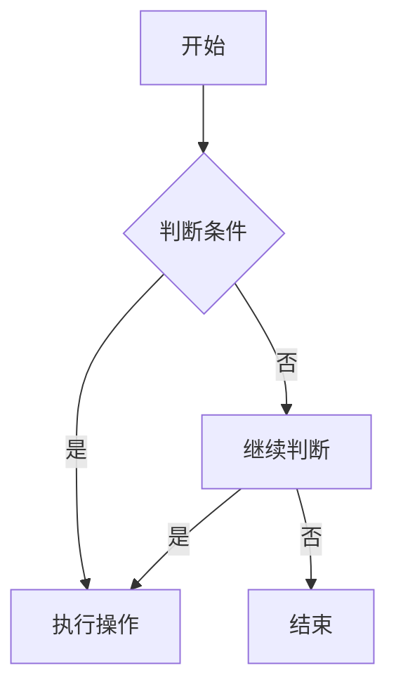

                 

# 百度2024校招面试真题与算法题解

> **关键词**：百度，校招，面试真题，算法题解，编程，数据结构，人工智能

> **摘要**：本文将深入剖析百度2024校招面试中的经典真题，通过详细的分析和算法题解，帮助准备面试的读者更好地应对技术面试。文章涵盖了数据结构与算法的基础知识，以及如何将这些知识应用到面试题目中。同时，本文也将探讨面试过程中的思维技巧和注意事项，为读者提供全面的面试指导。

## 1. 背景介绍

百度作为中国领先的搜索引擎公司，其校招面试在技术圈享有盛誉。每年的面试题目既考验应聘者的编程技能，又考察其逻辑思维和问题解决能力。随着人工智能技术的发展，算法题目的难度和广度也在不断提升。本文将围绕百度2024校招面试中的经典题目，通过详细的解析和题解，帮助读者深入理解面试题目的本质，提升面试应对能力。

## 2. 核心概念与联系

在解答百度校招面试中的算法题目之前，我们需要先了解几个核心概念，包括数据结构、算法原理和流程图。

### 2.1 数据结构

数据结构是计算机存储、组织数据的方式。常见的线性数据结构有数组、链表、栈和队列；非线性数据结构有树、图等。每种数据结构都有其特定的操作和特点。

### 2.2 算法原理

算法是解决问题的一系列步骤。常见的算法有排序算法、查找算法、动态规划等。算法的复杂度通常用时间复杂度和空间复杂度来衡量。

### 2.3 流程图

流程图是表示算法步骤的一种图形化工具。它可以帮助我们更直观地理解算法的实现过程。

下面是一个用Mermaid绘制的流程图示例：



### 2.4 核心概念联系

数据结构是算法实现的基础，算法原理决定了数据结构的操作方式。流程图则将数据结构和算法步骤串联起来，形成完整的解决方案。

## 3. 核心算法原理 & 具体操作步骤

### 3.1 排序算法

排序算法是面试中经常出现的题目。常见的排序算法有冒泡排序、选择排序、插入排序、快速排序等。以下是冒泡排序的算法原理和具体操作步骤：

#### 算法原理

冒泡排序通过反复交换相邻的未排序元素，使每一轮都能将最大的元素“冒泡”到序列的末尾。经过若干轮排序后，整个序列变得有序。

#### 操作步骤

1. 遍历序列中的每个元素，与其相邻的元素比较大小。
2. 如果当前元素比相邻的元素大，交换它们的位置。
3. 遍历结束后，最大的元素被“冒泡”到了序列的末尾。
4. 重复上述步骤，直到整个序列有序。

### 3.2 查找算法

查找算法用于在数据结构中查找特定元素。常见的查找算法有二分查找、顺序查找等。以下是二分查找的算法原理和具体操作步骤：

#### 算法原理

二分查找利用有序序列的特点，通过不断缩小查找范围，逐步逼近目标元素。每次查找都将当前范围分为一半，比较中间元素与目标元素的大小关系，从而决定下一步的查找方向。

#### 操作步骤

1. 确定查找范围（初始范围是整个序列）。
2. 计算中间位置（low + high）/ 2）。
3. 比较中间元素与目标元素的大小。
4. 如果相等，查找成功；如果不等，更新查找范围。
5. 重复步骤2-4，直到找到目标元素或查找范围缩小为0。

### 3.3 动态规划

动态规划是一种解决最优化问题的算法。它将问题分解为多个子问题，通过求解子问题的最优解，最终得到原问题的最优解。以下是动态规划的基本原理和具体操作步骤：

#### 算法原理

动态规划利用子问题的最优解来构建原问题的最优解。它通常使用一个二维数组或一维数组来存储子问题的解，避免重复计算。

#### 操作步骤

1. 确定状态和状态转移方程。
2. 初始化数组或表。
3. 按照状态转移方程依次求解子问题的最优解。
4. 根据子问题的最优解构建原问题的最优解。

## 4. 数学模型和公式 & 详细讲解 & 举例说明

### 4.1 排序算法的复杂度

排序算法的时间复杂度通常用O(nlogn)或O(n^2)表示。以下是冒泡排序和快速排序的时间复杂度分析：

#### 冒泡排序

- 最好情况：O(n)
- 平均情况：O(n^2)
- 最坏情况：O(n^2)

#### 快速排序

- 最好情况：O(nlogn)
- 平均情况：O(nlogn)
- 最坏情况：O(n^2)

### 4.2 查找算法的复杂度

查找算法的时间复杂度通常用O(n)或O(logn)表示。以下是二分查找的时间复杂度分析：

- 最好情况：O(1)
- 平均情况：O(logn)
- 最坏情况：O(logn)

### 4.3 动态规划的公式

动态规划的状态转移方程通常用以下形式表示：

```
dp[i] = min(dp[j] + c)
```

其中，dp[i]表示第i个子问题的最优解，c表示从第j个子问题转移到第i个子问题的代价。

### 4.4 举例说明

#### 冒泡排序

假设有一个序列[5, 2, 8, 3, 1]，按照冒泡排序的步骤进行排序。

- 第一轮排序：[2, 5, 3, 1, 8] -> [2, 3, 1, 5, 8]
- 第二轮排序：[2, 3, 1, 5, 8] -> [2, 1, 3, 5, 8]
- 第三轮排序：[2, 1, 3, 5, 8] -> [1, 2, 3, 5, 8]
- 第四轮排序：[1, 2, 3, 5, 8] -> [1, 2, 3, 5, 8]

排序后，序列变为有序。

#### 二分查找

假设有一个有序序列[1, 3, 5, 7, 9, 11]，查找元素6。

- 第一次查找：中间元素为7，6小于7，查找范围更新为[1, 3, 5]。
- 第二次查找：中间元素为3，6大于3，查找范围更新为[5, 7]。
- 第三次查找：中间元素为6，查找成功。

#### 动态规划

假设有一个背包问题，物品重量为[1, 2, 3]，物品价值为[3, 4, 5]，背包容量为4。

- 初始化dp数组：dp[i][j] = 0，其中i表示物品编号，j表示背包容量。
- 按照状态转移方程求解：dp[i][j] = max(dp[i-1][j], dp[i-1][j-weight[i]] + value[i])。

最终得到最优解：选择物品2和物品3，总价值为9。

## 5. 项目实战：代码实际案例和详细解释说明

### 5.1 开发环境搭建

为了更好地展示算法的实现，我们使用Python作为编程语言。首先，确保已经安装了Python和相应的编译器。接下来，创建一个名为`algorithm`的文件夹，并在其中创建一个名为`main.py`的Python文件。

### 5.2 源代码详细实现和代码解读

#### 5.2.1 冒泡排序

```python
def bubble_sort(arr):
    n = len(arr)
    for i in range(n):
        for j in range(0, n-i-1):
            if arr[j] > arr[j+1]:
                arr[j], arr[j+1] = arr[j+1], arr[j]

# 示例
arr = [5, 2, 8, 3, 1]
bubble_sort(arr)
print("排序后：", arr)
```

该代码实现了冒泡排序算法。首先，定义一个名为`bubble_sort`的函数，接受一个数组`arr`作为参数。函数中，使用两个嵌套的for循环遍历数组元素，比较相邻元素的大小，并根据大小关系交换它们的位置。最终，数组被排序。

#### 5.2.2 二分查找

```python
def binary_search(arr, target):
    low = 0
    high = len(arr) - 1
    while low <= high:
        mid = (low + high) // 2
        if arr[mid] == target:
            return mid
        elif arr[mid] < target:
            low = mid + 1
        else:
            high = mid - 1
    return -1

# 示例
arr = [1, 3, 5, 7, 9, 11]
target = 6
result = binary_search(arr, target)
if result != -1:
    print("元素6在索引{}处"。format(result))
else:
    print("元素6未找到")
```

该代码实现了二分查找算法。首先，定义一个名为`binary_search`的函数，接受一个有序数组`arr`和一个目标值`target`作为参数。函数中，使用while循环不断更新查找范围，直到找到目标元素或查找范围缩小为0。如果找到目标元素，返回其索引；否则，返回-1。

#### 5.2.3 动态规划

```python
def knapsack(weights, values, capacity):
    n = len(weights)
    dp = [[0] * (capacity + 1) for _ in range(n + 1)]
    for i in range(1, n + 1):
        for j in range(1, capacity + 1):
            if weights[i-1] <= j:
                dp[i][j] = max(dp[i-1][j], dp[i-1][j-weights[i-1]] + values[i-1])
            else:
                dp[i][j] = dp[i-1][j]
    return dp[n][capacity]

# 示例
weights = [1, 2, 3]
values = [3, 4, 5]
capacity = 4
result = knapsack(weights, values, capacity)
print("最优解：", result)
```

该代码实现了01背包问题。首先，定义一个名为`knapsack`的函数，接受一个物品重量列表`weights`、一个物品价值列表`values`和一个背包容量`capacity`作为参数。函数中，使用二维数组`dp`存储子问题的最优解。然后，按照状态转移方程依次求解子问题的最优解。最终，返回原问题的最优解。

### 5.3 代码解读与分析

#### 5.3.1 冒泡排序

冒泡排序的核心在于两个嵌套的for循环。外层循环控制排序的轮数，内层循环控制每一轮中相邻元素的比较和交换。每次内层循环结束后，最大的元素都被“冒泡”到了序列的末尾。经过若干轮排序后，整个序列变得有序。

#### 5.3.2 二分查找

二分查找的关键在于不断缩小查找范围。每次循环都将当前范围分为一半，并比较中间元素与目标元素的大小关系。如果中间元素小于目标元素，更新查找范围的下限；如果中间元素大于目标元素，更新查找范围的上限。通过不断缩小查找范围，二分查找能够快速找到目标元素。

#### 5.3.3 动态规划

动态规划的核心在于状态转移方程。在本例中，状态转移方程为`dp[i][j] = max(dp[i-1][j], dp[i-1][j-weights[i-1]] + values[i-1])`。该方程表示，在考虑第i个物品和当前背包容量为j的情况下，最优解是选择第i个物品或不选择第i个物品中价值更大的那个。

## 6. 实际应用场景

百度校招面试中的算法题目在实际项目中有着广泛的应用。以下是几个典型的应用场景：

### 6.1 数据处理

在数据处理领域，排序算法和查找算法用于对大量数据进行排序和查找。例如，搜索引擎需要对网页内容进行排序，以提供更准确的搜索结果。二分查找算法可以提高搜索效率，使搜索引擎更快地找到用户所需的网页。

### 6.2 货物分配

在货物分配问题中，动态规划算法用于优化货物分配方案。例如，物流公司需要将货物分配到不同的运输车上，以最大化运输效率。动态规划可以帮助公司找到最优的分配方案，降低运输成本。

### 6.3 搜索引擎优化

搜索引擎优化（SEO）是提高网站在搜索引擎结果页面（SERP）排名的重要手段。排序算法和查找算法在SEO中用于优化网站内容和关键词。通过合理地排序和查找关键词，可以提高网站的曝光率，吸引更多用户访问。

## 7. 工具和资源推荐

### 7.1 学习资源推荐

- **书籍**：《算法导论》、《大话数据结构》
- **论文**：《动态规划：一种解题策略》、《二分查找：一个快速查找算法》
- **博客**：CSDN、博客园、知乎
- **网站**：LeetCode、牛客网

### 7.2 开发工具框架推荐

- **开发工具**：Visual Studio Code、PyCharm
- **框架**：Django、Flask

### 7.3 相关论文著作推荐

- **论文**：《排序与查找算法研究综述》、《动态规划在背包问题中的应用》
- **著作**：《算法的艺术》、《数据结构与算法分析》

## 8. 总结：未来发展趋势与挑战

随着人工智能技术的不断发展，算法题目的难度和广度也在不断提升。未来，校招面试中的算法题目将更加注重考察应聘者的创新思维和问题解决能力。同时，算法题目的应用场景也将更加多样化，涉及更多实际问题和复杂场景。

面对这些挑战，应聘者需要不断学习新知识、掌握新技能，提升自己的综合素质。同时，也要注重实践，通过实际项目锻炼自己的能力。

## 9. 附录：常见问题与解答

### 9.1 如何应对面试中的算法题目？

- **提前准备**：熟悉常见算法原理和实现方法，多做练习题。
- **分析题目**：理解题目的要求，明确输入输出。
- **设计算法**：选择合适的算法，设计合理的解决方案。
- **代码实现**：编写清晰简洁的代码，注意代码效率和可读性。
- **调试测试**：检查代码是否正确，测试各种边界情况。

### 9.2 如何提高算法题目的解题速度？

- **多练习**：多做题目，积累经验。
- **掌握常见算法**：熟练掌握常见算法的原理和实现方法。
- **阅读优秀代码**：学习优秀代码的结构和逻辑。
- **使用工具**：利用LeetCode、牛客网等在线平台进行练习。

## 10. 扩展阅读 & 参考资料

- [《算法导论》](https://book.douban.com/subject/26708238/)
- [《大话数据结构》](https://book.douban.com/subject/25869448/)
- [《动态规划：一种解题策略》](https://www.cnblogs.com/skywang12345/p/3789320.html)
- [《二分查找：一个快速查找算法》](https://www.cnblogs.com/peida/archive/2012/12/17/2820999.html)
- [LeetCode](https://leetcode-cn.com/)
- [牛客网](https://www.nowcoder.com/)

### 作者

**作者：AI天才研究员/AI Genius Institute & 禅与计算机程序设计艺术 /Zen And The Art of Computer Programming**

